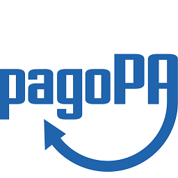



# pagoPA, Specifiche Attuative del Nodo dei Pagamenti-SPC versione 2.2

Specifiche Attuative del Nodo dei Pagamenti-SPC di pagoPA versione 2.2

pagoPA è un sistema per rendere più semplici, sicuri e trasparenti tutti i pagamenti verso la Pubblica Amministrazione.

Il sistema dei pagamenti elettronici a favore della Pubblica Amministrazione, il Sistema pagoPA, garantisce agli Utilizzatori finali (cittadini e imprese) di effettuare pagamenti elettronici alla Pubblica Amministrazione in modo sicuro e affidabile, semplice, in totale trasparenza nei costi di commissione e in funzione delle proprie esigenze.

### Come creare una segnalazione

Creare una segnalazione in Github é molto semplice e puoi farlo direttamente dal tuo account.

Se non hai già un account su github lo puoi creare registandoti
[https://github.com/join?source=login](https://github.com/join?source=login) usando sia la tua mail personale che aziendale.

Una volta registato, puoi aggiungere una nuova _issue_ cliccando sul pulsante indicato di seguito:

## Importante
Per favore, **non inserire dati sensibili dei cittadini**. Evita, per esempio, qualsiasi nome, cognome, o codice fiscale. Non ci sono problemi invece nell'inserire dei codici di richiesta o identificativi di scheda, per esempio.

Inoltre, **non inserire nessun dato relativo a configurazioni di sicurezza, quali certificati o password.**

Se devi inviarci un tracciato con dati sensibili invialo per email a [esercizio@pagopa.gov.it](mailto:esercizio@pagopa.gov.it) specificando nell'oggetto il codice del bug.

In ogni caso, ricordati di inserire:

   * Una descrizione accurata del comportamento o dell'errore, e come possiamo esservi utile.
   * La data del test, l'ambiente usato (test, pre-subentro, subentro), e codici di richiesta
     o identificativi che possiamo usare per verificare il sistema.
   * Chi siete e l'Ente Creditore/PSP per cui lavorate.
