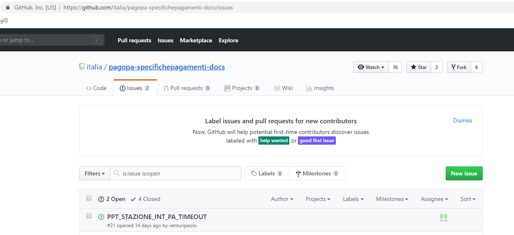

# pagoPA, Specifiche Attuative del Nodo dei Pagamenti-SPC versione 2.2.6

pagoPA è un sistema per rendere più semplici, sicuri e trasparenti tutti i pagamenti verso la Pubblica Amministrazione.

Il sistema dei pagamenti elettronici a favore della Pubblica Amministrazione, il Sistema pagoPA, garantisce agli Utilizzatori finali (cittadini e imprese) di effettuare pagamenti elettronici alla Pubblica Amministrazione in modo sicuro e affidabile, semplice, in totale trasparenza nei costi di commissione e in funzione delle proprie esigenze.

le specifiche attuative del nodo dei pagamenti sono descritte in formato markdown e suddivise nelle cartelle :
- sezione1-funzionamento-generale-del-sistema
- sezione2-gestione-posizione-debitoria
- sezione3-specifiche-tecniche
- sezione4-adesione-al-sistema

Ogni cartella contiene più file .md che rappresentano i diversi capitoli del documento ed un file index.rst che rappresenta l'indice della sezione.
Ogni file markdown non contiene immagini/diagrammi ma riferimenti ad essi.

La cartella *puml-diagrams* contiene tutti gli schemi UML in formato PlantUML che vengono geneati nella cartella *diagrams* ed utilizzati all'interno del documento.
La cartella *images* contiene tutte le immagini utilizzate nel documento.

## Come aggiornare la documentazione

Per modificare la documentazione, esegui *commit* sul relativo capitolo inserendo un messaggio esplicativo della modifica ed eventualmente facendo riferimento ad un *issue*
Per fare riferimento ad un diagramma utilizza il percorso *../diagrams/<nome-file-puml>.png*
Per fare riferimento ad un immagine  utilizza il percorso *../images/<nome-file-img>*

Per modifica un diagramma , modifica ( o aggiungi ) il relativo file .puml all'interno della cartella *puml-diagrams*
Per modificare un immagine, modifica ( o aggiungi) il relativo file all'interno della cartella *images*

### pubblicazione DocsItalia
Le Specifiche attuative sono disponibili anche su docsItalia il quale utilizza il formato rst.
su docsItalia viene pubblicato tutto il contenuto della cartella *_docs*

Per generare la documentazione da pubblicare su docsItalia utilizzate *npm start* verranno generati i diagrammi,le immagini ed i relativi documenti rst convertiti da markdown.

bisogna poi eseguire commit dei file aggiornati.

## Come creare una segnalazione

Creare una segnalazione in Github é molto semplice e puoi farlo direttamente dal tuo account.

Se non hai già un account su github lo puoi creare registandoti
[https://github.com/join?source=login](https://github.com/join?source=login) usando sia la tua mail personale che aziendale.

Una volta registato, puoi aggiungere una nuova segnalazione _(New issue)_ cliccando sul pulsante verde indicato di seguito:

## Importante
Per favore, **non inserire segnalazioni riguardanti pagamenti**. Evita, per esempio, qualsiasi nome, cognome, o codice fiscale.

Inoltre, **non inserire nessun dato relativo a configurazioni di sicurezza, quali certificati o password.**

In ogni caso è opportuno inserire una descrizione accurata della tematica che si vuole segnalare.

