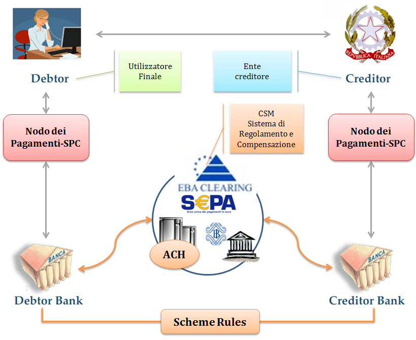
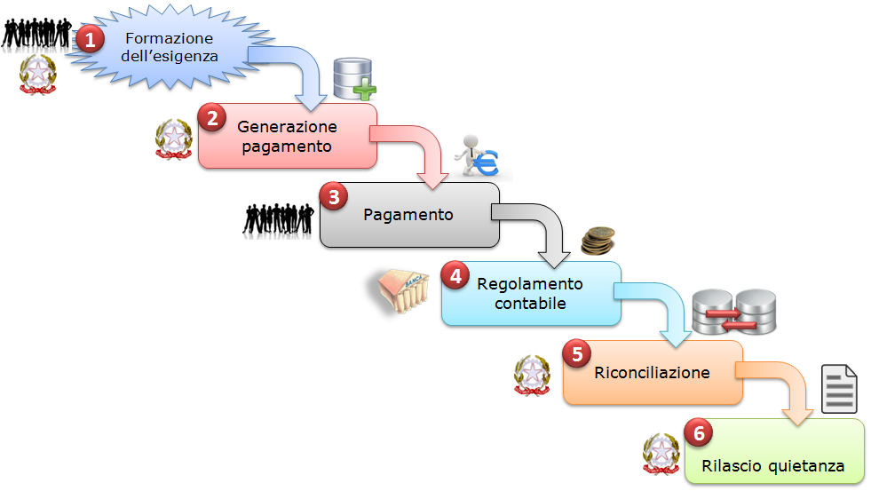

+-----------------------------------------------------------------------+
| |AGID_logo_carta_intestata-02.png|                                    |
+-----------------------------------------------------------------------+

+------------------------------------------+
| **Capitolo 1. MODELLO DI FUNZIONAMENTO** |
+------------------------------------------+

Modello di funzionamento
========================
.. _Modello di funzionamento:

|image1|

**Figura** **1 – EPC Four Corners model**

Il modello di funzionamento del Sistema fa riferimento ai principi del
*Four Corners* *model* definito dall’European Payment Council ed è
riportato nel diagramma di Figura 1, nel quale l’infrastruttura
costituita dal Nodo dei Pagamenti-SPC si pone quale facilitatore del
colloquio con i prestatori di sevizi di pagamento.

Il perfezionamento delle operazioni tra banche, evidenziato in arancio
nel diagramma, avviene attraverso il sistema di regolamento e
compensazione (CSM) utilizzando le regole SEPA.

Il sistema supporta anche altri tipi di operazioni di pagamento che
risultano dal collegamento tra più servizi di pagamento o tra servizi di
pagamento e altre operazioni ad essi contigue, così come definito dal
Provvedimento Banca d’Italia del 5 luglio 2011 in materia di diritti e
obblighi delle parti nei servizi di pagamento (cfr. articolo 2.1.2 di
detto provvedimento).

Attori e ruoli del Sistema pagoPA
---------------------------------
.. _Attori e ruoli del Sistema pagoPA:

Nello schema di Figura 1 sono evidenziati gli attori che partecipano al
processo di pagamento e che svolgono i seguenti ruoli:

+-----------------------------------+-----------------------------------+
| **Utilizzatore finale**           | Rappresenta il privato cittadino, |
|                                   | professionista, impresa, che      |
| **(Debtor)**                      | effettua pagamenti a favore della |
|                                   | Pubblica Amministrazione con      |
|                                   | modalità informatiche. L’identità |
|                                   | dell’utilizzatore finale può      |
|                                   | essere determinata con modalità   |
|                                   | informatiche (tipicamente SPID)   |
|                                   | per accedere ai servizi           |
|                                   | informatici dell’Ente Creditore.  |
|                                   |                                   |
|                                   | Nell’ambito del processo di       |
|                                   | pagamento si distingue il ruolo   |
|                                   | del **soggetto debitore**, cioè   |
|                                   | colui che ha contratto un debito  |
|                                   | a favore dell’Ente Creditore,     |
|                                   | ovvero effettua un pagamento di   |
|                                   | sua iniziativa per ottenere a un  |
|                                   | servizio o una certificazione.    |
|                                   | Nel rapporto con Ente Creditore   |
|                                   | si può presumere che              |
|                                   | l’utilizzatore finale sia il      |
|                                   | soggetto debitore                 |
|                                   |                                   |
|                                   | Si distingue infine il *soggetto* |
|                                   | *versante*, ovvero come colui     |
|                                   | accede ai servizi informatici dal |
|                                   | Prestatore dei Servizi di         |
|                                   | Pagamento, e dispone il pagamento |
|                                   | a favore dell’Ente Creditore.     |
+-----------------------------------+-----------------------------------+
| **Ente Creditore**                | Soggetto a cui l’utilizzatore     |
|                                   | finale richiede il servizio e che |
| **(Creditor)**                    | nei confronti del quali si        |
|                                   | configura come “creditore” per le |
|                                   | somme a vario titolo da questi    |
|                                   | dovute.                           |
|                                   |                                   |
|                                   | L’Ente Creditore, che identifica  |
|                                   | il soggetto pagatore e la causale |
|                                   | del pagamento, offre il servizio  |
|                                   | tramite il Nodo dei Pagamenti-SPC |
|                                   | a cui accede direttamente o       |
|                                   | tramite un soggetto pubblico o    |
|                                   | privato, quale intermediario      |
|                                   | tecnologico nei confronti         |
|                                   | dell’Ente Creditore .             |
+-----------------------------------+-----------------------------------+
| **Prestatore di Servizi di**      | È il soggetto, abilitato dalle    |
| **Pagamento**                     | norme vigenti in materia, ad      |
|                                   | eseguire le richieste di          |
| **(Debtor e Creditor Bank)**      | pagamento in via elettronica ed a |
|                                   | restituire la ricevuta            |
|                                   | elettronica di avvenuto           |
|                                   | pagamento/incasso.                |
|                                   |                                   |
|                                   | Il PSP offre i propri servizi di  |
|                                   | pagamento mettendo a disposizione |
|                                   | direttamente o tramite terze      |
|                                   | parti (intermediari) i canali di  |
|                                   | pagamento, fisici e telematici,   |
|                                   | su cui l’utilizzatore finale può  |
|                                   | effettuare l’operazione.          |
|                                   |                                   |
|                                   | In questo contesto il PSP può     |
|                                   | svolgere anche, sulla base di     |
|                                   | appositi accordi con l’ente,      |
|                                   | funzioni di “Incasso” per conto   |
|                                   | dello stesso e provvedere,        |
|                                   | laddove richiesto, al successivo  |
|                                   | riversamento delle somme          |
|                                   | percepite sui conti di tesoreria  |
|                                   | che l’Ente Creditore detiene      |
|                                   | presso il PSP dell’Ente           |
|                                   | Creditore.                        |
+-----------------------------------+-----------------------------------+

Nell’ambito del modello sopra esposto assumono particolare rilevanza la
figura dell’istituto tesoriere e quella di “intermediario tecnologico”.

Istituto tesoriere dell’Ente Creditore
~~~~~~~~~~~~~~~~~~~~~~~~~~~~~~~~~~~~~~
.. _Istituto tesoriere:

È il PSP che, nel rispetto delle normative vigenti, svolge le proprie
funzioni di Tesoreria o di Cassa nei confronti dell’Ente Creditore e può
non coincidere con il PSP dell’Ente Creditore stesso.

L’utilizzo dell’infrastruttura del Nodo dei Pagamenti-SPC non altera in
alcun modo i rapporti esistenti tra l’Ente Creditore ed il proprio
istituto tesoriere.

Intermediari tecnologici e partner tecnologici
~~~~~~~~~~~~~~~~~~~~~~~~~~~~~~~~~~~~~~~~~~~~~~
.. _Intermediari tecnologici e partner tecnologici:

Gli Enti Creditori possono offrire il servizio e accedere al Nodo dei
Pagamenti-SPC anche attraverso un intermediario o un partner.

Un Intermediario tecnologico è un soggetto aderente al Nodo dei
Pagamenti-SPC come Ente Creditore (ad esempio: Regione), che quindi ha
già accettato e si è obbligato al rispetto delle Linee Guida e dei
relativi allegati e che risulta, altresì, responsabile, nei confronti di
AgID, delle attività tecniche per l’interfacciamento con il Nodo dei
Pagamenti-SPC.

Viceversa, il Partner tecnologico è un mero fornitore dell’Ente
Creditore utilizzato in via strumentale per l’esecuzione delle attività
tecniche per l’interfacciamento con il NodoSPC, ferma restando la
responsabilità nei confronti di AgID in capo all’Ente Creditore. Si
precisa che AgID esclude l’adesione al Nodo dei Pagamenti-SPC da parte
del Partner tecnologico in quanto tale.

Si precisa che l’utilizzo di un particolare Intermediario tecnologico o
Partner tecnologico può essere limitato ad una parte delle attività
dell’Ente Creditore, mentre le rimanenti attività possono essere
gestiste da un altro soggetto Intermediario e/o Partner oppure in
proprio dall’ente stesso: possono cioè coesistere situazioni miste,
nelle quali i servizi sono erogati da una molteplicità di soggetti,
compreso l’Ente Creditore, sempre nel rispetto delle Linee guida.

Anche i PSP possono utilizzare degli intermediari per connettersi al
NodoSPC o per offrire i propri servizi di pagamento; tali soggetti
possono essere rappresentati da altri prestatori di servizi di pagamento
ovvero da circuiti o consorzi costituiti in ambito finanziario.

Rimangono, comunque, inalterate le responsabilità di Ente Creditore e
PSP nei confronti delle proprie controparti diverse dall’AgID e, in
particolare, degli utilizzatori finali.

Dominio dei Pagamenti dell’Ente Creditore
-----------------------------------------
.. _Dominio dei Pagamenti dell’Ente Creditore:

Il sistema complessivo - formato dalla comunità di Enti Creditori, PSP
ed eventuali gestori di pubblici servizi aderenti e dai loro
intermediari tecnologici, che possono accedere ed utilizzare il Servizio
- costituisce il “**Dominio dei Pagamenti dell’Ente Creditore**”
(più brevemente Dominio). Implicitamente con il termine di Dominio ci si
riferisce anche alle componenti tecnico-organizzative di tali attori.

L’utilizzo dei servizi messi a disposizione dal Nodo dei Pagamenti-SPC è
attivato attraverso apposite procedure rese disponibili sul sito
dell’Agenzia per l’Italia Digitale. In particolare:

-  le pubbliche amministrazioni sottoscrivono con l’Agenzia specifiche
   lettere di adesione;

-  i gestori di pubblici servizi aderiscono su base volontaria al Nodo
   dei Pagamenti-SPC sottoscrivendo con l’Agenzia specifici Protocolli
   di adesione;

-  i prestatori di servizi di pagamento sottoscrivono con l’Agenzia per
   l’Italia Digitale, sempre su base volontaria, appositi Accordi di
   Servizio.

Lo schema di tali atti è riportato nella Sezione IV “Ruoli e
responsabilità nell’utilizzo del Nodo dei Pagamenti-SPC” nel quale sono
descritte anche le procedure di accreditamento degli Enti Creditori e
dei prestatori di servizi di pagamento.

Come già anticipato, ogni Ente Creditore e PSP aderente può, per lo
svolgimento delle attività tecniche, utilizzare intermediari dei quali
si rendono direttamente responsabili.

L’utilizzo di detti intermediari tecnologici comporta - ai fini del
corretto indirizzamento - la necessità di dover distinguere tra Ente
Creditore (o PSP) ed intermediario da questi utilizzato in fase di
scambio dei flussi, distinguendo tra mittente o destinatario logico di
un flusso (l’Ente Creditore o il PSP) dal suo tramite tecnico
(l’intermediario in qualità di mittente o destinatario fisico).

Tale utilizzo è subordinato alla preventiva comunicazione all’Agenzia
per l’Italia Digitale (ai fini del corretto popolamento della Tabella
delle controparti, `cfr. § 4.2.1 <../09-Capitolo_4/Capitolo4.rst#tabella-delle-controparti>`_) ed al riconoscimento da parte del Nodo
dei Pagamenti-SPC.

Nel Dominio, le attività di pertinenza di ogni soggetto sono effettuate
conformemente ai requisiti di riservatezza e di protezione da accessi
non autorizzati.

Siti e portali degli Enti Creditori
~~~~~~~~~~~~~~~~~~~~~~~~~~~~~~~~~~~
.. _Siti e portali degli Enti Creditori:

I siti ed i portali, attraverso i quali gli Enti Creditori mettono a
disposizione le informazioni per effettuare i pagamenti ed i relativi
servizi devono essere autenticati con procedure di validazione avanzata
(quali, ad esempi, certificati SSL con Extended Validation emessi da
Autorità di Certificazione riconosciute).

Siti e portali delle pubbliche amministrazioni
~~~~~~~~~~~~~~~~~~~~~~~~~~~~~~~~~~~~~~~~~~~~~~
.. _Siti e portali delle pubbliche amministrazioni:

Gli indirizzi internet dei servizi dedicati ai pagamenti devono essere
inoltre pubblicati sull'Indice delle Pubbliche Amministrazioni
(IPA [1]_) istituito con il DPCM del 31 ottobre 2000 recante le regole
tecniche per il protocollo informatico.

Si ricorda, altresì, che i siti Web di cui all'art. 3, comma 1, della
Legge 9 gennaio 2004, n. 4 devono rispettare i requisiti di
accessibilità previsti dall'Allegato A del DM 8 luglio 2005 [2]_,
rispettando, tra l'altro, il punto 3 dei criteri di conformità (Processi
completi: quando un servizio è erogato mediante un processo che si
sviluppa su più pagine web allora tutte le pagine web ad esso relative
devono essere conformi, anche quando tali pagine si trovino su siti
diversi). Per ulteriori riferimenti, consultare la sezione accessibilità
del sito dell’Agenzia per l'Italia Digitale.

Utilizzatori finali
~~~~~~~~~~~~~~~~~~~
.. _Utilizzatori finali:

Gli utilizzatori finali non sono membri del Dominio: pertanto il loro
riconoscimento e l’abilitazione ad effettuare attività che
determineranno l’invocazione dei Servizi di Nodo è a cura dei soggetti
(Ente Creditore, PSP e/o intermediari da questi utilizzati) che erogano
i servizi applicativi resi disponibili a tali utilizzatori finali.

A Tal fine AgID rende disponibile SPID (Sistema Pubblico di Identità
Digitale).

Governance del sistema
----------------------
.. _Governance del sistema:

Stante la valenza infrastrutturale dell’iniziativa, la guida ed il
controllo del sistema (*governance*) sono affidati ad organismi
pubblici, in particolare:

-  **l’Agenzia per l’Italia Digitale** assicura la gestione del sistema
   attraverso la definizione di regole e standard, definisce
   l’elenco delle Pubbliche Amministrazioni e dei PSP partecipanti
   al sistema, provvede alla gestione ed al monitoraggio
   dell’infrastruttura;

-  **il Comitato interministeriale di coordinamento**, evoluzione del
   comitato SIPA [3]_, al quale partecipano, oltre all’Agenzia per
   l’Italia Digitale, il Ministero dell’economia e delle finanze e
   la Banca d’Italia, verifica:

-  le tipologie di operazioni adottate dalle amministrazioni;

-  l’applicazione delle condizioni economiche;

-  le richieste di partecipazione dei PSP al sistema;

-  l’adozione degli standard SEPA.

Ciclo di vita del Pagamento
---------------------------
.. _Ciclo di vita:

Nell’ambito delle relazioni tra l’utilizzatore finale e gli Enti
Creditori, la necessità di effettuare pagamenti a favore di questi
ultimi è sempre associata a procedimenti amministrativi che prevedono il
rispetto di regole per il loro corretto svolgimento (ad esempio: la
verifica di prerequisiti) e seguono un preordinato “Ciclo di vita” che
può essere rappresentato nella Figura 2.

|image2|

**Figura** **2 - Ciclo di vita del pagamento**

L’esigenza del pagamento può nascere sulla base di un bisogno
dell’utilizzatore finale che necessita, ad esempio, di un servizio da
parte dell’ente ovvero quando quest’ultimo deve richiedere
all’utilizzatore finale l’estinzione di un debito creatosi nei suoi
confronti: ad esempio il pagamento di una multa o di un’ammenda.

Questa esigenza si concretizza attraverso la generazione di un insieme
di informazioni che l’Ente Creditore deve memorizzare in appositi
archivi per la successiva fase di riconciliazione e che permettono
l’effettuazione del pagamento stesso.

Una volta completata la fase di esecuzione del pagamento, si veda il
successivo paragrafo 1.5, si procede al regolamento contabile
dell’operazione tra i prestatori di servizi di pagamento, con modalità
diverse a seconda dello strumento di pagamento attraverso il quale viene
effettuato il versamento stesso, che determina anche le modalità di
riversamento presso il PSP dell’Ente Creditore.

Il “ciclo di vita” si conclude con le fasi relative alla riconciliazione
del pagamento presso l’Ente Creditore, che rilascia - se previsto – la
relativa quietanza.

In questa descrizione del “ciclo di vita” di pagamento l'ordine delle
fasi è puramente indicativo e può variare a seconda dello scenario e
della tipologia di servizio al quale si riferisce il pagamento stesso.

Processo di pagamento
---------------------
.. _Processo di pagamento:

L’esecuzione di pagamenti telematici prevede l’interazione e
l’interoperabilità (realizzata tramite tecnologia *Web service*) tra i
sistemi informativi dei vari attori aderenti al Dominio. In tale schema
il Nodo dei Pagamenti-SPC si configura come piattaforma che rende
disponibili funzioni per l’interscambio dei flussi di dati, mentre le
funzionalità per la gestione dei pagamenti dovranno essere rese
disponibili dai partecipanti al Dominio, ognuno secondo il proprio
ruolo.

Il Nodo dei Pagamenti-SPC dovrà essere pertanto in grado di gestire
diversi *workflow* applicativi (`vedi successivo capitolo 2 <../07-Capitolo_2/Capitolo2.rst>`_) che però, in
tutti i casi, prevedono lo scambio di oggetti contenenti le informazioni
necessarie a garantire la corretta gestione dei processi.

Oggetti scambiati
~~~~~~~~~~~~~~~~~
.. _Oggetti scambiati:

Nei ”*workflow*” applicativi gestiti dal Nodo dei Pagamenti-SPC
(`vedi capitolo 2 <../07-Capitolo_2/Capitolo2.rst>`_) è previsto lo scambio di oggetti applicativi
costituiti da documenti informatici, in formato di file XML, le cui
specifiche di dettaglio sono riportate nel `Capitolo 5 <../11-Capitolo_5/Capitolo5.rst>`_ del presente
documento. Assumono particolare rilevanza le seguenti strutture
standardizzate:

-  *Richiesta Pagamento Telematico* (da ora in avanti RPT) che è emessa
   dall’Ente Creditore e definisce gli elementi necessari a
   caratterizzare il pagamento da effettuare;

-  *Ricevuta Telematica* (da ora in avanti RT), restituita da un PSP a
   fronte di pagamento individuato da una RPT, che definisce gli
   elementi necessari a qualificare l’esito del pagamento richiesto;

-  *Richiesta Revoca* (da ora in avanti RR) che è emessa dall’ente
   interessato e serve a chiedere alla controparte la revoca di una
   RT o lo storno di un pagamento;

-  *Esito Revoca* (da ora in avanti ER) che è emessa dall’ente cui è
   stata inviata una RT e serve a fornire alla controparte l’esito della
   revoca di una RT o dello storno di un pagamento.

Ogni RPT e la relativa RT possono contenere rispettivamente le
informazioni attinenti da 1 a 5 pagamenti / esiti a favore di uno stesso
Ente Creditore; tali oggetti, insieme alle RR ed ER, sono identificati a
livello nazionale dalla seguente coppia di informazioni:

-  codice fiscale dell’Ente Creditore che invia la RPT,

-  codice *Identificativo Univoco Versamento* (IUV, vedi paragrafo
   successivo) che viene assegnato dal singolo Ente Creditore che invia
   la RPT.

Nell’ambito delle funzionalità esposte dal Nodo dei Pagamenti-SPC sono
previsti ulteriori oggetti applicativi scambiati, tra lo stesso NodoSPC
ed i soggetti aderenti, che riguardano le Strutture dati di supporto ed
i Servizi applicativi opzionali (`vedi anche capitolo 4 <../09-Capitolo_4/Capitolo4.rst>`_).

Identificativo Univoco di Versamento
~~~~~~~~~~~~~~~~~~~~~~~~~~~~~~~~~~~~
.. _Identificativo Univoco di Versamento:

Il codice IUV è assegnato dall’Ente Creditore attraverso le regole di
generazione previste nella Sezione I del documento allegato A alle .

Il meccanismo di generazione, che dovrà essere implementato a cura
dell’Ente Creditore, deve essere strutturato in modo tale che non possa
esistere nel corso del tempo un altro codice IUV eguale all’interno
dello stesso ente.

Nello scenario principale di ogni *workflow* la generazione del codice
IUV si rende necessaria allorché una RPT deve essere resa disponibile a
fronte di una richiesta di pagamento effettuata dall’utilizzatore finale
ovvero debba essere associata ad un pagamento che l’Ente Creditore
richiede all’utilizzatore finale.

Il codice IUV costituisce l’elemento attraverso il quale l’Ente
Creditore riceve tutte le informazioni che caratterizzano il pagamento,
permettendo di eseguire eventuali controlli e verifiche relativi e/o
propedeutici all’erogazione del servizio.

Flusso di processo
~~~~~~~~~~~~~~~~~~
.. _Flusso di processo:

L’utilizzatore finale dispone il pagamento per mezzo di una RPT, tramite
sportelli fisici o telematici messi a disposizione dall’Ente Creditore,
da eventuali intermediari dallo stesso o direttamente da un PSP (o dai
suoi intermediari).

Indipendentemente dal canale utilizzato, l’esecutore del pagamento è un
PSP scelto direttamente dall’utilizzatore finale: il PSP entra in
possesso della RPT messa a disposizione dall’Ente Creditore (o dal suo
intermediario) attraverso il Nodo dei Pagamenti-SPC, esegue il pagamento
richiesto ed emette una RT, che certifica l’esito del pagamento.

La RT è veicolata attraverso il Nodo dei Pagamenti-SPC e consegnata
all’Ente Creditore (o al suo intermediario) ed è rilasciata
all’utilizzatore finale.

Gli Enti Creditori (e i loro intermediari) si avvalgono della
piattaforma tecnologica del Nodo dei Pagamenti-SPC solo per scambiare
con i PSP (e i loro intermediari) i flussi informativi costituiti dalle
strutture dati standardizzate (RPT e RT) necessarie all’istradamento del
pagamento informatico.

L’effettiva esecuzione dei pagamenti, instradati da tale scambio
informativo, è gestita utilizzando i circuiti di pagamento esistenti,
esterni al Nodo dei Pagamenti-SPC.

Compiti degli Enti Creditori
~~~~~~~~~~~~~~~~~~~~~~~~~~~~
.. _Compiti degli Enti Creditori:

Al fine di gestire nel modo migliore l’iter del processo di pagamento
gli Enti Creditori hanno l’obbligo di rendere disponibili direttamente
all’utilizzatore finale, attraverso opportuni servizi informatici
offerti direttamente o tramite intermediari:

-  le modalità per effettuare i pagamenti informatici e il trasferimento
   di ogni altra informazione che abbia il fine di agevolarne
   l’esecuzione;

-  l’accesso all’archivio delle RT relativa ad ogni pagamento da questi
   disposto. Fino a prescrizione, è fatto obbligo all’Ente Creditore
   di conservare le informazioni di ogni RT in modo da poterla
   riprodurre a richiesta anche su supporti cartaceo;

-  le modalità di gestione, nel rispetto della normativa vigente, di
   possibili flussi secondari (reclami, rimborsi, storni), anche
   usufruendo delle funzionalità accessorie messe a disposizione dalla
   piattaforma.

Integrità e non ripudiabilità della RT
~~~~~~~~~~~~~~~~~~~~~~~~~~~~~~~~~~~~~~
.. _Integrità e non ripudiabilità della RT:

Laddove il “*workflow* del procedimento amministrativo consenta
all’Ente Creditore di ricevere il documento informatico RT dal
prestatore di servizi di pagamento direttamente per il tramite del Nodo
dei Pagamenti-SPC, si evidenzia, sin da ora, agli Enti Creditori che non
potranno sussistere incertezze circa l’integrità e la non ripudiabilità
del documento stesso poiché il *workflow* del pagamento si sviluppa
all’interno di un “circuito di trust” senza alcuna possibilità di
ingerenza e/o manomissione da parte di terzi (`vedi successivo paragrafo
2.6 <../07-Capitolo_2/Capitolo2.rst#identificazione-dellutilizzatore-finale>`_); da qui l’inopportunità di garantire l’integrità e non
ripudiabilità del documento informatico RT attraverso la firma digitale
o la firma elettronica qualificata dello stesso da parte del prestatore
di servizi di pagamento.

Fatta la precisazione sopra esposta, resta ferma la facoltà in capo
all’Ente Creditore di richiedere al PSP di sottoscrivere con firma
digitale o firma elettronica qualificata il documento Ricevuta
Telematica, indicando tale vincolo in un apposito elemento della RPT.

**NB: Tale possibilità è deprecata e non potrà essere attuata dagli Enti**
**Creditori aderenti al sistema pagoPA durante la vigenza delle presenti**
**specifiche.**

**Gli EC che adottano tale modalità dovranno predisporre un piano in**
**vista della dismissione.**

Trasparenza nei confronti degli utilizzatori finali
~~~~~~~~~~~~~~~~~~~~~~~~~~~~~~~~~~~~~~~~~~~~~~~~~~~
.. _Trasparenza nei confronti degli utilizzatori finali:

La trasparenza dell’operazione di pagamento deve essere garantita nei
confronti dell’utilizzatore finale, pertanto l’Ente Creditore deve
segnalare a quest’ultimo l’importo che serve a remunerare il PSP per il
servizio fornito: a tal fine il NodoSPC mette a disposizione apposite
funzioni che consentono:

-  ai PSP di comunicare tali costi, differenziati per strumento e/o
   canale di pagamento;

-  agli Enti Creditori di reperire in modo centralizzato tali
   informazioni;

-  agli utilizzatori finali di scegliere il servizio che più si addice
   alle proprie esigenze.

In merito a quest'ultimo punto, si fa presente che il NodoSPC mette a
disposizione degli Enti Creditori una funzione centralizzata che dà agli
utilizzatori finali la possibilità di sperimentare, nella scelta del
servizio di pagamento, la stessa *user experience* in modalità unificata
a livello nazionale ( `vedi il § 2.1.3 <../07-Capitolo_2/Capitolo2.rst#scelta-del-servizio-di-pagamento-da-parte-dellutilizzatore-finale>`_). Tale funzione mantiene inalterata
la facoltà in capo al PSP di stabilire commissioni specifiche e/o di
maggior favore per il singolo utilizzatore finale. In merito, si precisa
che resta in capo al PSP l’onere di promuovere e pubblicizzare alla
propria clientela e attraverso i propri canali ogni attività di
*pricing* differente da quella esposta a livello nazionale dalla
funzione centralizzata del NodoSPC.

A tale proposito, si ricorda che è altresì onere del PSP individuare, se
del caso, le modalità con cui indicare utilizzatore finale l’importo
della commissione specifica e/o di maggior favore praticata all’atto
dell’esecuzione del singolo pagamento.

Funzioni accessorie di controllo e di verifica
----------------------------------------------
.. _Funzioni accessorie di controllo e di verifica:

Il Sistema prevede modalità di controllo focalizzate sulla verifica
della corretta applicazione degli Standard di Servizio (p.e. norme di
comportamento, livelli di Servizio garantiti, ecc.) e dei processi che
da questi derivano.

A supporto di tali funzioni, ogni soggetto (Enti Creditori e PSP
aderenti, NodoSPC) deve registrare all’interno del proprio sistema
(dominio del soggetto) ogni singolo evento significativo dal punto di
vista applicativo al fine di tenerne traccia.

L’insieme di tali registrazioni, indipendentemente dalle peculiarità
tecniche delle soluzioni adottate da ciascun soggetto che definisce in
autonomia tali aspetti, costituisce il “Giornale degli Eventi” (`vedi
paragrafo 3.2.10 <../08-Capitolo_3/Capitolo3.rst#giornale-degli-eventi>`__) che riporta gli estremi di tutte le situazioni
verificatesi nell’esecuzione dell’operazione di pagamento nelle varie
tratte coinvolte (tra Enti Creditori e NodoSPC, nel NodoSPC, tra NodoSPC
e PSP).

L’elenco delle informazioni minime che ogni soggetto (Enti Creditori e
PSP aderenti, Nodo dei Pagamenti-SPC) deve registrare nel proprio
“Giornale degli Eventi” è indicato nel `capitolo 5.3.11 <../11-Capitolo_5/Capitolo5.rst#catalogo-dei-servizi>`_ della Sezione II.
Tali informazioni devono essere fornite ai soggetti interessati sul
supporto definito dal soggetto che registra tali informazioni. Il Nodo
dei Pagamenti-SPC fornisce tali informazioni su supporto cartaceo e file
XML.

Sicurezza e conservazione
-------------------------
.. _Sicurezza e conservazione:

Tutte le informazioni trattate nell’ambito del Sistema saranno gestite
dai diversi attori che interagiscono con il Nodo dei Pagamenti-SPC,
ciascuno nell’ambito della propria competenza e responsabilità, nel
rispetto delle regole definite dal CAD in materia di conservazione dei
documenti informatici e di sicurezza dei dati.

In merito, si rammenta che la conservazione è finalizzata a proteggere
nel tempo i documenti informatici e i dati ivi contenuti, assicurandone,
tra l’altro, la sicurezza, l'integrità e la non modificabilità, al fine
di preservare il valore probatorio del documento informatico e, nel caso
specifico di pagoPA, della transazione di pagamento.

Considerato che la quietanza, fornita dall’Ente Creditore
all’utilizzatore finale, è formata sulla base degli oggetti scambiati
attraverso il Nodo dei Pagamenti-SPC, si ritiene che, al fine di
conservare traccia dell’intera transazione di pagamento, sia opportuno
conservare a norma sia la Ricevuta Telematica, sia la Richiesta di
Pagamento Telematico e non anche il Flusso di Rendicontazione (`per il
dettaglio su tali oggetti si veda il Capitolo 2 <../07-Capitolo_2/Capitolo2.rst>`_).

`Torna all'indice <../../index.rst>`__

.. [1]
   Vedi http://www.indicepa.gov.it/

.. [2]
   Aggiornato con DM 20 marzo 2013, recante "Modifiche all'allegato A
   del decreto 8 luglio 2005 del Ministro per l'innovazione e le
   tecnologie, recante: «Requisiti tecnici e i diversi livelli per
   l'accessibilità agli strumenti informatici»" pubblicato in GU Serie
   Generale n.217 del 16-9-2013

.. [3]
   `Vedi il paragrafo Definizioni e Acronimi <../02-DEFINIZIONI_E_ACRONIMI/DEFINIZIONI_E_ACRONIMI.rst>`__

.. |AGID_logo_carta_intestata-02.png| image:: ../media/header.png
   :width: 5.90551in
   :height: 1.30277in

