+-----------------------------------------------------------------------+
| |AGID_logo_carta_intestata-02.png|                                    |
+-----------------------------------------------------------------------+

+---------------------------------------------------+
| **Capitolo 2. MODELLI DEL PROCESSO DI PAGAMENTO** |
+---------------------------------------------------+

Modelli del processo di pagamento
=================================
.. _Modelli del processo di pagamento:

Gli incassi che un Ente Creditore deve gestire posso essere distinti
secondo due tipiche categorie:

-  Pagamenti su iniziativa del debitore (o spontanei): nei quali
   l’utilizzatore finale, che deve effettuare, a vario titolo, un
   versamento a favore dell’Ente Creditore si attiva in via autonoma
   ed utilizza gli strumenti e i canali di pagamento disponibili;

-  Incassi su iniziativa dell’Ente Creditore: è il caso in cui l’Ente
   Creditore crea una posizione debitoria e richiede un pagamento
   all’utilizzatore finale, mettendo a disposizione di quest’ultimo vari
   strumenti e canali di pagamento.

Tali modalità di incasso da parte degli Enti Creditori sono gestite
attraverso diversi *workflow* che gli utilizzatori finali possono
attivare accedendo alle funzioni messe a disposizione dagli Enti
Creditori ovvero attraverso dispositivi e funzioni dei PSP.

Si fa presente che, nella gestione di tali *workflow* occorre tenere in
considerazione i cosiddetti *Timeout*, ovvero i tempi massimi necessari
a definire che un processo di pagamento ha avuto termine con un esito
negativo, per i quali si rimanda al Capitolo 4 del documento “Indicatori di qualità per i Soggetti Aderenti” (`si veda
anche il § 12.6.1 </20-Capitolo_12/Capitolo12.rst#indicatori-di-qualità-del-nodo-dei-pagamenti-spc>`__ della Sezione IV).

I *workflow* di seguito descritti sono parte integrante delle
implementazioni previste nel Nodo dei Pagamenti-SPC (`vedi anche Sezione
III </14-SEZIONE_III/SEZIONE_III_-_SPECIFICHE_DI_INTERCONNESSIONE.rst>`__).

Processo di pagamento attivato presso l’Ente Creditore
------------------------------------------------------
.. _Processo di pagamento attivato presso l’Ente Creditore:

Rientrano in questa categoria di pagamenti quelli richiesti
dall’utilizzatore finale attraverso i siti web o *mobile app* degli Enti
Creditori. Il processo di pagamento attivato presso l’Ente Creditore
consente di gestire entrambe le modalità di incasso: spontanea e su
iniziativa dell’Ente Creditore.

Le attività a carico degli Enti Creditori per gestire il processo sono
rappresentate dalla realizzazione delle procedure di pagamento (sia in
termini organizzativi, che informatici); le procedure di pagamento
potranno essere più o meno strettamente integrate con i servizi cui
fanno riferimento.

Processo di pagamento con re indirizzamento on-line
~~~~~~~~~~~~~~~~~~~~~~~~~~~~~~~~~~~~~~~~~~~~~~~~~~~
.. _Processo di pagamento con re indirizzamento on-line:

Il *workflow* descritto, già denominato “Processo di pagamento con
esecuzione immediata” nelle precedenti versioni di questo documento,
prevede che l’autorizzazione del pagamento da parte dell’utilizzatore
finale sia governata dal Nodo dei Pagamenti-SPC che, in funzione della
modalità di pagamento scelta dall'utilizzatore finale, pilota il
processo di autorizzazione di esecuzione del pagamento; il rilascio
della relativa attestazione (RT) è contestuale alla richiesta effettuata
sul portale dell’Ente Creditore dall’utilizzatore finale cliente
(occasionale o abituale) del PSP.

|image1|

**Figura** **3 - Processo di pagamento con re indirizzamento on-line**

La principale novità introdotta in questo ambito è la componente POS
virtuale, esposta dal Nodo dei Pagamenti-SPC e deputata a raccogliere i
dati della carta di pagamento.

Tale novità è stata introdotta per aumentare il tasso di convergenza di
questo particolare servizio di pagamento, rimuovendo le cause di
abbandono individuate tramite analisi statistiche: la principale
risiedeva nella inusuale richiesta, incomprensibile per l’utilizzatore
finale, di individuare il soggetto PSP a cui affidare il ruolo di
*merchant* nel processo di pagamento che non trova corrispondenza nei
più diffusi sistemi di e-commerce.

Per ovviare a tale problema, fatti salvi i principi di trasparenza e
imparzialità fra i PSP, sarà il sistema pagoPA a compiere tale scelta,
sulla base di algoritmi pubblici progettati per indirizzare il
pagamento, laddove possibile, verso il PSP emittente della carta.

Tali algoritmi sono soggetti a modifiche e affinamenti nel tempo, e
verranno messi in esercizio da AgID anche senza preavviso, nel caso che
mutate condizioni di mercato lo richiedano in funzione del perseguimento
dello stesso obiettivo precedentemente dichiarato.

|image2|

**Figura** **4 – Sequence diagram del processo di pagamento con re indirizzamento on-line**

Con riferimento allo schema di Figura 1 a pagina 2 ed al *Sequence diagram*
di Figura 2, si descrivono i passi del processo di pagamento
(si tenga conto che con il termine RPT si intende includere anche il
carrello di RPT). Per illustrare il processo di pagamento in esame
utilizzeremo l’esempio specifico della modalità di incasso su iniziativa
dell’Ente Creditore:

1. l’utilizzatore finale, che ha ricevuto un avviso di pagamento, si
   collega al portale dell’EC, ricerca il codice IUV indicato
   sull'avviso stesso e compone il carrello con il pagamento che
   intende effettuare;

2. l’Ente Creditore, tramite i propri Servizi telematici, trasmette al
   Nodo dei Pagamenti-SPC la Richiesta di Pagamento Telematico (RPT)
   o il carrello di RPT;

3. l’utilizzatore finale viene indirizzato sul WISP (`vedi § 2.1.3 </07-Capitolo_2/Capitolo2.rst#scelta-del-servizio-di-pagamento-da-parte-dellutilizzatore-finale>`_) dove
   sceglie il servizio che intende utilizzare (PSP e canale di
   pagamento);

4. in funzione della scelta effettuata dall’utilizzatore finale:

   a. in caso di pagamento con carte, il NodoSPC invia al PSP selezionato
      la RPT, insieme alle commissioni applicate e alle indicazioni
      relative all’autorizzazione del pagamento;

   b. negli altri casi, il NodoSPC:

      i.  invia la RPT al PSP;

      ii. attiva il canale prescelto e, se del caso, ridirige
          l’utilizzatore finale sulle pagine messe a disposizione dal
          PSP (nei grafici “Front-End PSP”), dove questi esegue il
          pagamento;

   c. nel caso di non scelta dell'utente o di timeout sul WISP, il NodoSPC
      genera una o più RT negative e chiude il workflow;

5. l'utilizzatore finale è re-diretto su una “*Thank You page*” e
   conosce l’esito della transazione;

6. il PSP predispone la Ricevuta Telematica (RT ovvero il carrello di
   RT) e la invia attraverso il NodoSPC all'Ente Creditore;

7. l'utilizzatore finale è re-diretto sul portale dell’EC e può
   effettuare il download della ricevuta o della quietanza.

Sul portale dell’Ente Creditore devono essere messe a disposizione le
funzioni che permettono all’utilizzatore finale di interrogare lo stato
della sua richiesta di pagamento e scaricare copia analogica e/o
duplicato del documento informatico Ricevuta Telematica (RT.XML).

Negli schemi richiamati si è esemplificata la modalità di incasso “su
iniziativa dell’Ente Creditore” nella quale l'utente - avendo ricevuto
l'avviso di pagamento analogico o digitale - effettua la ricerca del
pagamento da effettuare sul portale dell'ente, essendo questo già stato
predeterminato a monte, quindi lo esegue con le modalità sopra esposte.
Il modello di pagamento in esame consente di gestire anche la modalità
di incasso cosiddetto “spontaneo”.

Il regolamento dei pagamenti effettuati con questo tipo di *workflow*
viene effettuato attraverso il bonifico bancario (SCT - SEPA *Credit Transfer*)
ed il bollettino di conto corrente postale.

Pagamenti tramite il circuito MyBank
~~~~~~~~~~~~~~~~~~~~~~~~~~~~~~~~~~~~
.. _Pagamenti tramite il circuito MyBank:

Nel caso che venga utilizzato il circuito e-commerce MyBank, che adotta
gli schemi OBeP (*On-line Banking ePayment*), si riproduce un caso
particolare dello stesso processo di pagamento descritto in precedenza.

Per ulteriori dettagli si rimanda al documento monografico “” pubblicato
sul sito dell'Agenzia (`vedi Appendice 2 <../25-APPENDICE2/APPENDICE2–TRANSAZIONI_MYBANK_ATTRAVERSO_IL%20NODO_DEI_PAGAMENTI_-_SPC.rst>`__).

Si segnala comunque che questa modalità di pagamento è soggetta a
restrizioni e può non essere sempre disponibile per tutte le tipologie
di pagamento.

Processo di pagamento con autorizzazione gestita dal PSP
~~~~~~~~~~~~~~~~~~~~~~~~~~~~~~~~~~~~~~~~~~~~~~~~~~~~~~~~
.. _Processo di pagamento con autorizzazione gestita dal PSP:

Questo *workflow*, già denominato “Processo di pagamento con esecuzione
differita” nelle precedenti versioni del presente documento, prevede che
l’autorizzazione del pagamento da parte dell’utilizzatore finale avvenga
mediante l’interazione con strumenti messi a disposizione dal PSP.

La componente WISP del NodoSPC innesca tale processo inoltrando la RPT,
in modo del tutto trasparente per l’Ente Creditore. I sistemi
informatici del PSP acquisiscono i dati del soggetto pagatore (o
versante se esiste) e procedono all’autenticazione dell’identità
dichiarata, autorizzando, se del caso, l’accesso ai sistemi di
pagamento.

L’esecuzione del pagamento ed il rilascio della relativa attestazione
(RT) avvengono in funzione delle modalità di autorizzazione del
pagamento adottate dal PSP. Si distingue quindi l’autorizzazione:

-  contestuale alla richiesta effettuata, in funzione dei livelli di
   servizio pattuiti con il PSP, se l’utilizzatore finale ha
   pre-autorizzato il pagamento (ad esempio: lettera di manleva o
   altro strumento contrattuale);

-  non contestuale, se l’autorizzazione viene rilasciata successivamente
   alla ricezione della RPT da parte del PSP, attraverso canali da
   questo messi a disposizione (ad esempio: home banking, notifica
   su app per smartphone o tablet, ecc.).

In ogni caso il PSP deve restituire la RT in tempi certi e comunicati al
proprio cliente prima del pagamento, in modo da consentire
all’utilizzatore finale di usufruire dei servizi per cui ha pagato.

|image3|

**Figura** **5 – Processo di pagamento con autorizzazione gestita dal PSP**

|image4|

**Figura** **6 - Sequence diagram del processo di pagamento con autorizzazione gestita dal PSP**

Lo schema di Figura 3 ed il *Sequence diagram* di Figura 4 illustrano
l’esempio della modalità di incasso “spontaneo”, cioè quella che nasce
da esigenze dell'utilizzatore finale eseguita con il modello di
pagamento in parola e si concretizza negli stessi passi previsti dal
*workflow* del “Processo di pagamento con re indirizzamento on-line” a
pagina 2, con piccole eccezioni: al passo 4, l'utilizzatore finale
sceglie PSP e canale di pagamento che non prevedono interazioni on-line
(nei grafici manca “Front-End PSP”), pertanto il *workflow* prevede:

1. l’utilizzatore finale si collega al portale dell’EC, cerca il
   servizio da pagare e compone il carrello con il pagamento che intende
   effettuare;

2. l’Ente Creditore trasmette al Nodo dei Pagamenti-SPC la Richiesta di
   Pagamento Telematico (RPT);

3. l’utilizzatore finale viene indirizzato sul WISP (`vedi § 2.1.3 <../07-Capitolo_2/Capitolo2.rst#scelta-del-servizio-di-pagamento-da-parte-dellutilizzatore-finale>`__), dove
   sceglie il Servizio che intende utilizzare (PSP e canale di
   pagamento);

4. l’utilizzatore finale sceglie un PSP e un canale di pagamento che non
   prevedono interazioni on-line [1]_:

5. invia la RPT al PSP;

6. l'utilizzatore finale è re-diretto sul portale dell'EC e informato
   che il suo pagamento è stato preso in carico dal PSP;

7. il PSP verifica condizioni per autorizzare il pagamento
   (pre-autorizzazione o altro, vedi sopra) e predispone la Ricevuta
   Telematica e la invia attraverso il NodoSPC all'Ente Creditore.

Nel caso di pre-autorizzazione del pagamento, resta salva la possibilità
per l’utilizzatore finale di revocare il consenso rilasciato al PSP ad
eseguire un’operazione di pagamento, in presenza delle condizioni
previste all’articolo 17 del Decreto legislativo n. 11/2010.

Il regolamento dei pagamenti effettuati con questo tipo di *workflow*
viene effettuato attraverso il bonifico bancario (SCT - SEPA Credit
Transfer) ed il bollettino di conto corrente postale.

Scelta del servizio di pagamento da parte dell'utilizzatore finale
~~~~~~~~~~~~~~~~~~~~~~~~~~~~~~~~~~~~~~~~~~~~~~~~~~~~~~~~~~~~~~~~~~
.. _Scelta del servizio di pagamento da parte dell'utilizzatore finale:

|image5|

**Figura** **7 – Check-out nel processo di pagamento attivato presso l’Ente Creditore**

Dall'analisi del flusso dei processi di pagamento sino qui illustrati, è
possibile sintetizzare nello schema di Figura 5 le varie fasi che
portano l'utilizzatore finale, una volta definito il servizio o il
pagamento di proprio interesse, a completare l'iter del procedimento:
quello che nel lessico *e-commerce* è definito come fase di
“*check-out*”, cioè il momento di scelta delle modalità di pagamento
e di esecuzione vera e propria della transazione finanziaria. Il
processo di scelta è attuato per mezzo della componente centralizzata -
di seguito indicata con l’acronimo WISP (*Wizard* Interattivo di Scelta
del PSP) - che permette all’utilizzatore finale di utilizzare la stessa
interfaccia utente in ogni circostanza.

Le pagine della componente WISP guidano l'utilizzatore finale alla
scelta del servizio di pagamento più conveniente, specificando in
successione modalità e PSP, fino a una conclusiva pagina riassuntiva che
permette di effettuare il pagamento.

I servizi offerti dai vari PSP aderenti al Nodo dei Pagamenti-SPC sono
proposti all’utilizzatore finale assicurando a tutti i PSP aderenti le
stesse opportunità di concorrenza, parità di trattamento e non
discriminazione.

Lo schema di Figura 5 - che si applica sia al modello di pagamento con
autorizzazione gestita *on-line*, sia al modello con autorizzazione
gestita dal PSP, senza necessità per l’EC di implementare diverse
modalità di gestione - mostra come, una volta scelta la modalità di
pagamento, il workflow si articola su due percorsi diversi: uno sulle
pagine del WISP stesso, l'altra sulle pagine messe a disposizione dal
PSP prescelto.

|image6|

**Figura** **8 – Percorso di scelta del PSP e del servizio di pagamento**

Per i pagamenti con carta (di credito o di debito) il *workflow* è reso
maggiormente performante perché sarà la componente WISP a selezionare,
sulla base del PAN (Primary Account Number identificativo univoco di una
carta), il PSP aderente a pagoPA.

Gli utenti registrati che utilizzano il servizio di scelta e
memorizzazione del pagamento messo a disposizione da AgID 
(`vedi successivo § 2.1.3.1 <../07-Capitolo_2/Capitolo2.rst#servizio-di-scelta-e-memorizzazione-del-pagamento>`__) saranno comunque liberi di modificare il PSP
abbinato alla propria carta accedendo alle funzioni offerte dalla
componente WISP.

Nello schema di Figura 6 è mostrato il percorso di scelta adottato per
il WISP, nel corso del quale possono essere applicati filtri circa
l'esposizione dei servizi offerti dai PSP in funzione del contenuto
della RPT (o del carrello di RPT) ricevuto.

Si noti, che, qualora l'utilizzatore finale non effettui alcuna scelta,
oppure si verifichi un timeout di sessione, il NodoSPC genererà una o
più RT negative, così come indicato nei precedenti paragrafi.

Servizio di scelta e memorizzazione del pagamento
~~~~~~~~~~~~~~~~~~~~~~~~~~~~~~~~~~~~~~~~~~~~~~~~~
.. _Servizio di scelta e memorizzazione del pagamento:

Le funzionalità del WISP mettono a disposizione del cittadino utente di
pagoPA ulteriori funzioni di supporto che consentono di memorizzare le
scelte di pagamento effettuate per poterle richiamare e riutilizzare
nelle successive occasioni. Oppure di eleggere una delle scelte come
predefinita così da avere un’esperienza quanto più possibile simile alla
modalità *one-click* tipica dei siti di *e-commerce*.

L’AgID, infatti, per l’erogazione dei servizi tecnici che consentono
agli utenti pagatori di eseguire un’operazione di pagamento, previo
accesso dal sito di un soggetto aderente al Sistema pagoPA, tratta
esclusivamente i seguenti dati personali:

1. il numero di cellulare indicato dall’utente pagatore al fine di
   ottenere il proprio User ID;

2. la password scelta dall’utente pagatore per poterla abbinare al User
   ID ed identificare l’utente pagatore all’atto della sua
   presentazione sul Sistema pagoPA;

3. gli attributi identificativi dell’utente pagatore messi a
   disposizione dallo SPID (Sistema Pubblico di Identità Digitale)
   ove l’utente pagatore si identifichi sul Sistema pagoPA tramite
   tale sistema di autenticazione in alternativa all’uso dei dati di
   cui ai punti 1 e 2 che precedono;

4. i dati del PSP selezionato dall’utente pagatore tra quelli abilitati
   ad operare sul sistema pagoPA;

5. i dati della carta di pagamento indicati al PSP selezionato
   dall’utente pagatore tra quelli abilitati ad operare sul sistema
   pagoPA;

6. l’indirizzo di posta elettronica indicato dall’utente pagatore per
   ricevere comunicazioni in merito alle operazioni di pagamento
   richieste tramite il Sistema pagoPA.

I dati personali raccolti saranno trattati per consentire agli utenti
delle pubbliche amministrazioni e degli altri soggetti aderenti al
Sistema pagoPA:

a. di eseguire on line e tramite il Sistema pagoPA le operazioni di
   pagamento attraverso i PSP abilitati ad operare sul Sistema
   pagoPA;

b. di registrarsi sul Sistema pagoPA e ottenere un profilo identificato
   da un proprio User ID e una propria password per la propria
   identificazione sul sistema pagoPA, al fine di potere beneficiare
   dei servizi accessori e strumentali che l’AgID mette a
   disposizione degli utenti che vogliano eseguire con maggiore
   facilitazione un pagamento elettronico sul sistema pagoPA;

c. di memorizzare sul Sistema pagoPA alcune specifiche informazioni
   inerenti le operazioni di pagamento e che sono necessarie per
   finalizzare l’operazione di pagamento stessa, al fine di evitare,
   per le operazioni di pagamento successive alla memorizzazione, di
   dovere inserire nuovamente le stesse informazioni, e
   segnatamente:

   i.  i dati di cui ai punti (5) e (6) che precedono sono obbligatori per
       l’erogazione in favore dell’utente pagatore del servizio di cui
       alla lettera [a] che precede;

   ii. mentre l’insieme dei dati di cui ai punti da (1) a (6) che precedono
       sono obbligatori per l’erogazione in favore dell’utente pagatore
       dei servizi di cui alle lettere [b] e [c] che precedono.

Pertanto, i dati personali raccolti saranno trattati esclusivamente per
consentire agli utenti delle pubbliche amministrazioni e degli altri
soggetti aderenti al Sistema pagoPA di richiedere e ottenere i servizi
di pagamento erogati dai PSP abilitati sul Sistema pagoPA, nonché per
richiedere e ottenere parimenti i servizi di identificazione e
memorizzazione erogati dal AgID sul Sistema pagoPA.

Il conferimento dei dati ed il trattamento degli stessi da parte di AgID
per tali finalità è dunque obbligatorio e non richiede un esplicito
consenso, pena l’impossibilità per l’AgID di erogare i servizi di cui
alle lettere a), b) e c) che precedono.

AgID non utilizzerà i dati personali conferiti per fornire informazioni
promozionali di ulteriori prodotti e servizi analoghi erogati da AgID o
dai PSP abilitati ad operare sul Sistema pagoPA e/o di servizi di terzi
fruibili attraverso la carta di pagamento, né per ricerche di mercato o
di rilevazione del grado di soddisfazione degli utenti pagatori sulla
qualità dei servizi erogati dal Sistema pagoPA, né per altre finalità di
verse da quelle specificatamente indicate alle lettere a), b) e c) che
precedono.

Si precisa che nella remota ipotesi in cui, per operazioni di pagamento
di specifiche servizi (ad esempio: pagamento di ticket sanitari o quote
associative ad associazioni a carattere religioso, filosofico, etc),
AgID venisse in possesso di dati che la legge definisce come
“sensibili”, AgID non tratterà in alcun modo tali dati sensibili, in
quanto irrilevanti ai fini dell’erogazione dei servizi di cui alle
lettere [a], [b] e [c] che precedono.

Individuazione del PSP in caso di pagamento con carta
~~~~~~~~~~~~~~~~~~~~~~~~~~~~~~~~~~~~~~~~~~~~~~~~~~~~~
.. _Individuazione del PSP in caso di pagamento con carta:

Nel caso di pagamento con carta di credito o di debito, la componente
WISP del NodoSPC, individuerà il PSP con cui operare in base ad un
algoritmo basato sul numero della carta che l’utilizzatore finale ha
digitato: se la carta è stata emessa da un PSP aderente al sistema
pagoPA che offre il servizio di pagamento con carta, la transazione sarà
operata tramite questo PSP (pagamento *on us*), in caso contrario, il
WISP mostrerà all’utilizzatore finale l’elenco dei PSP che offrono il
servizio di pagamento con carta al fine di effettuare una scelta
consapevole.

Per questi motivi, i PSP che offrono tale servizio devono:

a. indicare attraverso il *Catalogo Dati Informativi*
   (`vedi § 4.2.2 <../09-Capitolo_4/Capitolo4.rst#catalogo-dati-informativi>`__) informazioni
   diversificate per i pagamenti *on us* e i pagamenti *not* *on us*;

b. inviare all’Agenzia, con le modalità da questa di volta in volta
   indicate, le informazioni necessarie ad eseguire i pagamenti
   attraverso le proprie carte.

Pacchetto di sviluppo per applicazioni “mobile” (SDK pagoPA Evolution)
~~~~~~~~~~~~~~~~~~~~~~~~~~~~~~~~~~~~~~~~~~~~~~~~~~~~~~~~~~~~~~~~~~~~~~
.. _Pacchetto di sviluppo per applicazioni “mobile” (SDK pagoPA Evolution):

Al fine di consentire una rapida realizzazione di una funzionalità di
pagamento mobile da fornire ai propri cittadini, l’Agenzia per l’Italia
digitale rende disponibile una piattaforma per lo sviluppo e
l’integrazione (SDK) delle App *mobile* degli Enti Creditori, denominato
pagoPA Evolution.

Lo SDK è disponibile in download, previa sottoscrizione di un apposito
*disclaimer*, fra gli strumenti GitHub del sito
`https://developers.italia.it/ <https://developers.italia.it/>`__ e
fornito in modalità nativa per le due principali tecnologie presenti sul
mercato: IOS e Android.

Storno del pagamento
~~~~~~~~~~~~~~~~~~~~
.. _Storno del pagamento:

Qualora l’utilizzatore finale chieda a vario titolo l’annullamento
(storno) di un pagamento all’Ente Creditore presso il quale questo è
stato disposto, il sistema mette a disposizione dell’Ente Creditore e
del PSP idonee funzionalità del Nodo dei Pagamenti-SPC per gestire detta
operazione utilizzando la richiesta di una revoca della RT inviata in
precedenza (`vedi paragrafo 4.4.5 <../09-Capitolo_4/Capitolo4.rst#storno-di-un-pagamento>`__).

Come indicato dal modello esposto in Figura 7, lo “storno” del pagamento
si esplica nell’invio di una richiesta di revoca (RR) da parte dell’Ente
Creditore, contenente i riferimenti della RT oggetto della revoca e
nella risposta da parte del PSP contenente l’esito della revoca (ER),
che il PSP può accettare di eseguire utilizzando i propri processi
contabili e amministrativi interni, ovvero può anche rifiutare.

L’Ente Creditore deve predisporre - e darne evidenza sul proprio sito
attraverso il quale sono effettuati i pagamenti - apposite procedure
amministrative di back-office al fine di gestire, nel rispetto della
normativa vigente, le richieste di storno del pagamento ed i relativi
flussi economici.

|image7|

**Figura** **9 – Modello di processo di storno di un pagamento**

Processo di pagamento attivato presso il PSP
--------------------------------------------
.. _Processo di pagamento attivato presso il PSP:

Questo *workflow* prevede che l’esecuzione del pagamento avvenga presso
le infrastrutture messe a disposizione dal PSP quali, ad esempio,
sportelli ATM, applicazioni di *Home banking* e *mobile* *payment*,
uffici postali, punti della rete di vendita dei generi di Monopolio
(Tabaccai), SISAL e Lottomatica, casse predisposte presso la Grande
Distribuzione Organizzata, ecc.

L’Ente Creditore che consente il pagamento deve mettere a disposizione
dei PSP, attraverso il Nodo dei Pagamenti-SPC, un archivio nel quale
siano già stati memorizzati i pagamenti predisposti dall’ente (Archivio
Pagamenti in Attesa).

Per rendere possibile il pagamento l’Ente Creditore ha l’obbligo di
recapitare all’utilizzatore finale un avviso con gli estremi del
pagamento da effettuare. Tale recapito deve obbligatoriamente avvenire
sia in modalità analogica (tramite servizi postali), che digitale (`vedi
successivo § 2.9 <../07-Capitolo_2/Capitolo2.rst#avvisatura-digitale-push-su-iniziativa-dellente-creditore>`__). L’Ente Creditore può inoltre adottare ulteriori
misure per la diffusione degli avvisi di pagamento, per esempio rendere
disponibili funzioni di stampa on line tramite il proprio sito.

Il processo di pagamento descritto di seguito, supporta principalmente
la modalità di incasso su iniziativa dell’Ente Creditore, ma può essere
utilizzato anche per gestire la modalità di incasso su iniziativa del
debitore, atteso che, sul proprio portale, l’Ente Creditore metta a
disposizione dell’utilizzatore finale la possibilità di eseguire
pagamenti presso gli sportelli dei PSP generando a richiesta del
debitore, un avviso di pagamento utilizzabile all’uopo.

Anche il modello di pagamento in esame può essere utilizzato dall’utente
per tutti quei servizi per i quali non è necessario disporre in via
immediata dell’attestazione di pagamento, che può essere esibita in un
momento successivo.

Nello schema di Figura 8 a pagina 11, è trattato il caso in cui
l’utilizzatore finale, già in possesso dell’avviso di pagamento
analogico fornito dall’Ente, si rechi presso le strutture del PSP e
comunichi il codice dell'avviso di pagamento. Si tenga presente che il
caso d’uso descritto non dipende dalla concreta modalità in cui tale
dato entra in possesso del PSP: il codice potrebbe essere comunicato a
un operatore di sportello, letto automaticamente tramite dispositivi
ottici, inserito manualmente dal soggetto versante su interfacce messe a
disposizione da PSP (un terminale ATM, una pagina WEB, ecc.), ovvero, da
ultimo, comunicato tramite avviso digitale.

|image8|

**Figura** **10 – Modello di processo di pagamento attivato presso il PSP**

|image9|

**Figura** **11 – Sequence diagram del processo di pagamento attivato presso il PSP**

Come si evince dal diagramma di Figura 9, il processo di pagamento si
compone dei seguenti passi:

1. l’utilizzatore finale, che ha ricevuto un avviso di pagamento
   dall’Ente Creditore, utilizza le strutture messe a disposizione
   dal PSP per effettuare il pagamento;

2. il PSP richiede, tramite il NodoSPC, la verifica dell’esistenza e
   della congruità del pagamento presso l’Ente Creditore
   (interrogando l’Archivio dei Pagamenti in Attesa). In questa fase
   l’Ente Creditore può comunicare all’utilizzatore finale
   informazioni aggiuntive sul pagamento stesso
   (`vedi § 7.4.5 Sezione II <../13-Capitolo_7/Capitolo7.rst#comunicazioni-allutilizzatore-finale>`__);

3. l’utilizzatore finale autorizza il pagamento presso le strutture
   messe a disposizione dal PSP;

4. il PSP richiede all’Ente Creditore, attraverso il NodoSPC, la RPT
   relativa all’IUV presente sull’avviso di pagamento;

5. l’Ente Creditore trasmette la Richiesta di Pagamento Telematico (RPT)
   al NodoSPC, che la inoltra al PSP. Si noti che l’invio della RPT
   al PSP potrà avvenire in due modalità:

   a. in allegato alla risposta di richiesta di attivazione ricevuta
      attraverso il NodoSPC (vedi precedente passo 4 (AgID si
      riserva di comunicare la data di attivazione per tale
      modalità),

   b. con quella prevista dalla precedente versione di queste specifiche
      (valida per un periodo di tempo non definito);

6. il PSP esegue il pagamento, genera la Ricevuta Telematica (RT) e
   consegna copia della ricevuta di pagamento all’utilizzatore
   finale;

7. il NodoSPC invia la RT ricevuta dal PSP all’Ente Creditore;

8. l’utilizzatore finale può richiedere la copia della ricevuta e la
   quietanza del pagamento presso il portale dell'Ente Creditore.

Come si può evincere dall’analisi della sequenza di fasi sopra indicata,
il PSP, una volta ottenuta l’autorizzazione dall’utilizzatore finale
(vedi punto 3), può considerare effettuabile il pagamento in uno di
questi due momenti:

A. alla conclusione positiva della fase di verifica,

B. alla conclusione positiva della fase di attivazione della RPT (che
   allega la RPT) ovvero alla ricezione della RPT.

Qualora il PSP consenta di effettuare il pagamento al tempo [A] deve
tenere presente la necessità di gestire correttamente l’eventuale
mancata ricezione della RPT; mentre se attende il tempo [B] per
consentire il pagamento, deve inviare una RT negativa in caso mancata
esecuzione dello stesso.

Verifica del pagamento in attesa
~~~~~~~~~~~~~~~~~~~~~~~~~~~~~~~~
.. _Verifica del pagamento in attesa:

In questa fase l'Ente Creditore può comunicare all'utilizzatore finale
informazioni legate al pagamento ed al suo stato, nonché possibili
variazioni dell'importo dovute ad eventi successivi all'invio
dell'Avviso (ad esempio: superamento della data di scadenza del
pagamento), in quanto l’importo del pagamento dovuto, stampato
sull’avviso, è indicativo e riferito al momento della produzione del
documento stesso.

Per comunicare al PSP tali variazioni o ulteriori informazioni legate al
pagamento, utili per informare l'utilizzatore finale, l'Ente Creditore
deve utilizzare le modalità indicate al `§ 7.4.5 Sezione II <../13-Capitolo_7/Capitolo7.rst#comunicazioni-allutilizzatore-finale>`__

Attivazione della richiesta di pagamento
~~~~~~~~~~~~~~~~~~~~~~~~~~~~~~~~~~~~~~~~
.. _Attivazione della richiesta di pagamento:

Il Nodo dei Pagamenti-SPC non controlla la sequenza operativa delle fasi
del processo descritte in precedenza: pertanto, un PSP potrebbe
effettuare la richiesta di attivazione della RPT senza aver
preventivamente effettuato la fase di verifica. L’utilizzo di questo
approccio è sconsigliato in quanto l'Ente Creditore potrebbe rifiutare
di inviare la RPT prevista dal *workflow*: per esempio, nel caso in cui
il pagamento sia già stato eseguito con un altro canale oppure perché
l'importo dovuto sia diverso da quello stampato sull'avviso.

In questo caso il PSP avrebbe incassato dei fondi ai quali non può
essere associata una Ricevuta Telematica da inviare all'Ente Creditore.
A tal proposito si ricorda che, ai sensi delle Linee guida, i pagamenti
effettuati attraverso il Nodo dei Pagamenti-SPC sono liberatori del
debito a condizione che la Ricevuta Telematica sia congruente con le
informazioni presenti sulla relativa RPT e quindi sull'archivio dei
pagamenti in attesa.

Pagamento spontaneo presso i PSP
~~~~~~~~~~~~~~~~~~~~~~~~~~~~~~~~
.. _Pagamento spontaneo presso i PSP:

Nel modello di pagamento attivato presso il PSP, l'utilizzatore finale,
se sprovvisto del Numero Avviso (che contiene il codice IUV), non
risulta in grado di avviare il pagamento desiderato. Tale situazione
rappresenta una limitazione sia per l'utilizzatore finale, sia per il
sistema in generale.

Ne consegue che il modello di pagamento in esame, che costituisce il
canale d’accesso ai pagamenti elettronici più vicino ed usuale per gli
utenti, non sviluppa appieno le proprie possibilità di crescita e, in
alcuni casi, prevede una *user experience* che si discosta sensibilmente
da quella sperimentata dall'utilizzatore finale al momento di pagare lo
stesso servizio attraverso altri canali più tradizionali.

Al fine di superare tali limitazioni è stato attivato il modello di
pagamento illustrato dal *Sequence diagram* di Figura 10,
sostanzialmente simile al processo presentato in queste pagine, con la
sostituzione della iniziale richiesta di “*verifica del pagamento in attesa*”
con la richiesta del “*numero dell'avviso*”.

Il NodoSPC riceve la richiesta del numero di avviso dal PSP, controlla
sul Catalogo dei servizi (vedi §§ `4.2.4 <../09-Capitolo_4/Capitolo4.rst#catalogo-dei-servizi>`_ e `5.3.11 <../11-Capitolo_5/Capitolo5.rst#catalogo-dei-servizi>`_),
la congruità della richiesta e la inoltra all'Ente
Creditore che, accedendo ai propri archivi, assegna alla richiesta il
corretto numero avviso. Da questo momento in poi, il processo di
pagamento avviene con le stesse modalità indicate al precedente § `2.2 <../07-Capitolo_2/Capitolo2.rst#processo-di-pagamento-attivato-presso-il-psp>`_.

|image10|

**Figura** **12 – Sequence diagram del processo di pagamento spontaneo presso il PSP**

L'applicazione di tale *workflow* è limitata a specifici servizi
caratterizzati da un insieme di dati in possesso dell'utilizzatore
finale che consentono di identificare univocamente il pagamento presso
l'Ente Creditore, quali, ad esempio, la targa del veicolo per il
pagamento della tassa automobilistica.

Revoca della Ricevuta Telematica
--------------------------------
.. _Revoca della Ricevuta Telematica:

Qualora l’utilizzatore finale - ai sensi degli articoli 13 e 14 del
decreto legislativo 27 gennaio 2010, n. 11, ovvero per richieste
regolamentate connesse all’utilizzo di carte di pagamento (c.d.:
procedura di *charge back*) chieda al proprio prestatore di servizi di
pagamento il rimborso di un pagamento già completato oppure in caso di
annullo tecnico (`vedi § 2.3.1 <../07-Capitolo_2/Capitolo2.rst#annullo-tecnico>`_), il sistema pagoPA mette a disposizione
di PSP e Enti Creditori idonee funzionalità per gestire la revoca della
RT inviata in precedenza (`vedi paragrafo 4.4.4 <../09-Capitolo_4/Capitolo4.rst#revoca-della-ricevuta-telematica>`__).

|image11|

**Figura** **13 – Modello di processo di revoca di un pagamento**

Come indicato dal modello esposto in Figura 11 a pagina 14, la Revoca
della RT si esplica nell’invio di una richiesta di revoca (RR) da parte
del PSP, contenente i riferimenti della RT oggetto della revoca e nella
risposta da parte dell’Ente Creditore contenente l’esito della revoca
(ER).

L'Ente Creditore non consente la revoca di una RT se il pagamento
associato è contestuale all'erogazione di un servizio (ad esempio:
acquisto di biglietti per musei o trasporti pubblici, prestazioni
sanitarie già eseguite, ecc.) inviando un ER di esito negativo.

In caso contrario l’Ente Creditore si comporta come segue:

a) nel caso di revoca per annullo tecnico (`vedi paragrafo vedi § 2.3.1  <../07-Capitolo_2/Capitolo2.rst#annullo-tecnico>`__) 
   invia un ER di
   esito positivo, annulla l’esito del pagamento e aggiorna i propri
   archivi informatici ripristinando la posizione originale. L’Ente
   Creditore esegue tali operazioni tenendo conto della emergenza
   determinata da tale circostanza;

b) nel caso di procedura di *charge back* o altro: entro tempi
   compatibili con il procedimento richiesto esamina la richiesta e
   invia l'esito della revoca, aggiornando o meno il pagamento ed i
   propri archivi informatici.

In ogni caso, l’Ente Creditore deve predisporre - e darne evidenza sul
proprio sito attraverso il quale sono effettuati i pagamenti - apposite
procedure amministrative di back-office al fine di gestire, nel rispetto
della normativa vigente, i flussi relativi a reclami, rimborsi e revoche
sia dal punto di vista amministrativo, sia dal punto di vista contabile.

Annullo tecnico
~~~~~~~~~~~~~~~
.. _Annullo tecnico:

L’annullo tecnico è una casistica dell’invio di una richiesta di revoca
che il PSP può invocare unicamente ricorra uno dei seguenti casi:

a) Invio di una Ricevuta Telematica (RT) con esito **positivo**,
   tuttavia l’utilizzatore finale non ha ricevuto nessun addebito né
   il PSP ha emesso alcuna attestazione di pagamento (scontrino,
   ricevuta, e-mail, ecc.);

b) Invio di una Ricevuta Telematica (RT) con esito **negativo**,
   tuttavia l’utilizzatore finale ha ricevuto un addebito e il PSP
   ha emesso un’attestazione di pagamento (scontrino, ricevuta,
   e-mail, ecc. `Vedi § 2.5 <../07-Capitolo_2/Capitolo2.rst#attestazione-del-pagamento>`__).

Al di fuori delle circostanze sopra descritte l’utilizzo dell’annullo
tecnico non è ammesso.

Avviso di pagamento
-------------------
.. _Avviso di pagamento:

Come previsto dal capitolo 7 delle Linee guida, tutti i modelli di
processo di pagamento analizzati prevedono che l’Ente Creditore, a
fronte di un pagamento registrato nei propri archivi, metta a
disposizione dell’utilizzatore finale le informazioni necessarie per
effettuare il pagamento.

L’insieme di tali informazioni può dare luogo alla predisposizione di un
avviso di pagamento:

a) **analogico**, che viene recapitato all’utilizzatore finale o che
   questi stampa, se previsto, direttamente dal sito web dell’Ente
   Creditore;

b) **digitale**, che viene inviato al Nodo dei Pagamenti SPC per essere
   successivamente recapitato all’utilizzatore finale che ha richiesto
   il servizio.

**Nel caso in cui l’Ente Creditore predisponga un avviso pagabile presso**
**i PSP, questo deve essere sempre generato in modalità digitale ed in via**
**accessoria in modalità analogica.**

Avviso analogico
~~~~~~~~~~~~~~~~
.. _Avviso analogico:

Per i pagamenti per i quali sono prodotti avvisi di pagamento analogici,
oltre al logotipo del sistema pagoPA (`cfr. § 11.5 <../19-Capitolo_11/Capitolo11.rst#utilizzo-del-marchio-pagopa>`_),
risultano indispensabili per l'esecuzione del pagamento stesso le seguenti informazioni:

a) Codice fiscale dell’Ente Creditore;

b) Codice dell'Avviso di pagamento, che contiene al suo interno il
   codice IUV assegnato dall’Ente Creditore (vedi § 2.2
   dell’Allegato A alle Linee guida "Specifiche attuative dei codici identificativi di versamento, riversamento e rendicontazione");

c) Importo del versamento.

Si ricorda che l’importo dell’avviso di pagamento è quello definito al
momento della produzione del documento e quindi può essere soggetto a
variazioni (in più o in meno) quando ne viene richiesto il pagamento da
parte dell’utilizzatore finale. Tale indicazione deve essere riportata
sul documento.

Sull’avviso di pagamento analogico deve essere inoltre indicato in
chiaro:

d) Motivo per il quale è richiesto il pagamento;

e) Data di scadenza (se presente).

Al fine di favorire l’acquisizione dei dati presso i PSP, sull’avviso
analogico potranno essere riportati, se ne ricorrono le circostanze:

f) Il codice interbancario per il pagamento attraverso il servizio
   CBILL;

g) Il codice di conto corrente postale per il pagamento presso gli
   uffici postali.

Le modalità di predisposizione dell’avviso analogico sono stabilite
nella monografia “*L’Avviso di pagamento analogico nel sistema pagoPA*”,
pubblicata sul sito AgID, regole alle quali è necessario
attenersi rigorosamente al fine di consentire il corretto svolgersi del
processo di pagamento.

Automazione dell’Avviso analogico
~~~~~~~~~~~~~~~~~~~~~~~~~~~~~~~~~
.. _Automazione dell’Avviso analogico:

Inoltre, la peculiarità di alcune postazioni messe a disposizione dai
PSP (quali ad esempio le casse della GDO, gli uffici postali, le
ricevitorie Lottomatica, SISAL e la rete di vendita dei generi di
Monopolio) rende necessario automatizzare l’acquisizione dei dati
presenti sull’avviso di pagamento.

Per questo motivo tale documento è corredato, oltre che dati essenziali
sopra riportati, anche da un insieme di elementi grafici facilmente
leggibili e decodificabili da apposite apparecchiature 
(`vedi anche il § 7.4.2 <../13-Capitolo_7/Capitolo7.rst#automazione-dellavviso-di-pagamento-analogico>`_).

Avviso digitale
~~~~~~~~~~~~~~~
.. _Avviso digitale:

Per i pagamenti per i quali sono messi a disposizione dell'utilizzatore
finale avvisi di pagamento analogici, l’Ente Creditore deve generare
corrispondenti avvisi digitali secondo il formato indicato al `§ 5.4 <../11-Capitolo_5/Capitolo5.rst#avvisatura-digitale>`_ 
e inviarli al NodoSPC con le modalità indicate al  `§ 8.1.6 <../15-Capitolo_8/Capitolo8.rst#processo-di-avvisatura-digitale-push-su-iniziativa-dellente-creditore>`__.

Attestazione del pagamento
--------------------------
.. _Attestazione del pagamento:

L’attestazione di avvenuto pagamento è rappresentata dal documento
informatico RT.XML (Ricevuta Telematica) che l’Ente Creditore riceve dal
prestatore di servizi di pagamento.

L’Ente Creditore deve rendere disponibile, su richiesta
dell’utilizzatore finale, tale documento, sia sotto forma di duplicato
informatico che sotto forma di copia analogica (stampa) dello stesso.
Poiché nelle Ricevute Telematiche (RT.XML) possono essere contenuti da 1
a 5 pagamenti aventi lo stesso ente beneficiario, sarà cura dell’Ente
Creditore produrre tante copie analogiche quanti sono i pagamenti
effettuati contenuti nella stessa RT.

Nel caso di pagamento attivato presso il PSP, questi fornisce
direttamente all’utilizzatore finale un documento (ricevuta, scontrino,
ecc.) un estratto analogico del documento informatico che il PSP invierà
successivamente all’Ente Creditore. Tale ricevuta, che potrebbe essere
liberatoria, può essere utilizzata dall’utilizzatore finale per ottenere
quietanza da parte dell’EC.

Le copie analogiche prodotte dall’Ente Creditore o dai PSP devono
necessariamente contenere, oltre al logo del sistema pagoPA (`cfr. § 11.5 <../19-Capitolo_11/Capitolo11.rst#utilizzo-del-marchio-pagopa>`_) [2]_ almeno le seguenti informazioni, per il cui contenuto si rimanda al `capitolo 5 ella Sezione II <../11-Capitolo_5/Capitolo5.rst>`_:

a) Data dell’operazione

b) Codice fiscale e denominazione dell’Ente Creditore

c) IUV - Identificativo univoco assegnato dall’Ente Creditore

d) Codice identificativo del PSP

e) Numero univoco assegnato al pagamento dal PSP

f) Importo dell’operazione

g) Causale del versamento indicata nella RPT.

Nel caso del pagamento effettuato presso il PSP, quest’ultimo deve
rendere disponibile, anche attraverso la stampa di un pre-scontrino, le
indicazioni di dettaglio del pagamento previste dal
`§ 7.4.5 <../13-Capitolo_7/Capitolo7.rst#comunicazioni-allutilizzatore-finale>`__.

Identificazione dell’utilizzatore finale
----------------------------------------
.. _Identificazione dell’utilizzatore finale:

Nello schema di Figura 12 è rappresentato il circuito di “trust” che si
viene a stabilire tra utilizzatore finale e PSP nel caso sia utilizzato
il processo attivato presso l’Ente Creditore (`§ cfr. § 2.1 <../07-Capitolo_2/Capitolo2.rst#processo-di-pagamento-attivato-presso-lente-creditore>`__). Quest’ultimo,
in piena autonomia, stabilisce se identificare il soggetto che effettua
il pagamento. In tal caso la modalità principale di identificazione sarà
SPID.

Al fine di consentire al PSP di applicare le proprie politiche di
sicurezza, l’Ente Creditore informa il PSP circa le modalità con le
quali questi ha identificato l’utilizzatore finale sul proprio sito web,
indicando tale informazione in un apposito elemento della RPT [3]_.

|image12|

**Figura** **14 – Circuito di “Trust” nei pagamenti attivati presso l’Ente Creditore**

Nel caso in cui l’identificazione sul portale avvenga secondo il dettato
dell’art. 64, comma 1 del CAD (cioè attraverso CIE o CNS, SPID) il PSP
può dare piena fiducia all’identificazione fatta dal Portale dell’Ente
Creditore: infatti il collegamento end-to-end tra utilizzatore finale e
PSP si configura come un circuito sicuro in quanto la tratta tra Ente
Creditore e Nodo dei Pagamenti-SPC (che avviene tra porte di dominio in
ambito SPCoop) e quella tra Nodo dei Pagamenti-SPC e PSP utilizzano
collegamenti realizzati in modalità sicura.

Il PSP può comunque richiedere all’utilizzatore finale di immettere le
credenziali necessarie per completare l’operazione al momento
dell’effettivo pagamento, quindi tale modello è applicabile anche ad
altre modalità di identificazione che non richiedano l’utilizzo della
CIE/CNS.

Riconciliazione dei pagamenti
-----------------------------
.. _Riconciliazione dei pagamenti:

Con rifermento al “Ciclo di vita del pagamento” 
(`vedi paragrafo 1.4 <../06-Capitolo_1/Capitolo1.rst#ciclo-di-vita-del-pagamento>`__), una volta
effettuata la fase di “Regolamento contabile” tra i PSP, l’Ente
Creditore provvede a riconciliare le Ricevute Telematiche (RT) con le
informazioni contabili fornite dal proprio istituto tesoriere o da Poste
Italiane in relazione agli incassi avvenuti sui c/c postali (ad esempio:
Giornale di Cassa per gli enti che utilizzano il formato OIL/OPI; altre
modalità per le PA centrali che possono richiedere tali informazioni
alla Ragioneria generale dello stato).

Secondo quanto indicato dalle Linee guida e dal suo Allegato A , il PSP
che riceve l’ordine dal proprio cliente o che esegue l’incasso per conto
del Ente Creditore può regolare contabilmente l’operazione in modalità
singola o in modalità cumulativa, il che comporta per l’Ente Creditore
due diverse modalità di riconciliazione.

I dati in possesso dell’Ente Creditore, necessari per eseguire la
riconciliazione con la disposizione di accredito inviata al PSP del
debitore, sono definiti al `paragrafo 5.3.2 della Sezione II <../11-Capitolo_5/Capitolo5.rst#ricevuta-telematica-rt>`_, per quanto riguarda la Ricevuta
Telematica (RT) e nella Sezione II dell’Allegato A alle Linee guida per
ciò che riguarda i dati del Flusso di rendicontazione.

Riconciliazione in modalità singola
~~~~~~~~~~~~~~~~~~~~~~~~~~~~~~~~~~~
.. _Riconciliazione in modalità singola:

Qualora, a fronte di ogni singolo set di informazioni
datiSingoloVersamento contenuti in una richiesta di pagamento, il PSP
effettui una singola disposizione di pagamento nei confronti dell’Ente
Creditore per regolare contabilmente l’operazione (ad esempio:
l’utilizzo della forma tecnica “bonifico di tesoreria”), si parla di
riconciliazione in modalità singola.

|image13|

**Figura** **15 - Riconciliazione in modalità singola**

L’operazione di riconciliazione in modalità singola viene effettuata
dall’Ente Creditore sulla base della seguente coppia di informazioni
(`vedi paragrafo 5.3.2 della Sezione II <../11-Capitolo_5/Capitolo5.rst#ricevuta-telematica-rt>`__) presenti sulla RT inviata dal PSP all’Ente Creditore:

a. identificativoUnivocoVersamento (IUV) che deve coincidere con la
   componente <IUV> della causale della disposizione di accredito
   inviata al PSP dell’Ente Creditore, secondo le indicazioni di cui
   alla Sezione I dell’Allegato A alle Linee guida;

b. ì-esima occorrenza del dato singoloImportoPagato della struttura
   datiSingoloPagamento che deve coincidere con il dato presente
   nell’informazione *Amount* della disposizione di accredito
   inviata dal PSP al PSP dell’Ente Creditore.

Se ritenuto opportuno, l’Ente Creditore può verificare che il dato
identificativoUnivocoRiscossione della RT corrisponda o con il dato
*Transaction Reference Number* (TRN, attributo AT-43 Originator Bank’s
Reference) oppure con il dato *End To End Id* (attributo AT-41
Originator’s Reference to the Credit Transfer) della disposizione di
accredito inviata dal PSP all’Ente Creditore.

Riconciliazione in modalità multipla
~~~~~~~~~~~~~~~~~~~~~~~~~~~~~~~~~~~~
.. _Riconciliazione in modalità multipla:

Qualora il PSP effettui un’unica disposizione di pagamento nei confronti
dell’Ente Creditore per regolare contabilmente i pagamenti relativi agli
esiti contenuti in una o più Ricevute Telematiche, si parla di
Riconciliazione in modalità multipla che viene effettuata dall’Ente
Creditore sulla base dei dati forniti dal proprio istituto tesoriere e
di quelli contenuti nel flusso di rendicontazione che il PSP deve
inviare all’Ente Creditore stesso.

La riconciliazione in questo caso deve essere effettuata in due fasi:
nella prima fase il dato identificativoFlusso (idFlusso in Figura 14) -
presente nella causale del SEPA Credit Transfer inviato dal PSP all’Ente
Creditore - deve essere abbinato con quello presente nel Flusso di
rendicontazione inviato all’Ente Creditore dal PSP che ha eseguito i
pagamenti. Se ritenuto opportuno, in questa fase l’Ente Creditore può
verificare la corrispondenza del dato identificativoUnivocoRegolamento o
con il dato *Transaction Reference Number* (TRN, attributo AT-43
Originator Bank’s Reference) oppure con il dato *End To End Id*
(attributo AT-41 Originator’s Reference to the Credit Transfer) del
suddetto SCT di riversamento.

Nella seconda fase della riconciliazione l’Ente Creditore abbinerà i
dati contenuti nel Flusso di rendicontazione di cui sopra con i dati
presenti nelle Ricevute Telematiche (RT) memorizzate presso di sé sulla
base della seguente coppia di informazioni:

a. identificativoUnivocoVersamento (IUV) presente sulla RT inviata
   all’Ente Creditore che deve coincidere con lo stesso dato
   presente nella struttura datiSingoliPagamenti del Flusso di
   rendicontazione;

b. singoloImportoPagato presente sulla RT inviata all’Ente Creditore che
   deve coincidere con il dato omonimo presente nella struttura dati
   datiSingoliPagamenti del Flusso di rendicontazione.

|image14|

**Figura** **16 - Riconciliazione in modalità multipla**

Se ritenuto opportuno, l’Ente Creditore può verificare che il dato
identificativoUnivocoRiscossione della RT corrisponda con il dato
omonimo presente nella struttura dati datiSingoliPagamenti del Flusso di
rendicontazione.

Il Nodo dei Pagamenti-SPC fornisce apposite funzioni centralizzate a
disposizione dei prestatori di servizi di pagamento e degli Enti
Creditori (`vedi § 4.4.6 <../09-Capitolo_4/Capitolo4.rst#rendicontazione-per-gli-enti-creditori>`_),
con le quali i primi possono inviare il Flusso di
rendicontazione e gli altri ricevere i dati ivi contenuti.

Pagamento contenente più accrediti
~~~~~~~~~~~~~~~~~~~~~~~~~~~~~~~~~~
.. _Pagamento contenente più accrediti:

Qualora l’utilizzatore finale presenti al PSP una RPT contenente più
pagamenti ovvero presenti un “carrello” di RPT aventi più beneficiari,
il PSP può effettuare un unico addebitò verso l’utilizzatore finale al
quale il PSP può attribuire lo stesso identificativoUnivocoRiscossione:
pertanto l’Ente Creditore dovrà opportunamente tenerne conto nelle
proprie procedure applicative di riconciliazione.

Acquisto della marca da bollo digitale
--------------------------------------
.. _Acquisto della marca da bollo digitale:

L'Agenzia delle Entrate ha realizzato il servizio @e.bollo che permette
ai cittadini ed imprese di acquistare la marca da bollo digitale ed
assolvere in tale modo l'imposta di bollo dovuta sulle istanze inviate
telematicamente alla Pubblica Amministrazione nonché sui relativi atti
rilasciati tramite canali telematici.

Non essendo questa la sede per descrivere in dettaglio tale progetto si
rimanda al provvedimento del Direttore dell’Agenzia delle Entrate
“Modalità di pagamento in via telematica dell'imposta di bollo dovuta
per le istanze e per i relativi atti e provvedimenti trasmessi in via
telematica ai sensi dell’art. 1, comma 596, della legge 27 dicembre
2013, n. 147 - servizio *@e.bollo*” e altra documentazione collegata
emessa dalla stessa Agenzia.

Il servizio di vendita al cittadino è reso esclusivamente da rivenditori
convenzionati con l’Agenzia delle Entrate che hanno stipulato con la
stessa un'apposita convenzione. Un PSP aderente a pagoPA che aderisca
anche al sistema *@e.bollo* può rendere disponibile una soluzione di
pagamento telematico integrata con pagoPA.

Le Pubbliche Amministrazioni potranno consentire ai cittadini l’acquisto
di marca da bollo digitale necessaria per la presentazione di
un’istanza, utilizzando gli stessi oggetti informatici (RPT e RT)
utilizzati per i pagamenti. Sarà possibile attuare tale soluzione nel
caso di procedimenti amministrativi che richiedono la presentazione di
una istanza in bollo e nel caso che il procedimento preveda il rilascio
di documento in bollo.

È bene evidenziare che, nella soluzione di integrazione trattata nel
presente capitolo, la PA destinataria dell’istanza non è la beneficiaria
del pagamento, ma svolge unicamente una funzione di supporto per il
cittadino, veicolando verso il PSP convenzionato con l’Agenzia delle
entrate, selezionato dal cittadino stesso fra quelli disponibili, le
informazioni necessarie alla produzione della marca da bollo digitale.

Workflow di acquisto della marca da bollo digitale
~~~~~~~~~~~~~~~~~~~~~~~~~~~~~~~~~~~~~~~~~~~~~~~~~~
.. _Workflow di acquisto della marca da bollo digitale:

Il processo descritto di seguito è un esempio di come una PA possa
integrare l’acquisto della marca da bollo digitale per la presentazione
di una istanza, in una propria procedura informatica. Si evidenzia che
l’esempio fornito è meramente indicativo e, poiché prescinde dai vincoli
e dai requisiti imposti dal sistema *@e.bollo*, sarà necessario che le
indicazioni fornite siano valutate, nell’applicazione pratica, alla luce
della normativa relativa al bollo telematico vigente al momento.

Con riferimento allo schema di Figura 15 a pagina 21, il processo di
acquisto consta dei seguenti passi:

1. l’utilizzatore finale si collega al sito istituzionale
   dell’amministrazione presso la quale deve presentare un'istanza e
   compila un *form* on line immettendo i dati richiesti;

2. il sistema, utilizzando i dati in input, predispone l’istanza in
   forma di documento digitale e ne determina l'*hash* associato;

3. il sistema della PA presenta al cittadino una pagina di checkout, con
   un messaggio che evidenzia la necessità di pagare il bollo per il
   completamento del servizio;

4. la PA nella predisposizione della Richiesta di Pagamento Telematica
   da trasmettere al NodoSPC avrà cura di specificare, oltre all’importo
   richiesto per la marca da bollo digitale, i seguenti dati:

   a. tipo di bollo da erogare;

   b. impronta del documento da bollare;

   c. provincia di residenza del soggetto pagatore;

5. l’utilizzatore finale viene indirizzato sul WISP (`vedi § 2.1.3 <../07-Capitolo_2/Capitolo2.rst#scelta-del-servizio-di-pagamento-da-    parte-dellutilizzatore-finale>`_) che
   gli consente di scegliere il servizio di pagamento che intende
   utilizzare NB: la PA deve porre attenzione alla composizione del
   carrello poiché in questa circostanza le opzioni disponibili saranno
   limitate unicamente ai servizi dei PSP rivenditori di marche da bollo
   digitale;

6. l’utilizzatore finale autorizza il pagamento (vedi passi 4 e 5 del
   workflow di cui al `§ 2.1.1, pagina 29 <../07-Capitolo_2/Capitolo2.rst#processo-di-pagamento-con-re-indirizzamento-on-line>`_);

7. il PSP, sulla base delle informazioni ricevute per mezzo della RPT,
   genera la marca da bollo digitale e la restituisce alla PA, per conto
   dell’utilizzatore finale, come allegato della Ricevuta Telematica.

|image15|

**Figura** **17 - Sequence diagram del processo di acquisto della marca da bollo digitale**.

Per l’approfondimento di ogni aspetto o tematica che non sia
strettamente connesso all’effettuazione del pagamento, si dovrà
necessariamente fare riferimento alla documentazione emessa dalla stessa
Agenzia delle Entrate.

Riconciliazione delle Ricevute Telematiche
~~~~~~~~~~~~~~~~~~~~~~~~~~~~~~~~~~~~~~~~~~
.. _Riconciliazione delle Ricevute Telematiche:

Nel processo di acquisto in parola la Ricevuta Telematica (RT) svolge
unicamente il ruolo di vettore della marca da bollo digitale acquistata
dal cittadino. In mancanza di un corrispondente flusso finanziario verso
la PA, questa tipologia di Ricevute Telematiche (RT) non è soggetta a
riconciliazione, limitatamente agli importi riguardanti il MBD.

Avvisatura digitale *push* (su iniziativa dell’Ente Creditore)
--------------------------------------------------------------
.. _Avvisatura digitale *push* (su iniziativa dell’Ente Creditore):

La funzione di avvisatura digitale in modalità *push* è un servizio
messo a disposizione dal sistema pagoPA attraverso il Nodo dei
Pagamenti-SPC che consente di inviare agli apparati elettronici degli
utilizzatori finali avvisi di cortesia in formato elettronico, in modo
che il correlato pagamento possa essere effettuato in modalità semplice
e sicura su pagoPA.

L'utilizzatore finale potrà scegliere di ricevere l'avviso digitale in
una o più delle tre seguenti modalità: e-mail, sms (attualmente non
operative) e tramite altre modalità gestite dal PSP presso il quale
l’utilizzatore finale si è iscritto al servizio (*app* su PC, *tablet* e
*smartphone*, servizio di *home* *banking*, ecc.).

Si puntualizza che l’utilizzatore finale, ossia il soggetto che riceve
l’avvisatura da parte dell’Ente Creditore, è sempre il soggetto debitore
dell’Ente Creditore e che, in quanto debitore è chiamato a procedere al
relativo pagamento che materialmente potrà comunque essere eseguito da
un terzo soggetto (versante) in nome e per conto del debitore
(pagatore).

Tutto ciò premesso, nel disegnare il modello di funzionamento del
processo di avvisatura digitale integrato con il pagamento elettronico
dobbiamo tenere presente che tale processo può essere rappresentato
secondo lo schema di Figura 16.

Gli attori che intervengono nel processo sono:

-  gli utilizzatori finali, che si iscrivono al servizio ed effettuano i
   pagamenti;

-  gli Enti Creditori, che detengono che, come indicato al `§ 2.4 <../07-Capitolo_2/Capitolo2.rst#avviso-di-pagamento>`_, devono
   inviare gli avvisi digitali;

-  il sistema pagoPA, in particolare il Nodo dei Pagamenti-SPC, che
   mette a disposizione l'infrastruttura di colloquio per tutte le varie
   fasi previste dal modello di funzionamento, fornisce funzionalità di
   recapito degli avvisi e centralizza l’archivio dei pagamenti;

-  i Prestatori di servizi di pagamento, che mettono a disposizione il
   servizio di iscrizione, avvisatura e pagamento digitale direttamente
   e/o mediante una piattaforma comune.

|image16|

**Figura** **18 - Schema del processo di avvisatura e pagamento**

Come schematizzato nella Figura 16, le fasi nelle quali si articola il
processo integrato di avvisatura e pagamento sono:

a. iscrizione al servizio da parte dell'utilizzatore finale (fase di *enrolment*);
       
b. inoltro dell'avviso al debitore;

c. pagamento del dovuto parte dell'utilizzatore finale.

Le fasi di *enrolment* e di inoltro dell'avviso al debitore
costituiscono il processo di avvisatura digitale vero e proprio.

**L'adesione al servizio da parte dei PSP è facoltativa, mentre gli Enti**
**Creditori che generano un avviso pagabile presso i PSP dovranno**
**obbligatoriamente sviluppare tale funzionalità.**

Iscrizione al servizio (*enrolment*)
~~~~~~~~~~~~~~~~~~~~~~~~~~~~~~~~~~~~
.. _Iscrizione al servizio (*enrolment*):

L'iscrizione al servizio di avvisatura *push* può essere effettuata
dall'utilizzatore finale, sia sul sistema pagoPA, identificandosi
attraverso il Sistema Pubblico di Identità Digitale (SPID), sia aderendo
ad uno dei servizi messi a disposizione da parte dei Prestatori di
servizi di pagamento.

Inoltre l’*enrolment* al servizio potrà avvenire attraverso il portale
dell'Ente Creditore.

Iscrizione al servizio presso pagoPA
~~~~~~~~~~~~~~~~~~~~~~~~~~~~~~~~~~~~
.. _Iscrizione al servizio presso pagoPA:

Gli utenti registrati a pagoPA riceveranno gli avvisi digitali emessi da
parte di tutti gli EC.

Iscrizione al servizio presso il portale di un Ente Creditore
~~~~~~~~~~~~~~~~~~~~~~~~~~~~~~~~~~~~~~~~~~~~~~~~~~~~~~~~~~~~~
.. _Iscrizione al servizio presso il portale di un Ente Creditore:

L'iscrizione al servizio di avvisatura effettuata dall'utilizzatore
finale sul portale di un Ente Creditore avrà efficacia esclusivamente
per la ricezione di avvisi da parte di quell’Ente Creditore.

Tale servizio di iscrizione può essere attivato o meno a discrezione
dell’Ente Creditore.

L’utente potrà recuperare gli avvisi ricevuti in modalità digitale e
pagarli presso il PSP oppure sul portale dello stesso EC.

Iscrizione al servizio presso un Prestatore di servizi di pagamento
~~~~~~~~~~~~~~~~~~~~~~~~~~~~~~~~~~~~~~~~~~~~~~~~~~~~~~~~~~~~~~~~~~~
.. _Iscrizione al servizio presso un Prestatore di servizi di pagamento:

L'iscrizione al servizio di avvisatura può essere effettuata
dall'utilizzatore finale aderendo ad uno dei servizi messi a
disposizione da parte dei Prestatori di servizi di pagamento, che
possono scegliere di gestire il servizio sia in modalità *push*, sia in
modalità *pull* (`vedi § 2.10 <../07-Capitolo_2/Capitolo2.rst#avvisatura-digitale-pull-verifica-della-posizione-debitoria>`_).

L'utilizzatore finale usa le applicazioni predisposte dai PSP che
potranno essere utilizzate su PC, *smartphone*, *tablet*. Il PSP può
inviare notifiche al proprio cliente come memo del pagamento da
effettuare.

L'iscrizione al servizio di avvisatura effettuata dall'utilizzatore
finale presso il PSP avrà efficacia per la ricezione di avvisi da parte
di tutti gli Enti Creditori aderenti al sistema pagoPA che supportano il
servizio di avvisatura in modalità *push*.

Il protocollo di colloquio tra NodoSPC e i PSP, previsto per la fase di
*enrolment* presso i PSP e da utilizzare esclusivamente per la modalità
di inoltro *push*, è descritto nel `§ 9.2.7 della Sezione III. <../16-Capitolo_9/Capitolo9.rst#avvisatura-digitale-push-su-iniziativa-dellente-creditore>`__

Iscrizioni presso più Prestatori di servizi di pagamento
~~~~~~~~~~~~~~~~~~~~~~~~~~~~~~~~~~~~~~~~~~~~~~~~~~~~~~~~
.. _Iscrizioni presso più Prestatori di servizi di pagamento:

L'utente finale può iscriversi al servizio di avvisatura presso più PSP:
in questo caso, in fase di iscrizione presso un altro PSP dovrà ricevere
una segnalazione di iscrizione "multipla" da parte del Prestatore di
servizi di pagamento che sta trattando l'operazione.

Revoca di iscrizione al servizio di avvisatura
~~~~~~~~~~~~~~~~~~~~~~~~~~~~~~~~~~~~~~~~~~~~~~
.. _Revoca di iscrizione al servizio di avvisatura:

La revoca dell’iscrizione al servizio di avvisatura deve essere
richiesta al soggetto al quale è stata chiesta l'iscrizione (Ente
Creditore e/o PSP) che ne stabilisce le modalità.

Come indicato in Figura 17, la fase di invio degli avvisi digitali a
cura degli Enti Creditori avviene secondo regole diverse in funzione
delle scelte effettuate dall'utente in fase di *enrolment*. Questa fase
può essere ulteriormente suddivisa nelle tre sotto-fasi appresso
indicate:

1) invio da parte dell'Ente Creditore e presa in carico degli avvisi
   digitali da parte del NodoSPC,

2) recapito dell'avviso digitale al debitore,

3) comunicazione dell'esito del recapito all'Ente creditore.

L'interazione tra il sistema dell'Ente Creditore ed il NodoSPC può
avvenire in due modalità:

a. invio massivo di un file contenente un insieme di avvisi digitali
   attraverso un sistema di file transfer sicuro (SFTP);

b. invio del singolo avviso digitale via *web service* SOAP.

In entrambe i casi, il NodoSPC fornisce un feed-back all'Ente Creditore
circa l'esito della presa in carico da parte del PSP: nel primo caso in
modalità asincrona, sempre via file transfer; nel secondo in modalità
sincrona all'interno della stessa chiamata SOAP.

Il processo di invio degli avvisi è ampiamente dettagliato nel `§ 8.1.6 della Sezione III. <../15-Capitolo_8/Capitolo8.rst#processo-di-avvisatura-digitale-push-su-iniziativa-dellente-creditore>`__ 

Inoltro degli avvisi al debitore
~~~~~~~~~~~~~~~~~~~~~~~~~~~~~~~~
.. _Inoltro degli avvisi al debitore:

|image17|

**Figura** **19- Invio degli avvisi - sotto fasi del processo di avvisatura** *push*

Invio degli avvisi in modalità File Transfer
~~~~~~~~~~~~~~~~~~~~~~~~~~~~~~~~~~~~~~~~~~~~
.. _Invio degli avvisi in modalità File Transfer:

L'Ente Creditore invia al Nodo dei Pagamenti-SPC un flusso informativo
contenente gli avvisi digitali che intende far recapitare ai propri
utenti, attraverso il sistema di file transfer sicuro messo a
disposizione.

Completata la sotto fase di recapito dell'avviso digitale (`vedi successivo § 2.9.2.3 <../07-Capitolo_2/Capitolo2.rst#recapito-dellavviso-al-debitore>`__), nella quale la componente di avvisatura del
NodoSPC provvede ad effettuare l'operazione di recapito e a registrarne
l'esito, il NodoSPC predispone un flusso contenente l'esito del recapito
dei singoli avvisi di pagamento effettuato nella fase precedente e lo
invia all'Ente Creditore emittente l'avviso.

Invio degli avvisi in modalità Web service
~~~~~~~~~~~~~~~~~~~~~~~~~~~~~~~~~~~~~~~~~~
.. _Invio degli avvisi in modalità Web service:

L'Ente Creditore invia al NodoSPC il singolo avviso digitale che intende
far recapitare al proprio utente attraverso un apposito *Web service*
utilizzando il formato dati previsto dalle specifiche riportate nel §
**Errore. L'origine riferimento non è stata trovata.**, segnalando
all'ente eventuali difformità rispetto agli standard previsti.

Recapito dell'avviso al debitore
~~~~~~~~~~~~~~~~~~~~~~~~~~~~~~~~
.. _Recapito dell'avviso al debitore:

Il recapito al debitore registrato su pagoPA avviene con le modalità da
questi indicate in fase di iscrizione al servizio, pertanto
l'utilizzatore finale potrebbe ricevere lo stesso avviso attraverso più
canali o più PSP. Infatti, il Nodo dei Pagamenti-SPC, provvede ad
inviare gli avvisi digitali (cfr. Figura 17 a pagina 24,):

a) **sulla base delle informazioni inviate dall’Ente Creditore**
   selezionando i canali sui quali inviare gli avvisi (al momento non
   operativa):

   i.  *via SMS:* se sull’avviso è presente il numero di telefono
       dell’utilizzatore finale e lo stesso abbia scelto tale modalità;

   ii. *via e-mail:* se sull’avviso è presente l’indirizzo fornito
       dell’utilizzatore finale;

b) **in funzione del codice fiscale del debitore memorizzato**
   **nell’archivio delle iscrizioni** al servizio di avvisatura (modalità
   *push*) effettuate presso i PSP in fase di *enrolment*, inviando
   l'avviso digitale al dispositivo indicato dall'utilizzatore finale.

Nel caso di invio al dispositivo mobile che contiene un'applicazione del
PSP (*app*), quest'ultimo deve mettere a disposizione dell’utilizzatore
finale, nel rispetto delle modalità e delle condizioni con questo
concordate in sede di adesione al servizio, funzioni che consentono di
presentare l'avviso ed in seguito effettuare il pagamento.

Si tenga presente pertanto che uno stesso avviso potrebbe essere inviato
più volte: cioè, uno per ogni *app* di ricezione degli avvisi attivata
dall’utilizzatore finale e presente sul/sui dispositivo/i indicati al
PSP.

Comunicazione dell'esito del recapito all'Ente creditore
~~~~~~~~~~~~~~~~~~~~~~~~~~~~~~~~~~~~~~~~~~~~~~~~~~~~~~~~
.. _Comunicazione dell'esito del recapito all'Ente creditore:

Una volta completata la fase precedente, il NodoSPC comunica all’Ente
Creditore l’esito del recapito dell’avviso in funzione della modalità di
invio:

a. invio di un flusso di esiti in modalità file transfer sicuro (SFTP);

b. esito del singolo avviso digitale nella *response* del *web service*
   SOAP.

Pagamento del dovuto
~~~~~~~~~~~~~~~~~~~~
.. _Pagamento del dovuto:

Per quanto riguarda la fase del pagamento del dovuto, si ricorda che
l'operazione potrà essere effettuato in modalità integrata:

a) sul portale dell'Ente Creditore, qualora, sia recapitato via e-mail o
   sms [4]_ e i dati contenuti nell'avviso digitale comprendano le
   istruzioni che consentono di effettuare il pagamento;

b) con le modalità previste per il pagamento presso il PSP, qualora il
   Prestatore di servizi di pagamento dell'utilizzatore finale lo
   consenta.

In particolare, i PSP possono mettere a disposizioni delle *app* per
dispositivi mobili ovvero altri servizi che consentono di ricevere i
dati del dovuto e di effettuarne il pagamento contestualmente oppure
conservare l’avviso per utilizzarlo in tempo successivo.

Modifica e annullamento degli avvisi digitali
~~~~~~~~~~~~~~~~~~~~~~~~~~~~~~~~~~~~~~~~~~~~~
.. _Modifica e annullamento degli avvisi digitali:

Nel caso in cui l’Ente Creditore modifichi uno dei dati obbligatori
dell’avviso (ad esempio: l’importo), dovrà inviare al NodoSPC una nuova
copia dell’avviso digitale indicando il valore “U” nel dato
tipoOperazione.

Nel caso in cui l’Ente Creditore annulli un avviso digitale o tale
avviso risulti pagato con modalità diverse dal sistema pagoPA, dovrà
inviare al NodoSPC una nuova copia dell’avviso digitale indicando il
valore “D” nel dato tipoOperazione.

In entrambe i casi il nuovo avviso, per il quale potranno essere
utilizzate sia la modalità *file transfer* sia la modalità *web services*,
andrà a sostituire integralmente l’avviso già inviato.

In caso di annullamento dell’avviso, il PSP potrà eliminare tale avviso
da quelli a disposizione dell’utilizzatore finale, in caso contrario
l’eventuale fase di pagamento attivata successivamente all’annullo
fornirà un errore generato dall’Ente Creditore.

Avvisatura digitale *pull* (verifica della posizione debitoria)
---------------------------------------------------------------
.. _Avvisatura digitale *pull* (verifica della posizione debitoria):

L'utilizzatore finale ha il diritto di conoscere l'elenco dei pagamenti
che è tenuto ad effettuare nei confronti degli enti pubblici: tale
elenco viene denominato "posizione debitoria" e potrà sempre essere
richiesta attraverso le funzioni on-line che l'ente deve mettere a
disposizione degli utenti.

Il sistema pagoPA mette a disposizione apposite funzioni affinché la
"posizione debitoria" di un utilizzatore finale possa essere interrogata
attraverso le funzioni messe a disposizione dai PSP aderenti
all'iniziativa.

Il processo di esposizione della "posizione debitoria" può essere
realizzato da un PSP scelto dall'utilizzatore finale (cfr. Figura 18 a
pagina 27) e avviene secondo uno schema sincrono, attivato
dall'utilizzatore finale stesso attraverso i canali messi a disposizione
dal PSP (es. ATM, *Home banking*, *mobile app*, ecc.). Il processo
prevede i seguenti passi:

1) il PSP, una volta autenticato il cliente, invia al NodoSPC una
   richiesta di "posizione debitoria" del cliente, indicando l'Ente
   Creditore presso il quale inviare la richiesta, nonché il codice
   fiscale del debitore;

2) il Nodo dei Pagamenti-SPC inoltra detta richiesta all'Ente Creditore
   interessato;

3) l'Ente Creditore elabora la richiesta e, sulla base delle proprie
   evidenze, predispone una lista di avvisi digitali relativa a
   pagamenti inevasi che invia al NodoSPC;

4) il Nodo dei Pagamenti-SPC inoltra detta lista al PSP che ne aveva
   fatto richiesta, il quale mette a disposizione del proprio cliente
   gli avvisi digitali ricevuti.

La richiesta della posizione debitoria potrà in futuro contenere, in via
facoltativa, anche limitazioni circa il periodo temporale cui fare
riferimento, nonché indicare uno specifico servizio al quale limitare il
perimetro di ricerca. In funzione della propria organizzazione interna,
l'Ente Creditore potrà decidere di applicare o meno le eventuali
restrizioni al perimetro di ricerca pervenute nella richiesta di
posizione debitoria.

|image18|

**Figura** **20 - Processo di gestione della posizione debitoria avvisatura** *pull*

Nel comporre l'elenco contenente gli avvisi digitali, l'Ente Creditore,
a seconda della complessità della posizione del debitore, potrà decidere
di restituire solo una parte dei documenti che interessano quel
particolare utilizzatore finale: tale situazione dovrà essere indicata
nella risposta fornita al NodoSPC.

Limitazioni all'utilizzo dell'avvisatura *pull*
~~~~~~~~~~~~~~~~~~~~~~~~~~~~~~~~~~~~~~~~~~~~~~~
.. _Limitazioni all'utilizzo dell'avvisatura *pull*:

Al momento, il sistema non consente l'utilizzo del servizio di
avvisatura in modalità *pull* agli Enti Creditori che si avvalgono di
più di un intermediario / partner tecnologico.

Al fine di prevenire utilizzi non consoni, il NodoSPC potrà applicare
apposite regole di *throttling* (limitazioni nell'utilizzo) nel caso in
cui il codice fiscale richiesto da uno stesso canale del PSP venga
interrogato più volte nell'unità di tempo. Le regole di *throttling*
sono indicate nel documento “” pubblicato sul sito istituzionale
dell’Agenzia per l’Italia Digitale.

Pagamento del dovuto
~~~~~~~~~~~~~~~~~~~~
.. _Pagamento del dovuto-1:

Per quanto riguarda la fase del pagamento del dovuto, si ricorda che
l'operazione potrà essere effettuato in modalità integrata con le
modalità previste per il pagamento presso il PSP (`vedi § 2.2 <../07-Capitolo_2/Capitolo2.rst#processo-di-pagamento-attivato-presso-il-psp>`__), qualora
il Prestatore di servizi di pagamento dell'utilizzatore finale lo
consenta.

In particolare, i PSP possono mettere a disposizioni delle *app* per
dispositivi mobili ovvero altri servizi che consentono di ricevere i
dati del dovuto e di effettuarne il pagamento contestualmente oppure in
tempo successivo.

`Torna all'indice <../../index.rst>`__

.. [1]
   Come per il processo di pagamento con re indirizzamento on-line, nel
   caso di non scelta dell'utente o di timeout sul WISP, il NodoSPC
   genera una o più RT negative e chiude il workflow

.. [2]
   Qualora non fosse possibile utilizzare detto logotipo, inserire la
   dicitura “Pagato via sistema PagoPA”

.. [3]
   Dato autenticazioneSoggetto della struttura DatiVersamento della RPT
   `vedi § 5.3.1 <../11-Capitolo_5/Capitolo5.rst#richiesta-pagamento-telematico-rpt>`__

.. [4]
   `vedi fase 2a della Figura 19 <../07-Capitolo_2/Capitolo2.rst#inoltro-degli-avvisi-al-debitore>`_

.. |AGID_logo_carta_intestata-02.png| image:: ../media/header.png
   :width: 5.90551in
   :height: 1.30277in
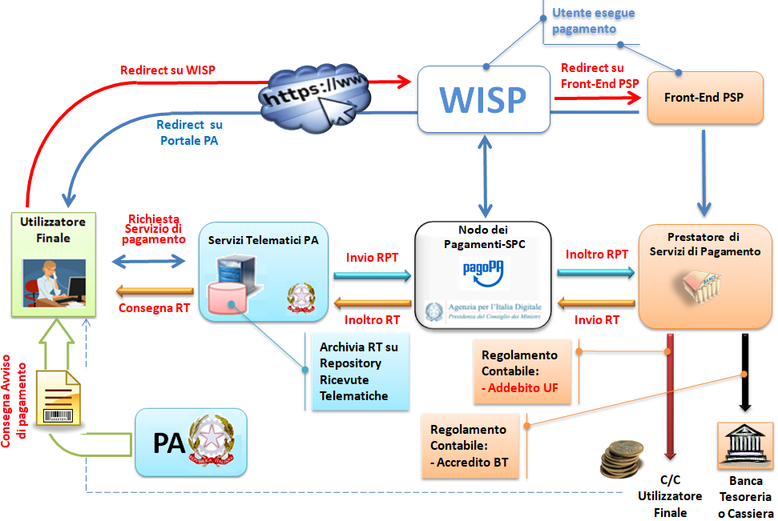
.. |image2| image:: ./myMediaFolder/media/image3.png
   :width: 5.90551in
   :height: 3.71246in
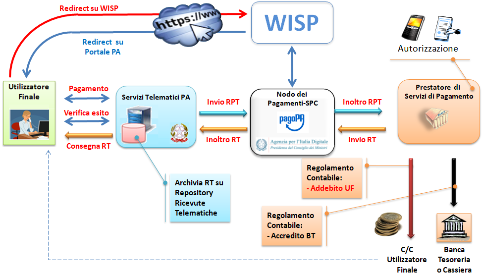
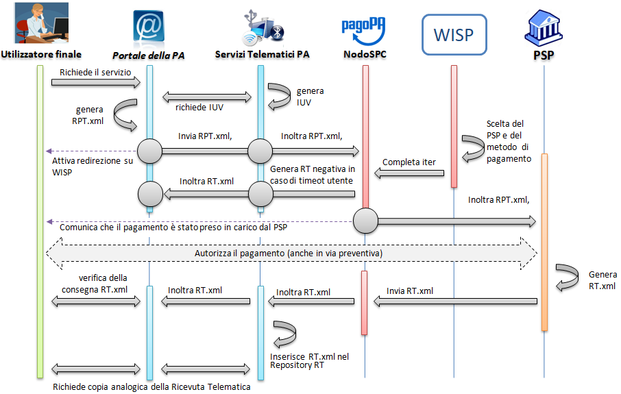
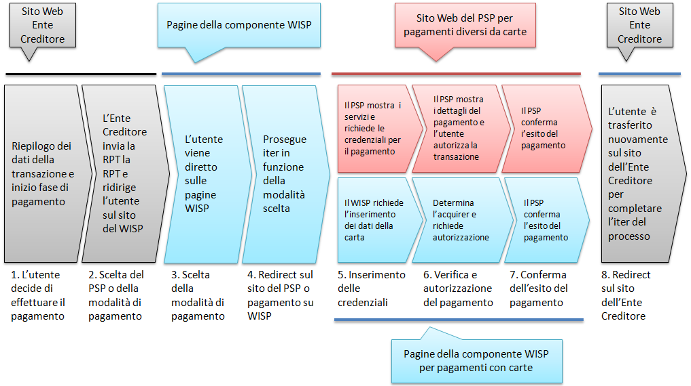
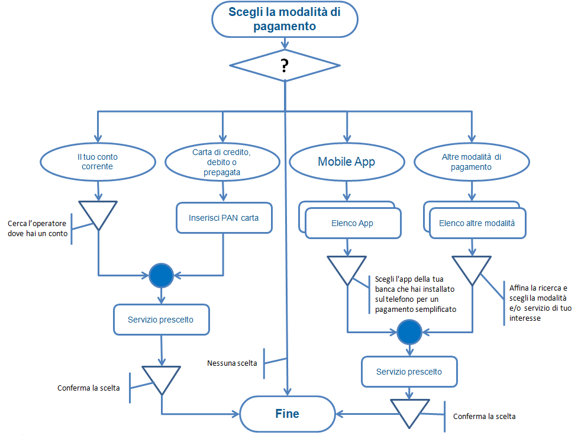
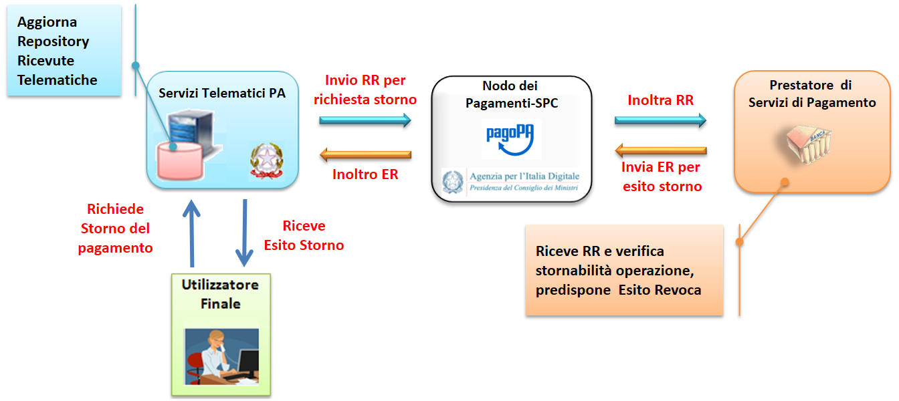
.. |image8| image:: ./myMediaFolder/media/image9.png
   :width: 5.90551in
   :height: 3.87124in
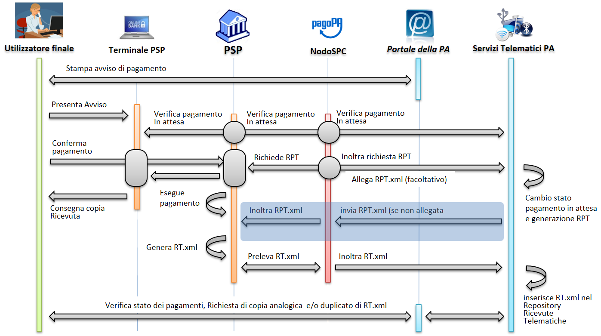
.. |image10| image:: ./myMediaFolder/media/image11.png
   :width: 5.90551in
   :height: 3.30439in
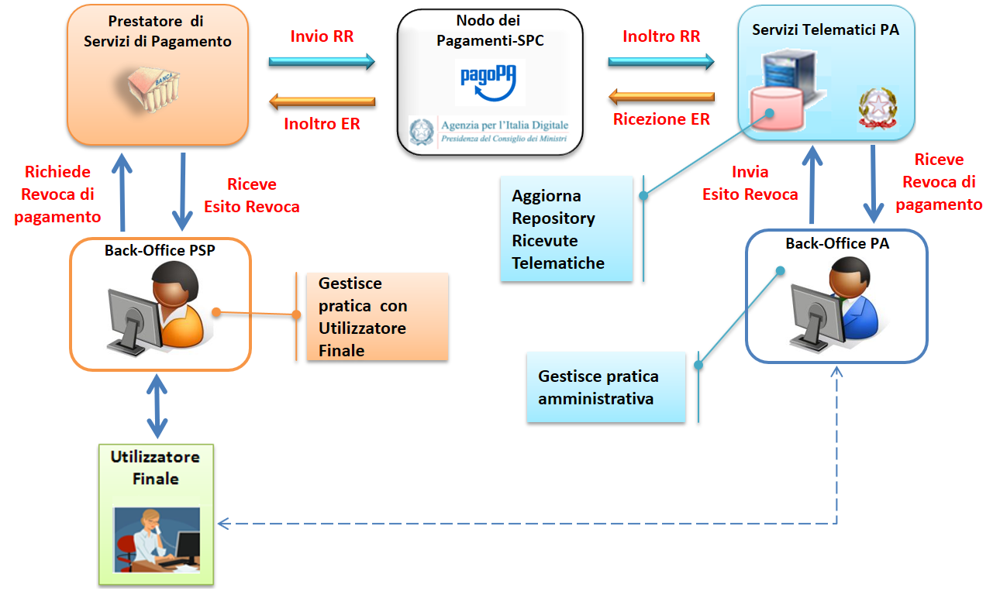
.. |image12| image:: ./myMediaFolder/media/image13.png
   :width: 5.47327in
   :height: 1.61417in
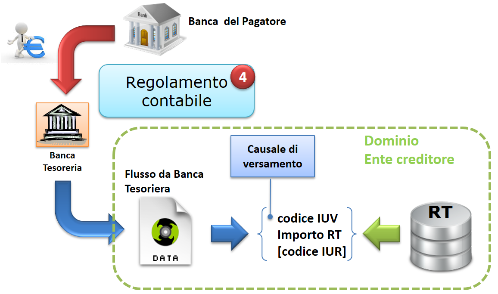
.. |image14| image:: ./myMediaFolder/media/image15.png
   :width: 5.09584in
   :height: 3.14961in
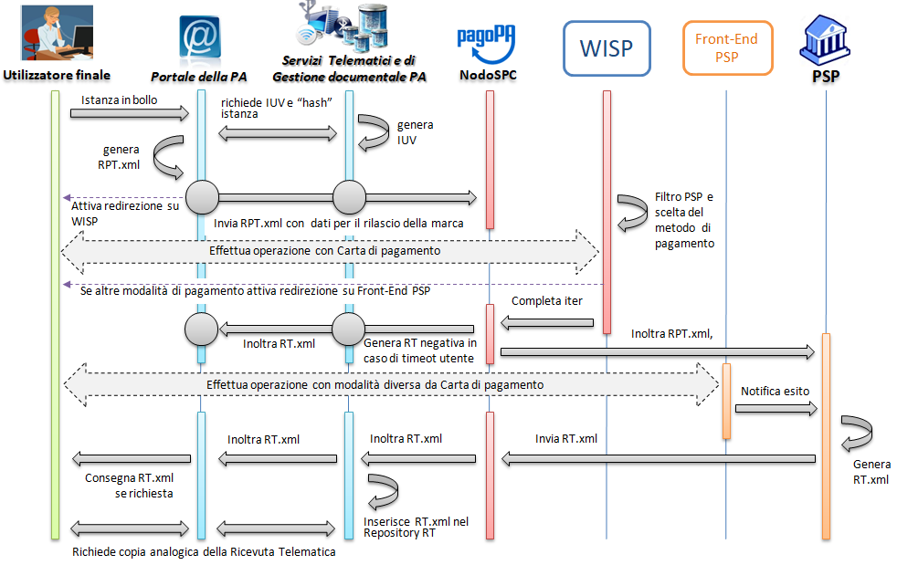
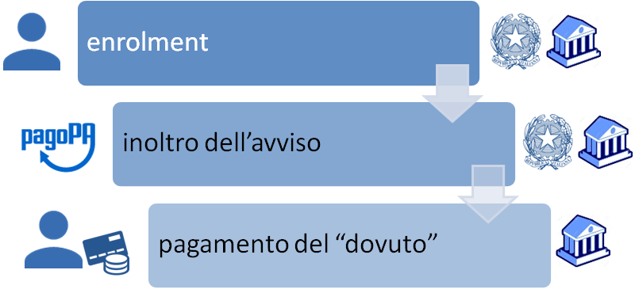
.. |image17| image:: ./myMediaFolder/media/image18.png
   :width: 5.90551in
   :height: 3.65113in
.. |image18| image:: ./myMediaFolder/media/image19.png
   :width: 5.90551in
   :height: 4.50265in
