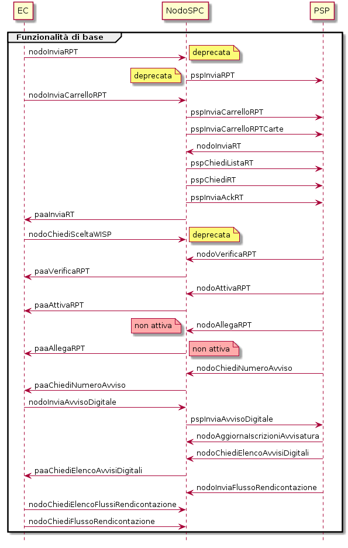

+-----------------------------------------------------------------------+
| |AGID_logo_carta_intestata-02.png|                                    |
+-----------------------------------------------------------------------+

**Sezione III - Specifiche di interconnessione**

La presente sezione descrive le interfacce di cooperazione applicativa
del software che implementa i servizi del Nodo dei Pagamenti SPC. I
servizi sono realizzati tramite *Web service* utilizzati da un lato tra
Enti Creditori aderenti e Nodo dei Pagamenti-SPC, e dall’altro tra Nodo
dei Pagamenti-SPC e prestatori dei servizi di pagamento. L’insieme delle
primitive offerte da questi *Web service* consentono di coprire i
modelli di pagamento forniti dal Nodo dei Pagamenti-SPC:

+-----------------------------------+-----------------------------------+
| Modello 1                         | Pagamento attivato presso l’Ente  |
|                                   | Creditore con re indirizzamento   |
|                                   | on-line                           |
+-----------------------------------+-----------------------------------+
| Modello 2                         | Pagamento attivato presso l’Ente  |
|                                   | Creditore con autorizzazione non  |
|                                   | contestuale gestita dal PSP       |
+-----------------------------------+-----------------------------------+
| Modello 3                         | Pagamento predisposto dall’Ente   |
|                                   | Creditore e attivato presso il    |
|                                   | PSP                               |
+-----------------------------------+-----------------------------------+
| Modello 4                         | Pagamento spontaneo attivato      |
|                                   | presso il PSP                     |
+-----------------------------------+-----------------------------------+

Per la piena comprensione dei modelli, si tenga presente che lo scambio
di messaggi può avvenire tramite la mediazione di soggetti intermediari,
che gestiscono i sistemi software di interconnessione e si interfacciano
al Nodo. I parametri di indirizzamento, necessari al corretto
instradamento del messaggio dal mittente al destinatario, devono
pertanto tenere conto di tali soggetti. A tal proposito, nel seguito si
utilizza la seguente nomenclatura tecnica:

-  **IntermediarioPA**, 
   soggetto che opera come intermediario per un
   Ente Creditore. Qualora l’Ente Creditore non si avvalga di un
   intermediario, rappresenta l’Ente Creditore stesso;

-  **Back-end EC** o **StazioneIntermediarioPA**, 
   sistema software gestito da un IntermediarioPA, che si interfaccia direttamente col
   Nodo dei Pagamenti-SPC tramite Porta di Dominio;

-  **IntermediarioPSP**, 
   soggetto che opera come intermediario per un
   PSP. Qualora il PSP non si avvalga di un intermediario, rappresenta
   il PSP stesso;

-  **Back-end PSP** o **Canale**, 
   sistema software gestito da un
   IntermediarioPSP, che si interfaccia direttamente al Nodo dei
   Pagamenti-SPC con le modalità previste.

Sulla base delle precedenti definizioni, si individuano le seguenti
relazioni tra gli identificativi che rappresentano tali
soggetti/sistemi:

-  un identificativoStazioneIntermediarioPA appartiene ad un solo
   IntermediarioPA e di conseguenza deve essere univoco rispetto a
   identificativoIntermediarioPA.

-  un identificativoCanale appartiene ad un solo IntermediarioPSP e di
   conseguenza deve essere univoco rispetto a
   identificativoIntermediarioPSP.

Tutte le primitive di interazione sono realizzate come operazioni SOAP,
utilizzando la modalità sincrona del paradigma SOAP e il protocollo http
o *https* per il trasporto.

Il diagramma di Figura 22 a pagina 116 offre una visione complessiva
delle operazioni trattate dal Nodo dei Pagamenti-SPC e dai soggetti
collegati: in particolare la freccia parte da chi invoca l’operazione e
raggiunge chi espone il servizio. Come si può osservare tutti gli attori
rivestono sia il ruolo di *client* che di *server*.

Le operazioni principali sono rappresentate nella parte sinistra della
figura: tali operazioni sono strettamente necessarie allo scambio dei
flussi relativi ai diversi modelli di pagamento ed alle funzionalità di
avvisatura digitale. Le operazioni rappresentate nella parte destra
della figura riguardano invece operazioni accessorie; alcune
particolarmente utili per acquisire lo stato di avanzamento dei flussi
di pagamento ed anche per ripristinare particolari situazioni di errore
che si potrebbero verificare (tipicamente la perdita di una *response*)
e che potrebbero interrompere il corretto svolgimento del pagamento.

|image1|

|image2|

**Figura** **22 - Diagramma complessivo delle operazioni gestite dal NodoSPC**

Al fine di focalizzare l'attenzione di ciascun tipo di aderente sul
proprio ambito di interazione con il Nodo dei Pagamenti-SPC, la presente
sezione è stata suddivisa in due parti: il Capitolo 8 descrive le
interfacce tra Enti Creditori aderenti e Nodo dei Pagamenti-SPC, mentre
il Capitolo 9 descrive le interfacce tra NodoSPC e prestatori di servizi
di pagamento. Poiché i modelli di pagamento gestiti si articolano in
azioni coordinate su entrambe le interfacce, tali azioni sono
rappresentate in tutti e due i capitoli, dando maggiore risalto alle
azioni degli Enti Creditori nel Capitolo 8 e a quelle dei PSP nel
Capitolo 9.

Infine, il Capitolo 10 specifica le modalità di gestione degli errori,
elencandone i codici previsti dalle azioni (nel seguito "primitive"
delle diverse interfacce), ciascuno con la descrizione sintetica
dell'errore o dell'informazione associata.

**IDENTIFICAZIONE DEGLI OGGETTI SCAMBIATI NEL SISTEMA PAGOPA**	

Gli oggetti legati all'esecuzione dei pagamenti scambiati nel sistema
[Richiesta di Pagamento Telematico (RPT), Ricevuta Telematica (RT),
Richiesta Revoca (RR) ed Esito Revoca (ER)] sono identificati in modo
univoco dal "dominio" del singolo Ente Creditore (identificativoDominio)
e dal codice IUV [1]_ (identificativoUnivocoVersamento).

Al fine di consentire la ripetizione di un pagamento (ad esempio, in
caso di esito negativo), a tale coppia di informazioni si associa un
terzo dato che, nei casi previsti, codiceContestoPagamento (CCP) che
identifica univocamente una singola attività di pagamento attivata
presso un PSP e riferita al medesimo pagamento in attesa.

Ciò significa che ogni RPT, alla quale sono legati gli oggetti correlati
(RT, RR, ER), può avere più repliche in funzione delle ripetute
interazioni che potrebbero avvenire tra Enti Creditori e PSP nel corso
dell'esecuzione di un pagamento.

In Tabella 34 è riepilogato l'insieme di dati necessari ad identificare
in modo univoco all'interno del sistema le interazioni tra i soggetti
aderenti.

**Tabella** **34 - Identificazione degli oggetti scambiati**

+---------------------------------+----------------------------------+-------------------------------------+
| **Dato**                        | **Pagamenti attivati presso EC** | **Pagamenti attivati presso PSP**   |
|                                 | **(modello 1 e modello 2)**      | **(modello 3 e modello 4)**         |
+---------------------------------+----------------------------------+-------------------------------------+
| identificativoDominio           | Campo alfanumerico contenente il codice fiscale dell'Ente Creditore.   |
+---------------------------------+----------------------------------+-------------------------------------+
| identificativoUnivocoVersamento | Riferimento univoco assegnato al pagamento dall’Ente Creditore.0       |
+---------------------------------+----------------------------------+-------------------------------------+
| codiceContestoPagamento         | Assume il valore "n/a" oppure    | Codice univoco assegnato dal PSP.   |
|                                 | un codice univoco assegnato      |                                     |
|                                 | dall'Ente Creditore.             |                                     |
+---------------------------------+----------------------------------+-------------------------------------+

`Torna all'indice <../../index.rst>`__

.. [1]
   in alcuni documenti degli Enti Creditori indicato anche come CRS.

.. |AGID_logo_carta_intestata-02.png| image:: ../media/header.png
   :width: 5.90551in
   :height: 1.30277in

.. |image2| image:: ./myMediaFolder/media/image3.png
   :width: 3.19886in
   :height: 4.04545in
