+-----------------------------------------------------------------------+
| |AGID_logo_carta_intestata-02.png|                                    |
+-----------------------------------------------------------------------+

+----------------------------------------------------------+
| **Capitolo 8. INTERAZIONE TRA ENTE CREDITORE E NODOSPC** |
+----------------------------------------------------------+

Interazione tra Ente Creditore e NodoSPC
========================================

Questo capitolo descrive le interfacce utilizzate nella cooperazione
applicativa tra Nodo dei Pagamenti-SPC e Enti Creditori aderenti. L'uso
combinato di tali interfacce consente l'erogazione dei servizi di
pagamento secondo i modelli di pagamento di cui sopra.

L'architettura SPCoop, di cooperazione applicativa, rende indipendenti i
servizi applicativi dal loro indirizzo fisico.

Nel nostro contesto, il legame tra Ente Creditore e Nodo dei
Pagamenti-SPC passa attraverso l’intermediarioPA (in molti casi potrebbe
coincidere con l'EC stesso), che con il proprio sistema si connette
direttamente al Nodo dei Pagamenti-SPC con le modalità indicate al `§
4.1 <../09-Capitolo_4/Capitolo4.rst#connessione-al-sistema-pagopa>`__.

Il Nodo dei Pagamenti-SPC pone a fattor comune le infrastrutture
tecniche di comunicazione, agendo quindi come normalizzatore dei
protocolli di accesso ai servizi di pagamento oltre a fornire funzioni
di supporto all’utilizzatore finale per facilitare le operazioni di
pagamento.

Gli Enti Creditori aderenti, di conseguenza, devono implementare i
protocolli di accesso al Nodo dei Pagamenti-SPC, come definiti dagli
*Web service* relativi e utilizzati nei diversi modelli di pagamento.

Il Nodo dei Pagamenti-SPC, attraverso le informazioni di configurazione
specifiche e i meccanismi di normalizzazione, rende disponibili le
diverse soluzioni dei PSP facendosi carico di trattare le eventuali
specificità dei protocolli di trust e comunicazione.

*Workflow* dei modelli di pagamento e dei processi accessori
------------------------------------------------------------
.. _*Workflow* dei modelli di pagamento e dei processi accessori:

I paragrafi seguenti descrivono a livello generale, valide quindi per
tutti i soggetti coinvolti, le interazioni tra gli Enti Creditori, il
Nodo dei Pagamenti-SPC ed i PSP necessarie per attuare i modelli di
pagamento indicati nel `Capitolo 2 della Sezione I <../07-Capitolo_2/Capitolo2.rst>`__., focalizzando però
l'attenzione sulle attività di pertinenza degli Enti Creditori.

Pertanto, in questo paragrafo e nei successivi saranno analizzati nel
dettaglio i **workflow** dei processi che sono attivati presso gli Enti
Creditori. Sono, peraltro, qui descritti con meno dettagli anche i
*workflow* dei processi che coinvolgono il Nodo dei Pagamenti-SPC.

Pagamenti attivati presso l'Ente Creditore
~~~~~~~~~~~~~~~~~~~~~~~~~~~~~~~~~~~~~~~~~~
.. _Pagamenti attivati presso l'Ente Creditore:

|image1|

**Figura** **23 - Activity Diagram del pagamento attivato presso l'Ente Creditore**

Si tenga presente che, in questo paragrafo e nei successivi, in alcuni
casi la componente di *Back-end* del NodoSPC sarà indicata come
componente FESP (per mantenere una terminologia già conosciuta);
parimenti, per non complicare troppo i *workflow* esposti, in alcuni
casi la componente "PortaleEC" comprende sia la parte di *Front-end*,
sia quella di *Back-end* presso l'Ente Creditore.

Le caratteristiche del Nodo dei Pagamenti-SPC consentono agli Enti
Creditori di gestire in modo univoco i modelli di pagamento attivati
presso il portale dell'ente (modelli 1 e 2) senza vincoli rispetto
all’implementazione realizzata dal PSP scelto dall'utilizzatore finale e
viceversa.

La versione attuale delle Specifiche Attuative prevede importanti
cambiamenti ai processi interni del Nodo dei Pagamenti-SPC. Tali
modifiche, che apportano fondamentali miglioramenti alla *user experience*
dell’utilizzatore finale, avranno un impatto minimale nei confronti degli EC.
Il flusso principale delle attività, vedi *activity diagram*
di Figura 23 a pagina 118, contempla i seguenti passi:

1)  *Check-out e pagamento*: a completamento dei processi interni
    all’Ente Creditore e sulla base delle proprie scelte,
    l’utilizzatore finale compone il carrello e attiva la fase di
    pagamento richiamando le funzionalità della componente WISP. Come
    supporto a tale processo, il NodoSPC offre agli EC l’accesso a
    una funzione di emulazione che assicura il retro compatibilità
    con le precedenti versioni. Poiché la funzione di emulazione non
    ha altri compiti specifici, il suo utilizzo è opzionale e
    deprecato per i nuovi sviluppi.
    Con l’invio del carrello al Nodo dei Pagamenti-SPC termina la fase
    di inizializzazione del pagamento a carico dell’EC. L’utilizzo della
    primitiva **nodoInviaRPT**, pur effettuabile, è deprecato per tale
    processo.

    Per maggiori informazioni si veda il *workflow* di dettaglio al
    `paragrafo 8.1.1.1 <../15-Capitolo_8/Capitolo8.rst#workflow-di-check-out-e-pagamento>`__.

2)  *Autenticazione*: il servizio di scelta e memorizzazione del
    pagamento (componente WISP 2.0 del NodoSPC) propone
    all’utilizzatore finale la possibilità di autenticarsi per poter
    usufruire delle funzionalità avanzate. Nel caso che l’EC lo
    abbia identificato con SPID, WISP 2.0 ne erediterà le
    credenziali. L’identificazione non è obbligatoria e
    l’utilizzatore finale potrà operare anche in forma anonima.

3)  *Scelta della modalità di pagamento*: l’utilizzatore finale sceglie
    un servizio di pagamento fra quelli disponibili o ne richiama
    uno fra quelli memorizzati attraverso (`vedi § 2.1.3.1 <../07-Capitolo_2/Capitolo2.rst#servizio-di-scelta-e-memorizzazione-del-  pagamento>`_). In base a tale scelta, il pagamento viene indirizzato su uno dei modelli
    descritti al `paragrafo 2.1 della Sezione I <../07-Capitolo_2/Capitolo2.rst#processo-di-pagamento-attivato-presso-lente-creditore>`__.

4)  In funzione dello strumento utilizzato, il pagamento potrà avvenire:

    - 1. *con carta di pagamento*: attraverso il POS virtuale messo a
      disposizione dal WISP 2.0; in questo caso, se l’utilizzatore
      finale decide di effettuare il pagamento, il NodoSPC effettua
      una prenotazione dell’importo sulla carta indicata sul
      servizio WISP 2.0;

    - 2. *con altre modalità*: dipendenti dal servizio offerto dal PSP per
      le altre tipologie di pagamento, attraverso le componenti
      FESP e WFESP del NodoSPC;

5)  *Invio carrello a PSP*: la componente FESP del NodoSPC invia il
    carrello di RPT al PSP in modalità diverse in funzione della
    scelta effettuata dall'utilizzatore finale. Per maggiori
    informazioni si veda il *workflow* di dettaglio `al § 8.1.1.2 <../15-Capitolo_8/Capitolo8.rst#invio-carrello-al-psp>`__;

6)  *Gestione RPT*: il PSP gestisce le RPT pervenute raccogliendo le
    autorizzazioni del pagamento date dall’utilizzatore finale,
    eventualmente mettendo a disposizione sui propri sistemi una
    specifica *landing page*. Su tale pagina l’utilizzatore finale
    viene reindirizzato dal WISP tramite una URL restituita dal PSP
    al ricevimento del carrello. Per consentire agli utenti
    registrati su WISP la successiva memorizzazione del servizio di
    pagamento su WISP, al PSP è fatto divieto di offrire
    funzionalità che possano modificare la scelta che l’utilizzatore
    ha operato al precedente passo 3.

7)  *Generazione RT*: il PSP genera la RT tenendo conto delle diverse
    modalità di autorizzazione del pagamento, di inoltro del
    carrello e dei dati presenti sulla RPT;

8)  *Invio RT al NodoSPC*: il PSP invia le RT generate dal carrello
    utilizzando la primitiva **nodoInviaRT**. La primitiva
    **pspChiediListaRT** sarà utilizzata solo per indirizzare la
    gestione delle eccezioni;

9)  *Chiusura della transazione*: la componente FESP del Nodo SPC attiva
    la primitiva **paaInviaRT** presso l’Ente Creditore
    concludendo il processo di pagamento. Per maggiori informazioni
    si veda il workflow di dettaglio al `paragrafo 8.1.1.3 <../15-Capitolo_8/Capitolo8.rst#workflow-di-chiusura-della-transazione-presso-ec>`__;

10) *Memorizzazione della scelta*: la componente WISP 2.0 del Nodo SPC
      consente agli utenti registrati di memorizzare il servizio di
      pagamento utilizzato in caso di esito positivo del pagamento
      stesso.

Le caratteristiche del Nodo dei Pagamenti-SPC consentono agli Enti
Creditori di gestire in modo univoco il pagamento attivato presso il
portale dell'ente senza vincoli rispetto all’implementazione realizzata
dal PSP scelto dall'utilizzatore finale e viceversa.

La componente WISP 2.0 del Nodo dei Pagamenti-SPC, che interfaccia i due
soggetti, rende del tutto trasparente agli stessi le eventuali
complessità, permettendo un comportamento univoco e standardizzato
valido sia per i pagamenti con re indirizzamento on-line (Modello 1),
sia per quelli con autorizzazione non contestuale gestita dal PSP
(Modello 2).

Workflow di Check-out e pagamento
~~~~~~~~~~~~~~~~~~~~~~~~~~~~~~~~~
.. _Workflow di Check-out e pagamento:

Come anticipato nel paragrafo precedente, i cambiamenti ai processi
interni del NodoSPC modificano i *workflow* esistenti, senza peraltro
comportare importanti modifiche nei confronti degli Enti Creditori che
possono utilizzare un duplice approccio:

a) utilizzare direttamente la primitiva **nodoInviaCarrelloRPT** e
   dati fissi per l'indicazione del PSP verso quale richiedere il
   pagamento (vedi Figura 24);

b) avvalersi della funzione di “emulazione” messa a disposizione dal
   NodoSPC, *facility* che assicura la retro compatibilità con le
   precedenti versioni (vedi Figura 25 a pagina 122).

|image2|

**Figura** **24 - Sequence diagram del workflow di check-out e pagamento**

Nello schema di Figura 24 è riportato il workflow relativo consigliato
per questa fase del pagamento, che si compone dei seguenti passi:

1. l'utilizzatore finale esegue il check-out;

2. il Portale EC invoca la primitiva **nodoInviaCarrelloRPT** per
   trasmettere alla componente FESP del NodoSPC il carrello di RPT
   (per l'indicazione del PSP verso il quale richiedere il pagamento
   sono utilizzati dati fissi, `vedi § 8.1.1.5 <../15-Capitolo_8/Capitolo8.rst#avvertenze-per-la-predisposizione-e-linvio-delle-          richieste-di-pagamento-telematiche>`__);

3. alla ricezione della primitiva, la componente FESP del NodoSPC
   verifica che le RPT ricevute siano utilizzabili per il pagamento;
   
**se sono rilevati uno o più errori:**

4. la componente FESP del NodoSPC fornisce al Portale EC la *response*
   "KO" per la primitiva invocata al precedente punto 2;

5. la componente FESP del NodoSPC termina la transazione;
   
**se non sono rilevati errori:**

6. la componente FESP del NodoSPC fornisce al Portale EC la *response*
   "OK" per la primitiva invocata al precedente punto 2. La
   *response* contiene l'indirizzo URL [1]_ della componente WISP
   2.0 del NodoSPC al quale si deve reindirizzare l’utilizzatore
   finale;

7. il Portale EC reindirizza l’utilizzatore finale verso la componente
   WISP 2.0 del NodoSPC utilizzando la *query string* definita al 
   `§ 8.3.1 <../15-Capitolo_8/Capitolo8.rst#re-direzione-dal-portale-ec-verso-il-web-fesp>`__ 
   (contenente anche il parametro idSessione);

8. l'utilizzatore finale è reindirizzato nella *landing page* della
   componente WISP 2.0 del NodoSPC.

Sulla base delle informazioni acquisite nel corso di questo processo, la
componente WISP 2.0 del NodoSPC sarà in grado di proporre
all'utilizzatore finale le pagine corrette per la scelta del PSP e
quindi indirizzare la RPT nei confronti del PSP prescelto.

Si noti che la sessione applicativa del Portale EC rimane in attesa
dell'esito, che arriverà sempre mediante re-direzione dallo stesso
componente WISP 2.0 del NodoSPC e sempre con gli stessi valori
identificativi dell'esito, indipendenti dal PSP.

L'approccio alternativo, cioè quello che utilizza la funzione di
emulazione del NodoSPC, differisce da quello illustrato in precedenza in
quanto introduce i passi da 2 a 6 (peraltro a carico del NodoSPC, cioè
della funzione di emulazione).

|image3|

**Figura** **25 - Sequence diagram del workflow di check-out e pagamento con emulazione**

Nello schema di Figura 25 è riportato il workflow relativo all'approccio
con emulazione, che si compone dei seguenti passi:

1. l'utilizzatore finale esegue il check-out;

2. il portale EC procede con l’auto generazione del dato **keyPA**;

*Inizio delle azioni della componente “Emulatore”*

3. il portale EC effettua tramite HTTP POST la *redirect* sulle pagine
   WISP 1.3, passando come parametri le informazioni riportate nel `§
   8.4 <../15-Capitolo_8/Capitolo8.rst#interfacce-http-per-il-servizio-wisp>`__;

4. la componente WISP del NodoSPC ritorna il controllo al portale
   dell'Ente Creditore, mediante re-direzione all’indirizzo
   urlReturn (ricevuto al passo 3), con passaggio di dati
   **idDominio + keyPA + keyWISP;**

5. il Portale EC riceve i parametri e, dal suo back-end, procede
   all’invocazione in contesto sicuro (SPCoop) della primitiva
   **nodoChiediSceltaWISP**;

6. la componente FESP del NodoSPC restituisce nella *response* dati PSP
   fittizi (`vedi § 8.1.1.5 <../15-Capitolo_8/Capitolo8.rst#avvertenze-per-la-predisposizione-e-linvio-delle-richieste-di-pagamento-   telematiche>`__), mantenuti unicamente per retro compatibilità;

*Fine delle azioni della componente “Emulatore”*

7. il Portale EC invoca la primitiva **nodoInviaRPT** o
   **nodoInviaCarrelloRPT** per trasmettere alla componente FESP
   del NodoSPC la RPT ovvero il carrello di RPT.

Da questo punto in poi, l'approccio in esame utilizza gli stessi passi
previsti per il workflow analizzato in precedenza.

Invio carrello al PSP
~~~~~~~~~~~~~~~~~~~~~
.. _Invio carrello al PSP:

|image4|

**Figura** **26 - Sequence diagram degli scenari di "Invio carrello al PSP"**

Questo passo del workflow complessivo si attiva una volta che
l'utilizzatore finale ha operato le sue scelte sulla componente WISP 2.0
del NodoSPC (vedi punto 3 dell'*activity diagram* di Figura 23 a
pagina 118): se ha scelto di pagare con carta, il pagamento è già
avvenuto e al PSP viene inviata la RPT o il carrello di RPT; viceversa,
se ha scelto altre modalità, il pagamento deve ancora essere effettuato.

In questo paragrafo saranno pertanto analizzati gli scenari connessi
alle attività di invio del carrello al PSP, che variano in funzione
della scelta sopra menzionata, a seguito della quale, si possono
individuare 3 diverse alternative:

a) *con carta* attraverso il POS virtuale messo a disposizione dal
   NodoSPC;

b) *con re indirizzamento on-line* (modello 1) sulle pagine messe a
   disposizione dal PSP;

c) *con autorizzazione gestita dal PSP* (modello 2).

Nello schema di Figura 26 a pagina 122, sono indicate i tre possibili
scenari di invio del carrello di RPT al PSP:

*Scenario a) - Pagamento con carta (con prenotazione dell’importo del*
*pagamento)*

1. la componente FESP del NodoSPC invia alla componente di *Back-end*
   del PSP la RPT o il carrello di RPT ricevuto in precedenza (vedi
   passo 2 del *sequence diagram* di Figura 24 a pagina 120) per mezzo
   della primitiva **pspInviaCarrelloRPTCarte**, avente tra i
   parametri le informazioni relative all'identificativo della
   transazione (RRN) e al suo costo. Dette commissioni sono quelle che
   il PSP ha comunicato ad AgID attraverso il Catalogo Dati Informativi
   (`vedi §§ 4.2.2 <../09-Capitolo_4/Capitolo4.rst#catalogo-dati-informativi>`__ e `5.3.7 <../11-Capitolo_5/Capitolo5.rst#catalogo-dati-informativi>`__), differenziate tra costi "*on us*" e "*not on us*";

2. la componente di *Back-end* del PSP prende in carico il carrello di
   RPT e invia la relativa *response*, completando le operazioni di
   invio carrello;

*Scenario b) - Pagamento con re indirizzamento on-line (da eseguire)*

3. la componente FESP del NodoSPC invia alla componente di *Back-end*
   del PSP il carrello di RPT ricevuto in precedenza per mezzo della
   primitiva **pspInviaCarrelloRPT**;

4. la componente di *Back-end* del PSP prende in carico la RPT o il
   carrello di RPT, invia la relativa *response* (contiene il dato
   parametriProfiloPagamento);

5. la componente FESP del NodoSPC innesca la componente WISP 2.0 per
   attivare la regina direzione sul Portale del PSP;

6. la componente WISP 2.0 del NodoSPC esegue la *redirect* sulla la
   componente WFESP;

7. la componente WFESP del NodoSPC reindirizza il browser
   dell'utilizzatore finale verso il Portale del PSP utilizzando la
   *query string* definita al `paragrafo 8.3.1 <../15-Capitolo_8/Capitolo8.rst#re-direzione-dal-portale-ec-verso-il-web-fesp>`__;          (contiene il dato parametriProfiloPagamento).

8. a seguito del completamento delle operazioni di invio carrello, si
   prevede che il PSP ponga l'utilizzatore finale nelle condizioni
   di eseguire il pagamento;

*Scenario c) - Pagamento con autorizzazione gestita dal PSP (da eseguire)*

9. la componente FESP del NodoSPC invia alla componente di *Back-end*
   del PSP il carrello di RPT ricevuto in precedenza per mezzo della
   primitiva **pspInviaCarrelloRPT**;

10. la componente di *Back-end* del PSP invia la relativa *response* e
    prende in carico la RPT o il carrello di RPT per avviare la
    procedura di pagamento.

L'utilizzo della primitiva **pspInviaRPT** è deprecato e mantenuto per
retro compatibilità in quanto un carrello di pagamenti può essere
costituito da un'unica e sola RPT.

Workflow di chiusura della transazione presso EC
~~~~~~~~~~~~~~~~~~~~~~~~~~~~~~~~~~~~~~~~~~~~~~~~
.. _Workflow di chiusura della transazione presso EC:

Come già accaduto per il paragrafo precedente, le attività in esame
(conclusione del pagamento) si differenziano in funzione della scelta
effettuata dall'utilizzatore finale attraverso la componente WISP 2.0
del NodoSPC (vedi punto 3 dell'*activity diagram* di Figura 23 a
pagina 118). Tale scelta era riferita a 3 diverse alternative di
pagamento:

a) *con carta* attraverso il POS virtuale messo a disposizione dal
   NodoSPC;

b) *con re indirizzamento on-line* (modello 1) sulle pagine messe a
   disposizione dal PSP;

c) *con autorizzazione gestita dal PSP* (modello 2).

Si tenga presente che nel caso in cui il PSP riceva un carrello di RPT
dovrà generare un insieme di RT e inviarle tutte con le primitive qui
indicate, ciclando fino a raggiungere la numerosità del carrello.

Nello sviluppo dei *workflow* del presente paragrafo, al fine di non
complicare inutilmente gli schemi grafici, è stato rappresentato il caso
di un carrello composto da una sola RPT.

*Scenario a) - Pagamento con carta*

|image5|

**Figura** **27 - Sequence diagram dello scenario "Pagamento con carta"**

Lo schema di Figura 27 a pagina 124, che definisce le attività nello
scenario di "pagamento con carta", prevede i seguenti passi:

**in caso di pagamento eseguito:**

1. nel caso sia completata positivamente la transazione con carta
   (credito, debito, prepagata) attraverso il POS virtuale del NodoSPC,
   la componente WFESP del NodoSPC reindirizza il browser
   dell'utilizzatore finale verso il Portale EC utilizzando la *query string*
   definita al `paragrafo 9.3.2 <../16-Capitolo_9/Capitolo9.rst#re-direzione-dal-portale-psp-verso-il-web-fesp>`_ 
   (contiene l'esito positivo del pagamento);

2. la componente di *Back-end* del PSP, ricevuto il carrello di RPT (al
   passo 2 del paragrafo precedente) effettua eventuali controlli
   interni e genera la RT da inviare all'Ente Creditore;

3. la componente di *Back-end* del PSP invia la RT alla componente FESP
   del NodoSPC utilizzando la primitiva **nodoInviaRT** (`vedi §
   9.2.2.1 <../16-Capitolo_9/Capitolo9.rst#nodoinviart>`__);

4. la componente FESP del NodoSPC invia al Portale dell'Ente Creditore
   la RT pervenuta dal PSP utilizzando la primitiva **paaInviaRT**
   (`vedi § 8.2.2.1 <../15-Capitolo_8/Capitolo8.rst#paainviart>`__);

5. il Portale EC invia la *response* della **paaInviaRT** alla
   componente di FESP del NodoSPC;

6. la componente FESP del NodoSPC invia la *response* della
   **nodoInviaRT** alla componente di FESP del NodoSPC (si noti che la
   primitiva **nodoInviaRT** è sincrona);

7. la componente FESP del NodoSPC comunica alla componente WISP 2.0
   l’esito della RT ricevuta dal PSP, la stessa componente completa la
   transazione e-commerce iniziata in precedenza (vedi punto 4.1
   dell’*activity diagram* di Figura 23 a pagina 118):

   a. conferma l’acquisto se l’esito della RT è positivo;

   b. cancella la prenotazione se l’esito della RT è negativo;

**in caso di timeout o abbandono:**

8.  la componente WISP 2.0 del NodoSPC segnala alla componente FESP che
    si è verificata una condizione di timeout o di abbandono da parte
    dell'utente;

9.  **solo in caso di abbandono**, la componente WFESP del NodoSPC
    reindirizza il browser dell'utilizzatore finale verso il Portale EC
    utilizzando la *query string* definita al `paragrafo 9.3.2 <../16-Capitolo_9/Capitolo9.rst#re-direzione-dal-portale-psp-verso-il-       web-fesp>`__ (contiene l'esito negativo del pagamento);

10. la componente FESP del NodoSPC genera una RT negativa, indicandone
    il motivo (timeout o abbandono) nell'apposito campo;

11. la componente FESP del NodoSPC invia al Portale dell'Ente Creditore
    la RT NEGATIVA utilizzando la primitiva **paaInviaRT** (`vedi §
    8.2.2.1 <../15-Capitolo_8/Capitolo8.rst#paainviart>`__);

12. vedi precedente punto 5.

*Scenario b) - Pagamento con re indirizzamento on-line*

|image6|

**Figura** **28 - Sequence diagram dello scenario "Pagamento modello 1"**

Lo schema di Figura 28 a pagina 125, che definisce le attività nello
scenario di "pagamento con re indirizzamento on-line", prevede i
seguenti passi:

20. l'utilizzatore finale, avendo scelto di effettuare il pagamento
    on-line con modalità diversa dalla carta, completa la transazione
    sulle pagine web messe a disposizione dal PSP;

21. alla conclusione del pagamento, il Portale del PSP rinvia alla
    componente WFESP del NodoSPC per segnalarne il risultato;

22. la componente WFESP del NodoSPC riceve l’esito del pagamento nella
    *query string* definita al `paragrafo 9.3.2 <../16-Capitolo_9/Capitolo9.rst#re-direzione-dal-portale-psp-verso-il-web-fesp>`_           (contenente il codice di
    ritorno circa l'esito della transazione);

23. la componente WFESP del NodoSPC reindirizza il browser
    dell'utilizzatore finale verso il Portale EC utilizzando la *query string*
    definita al  `paragrafo 8.3.2 <../15-Capitolo_8/Capitolo8.rst#re-direzione-dal-web-fesp-verso-il-portale-ec>`_ (contiene l'esito       del pagamento);

24. il Portale del PSP segnala l'esito del pagamento alla propria
    componente di *Back-end*;

25. sulla base dell'esito ricevuto, la componente di *Back-end* del PSP
    genera la RT;

26. vedi precedente punto 3;

27. vedi precedente punto 4;

28. vedi precedente punto 5;

29. vedi precedente punto 6.

**In caso di timeout o abbandono sulla componente WISP 2.0 del NodoSPC,**
**fare riferimento allo** *Scenario a) - Pagamento con carta.*

*Scenario c) - Pagamento con autorizzazione gestita dal PSP*

|image7|

**Figura** **29 - Sequence diagram dello scenario "Pagamento modello 2"**

Il workflow legato a questo contesto (si veda lo schema di Figura 29 a
pagina 126) prevede i seguenti passi:

30. l'utilizzatore finale, avendo scelto la modalità con autorizzazione
    non contestuale presso il PSP (lettera di manleva, ecc.: `vedi §
    2.1.2 <../07-Capitolo_2/Capitolo2.rst#processo-di-pagamento-con-autorizzazione-gestita-dal-psp>`__), completa la transazione sulle     pagine web messe a disposizione dalla componente WISP 2.0 del NodoSPC;

31. alla conclusione del pagamento, la componente WISP del NodoSPC
    presenta all'utente una *Thank you page* nella quale è presente un
    bottone per il ritorno al portale dell'Ente Creditore;

32. l'utilizzatore finale chiede di tornare al portale dell'Ente
    Creditore;

33. la componente WFESP del NodoSPC reindirizza il browser
    dell'utilizzatore finale verso il Portale EC utilizzando la *query string*
    definita al `paragrafo 8.3.2 <../15-Capitolo_8/Capitolo8.rst#re-direzione-dal-web-fesp-verso-il-portale-ec>`_ 
    (contiene l'esito del pagamento impostato al valore costante "DIFFERITO");

    .... passi non tracciati ....

34. vedi precedente punto 3;

35. vedi precedente punto 4;

36. vedi precedente punto 5;

37. vedi precedente punto 6.

In caso di timeout o abbandono sulla componente WISP 2.0 del NodoSPC,
fare riferimento allo Scenario a) - Pagamento con carta.

Controllo circa lo stato di avanzamento di un pagamento
~~~~~~~~~~~~~~~~~~~~~~~~~~~~~~~~~~~~~~~~~~~~~~~~~~~~~~~
.. _Controllo circa lo stato di avanzamento di un pagamento:

In alcune fasi del ciclo di vita del pagamento, soprattutto per quanto
riguarda il pagamento con autorizzazione non contestuale gestita dal PSP
(cosiddetto modello 2), l'utilizzatore finale ha la necessità di
conoscere lo stato di avanzamento del pagamento in corso. A tale
riguardo, il sistema mette a disposizione una particolare funzionalità
che consente di avere tale informazione.

|image8|

**Figura** **30 - Sequence diagram del controllo dello stato di un pagamento**

Il *workflow* del processo prevede i seguenti passi, indicati in Figura
30 a pagina 127:

1)  l'utilizzatore finale, attraverso le funzioni di *Front-office*
    dell'Ente Creditore, richiede di avere informazioni circa lo stato
    di avanzamento di un pagamento;

2)  il *Front-office* dell'Ente Creditore inoltra la richiesta alla
    propria componente di *Back-end*;

3)  la componente di *Back-end* dell’Ente Creditore si attiva verso il
    NodoSPC tramite la primitiva **nodoChiediStatoRPT**;

4)  il NodoSPC verifica la richiesta di storno;

5)  se la richiesta non è valida, il NodoSPC invia una *response*
    negativa e chiude la transazione:

6)  altrimenti, se la RPT non è ancora stata inviata al PSP, il NodoSPC
    predispone la risposta per l'EC (il flusso prosegue al passo 11);

7)  altrimenti, se la RPT è già stata inviata al PSP, il Nodo dei
    Pagamenti-SPC si attiva per richiedere informazioni alla componente
    di *Back-end* del PSP di competenza, per mezzo della primitiva
    **pspChiediAvanzamentoRPT**;

8)  la componente di *Back-end* del PSP predispone la risposta per il
    NodoSPC;

9)  la componente di *Back-end* del PSP invia la *response* con la
    risposta e la invia al NodoSPC;

10) il NodoSPC predispone la risposta per l'EC;

11) il NodoSPC invia la *response* alla componente di *Back-end*
    dell'Ente Creditore, contenente la risposta alla primitiva
    **nodoChiediStatoRPT**;

12) la componente di *Back-end* dell'Ente Creditore inoltra la risposta
    al proprio *Front-office*;

13) l'utilizzatore finale, attraverso le funzioni di Front-office, è in
    grado di conoscere lo stato di avanzamento del pagamento.

Questa funzionalità può essere utilizzata dalla componente di Back-end
dell'Ente Creditore in modo autonomo, senza interazione con l'utenza,
per risolvere problematiche di errore (`si veda il successivo paragrafo
8.1.1.6 <../15-Capitolo_8/Capitolo8.rst#casi-di-errore-e-strategie-di-ripristino-per-lente-creditore>`__).

Avvertenze per la predisposizione e l’invio delle Richieste di Pagamento Telematiche
~~~~~~~~~~~~~~~~~~~~~~~~~~~~~~~~~~~~~~~~~~~~~~~~~~~~~~~~~~~~~~~~~~~~~~~~~~~~~~~~~~~~
.. _Avvertenze per la predisposizione e l’invio delle Richieste di Pagamento Telematiche:

La modifica del *workflow* del pagamento attivato presso l’Ente
Creditore, indicata nei paragrafi precedenti, ha un riflesso sulla
predisposizione e l’invio della RPT da parte dell’EC, che dovrà tenere
conto delle seguenti situazioni:

*A: RPT universale*

L’EC deve seguire le seguenti indicazioni per rendere la RPT
utilizzabile da ogni PSP aderente al sistema pagoPA.

Per la regolazione del pagamento associato alla RPT, l’EC valorizza il
dato ibanAccredito della struttura datiSingoloVersamento della RPT con
codice IBAN relativo al conte aperto presso la propria banca
tesoriera/cassiera.

Nel caso che l’EC disponga di un conto aperto presso Poste Italiane e
abbia valorizzato il dato ibanAccredito con un IBAN bancario, in
osservanza di quanto previsto dalle Linee guida, valorizza il dato
ibanAppoggio della struttura datiSingoloVersamento della RPT con il
codice IBAN del predetto conto postale.

In ogni caso l’EC cura che i conti indicati come ibanAccredito e
ibanAppoggio siano relativi a due diversi prestatori di servizi di
pagamento.

*B-1: Utilizzo della funzione di emulazione del NodoSPC*

Nel caso in cui l’EC utilizzi la funzione di “emulatore” (vedi schema di
Figura 24 a pagina 120), lo stesso ente non dovrà effettuare alcuna
modifica al software se già era *compliant* con la versione 1.3 del
WISP.

*B-2: Non utilizzo della funzione di emulazione del NodoSPC*

Nel caso in cui l’EC non utilizzi la funzione di “emulatore” oppure il
proprio software non sia *compliant* con la versione 1.3 del WISP, lo
stesso ente dovrà:

- a) codificare nell’elemento tipoVersamento della struttura
     datiVersamento della RPT il valore fisso **BBT**  [2]_

- b) usare la primitiva **nodoInviaCarrelloRPT** (in una prima fase è
     ammessa anche la primitiva deprecata **nodoInviaRPT**) ed
     impostare con i valori appresso indicati i seguenti parametri
     fissi:

+-------------------------------------+--------------------+
| I-2. identificativoPSP              | **AGID_01**        |
+-------------------------------------+--------------------+
| I-3. identificativoIntermediarioPSP | **97735020584**    |
+-------------------------------------+--------------------+
| I-4. identificativoCanale           | **97735020584_02** |
+-------------------------------------+--------------------+

Casi di errore e strategie di ripristino per l’Ente Creditore
~~~~~~~~~~~~~~~~~~~~~~~~~~~~~~~~~~~~~~~~~~~~~~~~~~~~~~~~~~~~~
.. _Casi di errore e strategie di ripristino per l’Ente Creditor:

Dall'analisi dell’interazione complessiva esposta nei precedenti
paragrafi, è possibile individuare le situazioni che generano
indeterminatezza circa lo stato del pagamento:

1) esito dell'invio del carrello di RPT (passo 6 del *Workflow* di
   Check-out e pagamento): in questo caso l'Ente Creditore non è in
   grado di ridirigere il browser dell'utilizzatore finale;

2) esito della re-direzione sulla componente WISP 2.0 del NodoSPC: è uno
   stato temporaneo nel quale il portale dell'EC è in attesa di essere
   attivato dalla componente WFESP del NodoSPC a seguito di uno degli
   eventi relativi ai tre scenari previsti nel `§ 8.1.1.3 <../15-Capitolo_8/Capitolo8.rst#workflow-di-chiusura-della-transazione-          presso-ec>`__:

   a. abbandono della transazione,

   b. timeout gestito dalla componente WISP 2.0 del NodoSPC,

   c. timeout gestito dal PSP [solo *Scenario b) - Pagamento con re*
      *indirizzamento on-line*],

   d. pagamento completato;

3) esito del pagamento: in questo caso l'Ente Creditore è in attesa di
   ricevere la Ricevuta Telematica predisposta dal NodoSPC (RT negativa)
   o dal PSP (RT negativa o positiva).

Per ciò che attiene alla gestione dei timeout legati al processo di
pagamento, si rimanda al documento "*Indicatori di qualità per i Soggetti Aderenti*"
pubblicato sul sito dell'Agenzia.

Per gestire le situazioni di indeterminatezza sopra indicate, il NodoSPC
mette a disposizione la primitiva *nodoChiediStatoRPT* (`vedi §§ 8.1.1.4 <../15-Capitolo_8/Capitolo8.rst#controllo-circa-lo-stato-di-avanzamento-di-un-pagamento>`__
e `8.2.1.3 <../15-Capitolo_8/Capitolo8.rst#nodochiedistatorpt>`__) attraverso la quale è possibile ottenere lo stato
dell'operazione, comprensivo delle informazioni per riattivare la re
direzione.

Analizzando la *response* della primitiva in questione e lo stato della
RPT (parametro O-3, si veda anche la Tabella 35 a pagina 143) è
possibile definire i comportamenti da adottare in funzione di tali
risultati:

-  IUV sconosciuto (RPT non presente nel Nodo): l’Ente Creditore può
   ripetere l’invio della RPT usando lo stesso IUV;

-  stato indeterminato: l’Ente Creditore resta in attesa, ripetendo la
   chiedi stato;

-  operazione in errore (con RPT presente nel Nodo): l’Ente Creditore
   può ripetere l’invio della RPT usando un nuovo IUV;

-  operazione di pagamento in corso o conclusa (positivamente o
   negativamente): l’Ente Creditore attende la ricezione della RT.

Pagamento attivato presso il PSP
~~~~~~~~~~~~~~~~~~~~~~~~~~~~~~~~
.. _Pagamento attivato presso il PSP:

Questo modello di pagamento, conosciuto anche come "Modello 3" e già
descritto ai `§§ 2.1.1 <../07-Capitolo_2/Capitolo2.rst#processo-di-pagamento-con-re-indirizzamento-on-line>`__ e
`2.1.2 <../07-Capitolo_2/Capitolo2.rst#processo-di-pagamento-con-autorizzazione-gestita-dal-psp>`__ , presuppone che l’utilizzatore finale sia
in possesso di un avviso (analogico o digitale) contenente le
indicazioni necessarie per effettuare il pagamento.

Le attività in carico all’Ente Creditore sono la predisposizione:

a) dell'archivio dei pagamenti in attesa (APA), contenente tutte le
   informazioni, associate ad un identificativo univoco, necessarie
   per effettuare il pagamento;

b) di un’applicazione “*server*” dedicata necessaria per trattare le
   richieste provenienti dai PSP, come meglio dettagliato nel `§ 8.2.3 <../15-Capitolo_8/Capitolo8.rst#pagamenti-in-attesa-e-richiesta-    di-generazione-della-rpt>`__;

c) capacità di trattare le Ricevute Telematiche (RT), così come indicato nel `§ 8.2.2 <../15-Capitolo_8/Capitolo8.rst#ricezione-delle-    rt-e-richiesta-di-copia>`__.

Per maggiori dettagli circa il *workflow* analitico si `veda il § 9.1.2 <../16-Capitolo_9/Capitolo9.rst#pagamenti-attivati-presso-il-psp>`__ a partire da pagina 173.

Pagamento spontaneo presso il PSP
~~~~~~~~~~~~~~~~~~~~~~~~~~~~~~~~~
.. _Pagamento spontaneo presso il PSP:

Questo modello di pagamento, conosciuto anche come "Modello 4" e già
descritto al  `§ 2.2.3 <../07-Capitolo_2/Capitolo2.rst#pagamento-spontaneo-presso-i-psp>`__ , consente all’utilizzatore finale di effettuare pagamenti presso i PSP pur non essendo in possesso di un avviso
(analogico o digitale), ma sulla base di informazioni a lui note (ad
esempio: la targa del veicolo nel caso di pagamento della tassa
automobilistica).

Le attività in carico all’Ente Creditore sono:

a) la predisposizione dell'archivio dei pagamenti in attesa (APA), con
   tutte le informazioni necessarie per effettuare il pagamento,
   associate ad un identificativo univoco;

b) la disponibilità di un archivio contenente le informazioni relative
   al pagamento spontaneo (ad esempio: l'archivio dei veicoli, nel caso
   di pagamento della tassa automobilistica);

c) la predisposizione di un’applicazione “*server*” dedicata
   necessaria per trattare le richieste provenienti dai PSP, che sia in
   grado di associare la richiesta ad un pagamento in attesa oppure di
   generarlo al momento, `vedi anche § 8.2.3 <../15-Capitolo_8/Capitolo8.rst#pagamenti-in-attesa-e-richiesta-di-generazione-della-        rpt>`__.

d) capacità di trattare le Ricevute Telematiche (RT), così come indicato
   `nel § 8.2.2 <../15-Capitolo_8/Capitolo8.rst#ricezione-delle-rt-e-richiesta-di-copia>`__ .

Per maggiori dettagli circa il *workflow* analitico del Modello 4 `si veda il § 9.1.2.1 <../16-Capitolo_9/Capitolo9.rst#presentazione-dellavviso-e-transcodifica-dei-dati-per-il-pagamento>`__ .

Processo di storno del pagamento eseguito
~~~~~~~~~~~~~~~~~~~~~~~~~~~~~~~~~~~~~~~~~
.. _Processo di storno del pagamento eseguito:

|image9|

**Figura** **31 - Sequence diagram del processo di Storno di un pagamento**

Qualora l’utilizzatore finale, a vario titolo, chieda all’Ente Creditore
la cancellazione di un pagamento presso il quale questo è stato disposto
(c.d. storno), il Nodo dei Pagamenti-SPC mette a disposizione i servizi
telematici necessari per gestire le richieste di storno di pagamenti già
effettuati e per i quali potrebbe essere già stata restituita la
Ricevuta Telematica corrispondente (`vedi anche §§ 2.1.4 <../07-Capitolo_2/Capitolo2.rst#storno-del-pagamento>`__
`e 4.4.5 <../09-Capitolo_4/Capitolo4.rst#storno-di-un-pagamento>`__). Il processo si attiva solo presso l’Ente Creditore.

Dall'analisi del *Sequence diagram* del processo di Storno del pagamento
riportato in Figura 31 a pagina 130, si evidenziano i seguenti passi:

1) l'utilizzatore finale, attraverso le funzioni di *Front-office*
   dell'Ente Creditore, richiede lo storno di un pagamento già
   effettuato;

2) il *Front-office* dell'Ente Creditore inoltra la richiesta alla
   propria componente di *Back-end*;

3) la componente di *Back-end* dell’Ente Creditore richiede lo storno di
   un pagamento inviando al NodoSPC la Richiesta Revoca (RR) tramite la
   primitiva **nodoInviaRichiestaStorno**;

4) il NodoSPC verifica la richiesta di storno;

5) se la richiesta non è valida, il NodoSPC invia una *response*
   negativa e chiude la transazione:

6) se la richiesta è valida, il Nodo dei Pagamenti-SPC la inoltra alla
   componente di *Back-end* del PSP di competenza per mezzo della
   primitiva **pspInviaRichiestaStorno**;

7) la componente di *Back-end* del PSP conferma al NodoSPC la ricezione
   della RR;

il NodoSPC conferma alla componente di *Back-end* dell’Ente Creditore il
corretto invio della richiesta di revoca al PSP;

**Attività non tracciate:** la componente di *Back-end* del PSP e decide
se accettarla o rifiutarla,

8)  la componente di *Back-end* del PSP predispone il messaggio di Esito
    Revoca (ER);

9)  la componente di *Back-end* del PSP invia il messaggio di Esito
    Revoca (ER) al NodoSPC utilizzando l'apposita primitiva
    **nodoInviaEsitoStorno**;

10) il NodoSPC verifica l'esito dell'esito di storno (ER);

11) se la richiesta non è valida, il NodoSPC invia una *response*
    negativa e chiude la transazione:

12) se la richiesta è valida, il NodoSPC la inoltra alla componente di
    *Back-end* dell’Ente Creditore richiedente per mezzo della primitiva
    **paaInviaEsitoStorno**;

13) la componente di *Back-end* dell’Ente Creditore conferma al NodoSPC
    la corretta ricezione del messaggio ER;

14) il NodoSPC conferma alla componente di *Back-end* del PSP il
    corretto invio del messaggio ER;

15) la componente di *Back-end* dell'Ente Creditore inoltra l'esito al
    proprio *Front-office*;

16) l'utilizzatore finale, attraverso le funzioni di *Front-office*,
    verifica l'esito della richiesta di storno.

Il NodoSPC effettua unicamente un controllo di correttezza sintattica
degli oggetti XML scambiato; nel caso della primitiva
**nodoInviaRichiestaStorno**, viene verificato che la RPT oggetto
della richiesta di storno sia stata accettata dal NodoSPC e dal PSP,
altrimenti restituisce un errore specifico.

Processo di revoca della Ricevuta Telematica
~~~~~~~~~~~~~~~~~~~~~~~~~~~~~~~~~~~~~~~~~~~~
.. _Processo di revoca della Ricevuta Telematic:

Il NodoSPC permette di gestire i servizi telematici per le richieste di
annullamento di pagamenti già effettuati e per i quali è già stata
restituita la Ricevuta Telematica corrispondente, rendendo, a questo
scopo, definendo un'interfaccia specifica, ad uso dei PSP, per
richiedere all’Ente Creditore di riferimento la revoca di una RT
specifica (`veda anche §§ 2.1.3.2 <../07-Capitolo_2/Capitolo2.rst#individuazione-del-psp-in-caso-di-pagamento-con-carta>`__ e `4.4.4  <../09-Capitolo_4/Capitolo4.rst#revoca-della-ricevuta-telematica>`__).

Poiché il processo di revoca della RT si attiva presso il PSP, per il
*workflow* dettagliato si faccia riferimento al `§ 9.1.4 <../16-Capitolo_9/Capitolo9.rst#processo-di-revoca-della-ricevuta-telematica>`__ a pagina 186.

Processo di riconciliazione dei pagamenti eseguiti
~~~~~~~~~~~~~~~~~~~~~~~~~~~~~~~~~~~~~~~~~~~~~~~~~~
.. _Processo di riconciliazione dei pagamenti eseguiti:

Secondo quanto previsto dalle Linee guida e dal suo Allegato A
*"Specifiche attuative dei codici identificativi di versamento,*
*riversamento e rendicontazione*", il PSP che riceve l’ordine dal proprio
cliente può regolare contabilmente l’operazione in modalità singola o in
modalità cumulativa.

In questo paragrafo sarà illustrato il *workflow* del processo di
riconciliazione da parte dell'Ente Creditore riferito ai pagamenti che
il PSP riversa in modalità cumulativa (`vedi anche § 4.4.6 <../09-Capitolo_4/Capitolo4.rst#rendicontazione-per-gli-enti-creditori>`__).

Dall'analisi del *Sequence diagram* del processo di riconciliazione dei
pagamenti riportato in Figura 32 a pagina 132, si evidenziano i seguenti
passi:

1) al termine del proprio ciclo contabile, la componente di *Back-end*
   del PSP genera il flusso di rendicontazione secondo gli standard
   previsti (`vedi § 5.3.5 <../11-Capitolo_5/Capitolo5.rst#flusso-di-rendicontazione>`__);

2) la componente di *Back-end* o altra struttura del PSP provvede ad
   inviare, alla Banca Tesoriera dell'Ente Creditore, il SEPA Credit
   Transfer (SCT) contenente l'indicazione del flusso di rendicontazione
   generato al passo precedente;

3) la componente di *Back-end* del PSP invia al NodoSPC il flusso di
   rendicontazione creato in precedenza tramite la primitiva
   **nodoInviaFlussoRendicontazione**;

4) se l'invio del flusso è valido, il NodoSPC memorizza il flusso
   ricevuto in un’apposita base dati che ha come chiavi quelle che
   identificano il flusso stesso e che ne consentono la ricerca;

5) il NodoSPC invia la response alla componente di Back-end del PSP.

|image10|

**Figura** **32 – Sequence diagram del processo di riconciliazione dei pagamenti**

L’invio del flusso di Rendicontazione avviene in modalità *pull*: è cioè
compito dell'Ente Creditore prelevare le informazioni relative ai flussi
di propria competenza memorizzati sulla piattaforma. Di seguito il
flusso prosegue su iniziativa dell'Ente Creditore:

6) la componente di *Back-end* dell’Ente Creditore richiede al Nodo SPC
   l'elenco dei flussi di propria competenza tramite la primitiva
   **nodoChiediElencoFlussiRendicontazione**;

7) se la richiesta è valida, il Nodo SPC invia nella *response* l'elenco
   completo dei flussi dell'ente presenti sulla piattaforma al momento
   della richiesta, indipendentemente dal fatto che uno o più flussi
   siano già stati consegnati all’Ente Creditore;

8) la componente di *Back-end* dell’Ente Creditore determina
   l'identificativo flusso da ottenere [3]_ e lo richiede al NodoSPC per
   mezzo della primitiva **nodoChiedFlussoRendicontazione**;

in funzione della configurazione dell'Ente Creditore:

**Acquisizione flusso via SOAP**

9) se la richiesta è valida, il NodoSPC invia alla componente di
   *Back-end* dell’Ente Creditore, come allegato alla *response*, il
   flusso richiesto (il *workflow* prosegue al passo 13);

**Acquisizione flusso via SFTP** (`vedi § 8.5 <../15-Capitolo_8/Capitolo8.rst#interfacce-per-il-servizio-di-file-transfer-sicuro>`__)

10) se la richiesta è valida, il NodoSPC invia alla componente di
    *Back-end* dell’Ente Creditore una *response* positiva senza flusso
    allegato;

11) il NodoSPC esegue lo *upload* del flusso richiesto nell'apposita
    cartella dell'Ente Creditore definita per il servizio di file
    transfer sicuro;

12) la componente di *Back-end* dell’Ente Creditore esegue il *download*
    del flusso dalla propria cartella definita per il servizio di file
    transfer sicuro;

**Riconciliazione**

13) la componente di *Back-end* dell’Ente Creditore invia alla propria
    componente di *Back-office* il flusso ottenuto dal NodoSPC;

14) la componente di *Back-office* dell’Ente Creditore riceve dalla
    propria Banca Tesoriera, in modalità digitale, un flusso contenente
    i movimenti registrati sul c/c di tesoreria;

15) sulla base dell'identificativo flusso presente nel supporto
    informatico ricevuto dalla Banca Tesoriera, la componente di
    *Back-office* dell’Ente Creditore effettua la riconciliazione (`si veda il § 2.7.2 <../07-Capitolo_2/Capitolo2.rst#riconciliazione-     in-modalità-multipla>`__).

Processo di avvisatura digitale *push* (su iniziativa dell'Ente Creditore)
~~~~~~~~~~~~~~~~~~~~~~~~~~~~~~~~~~~~~~~~~~~~~~~~~~~~~~~~~~~~~~~~~~~~~~~~~~
.. _Processo di avvisatura digitale *push* (su iniziativa dell'Ente Creditore:

La funzione di avvisatura digitale su iniziativa dell'Ente Creditore
(`vedi § 2.9 <../07-Capitolo_2/Capitolo2.rst#avvisatura-digitale-push-su-iniziativa-dellente-creditore>`__)
consente di inviare agli apparati elettronici degli
utilizzatori finali avvisi di pagamento in formato elettronico, in modo
che il correlato pagamento possa essere effettuato in modalità semplice
e con i modelli di pagamento già illustrati (c.d. modello 3).

Il modello di avvisatura su iniziativa dell'Ente Creditore prevede due
schemi di interazione con il NodoSPC: in modo massivo, via File Transfer
sicuro, per l'invio sino ad un massimo di 100.000 avvisi in una
giornata; attraverso *Web service* SOAP per l'invio di un singolo
avviso.

Gestione del singolo avviso digitale
~~~~~~~~~~~~~~~~~~~~~~~~~~~~~~~~~~~~
.. _Gestione del singolo avviso digitale:

La componente di avvisatura “*push*” del NodoSPC, che sovrintende
all'inoltro degli avvisi digitali, provvede ad inoltrare il singolo
avviso in base ai seguenti criteri:

a. Canale **MAIL**: l’avviso sarà inviato in presenza di un indirizzo di
   posta elettronica valido nel campo eMailSoggetto dell’avviso
   digitale (cfr. Tabella 19 a pagina 100);

b. Canale **CELLULARE (SMS)**: l’avviso sarà inviato in presenza di un
   numero di cellulare valido nel campo cellulareSoggetto (cfr.
   Tabella 19 a pagina 100);

c. Canale **MOBILE PAYMENT**  [4]_: l’avviso sarà inviato in presenza
   del soggetto corrispondente al destinatario dell'avviso nel
   database anagrafico [5]_ (DB Iscrizioni, vedi Figura 18 al §
   2.9), così come indicato nella struttura soggettoPagatore [6]_.

Si fa presente che una richiesta di avviso può essere inviata a più
canali. dando luogo a uno o più esiti in base ai canali utilizzati. Nel
caso non fosse possibile identificare alcun canale per l’inoltro
dell’avviso, il sistema fornirà un esito negativo (nessun canale
individuato).

Processo di avvisatura in modalità File Transfer
~~~~~~~~~~~~~~~~~~~~~~~~~~~~~~~~~~~~~~~~~~~~~~~~
.. _Processo di avvisatura in modalità File Transfer:

La Figura 35 a pagina 138 rappresenta graficamente il processo che
prevede l'inoltro di un insieme di avvisi di pagamento attivato in
modalità in modalità File Transfer, dove con la dicitura
mobileBackEndPSP si intende una piattaforma che rende raggiungibile
l’utilizzatore finale mediante i dispositivi messi a disposizione dal
PSP (ad esempio: *mobile* *app*, *home banking*, ecc.) mentre per
*Server* CanaliDigitali si intende una piattaforma che consente di
inviare all’utilizzatore finale gli avvisi tramite e-mail e SMS.

Il *workflow* del processo si compone dei seguenti passi:

1) la componente di *Back-end* dell’Ente Creditore predispone il flusso
   con gli avvisi digitali secondo quanto indicato in Tabella 21 a
   pagina 103 e ne effettua lo *upload* sulla componente *server* SFTP
   dell'avvisatura digitale del NodoSPC;

2) la componente di avvisatura del NodoSPC effettua il *download* dei
   flussi dal *server*;

3) la componente di avvisatura del NodoSPC elabora i file dei flussi e
   compone i file di ACK (vedi Tabella 23 a pagina 104) per segnalare la
   presa in carico;

4) la componente di avvisatura del NodoSPC esegue lo *upload* dei file
   di ACK sul *server* SFTP dell’Ente Creditore;

5) la componente di *Back-end* del PSP esegue il *download* dei file ACK
   che segnalano la presa in carico da parte del NodoSPC;

|image11|

**Figura** **33 – Sequence diagram del processo di avvisatura via File Transfer**

Ciclo per elaborare gli avvisi digitali ricevuti all'interno di un
flusso, sulla base dei criteri indicati al precedente `paragrafo 8.1.6.1 <../15-Capitolo_8/Capitolo8.rst#gestione-del-singolo-avviso-digitale>`__

per la gestione del singolo avviso:

6)  push nel caso di soddisfacimento del criterio (a), la componente di
    avvisatura del NodoSPC invia, attraverso la primitiva
    **pspInviaAvvisoDigitale**, l’avviso digitale alla componente di
    gestione *mobile* *Back-end* del PSP;

7)  la componente di gestione *mobile* *Back-end* del PSP prende in
    carico l'avviso, per l'inoltro alla *app* dell'utilizzatore finale,
    e fornisce conferma alla componente di avvisatura del NodoSPC;

8)  in caso di soddisfacimento del criterio (b) o del criterio (c) o di
    entrambi, la componente di avvisatura del NodoSPC invia l’avviso
    digitale alla piattaforma di gestione dei canali digitali;

9)  la piattaforma di gestione dei canali digitali inoltra
    all’utilizzatore finale sia l'avviso tramite e-mail, sia tramite
    SMS;

10) la componente di avvisatura del NodoSPC memorizza gli esiti per la
    composizione del flusso di ritorno per l’Ente Creditore;

Al termine dell'elaborazione del singolo flusso:

11) la componente di avvisatura del NodoSPC predispone il flusso di
    ritorno per l’Ente Creditore contenente gli esiti, componendolo
    secondo quanto indicato in Tabella 22 a pagina 103;

12) la componente di avvisatura del NodoSPC esegue lo *upload* del file
    degli esiti sul *server* SFTP dell’Ente Creditore;

13) la componente di *Back-end* dell’Ente Creditore esegue il *download*
    del file degli esiti;

14) la componente di *Back-end* dell’Ente Creditore elabora il file
    degli esiti e predispone il file di ACK di ricezione esiti secondo
    quanto indicato in Tabella 23 a pagina 104;

15) la componente di *Back-end* dell’Ente Creditore esegue lo *upload*
    del file di ACK di ricezione degli esiti;

16) la componente di avvisatura del NodoSPC esegue il *download* del
    file di ACK di ricezione esiti.

Ogni invio di file (dall’Ente Creditore al NodoSPC e viceversa) prevede
una risposta mediante file di presa in carico (file ACK).

Il processo termina con l’invio dell’ultimo file di ACK da parte
dell’Ente Creditore.

Le specifiche di interfaccia via File Transfer e le relative convenzioni
di nomenclatura dei file scambiati sono indicate nel successivo
`paragrafo 8.5.2 <../15-Capitolo_8/Capitolo8.rst#specifiche-di-interfaccia-per-il-trasferimento-delle-richieste-di-avviso-digitale>`__

Il protocollo di colloquio *Web service* con il sistemaMobile del PSP è
specificato nel `§ 9.2.7 <../16-Capitolo_9/Capitolo9.rst#avvisatura-digitale-push-su-iniziativa-dellente-creditore>`__ , 
mentre per il colloquio via e-mail e sms saranno utilizzati i protocolli standard previsti per questi canali.

Da questo momento in poi, superato il periodo di ritenzione delle
informazioni (elemento dataScadenzaAvviso), il sistema provvede ad
attivare le procedure di svecchiamento e cancellazione degli avvisi.

Processo di avvisatura in modalità Web service
~~~~~~~~~~~~~~~~~~~~~~~~~~~~~~~~~~~~~~~~~~~~~~
.. _Processo di avvisatura in modalità Web service:

La Figura 34 rappresenta graficamente il processo che prevede l'inoltro
del singolo avviso di pagamento attivato in modalità *Web service* dove
con la dicitura mobileBackEndPSP si intende una piattaforma che rende
raggiungibile l’utilizzatore finale mediante *mobile* *app* messe a
disposizione dai PSP, mentre per *Server*\ CanaliDigitali si intende una
piattaforma che consente di inviare all’utilizzatore finale gli avvisi
tramite e-mail e SMS.

Il *workflow* del processo si compone dei seguenti passi:

1) la componente di *Back-end* dell’Ente Creditore invia al NodoSPC una
   richiesta di avviso digitale (vedi Tabella 19 a pagina 100)
   attraverso la primitiva **nodoInviaAvvisoDigitale**;

2) la componente di avvisatura del NodoSPC verifica la correttezza
   sintattica dell’avviso;

3) in caso di errori, la componente di avvisatura del NodoSPC invia una
   *response* negativa per la primitiva **nodoInviaAvvisoDigitale** e
   chiude la transazione;

4) in caso di correttezza formale, la componente di avvisatura del
   NodoSPC prende in carico l’avviso digitale e verifica la rispondenza
   ai criteri indicati al precedente `paragrafo 8.1.6.1 <../15-Capitolo_8/Capitolo8.rst#gestione-del-singolo-avviso-digitale>`__ 
   per la gestione del singolo avviso;

5) in caso di soddisfacimento del criterio (b) o del criterio (c) o di
   entrambi, la componente di avvisatura del NodoSPC invia l’avviso
   digitale alla piattaforma di gestione dei canali digitali;

6) la piattaforma di gestione dei canali digitali inoltra
   all’utilizzatore finale sia l'avviso tramite e-mail, sia tramite SMS

7) la componente di avvisatura del NodoSPC predispone l’esito
   dell’avviso per i canali e-mail e SMS;

Ciclo per elaborare tutti i canali mobile dei PSP che soddisfano il
criterio (a) indicato al precedente `paragrafo 8.1.6.1 <../15-Capitolo_8/Capitolo8.rst#gestione-del-singolo-avviso-digitale>`__:

8)  la componente di avvisatura del NodoSPC invia, attraverso la
    primitiva **pspInviaAvvisoDigitale**, l’avviso digitale alla
    componente di gestione *mobile* *Back-end* del PSP;

9)  la componente di gestione *mobile* *Back-end* del PSP prende in
    carico l'avviso, per l'inoltro alla *app* dell'utilizzatore finale,
    e fornisce conferma alla componente di avvisatura del NodoSPC;

10) la componente di avvisatura del NodoSPC predispone l’esito
    dell’avviso per il canale mobile;

Al termine dell'elaborazione del ciclo:

11) la componente di avvisatura del NodoSPC invia una *response*
    positiva contenente gli esiti dell'inoltro dell'avviso (vedi Tabella
    20 a pagina 102) per la primitiva **nodoInviaAvvisoDigitale**.

|image12|

**Figura** **34 – Sequence diagram del processo di avvisatura via Web service**

Il protocollo di colloquio *Web service* con la componente di *Back-end*
dell’Ente Creditore è specificato nel `§ 8.2.7 <../15-Capitolo_8/Capitolo8.rst#avvisatura-digitale-push-su-iniziativa-dellente-creditore>`__ , quello con la componente
di gestione *mobile* *Back-end* del PSP è specificato nel `§ 9.2.7 <../16-Capitolo_9/Capitolo9.rst#avvisatura-digitale-push-su-iniziativa-dellente-creditore>`__ ; per il colloquio via e-mail e sms saranno utilizzati i protocolli standard
previsti per questi canali.

Casi di errore e strategie di ripristino
~~~~~~~~~~~~~~~~~~~~~~~~~~~~~~~~~~~~~~~~
.. _Casi di errore e strategie di ripristino:

Nel caso di *timeout* nel corso di un invio e di altre casistiche dove
l’invio risultasse incerto, la riproposizione delle richieste di avviso
digitale e di esito deve contenere l’informazione originale
dell’elemento identificativoMessaggioRichiesta che ha generato il
*timeout*, ciò per consentire alla parte che riceve l’avviso digitale
oppure l’esito della consegna di riconoscere la duplicazione dell’invio
e gestire correttamente l’inoltro al destinatario.

Processo di avvisatura digitale *pull* (verifica della posizione debitoria)
~~~~~~~~~~~~~~~~~~~~~~~~~~~~~~~~~~~~~~~~~~~~~~~~~~~~~~~~~~~~~~~~~~~~~~~~~~~
.. _Processo di avvisatura digitale *pull* (verifica della posizione debitoria):

Il sistema mette a disposizione apposite funzioni affinché la "posizione
debitoria" di un soggetto pagatore presso un singolo Ente Creditore
possa essere interrogata dall'utilizzatore finale attraverso le funzioni
messe a disposizione dai PSP aderenti all'iniziativa (`vedi § 2.10 <../07-Capitolo_2/Capitolo2.rst#avvisatura-digitale-pull-verifica-della-posizione-debitoria>`__).

Poiché il processo di verifica affinché della "posizione debitoria"
prende avvio presso il PSP, per il *workflow* dettagliato si faccia
riferimento al `§ 9.1.6 <../16-Capitolo_9/Capitolo9.rst#processo-di-avvisatura-digitale-pull-verifica-della-posizione-debitoria>`__.

Processo di notifica di chiusura delle "operazioni pendenti"
~~~~~~~~~~~~~~~~~~~~~~~~~~~~~~~~~~~~~~~~~~~~~~~~~~~~~~~~~~~~
.. _Processo di notifica di chiusura delle "operazioni pendenti":

Le "operazioni pendenti" sono quelle associate a RPT positivamente
inviate al PSP a cui non corrisponde la ricezione di una RT correlata.
Per queste operazioni, il Nodo dei Pagamenti-SPC provvede a generare
automaticamente, trascorso il periodo di ritenzione previsto, una RT di
chiusura dell'operazione verso l'Ente Creditore ed a notificare l'evento
al PSP (`vedi anche § 4.4.7 <../09-Capitolo_4/Capitolo4.rst#chiusura-operazioni-pendenti>`__).

Poiché il processo di notifica di chiusura di tali operazioni ha impatti
operativi minimali per l'Ente Creditore, per il *workflow* dettagliato
si rimanda al `§ 9.1.7 <../16-Capitolo_9/Capitolo9.rst#processo-di-notifica-di-chiusura-delle-operazioni-pendenti>`__ a pagina 189.

L'Ente Creditore dovrà infatti gestire una RT negativa generata dal
NodoSPC che porta a bordo un codice esito particolare atto a segnalare
tale fattispecie (per la ricezione delle RT `vedi § 8.2.2 <../15-Capitolo_8/Capitolo8.rst#ricezione-delle-rt-e-richiesta-di-copia>`__).

Interfacce Web service e dettaglio azioni SOAP
----------------------------------------------
.. _Interfacce Web service e dettaglio azioni SOAP:

Per gestire l'interazione tra Enti Creditori e Nodo dei Pagamenti-SPC
sono previsti i metodi indicati nei paragrafi successivi e raccolti
nelle interfacce *Web service* indicate nei WSDL di cui al paragrafo
14.1 dell'Appendice 1.

Tutti i metodi utilizzano la modalità sincrona del paradigma SOAP e
utilizzano il protocollo *https* per il trasporto.

Nei paragrafi successivi sono riportate le specifiche di dettaglio delle
primitive utilizzate dagli Enti creditori per interagire con il Nodo dei
Pagamenti-SPC.

Per ogni primitiva saranno indicati i parametri della *request*
(**Parametri di input**), della *response* (**Parametri di output**),
nonché eventuali parametri presenti nella testata della primitiva
(**Parametri header**). Ove non diversamente specificato i parametri
indicati sono obbligatori.

Per la **Gestione degli errori** sarà utilizzata una struttura
**faultBean** composta così come indicato al `§ 10.1 <../17-Capitolo_10/Capitolo10.rst#la-struttura-faultbean>`__. Con riferimento
all'elemento faultBean.description, si precisa che, nel caso in cui il
faultCode sia uguale a:

-  *PPT_CANALE_ERRORE*, il campo è valorizzato con il contenuto del
   **faultBean** generato dal PSP, convertito in formato stringa;

-  *CANALE_SEMANTICA*, l'Ente Creditore dovrà indicare lo specifico
   errore legato all'elaborazione dell'oggetto ricevuto.

Infine, per quanto riguarda la sintassi delle *query string* presenti
nei paragrafi successivi, si tenga presente che sarà utilizzato lo
standard "de facto" degli URL http:

“parametro1=valore1&parametro2=valore2 .... &parametroN=valoreN”

Invio e richiesta dello stato delle RPT
~~~~~~~~~~~~~~~~~~~~~~~~~~~~~~~~~~~~~~~
.. _Invio e richiesta dello stato delle RPT:

Con riferimento a tutti i modelli di pagamento previsti relativamente
all'invio delle RPT e al funzionamento delle funzioni ancillari, il Nodo
dei Pagamenti-SPC rende disponibili i seguenti metodi SOAP,
rappresentati nel diagramma di Figura 35:

a. **nodoInviaRPT**, con la quale viene sottomessa a Nodo dei
   Pagamenti-SPC una specifica RPT; l'esito fornisce ulteriori
   indicazioni agli Enti Creditori aderenti per la gestione del
   proprio *workflow*;

b. **nodoInviaCarrelloRPT**, con la quale viene sottomesso al NodoSPC
   un vettore di RPT, detto in gergo “carrello”, nel quale le varie
   RPT possono avere beneficiari tra loro differenti.
   Gli Enti Creditori beneficiari dei pagamenti presenti nel “carrello”
   debbono fare riferimento ad un unico intermediario tecnologico.
   Il soggetto versante che richiede il pagamento deve essere lo stesso
   per tutte le RPT facenti parte del “carrello”, mentre il soggetto
   pagatore può essere diverso all’interno del “carrello”.
   L'esito della primitiva fornisce ulteriori indicazioni al mittente
   per la gestione del proprio *workflow*.

c. **nodoChiediStatoRPT**, restituisce una struttura descrittiva dello
   stato di una specifica RPT e dei suoi pagamenti.

d. **nodoChiediListaPendentiRPT**, restituisce l’insieme di
   riferimenti a tutte le RPT per le quali non è ancora pervenuta al
   NodoSPC la relativa RT;

e. **nodoChiediSceltaWISP**, restituisce l’insieme dei parametri
   relativi al PSP scelto per mezzo della componente WISP.

|image14|

**Figura** **35 – NodoSPC/EC: Metodi di invio delle RPT e funzioni ancillari**

nodoInviaRPT
~~~~~~~~~~~~~~~~~~~~~
.. _nodoInviaRPT:

La primitiva sottomette al Nodo dei Pagamenti-SPC una (singola) RPT. La
RPT è accettata, e quindi presa in carico dal sistema, oppure respinta
con errore. Quando la transazione riguarda il processo di pagamento con
esecuzione immediata, la *response* contiene lo URL di re-direzione per
il pagamento online.

L'utilizzo della primitiva **pspInviaRPT** è deprecato e mantenuto per
retro compatibilità in quanto un carrello di pagamenti può essere
costituito da un'unica e sola RPT.

**Parametri header**

H-1. intestazionePPT

- a. identificativoIntermediarioPA

- b. identificativoStazioneIntermediarioPA

- c. identificativoDominio

- d. identificativoUnivocoVersamento

- e. codiceContestoPagamento

**Parametri di input**

I-5  password

I-6  identificativoPSP: per permettere di specificare il PSP

I-7  identificativoIntermediarioPSP

I-8  identificativoCanale: per permettere di specificare il percorso verso il PSP

I-9  tipoFirma: **parametro deprecato**

I-10 RPT: file XML codificato in formato base64 binary (vedi Tabella 1)

**Parametri di output**

O-1 esito: OK oppure KO

O-2 Redirect: valori ammessi 0 | 1; specifica se il pagamento prescelto
dall'utente prevede la re-direzione dell’utilizzatore finale

O-3 URL: a cui re-dirigere il browser dell’utilizzatore finale,
contenente anche una *query string* “idSession=<idSession>” che
identifica univocamente l’operazione di pagamento

**Gestione degli errori**

in caso di errore: **faultBean** emesso dal **NodoSPC**.

Di seguito i possibili valori dell'elemento faultBean.faultCode in
funzione di faultBean.id:

1. **faultBean.id = <identificativoPSP>:**

*PPT_CANALE_ERRORE* (vedi contenuto dato faultBean.description al `§ 10.1 <../17-Capitolo_10/Capitolo10.rst#la-struttura-faultbean>`__)

2. **faultBean.id = “NodoDeiPagamentiSPC”:**

*PPT_SINTASSI_XSD*

*PPT_SINTASSI_EXTRAXSD*

*PPT_AUTENTICAZIONE*

*PPT_AUTORIZZAZIONE*

*PPT_SEMANTICA*

*PPT_DOMINIO_SCONOSCIUTO*

*PPT_DOMINIO_DISABILITATO*

*PPT_STAZIONE_INT_PA_SCONOSCIUTA*

*PPT_STAZIONE_INT_PA_DISABILITATA*

*PPT_INTERMEDIARIO_PA_SCONOSCIUTO*

*PPT_INTERMEDIARIO_PA_DISABILITATO*

*PPT_CANALE_SCONOSCIUTO*

*PPT_CANALE_IRRAGGIUNGIBILE*

*PPT_CANALE_SERVIZIO_NONATTIVO*

*PPT_CANALE_TIMEOUT*

*PPT_CANALE_DISABILITATO*

*PPT_CANALE_NONRISOLVIBILE*

*PPT_CANALE_INDISPONIBILE*

*PPT_CANALE_ERR_PARAM_PAG_IMM*

*PPT_CANALE_ERRORE_RESPONSE*

*PPT_INTERMEDIARIO_PSP_SCONOSCIUTO*

*PPT_INTERMEDIARIO_PSP_DISABILITATO*

*PPT_PSP_SCONOSCIUTO*

*PPT_PSP_DISABILITATO*

*PPT_RPT_DUPLICATA*

*PPT_SUPERAMENTOSOGLIA*

*PPT_TIPOFIRMA_SCONOSCIUTO*

*PPT_ERRORE_FORMATO_BUSTA_FIRMATA*

*PPT_FIRMA_INDISPONIBILE*

*PPT_IBAN_NON_CENSITO*

nodoInviaCarrelloRPT
~~~~~~~~~~~~~~~~~~~~
.. _nodoInviaCarrelloRPT:

La primitiva è utilizzabile solo per gestire il *workflow* del modello
di pagamento con esecuzione immediata e sottomette al Nodo dei
Pagamenti-SPC un “carrello” costituito da una lista di RPT. La lista di
RPT è accettata, e quindi presa in carico dal Nodo dei Pagamenti-SPC,
oppure respinta per intero con errore.

La *response* contiene l’URL di re-direzione per il pagamento online
relativo all’intero “carrello”.

**Parametri Header**

H-1. intestazioneCarrelloPPT:

- a. identificativoCarrello

- b. identificativoIntermediarioPA

- c. identificativoStazioneIntermediarioPA

**Parametri di input**

I-1. password

I-2. identificativoPSP: per permettere di specificare il PSP

I-3. identificativoIntermediarioPSP

I-4. identificativoCanale

I-5. listaRPT: array di:

- a. idDominio

- b. identificativoUnivocoVersamento

- c. codiceContestoPagamento

- d. tipoFirma: **parametro deprecato**

- e. RPT: file XML in formato base64 binary (vedi Tabella 1)

**Parametri di output**

O-1. URL: a cui re-dirigere il browser dell’utilizzatore finale,
contenente anche una *query string* “idSession=<idSession>” che
identifica univocamente l’operazione di pagamento

O-2. esitoComplessivoOperazione: OK oppure KO.

**Gestione degli errori**

Se il parametro esitoComplessivoOperazione non è **OK**, sarà presente
un singolo **faultBean** nel formato specificato in Tabella 51, oppure
sarà presente la struttura **listaErroriRPT** costituita da *n* elementi
faultBean, dove può essere presente l'elemento opzionale serial
(obbligatorio quando la lista contiene più di un elemento). Il
**faultBean** e/o la **listaErroriRPT** sono emessi dal **NodoSPC.**

Di seguito i possibili valori dell'elemento faultBean.faultCode in
funzione di faultBean.id:

**1. faultBean.id = <identificativoPSP>:**

*PPT_CANALE_ERRORE* (vedi precisazioni al dato faultBean.description al `§ 8.2 <../15-Capitolo_8/Capitolo8.rst#interfacce-web-service-e-dettaglio-azioni-soap>`__)

*PPT_RPT_DUPLICATA*

*PPT_TIPOFIRMA_SCONOSCIUTO*

*PPT_ERRORE_FORMATO_BUSTA_FIRMATA*

*PPT_FIRMA_INDISPONIBILE*

**2. faultBean.id = “NodoDeiPagamentiSPC”:**

*PPT_ID_CARRELLO_DUPLICATO*

*PPT_SINTASSI_XSD*

*PPT_SINTASSI_EXTRAXSD*

*PPT_AUTENTICAZIONE*

*PPT_AUTORIZZAZIONE*

*PPT_SEMANTICA*

*PPT_DOMINIO_SCONOSCIUTO*

*PPT_DOMINIO_DISABILITATO*

*PPT_STAZIONE_INT_PA_SCONOSCIUTA*

*PPT_STAZIONE_INT_PA_DISABILITATA*

*PPT_INTERMEDIARIO_PA_SCONOSCIUTO*

*PPT_INTERMEDIARIO_PA_DISABILITATO*

*PPT_CANALE_SCONOSCIUTO*

*PPT_CANALE_IRRAGGIUNGIBILE*

*PPT_CANALE_SERVIZIO_NONATTIVO*

*PPT_CANALE_TIMEOUT*

*PPT_CANALE_DISABILITATO*

*PPT_CANALE_NONRISOLVIBILE*

*PPT_CANALE_INDISPONIBILE*

*PPT_CANALE_ERR_PARAM_PAG_IMM*

*PPT_CANALE_ERRORE_RESPONSE*

*PPT_INTERMEDIARIO_PSP_SCONOSCIUTO*

*PPT_INTERMEDIARIO_PSP_DISABILITATO*

*PPT_PSP_SCONOSCIUTO*

*PPT_PSP_DISABILITATO*

*PPT_SUPERAMENTOSOGLIA*

nodoChiediStatoRPT
~~~~~~~~~~~~~~~~~~
.. _nodoChiediStatoRPT:

La primitiva restituisce lo stato di una specifica RPT e dei suoi
pagamenti, consentendo all’applicazione dell'Ente Creditore di
realizzare funzionalità di monitoraggio verso l’utilizzatore finale.
Poiché la *response* contiene le informazioni di *redirect* allo stesso
modo della primitiva **nodoInviaRPT**, questa primitiva consente di
recuperare, se necessario, il caso in cui la *response* di una
precedente **nodoInviaRPT** sia stata perduta.

**Parametri di input**

I-1. identificativoIntermediarioPA

I-2. identificativoStazioneIntermediarioPA

I-3. password

I-4. identificativoDominio

I-5. identificativoUnivocoVersamento

I-6. codiceContestoPagamento

**Parametri di output**

O-1. Redirect: valori ammessi 0 | 1; specifica se il pagamento prescelto
dall'utente prevede la re-direzione dell’utilizzatore finale

O-2. URL: a cui re-dirigere il browser dell’utilizzatore finale,
contenente chiave di sessione

O-3. stato: lo stato attuale della RPT (vedi Tabella 35 - Possibili "stati" di una RPT)

O-4. storicoLista: struttura contenente una lista di elementi che
identificano i vari stati che la RPT ha assunto durante la sua
storia, da quando è stata ricevuta dal Nodo dei Pagamenti-SPC.

Ogni elemento della lista è costituito da:

-a. data: relativa allo stato

- b. stato: stato della RPT (vedi Tabella 35 a pagina 143)

- c. descrizione: dello stato

- d. versamentiLista: struttura contenente una lista di elementi che
     identificano i vari stati che ogni singolo versamento contenuto nella
     RPT ha assunto durante la sua storia, da quando è stata ricevuta dal
     Nodo dei Pagamenti-SPC
     Gli stati possono variare in base allo specifico PSP/Canale utilizzato.
     Ogni elemento della lista è costituito da:

1. progressivo: numero del versamento contenuto nella RPT

2. data: relativa allo stato

3. stato: della RPT alla data

4. descrizione: dello stato alla data

**Gestione degli errori**

in caso di errore: **faultBean** emesso da **NodoSPC** (faultBean.id
“NodoDeiPagamentiSPC”).

Di seguito i possibili valori del dato faultBean.faultCode:

*PPT_RPT_SCONOSCIUTA*

*PPT_SINTASSI_EXTRAXSD*

*PPT_SEMANTICA*

*PPT_AUTENTICAZIONE*

*PPT_AUTORIZZAZIONE*

*PPT_DOMINIO_SCONOSCIUTO*

*PPT_DOMINIO_DISABILITATO*

*PPT_INTERMEDIARIO_PA_SCONOSCIUTO*

*PPT_INTERMEDIARIO_PA_DISABILITATO*

*PPT_STAZIONE_INT_PA_SCONOSCIUTA*

*PPT_STAZIONE_INT_PA_DISABILITATA*

*PPT_SUPERAMENTOSOGLIA*

**Tabella** **35 - Possibili "stati" di una RPT**

+---------------------------+-----------------+-----------------+-----------------+
| **Stato**                 | **Descrizione** | **Tipologia**   | **Riuso**       |
|                           | **Stato**       | **stato RPT**   |                 |
|                           |                 |                 | **IUV**   [7]_  |
+===========================+=================+=================+=================+
| RPT_RICEVUTA_NODO         | RPT ricevuta    | Oper. aperta    | NO              |
|                           | dal Nodo e in   |                 |                 |
|                           | attesa di       |                 |                 |
|                           | essere          |                 |                 |
|                           | processata      |                 |                 |
+---------------------------+-----------------+-----------------+-----------------+
| RPT_RIFIUTATA_NODO        | RPT rifiutata   | Oper. conclusa  | SI              |
|                           | dal Nodo per    | (KO)            |                 |
|                           | sintassi o      |                 |                 |
|                           | semantica       |                 |                 |
|                           | errata          |                 |                 |
+---------------------------+-----------------+-----------------+-----------------+
| RPT_ACCETTATA_NODO        | RPT accettata   | Oper. aperta    | NO              |
|                           | dal Nodo come   |                 |                 |
|                           | valida          |                 |                 |
+---------------------------+-----------------+-----------------+-----------------+
| RPT_RIFIUTATA_PSP         | RPT rifiutata   | Oper. conclusa  | NO              |
|                           | dall'Intermedia | (KO)            |                 |
|                           | rio             |                 |                 |
|                           | PSP per         |                 |                 |
|                           | sintassi o      |                 |                 |
|                           | semantica       |                 |                 |
|                           | errata          |                 |                 |
+---------------------------+-----------------+-----------------+-----------------+
| RPT_ERRORE_INVIO_A_PSP    | RPT inviata     | Oper. conclusa  | SI              |
|                           | all'Intermediar | (KO)            |                 |
|                           | io              |                 |                 |
|                           | PSP -           |                 |                 |
|                           | indisponibilità |                 |                 |
|                           | del ricevente   |                 |                 |
+---------------------------+-----------------+-----------------+-----------------+
| RPT_INVIATA_A_PSP         | RPT inviata     | Oper. aperta    | NO              |
|                           | all'Intermediar |                 |                 |
|                           | io              |                 |                 |
|                           | PSP - azione in |                 |                 |
|                           | attesa di       |                 |                 |
|                           | risposta        |                 |                 |
+---------------------------+-----------------+-----------------+-----------------+
| RPT_ACCETTATA_PSP         | RPT ricevuta ed | Oper. aperta    | NO              |
|                           | accettata       |                 |                 |
|                           | dall'Intermedia |                 |                 |
|                           | rio             |                 |                 |
|                           | PSP come valida |                 |                 |
+---------------------------+-----------------+-----------------+-----------------+
| RPT_DECORSI_TERMINI       | RPT ha superato | Oper. conclusa  | SI              |
|                           | il periodo di   | (KO)            |                 |
|                           | decorrenza      |                 |                 |
|                           | termini nel     |                 |                 |
|                           | Nodo            |                 |                 |
+---------------------------+-----------------+-----------------+-----------------+
| RT_RICEVUTA_NODO          | RT ricevuta dal | Oper. aperta    | NO              |
|                           | Nodo            |                 |                 |
+---------------------------+-----------------+-----------------+-----------------+
| RT_RIFIUTATA_NODO         | RT rifiutata    | Oper. aperta    | NO              |
|                           | dal Nodo per    |                 |                 |
|                           | sintassi o      |                 |                 |
|                           | semantica       |                 |                 |
|                           | errata          |                 |                 |
+---------------------------+-----------------+-----------------+-----------------+
| RT_ACCETTATA_NODO         | RT accettata    | Oper. aperta    | NO              |
|                           | dal Nodo come   |                 |                 |
|                           | valida ed in    |                 |                 |
|                           | corso di invio  |                 |                 |
|                           | all'Intermediar |                 |                 |
|                           | io              |                 |                 |
|                           | dell’Ente       |                 |                 |
|                           | Creditore       |                 |                 |
+---------------------------+-----------------+-----------------+-----------------+
| RT_ACCETTATA_PA           | RT ricevuta     | Oper. conclusa  | NO              |
|                           | dall'Intermedia | (OK)            |                 |
|                           | rio             |                 |                 |
|                           | dell’Ente       |                 |                 |
|                           | Creditore ed    |                 |                 |
|                           | accettata       |                 |                 |
+---------------------------+-----------------+-----------------+-----------------+
| RT_RIFIUTATA_PA           | RT ricevuta     | Oper. aperta    | NO              |
|                           | dall'Intermedia |                 |                 |
|                           | rio             |                 |                 |
|                           | dell’Ente       |                 |                 |
|                           | Creditore e     |                 |                 |
|                           | rifiutata       |                 |                 |
+---------------------------+-----------------+-----------------+-----------------+
| RT_ESITO_SCONOSCIUTO_PA   | Esito           | Oper. aperta    | NO              |
|                           | dell'accettazio |                 |                 |
|                           | ne              |                 |                 |
|                           | RT              |                 |                 |
|                           | dell'Intermedia |                 |                 |
|                           | rio             |                 |                 |
|                           | dell’Ente       |                 |                 |
|                           | Creditore non   |                 |                 |
|                           | interpretabile  |                 |                 |
+---------------------------+-----------------+-----------------+-----------------+

nodoChiediListaPendentiRPT
~~~~~~~~~~~~~~~~~~~~~~~~~~
.. _nodoChiediListaPendentiRPT:

La primitiva restituisce una lista di attributi delle RPT positivamente
inviate al PSP a cui non corrisponde la ricezione di una RT correlata.
La lista restituisce l'elenco di tali transazioni al momento della
richiesta effettuata da un singolo Ente Creditore.

**Parametri di input**

I-1. identificativoIntermediarioPA

I-2. identificativoStazioneIntermediarioPA

I-3. password

I-4. identificativoDominio (opzionale)

I-5. Range temporale:

- a. rangeDa

- b. rangeA

I-6. dimensioneLista: numero massimo di elementi da restituire (intero
   numerico)

**Parametri di output**

O-1. totRestituiti: numero di occorrenze di rptPendente restituite

O-2. rptPendente: array di

- a. identificativoDominio

- b. identificativoUnivocoVersamento

- c. codiceContestoPagamento

- d. stato: stato della RPT (vedi Tabella 35 a pagina 143)

**Gestione degli errori**

in caso di errore: **faultBean** emesso da **NodoSPC** (faultBean.id
“NodoDeiPagamentiSPC”).

Di seguito i possibili valori dell'elemento faultBean.:

*PPT_SINTASSI_EXTRAXSD*

*PPT_SEMANTICA*

*PPT_AUTENTICAZIONE*

*PPT_AUTORIZZAZIONE*

*PPT_DOMINIO_SCONOSCIUTO*

*PPT_DOMINIO_DISABILITATO*

*PPT_INTERMEDIARIO_PA_SCONOSCIUTO*

*PPT_INTERMEDIARIO_PA_DISABILITATO*

*PPT_STAZIONE_INT_PA_SCONOSCIUTA*

*PPT_STAZIONE_INT_PA_DISABILITATA*

*PPT_SUPERAMENTOSOGLIA*

nodoChiediSceltaWISP
~~~~~~~~~~~~~~~~~~~~
.. _nodoChiediSceltaWISP:

Per l'utilizzo del servizio WISP 1.3 in emulazione, il cui processo di
dettaglio è stato indicato al `paragrafo 8.1.1.1 <../15-Capitolo_8/Capitolo8.rst#workflow-di-check-out-e-pagamento>`__, il NodoSPC rende disponibili il metodo SOAP **nodoChiediSceltaWISP**.

La primitiva deve essere invocata dall'Ente Creditore allo scopo di
recuperare i parametri relativi alla scelta del PSP effettuata
dall'utilizzatore finale, necessari per la chiusura del *workflow* di
*check-out* del pagamento.

L’invocazione deve avvenire entro il periodo di tempo prefissato dal
<timeout recupero scelta WISP>, che si calcola a partire dall’istante di
re-direzione verso urlReturn (`vedi anche § 8.3 <../15-Capitolo_8/Capitolo8.rst#interfacce-http-di-re-direzione-per-il-pagamento-immediato>`__).

In caso di necessità, l'invocazione della primitiva può essere ripetuta
all'interno di tale periodo.

**L’utilizzo della primitiva è deprecato e mantenuto per retro compatibilità.**

**Parametri di input**

I-1. identificativoIntermediarioPA

I-2. identificativoStazioneIntermediarioPA

I-3. identificativoDominio

I-4. password

I-5. keyPA

I-6. keyWISP

Da notare che il dato keyPA è il *token* generato dall'Ente Creditore
che identifica la sessione di scelta del PSP da parte dell'utilizzatore
finale, mentre il dato keyWISP è il *token* generato dalla componente
WISP al momento della chiusura del processo di scelta del PSP e del
conseguente salvataggio in archivio dei parametri che identificano il
PSP ed il relativo servizio.

**Parametri di output**

O-1. effettuazioneScelta: indica che la terna di dati
idDominio+keyPA+keyWISP corrisponde ad una scelta effettuata e non
ancora scaduta (rispetto al parametro <timeout recupero scelta
WISP>). I valori ammissibili del parametro sono:
"**SI**”, l'utilizzatore finale ha scelto un servizio offerto da un PSP
"**PO**”, l'utilizzatore finale ha chiesto di stampare l'avviso di pagamento

O-2. identificativoPSP: (opzionale) valorizzato se il parametro
effettuazioneScelta è uguale a “**SI**”; contiene il valore
dell'identificativo del PSP scelto

O-3. identificativoIntermediarioPSP: (opzionale) valorizzato se il
parametro effettuazioneScelta è uguale a “**SI**”; contiene il
valore dell'identificativo dell’intermediario del PSP scelto

O-4. identificativoCanale: (opzionale) valorizzato se il parametro
effettuazioneScelta è uguale a “**SI**”; contiene il valore del
identificativo del canale scelto

O-5. tipoVersamento: (opzionale) valorizzato se il parametro
effettuazioneScelta è uguale a “**SI**”; contiene il valore
identificativo del tipo di versamento scelto

Per le specifiche relative ai parametri opzionali si faccia riferimento
alle omologhe informazioni presenti nel Catalogo Dati Informativi (`cfr.
§ 5.3.7 <../11-Capitolo_5/Capitolo5.rst#catalogo-dati-informativi>`__).

**Gestione degli errori**

in caso di errore: **faultBean** emesso da **NodoSPC** (faultBean.id
“NodoDeiPagamentiSPC”).

Di seguito i possibili valori dell'elemento faultBean.faultCode:

*PPT_SINTASSI_EXTRAXSD*

*PPT_AUTENTICAZIONE*

*PPT_AUTORIZZAZIONE*

*PPT_SEMANTICA*

*PPT_DOMINIO_SCONOSCIUTO*

*PPT_DOMINIO_DISABILITATO*

*PPT_STAZIONE_INT_PA_SCONOSCIUTA*

*PPT_STAZIONE_INT_PA_DISABILITATA*

*PPT_INTERMEDIARIO_PA_SCONOSCIUTO*

*PPT_INTERMEDIARIO_PA_DISABILITATO*

*PPT_WISP_SESSIONE_SCONOSCIUTA*

*PPT_WISP_TIMEOUT_RECUPERO_SCELTA*

Ricezione delle RT e richiesta di copia
~~~~~~~~~~~~~~~~~~~~~~~~~~~~~~~~~~~~~~~
.. _Ricezione delle RT e richiesta di copia:

Con riferimento a tutti i modelli di pagamento previsti, per la gestione
dei meccanismi di ricezione delle RT e di eventuali richieste di copia
da parte dell'Ente Creditore, il Nodo dei Pagamenti-SPC rende
disponibili i seguenti metodi SOAP, rappresentati nel diagramma di
Figura 36:

- f. **paaInviaRT**, con la quale viene sottomessa (da parte di Nodo dei
Pagamenti-SPC) una RT. Questo significa che la RT è veicolata in
modalità push da parte di Nodo dei Pagamenti-SPC verso gli Enti
Creditori aderenti. Si noti che l’Ente Creditore aderente è comunque
in grado di richiedere di propria iniziativa una RT tramite la
primitiva **nodoChiediCopiaRT**, in modalità *pull*.

- g. **nodoChiediCopiaRT**, con la quale gli Enti Creditori aderenti
possono richiedere la copia di una ricevuta telematica
precedentemente inviata dal Nodo dei Pagamenti-SPC.

|image15|

**Figura** **36 – NodoSPC/EC: Metodi di invio e richiesta copia RT**

paaInviaRT
~~~~~~~~~~
.. _paaInviaRT:

Questa primitiva deve essere esposta da ogni Ente Creditore ed è
utilizzata per la ricezione delle Ricevute Telematiche: la RT è
accettata oppure respinta con errore.

**Parametri header**

H-1. intestazionePPT

- a. identificativoIntermediarioPA

- b. identificativoStazioneIntermediarioPA

- c. identificativoDominio

- d. identificativoUnivocoVersamento

- e. codiceContestoPagamento

**Parametri di input**

I-1. tipoFirma. **parametro deprecato**

I-2. RT: file XML codificato in formato base64 binary (vedi Tabella 2)

**Parametri di output**

O-1. esito: OK oppure KO.

**Gestione degli errori**

se il parametro esito è diverso da OK: **faultBean** emesso da
**Ente Creditore** (dove faultBean.id è uguale a <identificativoDominio>)

Di seguito i possibili valori del dato faultBean.faultCode:

*PAA_ID_DOMINIO_ERRATO*

*PAA_ID_INTERMEDIARIO_ERRATO*

*PAA_STAZIONE_INT_ERRATA*

*PAA_RPT_SCONOSCIUTA*

*PAA_RT_DUPLICATA*

*PAA_TIPOFIRMA_SCONOSCIUTO*

*PAA_ERRORE_FORMATO_BUSTA_FIRMATA*

*PAA_FIRMA_ERRATA*

*PAA_SINTASSI_XSD*

*PAA_SINTASSI_EXTRAXSD*

*PAA_SEMANTICA* (vedi contenuto dato faultBean.description al `§ 10.1 <../17-Capitolo_10/Capitolo10.rst#la-struttura-faultbean>`__)

nodoChiediCopiaRT
~~~~~~~~~~~~~~~~~
.. _nodoChiediCopiaRT:

Con questa primitiva gli Enti Creditori possono richiedere la copia di
una ricevuta telematica precedentemente inviata dal Nodo dei
Pagamenti-SPC all'ente stesso.

Request

I-1. identificativoIntermediarioPA

I-2. identificativoStazioneIntermediarioPA

I-3. password

I-4. identificativoDominio

I-5. identificativoUnivocoVersamento

I-6. codiceContestoPagamento

**Parametri di output**

O-1. tipoFirma: **parametro deprecato**

O-2. RT: (opzionale) file XML codificato in formato base64 binary (vedi
Tabella 2); assente nel caso in cui la RT non sia stata trovata

**Gestione degli errori**

in caso di errore: **faultBean** emesso da **NodoSPC** (faultBean.id
“NodoDeiPagamentiSPC”).

Di seguito i possibili valori dell'elemento faultBean.faultCode:

*PPT_SINTASSI_XSD*

*PPT_SINTASSI_EXTRAXSD*

*PPT_SEMANTICA*

*PPT_AUTENTICAZIONE*

*PPT_AUTORIZZAZIONE*

*PPT_DOMINIO_SCONOSCIUTO*

*PPT_DOMINIO_DISABILITATO*

*PPT_STAZIONE_INT_PA_SCONOSCIUTA*

*PPT_STAZIONE_INT_PA_DISABILITATA*

*PPT_INTERMEDIARIO_PA_SCONOSCIUTO*

*PPT_INTERMEDIARIO_PA_DISABILITATO*

*PPT_RT_SCONOSCIUTA*

*PPT_RT_NONDISPONIBILE*

*PPT_TIPOFIRMA_SCONOSCIUTO*

*PPT_ERRORE_FORMATO_BUSTA_FIRMATA*

*PPT_FIRMA_INDISPONIBILE*

*PPT_SUPERAMENTOSOGLIA*

Pagamenti in attesa e richiesta di generazione della RPT
~~~~~~~~~~~~~~~~~~~~~~~~~~~~~~~~~~~~~~~~~~~~~~~~~~~~~~~~
.. _Pagamenti in attesa e richiesta di generazione della RP:

Con riferimento al modello di pagamento attivato presso i PSP (`vedi §§ 2.2 <../07-Capitolo_2/Capitolo2.rst#processo-di-pagamento-attivato-presso-il-psp>`__ e `9.1.2 <../16-Capitolo_9/Capitolo9.rst#pagamenti-attivati-presso-il-psp>`__) e per la gestione dei meccanismi di verifica e richiesta di
generazione della RPT per i pagamenti in attesa, il Nodo dei
Pagamenti-SPC rende disponibili i metodi SOAP descritti nel seguito ed
indicati nel diagramma di Figura 37 a pagina 148:

-h. **paaVerificaRPT**, con la quale viene richiesta da parte del Nodo
    dei Pagamenti-SPC la verifica dello stato di un pagamento in attesa
    presso l’Ente Creditore; la richiesta è attivata su analoga
    iniziativa del PSP nei confronti del Nodo dei Pagamenti-SPC stesso;

-i. **paaAttivaRPT**, con la quale vengono richiesti da parte del
    NodoSPC la generazione e l’invio della RPT; la richiesta è attivata
    su analoga iniziativa del PSP nei confronti del NodoSPC stesso;

-j. **paaAllegaRPT**, con la quale vengono richiesti da parte del
    NodoSPC la generazione e l’invio della RPT, che viene allegata
    dall’Ente Creditore direttamente nella risposta al NodoSPC; la
    richiesta è attivata su analoga iniziativa del PSP nei confronti del
    NodoSPC stesso (AgID si riserva di comunicare la data di attivazione
    di tale primitiva);

-k. **paaChiediNumeroAvviso**, con la quale vengono richiesti da parte
    del NodoSPC il Numero Avviso di un pagamento in attesa presso l’Ente
    Creditore relativo ad un particolare servizio (ad esempio: il
    pagamento della tassa automobilistica); la richiesta è attivata su
    analoga iniziativa del PSP nei confronti del Nodo dei Pagamenti-SPC
    stesso. È essenziale che tutte le primitive descritte nei paragrafi
    successivi restituiscano l’esito nel minor tempo possibile, dato che
    da ciò può dipendere l’attesa dell’utilizzatore finale presso le
    postazioni utilizzate dai PSP.

**Si tenga presente che l’attivazione sul sistema pagoPA del workflow**
**definito per la primitiva nodoAllegaRPT è al momento sospesa.**
**L’avvio dell’operatività sarà comunicato con un congruo anticipo,**
**compatibile con le regole del sistema.**

|image16|

**Figura** **37 - NodoSPC/EC: Metodi per la gestione dei pagamenti attivati presso il PSP**

L’Ente Creditore deve curare di impostare il parametro causaleVersamento
presente nelle varie *response* (O-2.f di **paaVerificaRPT** e
**paaAttivaRPT** , O-2.c della primitiva **paaAllegaRPT**) nel modo
più accurato possibile in quanto tale informazione consente al PSP di
dare indicazioni all'utilizzatore finale circa la natura e i dettagli
del pagamento, ad esempio: specificare eventuali interessi di mora su un
pagamento scaduto, indicare se la prestazione è erogabile nel caso di
pagamento di ticket sanitario, ecc.

paaVerificaRPT
~~~~~~~~~~~~~~
.. _paaVerificaRPT:

La primitiva effettua soltanto verifiche sullo stato del pagamento in
attesa e le informazioni fornite dal PSP e ne determina l'esito. La
primitiva non ha altri effetti sul pagamento in attesa presso l’Ente
Creditore e può, pertanto, essere reiterata.

L'esito della verifica è restituito nella risposta del metodo al Nodo
dei Pagamenti-SPC, che a sua volta la restituisce al PSP.

**Parametri header**

H-1. intestazionePPT

- a. identificativoIntermediarioPA

- b. identificativoStazioneIntermediarioPA

- c. identificativoDominio

- d. identificativoUnivocoVersamento

- e. codiceContestoPagamento

**Parametri di input**

I-1. identificativoPSP

**Parametri di output**

O-1. esito: OK oppure KO

O-2. datiPagamentoPA: parametro a sua volta composto da:

- a. importoSingoloVersamento

- b. ibanAccredito: contiene l’IBAN del conto da accreditare (obbligatorio)

- c. bicAccredito (opzionale)

- d. ente Beneficiario (opzionale): raggruppa dati anagrafici

- e. credenzialiPagatore (opzionale)

- f. causaleVersamento: il formato della causale di versamento deve
     essere conforme a quanto indicato al `§ 7.4.5 <../13-Capitolo_7/Capitolo7.rst#comunicazioni-allutilizzatore-finale>`__

**Gestione degli errori**

se il parametro esito è diverso da OK: **faultBean** emesso da
**Ente Creditore** (dove faultBean.id è uguale a <identificativoDominio>)

Di seguito i possibili valori del dato faultBean.faultCode:

*PAA_SINTASSI_XSD*

*PAA_SINTASSI_EXTRAXSD*

*PAA_SEMANTICA* (vedi contenuto dato faultBean.description al `§ 10.1 <../17-Capitolo_10/Capitolo10.rst#la-struttura-faultbean>`__)

*PAA_FIRMA_INDISPONIBILE*

*PAA_ID_DOMINIO_ERRATO*

*PAA_ID_INTERMEDIARIO_ERRATO*

*PAA_STAZIONE_INT_ERRATA*

*PAA_PAGAMENTO_SCONOSCIUTO*

*PAA_PAGAMENTO_DUPLICATO*

*PAA_PAGAMENTO_IN_CORSO*

*PAA_PAGAMENTO_ANNULLATO*

*PAA_PAGAMENTO_SCADUTO*

paaAttivaRPT
~~~~~~~~~~~~
.. _paaAttivaRPT:

I parametri della primitiva sono sostanzialmente gli stessi della
primitiva **paaVerificaRPT**, con l’aggiunta dei dati di pagamento
predisposti dal PSP, in particolare, nella richiesta di attivazione
della RPT, oltre all'identificativoUnivocoVersamento e
all'identificativoDominio, sono presenti altre informazioni provenienti
dal PSP, tra cui:

-  codiceContestoPagamento, generato dal PSP e che rappresenta la sua
   informazione di contesto per associare la successiva RPT;

-  identificativoPSP, utilizzato dall’Ente Creditore per l'invio della
   RPT al PSP.

Prima della eventuale generazione della RPT, l’Ente Creditore effettua
le stesse verifiche della primitiva **paaVerificaRPT**: l'esito della
richiesta è restituito nella risposta del metodo al NodoSPC, che a sua
volta la restituisce al PSP.

In caso di esito positivo della verifica, l’Ente Creditore genera la
RPT [8]_ e contestualmente la invia al NodoSPC con il metodo
*nodoInviaRPT*.

Si noti che la primitiva può essere, a parità di parametri e con lo
scopo di recuperare temporanee indisponibilità di rete, ripetuta più
volte. Solo la prima volta sarà però necessario generare la RPT. A
seguito di successive invocazioni l’Ente Creditore dovrà ogni volta
effettuare solo l’invio della RPT. Si noti ancora, che una invocazione
della primitiva *nodoInviaRPT* per una uguale RPT già inoltrata con
successo produrrà una segnalazione di errore per duplicazione.

**Parametri header**

H-1. intestazionePPT

- a. identificativoIntermediarioPA

- b. identificativoStazioneIntermediarioPA

- c. identificativoDominio

- d. identificativoUnivocoVersamento

- e. codiceContestoPagamento

**Parametri di input**

I-1. identificativoPSP

I-2. datiPagamentoPSP: parametro a sua volta composto da:

- a. importoSingoloVersamento

- b. ibanAppoggio (opzionale)

- c. bicAppoggio (opzionale)

- d. soggettoVersante (opzionale): raggruppa dati anagrafici

- e. ibanAddebito (opzionale)

- f. bicAddebito (opzionale)

- g. soggettoPagatore (opzionale): raggruppa dati anagrafici

I-3. identificativoIntermediarioPSP: contiene l'identificativo dello 
specifico intermediario del PSP che deve essere utilizzato nella
primitiva **nodoInviaRPT**, parametro I-7

I-4. identificativoCanalePSP: contiene l'identificativo dello specifico canale 
del PSP che deve essere utilizzato nella primitiva

**nodoInviaRPT**, parametro I-8

**Parametri di output**

O-1. esito: OK oppure KO

O-2. datiPagamentoPA: parametro a sua volta composto da:

- a. importoSingoloVersamento

- b. ibanAccredito: contiene l’IBAN del conto da accreditare
     (obbligatorio), deve essere lo stesso utilizzato nella
     *response* della primitiva **paaVerificaRPT** (parametro O-2, b)

- c. bicAccredito (opzionale)

- d. enteBeneficiario (opzionale): raggruppa dati anagrafici

- e. credenzialiPagatore (opzionale)

- f. causaleVersamento: il formato della causale di versamento deve
     essere conforme a quanto indicato al `§ 7.4.5 <../13-Capitolo_7/Capitolo7.rst#comunicazioni-allutilizzatore-finale>`__

**Gestione degli errori**

se il parametro esito è diverso da OK: **faultBean** emesso da
**Ente Creditore** (dove faultBean.id è uguale a <identificativoDominio>)

Di seguito i possibili valori del dato faultBean.faultCode:

*PAA_SINTASSI_XSD*

*PAA_SINTASSI_EXTRAXSD*

*PAA_SEMANTICA* (vedi precisazioni dato faultBean.description al `§ 10.1 <../17-Capitolo_10/Capitolo10.rst#la-struttura-faultbean>`__)

*PAA_FIRMA_INDISPONIBILE*

*PAA_ID_DOMINIO_ERRATO*

*PAA_ID_INTERMEDIARIO_ERRATO*

*PAA_STAZIONE_INT_ERRATA*

*PAA_PAGAMENTO_SCONOSCIUTO*

*PAA_PAGAMENTO_DUPLICATO*

*PAA_PAGAMENTO_IN_CORSO*

*PAA_PAGAMENTO_ANNULLATO*

*PAA_PAGAMENTO_SCADUTO*

*PAA_ATTIVA_RPT_IMPORTO_NON_VALIDO*

paaAllegaRPT
~~~~~~~~~~~~
.. _paaAllegaRPT:

Con questa primitiva il Nodo dei Pagamenti-SPC richiede all’Ente
Creditore di generare la RPT per un pagamento in attesa presso l’ente
stesso e allegarla nella *response* preparata dall'EC stesso.

**Si tenga presente che l’attivazione sul sistema pagoPA della presente**
**primitiva è al momento sospesa. L’avvio dell’operatività sarà comunicato**
**con un congruo anticipo, compatibile con le regole del sistema.**

**Parametri header**

H-1. intestazionePPT

- a. identificativoIntermediarioPA

- b. identificativoStazioneIntermediarioPA

- c. identificativoDominio

- d. identificativoUnivocoVersamento

- e. codiceContestoPagamento

**Parametri di input**

I-1. identificativoPSP

I-2. datiPagamentoPSP: parametro a sua volta composto da:

- a. importoSingoloVersamento

- b. ibanAppoggio (opzionale)

- c. bicAppoggio (opzionale)

- d. soggettoVersante (opzionale): raggruppa dati anagrafici

- e. ibanAddebito (opzionale)

- f. bicAddebito (opzionale)

- g. soggettoPagatore (opzionale): raggruppa dati anagrafici

**Parametri di output**

O-1. esito: OK oppure KO

O-2. datiPagamentoPA: parametro a sua volta composto da:

- a. importoSingoloVersamento

- b. ibanAccredito: contiene l’IBAN del conto da

- c. causaleVersamento: il formato della causale di versamento deve
        essere conforme a quanto indicato al `§ 7.4.5 <../13-Capitolo_7/Capitolo7.rst#comunicazioni-allutilizzatore-finale>`__

O-3. RPT: file XML codificato in formato base64 binary (vedi Tabella 1)

**Gestione degli errori**

se il parametro esito è diverso da OK: **faultBean** emesso da
**Ente Creditore** (dove faultBean.id è uguale a <identificativoDominio>)

Di seguito i possibili valori del dato faultBean.faultCode:

*PAA_SINTASSI_XSD*

*PAA_SINTASSI_EXTRAXSD*

*PAA_SEMANTICA* (vedi precisazioni dato faultBean.description al `§ 10.1 <../17-Capitolo_10/Capitolo10.rst#la-struttura-faultbean>`__)

*PAA_FIRMA_INDISPONIBILE*

*PAA_ID_DOMINIO_ERRATO*

*PAA_ID_INTERMEDIARIO_ERRATO*

*PAA_STAZIONE_INT_ERRATA*

*PAA_PAGAMENTO_SCONOSCIUTO*

*PAA_PAGAMENTO_DUPLICATO*

*PAA_PAGAMENTO_IN_CORSO*

*PAA_PAGAMENTO_ANNULLATO*

*PAA_PAGAMENTO_SCADUTO*

*PAA_ATTIVA_RPT_IMPORTO_NON_VALIDO*

paaChiediNumeroAvviso
~~~~~~~~~~~~~~~~~~~~~
.. _paaChiediNumeroAvviso:

Con questa primitiva il Nodo dei Pagamenti-SPC richiede all'Ente
Creditore il Numero Avviso di un pagamento in attesa di cui
l'utilizzatore finale conosce alcune informazioni, ma non il Numero con
il quale poter richiedere la RPT.

**Parametri header**

H-1. intestazionePPT

H-2. identificativoIntermediarioPA

H-3. identificativoStazioneIntermediarioPA

H-4. identificativoDominio

**Parametri di input**

I-1. identificativoPSP

I-2. idServizio: è il codice presente nel Catalogo dei Servizi relativo al
     servizio richiesto (`vedi anche § 5.3.11 <../11-Capitolo_5/Capitolo5.rst#catalogo-dei-servizi>`__)

I-3. datiSpecificiServizio: file XML che contiene le informazioni
     specifiche del servizio richiesto al quale si applica lo schema
     xsdRiferimento di cui alla Tabella 17 a pagina 99.

**Parametri di output**

O-1. esito: OK oppure KO

O-2. numeroAvviso: contiene il Numero Avviso secondo la struttura di cui
     al `§ 7.4.1 delle SANP <../13-Capitolo_7/Capitolo7.rst#il-numero-avviso-e-larchivio-dei-pagamenti-in-attesa>`__

O-3. datiPagamentoPA: parametro a sua volta composto da

- a. importoSingoloVersamento

- b. ibanAccredito

- c. bicAccredito (opzionale)

- d. ente Beneficiario (opzionale): raggruppa dati anagrafici

- e. credenzialiPagatore (opzionale)

- f. causaleVersamento: il formato della causale di versamento deve
     essere conforme a quanto indicato al `§ 7.4.5 delle SANP <../13-Capitolo_7/Capitolo7.rst#comunicazioni-allutilizzatore-finale>`__

**Gestione degli errori**

se il parametro esito è diverso da OK: **faultBean** emesso da
**Ente Creditore** (dove faultBean.id è uguale a <identificativoDominio>)

Di seguito i possibili valori del dato **faultBean**.faultCode:

*PAA_SINTASSI_XSD*

*PAA_SINTASSI_EXTRAXSD*

*PAA_SEMANTICA* (vedi contenuto dato faultBean.description al `§ 10.1 <../17-Capitolo_10/Capitolo10.rst#la-struttura-faultbean>`__)

*PAA_FIRMA_INDISPONIBILE*

*PAA_ID_DOMINIO_ERRATO*

*PAA_ID_INTERMEDIARIO_ERRATO*

*PAA_STAZIONE_INT_ERRATA*

*PAA_PAGAMENTO_SCONOSCIUTO*

*PAA_PAGAMENTO_DUPLICATO*

*PAA_PAGAMENTO_IN_CORSO*

*PAA_PAGAMENTO_ANNULLATO*

*PAA_PAGAMENTO_SCADUTO*

Revoca della RT
~~~~~~~~~~~~~~~
.. _Revoca della RT:

|image17|

**Figura** **38 – NodoSPC/EC: Metodi di gestione delle Revoche di RT**

Con riferimento al processo di revoca definito al `§ 8.1.4 <../15-Capitolo_8/Capitolo8.rst#processo-di-revoca-della-ricevuta-telematica>`__, per la gestione dei meccanismi di revoca delle RT sono stati ha definiti i
seguenti metodi SOAP, rappresentati nel diagramma di Figura 38:

l. **paaInviaRichiestaRevoca**, con la quale il NodoSPC comunica
   all’Ente Creditore la richiesta di Revoca di una specifica RT
   precedentemente inviata allo stesso Ente Creditore;

m. **nodoInviaRispostaRevoca**, con la quale il NodoSPC riceve
   dall’Ente Creditore l’esito del processo di revoca richiesto con la
   primitiva precedente.

Le primitive di richiesta sono da intendersi *end-to-end*, così come le
primitive di esito. Le primitive di richiesta sono però asincrone
rispetto alle primitive di risposta (vedi *sequence* *diagram* di Figura
53 a pagina 187).

paaInviaRichiestaRevoca
~~~~~~~~~~~~~~~~~~~~~~~
.. _paaInviaRichiestaRevoca:

Questa primitiva deve essere esposta dall'Ente Creditore.

Con questa primitiva il NodoSPC comunica all’Ente Creditore la richiesta
di Revoca di una specifica RT precedentemente inviata allo stesso Ente
Creditore.

**Parametri di input**

I-1. identificativoDominio

I-2. identificativoUnivocoVersamento

I-3. codiceContestoPagamento

I-4. Richiesta di Revoca (RR): file XML codificato in formato base64
     binary (vedi Tabella 3)

**Parametri di output**

O-1. Esito

**Gestione degli errori**

se il parametro esito è diverso da OK: **faultBean** emesso da
**Ente Creditore** (dove faultBean.id è uguale a <identificativoDominio>).

Di seguito i possibili valori del dato faultBean.faultCode:

*PAA_RT_SCONOSCIUTA*

*PAA_SINTASSI_XSD*

*PAA_SINTASSI_EXTRAXSD*

*PAA_SEMANTICA* (vedi contenuto dato faultBean.description al `§ 10.1 <../17-Capitolo_10/Capitolo10.rst#la-struttura-faultbean>`__)

nodoInviaRispostaRevoca
~~~~~~~~~~~~~~~~~~~~~~~
.. _nodoInviaRispostaRevoca:

Con questa primitiva l’Ente Creditore invia al NodoSPC l’esito del
processo di revoca richiesto con la primitiva precedente.

**Parametri di input**

I-1. identificativoIntermediarioPA

I-2. identificativoStazioneIntermediarioPA

I-3. password

I-4. identificativo Dominio

I-5. identificativoUnivocoVersamento

I-6. codiceContestoPagamento

I-7. Esito richiesta di Revoca (ER): file XML codificato in formato base64
     binary (vedi Tabella 4)

**Parametri di output**

O-1. Esito

**Gestione degli errori**

in caso di errore: **faultBean** emesso da **NodoSPC** (faultBean.id
“NodoDeiPagamentiSPC”)

Di seguito i possibili valori dell'elemento faultBean.faultCode:

*PPT_OPER_NON_REVOCABILE*

*PPT_AUTENTICAZIONE*

*PPT_AUTORIZZAZIONE*

*PPT_DOMINIO_SCONOSCIUTO*

*PPT_DOMINIO_DISABILITATO*

*PPT_STAZIONE_INT_PA_SCONOSCIUTA*

*PPT_STAZIONE_INT_PA_DISABILITATO*

*PPT_INTERMEDIARIO_PA_SCONOSCIUTO*

*PPT_INTERMEDIARIO_PA_DISABILITATO*

*PPT_PSP_SCONOSCIUTO*

*PPT_PSP_DISABILITATO*

Storno del pagamento
~~~~~~~~~~~~~~~~~~~~
.. _Storno del pagamento:

|image18|

**Figura** **39 – NodoSPC/EC: Metodi di gestione dello Storno del pagamento**

Con riferimento al processo di storno del pagamento (`vedi § 8.1.3 <../15-Capitolo_8/Capitolo8.rst#processo-di-storno-del-pagamento-eseguito>`__) e perla gestione dei meccanismi di richiesta e di esito dello storno, il Nodo
dei Pagamenti-SPC rende disponibili i metodi SOAP descritti nel seguito
ed indicati nel diagramma di Figura 39 a pagina 155:

- n. **nodoInviaRichiestaStorno**, con la quale l’Ente Creditore
     comunica al NodoSPC la richiesta di storno da inoltrare al PSP

- o. **paaInviaEsitoStorno**, con la quale il NodoSPC invia all’Ente
     Creditore l’esito del processo di storno presso il PSP, richiesto con
     la primitiva precedente.

Le primitive di richiesta sono da intendersi *end-to-end*, così come le
primitive di esito. Le primitive di richiesta sono però asincrone
rispetto alle primitive di risposta (vedi *sequence* *diagram* di Figura
31 a pagina 130).

Il NodoSPC effettua unicamente un controllo di correttezza sintattica
degli oggetti XML scambiati; nel caso della primitiva
**nodoInviaRichiestaStorno**, viene verificato che la RPT oggetto
della richiesta di storno sia stata accettata dal NodoSPC e dal PSP,
altrimenti restituisce un errore specifico.

nodoInviaRichiestaStorno
~~~~~~~~~~~~~~~~~~~~~~~~
.. _nodoInviaRichiestaStorno:

Questa primitiva viene esposta dal Nodo dei Pagamenti-SPC ed è
utilizzata per l’invio al PSP della Richiesta di storno di un pagamento
mediante una Richiesta di Revoca (RR).

**Parametri di input**

I-1. identificativoIntermediarioPA

I-2. identificativoStazioneIntermediarioPA

I-3. password

I-4. identificativoDominio

I-5. identificativoUnivocoVersamento

I-6. codiceContestoPagamento

I-7. Richiesta di Revoca (RR): file XML codificato in formato base64
     binary (vedi Tabella 3)

**Parametri di output**

O-1. esito: OK oppure KO

**Gestione degli errori**

in caso di errore: **faultBean** emesso da **NodoSPC** (faultBean.id
“NodoDeiPagamentiSPC”)

Di seguito i possibili valori dell'elemento faultBean.faultCode:

*PPT_OPER_NON_STORNABILE*

*PPT_AUTENTICAZIONE*

*PPT_AUTORIZZAZIONE*

*PPT_DOMINIO_SCONOSCIUTO*

*PPT_DOMINIO_DISABILITATO*

*PPT_STAZIONE_INT_PA_SCONOSCIUTA*

*PPT_STAZIONE_INT_PA_DISABILITATO*

*PPT_INTERMEDIARIO_PA_SCONOSCIUTO*

*PPT_INTERMEDIARIO_PA_DISABILITATO*

*PPT_PSP_SCONOSCIUTO*

*PPT_PSP_DISABILITATO*

paaInviaEsitoStorno
~~~~~~~~~~~~~~~~~~~
.. _paaInviaEsitoStorno:

Questa primitiva non deve essere realizzata ed esposta dall’Ente
Creditore ed è utilizzata per la ricezione dell’esito dello storno (ER).

**Parametri header**

H-1. intestazionePPT

- a. identificativoIntermediarioPA

- b. identificativoStazioneIntermediarioPA

- c. identificativoDominio

- d. identificativoUnivocoVersamento

- e. codiceContestoPagamento

**Parametri di input**

I-1. Esito richiesta di Revoca (ER): file XML codificato in formato base64
     binary (vedi Tabella 4)

**Parametri di output**

O-1. esito: OK oppure KO

**Gestione degli errori**

se il parametro esito è diverso da OK: **faultBean** emesso da
**Ente Creditore** (dove faultBean.id è uguale a <identificativoDominio>)

Di seguito i possibili valori del dato faultBean.faultCode:

*PAA_ID_DOMINIO_ERRATO*

*PAA_ID_INTERMEDIARIO_ERRATO*

*PAA_STAZIONE_INT_ERRATA*

*PAA_ER_DUPLICATA*

*PAA_SINTASSI_XSD*

*PAA_SINTASSI_EXTRAXSD*

*PAA_SEMANTICA* (vedi contenuto dato faultBean.description al `§ 10.1 <../17-Capitolo_10/Capitolo10.rst#la-struttura-faultbean>`_)

Ricezione del flusso di rendicontazione
~~~~~~~~~~~~~~~~~~~~~~~~~~~~~~~~~~~~~~~
.. _Ricezione del flusso di rendicontazione:

Come indicato nel `paragrafo 8.1.5 <../15-Capitolo_8/Capitolo8.rst#processo-di-riconciliazione-dei-pagamenti-eseguiti>`__, il flusso di rendicontazione può
essere scaricato dal sistema sia in modalità File Transfer, sia tramite
*web service*. I metodi SOAP che il NodoSPC mette a disposizione
dell’Ente Creditore per la gestione dei flussi di rendicontazione,
riportati in Figura 40, sono i seguenti:

- n. **nodoChiediElencoFlussiRendicontazione**, con la quale l’Ente
     Creditore richiede al NodoSPC l’elenco dei flussi di rendicontazione
     di sua competenza memorizzati presso la piattaforma. Si noti che il
     sistema fornisce l'elenco completo dei flussi dell'ente presenti sul
     NodoSPC al momento della richiesta;

- o. **nodoChiedFlussoRendicontazione**, con la quale l’Ente Creditore
     richiede al NodoSPC uno specifico flusso di rendicontazione presente
     nell'elenco scaricato con la primitiva di cui al punto precedente.

Come già indicato, il NodoSPC non tiene traccia dei singoli flussi di
rendicontazione richiesti dall’Ente Creditore con la primitiva
**nodoChiedFlussoRendicontazione**, pertanto è compito di quest'ultimo
tenere conto dei singoli flussi già richiesti al NodoSPC.

|image19|

**Figura** **40 – NodoSPC/EC: Metodi per la richiesta dei flussi di rendicontazione**

nodoChiediElencoFlussiRendicontazione
~~~~~~~~~~~~~~~~~~~~~~~~~~~~~~~~~~~~~
.. _nodoChiediElencoFlussiRendicontazion:

Con questa primitiva l’Ente Creditore richiede al NodoSPC l’elenco dei
flussi di rendicontazione di sua competenza memorizzati presso la
piattaforma.

**Parametri di input**

I-1. identificativoIntermediarioPA

I-2. identificativoStazioneIntermediarioPA

I-3. password

I-4. identificativoDominio

I-5. identificativoPSP

**Parametri di output**

O-1. totRestituiti

O-2. idRendicontazione: elenco dei flussi di rendicontazione, array di:

- a. identificativoFlusso

- b. dataOraFlusso

**Gestione degli errori**

in caso di errore: **faultBean** emesso da **NodoSPC** (faultBean.id
“NodoDeiPagamentiSPC”)

Di seguito i possibili valori dell'elemento faultBean.faultCode:

*PPT_AUTENTICAZIONE*

*PPT_AUTORIZZAZIONE*

*PPT_DOMINIO_SCONOSCIUTO*

*PPT_DOMINIO_DISABILITATO*

*PPT_STAZIONE_INT_PA_SCONOSCIUTA*

*PPT_STAZIONE_INT_PA_DISABILITATO*

*PPT_INTERMEDIARIO_PA_SCONOSCIUTO*

*PPT_INTERMEDIARIO_PA_DISABILITATO*

*PPT_PSP_SCONOSCIUTO*

*PPT_PSP_DISABILITATO*

nodoChiediFlussoRendicontazione
~~~~~~~~~~~~~~~~~~~~~~~~~~~~~~~
.. _nodoChiediFlussoRendicontazione:

Con questa primitiva l’Ente Creditore richiede al NodoSPC un file XML
relativo ad uno specifico flusso di rendicontazione presente nell'elenco
scaricato con la primitiva indicata al paragrafo precedente
**nodoChiediElencoFlussiRendicontazione.**

Si fa presente che l'utilizzo di questa primitiva è gestito dal NodoSPC
in fase di configurazione dell'Ente Creditore, che deve comunicare se
vuole utilizzare il servizio via *web service* SOAP oppure via SFTP
(`vedi § 8.5.1 <../15-Capitolo_8/Capitolo8.rst#specifiche-di-interfaccia-per-il-trasferimento-dei-flussi-di-rendicontazione>`__).

In quest'ultimo caso, la *response* è asincrona rispetto alla
conclusione dell’operazione di trasferimento via SFTP, poiché viene
restituita solo alla presa in carico dell’operazione stessa.

**Parametri di input**

I-1. identificativoIntermediarioPA

I-2. identificativoStazioneIntermediarioPA

I-3. password

I-4. identificativoDominio

I-5. identificativoPSP

I-6. identificativoFlusso

**Parametri di output**

diversificati in funzione della configurazione dell'EC sopra indicata: .

ricezione via *web service* SOAP

O-1. file XML: flusso di rendicontazione in base64 binary (`vedi 5.3.5 <../11-Capitolo_5/Capitolo5.rst#flusso-di-rendicontazione>`__)

ricezione via *server* SFTP
a differenza della primitiva standard, non viene restituito in
output alcun file XML

Una volta accettato il trasferimento (*response* priva di
**faultBean**), se il trasferimento tra *client* e *server* SFTP si
interrompe per motivi tecnici, devono essere seguite le politiche di
ritrasmissione descritte nel `paragrafo 8.5.1.3. <../15-Capitolo_8/Capitolo8.rst#politica-di-ritrasmissione>`__

**Gestione degli errori**

in caso di errore: **faultBean** emesso da **NodoSPC** (faultBean.id
“NodoDeiPagamentiSPC”).

Di seguito i possibili valori dell'elemento faultBean.faultCode:

*PPT_AUTENTICAZIONE*

*PPT_AUTORIZZAZIONE*

*PPT_DOMINIO_SCONOSCIUTO*

*PPT_DOMINIO_DISABILITATO*

*PPT_STAZIONE_INT_PA_SCONOSCIUTA*

*PPT_STAZIONE_INT_PA_DISABILITATO*

*PPT_INTERMEDIARIO_PA_SCONOSCIUTO*

*PPT_INTERMEDIARIO_PA_DISABILITATO*

*PPT_PSP_SCONOSCIUTO*

*PPT_PSP_DISABILITATO*

*PPT_ID_FLUSSO_SCONOSCIUTO*

Nel caso di ricezione del flusso via *server* SFTP, potrebbe verificarsi
un errore locale presso il NodoSPC nell’inizializzazione del
trasferimento (non riguarda errori verso il *server* SFTP remoto); in
tale occasione sarà emesso il seguente errore

*PPT_SYSTEM_ERROR*

In questo caso ritentare la *request*, se il fault persiste contattare
il gestore del NodoSPC.

Avvisatura digitale *push* (su iniziativa dell'Ente Creditore)
~~~~~~~~~~~~~~~~~~~~~~~~~~~~~~~~~~~~~~~~~~~~~~~~~~~~~~~~~~~~~~
.. _Avvisatura digitale *push* (su iniziativa dell'Ente Creditore):

|image20|

**Figura** **41 – NodoSPC/EC: Metodi di interfaccia per l'avvisatura**
**digitale lato Ente Creditore**

Per la gestione del processo di inoltro da parte dell’ente Creditore
degli avvisi digitali da inviare agli utilizzatori finali (`vedi §
8.1.6 <../15-Capitolo_8/Capitolo8.rst#processo-di-avvisatura-digitale-push-su-iniziativa-dellente-creditore>`__), il NodoSPC rende disponibile la seguente interfaccia *Web service*, riportata in Figura 41:

- p. *nodoInviaAvvisoDigitale*, con la quale viene sottomessa (da
     parte dell’Ente Creditore) una richiesta di invio di un singolo
     avviso di pagamento digitale. Questo significa che la richiesta è
     veicolata in modalità *push* da parte di Nodo dei Pagamenti-SPC verso
     i PSP aderenti.

nodoInviaAvvisoDigitale
~~~~~~~~~~~~~~~~~~~~~~~
.. _nodoInviaAvvisoDigitale:

La primitiva **nodoInviaAvvisoDigitale** è esposta dal Nodo dei
Pagamenti-SPC, è utilizzata in modalità sincrona e prevede che il
NodoSPC riceva l'avviso digitale, lo inoltro sui canali scelti
dall'utilizzatore finale e restituisca gli esiti [9]_ dell'inoltro
dell'avviso all'Ente Creditore.

**Parametri header**

H-1. intestazionePPT

- a. identificativoIntermediarioPA

- b. identificativoStazioneIntermediarioPA

- c. identificativoDominio

**Parametri di input**

I-1. password                                                           
I-2. avvisoDigitaleWS: contiene le informazioni indicate nella Tabella 24 al `§ 5.4.4.1 <../11-Capitolo_5/Capitolo5.rst#invio-dellavviso-digitale-al-nodospc>`__
                                                    
**Parametri di output**

O-1. esitoOperazione: OK oppure KO

O-2. esitoAvvisoDigitaleWS: contiene le informazioni indicate nella Tabella 25 al `§ 5.4.4.1 <../11-Capitolo_5/Capitolo5.rst#invio-dellavviso-digitale-al-nodospc>`__

Gestione degli errori

in caso di errore: **faultBean** emesso dal **NodoSPC**.

Di seguito i possibili valori dell'elemento faultBean.faultCode in
funzione di faultBean.id:

**3. faultBean.id=<identificativoPSP>:**

*PPT_CANALE_ERRORE* (vedi contenuto dato faultBean.description al `§ 10.1 <../17-Capitolo_10/Capitolo10.rst#la-struttura-faultbean>`__)

**4. faultBean.id=“NodoDeiPagamentiSPC”:**

*PPT_SINTASSI_XSD*

*PPT_SINTASSI_EXTRAXSD*

*PPT_AUTENTICAZIONE*

*PPT_AUTORIZZAZIONE*

*PPT_SEMANTICA*

*PPT_DOMINIO_SCONOSCIUTO*

*PPT_DOMINIO_DISABILITATO*

*PPT_STAZIONE_INT_PA_SCONOSCIUTA*

*PPT_STAZIONE_INT_PA_DISABILITATA*

Avvisatura digitale *pull* (verifica della posizione debitoria)
~~~~~~~~~~~~~~~~~~~~~~~~~~~~~~~~~~~~~~~~~~~~~~~~~~~~~~~~~~~~~~~
.. _Avvisatura digitale *pull* (verifica della posizione debitoria:

Per la gestione dei meccanismi di consultazione degli avvisi presenti
presso l'Ente Creditore, il NodoSPC rende disponibile la seguente
interfaccia *Web service*, riportata in Figura 42:

- q. *paaChiediElencoAvvisiDigitali*, con la quale viene sottomessa
     (da parte del NodoSPC) una richiesta di verifica di avvisi di
     pagamento presenti presso l’Ente Creditore. Questo significa che la
     richiesta è veicolata in modalità *pull* da parte di Nodo dei
     Pagamenti-SPC verso gli Enti Creditori aderenti.

|image21|

**Figura** **42 – NodoSPC/EC: Metodi di interfaccia per l'avvisatura**
**digitale lato Ente Creditore**

paaChiediElencoAvvisiDigitali
~~~~~~~~~~~~~~~~~~~~~~~~~~~~~
.. _paaChiediElencoAvvisiDigitali:

La primitiva è esposta dall'Ente Creditore ed è utilizzata in modalità
sincrona, prevedendo che il NodoSPC invii la richiesta compilata con il
codice fiscale del cittadino e restituendo le informazioni degli avvisi
sull’archivio dei pagamenti in attesa presso un unico Ente creditore.

Si ricorda che gli Entri Creditori che gestiscono più di un Archivio di
Pagamenti in Attesa (APA) potranno fornire il risultato relativo ad uno
solo di questi.

I parametri opzionali presenti nella primitiva per delimitare il
perimetro della ricerca possono essere ignorati dall'Ente Creditore
qualora lo ritenga opportuno.

**Parametri header**

H-1. intestazionePPT

- a. identificativoIntermediarioPA

- b. identificativoStazioneIntermediarioPA

- c. identificativoDominio

**Parametri di input**

I-1. identificativoPSP

I-2. codiceFiscaleDebitore

I-3. codiceServizio (opzionale): contiene il codice (5 cifre numeriche)
     del servizio classificato all'interno del NodoSPC che si vuole
     selezionare (ad esempio: 00001 'Bollo Auto')

I-4. periodoRiferimento (opzionale): periodo temporale rispetto al quale
     si vuole restringere la ricerca, è formato da:

- a. annoDA: anno di competenza del debito nel formato YYYY

- b. annoA: anno di competenza del debito nel formato YYYY

**Parametri di output**

O-1. esitoOperazione: OK oppure KO

O-2. elencoAvvisiDigitali: contiene le informazioni indicate in Tabella 28
     al § 5.4.4.4

**Gestione degli errori**

Se il parametro **esitoOperazione** non è OK, sarà presente un
**faultBean** nel formato specificato nel § 10.1.

Il **faultBean** è emesso da **Ente Creditore** (dove faultBean.id è
uguale a <identificativoDominio>).

Di seguito i possibili valori del dato faultBean.faultCode:

*PAA_ID_DOMINIO_ERRATO*

*PAA_ID_INTERMEDIARIO_ERRATO*

*PAA_STAZIONE_INT_ERRATA*

*PAA_SINTASSI_XSD*

*PAA_SINTASSI_EXTRAXSD*

*PAA_SEMANTICA* (vedi contenuto dato faultBean.description al `§ 10.1 <../17-Capitolo_10/Capitolo10.rst#la-struttura-faultbean>`__)

Interrogazione delle basi dati del NodoSPC
~~~~~~~~~~~~~~~~~~~~~~~~~~~~~~~~~~~~~~~~~~
.. _Interrogazione delle basi dati del NodoSPC:

Il Nodo dei Pagamenti-SPC, allo scopo di supportare lo scambio
paritetico tra le parti aderenti, rende disponibile agli Enti Creditori
collegati una interfaccia specifica per l'interrogazione del
"*Catalogo Dati Informativi*" (`vedi §§ 4.2.2 <../09-Capitolo_4/Capitolo4.rst#catalogo-dati-informativi>`__ e `5.3.7 <../11-Capitolo_5/Capitolo5.rst#catalogo-dati-informativi>`__) relativo ai servizi erogati
dai PSP aderenti al sistema pagoPA.

Il Nodo dei Pagamenti-SPC fornisce l’informativa valida per la giornata
corrente (00-24).

|image22|

**Figura** **43 – NodoSPC/EC: Metodo per l'interrogazione del Catalogo**
**Dati Informativi**

Per l'interrogazione del "*Catalogo Dati Informativ* i" il NodoSPC
rende disponibile il metodo rappresentato nel diagramma di Figura 43:

- r. **nodoChiediInformativaPSP**, con la quale viene sottomessa a Nodo
     dei Pagamenti-SPC una richiesta di invio del catalogo dei dati
     informativi. Questo significa che l’invio del catalogo, informative
     dei vari PSP comprese, avviene in modalità pull, a seguito di una
     iniziativa diretta da parte dell’Ente Creditore.

Il NodoSPC restituisce un file XML, il cui tracciato è indicato al `§ 5.3.7 <../11-Capitolo_5/Capitolo5.rst#catalogo-dati-informativi>`__

nodoChiediInformativaPSP
~~~~~~~~~~~~~~~~~~~~~~~~
.. _nodoChiediInformativaPSP:

Con questa primitiva L'Ente Creditore richiede al NodoSPC l'invio del
file XML contenente il "*Catalogo Dati Informativi*".

**L’utilizzo della primitiva è deprecato e mantenuto per retro compatibilità.**

**Parametri di input**

I-1. identificativoIntermediarioPA

I-2. identificativoStazioneIntermediarioPA

I-3. password

I-4. identificativo Dominio (opzionale)

I-5. identificativoPSP (opzionale)

**Parametri di output**

O-1. file XML: relativo al "*Catalogo Dati Informativi*" dei PSP in base64
     binary (vedi Tabella 9)

**Gestione degli errori**

in caso di errore: **faultBean** emesso da **NodoSPC** (faultBean.id
“NodoDeiPagamentiSPC”)

Di seguito i possibili valori dell'elemento faultBean.faultCode:

*PPT_AUTENTICAZIONE*

*PPT_AUTORIZZAZIONE*

*PPT_DOMINIO_SCONOSCIUTO*

*PPT_DOMINIO_DISABILITATO*

*PPT_STAZIONE_INT_PA_SCONOSCIUTA*

*PPT_STAZIONE_INT_PA_DISABILITATO*

*PPT_INTERMEDIARIO_PA_SCONOSCIUTO*

*PPT_INTERMEDIARIO_PA_DISABILITATO*

*PPT_PSP_SCONOSCIUTO*

*PPT_PSP_DISABILITATO*

Ricezione dei Totali di Traffico
~~~~~~~~~~~~~~~~~~~~~~~~~~~~~~~~
.. _Ricezione dei Totali di Traffico:

Per la gestione dei meccanismi di ricezione dei flussi relativi ai
"Totali di Traffico" (`vedi § 4.5.1 <../09-Capitolo_4/Capitolo4.rst#totali-di-traffico>`_) il Nodo dei Pagamenti-SPC rende
disponibili i metodi SOAP descritti nel seguito e rappresentati nel
diagramma di Figura 44 a pagina 163:

- s. **nodoChiediElencoQuadraturePA**, con la quale l’Ente Creditore
     richiede al NodoSPC l’elenco dei flussi contenenti i "Totali di
     Traffico" di sua competenza memorizzati presso la piattaforma. Si
     noti che il sistema fornisce l'elenco completo dei flussi dell'ente
     presenti sul NodoSPC al momento della richiesta;

- t. **nodoChiediQuadraturaPA**, con la quale l’Ente Creditore richiede
     al NodoSPC uno specifico flusso, contenente i "Totali di Traffico",
     presente nell'elenco scaricato con la primitiva indicata al punto
     precedente.

|image23|

**Figura** **44 – NodoSPC/EC: Metodi di invio dei "Totali di Traffico"**

Il flusso contenente le informazioni in questione è costituito da un
file XML, il cui tracciato è indicato al `§ 5.3.8 della Sezione II <../11-Capitolo_5/Capitolo5.rst#flusso-totali-di-traffico-per-gli-enti-creditori>`_, ed è individuato dalla coppia di informazioni idDominio e idFlusso.

L’invio del flusso di quadratura avviene in modalità *pull*: è cioè
compito dell'Ente Creditore richiedere al Nodo dei Pagamenti-SPC il file
contenente quadratura di interesse.

Il Nodo dei Pagamenti-SPC non tiene traccia dei singoli flussi
contenenti i "Totali di Traffico" richiesti dal PSP con la primitiva
**nodoChiediElencoQuadraturePA**, pertanto è compito di ogni PSP
tenere conto dei singoli flussi già richiesti al NodoSPC.

nodoChiediElencoQuadraturePA
~~~~~~~~~~~~~~~~~~~~~~~~~~~~
.. _nodoChiediElencoQuadraturePA:

Con questa primitiva l’Ente Creditore richiede al NodoSPC l’elenco dei
flussi contenenti i "Totali di Traffico" di sua competenza memorizzati
presso la piattaforma.

**Parametri input**

I-1. identificativoIntermediarioPA

I-2. identificativoStazioneIntermediarioPA

I-3. password

I-4. identificativo Dominio

**Parametri di output**

O-1. totRestituiti

O-2. idQuadratura: elenco dei flussi "Totali di Traffico", array di:

- a. identificativoFlusso

- b. dataOraFlusso

**Gestione degli errori**

in caso di errore: **faultBean** emesso da **NodoSPC** (faultBean.id
“NodoDeiPagamentiSPC”).

Di seguito i possibili valori dell'elemento faultBean.faultCode:

*PPT_AUTENTICAZIONE*

*PPT_AUTORIZZAZIONE*

*PPT_DOMINIO_SCONOSCIUTO*

*PPT_DOMINIO_DISABILITATO*

*PPT_STAZIONE_INT_PA_SCONOSCIUTA*

*PPT_STAZIONE_INT_PA_DISABILITATO*

*PPT_INTERMEDIARIO_PA_SCONOSCIUTO*

*PPT_INTERMEDIARIO_PA_DISABILITATO*

*PPT_PSP_SCONOSCIUTO*

*PPT_PSP_DISABILITATO*

nodoChiediQuadraturaPA
~~~~~~~~~~~~~~~~~~~~~~
.. _nodoChiediQuadraturaPA:

Con questa primitiva l’Ente Creditore richiede al NodoSPC uno specifico
flusso, contenente i "Totali di Traffico", presente nell'elenco
scaricato con la primitiva indicata al paragrafo precedente.

**Parametri input**

I-1. identificativoIntermediarioPA

I-2. identificativoCanale

I-3. password

I-4. identificativoDominio

I-5. identificativo Flusso

**Parametri di output**

O-1. file XML: flusso contenente i "Totali di Traffico" in base64 binary
     (vedi Tabella 13)

**Gestione degli errori**

in caso di errore: **faultBean** emesso da **NodoSPC** (faultBean.id
“NodoDeiPagamentiSPC”).

Di seguito i possibili valori dell'elemento faultBean.faultCode:

*PPT_AUTENTICAZIONE*

*PPT_AUTORIZZAZIONE*

*PPT_DOMINIO_SCONOSCIUTO*

*PPT_DOMINIO_DISABILITATO*

*PPT_STAZIONE_INT_PA_SCONOSCIUTA*

*PPT_STAZIONE_INT_PA_DISABILITATO*

*PPT_INTERMEDIARIO_PA_SCONOSCIUTO*

*PPT_INTERMEDIARIO_PA_DISABILITATO*

*PPT_PSP_SCONOSCIUTO*

*PPT_PSP_DISABILITATO*

*PPT_id_FLUSSO_SCONOSCIUTO*

Interfacce HTTP di re-direzione per il pagamento immediato
----------------------------------------------------------
.. _Interfacce HTTP di re-direzione per il pagamento immediato:

Nel presente paragrafo saranno date indicazioni circa i parametri da
utilizzare nella gestione della re-direzione del browser
dell'utilizzatore finale nell'ambito del modello di pagamento con
esecuzione immediata (`vedi § 8.1.1 <../15-Capitolo_8/Capitolo8.rst#pagamenti-attivati-presso-lente-creditore>`__).

Tali indicazioni sono valide anche per la gestione del cosiddetto
"carrello multi beneficiario".

Re-direzione dal Portale EC verso il Web-FESP
~~~~~~~~~~~~~~~~~~~~~~~~~~~~~~~~~~~~~~~~~~~~~~~~~
.. _Re-direzione dal Portale EC verso il Web-FESP:

La sintassi dello URL che il Portale dell'Ente Creditore deve utilizzare
per re-indirizzare il browser dell’utilizzatore finale verso il Web-FESP
è la seguente,

<URL>[&lang="xyz”]

dove i parametri (tra parentesi quelli opzionali) sono indicati nella
Tabella 36:

**Tabella** **36 - Parametri di re-direzione verso Web-FESP**

+-----------------------+--------------------------------------------------------------------------------------------+
| **Parametri**         |     **Descrizione**                                                                        |
+=======================+============================================================================================+
| **URL**               | è la stringa fornita all'Ente Creditore dal NodoSPC nella *response* della                 |
|                       | primitiva nodoInviaRPT. La stringa è così composta:                                        |
|                       | <URL> = "<urlWeb-FESP>?idSession=<idSession>"                                              |
|                       |                                                                                            |
|                       |                                                                                            |
|                       | dove:                                                                                      |
|                       |                                                                                            |
|                       | - <urlWeb-FESP> è lo URL della componente Web-FESP del Nodo dei Pagamenti-SPC              |
|                       |                                                                                            |
|                       | - <idSession> è generato dal NodoSPC e identifica in modo univoco l’operazione di          |
|                       | re-indirizzamento relativa alla RPT della primitiva nodoInviaRPT, nel caso alla primitiva  |
|                       | nodoInviaCarrelloRPT può essere trascurato                                                 |
+-----------------------+--------------------------------------------------------------------------------------------+
| **lang** (opzionale)  | specifica il linguaggio scelto dall'utilizzatore finale sul Portale dell'Ente Creditore,   |
|                       | secondo la codifica standard ISO 693-3.                                                    |
+-----------------------+--------------------------------------------------------------------------------------------+

Re-direzione dal Web-FESP verso il Portale EC
~~~~~~~~~~~~~~~~~~~~~~~~~~~~~~~~~~~~~~~~~~~~~
.. _Re-direzione dal Web-FESP verso il Portale EC:

Lo URL restituito dal Web-FESP al browser dell’utilizzatore finale per
il re-indirizzamento verso il Portale dell'Ente Creditore è la seguente,
dove i parametri (tra parentesi quelli opzionali) sono indicati nella
**Tabella 37**:

<urlPortalePA>?[idDominio=<identificativoDominio>]
&idSession=<idSession>& esito=<esito>[&<URLesitoPSP>]

**Tabella** **37 - Parametri di re-direzione verso il portale dell'Ente Creditore**

+-----------------------+--------------------------------------------------------+-----------------------+
| **Parametri**         |     **Descrizione**                                    |                       |
+=======================+========================================================+=======================+
| **urlPortalePA**      | è lo URL del Portale                                   |                       |
|                       | dell'Ente Creditore.                                   |                       |
|                       | Ad esempio:                                            |                       |
|                       | http://www.giustizia.                                  |                       |
|                       | it/pagamenti                                           |                       |
+-----------------------+--------------------------------------------------------+-----------------------+
| **idDominio**         | identificativoDominio                                  |                       |
|                       | dell'Ente Creditore                                    |                       |
| (opzionale)           | che ha eseguito la                                     |                       |
|                       | richiesta di                                           |                       |
|                       | pagamento mediante la                                  |                       |
|                       | RPT. Coincide                                          |                       |
|                       | necessariamente con                                    |                       |
|                       | quello contenuto                                       |                       |
|                       | nella RPT stessa.                                      |                       |
|                       |                                                        |                       |
|                       | Il parametro è                                         |                       |
|                       | obbligatorio nel caso                                  |                       |
|                       | di utilizzo della                                      |                       |
|                       | primitiva                                              |                       |
|                       | *nodoInviaRPT*,                                        |                       |
|                       | mentre non deve                                        |                       |
|                       | essere presente nel                                    |                       |
|                       | caso di utilizzo                                       |                       |
|                       | della primitiva                                        |                       |
|                       | *nodoInviaCarrelloRPT*                                 |                       |
+-----------------------+--------------------------------------------------------+-----------------------+
| **idSession**         | è generato dal                                         |                       |
|                       | NodoSPC e identifica                                   |                       |
|                       | univocamente                                           |                       |
|                       | l’operazione di                                        |                       |
|                       | re-indirizzamento per                                  |                       |
|                       | il pagamento                                           |                       |
|                       | associato alla RPT                                     |                       |
|                       | della                                                  |                       |
|                       | **nodoInviaRPT**                                       |                       |
|                       | (`vedi § 8.3.1 <../15-Capitolo_8/Capitolo8.rst#re-     |                       |
|                       | direzione-dal-portale-ec-verso-il-web-fesp>`_).        |                       |
+-----------------------+--------------------------------------------------------+-----------------------+
| **esito**             | corrisponde alla                                       |                       |
|                       | traduzione dell’esito                                  |                       |
|                       | della transazione                                      |                       |
|                       | on-line fornito dal                                    |                       |
|                       | Portale PSP nella                                      |                       |
|                       | *re-direzione* di                                      |                       |
|                       | ritorno al Web-FESP,                                   |                       |
|                       | dopo che                                               |                       |
|                       | l’utilizzatore finale                                  |                       |
|                       | ha interagito con il                                   |                       |
|                       | Portale PSP. Può                                       |                       |
|                       | essere utilizzato                                      |                       |
|                       | opzionalmente dal                                      |                       |
|                       | Portale dell'Ente                                      |                       |
|                       | Creditore per                                          |                       |
|                       | scegliere                                              |                       |
|                       | automaticamente una                                    |                       |
|                       | pagina da presentare                                   |                       |
|                       | all’utilizzatore                                       |                       |
|                       | finale in base                                         |                       |
|                       | all’esito della                                        |                       |
|                       | transazione. In ogni                                   |                       |
|                       | caso l’esito certo                                     |                       |
|                       | del pagamento è dato                                   |                       |
|                       | dalla RT. I valori di                                  |                       |
|                       | **esito** ammessi                                      |                       |
|                       | sono:                                                  |                       |
+-----------------------+--------------------------------------------------------+-----------------------+
|                       | **OK**                                                 | il pagamento presso   |
|                       |                                                        | il Portale PSP è      |
|                       |                                                        | stato eseguito con    |
|                       |                                                        | successo;             |
|                       |                                                        | quest’ultimo fornirà  |
|                       |                                                        | a breve una RT        |
|                       |                                                        | positiva              |
+-----------------------+--------------------------------------------------------+-----------------------+
|                       | **ERROR**                                              | il pagamento presso   |
|                       |                                                        | il Portale PSP non è  |
|                       |                                                        | stato eseguito con    |
|                       |                                                        | successo;             |
|                       |                                                        | quest’ultimo ha       |
|                       |                                                        | segnalato al Web-FESP |
|                       |                                                        | l’esito negativo.     |
+-----------------------+--------------------------------------------------------+-----------------------+
|                       | **DIFFERITO**                                          | l’esito del pagamento |
|                       |                                                        | eseguito              |
|                       |                                                        | dall’utilizzatore     |
|                       |                                                        | finale presso il      |
|                       |                                                        | Portale PSP sarà noto |
|                       |                                                        | solo al ricevimento   |
|                       |                                                        | della RT.             |
+-----------------------+--------------------------------------------------------+-----------------------+
| **URLesitoPSP**       | è tutta la *query*                                     |                       |
| (opzionale, a         | *string* dei parametri                                 |                       |
| richiesta)            | passati dal Portale                                    |                       |
|                       | PSP al Web-FESP senza                                  |                       |
|                       | traduzione in                                          |                       |
|                       | idSession ed esito.                                    |                       |
|                       | Esempio per uno                                        |                       |
|                       | specifico PSP:                                         |                       |
|                       |                                                        |                       |
|                       | "idBruciatura=abc1d4e7f3a8&idCarrello=123456789&codice |                       |
|                       | Ritorno=KO_02"                                         |                       |
+-----------------------+--------------------------------------------------------+-----------------------+

Interfacce HTTP per il servizio WISP
------------------------------------
.. _Interfacce HTTP per il servizio WISP:

Nel presente paragrafo saranno date indicazioni circa i parametri da
utilizzare nella gestione della re-direzione del browser
dell'utilizzatore finale nell'ambito del processo di utilizzo del
servizio WISP versione 1.3, messo a disposizione dal Nodo dei
Pagamenti-SPC.

**L’utilizzo dell'interfaccia WISP è deprecato e mantenuto per retro compatibilità.**

Re-direzione HTTP dal Portale dell'Ente Creditore verso la componente WISP
~~~~~~~~~~~~~~~~~~~~~~~~~~~~~~~~~~~~~~~~~~~~~~~~~~~~~~~~~~~~~~~~~~~~~~~~~~
.. _Re-direzione HTTP dal Portale dell'Ente Creditore verso la componente WISP:

Il primo passo che il Portale dell'Ente Creditore deve compiere per
poter accedere alle pagine del componente WISP è invocare l’indirizzo
URL del WISP. La re-direzione deve avvenire attraverso HTTP POST. Il
messaggio di avvio del processo di selezione del PSP contiene i dati
indicati in Tabella 38.

**Tabella** **38 - Dati del Messaggio HTTP-POST**

+-------------------------+------------+---------+---------+-----------------------------------------------+
| **Dato**                | **Genere** | **Occ** | **Len** | **Contenuto**                                 |
+-------------------------+------------+---------+---------+-----------------------------------------------+
| idDominio               | an         | 1..1    | 35      | Identificativo dell’ente che sta richiedendo  |
|                         |            |         |         | le funzionalità WISP.                         |
+-------------------------+------------+---------+---------+-----------------------------------------------+
| enteCreditore           | an         | 1..1    | 140     | Stringa alfanumerica contenente la            |
|                         |            |         |         | denominazione dell’ente che sta               |
|                         |            |         |         | richiedendo le funzionalità WISP.             |
+-------------------------+------------+---------+---------+-----------------------------------------------+
| keyPA                   | an         | 1..1    | 40      | Token generato dall'Ente Creditore            |
|                         |            |         |         | rappresentativo della sessione di scelta      |
|                         |            |         |         | del PSP da parte dell’utente. Deve essere     |
|                         |            |         |         | univoco nel dominio dell'Ente Creditore.      |
+-------------------------+------------+---------+---------+-----------------------------------------------+
| urlReturn               | an         | 1..1    | 255     | URL a cui il portale WISP deve ritornare      |
|                         |            |         |         | l’esito in caso di scelta del PSP effettuata  |
|                         |            |         |         | con successo.                                 |
+-------------------------+------------+---------+---------+-----------------------------------------------+
| urlBack                 | an         | 1..1    | 255     | URL a cui il portale WISP deve ritornare      |
|                         |            |         |         | il controllo in caso di annullamento o        |
|                         |            |         |         | timeout della transazione.                    |
+-------------------------+------------+---------+---------+-----------------------------------------------+
| primitiva               | an         | 1..1    | 30      | Primitiva che verrà utilizzata per            |
|                         |            |         |         | effettuare il pagamento.                      |
+-------------------------+------------+---------+---------+-----------------------------------------------+
| numPagamentiRPT         | n          | 1..1    | 1       | Numero dei pagamenti presenti nella RPT.      |
+-------------------------+------------+---------+---------+-----------------------------------------------+
| stornoPagamento         | an         | 1..1    | 2       | Indica se mostrare solo i PSP che             |
|                         |            |         |         | consentono lo storno del pagamento            |
|                         |            |         |         | immediato.                                    |
+-------------------------+------------+---------+---------+-----------------------------------------------+
| bolloDigitale           | an         | 1..1    | 2       | Richiesta del pagamento della marca da        |
|                         |            |         |         | bollo digitale.                               |
+-------------------------+------------+---------+---------+-----------------------------------------------+
| terzoModelloPagamento   | an         | 1..1    | 2       | Indica se mostrare o meno i servizi dei PSP   |
|                         |            |         |         | che consentono il pagamento attivato presso   |
|                         |            |         |         | i PSP (cosiddetto modello 3,                  |
|                         |            |         |         | `cfr. § 2.2 <../15-Capitolo_8/Capitolo8.rst#  |
|                         |            |         |         | ricezione-delle-rt-e-richiesta-di-copia>`_)   |
+-------------------------+------------+---------+---------+-----------------------------------------------+
| idPSP                   | an         | 0..1    | 35      | Identificativo del PSP, eventualmente         |
|                         |            |         |         | selezionato dall'utente in sessioni           |
|                         |            |         |         | precedenti e memorizzato a cura               |
|                         |            |         |         | dell'Ente Creditore.                          |
+-------------------------+------------+---------+---------+-----------------------------------------------+
| tipoVersamento          | an         | 0..1    | 4       | Identificativo del tipo di versamento         |
|                         |            |         |         | eventualmente selezionato dall'utente         |
|                         |            |         |         | in sessioni precedenti e memorizzato          |
|                         |            |         |         | a cura dell'Ente Creditore.                   |
+-------------------------+------------+---------+---------+-----------------------------------------------+
| importoTransazione      | an         | 1..1    | 3..12   | Importo relativo alla transazione             |
|                         |            |         |         | oggetto della scelta di pagamento.            |
+-------------------------+------------+---------+---------+-----------------------------------------------+
| versioneInterfacciaWISP | an         | 1..1    | 3       | Indica la versione di interfaccia             |
|                         |            |         |         | utilizzata per il WISP.                       |
+-------------------------+------------+---------+---------+-----------------------------------------------+
| ibanAccredito           | an         | 0..1    | 27      | Indica il codice IBAN che sarà presente       |
|                         |            |         |         | nella RPT e verso il quale sarà effettuato    |
|                         |            |         |         | il pagamento.                                 |
+-------------------------+------------+---------+---------+-----------------------------------------------+
| contoPoste              | an         | 1..1    | 2       | Indica se mostrare o meno gli strumenti       |
|                         |            |         |         | di pagamento di Poste Italiane.               |
+-------------------------+------------+---------+---------+-----------------------------------------------+
| pagamentiModello2       | an         | 1..1    | 2       | Indica se mostrare o meno i servizi dei       |
|                         |            |         |         | PSP che consentono il pagamento con           |
|                         |            |         |         | esecuzione differita                          |
|                         |            |         |         | (cosiddetto modello 2).                       |
+-------------------------+------------+---------+---------+-----------------------------------------------+
| codiceLingua            |            | 0..1    | 2       | Indica il codice della lingua da utilizzare   |
|                         |            |         |         | per l’esposizione delle pagine web.           |
+-------------------------+------------+---------+---------+-----------------------------------------------+

Tenuto presente che il significato dei dati richiesti per il "messaggio
di avvio del processo di selezione del PSP" è riportato nella colonna
“contenuto” della tabella sopra riportata, di seguito sono fornite
alcune precisazioni sui dati presenti da utilizzare:

+------------------------------------------------------------------------------------------------------------------------------------+
|**idDominio:**                                                                                                                      |
+------------------------------------------------------------------------------------------------------------------------------------+
| Identificativo del soggetto che sta richiedendo l’accesso al                                                                       |
| portale WISP. Nel caso in cui il parametro primitiva assuma il                                                                     |
| valore **nodoInviaRPT**, va indicato il valore del dato                                                                            |
| idDominio presente nella RPT che deve essere inviata; invece, nel                                                                  |
| caso in cui il parametro primitiva assuma il valore                                                                                |
| **nodoInviaCarrelloRPT**, va indicato il valore del dato                                                                           |
| idDominio presente nella prima RPT che compone il “carrello” di                                                                    |
| RPT.                                                                                                                               |
+------------------------------------------------------------------------------------------------------------------------------------+
|**enteCreditore:**                                                                                                                  |
+------------------------------------------------------------------------------------------------------------------------------------+
| Stringa alfanumerica contenente la denominazione del soggetto che                                                                  |
| sta richiedendo l’accesso al portale WISP. nel caso in cui il                                                                      |
| parametro primitiva assuma il valore **nodoInviaRPT**, va                                                                          |
| indicato la denominazione dell’Ente Creditore che invia la RPT,                                                                    |
| invece, nel caso in cui il parametro primitiva assuma il valore                                                                    |
| **nodoInviaCarrelloRPT**, va indicata la denominazione della                                                                       |
| piattaforma che compone il “carrello” di RPT (ad esempio: quello                                                                   |
| della piattaforma regionale).                                                                                                      |
+------------------------------------------------------------------------------------------------------------------------------------+
|**keyPA:**                                                                                                                          |
+------------------------------------------------------------------------------------------------------------------------------------+
| Token generato dall'Ente Creditore rappresentativo della sessione                                                                  |
| di scelta del PSP da parte dell’utente.                                                                                            |
|                                                                                                                                    |
| *Controlli:* deve essere univoco nel dominio dell'Ente Creditore.                                                                  |
+------------------------------------------------------------------------------------------------------------------------------------+
|**urlReturn:**                                                                                                                      |
+------------------------------------------------------------------------------------------------------------------------------------+
| URL a cui il portale WISP deve ritornare l’esito in caso di                                                                        |
| scelta del PSP effettuata con successo.                                                                                            |
+------------------------------------------------------------------------------------------------------------------------------------+
|**urlBack:**                                                                                                                        |
+------------------------------------------------------------------------------------------------------------------------------------+
| URL a cui il portale WISP deve ritornare il controllo in caso di                                                                   |
| annullamento, *timeout* della transazione oppure parametro                                                                         |
| ibanAccredito non corretto per quell’Ente Creditore.                                                                               |
+------------------------------------------------------------------------------------------------------------------------------------+
|**primitiva:**                                                                                                                      |
+------------------------------------------------------------------------------------------------------------------------------------+
|Primitiva che verrà utilizzata per effettuare il pagamento.                                                                         |
|                                                                                                                                    |
|*Valori ammessi:*                                                                                                                   |
|                                                                                                                                    |
|-  **nodoInviaRPT**                                                                                                                 |
|                                                                                                                                    |
|-  **nodoInviaCarrelloRPT**                                                                                                         |
|                                                                                                                                    |
|*Filtri attivati*: Nel caso in cui sia impostato il valore                                                                          |
|**nodoInviaCarrello**, saranno selezionati solo i servizi di                                                                        |
|pagamento dei PSP in grado di gestire tale primitiva e di                                                                           |
|trattare più di un versamento nella stessa richiesta: pertanto, i                                                                   |
|servizi di pagamento MyBank non saranno visualizzati.                                                                               |
+------------------------------------------------------------------------------------------------------------------------------------+
|**numPagamentiRPT:**                                                                                                                |
+------------------------------------------------------------------------------------------------------------------------------------+
| Numero dei pagamenti presenti nella singola RPT nel caso in cui                                                                    |
| il parametro primitiva assuma il valore **nodoInviaRPT** oppure                                                                    |
| numero complessivo dei pagamenti presenti in tutte le RPT                                                                          |
| costituenti il “carrello” nel caso in cui il parametro primitiva                                                                   |
| assuma il valore **nodoInviaCarrelloRPT**.                                                                                         |
|                                                                                                                                    |
| *Valori ammessi:* maggiore o uguale a 1.                                                                                           |
+------------------------------------------------------------------------------------------------------------------------------------+
|**stornoPagamento:**                                                                                                                |
+------------------------------------------------------------------------------------------------------------------------------------+
| Filtro per mostrare solo i PSP che consentono lo storno del                                                                        |
| pagamento immediato.                                                                                                               |
|                                                                                                                                    |
| *Valori ammessi*:                                                                                                                  |
|                                                                                                                                    |
| **SI** l'Ente Creditore **ha implementato** la gestione dello                                                                      |
| storno                                                                                                                             |
|                                                                                                                                    |
| **NO** l'Ente Creditore **non** **ha implementato** la gestione                                                                    |
| dello storno                                                                                                                       |
+------------------------------------------------------------------------------------------------------------------------------------+
|**bolloDigitale**                                                                                                                   |
+------------------------------------------------------------------------------------------------------------------------------------+
| Filtro per mostrare solo i PSP che consentono il pagamento della                                                                   |
| marca da bollo digitale.                                                                                                           |
|                                                                                                                                    |
| *Valori ammessi*:                                                                                                                  |
|                                                                                                                                    |
| **SI** la RPT **si riferisce** al pagamento della marca da bollo                                                                   |
| digitale                                                                                                                           |
|                                                                                                                                    |
| **NO** la RPT **non si riferisce** al pagamento della marca da                                                                     |
| bollo digitale                                                                                                                     |
+------------------------------------------------------------------------------------------------------------------------------------+
|**terzoModelloPagamento:**                                                                                                          |
+------------------------------------------------------------------------------------------------------------------------------------+
| Indica se mostrare o meno i servizi dei PSP che consentono il                                                                      |
| pagamento attivato presso i PSP (cosiddetto modello 3,                                                                             |
| `cfr. § 2.2 delle SANP <../07-Capitolo_2/Capitolo2.rst#processo-di-pagamento-attivato-presso-il-psp>`_)                            |
| *Note*: Nella versione corrente delle funzionalità WISP, il                                                                        |
| parametro è ignorato.                                                                                                              |
+------------------------------------------------------------------------------------------------------------------------------------+
|**idPSP:**                                                                                                                          |
+------------------------------------------------------------------------------------------------------------------------------------+
| Identificativo del PSP, eventualmente selezionato dall'utente in                                                                   |
| sessioni precedenti e memorizzato a cura dell'Ente Creditore.                                                                      |
| Corrisponde al parametro O-2 della primitiva                                                                                       |
| **nodoChiediSceltaWISP** (`vedi § 8.2.1.5 <../15-Capitolo_8/Capitolo8.rst#nodochiedisceltawisp>`__).                               |
+------------------------------------------------------------------------------------------------------------------------------------+
|**tipoVersamento**                                                                                                                  |
+------------------------------------------------------------------------------------------------------------------------------------+
| Identificativo del tipo di versamento eventualmente selezionato                                                                    |
| dall'utente in sessioni precedenti e memorizzato a cura dell'Ente                                                                  |
| Creditore. Corrisponde al parametro O-5 della primitiva                                                                            |
| **nodoChiediSceltaWISP** (`vedi § 8.2.1.5 <../15-Capitolo_8/Capitolo8.rst#nodochiedisceltawisp>`__).                               |
|                                                                                                                                    |
| *Controlli*: Può assumere gli stessi valori dell’omologo campo                                                                     |
| della RPT (`vedi § 5.3.1 <../11-Capitolo_5/Capitolo5.rst#richiesta-pagamento-telematico-rpt>`__).                                  |
+------------------------------------------------------------------------------------------------------------------------------------+
|**importoTransazione**                                                                                                              |
+------------------------------------------------------------------------------------------------------------------------------------+
| Campo alfanumerico (due cifre per la parte decimale, il                                                                            |
| separatore dei centesimi è il punto “.”), indicante l’importo                                                                      |
| relativo alla transazione oggetto della scelta di pagamento.                                                                       |
|                                                                                                                                    |
| *Controlli*: Deve essere diverso da “0.00”. È obbligatorio se il                                                                   |
| parametro **versioneInterfacciaWISP** assume il valore **1.3**.                                                                    |
+------------------------------------------------------------------------------------------------------------------------------------+
| *Note*: Questo campo deve essere valorizzato correttamente anche                                                                   |
| dagli Enti Creditori che utilizzano la versione 1.2                                                                                |
| dell’interfaccia WISP, ossia nel caso in cui il parametro                                                                          |
| **versioneInterfacciaWISP** assuma il valore **1.2**.                                                                              |
+------------------------------------------------------------------------------------------------------------------------------------+
|**versioneInterfacciaWISP**                                                                                                         |
+------------------------------------------------------------------------------------------------------------------------------------+
| Indica la versione di interfaccia utilizzata per il WISP.                                                                          |
|                                                                                                                                    |
| *Valori ammessi*:                                                                                                                  |
|                                                                                                                                    |
| **1.2** La versione 1.2 è deprecata in quanto l’utente                                                                             |
| riceverebbe un errore dal WISP in assenza di indicazioni del                                                                       |
| parametro **importoTransazione** (vedi parametro precedente).                                                                      |
|                                                                                                                                    |
| **1.3** versione da utilizzare.                                                                                                    |
+------------------------------------------------------------------------------------------------------------------------------------+
|**ibanAccredito**                                                                                                                   |
+------------------------------------------------------------------------------------------------------------------------------------+
| Indica il codice IBAN che sarà presente nella RPT e verso il                                                                       |
| quale sarà effettuato il pagamento.                                                                                                |
|                                                                                                                                    |
| *Controlli*: Se il parametro primitiva è impostato a                                                                               |
| **'nodoInviaCarrelloRPT** ' oppure il parametro numPagamentiRPT                                                                    |
| è maggiore di 1, il parametro viene ignorato.                                                                                      |
+------------------------------------------------------------------------------------------------------------------------------------+
|**contoPoste**                                                                                                                      |
+------------------------------------------------------------------------------------------------------------------------------------+
| Indica se l'Ente Creditore beneficiario del pagamento dispone di                                                                   |
| almeno un c/c postale censito nella Tabella dei c/c di accredito                                                                   |
| di cui al `§ 4.2.3 delle SANP. <../09-Capitolo_4/Capitolo4.rst#tabella-dei-cc-di-accredito>`__                                     |
|                                                                                                                                    |
| *Valori ammessi*:                                                                                                                  |
|                                                                                                                                    |
| **SI** l'Ente Creditore **gestisce** per quel pagamento conti                                                                      |
| correnti postali                                                                                                                   |
|                                                                                                                                    |
| **NO** l'Ente Creditore **non gestisce** conti correnti postali                                                                    |
|                                                                                                                                    |
| *Note:* Il parametro è obbligatorio ed efficace solo nel caso in                                                                   |
| cui il campo ibanAccredito non sia valorizzato.                                                                                    |
|                                                                                                                                    |
| Nel caso in cui il parametro primitiva (vedi sopra) assuma il                                                                      |
| valore **nodoInviaCarrelloRPT** (“carrello” di RPT), per                                                                           |
| impostare a **SI** il parametro contoPoste **è necessario che**                                                                    |
| **tutti** gli Enti Creditori beneficiari dei pagamenti presenti nel                                                                |
| "carrello" dispongano di almeno un c/c postale censito nella                                                                       |
| Tabella dei c/c di accredito di cui al `§ 4.2.3 delle SANP. <../09-Capitolo_4/Capitolo4.rst#tabella-dei-cc-di-accredito>`_         | 
| In caso contrario                                                                                                                  |
| (anche uno solo degli Enti Creditori presenti nel "carrello" non                                                                   |
| dispone di un c/c postale) potrebbe essere scelto il PSP Poste,                                                                    |
| che non potrebbe eseguire la transazione.                                                                                          |
+------------------------------------------------------------------------------------------------------------------------------------+
|**pagamentiModello2**                                                                                                               |
+------------------------------------------------------------------------------------------------------------------------------------+
| Indica se mostrare o meno i servizi dei PSP che consentono il                                                                      |
| pagamento con esecuzione differita (cosiddetto modello 2,                                                                          |
| `cfr. § 2.1.2 delle SANP <../07-Capitolo_2/Capitolo2.rst#processo-di-pagamento-con-autorizzazione-gestita-dal-psp>`__).            |
+------------------------------------------------------------------------------------------------------------------------------------+
|**codiceLingua:**                                                                                                                   |
+------------------------------------------------------------------------------------------------------------------------------------+
| Indica il codice della lingua da utilizzare per l’esposizione                                                                      |
| delle pagine web.                                                                                                                  |
|                                                                                                                                    |
| *Valori ammessi*: vedi Tabella 11 a pagina 91.                                                                                     |
|                                                                                                                                    |
| *Valore di default:* **IT**                                                                                                        |
|                                                                                                                                    |
| *Note:* Il parametro è facoltativo, tuttavia **si raccomanda**                                                                     |
| **di impostarlo correttamente**, sia per garantire la                                                                              |
| visualizzazione della lingua coerente con il sito dell’Ente                                                                        |
| Creditore, sia per consentire di visualizzare i PSP che offrono e                                                                  |
| descrivono i loro servizi di pagamento nella lingua scelta                                                                         |
| dall’utilizzatore finale.                                                                                                          |
+------------------------------------------------------------------------------------------------------------------------------------+

Gli elementi opzionali idPSP e tipoVersamento rappresentano le scelte di
pagamento dell’utente già profilato nel contesto del Portale dell'Ente
Creditore e servono per verificare se la scelta preselezionata è ancora
presente nel catalogo dati informativi. In caso positivo, tali parametri
di preferenza comunicano al WISP come predisporre la pagina di scelta di
pagamento da presentare all’utilizzatore finale.

Re-direzione HTTP da WISP verso il Portale dell'Ente Creditore – urlBack
~~~~~~~~~~~~~~~~~~~~~~~~~~~~~~~~~~~~~~~~~~~~~~~~~~~~~~~~~~~~~~~~~~~~~~~~
.. _Re-direzione HTTP da WISP verso il Portale dell'Ente Creditore – urlBack:

Atterrato sulle pagine del WISP, l’utente può svolgere in ogni momento
l’operazione di annullamento, con conseguente re-indirizzamento del
browser dell’utente all’URL del Portale dell'Ente Creditore indicato in
fase di attivazione nel parametro urlBack. Il messaggio di chiusura del
processo di selezione del PSP viene trasferito in POST e contiene i dati
indicati in **Tabella 39**.

**Tabella** **39 - Dati forniti nella re-direct su urlBack**

+-------------+-------------+-------------+-------------+----------------------------------------------------+
| **Dato**    | **Genere**  | **Occ**     | **Len**     |**Contenuto**                                       |
|             |             |             |             |                                                    |
+=============+=============+=============+=============+====================================================+
| IdDominio   | an          | 1..1        | 35          | Identificativo dell'Ente Creditore che sta         |
|             |             |             |             | richiedendo l’accesso in re-direzione al           |
|             |             |             |             | portale WISP.                                      |
+-------------+-------------+-------------+-------------+----------------------------------------------------+
| keyPA       | an          | 1..1        | 40          | Token generato dall'Ente Creditore. Contiene       |
|             |             |             |             | l'identificativo della sessione di scelta del c    |
|             |             |             |             | PSP attivata dell’utente.                          |
+-------------+-------------+-------------+-------------+----------------------------------------------------+
| Type        | an          | 1..1        | 10          | **ANNULLO,** qualora l’utente abbia cliccato in    |
|             |             |             |             | modo esplicito sul bottone di ritorno esposto      |
|             |             |             |             | dal WISP                                           |
|             |             |             |             |                                                    |
|             |             |             |             |                                                    |
|             |             |             |             | **TIMEOUT,** qualora dalla re-direzione verso il   |
|             |             |             |             | WISP sia trascorso il periodo di tempo previsto    |
|             |             |             |             | per il parametro <timeout Navigazione WISP>.       |
|             |             |             |             |                                                    |
|             |             |             |             |                                                    |
|             |             |             |             | **IBAN,** qualora il parametro ibanAccredito sia   |
|             |             |             |             | presente e il codice IBAN ivi specificato non sia  |
|             |             |             |             | presente nella White List del NodoSPC              |
|             |             |             |             | (`cfr. § 4.2.3 <../09-Capitolo_4/Capitolo4.        |
|             |             |             |             | rst#tabella-dei-cc-di-accredito>`_                 |
|             |             |             |             |                                                    |
+-------------+-------------+-------------+-------------+----------------------------------------------------+

Re-direzione HTTP da WISP verso il Portale dell'Ente Creditore - urlReturn
~~~~~~~~~~~~~~~~~~~~~~~~~~~~~~~~~~~~~~~~~~~~~~~~~~~~~~~~~~~~~~~~~~~~~~~~~~
.. _Re-direzione HTTP da WISP verso il Portale dell'Ente Creditore - urlReturn:

Effettuata la scelta sulle pagine del WISP, il processo si conclude con
il re-indirizzamento del browser dell’utente all’URL del Portale
dell'Ente Creditore indicato, in fase di attivazione, nel parametro
urlReturn. Il messaggio di chiusura del processo di selezione del PSP
viene trasferito in POST e contiene i dati indicati in Tabella 40.

**Tabella** **40 - Dati forniti nella re-direct su urlReturn**

+-------------+-------------+-------------+-------------+---------------------------------------------------+
| **Dato**    | **Genere**  | **Occ**     | **Len**     |**Contenuto**                                      |
|             |             |             |             |                                                   |
+=============+=============+=============+=============+===================================================+
| idDominio   | an          | 1..1        | 35          | Identificatificativo dell'Ente Creditore che sta  |
|             |             |             |             | richiedendo l'accesso in re-direzione al portale  |
|             |             |             |             | WISP.                                             |
+-------------+-------------+-------------+-------------+---------------------------------------------------+
| keyPA       | an          | 1..1        | 40          | Token generato dall'Ente Creditore. Contiene      |
|             |             |             |             | l'identificativo della sessione di scelta del PSP |
|             |             |             |             | attivata dell’utente.                             |
+-------------+-------------+-------------+-------------+---------------------------------------------------+
| keyWISP     | an          | 1..1        | 40          | Token generato dalla componente WISP del          |
|             |             |             |             | NodoSPC al momento della chiusura del processo di |
|             |             |             |             | scelta del PSP                                    |
+-------------+-------------+-------------+-------------+---------------------------------------------------+

Interfacce per il servizio di File Transfer Sicuro
--------------------------------------------------
.. _Interfacce per il servizio di File Transfer Sicuro:

In questo paragrafo sono indicate le interfacce per i servizi di file
transfer (SFTP) che il sistema pagoPA mette a disposizione degli Enti
Creditori.

Specifiche di interfaccia per il trasferimento dei flussi di rendicontazione
~~~~~~~~~~~~~~~~~~~~~~~~~~~~~~~~~~~~~~~~~~~~~~~~~~~~~~~~~~~~~~~~~~~~~~~~~~~~
.. _Specifiche di interfaccia per il trasferimento dei flussi di rendicontazione:

Il *work flow* del processo di riconciliazione dei pagamenti eseguiti è
indicato al `§ 8.1.5 <../15-Capitolo_8/Capitolo8.rst#processo-di-riconciliazione-dei-pagamenti-eseguiti>`_ (vedi anche Figura 32 a pagina 132).

L’effettiva operazione di trasmissione del file di rendicontazione dal
NodoSPC all’EC avverrà secondo questa modalità: l’EC riceverà il flusso
richiesto direttamente sulle proprie macchine, per cui agirà da
**server**; sarà il NodoSPC a svolgere il ruolo di **client**
**SFTP**.

Dati tecnici
~~~~~~~~~~~~
.. _Dati tecnici:

Il *client* SFTP del Nodo dei Pagamenti-SPC si collegherà al *server*
SFTP dell’Ente Creditore utilizzando i seguenti dati:

Protocollo: SFTP

Indirizzo IP pubblico del *server* SFTP: fornito dall’Ente Creditore

Porta TCP: 22

Utenza e password saranno fornite dall’Ente Creditore in modo riservato.

L’utente *client* SFTP del NodoSPC deve avere i diritti per eseguire il
trasferimento del file.

Convenzioni dei nomi file e formato file
~~~~~~~~~~~~~~~~~~~~~~~~~~~~~~~~~~~~~~~~
.. _Convenzioni dei nomi file e formato file:

Indipendentemente dalla posizione di salvataggio del file, esso verrà
depositato in formato compresso (ZIP). Non viene fatto un controllo di
completezza del file dall’applicazione *client*, quindi l’integrità del
file deve essere controllata dall’applicazione ricevente.

Il nome del file completo nella cartella di destinazione è uguale al
nome logico del flusso di rendicontazione (parametro I-6 della primitiva
**nodoChiediFlussoRendicontazione**, `vedi § 8.2.6.2 <../15-Capitolo_8/Capitolo8.rst#nodochiediflussorendicontazione>`_) con un suffisso “.XML.ZIP”.

**Nome del file**:

*nomeFlussoRendicontazione*.XML.ZIP

Politica di ritrasmissione
~~~~~~~~~~~~~~~~~~~~~~~~~~
.. _Politica di ritrasmissione:

Se, per qualsiasi motivo tecnico, il trasferimento si interrompe o
comunque il file non viene depositato correttamente sul *server* SFTP
dell’Ente Creditore, l’applicazione *client* non esegue alcun tentativo
di ritrasmissione.

Per ottenere una ritrasmissione di un file non integro oppure completo,
l’applicazione EC può richiedere nuovamente il trasferimento con la
primitiva **nodoChiediFlussoRendicontazione**.

Specifiche di interfaccia per il trasferimento delle richieste di Avviso Digitale
~~~~~~~~~~~~~~~~~~~~~~~~~~~~~~~~~~~~~~~~~~~~~~~~~~~~~~~~~~~~~~~~~~~~~~~~~~~~~~~~~
.. _Specifiche di interfaccia per il trasferimento delle richieste di Avviso Digitale:

Il *work flow* del processo di avvisatura digitale *push* via File
Transfer è schematizzato in Figura 33 a pagina 134.

I flussi sono inviati dall’Ente Creditore al NodoSPC nel caso di
richieste di inoltro di avviso digitale, mentre sono inviati nel senso
contrario gli esiti delle singole operazioni di inoltro.

Il soggetto mittente, ovvero colui che invia i flussi agisce, nella fase
di trasferimento delle informazioni, in qualità di *client SFTP*, mentre
il soggetto destinatario deve rendere disponibile un *server SFTP* e la
relativa struttura di *File* *System* per la ricezione dei file.

Ogni soggetto, sia Ente Creditore, sia Nodo dei Pagamenti-SPC deve
disporre di un *server SFTP* opportunamente configurato e strutturato,
con cartelle di *File System* predisposte per ricevere i file inviati
dalla controparte.

Allo stesso modo ogni soggetto deve utilizzare un *client SFTP*
pre-configurato con la coppia userID e password per ogni controparte,
necessari per inviare i file ai destinatari predefiniti.

I flussi scambiati devono essere compressi con l'algoritmo gzip
(estensione ".zip").

Convenzioni di nomenclatura dei file scambiati
~~~~~~~~~~~~~~~~~~~~~~~~~~~~~~~~~~~~~~~~~~~~~~
.. _Convenzioni di nomenclatura dei file scambiati:

Nello scambio SFTP dei flussi tra Enti Creditori e Nodo dei
Pagamenti-SPC è necessario adottare una convenzione di nomenclatura in
modo che il flusso sia individuato in modo univoco:

**<idIntermediario>_<idDominio>_<idSessioneTrasmissione>_<progressivoFile>_<tipoFlusso>**

nel quale le varie componenti assumono il seguente significato:

a) idIntermediario è il codice fiscale del soggetto intermediario
   mittente, può coincidere con il dato <idDominio>;

b) idDominio è il codice fiscale del soggetto mittente del flusso; deve
   coincidere con il dato identificativoDominio presente nel flusso;

c) idSessioneTrasmissione: è la data di invio del flusso, nel formato
   YYYYMMDD;

d) progressivoFile: è un numero di due cifre rappresentativo del file
   inviato nell’ambito della stessa sessione:‘00’ per il primo, ‘01’ per
   il secondo, ecc. [10]_;

e) tipoFlusso: può assumere uno dei seguenti valori:

   -  "AV" per la richiesta avviso,

   -  "AV_ACK" per l’ack di presa in carico della richiesta di avviso,

   -  "ESITO" per il file di esito,

   -  "ESITO_ACK", per l’ack di ricezione dell’esito.

Di seguito si riportano alcuni esempi di nomenclatura di flussi:

12345678901_10987654321_20170101_00_AV.zip

12345678901_10987654321_20170101_00_AV_ACK.zip

12345678901_10987654321_20170101_00_ESITO.zip

12345678901_10987654321_20170101_00_ESITO_ACK.zip

Invio delle richieste di avviso da EC al Nodo dei Pagamenti-SPC
~~~~~~~~~~~~~~~~~~~~~~~~~~~~~~~~~~~~~~~~~~~~~~~~~~~~~~~~~~~~~~~
.. _Invio delle richieste di avviso da EC al Nodo dei Pagamenti-SPC:

La struttura ed il contenuto dei file trasferiti sono indicati in
Tabella 21 - Tracciato XML per comunicazione “Lista Avvisi digitali”, in
Tabella 22 - Tracciato XML per comunicazione “Lista esito inoltro Avvisi
digitali” e in Tabella 23 - Tracciato XML per la segnalazione di “Presa
in carico” (File di ACK),

L’Ente Creditore può attivare una sola trasmissione al giorno composta
da:

a) un solo file se il numero degli avvisi è inferiore al massimo
       previsto per ogni file (al momento pari a 100.000 avvisi);

b) il numero di file strettamente necessari a contenere tutte le
   richieste di avviso (ad esempio, se devo trasferire 250.000, saranno
   inviati 3 file).

`Torna all'indice <../../index.rst>`__

.. [1]
   Questo URL contiene l’identificativo di sessione di cui sopra e il
   dato idCarrello che il Portale EC utilizzerà per riconoscere il
   carrello di RT associato.

.. [2]
   Tale valore sarà poi correttamente impostato dalla funzione WISP del
   NodoSPC prima dell’invio al PSP.

.. [3]
   Il Nodo dei Pagamenti-SPC non tiene traccia dei singoli flussi di
   rendicontazione richiesti dall’Ente Creditore con la primitiva
   **nodoChiedFlussoRendicontazione**, pertanto è compito di
   quest'ultimo richiedere i flussi di proprio interesse.

.. [4]
   Per Canale MOBILE PAYMENT si intende ogni canale reso disponibile dal
   PSP.

.. [5]
   Si ricorda che detto data base è popolato con le informazioni inviate
   con la notifica di iscrizione al servizio da parte del PSP, tra cui
   questi dati sono presenti (`cfr. Tabella 27) <../11-Capitolo_5/Capitolo5.rst#notifica-delliscrizione-al-servizio-di-avvisatura-digitale>`__

.. [6]
   Elementi tipoIdentificativoUnivoco e identificativoUnivocoPagatore.

.. [7]
   Nei casi in cui "Riuso IUV" è valorizzato a SI, è possibile eseguire
   una *nodoInviaRPT* con lo stesso IUV. In questo caso il campo “stato”
   relativo alla RPT, restituisce lo stato dell’ultima RPT ricevuta dal
   NodoSPC con i parametri chiave forniti; il dato storicoLista fornisce
   la storia di tutti i messaggi inviati.

.. [8]
   L’Ente Creditore genera una RPT, identificata dall'elemento
   identificativoUnivocoVersamento e dall'elemento
   codiceContestoPagamento (CCP) generato dal PSP, e la registra nei
   propri archivi. In tal modo, l’Ente Creditore è in grado anche di
   verificare l'univocità, in particolare per la componente CCP.

.. [9]
   Si ricorda che un singolo avviso potrebbe dare luogo all'inoltro di
   più avvisi digitali in funzione delle sottoscrizioni effettuate
   dall'utilizzatore finale sia presso le PA o presso più PSP.

.. [10]
   In modo da gestire i casi in cui l’invio giornaliero superi la
   massima numerosità consentita, al momento prevista in 100 mila avvisi
   digitali.

.. |AGID_logo_carta_intestata-02.png| image:: ../media/header.png
   :width: 5.90551in
   :height: 1.30277in
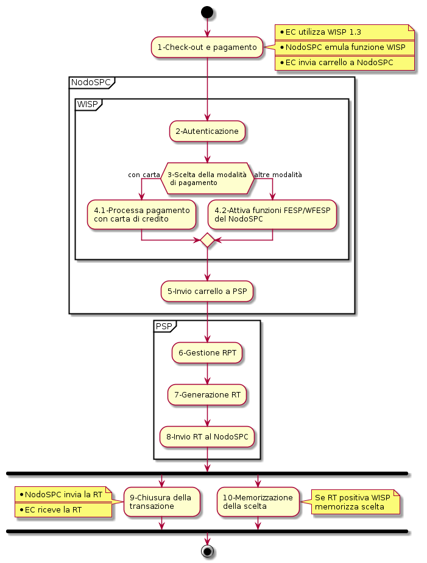
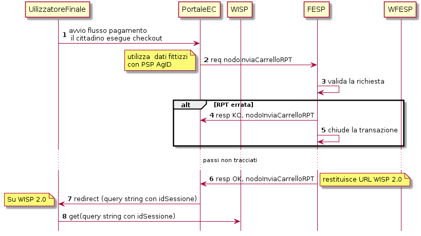
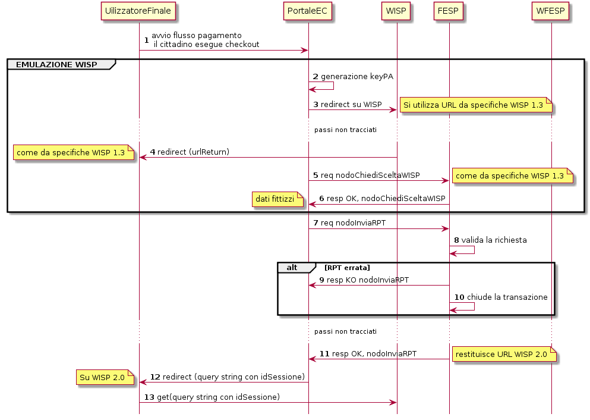
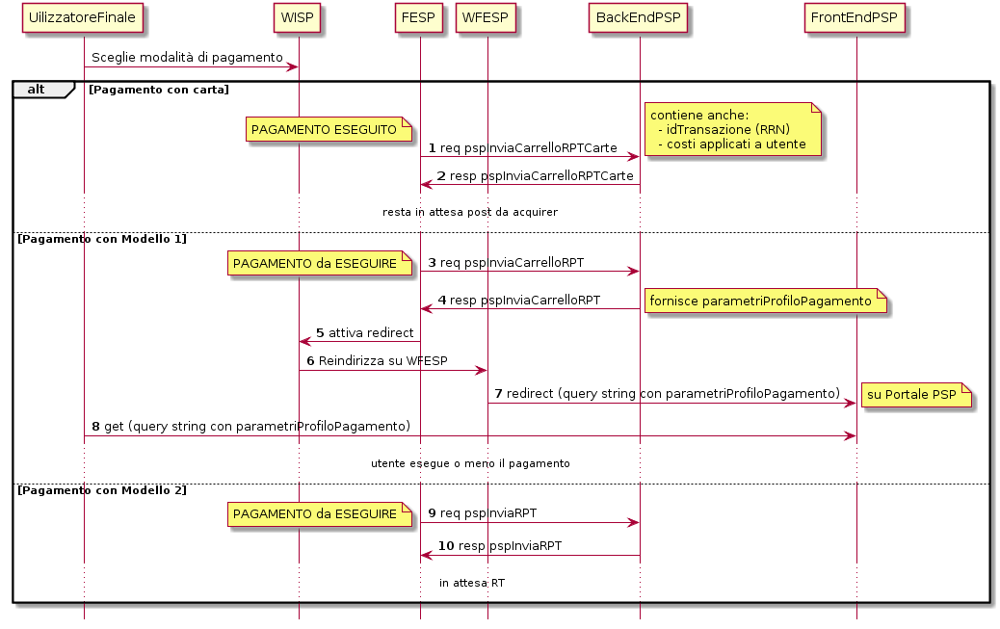
.. |image5| image:: ./myMediaFolder/media/image6.png
   :width: 5.90551in
   :height: 3.66659in
.. |image6| image:: ./myMediaFolder/media/image7.png
   :width: 5.70866in
   :height: 3.4613in
.. |image7| image:: ./myMediaFolder/media/image8.png
   :width: 5.90551in
   :height: 3.44244in
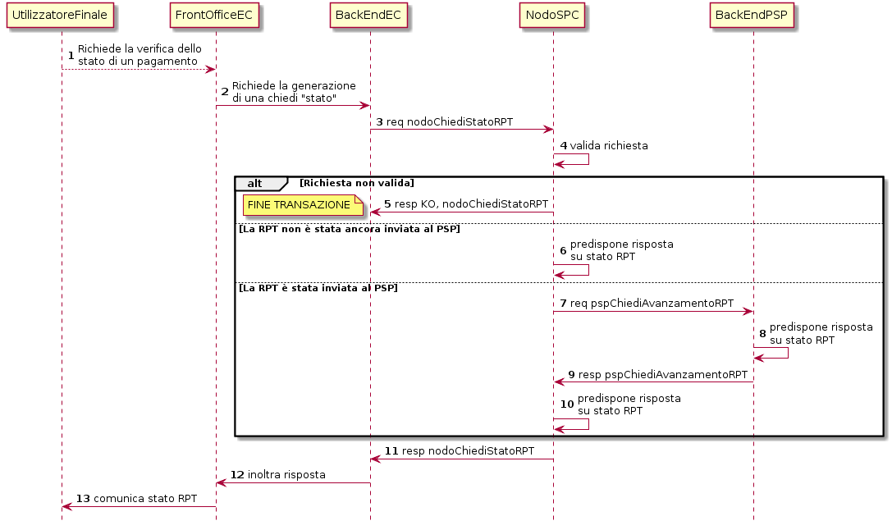
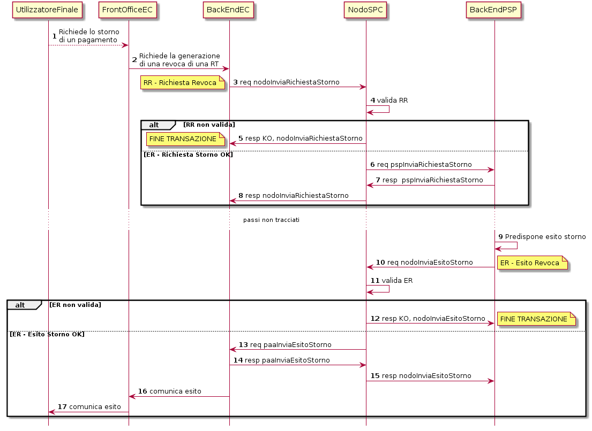
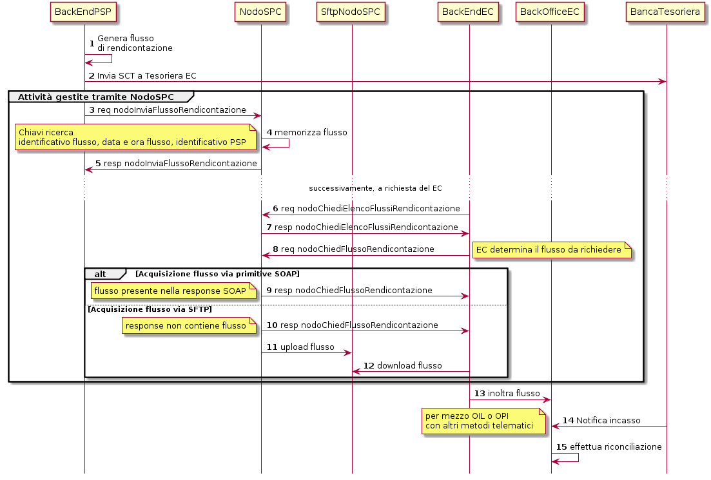
.. |image11| image:: ./myMediaFolder/media/image12.png
   :width: 5.90551in
   :height: 4.04141in
.. |image12| image:: ./myMediaFolder/media/image13.png
   :width: 5.90551in
   :height: 3.93284in
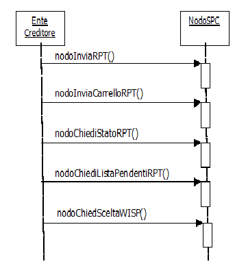
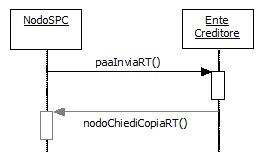
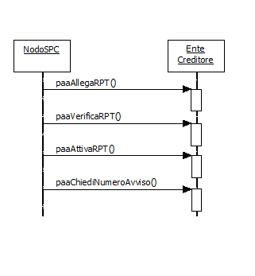
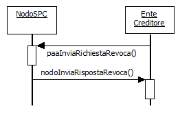
.. |image18| image:: ./myMediaFolder/media/image18.png
   :width: 5.90551in
   :height: 4.04141in
.. |image19| image:: ./myMediaFolder/media/image19.png
   :width: 5.90551in
   :height: 4.04141in
.. |image20| image:: ./myMediaFolder/media/image20.png
   :width: 5.90551in
   :height: 4.04141in
.. |image21| image:: ./myMediaFolder/media/image21.png
   :width: 5.90551in
   :height: 4.04141in
.. |image22| image:: ./myMediaFolder/media/image22.png
   :width: 5.90551in
   :height: 4.04141in
.. |image23| image:: ./myMediaFolder/media/image23.png
   :width: 5.90551in
   :height: 4.04141in
