+-----------------------------------------------------------------------+
| |AGID_logo_carta_intestata-02.png|                                    |
+-----------------------------------------------------------------------+

+--------------------------------------------------------------+
| **Capitolo 9. INTERAZIONE TRA NODO DEI PAGAMENTI-SPC E PSP** |
+--------------------------------------------------------------+

Interazione tra Nodo dei Pagamenti-SPC e PSP
============================================

Questo capitolo descrive le interfacce utilizzate nella cooperazione tra
Nodo dei Pagamenti-SPC e prestatori dei servizi di pagamento. L’uso
combinato di tali interfacce consente l'erogazione dei servizi di
pagamento secondo i modelli di pagamento previsti dalle presenti
specifiche.

Workflow dei modelli di pagamento e dei processi accessori
----------------------------------------------------------
.. _Workflow dei modelli di pagamento e dei processi accessori:

Come già indicato nei precedenti capitoli, il Nodo dei Pagamenti-SPC
pone a fattor comune le infrastrutture tecniche di comunicazione, agendo
quindi come normalizzatore dei protocolli di accesso ai servizi di
pagamento.

I prestatori di servizi di pagamento aderenti, di conseguenza, devono
implementare solamente i protocolli di accesso al Nodo dei Pagamenti-SPC
come definiti dagli *Web service* relativi e utilizzarli nei diversi
modelli di pagamento.

Tenuto conto che la descrizione dettagliata del *workflow* dei processi
di pagamento è stata in larga parte effettuata nel `paragrafo 8.2 <../15-Capitolo_8/Capitolo8.rst#interfacce-web-service-e-dettaglio-azioni-soap>`__, nei seguenti paragrafi verranno descritte le specificità legate alla
gestione di tali processi da parte dei PSP.

Pagamenti attivati presso l'Ente Creditore
~~~~~~~~~~~~~~~~~~~~~~~~~~~~~~~~~~~~~~~~~~
.. _Pagamenti attivati presso l'Ente Creditore:

Questi modelli di pagamento, già descritti ai paragrafi `2.1.1 <../07-Capitolo_2/Capitolo2.rst#processo-di-pagamento-con-re-indirizzamento-on-line>`_ e `2.1.2 <../07-Capitolo_2/Capitolo2.rst#processo-di-pagamento-con-autorizzazione-gestita-dal-psp>`__, i
prestatori dei servizi di pagamento devono consentire il pagamento
presso i propri sistemi.

Per la descrizione completa del flusso di lavoro si rimanda a quanto
indicato al `§ 8.1.1 <../15-Capitolo_8/Capitolo8.rst#pagamenti-attivati-presso-lente-creditore>`__ a partire da pagina 118.

Generazione e invio della Ricevuta Telematica
~~~~~~~~~~~~~~~~~~~~~~~~~~~~~~~~~~~~~~~~~~~~~
.. _Generazione e invio della Ricevuta Telematica:

Per la generazione delle RT non è previsto dal Nodo dei Pagamenti-SPC
alcuno specifico metodo, pertanto il PSP, una volta completato il
pagamento con uno dei modelli previsti, è tenuto a generare
immediatamente la RT con le modalità previste dalle presenti specifiche
e rispettando le indicazioni presenti nel documento "*Indicatori di*
*qualità per i Soggetti Aderenti*", pubblicato sul sito dell'Agenzia.

Per i pagamenti eseguiti presso l'Ente Creditore, l'invio delle Ricevute
Telematiche è consentito esclusivamente in modalità *push* (primitiva
**nodoInviaRT**), così come indicato nel *Workflow* di chiusura della
transazione presso EC (`vedi § 8.1.1.3 <../15-Capitolo_8/Capitolo8.rst#workflow-di-chiusura-della-transazione-presso-ec>`__, passi da 3 a 6). Per l'invio della RT in modalità *push* si veda anche il `§ 9.2.2.1 <../16-Capitolo_9/Capitolo9.rst#nodoinviart>`_.

Si tenga presente che nel caso in cui il PSP riceva un carrello di RPT
dovrà generare un insieme di RT e inviarle tutte con la primitiva
**nodoInviaRT**, ciclando fino a raggiungere la numerosità del
carrello stesso.

Casi di errore e strategie di ripristino
~~~~~~~~~~~~~~~~~~~~~~~~~~~~~~~~~~~~~~~~
.. _Casi di errore e strategie di ripristino:

Dall'analisi dell’interazione complessiva è possibile individuare i
punti dove è necessario trattare un esito negativo: alcuni di questi
sono dovuti ad errori di natura applicativa o relativi ai formati (RPT o
RT mal formate), sono quindi permanenti o ripristinabili solo con
l'intervento manuale; altri casi di errore sono invece relativi alla
interazione tra i vari soggetti e possono consentire politiche di
recupero automatico

A tale scopo il PSP partecipa alle operazioni di ripristino di eventuali
errori mettendo a disposizione le primitive previste dal protocollo di
colloquio per l’allineamento dello stato, quali
**pspChiediAvanzamentoRPT** e **pspChiediListaRT**.

Pagamenti attivati presso il PSP
~~~~~~~~~~~~~~~~~~~~~~~~~~~~~~~~
.. _Pagamenti attivati presso il PSP:

|image2|

**Figura** **45 – Activity diagram del modello di pagamento attivato presso il PSP**

Questo modello di pagamento, conosciuto anche come "Modello 3" e già
descritto al `§ 2.2 <../07-Capitolo_2/Capitolo2.rst#processo-di-pagamento-attivato-presso-il-psp>`_, presuppone che l’utilizzatore finale sia in possesso
di un avviso (analogico o digitale) contenente le indicazioni necessarie
per effettuare il pagamento.

Come già indicato, gli Enti Creditori devono mettere a disposizione:

a) l'archivio dei pagamenti in attesa (APA), contenente tutte le
   informazioni, associate ad un identificativo univoco, necessarie per
   effettuare il pagamento;

b) un’applicazione “*server*” dedicata necessaria per trattare le
   richieste provenienti dai PSP;

Il *workflow* di questo modello di pagamento è dettagliatamente
analizzato nel presente paragrafo e in quelli successivi. A tal
proposito si rimanda allo schema di *activity diagram* di Figura 45 a
pagina 173 nel quale è rappresentato il flusso principale delle attività
che contempla due percorsi alternativi; tali percorsi hanno in comune i
seguenti passi:

1) *Presentazione dell'Avviso*: l’utilizzatore finale presenta l'avviso
   analogico o digitale presso il *Front-End* del PSP rappresentato
   dalle sue strutture sul territorio (sportelli fisici, punti di
   presenza, ATM, ecc.) oppure dalle applicazioni di *home banking*
   o *mobile app* rese disponibili dal PSP;

6) *Chiusura della transazione*: il *Back-end* del PSP genera la RT
   (positiva nel caso di percorso "STANDARD", oppure
   positiva/negativa in funzione dell'esito del passo 3 del percorso
   "ALTERNATIVO") e la recapita, attraverso il NodoSPC, al
   *Back-end* dell'Ente Creditore.

Il percorso "STANDARD" (vedi il *workflow* di dettaglio al `§ 9.1.2.2 <../16-Capitolo_9/Capitolo9.rst#percorso-standard-per-il-modello-3>`_) siarticola nei seguenti passi:

2) *Verifica del pagamento in attesa*: in questa fase del processo,
   attraverso il NodoSPC, il interagisce con il *Back-end* dell'Ente
   Creditore che verifica la consistenza della richiesta e ne
   fornisce l'esito;

3) *Conferma del pagamento*: in questa fase l'utilizzatore finale
   interagisce con il *Front-End* del PSP e decide se effettuare il
   pagamento o abbandonare la transazione;

4) *Stampa dell'attestato: il Front-end* del PSP stampa l'attestato di
   pagamento (`vedi § 2.5 <../07-Capitolo_2/Capitolo2.rst#attestazione-del-pagamento>`_) da consegnare all'utilizzatore finale;

5) *Attivazione del pagamento*: il *Back-end* del PSP, attraverso il
   NodoSPC, invia al *Back-end* dell'Ente Creditore la richiesta di
   ricevere la RPT associata all'avviso verificato dal sistema;

Il percorso "ALTERNATIVO" (vedi il *workflow* di dettaglio al `§ 9.1.2.3 <../16-Capitolo_9/Capitolo9.rst#percorso-alternativo-per-il-modello-3>`__) prevede, invece, i passi appresso indicati:

2) *Attivazione del pagamento*: il *Back-end* del PSP, attraverso il
   NodoSPC, invia al *Back-end* dell'Ente Creditore la richiesta di
   ricevere dal sistema la RPT relativa all'avviso richiesto;

3) *Conferma del pagamento*: in questa fase l'utilizzatore finale
   interagisce con il *Front-End* del PSP e decide se effettuare o
   meno il pagamento. In caso di consenso al pagamento, il
   *Back-end* del PSP si predispone per generare un RT positiva, in
   caso di abbandono si predispone per generare una RT negativa;

4) *Stampa dell'attestato: il Front-end* del PSP stampa l'attestato di
   pagamento (`vedi § 2.5 <../07-Capitolo_2/Capitolo2.rst#attestazione-del-pagamento>`_) da consegnare all'utilizzatore finale;

Nel seguito i due percorsi saranno analizzati separatamente.

Da ultimo, si segnala che riveste particolare importanza in tutte le
fasi del processo di pagamento in questione un identificativo univoco,
generato in proprio dal PSP, che questi associa ad una data attività di
pagamento (CCP: codiceContestoPagamento) e successivamente alla RPT che
riceverà dall'Ente Creditore.

La valorizzazione del codiceContestoPagamento garantisce, a parità di
Ente Creditore, che l’istanza della RPT, generata per il codice IUV
specificato, risulti univoca (`vedi anche § 8.1 <../15-Capitolo_8/Capitolo8.rst#workflow-dei-modelli-di-pagamento-e-dei-processi-accessori>`_).

Presentazione dell'avviso e transcodifica dei dati per il pagamento
~~~~~~~~~~~~~~~~~~~~~~~~~~~~~~~~~~~~~~~~~~~~~~~~~~~~~~~~~~~~~~~~~~~
.. _Presentazione dell'avviso e transcodifica dei dati per il pagamento:

In questa fase il *Front-end* del PSP prende in carico i dati
dell'avviso che dovranno essere forniti al NodoSPC attraverso le
funzioni previste.

Tutti *workflow* che saranno esaminati prevedono che il PSP fornisca le
informazioni necessarie ad identificare il pagamento in attesa (`vedi §
7.4.2 <../13-Capitolo_7/Capitolo7.rst#automazione-dellavviso-di-pagamento-analogico>`__), specificando anche il tipo di parametri forniti alle varie primitive via via utilizzate.

In particolare, l’identificativo della codifica utilizzata per il dato
codificaInfrastrutturaPSP [1]_ consente al NodoSPC la transcodifica del
codice indicato sull'avviso di pagamento nel formato standard dei
parametri necessari ad identificare univocamente l’Ente Creditore.

Si tenga presente che, nella configurazione del NodoSPC, ad ogni
identificativo di codifica previsto per il dato
codificaInfrastrutturaPSP corrisponde uno schema XSD di validazione e
una regola di traduzione (`vedi § 15.5 all'Appendice 1 <../24-Capitolo_15/Capitolo15.rst#identificazione-rpt-in-attesa>`_).

Percorso "STANDARD" per il Modello 3
~~~~~~~~~~~~~~~~~~~~~~~~~~~~~~~~~~~~
.. _Percorso "STANDARD" per il Modello 3:

|image3|

**Figura** **46 – Sequence diagram di passo 2: Verifica avviso**

Il *workflow* di questo percorso si compone di più fasi, la prima delle
quali (Passo 2: Verifica avviso) fa riferimento allo schema di Figura 46
a pagina 175 e si compone dei seguenti *step*:

1) il *Front-End* del PSP prende in carico i dati dell'avviso (vedi
   Tabella 30, `§ 7.4.2 <../13-Capitolo_7/Capitolo7.rst#automazione-dellavviso-di-pagamento-analogico>`_), 
   imputati in maniera automatica o manuale, e
   li invia alla componente di *Back-end* del PSP;

2) la componente di *Back-end* del PSP invoca la primitiva
   **nodoVerificaRPT** (`vedi § 9.2.3.2 <../16-Capitolo_9/Capitolo9.rst#nodoattivarpt>`_) predisponendo i dati
   richiesti e la completa con un proprio identificativo di attività
   (CCP: codiceContestoPagamento), il quale lega detta attività alla
   RPT che sarà generata dall’Ente Creditore;

3) la componente FESP del NodoSPC valida la richiesta;

**caso di richiesta validata:**

4) la componente FESP del NodoSPC converte i dati ricevuti nello *step*
   precedente, passando dalla specifica codifica agli identificatori
   standard del sistema pagoPA e, sulla base di tali dati, provvede
   all’inoltro della richiesta di verifica della RPT alla componente
   di *Back-end* dell'Ente Creditore con la primitiva
   **paaVerificaRPT** (`vedi § 8.2.3.1 <../15-Capitolo_8/Capitolo8.rst#paaverificarpt>`_);

5) la componente di *Back-end* dell'Ente Creditore verifica lo stato del
   pagamento in attesa: se il pagamento risulta ancora “in attesa”
   (vedi diagramma di stato di Figura 52 a pagina 185), la verifica
   ha esito positivo; viceversa, nel caso in cui il pagamento
   richiesto presentasse situazioni anomale (sconosciuto, già
   pagato, annullato, scaduto, ecc.) la verifica ha esito negativo;

6) la componente di *Back-end* dell'Ente Creditore restituisce l'esito
   della richiesta, indicando eventuali informazioni accessorie sul
   pagamento [2]_ nel parametro O-2.f causaleVersamento (`si veda §
   8.2.3.2 <../15-Capitolo_8/Capitolo8.rst#paaattivarpt>`__), soprattutto in occasione di errori circa lo stato del
   pagamento (pagato, scaduto, in corso, ecc.). A tal proposito, si
   veda quanto indicato al Capitolo paragrafo `§ 10.1 <../17-Capitolo_10/Capitolo10.rst#la-struttura-faultbean>`_
   (vedi Tabella 51 - Elementi che compongono la struttura **faultBean**);

7) la componente FESP del NodoSPC controlla l'esistenza, nell'elenco
   degli IBAN abilitati ad operare (c.d. *White List*), del dato
   indicato dall'EC nel parametro O-2.b ibanAccredito della
   primitiva **nodoVerificaRPT**; in caso di verifica negativa la
   componente FESP del NodoSPC genera uno specifico errore da
   inviare alla componente di *Back-end* del PSP;

8) la componente FESP del NodoSPC inoltra l'esito della primitiva
   **nodoVerificaRPT** alla componente di *Back-end* del PSP,
   trasportando l'eventuale errore emesso dall'EC nell'apposita
   struttura indicata al paragrafo 10.1 (vedi Tabella 51 - Elementi
   che compongono la struttura **faultBean**);

**caso di richiesta non validata:**

9) la componente FESP del NodoSPC invia una *response* KO alla primitiva
   **nodoVerificaRPT**;

**in ogni caso:**

10) l’esito viene inoltrato al *Front-End* del PSP;

11) il *Front-End* del PSP comunica all'utilizzatore finale l'esito
    dell'operazione e le eventuali informazioni accessorie.

Con riferimento allo *activity diagram* di Figura 45 a pagina 173,
l'utilizzatore finale ha in questo momento in mano tutte le informazioni
necessarie per decidere se effettuare il pagamento o meno (Passo 3):
qualora l'utilizzatore finale decida di non effettuare il pagamento, il
flusso termina e dovrà essere inizializzato da capo. In caso contrario,
sarà avviata la seconda fase del percorso "STANDARD" che prevede la
stampa dell'attestato di pagamento (Passo 4) ed il contemporaneo
l'innesco del Passo 5 (Attiva pagamento).

Per l'implementazione del Passo 5, il Nodo dei Pagamenti-SPC mette a
disposizione due diversi processi che, solo per semplicità di
esposizione, saranno illustrati in contesti diversi: il primo nel
presente paragrafo (schema di Figura 47), il secondo nel paragrafo
relativo all'illustrazione del percorso "ALTERNATIVO" (diagramma di
Figura 48 a pagina 180).

Il primo processo, relativo al Passo 5 (Attiva pagamento) prevede i
seguenti *step*:

12) vedi *step* 1 del Passo 2 (Verifica del pagamento), in precedenza
    indicato;

13) la componente di *Back-end* del PSP invoca la primitiva
    **nodoAttivaRPT**, (`vedi § 9.2.3.2 <../16-Capitolo_9/Capitolo9.rst#nodoattivarpt>`_) componendo i dati
    richiesti e la completa con un proprio identificativo di
    attività di pagamento (CCP: codiceContestoPagamento), il quale
    lega l'attività alla RPT che sarà generata dall’Ente Creditore.
    È assolutamente necessario che, in questo contesto, il PSP
    utilizzi lo stesso CCP usato per la fase di verifica;

14) la componente FESP del NodoSPC valida la richiesta;

**caso di richiesta validata:**

|image4|

**Figura** **47 – Sequence diagram di passo 3: Attiva pagamento**

15) la componente FESP del NodoSPC converte i dati ricevuti nello *step*
    precedente, passando dalla specifica codifica agli
    identificatori standard del sistema pagoPA e, sulla base di tali
    dati, provvede all’inoltro della richiesta alla componente di
    *Back-end* dell'Ente Creditore con la primitiva
    **paaAttivaRPT** (`vedi § 8.2.3.2 <../15-Capitolo_8/Capitolo8.rst#paaattivarpt>`_);

16) la componente di *Back-end* dell'Ente Creditore verifica lo stato
    del pagamento in attesa: se il pagamento risulta ancora “in
    attesa” o "in verifica" (vedi diagramma di stato di Figura 52 a
    pagina 185), la richiesta ha esito positivo; viceversa, nel caso
    in cui il pagamento richiesto presentasse situazioni anomale
    (sconosciuto, già pagato, annullato, scaduto, ecc.) la richiesta
    ha esito negativo;

**caso di risposta positiva:**

17) se la verifica è positiva, la componente di *Back-end* dell'Ente
    Creditore:

    a. genera la relativa RPT utilizzando il codice IUV, il
       codiceContestoPagamento e gli altri dati previsti.

    b. predispone una *response* OK alla primitiva **paaAttivaRPT**,
       indicando eventuali informazioni accessorie sul pagamento nel
       parametro O-2.f causaleVersamento (`si veda § 8.2.3.1 <../15-Capitolo_8/Capitolo8.rst#paaverificarpt>`_);

    c. schedula un task che invocherà la primitiva **nodoInviaRPT**,
       per inviare al *Back-end* del PSP la RPT richiesta,
       utilizzando gli stessi dati di cui al punto a);

18) la componente FESP del NodoSPC controlla l'esistenza, nell'elenco
    degli IBAN abilitati ad operare (c.d. *White List*), del dato
    indicato dall'EC nel parametro O-2.b ibanAccredito della
    primitiva **nodoVerificaRPT**; in caso di verifica negativa la
    componente FESP del NodoSPC invia una *response* KO alla
    primitiva **nodoAttivaRPT** generando uno specifico errore: in
    questo caso vedere il `paragrafo 9.1.2.7 <../16-Capitolo_9/Capitolo9.rst#casi-di-errore-e-strategie-di-ripristino-1>`_;

19) la componente di *Back-end* dell'Ente Creditore invia una *response*
    positiva per la primitiva **paaAttivaRPT**;

20) la componente FESP del NodoSPC inoltra l'esito della primitiva
    **paaAttivaRPT** alla componente di *Back-end* del PSP,
    trasportando eventuali informazioni accessorie sul
    pagamento [3]_ nel parametro O-2.f causaleVersamento (`vedi § 8.2.3.2 <../15-Capitolo_8/Capitolo8.rst#paaattivarpt>`_);

21) la componente di *Back-end* del PSP si pone in attesa dell'arrivo
    della RPT, che sarà riconosciuta in funzione di: idDominio
    dell'EC, codice IUV e Codice Contesto Pagamento (CCP);

**caso di risposta negativa:**

22) la componente di *Back-end* dell'Ente Creditore invia una *response*
    KO per la primitiva **paaAttivaRPT** alla componente FESP del
    NodoSPC;

23) la componente FESP del NodoSPC inoltra l'esito della primitiva
    **paaAttivaRPT** alla componente di *Back-end* del PSP,
    trasportando nell'apposita struttura indicata al paragrafo 10.1
    (vedi Tabella 51 - Elementi che compongono la struttura
    **faultBean**) l’errore emesso dall'Ente Creditore;

**caso di richiesta non validata:**

24) la componente FESP del NodoSPC invia una *response* KO alla
    primitiva **nodoAttivaRPT** con esito negativo: in questo caso
    vedere il `paragrafo 9.1.2.7 <../16-Capitolo_9/Capitolo9.rst#casi-di-errore-e-strategie-di-ripristino-1>`_.

Come indicato al precedente punto 19, il *Back-End* del PSP attende
l'arrivo della RPT richiesta per completare il processo del percorso
"STANDARD"; nel caso in cui la RPT non pervenga al PSP, si veda quanto
indicato al `paragrafo 9.1.2.7 <../16-Capitolo_9/Capitolo9.rst#casi-di-errore-e-strategie-di-ripristino-1>`_.

Come ultimo *step* del percorso "STANDARD" sarà attivata la fase di
"*Chiusura della transazione*" (`vedi § 9.1.2.4 <../16-Capitolo_9/Capitolo9.rst#chiusura-della-transazione-presso-il-psp>`_), 
fornendo l'indicazione di generare e inviare all'EC una RT positiva.

Percorso "ALTERNATIVO" per il Modello 3
~~~~~~~~~~~~~~~~~~~~~~~~~~~~~~~~~~~~~~~
.. _Percorso "ALTERNATIVO" per il Modello 3:

Come indicato dallo *activity diagram* di Figura 45 a pagina 173, il
percorso "ALTERNATIVO" del modello 3 non prevede la fase di verifica,
bensì inizia direttamente dal Passo 2 (Attiva pagamento). Per eseguire
tale fase, può essere utilizzato il processo previsto per il Passo 5 del
percorso "STANDARD" (vedi lo schema di Figura 47 a pagina 177);
tuttavia, a fini puramente esplicativi, in questo paragrafo sarà
illustrata un processo diverso, studiato per meglio gestire alcune
possibili condizioni di errore.

Tutto ciò premesso, il *workflow* del Passo 2 (Attiva pagamento),
rappresentato nel diagramma di Figura 48 a pagina 180, prevede i
seguenti *step*:

1) Vedi *step* 1 del Passo 2 (Verifica avviso) nel percorso
   STANDARD;

2) la componente di *Back-end* del PSP invoca la primitiva
   **nodoAllegaRPT** (`vedi § 9.2.3.3 <../16-Capitolo_9/Capitolo9.rst#nodoallegarpt>`_), componendo i dati richiesti
   e la completa con un proprio identificativo di attività di
   pagamento (CCP), il quale lega l'attività di pagamento alla RPT
   che sarà generata dall’Ente Creditore;

3) la componente FESP del NodoSPC si attiva per validare la richiesta;

**in caso di richiesta validata;**

4) la componente FESP del NodoSPC converte i dati ricevuti nello *step*
   precedente, passando dalla specifica codifica agli identificatori
   standard del sistema pagoPA e, sulla base di tali dati, provvede
   all’inoltro della richiesta alla componente di *Back-end*
   dell'Ente Creditore con la primitiva **paaAllegaRPT** 
   (`vedi § 8.2.3.3 <../15-Capitolo_8/Capitolo8.rst#paaallegarpt>`_);

5) la componente di *Back-end* dell'Ente Creditore verifica lo stato del
   pagamento in attesa: se il pagamento risulta ancora “in attesa”
   (vedi diagramma di stato di Figura 52 a pagina 185), la richiesta
   ha esito positivo; viceversa, nel caso in cui il pagamento
   richiesto presentasse situazioni anomale (sconosciuto, già
   pagato, annullato, scaduto, ecc.) la richiesta ha esito;

**Caso in cui lo stato del pagamento sia OK**

6) la componente di *Back-end* dell'Ente Creditore:

   a. genera la relativa RPT utilizzando il codice IUV, il
      codiceContestoPagamento e gli altri dati previsti.

   b. invia una *response* OK alla primitiva **paaAllegaRPT**,
      allegando la RPT richiesta, nonché indicando eventuali
      informazioni accessorie sul pagamento nel parametro O-2.f
      causaleVersamento;

7) la componente FESP del NodoSPC controlla la RPT allegata alla
   primitiva **paaAllegaRPT**;

**In caso di RPT non corretta formalmente:**

8) la componente FESP del NodoSPC invia al *Back-end* del PSP una
   response negativa alla primitiva **nodoAllegaRPT** indicando
   che la RPT richiesta non può essere inoltrata. Il flusso poi
   prosegue al punto 15;

9) la componente FESP del NodoSPC genera una RT negativa per comunicare
   all'Ente Creditore che la sua RPT non è inoltrabile e che deve
   riportare il pagamento allo stato precedente alla richiesta. Il
   dato esitoSingoloPagamento della RT contiene il
   faultBean.faultCode relativo all’errore riscontrato in sede di
   verifica della RPT e previsto per la primitiva
   **nodoInviaRPT** (`vedi § 8.2.1.1 <../15-Capitolo_8/Capitolo8.rst#nodoinviarpt>`_);

10) la componente FESP del NodoSPC invia alla componente di *Back-end*
    dell'Ente Creditore la RT generata al punto precedente tramite
    la primitiva **paaInviaRT**;

11) la componente di *Back-end* dell'Ente Creditore invia una response
    positiva alla componente FESP del NodoSPC per la primitiva
    **paaInviaRT**. Il flusso termina;

**Nel caso in cui la RPT sia formalmente corretta, il flusso prosegue al punto 15**

**Caso in cui lo stato del pagamento non sia OK**

12) la componente di *Back-end* dell'Ente Creditore invia una *response*
    KO alla primitiva **paaAllegaRPT**, indicando anche in questo
    caso eventuali informazioni accessorie sul pagamento;

13) la componente FESP del NodoSPC inoltra l'esito della richiesta alla
    componente di *Back-end* del PSP, trasportando l'eventuale
    errore emesso dall'EC nell'apposita struttura indicata al
    `§ 10.1 <../17-Capitolo_10/Capitolo10.rst#la-struttura-faultbean>`__ 
    (vedi Tabella 51 - Elementi che compongono la struttura **faultBean**). 
    Il flusso poi prosegue al punto 15;

**caso di richiesta non validata:**

14) la componente FESP del NodoSPC invia una *response* KO alla
    primitiva **nodoAllegaRPT** con esito negativo;

**in ogni caso:**

15) l’esito viene inoltrato al *Front-End* del PSP;

16) il *Front-End* del PSP comunica all'utilizzatore finale l'esito
    dell'operazione e le eventuali informazioni accessorie.

|image5|

**Figura** **48 – Sequence diagram di passo 2: Attiva pagamento**

Con riferimento allo *activity diagram* di Figura 45 a pagina 173,
l'utilizzatore finale ha in questo momento in mano tutte le informazioni
necessarie per decidere se effettuare il pagamento o meno (Passo 3).

Qualora l'utilizzatore finale decida di effettuare il pagamento, sarà
avviata la successiva fase del percorso "ALTERNATIVO" che prevede la
stampa dell'attestato di pagamento (Passo 4) ed il contemporaneo innesco
della fase di "*Chiusura della transazione*" 
(`vedi § 9.1.2.4 <../16-Capitolo_9/Capitolo9.rst#chiusura-della-transazione-presso-il-psp>`_), 
fornendo l'indicazione di generare e inviare all'EC una RT positiva.

Qualora l'utilizzatore finale decida di non effettuare il pagamento,
sarà sempre innescata la fase di "*Chiusura della transazione*" 
(`vedi § 9.1.2.4 <../16-Capitolo_9/Capitolo9.rst#chiusura-della-transazione-presso-il-psp>`_), 
fornendo l'indicazione di generare e inviare all'EC una RT negativa.

Chiusura della transazione presso il PSP
~~~~~~~~~~~~~~~~~~~~~~~~~~~~~~~~~~~~~~~~
.. _Chiusura della transazione presso il PSP:

L'ultimo passo del processo di pagamento attivato presso il PSP, come
indicato dallo *activity diagram* di Figura 45 a pagina 173, è
rappresentato dalla fase di generazione della RT e del suo invio
all'Ente Creditore attraverso il NodoSPC.

In questa fase, la componente di *Back-end* del PSP sa che dovrà
generare e inviare all'Ente Creditore una RT: positiva o negativa, in
funzione dell'esito delle fasi precedenti.

|image6|

**Figura** **49 – Sequence diagram della fase di chiusura della**
**transazione presso il PSP**

Il meccanismo di invio delle RT al NodoSPC presentato in questo
paragrafo è denominato **"RT pull"** in quanto è il NodoSPC stesso che
richiede ai vari PSP le RT pronte per essere inviate agli Enti
Creditori.

Il *workflow* del processo in esame ("RT *pull*") è indicato in Figura
49 a pagina 181 e prevede i seguenti passi:

1) la componente di *Back-end* del PSP riceve, come output delle fasi
   precedenti, la RPT e l'esito del pagamento;

2) la componente di *Back-end* del PSP genera la RT in questione,
   componendo i dati richiesti, la archivia nella base dati e
   aggiorna l'elenco delle RT da spedire;

3) a tempo, la componente FESP del Nodo dei Pagamenti-SPC attiva la
   *request* della primitiva **pspChiediListaRT** verso la
   componente di *Back-end* del PSP;

4) la componente di *Back-end* del PSP compone la lista delle RT da
   spedire e la inserisce nella *response* della primitiva
   **pspChiediListaRT**;

la componente FESP del NodoSPC attiva un ciclo, fino ad esaurimento
della lista delle RT pronte per essere inviate all'EC, composto
dalle seguenti attività:

5) la componente FESP del Nodo SPC attiva la *request* della primitiva
   **pspChiediRT** verso la componente di *Back-end* del PSP;

6) la componente di *Back-end* del PSP predispone la *response* alla
   primitiva **pspChiediRT** allegando la RT richiesta;

7) la componente FESP del Nodo valida la RT;

**caso di RT OK:**

8) la componente FESP del Nodo SPC attiva la *request* della primitiva
   **pspInviaAckRT** verso la componente di *Back-end* del PSP
   contenente il valore **ACTC** (accettato);

9) la componente di *Back-end* del PSP elimina la RT in questione
   dall'elenco delle RT da spedire all'EC;

10) la componente di *Back-end* del PSP predispone la *response* alla
    primitiva **pspInviaAckRT**;

11) la componente FESP del Nodo SPC attiva la *request* della primitiva
    **paaInviaRT** verso la componente di *Back-end* dell'Ente
    Creditore, con in allegato la RT in questione;

12) la componente di *Back-end* dell'Ente Creditore del PSP predispone
    la *response* alla primitiva **paaInviaRT**;

**caso di RT KO:**

13) la componente FESP del Nodo SPC attiva la *request* della primitiva
    **pspInviaAckRT** verso la componente di *Back-end* del PSP
    contenente il valore **RJCT** (rifiutato);

14) la componente di *Back-end* del PSP predispone la *response* alla
    primitiva **pspInviaAckRT**.

**Questo meccanismo non può essere usato per tutti i pagamenti attivati**
**presso l'Ente Creditore, per i quali deve essere tassativamente usato il**
**meccanismo "RT push"** (`vedi § 8.1.1.3 <../15-Capitolo_8/Capitolo8.rst#workflow-di-chiusura-della-transazione-presso-ec>`_).

**Il meccanismo "RT pull" è deprecato e mantenuto per retro**
**compatibilità; in futuro sarà sostituito dal meccanismo "RT push"**.

Pagamento spontaneo presso il PSP
~~~~~~~~~~~~~~~~~~~~~~~~~~~~~~~~~
.. _Pagamento spontaneo presso il PSP:

|image7|

**Figura** **50 – Activity diagram del modello di pagamento attivato**
**presso il PSP**

Nel modello di pagamento attivato presso il PSP, l'utilizzatore finale,
se sprovvisto del Numero Avviso (che contiene il codice IUV), non
risulta in grado di avviare il pagamento desiderato. Tale situazione
rappresenta una limitazione sia per l'utilizzatore finale, sia per il
sistema in generale. Al fine di superare tali limitazioni è stato
attivato il modello di pagamento illustrato dallo *Activity diagram*
Figura 50 a pagina 182, sostanzialmente simile al processo di pagamento
attivato presso i PSP presentato in precedenza.

L'applicazione del modello sarà riservata a specifici servizi, di
interesse generale, caratterizzati da un insieme di dati in possesso
dell'utilizzatore finale che permettono di identificare univocamente il
tipo di pagamento da effettuare.

Il flusso principale delle attività si articola sulla stessa falsariga
del percorso "STANDARD" del modello 3 e prevede i seguenti passi:

1) *Input dati alternativi*: l’utilizzatore finale, che non dispone
   dell'avviso analogico o digitale, ma che possiede informazioni
   facilmente disponibili (ad esempio: la targa del proprio veicolo, il
   proprio codice fiscale, ecc.) utilizza il *Front-End* del PSP
   rappresentato dalle sue strutture sul territorio (sportelli fisici,
   punti di presenza, ATM, ecc.) oppure dalle applicazioni di
   *home banking* o *mobile app*;

2) *Richiesta del Numero Avviso*: il *Back-end* del PSP, attraverso il
   NodoSPC, invia al *Back-end* dell'Ente Creditore la richiesta di
   conoscere il numero avviso (vedi *workflow* di dettaglio relativo al
   diagramma di Figura 51 a pagina 183);

3) *Conferma del pagamento*: in questa fase l'utilizzatore finale
   interagisce con il *Front-End* del PSP e decide se effettuare il
   pagamento o abbandonare la transazione;

4) *Stampa dell'attestato: il Front-end* del PSP stampa l'attestato di
   pagamento (`vedi § 2.5 <../07-Capitolo_2/Capitolo2.rst#attestazione-del-pagamento>`_) da consegnare all'utilizzatore finale;

5) *Attivazione del pagamento*: il *Back-end* del PSP, attraverso il
   NodoSPC, invia al *Back-end* dell'Ente Creditore la richiesta di
   ricevere la RPT associata all'avviso verificato dal sistema;

6) *Chiusura della transazione*: vedi stesso passo al `§ 9.1.2.4 <../16-Capitolo_9/Capitolo9.rst#chiusura-della-transazione-presso-il-psp>`_.

|image8|

**Figura** **51 – Sequence diagram della fase di richiesta del Numero Avviso**

Per il resto del *workflow*, si faccia riferimento ai processi ed ai
passi definiti per il percorso "STANDARD".

Il *workflow* del processo della richiesta del Numero Avviso è indicato
in Figura 51 a pagina 183 e prevede i seguenti passi:

1) la componente di *Front-end* del PSP inoltra i dati specifici del
   servizio (ad esempio. targa del veicolo e Regione di residenza),
   inseriti dall'utilizzatore finale, alla componente di *Back-end*
   del PSP che predispone l'apposito file XML dedicato al servizio;

2) la componente di *Back-end* del PSP invoca la primitiva
   **nodoChiediNumeroAvviso** (`vedi § 9.2.3.4 <../16-Capitolo_9/Capitolo9.rst#nodochiedinumeroavviso>`_) fornendo i file XML
   sopra indicato;

3) la componente FESP del NodoSPC valida la richiesta;

**caso di richiesta validata:**

4) la componente FESP del NodoSPC provvede all’inoltro della richiesta
   di Numero Avviso alla componente di *Back-end* dell'Ente
   Creditore con la primitiva **paaChiediNumeroAvviso** (`vedi § 8.2.3.4 <../15-Capitolo_8/Capitolo8.rst#paachiedinumeroavviso>`_);

5) la componente di *Back-end* dell'Ente Creditore verifica la presenza
   del dovuto sugli archivi dello specifico servizio invocato;

Caso di dovuto presente su DB servizio

6) la componente di *Back-end* dell'EC verifica che il dovuto sia
   presente sull'Archivio dei Pagamenti in Attesa (APA);

7) qualora il dovuto fosse presente sul DB APA, la componente di
   *Back-end* dell'Ente Creditore genera il record sul DB,
   attribuendogli codice IUV e Numero Avviso;

8) la componente di *Back-end* dell'Ente Creditore invia una *response*
   positiva per la primitiva **nodoChiediNumeroAvviso**;

Caso di dovuto NON presente su DB servizio

9) la componente di *Back-end* dell'Ente Creditore invia una *response*
   *negativa* per la primitiva **nodoChiediNumeroAvviso**;

10) la componente FESP del Nodo dei Pagamenti-SPC inoltra l'esito della
    primitiva **nodoChiediNumeroAvviso** alla componente di
    *Back-end* del PSP, trasportando l'eventuale errore emesso
    dall'EC nell'apposita struttura indicata al `§ 10.1 <../17-Capitolo_10/Capitolo10.rst#la-struttura-faultbean>`_
    (vedi Tabella 51 - Elementi che compongono la struttura **faultBean**);

**caso di richiesta non validata:**

11) la componente FESP del NodoSPC invia una *response* negativa alla
    invocazione della primitiva **nodoChiediNumeroAvviso**;

**in ogni caso:**

17) l’esito viene inoltrato al *Front-End* del PSP;

12) il *Front-End* del PSP comunica all'utilizzatore finale l'esito
    dell'operazione e le eventuali informazioni accessorie.

Completato il Passo 2 (Input dati alternativi), l'utilizzatore finale ha
in questo momento in mano tutte le informazioni necessarie per decidere
se effettuare il pagamento o meno (Passo 3): qualora l'utilizzatore
finale decida di non effettuare il pagamento, il flusso termina e dovrà
essere inizializzato da capo. In caso contrario, sarà avviata la seconda
fase del processo che prevede la stampa dell'attestato di pagamento
(Passo 4) ed il contemporaneo l'innesco del Passo 5 (Attiva pagamento).

Come ultimo *step* del processo, sarà attivata la fase di
"*Chiusura della transazione*" (`vedi § 9.1.2.4 <../16-Capitolo_9/Capitolo9.rst#chiusura-della-transazione-presso-il-psp>`_),
fornendo l'indicazione di generare e inviare all'EC una RT positiva.

Interazioni con l’utilizzatore finale
~~~~~~~~~~~~~~~~~~~~~~~~~~~~~~~~~~~~~
.. _Interazioni con l’utilizzatore finale:

Nelle interazioni con l’utilizzatore finale, sia che avvengano presso i
punti fisici, sia che vengano mediate da strumenti elettronici (home
banking, ATM, app, ecc.), il PSP deve rendere disponibili le
informazioni fornite dall’Ente Creditore e presenti nel parametro
causaleVersamento delle primitive **nodoVerificaRPT**,
**nodoAttivaRPT** e **nodoAllegaRPT** (quando attivata).

Tale informazione, opportunamente formattata, deve essere indicata,
insieme a quelle specificate al `§ 2.5 <../07-Capitolo_2/Capitolo2.rst#attestazione-del-pagamento>`_,
anche nella ricevuta che il prestatore di servizi di pagamento consegna all’utilizzatore finale
quale attestazione dell’avvenuto pagamento.

Casi di errore e strategie di ripristino
~~~~~~~~~~~~~~~~~~~~~~~~~~~~~~~~~~~~~~~~
.. _Casi di errore e strategie di ripristino-1:

|image9|

**Figura** **52 – State diagram del processo di pagamento attivato presso il PSP**

CASO A: errore verso il PSP nella fase di verifica del pagamento

Il PSP riceve una *response* negativa in risposta alla primitiva
**nodoVerificaRPT**. in quanto il codice IBAN segnalato dall'Ente
Creditore non è presente nella *White List* del NodoSPC.

Il Tavolo Operativo del NodoSPC, in maniera proattiva, contatta il
Tavolo Operativo dell'Ente Creditore per segnalare la specifica
fattispecie, affinché l’Ente Creditore corregga immediatamente l’errore
segnalato.

Caso B: errore verso il PSP nella fase di attivazione del pagamento

Il PSP riceve una *response* negativa in risposta alla primitiva
**nodoAttivaRPT** oppure la sua applicazione di *Back-End* non è
disponibile a ricevere l’esito di tale primitiva.

Per completare correttamente questa fase del processo, il PSP deve:
contattare il Tavolo Operativo del NodoSPC verificando lo stato della
transazione e, se del caso, correggere l’errore segnalato e inviare di
nuovo la primitiva **nodoAttivaRPT**.

In ogni caso, il NodoSPC, in maniera proattiva, contatta attraverso il
proprio Tavolo Operativo quello dell'Ente Creditore per segnalare la
specifica fattispecie, affinché l’Ente Creditore corregga immediatamente
l’errore segnalato.

CASO C: errore verso l’Ente Creditore nell’invio della RPT

L’Ente Creditore riceve una *response* negativa in risposta alla
primitiva **nodoInviaRPT** e di conseguenza il PSP non riceve la RPT
richiesta.

In ogni caso, il NodoSPC, in maniera proattiva, contatta attraverso il
proprio Tavolo Operativo quello dell'Ente Creditore per segnalare la
specifica fattispecie, affinché l’Ente Creditore corregga immediatamente
l’errore segnalato.

Una volta corretto l'errore, l’Ente Creditore deve attivare di nuovo la
primitiva **nodoInviaRPT** senza sollecitazione da parte del PSP.

In entrambe i casi (A e B), qualora il processo di consegna della RPT al
PSP non sia completato entro il giorno successivo al verificarsi di tali
eventualità, il PSP è autorizzato a chiudere l’operazione segnalandola
all'interno del flusso di Rendicontazione standard (vedi Capitolo 7
delle SACI): allo scopo indicherà nel dato codiceEsitoSingoloPagamento
il valore 9 (Pagamento eseguito in assenza di RPT).

Processo di storno del pagamento eseguito
~~~~~~~~~~~~~~~~~~~~~~~~~~~~~~~~~~~~~~~~~
.. _Processo di storno del pagamento eseguito:

Qualora l’utilizzatore finale, a vario titolo, chieda la cancellazione
di un pagamento all’Ente Creditore presso il quale questo è stato
disposto (c.d. storno), il Nodo dei Pagamenti-SPC mette a disposizione i
servizi telematici necessari per gestire le richieste di storno di
pagamenti già effettuati e per i quali potrebbe essere già stata
restituita la Ricevuta Telematica corrispondente (`vedi anche §§ 2.1.4 <../07-Capitolo_2/Capitolo2.rst#storno-del-pagamento>`_ e
`4.4.5 <../09-Capitolo_4/Capitolo4.rst#storno-di-un-pagamento>`_).

Poiché il processo di storno del pagamento prende avvio presso l'Ente
Creditore, per il *workflow* dettagliato si faccia riferimento al `§ 8.1.3 <../15-Capitolo_8/Capitolo8.rst#processo-di-storno-del-pagamento-eseguito>`_.

Processo di revoca della Ricevuta Telematica
~~~~~~~~~~~~~~~~~~~~~~~~~~~~~~~~~~~~~~~~~~~~
.. _Processo di revoca della Ricevuta Telematica:

Il NodoSPC permette di gestire i servizi telematici per le richieste di
annullamento di pagamenti già effettuati e per i quali è già stata
restituita la Ricevuta Telematica corrispondente, rendendo, a questo
scopo, disponibile un'interfaccia specifica, ad uso dei PSP, per
richiedere all’Ente Creditore di riferimento la revoca di una RT
specifica (`si veda anche §§ 2.3 <../07-Capitolo_2/Capitolo2.rst#revoca-della-ricevuta-telematica>`_ e 
`4.4.4 <../09-Capitolo_4/Capitolo4.rst#revoca-della-ricevuta-telematica>`_).

Il *Sequence diagram* del processo di Revoca della RT è riportato in
Figura 53 a pagina 187, nella quale:

1) il *Back-office* del PSP richiede alla componente di *Back-end* del
   PSP di revocare una RT per un “annullo tecnico” oppure a seguito di
   una richiesta effettuata da un proprio cliente `vedi § 2.3 <../07-Capitolo_2/Capitolo2.rst#revoca-della-ricevuta-telematica>`_;

2) la componente di *Back-end* del PSP richiede la revoca di una RT
   inviando al NodoSPC la Richiesta Revoca (RR) tramite la primitiva
   **nodoInviaRichiestaRevoca**;

3) il NodoSPC valida la richiesta di revoca;

4) se la richiesta non è valida, il NodoSPC invia una *response*
   negativa e chiude la transazione:

5) se la richiesta è valida, il NodoSPC la inoltra alla componente di
   *Back-end* dell'Ente Creditore per mezzo della primitiva
   **paaInviaRichiestaRevoca**;

6) la componente di *Back-end* dell'Ente Creditore conferma al NodoSPC
   la ricezione della RR;

7) il NodoSPC conferma alla componente di *Back-end* del PSP l'invio
   della richiesta all’EC;

8) la componente di *Back-end* dell'EC inoltra la richiesta al proprio
   *Back-office*;

|image10|

**Figura** **53 - Sequence diagram del processo di revoca della RT**

**Attività non tracciate:** il *Back-office* dell'Ente Creditore
verifica la richiesta dal punto di vista amministrativo e decide se
accettarla o rifiutarla;

9)  il *Back-office* dell'Ente Creditore predispone l'esito e lo invia
    alla componente di *Back-end* dell'EC;

10) la componente di *Back-end* dell'Ente Creditore predispone il
    messaggio di Esito Revoca (ER) e lo invia al NodoSPC utilizzando
    l'apposita primitiva **nodoInviaRispostaRevoca**;

11) il NodoSPC verifica l'esito della richiesta di revoca;

12) se la richiesta non è valida, il NodoSPC invia una *response*
    negativa e chiude la transazione:

13) se la richiesta è valida, il NodoSPC la inoltra alla componente di
    *Back-end* del PSP per mezzo della primitiva
    **pspInviaRispostaRevoca**;

14) la componente di *Back-end* del PSP conferma al NodoSPC la ricezione
    del messaggio di Esito della Revoca;

15) il Nodo dei Pagamenti-SPC conferma alla componente di *Back-end*
    dell'l'avvenuto invio del messaggio ER al PSP;

16) la componente di *Back-end* del PSP inoltra al proprio *Back-office*
    l'esito della Richiesta di Revoca.

Processo di avvisatura digitale *push* (su iniziativa dell'Ente Creditore)
~~~~~~~~~~~~~~~~~~~~~~~~~~~~~~~~~~~~~~~~~~~~~~~~~~~~~~~~~~~~~~~~~~~~~~~~~~
.. _Processo di avvisatura digitale *push* (su iniziativa dell'Ente Creditore):

La funzione di avvisatura digitale su iniziativa dell'Ente Creditore
(`vedi § 2.9 <../07-Capitolo_2/Capitolo2.rst#avvisatura-digitale-push-su-iniziativa-dellente-creditore>`_) 
consente di inviare agli apparati elettronici degli
utilizzatori finali avvisi di pagamento in formato elettronico, in modo
che il correlato pagamento possa essere effettuato in modalità semplice
e con i modelli di pagamento già illustrati (c.d. modello 3).

Poiché il processo di avvisatura digitale su iniziativa dell'Ente
Creditore prende avvio presso l'Ente Creditore, per il *workflow*
dettagliato si faccia riferimento al `§ 8.1.6 <../15-Capitolo_8/Capitolo8.rst#processo-di-avvisatura-digitale-push-su-iniziativa-dellente-creditore>`_.

Processo di avvisatura digitale *pull* (verifica della posizione debitoria)
~~~~~~~~~~~~~~~~~~~~~~~~~~~~~~~~~~~~~~~~~~~~~~~~~~~~~~~~~~~~~~~~~~~~~~~~~~~
.. _Processo di avvisatura digitale *pull* (verifica della posizione debitoria):

Il sistema mette a disposizione apposite funzioni affinché la "posizione
debitoria" di un soggetto pagatore presso un singolo Ente Creditore
possa essere interrogata dall'utilizzatore finale attraverso le funzioni
messe a disposizione dai PSP aderenti all'iniziativa (`vedi § 2.10 <../07-Capitolo_2/Capitolo2.rst#avvisatura-digitale-pull-verifica-della-posizione-debitoria>`_).

Tenuto conto delle limitazioni definite al `§ 2.10.1 <../07-Capitolo_2/Capitolo2.rst#limitazioni-allutilizzo-dellavvisatura-pull>`_, 
il *Sequence diagram* del processo di avvisatura digitale *pull* è riportato in
Figura 54 a pagina 188, per il quale sono previsti i seguenti passi:

1) attraverso il *Front-end* del PSP, l'utilizzatore finale richiede di
   conoscere la propria posizione debitoria nei confronti di un
   determinato Ente Creditore;

2) se l'Ente Creditore è tra quelli che offrono questo servizio
   (informazione reperibile dal PSP sulla Tabella delle Controparti,
   `vedi §§ 4.2.1 <../09-Capitolo_4/Capitolo4.rst#tabella-delle-controparti>`_ e 
   `5.3.6 <../11-Capitolo_5/Capitolo5.rst#tabella-delle-controparti>`_), il *Front-end* del PSP inoltra la richiesta
   alla componente di *Back-end* del PSP;

3) la componente di *Back-end* del PSP richiede la posizione debitoria
   al NodoSPC tramite la primitiva **nodoChiediElencoAvvisiDigitali**;

4) il NodoSPC valida la posizione debitoria;

|image11|

**Figura** **54 - Sequence diagram del processo di avvisatura digitale pull**

**caso di richiesta validata:**

5) la componente FESP del NodoSPC inoltra la richiesta alla componente
   di *Back-end* dell'Ente Creditore per mezzo della primitiva
   **paaChiediElencoAvvisiDigitali**;

6) la componente di *Back-end* dell'Ente Creditore elabora la richiesta
   e compone l'elenco degli avvisi digitali presenti presso i propri
   archivi. A seconda della complessità della posizione del debitore,
   potrebbero essere restituiti solo una parte degli avvisi che
   interessano quel particolare utilizzatore finale: tale situazione è
   indicata nella risposta dell'EC;

7) la componente di *Back-end* dell'Ente Creditore invia al NodoSPC la
   *response* positiva per la primitiva
   **paaChiediElencoAvvisiDigitali**;

8) la componente FESP del NodoSPC inoltra alla componente di *Back-end*
   dell'Ente Creditore la *response* positiva per la primitiva
   **nodoChiediElencoAvvisiDigitali**;

**caso di richiesta NON validata:**

9) la componente di *Back-end* dell'Ente Creditore invia al NodoSPC la
   *response* negatitiva per la primitiva
   **nodoChiediElencoAvvisiDigitali**;

**in ogni caso:**

10) l’elenco degli avvisi e dei dovuti in essere viene inoltrato al
    *Front-End* del PSP;

11) il *Front-End* del PSP comunica all'utilizzatore finale la posizione
    debitoria risultante.

Al termine di questo processo ed al di fuori dello stesso,
l'utilizzatore finale potrà utilizzare le normali procedure previste per
il modello 3 per eseguire uno più pagamenti presenti nella posizione
debitoria appena interrogata.

Processo di notifica di chiusura delle operazioni pendenti
~~~~~~~~~~~~~~~~~~~~~~~~~~~~~~~~~~~~~~~~~~~~~~~~~~~~~~~~~~
.. _Processo di notifica di chiusura delle operazioni pendenti:

Per "operazioni pendenti" si intendono quelle operazioni associate a RPT
positivamente inviate al PSP a cui non corrisponde la ricezione di una
RT correlata. Per queste operazioni, il NodoSPC provvede a generare
automaticamente, trascorso il periodo di ritenzione previsto, una RT di
chiusura dell'operazione verso l'Ente Creditore ed a notificare l'evento
al PSP (`vedi anche §§ 4.4.7 <../09-Capitolo_4/Capitolo4.rst#chiusura-operazioni-pendenti>`_ e 
`12.3.1 <../20-Capitolo_12/Capitolo12.rst#periodo-di-ritenzione-delle-rpt-senza-esito>`_).

|image12|

**Figura** **55 – Sequence diagram del processo di notifica di chiusura**
**delle "operazioni pendenti"**

Il processo di notifica di chiusura delle operazioni pendenti è
descritto in Figura 55 a pagina 189, viene attivato una volta trascorso
il periodo di ritenzione previsto e si articola nei seguenti passi:

1) la funzione di *timer* del sistema attiva il processo;

2) la componente FESP del NodoSPC genera una RT adeguatamente
   predisposta per indicare il segnale di cancellazione della RPT in
   questione [4]_;

3) la componente FESP del NodoSPC invia alla componente di *Back-end*
   dell’Ente Creditore, per mezzo della primitiva *paaInviaRT*, la RT
   contente la notifica dell’avvenuta cancellazione della RPT generata
   al punto precedente;

4) la componente di *Back-end* dell’Ente Creditore invia alla componente
   FESP del NodoSPC *response* positiva per la primitiva *paaInviaRT*;

5) la componente FESP del NodoSPC invia alla componente di *Back-end*
   del PSP, per mezzo della primitiva *pspNotificaCancellazioneRPT*, le
   informazioni necessarie all’individuazione univoca della RPT da
   cancellare;

6) la componente di *Back-end* del PSP elimina la RPT indicata al punto
   precedente dalla lista delle RPT per le quali deve essere generata
   una RT;

7) la componente di *Back-end* del PSP invia alla componente FESP del
   NodoSPC *response* positiva per la primitiva
   *pspNotificaCancellazioneRPT*.

Una volta terminato il processo, di notifica, qualsiasi RT fornita dal
PSP al NodoSPC a fronte di una RPT cancellata sarà scartata, garantendo
il rispetto della regola generale del NodoSPC per cui RT non
corrispondenti a RPT presenti sul Nodo dei Pagamenti-SPC non devono
essere elaborate.

Interfacce Web service e dettaglio azioni SOAP
----------------------------------------------
.. _Interfacce Web service e dettaglio azioni SOAP:

Per gestire l'interazione Prestatori di servizi di pagamento e Nodo dei
Pagamenti-SPC sono previsti i metodi indicati nei paragrafi successivi e
raccolti nelle interfacce *Web service* indicate nei WSDL di cui al
`paragrafo 14.2 dell'Appendice 1 <../23-Capitolo_14/Capitolo14.rst#web-service-tra-nodo-dei-pagamenti-spc-e-psp>`_.

Tutti i metodi utilizzano la modalità sincrona del paradigma SOAP e
utilizzano il protocollo *https* per il trasporto.

Si rammenta, infine, che gli oggetti legati all'esecuzione dei pagamenti
scambiati nel sistema [Richiesta di Pagamento Telematico (RPT), Ricevuta
Telematica (RT), Richiesta Revoca (RR) ed Esito Revoca (ER)] sono
univocamente identificati secondo quanto indicato al § 0.

Per ogni primitiva saranno indicati i parametri della *request*
(**Parametri di input**), della *response* (**Parametri di output**),
nonché eventuali parametri presenti nella testata della primitiva
(**Parametri header**). Ove non diversamente specificato i parametri
indicati sono obbligatori.

Per la **Gestione degli errori** sarà utilizzata una struttura
**faultBean** composta così come indicato in Tabella 51 (`vedi § 10.1 <../17-Capitolo_10/Capitolo10.rst#la-struttura-faultbean>`_).

Il PSP, nel caso in cui predisponga la struttura fautlBean, deve tenere
presente l'elenco dei codici di errore indicato nella Tabella 52 
(`vedi § 10.2 <../17-Capitolo_10/Capitolo10.rst#codici-di-errore>`_).

Con riferimento all'elemento faultBean.description (vedi Tabella 51 a
pagina 229), si precisa che, nel caso di faultBean.faultCode uguale a:

-  *PPT_ERRORE_EMESSO_DA_PAA*, il campo è valorizzato con il contenuto
   del **faultBean** generato dall'Ente Creditore, convertito in
   formato stringa;

-  *CANALE_SEMANTICA*, il PSP dovrà indicare lo specifico errore del
   singolo canale relativo, ad esempio, ad una particolare
   diagnostica legata ad elaborazioni tipiche dei PSP.

Infine, per quanto riguarda la sintassi delle *query string* presenti
nei paragrafi successivi, si tenga presente che sarà utilizzato lo
standard "de facto" degli URL http:

“parametro1=valore1&parametro2=valore2 .... &parametroN=valoreN”

Invio delle Richieste di pagamento al PSP
~~~~~~~~~~~~~~~~~~~~~~~~~~~~~~~~~~~~~~~~~
.. _Invio delle Richieste di pagamento al PSP:

|image13|

**Figura** **56 – NodoSPC/PSP: Metodi di invio delle RPT al PSP e**
**funzioni ancillari**

Il protocollo di gestione dei flussi dei Pagamenti Telematici tra il PSP
e la componente FESP del Nodo dei Pagamenti-SPC è costituito da tre
*SoapAction* di base più una ancillare. Il servizio è previsto presso il
*Back-end* del PSP, mentre il Nodo dei Pagamenti-SPC ha il compito di
invocare i metodi del *web service* per inviare i flussi applicativi.

Tutte le interazioni sono di tipo sincrono, prevedono l’invocazione con
l’invio di parametri e dati applicativi e la risposta conseguente con la
restituzione degli esiti e delle informazioni richieste.

I metodi realizzati per le interazioni tra i PSP e il NodoSPC
relativamente all'invio delle RPT e delle funzioni ancillari sono
rappresentati nel diagramma di Figura 56:

- a. **pspInviaRPT**, con il quale il Nodo dei Pagamenti-SPC invia al PSP
     una RPT. Il PSP verifica l’univocità e la correttezza formale della
     RPT e risponde in modo sincrono con il *payload* di ACK definito
     dall’apposito XSD;

- b. **pspInviaCarrelloRPT**, con il quale il Nodo dei Pagamenti-SPC invia
     al PSP un insieme di RPT, detto anche “carrello” (`vedi § 4.4.2 <../09-Capitolo_4/Capitolo4.rst#pagamenti-multi-beneficiario-o-multi-pagatore>`_). 
     Il PSP verifica l’univocità e la correttezza formale delle RPT e, come
     per la primitiva precedente, risponde in modo sincrono con il payload
     di ACK definito dall’apposito XSD;

- c. **pspInviaCarrelloRptCarte**, con il quale il Nodo dei Pagamenti-SPC
     invia al PSP un insieme di RPT, detto anche “carrello” 
     (`vedi § 4.4.2 <../09-Capitolo_4/Capitolo4.rst#pagamenti-multi-beneficiario-o-multi-pagatore>`_)
     dedicato alle operazioni con carta di credito. Il PSP verifica
     l’univocità e la correttezza formale delle RPT e, come per la
     primitiva precedente, risponde in modo sincrono con il payload di ACK
     definito dall’apposito XSD;

- d. **pspChiediAvanzamentoRPT**, con il quale il Nodo dei Pagamenti-SPC
     interroga il PSP sullo stato di avanzamento della RPT. Il PSP
     risponderà in modo sincrono fornendo l’elenco degli eventi
     intercorsi. Dove previsto, potranno essere restituiti anche gli
     avanzamenti dei singoli pagamenti generati dalla RPT di riferimento
     ed eventuali altri segnali destinati all’ordinante e/o al
     beneficiario.

Questa interfaccia *Web service* definisce i meccanismi di comunicazione
tra il Nodo dei Pagamenti-SPC e i PSP, pone l'onere di avviare le
opera **z** ioni sul Nodo dei Pagamenti-SPC che trasmette le RPT al
PSP di riferimento, i PSP rispondono alle richieste.

pspInviaRPT
~~~~~~~~~~~
.. _pspInviaRPT:

Con questa primitiva il NodoSPC invia al PSP la RPT ricevuta dall'Ente
Creditore.

**Parametri di input**

I-1. identificativoDominio

I-2. identificativoPSP

I-3. identificativoIntermediarioPSP

I-4. identificativoCanale

I-5. modelloPagamento

I-6. elementoListaRPT [5]_: array di:

+-----------------------------------------------------------------------+
| a. identificativoUnivocoVersamento                                    |
+-----------------------------------------------------------------------+
| b. codiceContestoPagamento                                            |
+-----------------------------------------------------------------------+
| c. parametriProfiloPagamento (opzionale): *query string* contenente   |
|    parametri ricavati dal NodoSPC su informazioni fornite dall’Ente   |
|    Creditore e che consentono al PSP di individuare il profilo di     |
|    pagamento da utilizzare [6]_                                       |
+-----------------------------------------------------------------------+
| d. tipoFirma (opzionale): parametro deprecato                         |
+-----------------------------------------------------------------------+
| e. RPT: file XML, codificato in formato base64 binary                 |
+-----------------------------------------------------------------------+

**Parametri di output**

O-1. esitoComplessivoOperazione: OK oppure KO

O-2. identificativoCarrello (opzionale, per gestire il caso dei PSP che
     non usano il carrello)

O-3. parametriPagamentoImmediato: *query string* contenente parametri
     specifici del PSP a supporto della re-direzione, nel caso di
     pagamento online immediato [7]_

O-4. listaErroriRPT: lista costituita da elementi faultBean, dove può
     essere presente il dato opzionale serial (obbligatorio quando la
     lista contiene più di un elemento).

**Gestione degli errori**

Se il parametro esitoComplessivoOperazione non è OK, sarà presente un
singolo **faultBean** nel formato specificato in Tabella 51, oppure sarà
presente la struttura **listaErroriRPT** costituita da elementi
faultBean, dove può essere presente l'elemento opzionale serial
(obbligatorio quando la lista contiene più di un elemento).

Il **faultBean** è emesso dal **PSP** (faultBean.id =< identificativoPSP>).

Di seguito i possibili valori del dato faultBean.faultCode:

*CANALE_RPT_DUPLICATA*

*CANALE_SINTASSI_XSD*

*CANALE_SINTASSI_EXTRAXSD*

*CANALE_FIRMA_SCONOSCIUTA*

*CANALE_BUSTA_ERRATA*

*CANALE_SEMANTICA* (vedi precisazioni dato faultBean.description al
`§ 10.1 <../17-Capitolo_10/Capitolo10.rst#la-struttura-faultbean>`_)

pspInviaCarrelloRPT
~~~~~~~~~~~~~~~~~~~
.. _pspInviaCarrelloRPT:

Con questa primitiva il Nodo dei Pagamenti-SPC invia al PSP un insieme
di RPT, detto anche “carrello” (`vedi § 4.4.2 <../09-Capitolo_4/Capitolo4.rst#pagamenti-multi-beneficiario-o-multi-pagatore>`_).

Si precisa che, al momento, la primitiva si applica al solo modello con
re indirizzamento on-line (`vedi § 8.1.1.2, scenario b <../15-Capitolo_8/Capitolo8.rst#invio-carrello-al-psp>`_). 
Poiché l'utilizzo della primitiva **pspInviaRPT** è deprecato, in futuro la
primitiva potrà essere utilizzata anche con il pagamento presso i PSP in
quanto un carrello di RPT può essere costituito da un'unica e sola RPT.

**Parametri di input**

I-1. identificativoPSP

I-2. identificativoIntermediarioPSP

I-3. identificativoCanale

I-4. modelloPagamento

I-5. parametriProfiloPagamento (opzionale): *query string* contenente
     parametri ricavati dal NodoSPC su informazioni fornite dall’Ente
     Creditore, che consentono al PSP di individuare il profilo di
     pagamento da utilizzarsi. Poiché tali parametri possono essere
     diversi da PSP a PSP, non è possibile darne una modellazione
     dettagliata valida per tutti i casi. Si preferisce pertanto
     rappresentarli come stringa di formato concordato tra Nodo e PSP.

I-6. listaRPT: lista di

- a. identificativoDominio

- b. identificativoUnivocoVersamento

- c. codiceContestoPagamento

- d. tipoFirma: **parametro deprecato**

- e. RPT: file XML codificato in formato base64 binary

**Parametri di output**

O-1. esitoComplessivoOperazione: OK oppure KO

O-2. identificativoCarrello (opzionale)

O-3. parametriPagamentoImmediato: *query string* contenente parametri
     specifici del PSP a supporto della re-direzione (vedi parametro di
     output O-3 della primitiva **pspInviaRPT**)

Si tenga presente che il parametro O-3 (parametriPagamentoImmediato),
anche in combinazione con il parametro opzionale O-2
(identificativoCarrello), deve consentire di riconoscere in modo univoco
l’insieme di pagamenti (RPT) inviati al PSP per la sessione di pagamento
in oggetto.

**Gestione degli errori**

Se il parametro esitoComplessivoOperazione non è OK, sarà presente un
singolo **faultBean** nel formato specificato in Tabella 51, oppure sarà
presente la struttura **listaErroriRPT** costituita da elementi
faultBean, dove può essere presente l'elemento opzionale serial
(obbligatorio quando la lista contiene più di un elemento).

Il **faultBean** è emesso dal **PSP** (faultBean.id =< identificativoPSP>).

Di seguito i possibili valori del dato faultBean.faultCode:

*CANALE_RPT_DUPLICATA*

*CANALE_SINTASSI_XSD*

*CANALE_SINTASSI_EXTRAXSD*

*CANALE_FIRMA_SCONOSCIUTA*

*CANALE_BUSTA_ERRATA*

*CANALE_SEMANTICA* (vedi precisazioni dato faultBean.description al
`§ 10.1 <../17-Capitolo_10/Capitolo10.rst#la-struttura-faultbean>`_)

pspInviaCarrelloRPTCarte
~~~~~~~~~~~~~~~~~~~~~~~~
.. _MpspInviaCarrelloRPTCarte:

Con questa primitiva il Nodo dei Pagamenti-SPC invia al PSP un insieme
di RPT, detto anche “carrello”, il cui esito è già noto in quanto il
pagamento è stato prenotato attraverso il POS virtuale del NodoSPC.

La primitiva si applica in caso di pagamento con carte (`vedi § 8.1.1.2, scenario b <../15-Capitolo_8/Capitolo8.rst#invio-carrello-al-psp>`_).

**Parametri di input**

I-1.  identificativoPSP

I-2.  identificativoIntermediarioPSP

I-3.  identificativoCanale

I-4.  modelloPagamento

I-5.  rrn

I-6.  esitoTransazioneCarta

I-7.  importoTotalePagato

I-8.  timestampOperazione

I-9.  codiceAutorizzativo

I-10. listaRPT: lista di

- a. identificativoDominio

- b. identificativoUnivocoVersamento

- c. codiceContestoPagamento

- d. tipoFirma: **parametro deprecato**

- e. RPT: file XML codificato in formato base64 binary

**Parametri di output**

O-1. esitoComplessivoOperazione: OK oppure KO

O-2. identificativoCarrello (opzionale)

O-3. parametriPagamentoImmediato: *query string* contenente parametri
     specifici del PSP a supporto della re-direzione (vedi parametro di
     output O-3 della primitiva **pspInviaRPT**)

Si tenga presente che il parametro O-3 (parametriPagamentoImmediato),
anche in combinazione con il parametro opzionale O-2
(identificativoCarrello), deve consentire di riconoscere in modo univoco
l’insieme di pagamenti (RPT) inviati al PSP per la sessione di pagamento
in oggetto.

**Gestione degli errori**

Se il parametro esitoComplessivoOperazione non è OK, sarà presente un
singolo **faultBean** nel formato specificato in Tabella 51, oppure sarà
presente la struttura **listaErroriRPT** costituita da elementi
faultBean, dove può essere presente l'elemento opzionale serial
(obbligatorio quando la lista contiene più di un elemento).

Il **faultBean** è emesso dal **PSP** (faultBean.id =< identificativoPSP >).

Di seguito i possibili valori del dato **faultBean**.faultCode:

*CANALE_RPT_DUPLICATA*

*CANALE_SINTASSI_XSD*

*CANALE_SINTASSI_EXTRAXSD*

*CANALE_FIRMA_SCONOSCIUTA*

*CANALE_BUSTA_ERRATA*

*CANALE_SEMANTICA* (vedi precisazioni dato faultBean.description al
`§ 10.1 <../17-Capitolo_10/Capitolo10.rst#la-struttura-faultbean>`__)

pspChiediAvanzamentoRPT
~~~~~~~~~~~~~~~~~~~~~~~
.. _pspChiediAvanzamentoRPT:

Con questa primitiva il Nodo dei Pagamenti-SPC interroga il PSP sullo
stato di avanzamento della RPT.

**Parametri di input**

I-1. identificativoDominio

I-2. identificativoUnivocoVersamento

I-3. codiceContestoPagamento

**Parametri di output**

O-1. Value: Valore descrittivo dello stato della lavorazione della RPT
     presso il PSP, secondo le specifiche caratteristiche di processo
     attuate presso il PSP stesso, al solo scopo di tracciatura degli
     eventi [8]_.

La valorizzazione di questo campo e l’assenza della struttura
FaultBean indica che la RPT è in carico al PSP ed è in corso di
lavorazione; l’esecuzione del processo terminerà con la generazione
della RT positiva o negativa.

**Gestione degli errori**

in caso di errore: **faultBean** emesso da **PSP** (faultBean.id =<
identificativoPSP >).

Di seguito valori da codificare negli elementi faultBean.faultCode e
faultBean.faultString nel caso di:

A. RPT non trovata per la chiave indicata dai parametri di Input (I-1,
   I-2, I-3):

faultCode: *CANALE_RPT_SCONOSCIUTA*

Fault String: *Richiesta RPT: non trovata per la chiave*
*identificativoDominio = <identificativoDominio>,*
*identificativoUnivocoVersamento= <identificativoUnivocoVersamento>,*
*codiceContestoPagamento= <codiceContestoPagamento> specificata*

B. RPT ricevuta per la chiave indicata dai parametri di Input (I-1, I-2,
   I-3), ma rifiutata dal PSP:

faultCode: *CANALE_RPT_RIFIUTATA*

Fault String: *Richiesta RPT: rifiutata per la chiave*
*identificativoDominio = <identificativoDominio>,*
*identificativoUnivocoVersamento= <identificativoUnivocoVersamento>,*
*codiceContestoPagamento= <codiceContestoPagamento> specificata*

Generazione e inoltro delle RT al Nodo dei Pagamenti-SPC
~~~~~~~~~~~~~~~~~~~~~~~~~~~~~~~~~~~~~~~~~~~~~~~~~~~~~~~~
.. _Generazione e inoltro delle RT al Nodo dei Pagamenti-SPC:

|image14|

**Figura** **57 – NodoSPC/PSP: Metodi di inoltro delle RT al NodoSPC**

Come già anticipato e tranne alcuni casi particolari in cui le RT sono
generate dal NodoSPC, il PSP è tenuto a generare la Ricevute Telematiche
con le modalità previste dalle presenti specifiche e con i tempi
indicati nel documento "*Indicatori di qualità per i Soggetti Aderenti*".

Per ciò che attiene al protocollo di gestione dei flussi di invio delle
Ricevute Telematiche al Nodo dei Pagamenti-SPC, sono previsti due tipi
di meccanismi diversi, che dovranno essere adottati secondo quanto
indicato `al §§ 9.1.1.1 <../16-Capitolo_9/Capitolo9.rst#generazione-e-invio-della-ricevuta-telematica>`_ e
`9.1.2.4 <../16-Capitolo_9/Capitolo9.rst#chiusura-della-transazione-presso-il-psp>`_.

Tutte le interazioni sono di tipo sincrono, prevedono l’invocazione con
l’invio di parametri e dati applicativi e la risposta conseguente con la
restituzione degli esiti e delle informazioni richieste.

I metodi realizzati per le interazioni tra i PSP e il NodoSPC
relativamente alla ricezione delle RT sono rappresentati nel diagramma
di Figura 56:

**Meccanismo in modalità "push", cioè su iniziativa del PSP:**

e. *nodoInviaRT*, con la quale la componente di *Back-end* del PSP invia
   al NodoSPC la RT che ha generato a fronte dell’esecuzione di una RPT
   ricevuta in precedenza (per il processo adottato `vedi § 8.1.1.3 <../15-Capitolo_8/Capitolo8.rst#workflow-di-chiusura-della-transazione-presso-ec>`_).

**Meccanismo in modalità "pull", cioè su iniziativa del Nodo dei**
**pagamenti-SPC** (per il processo adottato `vedi § 9.1.2.4 <../16-Capitolo_9/Capitolo9.rst#chiusura-della-transazione-presso-il-psp>`_):

f. *pspChiediRT*, con il quale il Nodo dei Pagamenti-SPC chiede al PSP
   la RT generata a fronte dell’esecuzione di una RPT inviata in
   precedenza.;

g. *pspInviaAckRT*, con il quale il Nodo dei Pagamenti-SPC invia al PSP
   il messaggio di ACK (`vedi § 5.3.10 <../11-Capitolo_5/Capitolo5.rst#messaggio-di-conferma-ricezione-della-rt-ack>`_) di ricezione della RT richiesta in precedenza;

h. *pspChiediListaRT*, con il quale il Nodo interroga il PSP per avere
   la lista delle RT pronte (già generate) e per le quali il PSP non ha
   ancora ricevuto un’invocazione *pspChiediRT* e il conseguente ACK
   positivo inviato mediante il metodo *pspInviaAckRT*.

nodoInviaRT
~~~~~~~~~~~
.. _nodoInviaRT:

Nell'ambito del meccanismo di "RT *push*", la primitiva sottomette al
Nodo dei Pagamenti-SPC una RT. Il processo di invio è sincrono e la RT è
accettata ed inoltrata con successo alla PA, oppure respinta con errore.

**Parametri di input**

I-1. identificativoIntermediarioPSP

I-2. identificativoCanale

I-3. password

I-4. identificativoPSP

I-5. identificativoDominio

I-6. identificativoUnivocoVersamento

I-7. codiceContestoPagamento

I-8. tipoFirma: **parametro deprecato**

I-9. RT: file xml base 64

Parametri di output

O-1. esito: OK oppure KO

oppure, in caso di errori:

**Gestione degli errori**

in caso di errore: **faultBean** emesso **NodoSPC**.

Di seguito i possibili valori dell'elemento faultBean.faultCode in
funzione di faultBean.id:

**1. faultBean.id=<identificativoDominio>:**

*PPT_ERRORE_EMESSO_DA_PAA* (vedi contenuto dato
faultBean.description al `§ 10.1 <../17-Capitolo_10/Capitolo10.rst#la-struttura-faultbean>`_)

**2. faultBean.id=“NodoDeiPagamentiSPC”:**

*PPT_SINTASSI_XSD*

*PPT_SINTASSI_EXTRAXSD*

*PPT_AUTENTICAZIONE*

*PPT_AUTORIZZAZIONE*

*PPT_SEMANTICA*

*PPT_DOMINIO_SCONOSCIUTO*

*PPT_DOMINIO_DISABILITATO*

*PPT_CANALE_SCONOSCIUTO*

*PPT_CANALE_DISABILITATO*

*PPT_INTERMEDIARIO_PSP_SCONOSCIUTO*

*PPT_INTERMEDIARIO_PSP_DISABILITATO*

*PPT_PSP_SCONOSCIUTO*

*PPT_PSP_DISABILITATO*

*PPT_TIPOFIRMA_SCONOSCIUTO*

*PPT_ERRORE_FORMATO_BUSTA_FIRMATA*

*PPT_FIRMA_INDISPONIBILE*

*PPT_STAZIONE_INT_PA_IRRAGGIUNGIBILE*

*PPT_STAZIONE_INT_PA_SERVIZIO_NONATTIVO*

*PPT_STAZIONE_INT_PA_ERRORE_RESPONSE*

*PPT_RT_DUPLICATA*

I parametri sono tutti obbligatori.

pspChiediRT
~~~~~~~~~~~
.. _pspChiediRT:

Nell'ambito del meccanismo di "RT *pull*", con questa primitiva il Nodo
dei Pagamenti-SPC chiede al PSP la RT generata a fronte dell’esecuzione
di una RPT inviata in precedenza.

**Parametri di input**

I-1. identificativoDominio

I-2. identificativoUnivocoVersamento

I-3. codiceContestoPagamento

**Parametri di output**

O-1. RT: file XML codificato in formato base64 binary

O-2. tipoFirma: **parametro deprecato**

**Gestione degli errori**

in caso di errore: **faultBean** emesso da **PSP** (faultBean.id =<identificativoPSP >).

Di seguito valori da codificare negli elementi faultBean.faultCode e
faultBean.faultString nel caso di:

A. RPT non trovata per la chiave indicata dai parametri di Input (I-1,
I-2, I-3):

faultCode: *CANALE_RPT_SCONOSCIUTA*
Fault String: *Richiesta RPT: non trovata per la chiave*
*identificativoDominio = <identificativoDominio>,*
*identificativoUnivocoVersamento= <identificativoUnivocoVersamento>,*
*codiceContestoPagamento= <codiceContestoPagamento> specificata*

B. RPT trovata per la chiave indicata dai parametri di Input (I-1, I-2,
I-3), ma RT non ancora disponibile

faultCode: *CANALE_RT_NON_DISPONIBILE*
Fault String: *Richiesta RPT: RT non disponibile per la chiave*
*identificativoDominio = <identificativoDominio>,*
*identificativoUnivocoVersamento= <identificativoUnivocoVersamento>,*
*codiceContestoPagamento= <codiceContestoPagamento> specificata*

pspInviaAckRT
~~~~~~~~~~~~~
.. _pspInviaAckRT:

Nell'ambito del meccanismo di "RT *pull*", con questa primitiva il Nodo
dei Pagamenti-SPC invia al PSP il messaggio di conferma (ACK) della
avvenuta ricezione della RT.

Si fa presente che, nel caso in cui un PSP invii un RT riferita ad una
RPT eliminata dal sistema per "decorrenza termini", la primitiva si
concluderà con un rifiuto da parte del NodoSPC in quanto il messaggio di
ackRT riporterà nel dato statoMessaggioReferenziato il valore RJCT,
mentre il dato codiceErrore assumerà il valore *CANCTMOUT*.

**Request**:

I-1. identificativoDominio

I-2. identificativoUnivocoVersamento

I-3. codiceContestoPagamento

I-4. ackRT: messaggio di conferma ricezione RT, file XML in formato base64
     (`vedi § 5.3.10 <../11-Capitolo_5/Capitolo5.rst#messaggio-di-conferma-ricezione-della-rt-ack>`_)

Come indicato in Tabella 15 a pagina 97, la struttura XML del messaggio
ackRT prevede due esiti principali (elemento
statoMessaggioReferenziato):

-  **ACTC**: RT accettata e in carico al Nodo dei Pagamenti SPC. In questo
   caso la RT deve essere esclusa dalla lista di RT disponibili del
   PSP (restituita dalla primitiva *pspChiediListaRT*, `vedi § 9.2.2.4 <../16-Capitolo_9/Capitolo9.rst#pspchiedilistart>`_)

-  **RJCT**: RT rifiutata; l’operazione di pagamento rimane sospesa in
   attesa di ulteriori azioni, anche con intervento manuale. La RT
   rimane a disposizione presso il PSP per indagini in uno stato che
   la esclude dall'elenco delle RT (restituite con la primitiva
   *pspChiediListaRT*); più tardi la RT potrebbe tornare visibile
   dopo una correzione.

**Parametri di output**

O-1. esito: OK oppure KO.

**Gestione degli errori**

se il parametro esito è diverso da OK: **faultBean** emesso da **PSP**
(dove faultBean.id è uguale a <identificativoDominio>).

Di seguito i possibili valori del dato faultBean.faultCode:

*CANALE_SINTASSI_XSD*

*CANALE_SINTASSI_EXTRAXSD*

*CANALE_FIRMA_SCONOSCIUTA*

*CANALE_BUSTA_ERRATA*

*CANALE_SEMANTICA* (vedi precisazioni dato faultBean.description al
`§ 10.1 <../17-Capitolo_10/Capitolo10.rst#la-struttura-faultbean>`_)

pspChiediListaRT
~~~~~~~~~~~~~~~~
.. _pspChiediListaRT:

Nell'ambito del meccanismo di "RT *pull*", con questa primitiva il Nodo
dei Pagamenti-SPC interroga il PSP per avere la lista delle RT pronte
(già generate) e per le quali il PSP non ha ancora ricevuto
un’invocazione **pspChiediRT** e il conseguente messaggio di ACK
positivo inviato mediante il metodo **pspInviaAckRT**.

**Parametri di input**

I-1. identificativoRichiedente

I-2. identificativoIntermediarioPSP

I-3. identificativoCanale

I-4. modelloPagamento

**Parametri di output**

O-1. valoreListaRT: elenco delle RPT per le quali è disponibile la
     relativa RT. Si tratta di un array dei seguenti elementi:

- a. identificativoDominio

- b. identificativoUnivocoVersamento

- c. codiceContestoPagamento

**Gestione degli errori**

in caso di errore: **faultBean** emesso da **PSP** (faultBean.id =<
identificativoPSP >).

Di seguito valori da codificare negli elementi faultBean.faultCode e
faultBean.faultString nel caso di:

A. Nessuna RT pronta per essere prelevata:
faultCode: *CANALE_RT_NON_DISPONIBILE*

Fault String: *Nessuna RT disponibile al momento*

B. Richiedente non valido:
faultCode: *CANALE_RICHIEDENTE_ERRATO*

Fault String: *Identificativo richiedente non valido*

Pagamenti in attesa e richiesta di generazione della RPT
~~~~~~~~~~~~~~~~~~~~~~~~~~~~~~~~~~~~~~~~~~~~~~~~~~~~~~~~
.. _Pagamenti in attesa e richiesta di generazione della RPT:

Con riferimento a quanto indicato al `§ 9.1.2 <../16-Capitolo_9/Capitolo9.rst#pagamenti-attivati-presso-il-psp>`_ per la gestione dei
meccanismi di richiesta di generazione della RPT per i pagamenti in
attesa, il Nodo dei Pagamenti-SPC rende disponibili i metodi SOAP
descritti nel corso del paragrafo e riportati in Figura 58:

i. *nodoVerificaRPT*, con la quale viene richiesta dal PSP al Nodo dei
   Pagamenti-SPC la verifica dell’esistenza e dello stato del pagamento
   in attesa presso l’Ente Creditore. L'esito della verifica, generato
   dall’Ente Creditore, è restituito al PSP da parte del NodoSPC;

j. *nodoAttivaRPT*, con la quale viene richiesta dal PSP al Nodo dei
   Pagamenti-SPC l'inoltro all’Ente Creditore aderente della richiesta
   di generazione della RPT per un pagamento in attesa presso l’ente.
   L'esito della richiesta, generato dall’Ente Creditore, è restituito
   al PSP da parte del Nodo dei Pagamenti-SPC;

k. *nodoAllegaRPT*, con la quale viene richiesta dal PSP al Nodo dei
   Pagamenti-SPC l'inoltro all’Ente Creditore aderente della richiesta
   di generazione della RPT. L'esito della richiesta, generato dall’Ente
   Creditore, è restituito al PSP da parte del Nodo dei Pagamenti-SPC e,
   se positivo, contiene la RPT predisposta dall'EC;

l. *nodoChiediNumeroAvviso*, con la quale il PSP richiede al Nodo dei
   Pagamenti-SPC il Numero Avviso di un pagamento in attesa presso
   l’Ente Creditore, relativo ad un servizio generalizzato, sulla base
   di informazioni diverse dal Numero avviso (`vedi § 9.1.2.5 <../16-Capitolo_9/Capitolo9.rst#pagamento-spontaneo-presso-il-psp>`_).

**Si tenga presente che l’attivazione sul sistema pagoPA del** *workflow*
**definito per la primitiva** *nodoAllegaRPT* **è al momento sospesa.**
**L’avvio dell’operatività sarà comunicato con un congruo anticipo,**
**compatibile con le regole del sistema.**

|image15|

**Figura** **58 – NodoSPC/PSP: Metodi per la gestione dei pagamenti**
**attivati presso il PSP**

nodoVerificaRPT
~~~~~~~~~~~~~~~
.. _nodoVerificaRPT:

Il PSP, a fronte della richiesta di pagamento ricevuta dall’utilizzatore
finale, genera una richiesta di verifica della RPT per lo specifico IUV;
per tale richiesta, il PSP genera un proprio identificativo univoco di
attività (codiceContestoPagamento, CCP) che lega l'attività di
pagamento, richiesta dal dall’utilizzatore finale, alla RPT che sarà
generata dall’Ente Creditore.

**Parametri di input**

I-1. identificativoPSP

I-2. identificativoIntermediarioPSP (Richiedente)

I-3. identificativoCanale (Richiedente)

I-4. password (Richiedente)

I-5. codiceContestoPagamento

I-6. codificaInfrastrutturaPSP: è un identificativo utilizzato dal NodoSPC
     per recuperare la regola di transcodifica dei dati contenuti in
     codiceIdRPT. I valori attualmente previsti sono riportati al `§ 15.5 <../24-Capitolo_15/Capitolo15.rst#identificazione-rpt-in-attesa>`_

I-7. codiceIdRPT: parametro di tipo polimorfico che contiene i dati in
     formato XML che identificano la RPT. La sua composizione varia in
     funzione del codice grafico utilizzato dal PSP per acquisire dette
     informazioni. I nomi degli XSD da utilizzare, in funzione del tipo di
     codice grafico letto sull’avviso di pagamento, sono riportati nel `§ 15.5 <../24-Capitolo_15/Capitolo15.rst#identificazione-rpt-in-attesa>`_

**Parametri di output**

O-1. esito: OK oppure KO

O-2. datiPagamentoPA: parametro a sua volta composto da:

- a. importoSingoloVersamento

- b. ibanAccredito: è divenuto obbligatorio, contiene l’IBAN sul quale
     accreditare le somme indicate dall’Ente Creditore

- c. bicAccredito (opzionale)

- d. enteBeneficiario (opzionale; raggruppa dati anagrafici)

- e. credenzialiPagatore (opzionale)

- f. causaleVersamento: il formato della causale di versamento deve
     essere conforme a quanto indicato `al § 7.4.5 <../13-Capitolo_7/Capitolo7.rst#comunicazioni-allutilizzatore-finale>`__

**Gestione degli errori**

in caso di errore: **faultBean** emesso da **NodoSPC**.

Di seguito i possibili valori dell'elemento faultBean.faultCode in
funzione di faultBean.id:

**1. faultBean.id=<identificativoDominio>:**
*PPT_ERRORE_EMESSO_DA_PAA* (vedi contenuto dato
faultBean.description al `§ 10.1 <../17-Capitolo_10/Capitolo10.rst#la-struttura-faultbean>`__)

**2. faultBean.id=“NodoDeiPagamentiSPC”:**

*PPT_AUTENTICAZIONE*

*PPT_AUTORIZZAZIONE*

*PPT_SINTASSI_XSD*

*PPT_SINTASSI_EXTRAXSD*

*PPT_SEMANTICA*

*PPT_DOMINIO_SCONOSCIUTO*

*PPT_DOMINIO_DISABILITATO*

*PPT_INTERMEDIARIO_PA_SCONOSCIUTO*

*PPT_INTERMEDIARIO_PA_DISABILITATO*

*PPT_STAZIONE_INT_PA_SCONOSCIUTA*

*PPT_STAZIONE_INT_PA_DISABILITATA*

*PPT_STAZIONE_INT_PA_IRRAGGIUNGIBILE*

*PPT_STAZIONE_INT_PA_SERVIZIO_NONATTIVO*

*PPT_INTERMEDIARIO_PSP_SCONOSCIUTO*

*PPT_INTERMEDIARIO_PSP_DISABILITATO*

*PPT_CANALE_SCONOSCIUTO*

*PPT_CANALE_DISABILITATO*

*PPT_PSP_SCONOSCIUTO*

*PPT_PSP_DISABILITATO*

*PPT_CODIFICA_PSP_SCONOSCIUTA*

*PPT_IBAN_NON_CENSITO*

nodoAttivaRPT
~~~~~~~~~~~~~
.. _nodoAttivaRPT:

Con questa primitiva il PSP richiede al Nodo dei Pagamenti-SPC l'inoltro
all’Ente Creditore della richiesta di generazione della RPT per un
pagamento in attesa presso l’ente stesso.

In caso di esito positivo della primitiva **nodoAttivaRPT**, il PSP
rimane in attesa della successiva RPT generata dall’Ente Creditore che
potrà agganciare alla propria attività attraverso il dato
codiceContestoPagamento.

In caso di esito negativo della primitiva **nodoAttivaRPT** e qualora
non sia più possible effettuare uno storno nei confronti
dell'utilizzatore finale, il PSP è tenuto a reiterare la richiesta di
attivazione della RPT sino a che non riceva un esito positivo
all'invocazione della primitiva stessa.

**Parametri di input**

I-1.  identificativoPSP

I-2.  identificativoIntermediarioPSP

I-3.  identificativoCanale

I-4.  password

I-5.  codiceContestoPagamento

I-6.  identificativoIntermediarioPSPPagamento

I-7.  identificativoCanalePagamento

I-8.  codificaInfrastrutturaPSP: vedi parametro I-6 della primitiva
      **nodoVerificaRPT**

I-9.  codiceIdRPT: vedi parametro I-7 della primitiva
      **nodoVerificaRPT**

I-10. datiPagamentoPSP: parametro a sua volta composto da:

- a. importoSingoloVersamento

- b. ibanAppoggio (opzionale)

- c. bicAppoggio (opzionale)

- d. soggettoVersante (opzionale; raggruppa dati anagrafici)

- e. ibanAddebito (opzionale)

- f. bicAddebito (opzionale)

- g. soggettoPagatore (opzionale; raggruppa dati anagrafici)

**Parametri di output**

O-1. Esito: OK oppure KO

O-2. datiPagamentoPA: parametro a sua volta composto da

- a. importoSingoloVersamento

- b. ibanAccredito è divenuto obbligatorio, contiene l’IBAN sul quale
     accreditare le somme indicate dall’Ente Creditore

- c. bicAccredito (opzionale)

- d. enteBeneficiario (opzionale; raggruppa dati anagrafici)

- e. credenzialiPagatore (opzionale)

- f. causaleVersamento: il formato della causale di versamento deve
     essere conforme a quanto indicato al `§ 7.4.5 <../13-Capitolo_7/Capitolo7.rst#comunicazioni-allutilizzatore-finale>`_

**Gestione degli errori**

in caso di errore: **faultBean** emesso **NodoSPC**.

Di seguito i possibili valori dell'elemento faultBean.faultCode in
funzione di faultBean.id:

**1. faultBean.id=<identificativoDominio>:**
*PPT_ERRORE_EMESSO_DA_PAA* (vedi contenuto dato
faultBean.description al `§ 10.1 <../17-Capitolo_10/Capitolo10.rst#la-struttura-faultbean>`_)

**2. faultBean.id=“NodoDeiPagamentiSPC”:**

*PPT_AUTENTICAZIONE*

*PPT_AUTORIZZAZIONE*

*PPT_SINTASSI_XSD*

*PPT_SINTASSI_EXTRAXSD*

*PPT_SEMANTICA*

*PPT_DOMINIO_SCONOSCIUTO*

*PPT_DOMINIO_DISABILITATO*

*PPT_INTERMEDIARIO_PA_SCONOSCIUTO*

*PPT_INTERMEDIARIO_PA_DISABILITATO*

*PPT_STAZIONE_INT_PA_SCONOSCIUTA*

*PPT_STAZIONE_INT_PA_DISABILITATA*

*PPT_STAZIONE_INT_PA_IRRAGGIUNGIBILE*

*PPT_STAZIONE_INT_PA_SERVIZIO_NONATTIVO*

*PPT_INTERMEDIARIO_PSP_SCONOSCIUTO*

*PPT_INTERMEDIARIO_PSP_DISABILITATO*

*PPT_CANALE_SCONOSCIUTO*

*PPT_CANALE_DISABILITATO*

*PPT_PSP_SCONOSCIUTO*

*PPT_PSP_DISABILITATO*

*PPT_CODIFICA_PSP_SCONOSCIUTA*

*PPT_IBAN_NON_CENSITO*

nodoAllegaRPT
~~~~~~~~~~~~~
.. _nodoAllegaRPT:

**Si ricorda che l’attivazione sul sistema pagoPA della primitiva
definita nel presente paragrafo è al momento sospesa. L’avvio
dell’operatività sarà comunicato con un congruo anticipo, compatibile
con le regole del sistema.**

Con questa primitiva il PSP richiede al Nodo dei Pagamenti-SPC l'inoltro
all’Ente Creditore della richiesta di generazione della RPT per un
pagamento in attesa presso l’ente stesso.

**Parametri di input**

I-1. identificativoPSP

I-2. identificativoIntermediarioPSP

I-3. identificativoCanale

I-4. password

I-5. codiceContestoPagamento

I-6. codificaInfrastrutturaPSP: vedi parametro I-6 della primitiva
     **nodoVerificaRPT**

I-7. codiceIdRPT: vedi parametro I-7 della primitiva **nodoVerificaRPT**

I-8. datiPagamentoPSP: parametro a sua volta composto da:

- a. importoSingoloVersamento

- b. ibanAppoggio (opzionale)

- c. bicAppoggio (opzionale)

- d. soggettoVersante (opzionale; raggruppa dati anagrafici)

- e. ibanAddebito (opzionale)

- f. bicAddebito (opzionale)

- g. soggettoPagatore (opzionale; raggruppa dati anagrafici)

**Parametri di output**

O-1. Esito: OK oppure KO

O-2. RPT: file XML codificato in formato base64 binary

**Gestione degli errori**

in caso di errore: **faultBean** emesso **NodoSPC**.

Di seguito i possibili valori dell'elemento **faultBean**.faultCode in
funzione di faultBean.id:

**1. faultBean.id=<identificativoDominio>:**
*PPT_ERRORE_EMESSO_DA_PAA* (vedi contenuto dato
faultBean.description al `§ 10.1 <../17-Capitolo_10/Capitolo10.rst#la-struttura-faultbean>`_)

**2. faultBean.id=“NodoDeiPagamentiSPC”:**

*PPT_AUTENTICAZIONE*

*PPT_AUTORIZZAZIONE*

*PPT_SINTASSI_XSD*

*PPT_SINTASSI_EXTRAXSD*

*PPT_SEMANTICA*

*PPT_DOMINIO_SCONOSCIUTO*

*PPT_DOMINIO_DISABILITATO*

*PPT_INTERMEDIARIO_PA_SCONOSCIUTO*

*PPT_INTERMEDIARIO_PA_DISABILITATO*

*PPT_STAZIONE_INT_PA_SCONOSCIUTA*

*PPT_STAZIONE_INT_PA_DISABILITATA*

*PPT_STAZIONE_INT_PA_IRRAGGIUNGIBILE*

*PPT_STAZIONE_INT_PA_SERVIZIO_NONATTIVO*

*PPT_INTERMEDIARIO_PSP_SCONOSCIUTO*

*PPT_INTERMEDIARIO_PSP_DISABILITATO*

*PPT_CANALE_SCONOSCIUTO*

*PPT_CANALE_DISABILITATO*

*PPT_PSP_SCONOSCIUTO*

*PPT_PSP_DISABILITATO*

*PPT_CODIFICA_PSP_SCONOSCIUTA*

*PPT_RPT_NON_INOLTRABILE*

nodoChiediNumeroAvviso
~~~~~~~~~~~~~~~~~~~~~~
.. _nodoChiediNumeroAvviso:

Con questa primitiva il PSP richiede al Nodo dei Pagamenti-SPC il Numero
Avviso di un pagamento in attesa presso l’Ente Creditore.

**Parametri di input**

I-1. identificativoPSP

I-2. identificativoIntermediarioPSP (Richiedente)

I-3. identificativoCanale (Richiedente)

I-4. password (Richiedente)

I-5. idServizio: è il codice presente nel Catalogo dei Servizi relativo al
     servizio richiesto

I-6. idDominioErogatoreServizio: idDominio del soggetto che eroga il
     servizio, così come indicato nel Catalogo dei Servizi (`vedi § 5.3.11 <../11-Capitolo_5/Capitolo5.rst#catalogo-dei-servizi>`_)

I-7. datiSpecificiServizio: file XML che contiene le informazioni
     specifiche del servizio richiesto.

**Parametri di output**

O-1. esito: OK oppure KO

O-2. identificativoDominio: codice fiscale dell'Ente Creditore che
     gestisce il pagamento

O-3. numeroAvviso: contiene il Numero Avviso secondo la struttura di cui
     al `§ 7.4.1 delle SANP <../13-Capitolo_7/Capitolo7.rst#il-numero-avviso-e-larchivio-dei-pagamenti-in-attesa>`_

O-4. datiPagamentoPA: parametro a sua volta composto da:

- g. importoSingoloVersamento

- h. ibanAccredito

- i. bicAccredito (opzionale)

- j. enteBeneficiario (opzionale; raggruppa dati anagrafici)

- g. credenzialiPagatore (opzionale)

- h. causaleVersamento: il formato della causale di versamento deve
     essere conforme a quanto indicato al `§ 7.4.5 <../13-Capitolo_7/Capitolo7.rst#comunicazioni-allutilizzatore-finale>`_

**Gestione degli errori**

in caso di errore: **faultBean** emesso da **NodoSPC**.

Di seguito i possibili valori dell'elemento **faultBean**.faultCode in
funzione di faultBean.id:

**1. faultBean.id=<identificativoDominio>:**

*PPT_ERRORE_EMESSO_DA_PAA* (vedi contenuto dato
faultBean.description al `§ 10.1 <../17-Capitolo_10/Capitolo10.rst#la-struttura-faultbean>`_)

**2. faultBean.id=“NodoDeiPagamentiSPC”:**

*PPT_AUTENTICAZIONE*

*PPT_AUTORIZZAZIONE*

*PPT_SINTASSI_XSD*

*PPT_SINTASSI_EXTRAXSD*

*PPT_SEMANTICA*

*PPT_DOMINIO_SCONOSCIUTO*

*PPT_DOMINIO_DISABILITATO*

*PPT_INTERMEDIARIO_PA_SCONOSCIUTO*

*PPT_INTERMEDIARIO_PA_DISABILITATO*

*PPT_STAZIONE_INT_PA_SCONOSCIUTA*

*PPT_STAZIONE_INT_PA_DISABILITATA*

*PPT_STAZIONE_INT_PA_IRRAGGIUNGIBILE*

*PPT_STAZIONE_INT_PA_SERVIZIO_NONATTIVO*

*PPT_INTERMEDIARIO_PSP_SCONOSCIUTO*

*PPT_INTERMEDIARIO_PSP_DISABILITATO*

*PPT_CANALE_SCONOSCIUTO*

*PPT_CANALE_DISABILITATO*

*PPT_PSP_SCONOSCIUTO*

*PPT_PSP_DISABILITATO*

*PPT_CODIFICA_PSP_SCONOSCIUTA*

Revoca delle RT
~~~~~~~~~~~~~~~
.. _Revoca delle RT:

Il Nodo dei Pagamenti-SPC permette di gestire i servizi telematici per
le richieste di annullamento di pagamenti già effettuati e per i quali è
già stata restituita la Ricevuta Telematica corrispondente, rendendo, a
questo scopo, disponibile un'interfaccia specifica, ad uso dei PSP, per
richiedere all’Ente Creditore di riferimento la revoca di una RT
specifica.

Per la definizione del processo di Revoca di una RT si faccia
riferimento al `§ 8.1.4. <../15-Capitolo_8/Capitolo8.rst#processo-di-revoca-della-ricevuta-telematica>`_

Le primitive di richiesta sono da intendersi *end-to-end*, così come le
primitive di risposta. Le primitive di richiesta sono però asincrone
rispetto alle primitive di risposta (vedi *Sequence diagram* di cui alla
Figura 53 a pagina 187:

m. *nodoInviaRichiestaRevoca*, con la quale il Nodo riceve dal PSP la
   richiesta di revoca di una specifica RT

n. *pspInviaRispostaRevoca*, con la quale il PSP riceve dal Nodo l’esito
   del processo di revoca richiesto con la primitiva precedente.

nodoInviaRichiestaRevoca
~~~~~~~~~~~~~~~~~~~~~~~~
.. _nodoInviaRichiestaRevoca:

Con questa primitiva il Nodo dei Pagamenti-SPC riceve dal PSP la
richiesta di revoca di una specifica RT.

**Parametri di input**

I-1. identificativoPSP

I-2. identificativoIntermediarioPSP

I-3. identificativoCanale

I-4. password

I-5. identificativoDominio

I-6. identificativoUnivocoVersamento

I-7. codiceContestoPagamento

I-8. RR: file XML in formato base64 binary contenente la Richiesta di Revoca

**Parametri di output**

1. esito: OK oppure KO

**Gestione degli errori**

in caso di errore: **faultBean** emesso dal **NodoSPC**.

Di seguito i possibili valori dell'elemento faultBean.faultCode in
funzione di faultBean.id:

1. **faultBean.id=< identificativoDominio >:**

*PPT_ERRORE_EMESSO_DA_PAA* (vedi contenuto dato
faultBean.description al `§ 10.1 <../17-Capitolo_10/Capitolo10.rst#la-struttura-faultbean>`_)

2. **faultBean.id=“NodoDeiPagamentiSPC”:**

*PPT_OPER_NON_REVOCABILE*

*PPT_AUTENTICAZIONE*

*PPT_AUTORIZZAZIONE*

*PPT_SINTASSI_XSD*

*PPT_SINTASSI_EXTRAXSD*

*PPT_SEMANTICA*

*PPT_INTERMEDIARIO_PSP_SCONOSCIUTO*

*PPT_INTERMEDIARIO_PSP_DISABILITATO*

*PPT_CANALE_SCONOSCIUTO*

*PPT_CANALE_DISABILITATO*

*PPT_PSP_SCONOSCIUTO*

*PPT_PSP_DISABILITATO*

*PPT_DOMINIO_SCONOSCIUTO*

*PPT_DOMINIO_DISABILITATO*

pspInviaRispostaRevoca
~~~~~~~~~~~~~~~~~~~~~~
.. _pspInviaRispostaRevoca:

Con questa primitiva il PSP riceve dal Nodo dei Pagamenti-SPC l’esito
del processo di revoca richiesto con la primitiva precedente
**nodoInviaRichiestaRevoca**.

**Parametri di input**

I-1. identificativo Dominio

I-2. identificativoUnivocoVersamento

I-3. codiceContestoPagamento

I-4. ER: file XML in formato base64 binary contenente l'Esito della
     richiesta di Revoca

**Parametri di output**

O-1. esito: OK oppure KO

Il **faultBean** è emesso dal **PSP** (faultBean.id =< identificativoPSP>).

Di seguito i possibili valori del dato **faultBean**.faultCode:

*CANALE_ER_DUPLICATA*

*CANALE_SINTASSI_XSD*

*CANALE_SINTASSI_EXTRAXSD*

*CANALE_SEMANTICA* (vedi precisazioni dato faultBean.description al
`§ 10.1 <../17-Capitolo_10/Capitolo10.rst#la-struttura-faultbean>`_)

Storno del pagamento
~~~~~~~~~~~~~~~~~~~~
.. _Storno del pagamento:

Il Nodo dei Pagamenti-SPC permette di gestire i servizi telematici per
le richieste di storno di pagamenti già effettuati e per i quali
potrebbe essere già stata restituita la Ricevuta Telematica
corrispondente.

Il PSP potrà quindi verificare lo stato del pagamento nei suoi archivi
ed in quelli dei servizi collegati, decidendo se accettare la richiesta
di storno o rifiutarla. In entrambi i casi il Nodo dei Pagamenti-SPC
provvederà a inoltrare e registrare lo scambio che interviene tra le
parti.

Per la definizione del processo di storno si faccia riferimento al `§ 8.1.4 <../15-Capitolo_8/Capitolo8.rst#processo-di-revoca-della-ricevuta-telematica>`_
(vedi anche *Sequence diagram* di cui alla Figura 31 a pagina 130).

Le primitive di richiesta che devono utilizzare i PSP sono da intendersi
*end-to-end*, così come le primitive di risposta. Le primitive di
risposta sono però asincrone rispetto alle primitive di richiesta.

Le primitive di competenza dei PSP sono riportate nello schema di Figura
59.

|image16|

**Figura** **59 – NodoSPC/PSP: Metodi per la gestione dello storno di un**
**pagamento**

o. *pspInviaRichiestaStorno*, con la quale il PSP riceve dal NodoSPC la
   richiesta di storno di uno specifico pagamento;

p. *nodoInviaEsitoStorno*, con la quale il NodoSPC riceve dal PSP
   l’esito dello storno del pagamento richiesto con la primitiva
   precedente.

Il NodoSPC effettua unicamente un controllo di correttezza sintattica
del documento XML scambiato; nel caso di **nodoInviaRichiestaStorno**,
si verifica che la RPT, oggetto della richiesta di storno, sia stata
accettata dal NodoSPC e dal PSP, altrimenti viene restituito un errore
specifico.

pspInviaRichiestaStorno
~~~~~~~~~~~~~~~~~~~~~~~
.. _pspInviaRichiestaStorno:

Con questa primitiva il PSP riceve dal Nodo dei Pagamenti-SPC la
richiesta di storno di uno specifico pagamento.

La primitiva è utilizzata per inoltrare al PSP la richiesta di storno
dell’Ente Creditore.

La Richiesta di Revoca (RR) è accettata dal oppure respinta con un
fault, che il Nodo provvederà ad inoltrare all’Ente Creditore in
modalità sincrona.

**Parametri di input**

I-1. identificativoDominio

I-2. identificativoUnivocoVersamento

I-3. codiceContestoPagamento

I-4. RR: file XML in formato base64 binary contenente la Richiesta di
   Revoca che trasporta la richiesta di storno

**Parametri di output**

O-1. esito: OK oppure KO

**Gestione degli errori**

se il parametro esito è diverso da OK: **faultBean** emesso da **PSP**
(dove faultBean.id è uguale a <identificativoPSP>).

Di seguito i possibili valori del dato faultBean.faultCode:

*CANALE_RT_SCONOSCIUTA*

*CANALE_SINTASSI_XSD*

*CANALE_SINTASSI_EXTRAXSD*

*CANALE_SEMANTICA* (vedi contenuto dato faultBean.description al `§ 10.1 <../17-Capitolo_10/Capitolo10.rst#la-struttura-faultbean>`_)

nodoInviaEsitoStorno
~~~~~~~~~~~~~~~~~~~~
.. _nodoInviaEsitoStorno:

Con questa primitiva il NodoSPC riceve dal PSP l’esito dello storno del
pagamento richiesto con la primitiva precedente.

La primitiva è utilizzata per l’invio dell’esito dello storno (ER) che
il NodoSPC inoltra in modo sincrono all’Ente Creditore.

**Parametri di input**

I-1. identificativoPSP

I-2. identificativoIntermediarioPSP

I-3. identificativoCanale

I-4. password

I-5. identificativoDominio

I-6. identificativoUnivocoVersamento

I-7. codiceContestoPagamento

I-8. ER: file XML in formato base64 binary contenente l'Esito della
     richiesta di Revoca che veicola l'esito dello storno

**Parametri di output**

O-1. esito: OK oppure KO.

**Gestione degli errori**

in caso di errore: **faultBean** emesso dal **NodoSPC**.

Di seguito i possibili valori dell'elemento faultBean.faultCode in
funzione di faultBean.id:

**3. faultBean.id=< identificativoDominio >:**

*PPT_ERRORE_EMESSO_DA_PAA* (vedi contenuto dato
faultBean.description al `§ 10.1 <../17-Capitolo_10/Capitolo10.rst#la-struttura-faultbean>`_)

**4. faultBean.id=“NodoDeiPagamentiSPC”:**

*PPT_AUTENTICAZIONE*

*PPT_AUTORIZZAZIONE*

*PPT_SINTASSI_XSD*

*PPT_SINTASSI_EXTRAXSD*

*PPT_SEMANTICA*

*PPT_INTERMEDIARIO_PSP_SCONOSCIUTO*

*PPT_INTERMEDIARIO_PSP_DISABILITATO*

*PPT_CANALE_SCONOSCIUTO*

*PPT_CANALE_DISABILITATO*

*PPT_PSP_SCONOSCIUTO*

*PPT_PSP_DISABILITATO*

*PPT_DOMINIO_SCONOSCIUTO*

*PPT_DOMINIO_DISABILITATO*

Invio flusso di rendicontazione
~~~~~~~~~~~~~~~~~~~~~~~~~~~~~~~
.. _Invio flusso di rendicontazione:

Per favorire la massima efficienza ed efficacia della piattaforma dei
pagamenti, si è previsto di affiancare alle interfacce di gestione delle
Richieste di Pagamento Telematico e delle Ricevute Telematiche, altre
interfacce per il trasporto dei flussi di rendicontazione relativi ai
pagamenti trattati dal Nodo dei Pagamenti-SPC (`vedi anche § 4.4.6 <../09-Capitolo_4/Capitolo4.rst#rendicontazione-per-gli-enti-creditori>`_).

La gestione dei flussi di rendicontazione fa parte del processo di
riconciliazione dei pagamenti eseguiti esposto al `paragrafo 8.1.5 <../15-Capitolo_8/Capitolo8.rst#processo-di-riconciliazione-dei-pagamenti-eseguiti>`_ e rappresentato nel diagramma di Figura 32 a pagina 132.

La primitiva che deve utilizzare il PSP è da intendersi *end-to-end* ed
è riportata nello schema di Figura 60.

|image17|

**Figura** **60 – NodoSPC/PSP: Metodi per l'invio del flusso di rendicontazione**

q. *nodoInviaFlussoRendicontazione*, con la quale il Nodo dei
   Pagamenti-SPC riceve dal PSP uno specifico flusso di rendicontazione.

nodoInviaFlussoRendicontazione
~~~~~~~~~~~~~~~~~~~~~~~~~~~~~~
.. _nodoInviaFlussoRendicontazione:

Con questa primitiva il Nodo dei Pagamenti-SPC riceve dal PSP uno
specifico flusso di rendicontazione.

**Parametri di input**

I-1. identificativoPSP

I-2. identificativoIntermediarioPSP

I-3. identificativoCanale

I-4. password

I-5. identificativoDominio

I-6. identificativoFlusso

I-7. dataOraFlusso (di generazione, non di spedizione)

I-8. xmlRendicontazione: file XML contenente il flusso di rendicontazione
     in formato base64 binary

**Parametri di output**

O-1. esito: OK oppure KO

**Gestione degli errori**

se il parametro esito è diverso da OK: **faultBean** emesso da
**NodoSPC** (dove faultBean.id è uguale a “NodoDeiPagamentiSPC”).

Di seguito i possibili valori del dato faultBean.faultCode:

*PPT_AUTENTICAZIONE*

*PPT_AUTORIZZAZIONE*

*PPT_SINTASSI_XSD*

*PPT_SINTASSI_EXTRAXSD*

*PPT_SEMANTICA*

*PPT_INTERMEDIARIO_PSP_SCONOSCIUTO*

*PPT_INTERMEDIARIO_PSP_DISABILITATO*

*PPT_CANALE_SCONOSCIUTO*

*PPT_CANALE_DISABILITATO*

*PPT_PSP_SCONOSCIUTO*

*PPT_PSP_DISABILITATO*

*PPT_DOMINIO_SCONOSCIUTO*

*PPT_DOMINIO_DISABILITATO*

Avvisatura digitale *push* (su iniziativa dell'Ente Creditore)
~~~~~~~~~~~~~~~~~~~~~~~~~~~~~~~~~~~~~~~~~~~~~~~~~~~~~~~~~~~~~~
.. _Avvisatura digitale *push* (su iniziativa dell'Ente Creditore):

La funzione di avvisatura digitale in modalità *push* è un servizio
messo a disposizione dal Nodo dei Pagamenti-SPC che consente di inviare
agli apparati elettronici degli utilizzatori finali avvisi di cortesia
in formato elettronico. in modo che il correlato pagamento possa essere
effettuato in modalità semplice e sicura su pagoPA.

Per il *workflow* dell’intero processo di avvisatura su iniziativa
dell’Ente Creditore si rimanda al `paragrafo 8.2.7 <../15-Capitolo_8/Capitolo8.rst#avvisatura-digitale-push-su-iniziativa-dellente-creditore>`_.

|image18|

**Figura** **61 – NodoSPC/PSP: Metodi di interfaccia della componente**
**avvisatura push**

Per la gestione dei meccanismi di avvisatura, il Nodo dei Pagamenti-SPC
e i Prestatori di servizi di pagamento rendono disponibili i metodi SOAP
riportati in Figura 61:

r. *pspInviaAvvisoDigitale*, metodo esposto dal PSP con il quale il Nodo
   dei Pagamenti-SPC invia l'avviso di pagamento digitale
   all'utilizzatore finale usufruendo del canale messo a disposizione
   dal PSP;

s. *nodoAggiornaIscrizioneAvvisatura*, metodo esposto dal NodoSPC che
   consente ai canali “mobile” di segnalare gli utilizzatori finali che
   hanno sottoscritto il servizio di avvisatura presso il PSP e
   intendono ricevere gli avvisi di pagamento digitali.

Tutti i metodi utilizzano la modalità sincrona del paradigma SOAP e
utilizzano il protocollo *https* per il trasporto.

pspInviaAvvisoDigitale
~~~~~~~~~~~~~~~~~~~~~~
.. _pspInviaAvvisoDigitale:

La primitiva **pspInviaAvvisoDigitale** fa parte del servizio (web
service) esposto dal PSP che eroga il servizio di avvisatura sui propri
sistemi, con i quali raggiunge i cittadini suoi clienti che hanno
richiesto al PSP stesso di ricevere gli avvisi di pagamento mediante uno
specifico canale.

La primitiva è di tipo sincrono e prevede che il NodoSPC invii la
richiesta compilata con le informazioni dell’avviso di pagamento a cui
il PSP risponde valorizzando l’esito.

**Parametri di input**

I-1. IdentificativoPSP

I-2. identificativoIntermediarioPSP

I-3. identificativoCanale

I-4. avvisoDigitale: contiene le informazioni indicate nel `§ 5.4.1 <../11-Capitolo_5/Capitolo5.rst#avviso-digitale>`_ della
     Sezione II

**Parametri di output**

O-1. esitoOperazione: OK oppure KO

**Gestione degli errori**

Se il parametro **esitoOperazione** non è OK, sarà presente un
**faultBean** nel formato specificato nel `§ 10.1 <../17-Capitolo_10/Capitolo10.rst#la-struttura-faultbean>`_.

Il **faultBean** è emesso dal **PSP** (faultBean.id =< identificativoPSP >).

Di seguito i possibili valori del dato faultBean.faultCode:

*CANALE_AVVISO_DUPLICATO* (valutare se esito positivo con *warning*)

*CANALE_SINTASSI_XSD*

*CANALE_SINTASSI_EXTRAXSD*

*CANALE_SEMANTICA* (vedi contenuto dato faultBean.description al `§ 10.1 <../17-Capitolo_10/Capitolo10.rst#la-struttura-faultbean>`_)

nodoAggiornaIscrizioniAvvisatura
~~~~~~~~~~~~~~~~~~~~~~~~~~~~~~~~
.. _nodoAggiornaIscrizioniAvvisatura:

La primitiva è di tipo sincrono e prevede che il PSP invii le iscrizioni
e le cancellazioni relative al servizio di avvisatura a cui risponde il
NodoSPC valorizzando l’esito.

**Parametri di input**

I-1. identificativoPSP

I-2. identificativoIntermediarioPSP

I-3. identificativoCanale

I-4. password

I-5. datiNotifica: `vedi § 5.4.4.3 della Sezione II <../11-Capitolo_5/Capitolo5.rst#notifica-delliscrizione-al-servizio-di-avvisatura-digitale>`_

**Parametri di output**

O-3. Esito: OK oppure KO

**Gestione degli errori**

in caso di errore: **faultBean** emesso **NodoSPC**.

Di seguito i possibili valori dell'elemento faultBean.faultCode in
funzione di faultBean.id:

**3. faultBean.id=“NodoDeiPagamentiSPC”:**

*PPT_AUTENTICAZIONE*

*PPT_AUTORIZZAZIONE*

*PPT_SINTASSI_XSD*

*PPT_SINTASSI_EXTRAXSD*

*PPT_SEMANTICA*

*PPT_DOMINIO_SCONOSCIUTO*

*PPT_DOMINIO_DISABILITATO*

*PPT_ISCRIZIONE_NON_PRESENTE*

*PPT_INTERMEDIARIO_PSP_SCONOSCIUTO*

*PPT_INTERMEDIARIO_PSP_DISABILITATO*

*PPT_CANALE_SCONOSCIUTO*

*PPT_CANALE_DISABILITATO*

*PPT_PSP_SCONOSCIUTO*

*PPT_PSP_DISABILITATO*

*PPT_ULTERIORE_ISCRIZIONE* (nella description del faultBean è
indicato in chiaro il PSP presso il quale è stata effettuata la
iscrizione precedente)

Avvisatura digitale *pull* (verifica della posizione debitoria)
~~~~~~~~~~~~~~~~~~~~~~~~~~~~~~~~~~~~~~~~~~~~~~~~~~~~~~~~~~~~~~~
.. _Avvisatura digitale *pull* (verifica della posizione debitoria):

Il sistema mette a disposizione apposite funzioni affinché la "posizione
debitoria" di un soggetto pagatore presso un singolo Ente Creditore
possa essere interrogata dall'utilizzatore finale attraverso le funzioni
messe a disposizione dai PSP aderenti all'iniziativa (`vedi § 2.10 <../07-Capitolo_2/Capitolo2.rst#avvisatura-digitale-pull-verifica-della-posizione-debitoria>`_).

|image19|

**Figura** **62 – NodoSPC/PSP: Metodi di interfaccia della componente avvisatura pull**

Per la gestione dei meccanismi di avvisatura, il Nodo dei Pagamenti-SPC
e i Prestatori di servizi di pagamento rendono disponibili i metodi SOAP
riportati in Figura 61:

t. *nodoChiediElencoAvvisiDigitali*, metodo utilizzato dal PSP per
   richiedere ad un Ente Creditore l’elenco degli avvisi di uno
   specifico cittadino;

Il metodo utilizza la modalità sincrona del paradigma SOAP e il
protocollo *https* per il trasporto.

**Per l'utilizzo di questo web service si tenga conto delle limitazioni**
**definite** `al § 2.10.1 <../07-Capitolo_2/Capitolo2.rst#limitazioni-allutilizzo-dellavvisatura-pull>`_

nodoChiediElencoAvvisiDigitali
~~~~~~~~~~~~~~~~~~~~~~~~~~~~~~
.. _nodoChiediElencoAvvisiDigitali:

La primitiva **nodoChiediElencoAvvisiDigitali** fa parte del servizio
(web service) esposto dal NodoSPC che consente ad un PSP di richiedere
ad un Ente l’elenco degli avvisi di uno specifico cittadino.

**Parametri di input**

I-1. IdentificativoPSP

I-2. identificativoIntermediarioPSP

I-3. identificativoCanale

I-4. codiceFiscaleUtente

I-5. codiceFiscalePA

I-6. codiceServizio (opzionale): contiene il codice (5 cifre numeriche)
     del servizio classificato all'interno del NodoSPC che si vuole
     selezionare (ad esempio: 00001 'Bollo Auto')

I-7. periodoRiferimento (opzionale): periodo temporale rispetto al quale
     si vuole restringere la ricerca, è formato da:

- a. annoDA: anno di competenza del debito nel formato YYYY

- b. annoA: anno di competenza del debito nel formato YYYY

**Parametri di output**

O_1. esitoOperazione: OK oppure KO

O-2. elencoAvvisiDigitali: contiene le informazioni indicate nel `§ 5.4.4.4 della Sezione II <../11-Capitolo_5/Capitolo5.rst#richiesta-posizione-debitoria-presso-un-ente-creditore>`_

**Gestione degli errori**

Se il parametro **esitoOperazione** non è OK, sarà presente un
**faultBean** nel formato specificato nel `§ 8.3 delle SANP <../15-Capitolo_8/Capitolo8.rst#interfacce-http-di-re-direzione-per-il-pagamento-immediato>`_.

Di seguito i possibili valori dell'elemento **faultBean**.faultCode
in funzione di faultBean.id:

1. faultBean.id=<identificativoPSP>:

*PPT_ERRORE_EMESSO_DA_PAA* (vedi contenuto dato
faultBean.description al `§ 10.1 <../17-Capitolo_10/Capitolo10.rst#la-struttura-faultbean>`_).

2. faultBean.id=“NodoDeiPagamentiSPC”:

*PPT_AUTENTICAZIONE*

*PPT_AUTORIZZAZIONE*

*PPT_SINTASSI_XSD*

*PPT_SINTASSI_EXTRAXSD*

*PPT_SEMANTICA*

*PPT_DOMINIO_SCONOSCIUTO*

*PPT_DOMINIO_DISABILITATO*

*PPT_INTERMEDIARIO_PA_SCONOSCIUTO*

*PPT_INTERMEDIARIO_PA_DISABILITATO*

*PPT_STAZIONE_INT_PA_SCONOSCIUTA*

*PPT_STAZIONE_INT_PA_DISABILITATA*

*PPT_STAZIONE_INT_PA_IRRAGGIUNGIBILE*

*PPT_STAZIONE_INT_PA_SERVIZIO_NONATTIVO*

*PPT_INTERMEDIARIO_PSP_SCONOSCIUTO*

*PPT_INTERMEDIARIO_PSP_DISABILITATO*

*PPT_CANALE_SCONOSCIUTO*

*PPT_CANALE_DISABILITATO*

*PPT_PSP_SCONOSCIUTO*

*PPT_PSP_DISABILITATO*

*PPT_CODIFICA_PSP_SCONOSCIUTA*

Notifica di chiusura delle operazioni pendenti
~~~~~~~~~~~~~~~~~~~~~~~~~~~~~~~~~~~~~~~~~~~~~~
.. _Notifica di chiusura delle operazioni pendenti:

Per la "notifica di chiusura" delle operazioni pendenti, intese come
operazioni associate ad RPT inviate positivamente a cui non corrisponde
la ricezione di una RT, il Nodo dei Pagamenti-SPC provvede a generare
automaticamente, trascorso il periodo di ritenzione previsto, una RT di
chiusura dell'operazione verso l'Ente Creditore ed a notificare l'evento
al PSP (`vedi anche § 4.4.7 <../09-Capitolo_4/Capitolo4.rst#chiusura-operazioni-pendenti>`_).

Il processo di chiusura delle operazioni pendenti è descritto nel `§ 9.1.7 <../16-Capitolo_9/Capitolo9.rst#processo-di-notifica-di-chiusura-delle-operazioni-pendenti>`_; il NodoSPC rende disponibili i metodi SOAP necessari alla gestione del processo.

Le primitive di competenza dei PSP sono riportate nello schema di Figura
63 a pagina 214.

u. *pspNotificaCancellazioneRPT*, con la quale il Nodo dei Pagamenti-SPC
   comunica al PSP l’avvenuta cancellazione della RPT originaria, a
   seguito della scadenza del periodo di tempo entro cui la RPT avrebbe
   dovuto ricevere dal PSP la corrispondente RT (`vedi § 8.1.8 <../15-Capitolo_8/Capitolo8.rst#processo-di-notifica-di-chiusura-delle-operazioni-pendenti>`_).

|image20|

**Figura** **63 – NodoSPC/PSP: Metodi di gestione notifica chiusura**
**operazioni pendenti**

pspNotificaCancellazioneRPT
~~~~~~~~~~~~~~~~~~~~~~~~~~~
.. _pspNotificaCancellazioneRPT:

Con questa primitiva il Nodo dei Pagamenti-SPC comunica al PSP
l’avvenuta cancellazione della RPT originaria, a seguito della scadenza
del periodo di tempo entro cui la RPT avrebbe dovuto ricevere dal PSP la
corrispondente RT.

**Parametri di input**

I-1. identificativoDominio

I-2. identificativoUnivocoVersamento

I-3. codiceContestoPagamento

**Parametri di output**

O-1. Esito: OK oppure KO.

**Gestione degli errori**

oppure, in caso di errore: **faultBean** emesso da **PSP** (faultBean.id
=< identificativoPSP >).

Qualsiasi faultBean.faultCode presente nella Tabella 52 - Valori da
utilizzare nella struttura faultBean è accettato (e comunque ignorato
dal NodoSPC).

La *response* ha valore come conferma (ACK) di ricezione della notifica
di cancellazione della RPT.

Interrogazione delle basi dati del NodoSPC
~~~~~~~~~~~~~~~~~~~~~~~~~~~~~~~~~~~~~~~~~~
.. _Interrogazione delle basi dati del NodoSPC:

In questo paragrafo sono specificati i metodi che il nodo dei Pagamenti
SPC mette a disposizione per l'interrogazione delle basi dati gestite
dal sistema e di interesse dei PSP (`si veda il § 4.2 <../09-Capitolo_4/Capitolo4.rst#strutture-dati-di-supporto>`_).

|image21|

**Figura** **64 – NodoSPC/PSP: Metodi di Interrogazione delle basi dati del NodoSPC**

I metodi realizzati per l'interrogazione delle basi dati del NodoSPC e
di interesse dei PSP sono rappresentati in Figura 64 e prevede le
seguenti primitive:

v. *nodoChiediInformativaPA*, che permette di reperire le informazioni
   legate all'erogazione dei servizi, nonché l'elenco dei codici IBAN di
   accredito degli Enti Creditori (`vedi §§ 4.2.1 <../09-Capitolo_4/Capitolo4.rst#tabella-delle-controparti>`_ e
   `5.3.6 <../11-Capitolo_5/Capitolo5.rst#tabella-delle-controparti>`_);

w. *nodoChiediTemplateInformativaPSP*, con la quale il PSP può scaricare
   dagli archivi del NodoSPC (Esercizio o Collaudo) l'ultima versione
   del *"Catalogo Dati Informativi"* di propria competenza

x. *nodoChiediCatalogoServizi*, con la quale il PSP può scaricare dagli
   archivi del NodoSPC l'ultima versione del *"Catalogo Servizi"* degli
   Enti Creditori e da utilizzare nell'ambito del pagamento spontaneo
   presso i PSP;

nodoChiediInformativaPA
~~~~~~~~~~~~~~~~~~~~~~~
.. _nodoChiediInformativaPA:

Con questa primitiva il PSP richiede al NodoSPC le informazioni legate
all'erogazione dei servizi, nonché l'elenco dei codici IBAN di accredito
degli Enti Creditori.

**Parametri di input**

I-1. identificativoPSP (opzionale)

I-2. identificativoIntermediarioPSP

I-3. identificativoCanale

I-4. password

I-5. identificativoDominio (opzionale)

**Parametri di output**

O-1. xmlInformativa: file XML in formato base64 binary contenente la
     tabella delle controparti, descrittiva degli Enti Creditori

**Gestione degli errori**

in caso di errore: **faultBean** emesso da **NodoSPC** (faultBean.id
“NodoDeiPagamentiSPC”).

Di seguito i possibili valori dell'elemento faultBean.faultCode:

*PPT_AUTENTICAZIONE*

*PPT_AUTORIZZAZIONE*

*PPT_INTERMEDIARIO_PSP_SCONOSCIUTO*

*PPT_INTERMEDIARIO_PSP_DISABILITATO*

*PPT_CANALE_SCONOSCIUTO*

*PPT_CANALE_DISABILITATO*

*PPT_PSP_SCONOSCIUTO*

*PPT_PSP_DISABILITATO*

*PPT_DOMINIO_SCONOSCIUTO*

*PPT_DOMINIO_DISABILITATO*

nodoChiediTemplateInformativaPSP
~~~~~~~~~~~~~~~~~~~~~~~~~~~~~~~~
.. _nodoChiediTemplateInformativaPSP:

Con questa primitiva il PSP può scaricare dagli archivi del NodoSPC
(Esercizio o Collaudo) l'ultima versione del *"Catalogo Dati Informativi"*
di propria competenza.

Il *template* è costituito da un documento XML, compilato in tutte le
parti relative alla configurazione del PSP stesso, tranne che nelle
parti che descrivono le condizioni economiche e le priorità di scelta in
caso di mancata indicazione del canale (`vedi anche §§ 4.2.2 <../09-Capitolo_4/Capitolo4.rst#catalogo-dati-informativi>`_ e
`5.3.7 <../11-Capitolo_5/Capitolo5.rst#catalogo-dati-informativi>`_).

Qualora non sia presente una versione corrente del "*Catalogo Dati Informativi*"
per l'ambiente indicato, il NodoSPC restituirà un
*template* vuoto.

**Parametri di input**

I-1. identificativoPSP

I-2. identificativoIntermediarioPSP

I-3. identificativoCanale

I-4. password

**Parametri di output**

O-1. xmlTemplateInformativa: file XML in formato base64 binary contenente
     il *"Catalogo Dati Informativi"* del PSP attualmente memorizzato sul
     NodoSPC. Il PSP deve utilizzare questo file compilando i *tag* di
     propria competenza ed inviarlo al Nodo SPC secondo le modalità
     indicate dall'Agenzia per l'Italia Digitale. L’XSD corrispondente è
     descritta al `§ 5.3.7 <../11-Capitolo_5/Capitolo5.rst#catalogo-dati-informativi>`_).

**Gestione degli errori**

in caso di errore: **faultBean** emesso da **NodoSPC** (faultBean.id
“NodoDeiPagamentiSPC”)

Di seguito i possibili valori dell'elemento faultBean.faultCode:

*PPT_AUTENTICAZIONE*

*PPT_AUTORIZZAZIONE*

*PPT_INTERMEDIARIO_PSP_SCONOSCIUTO*

*PPT_INTERMEDIARIO_PSP_DISABILITATO*

*PPT_CANALE_SCONOSCIUTO*

*PPT_CANALE_DISABILITATO*

*PPT_PSP_SCONOSCIUTO*

*PPT_PSP_DISABILITATO*

nodoChiediCatalogoServizi
~~~~~~~~~~~~~~~~~~~~~~~~~
.. _nodoChiediCatalogoServizi:

Con questa primitiva il PSP richiede al NodoSPC il Catalogo dei Servizi
degli Enti Creditori utilizzato nell'ambito del pagamento spontaneo
presso i PSP (`vedi § 9.1.2.5 <../16-Capitolo_9/Capitolo9.rst#pagamento-spontaneo-presso-il-psp>`_).

**Parametri di input**

I-1. identificativoPSP (opzionale)

I-2. identificativoIntermediarioPSP

I-3. identificativoCanale

I-4. password

I-5. identificativoDominio (opzionale)

**Parametri di output**

O-1. xmlCatalogoServizi: file XML in formato base64 binary contenente il
     Catalogo dei Servizi degli Enti Creditori (`vedi § 5.3.11 <../11-Capitolo_5/Capitolo5.rst#catalogo-dei-servizi>`_ e Tabella
     16, Tabella 17)

**Gestione degli errori**

in caso di errore: **faultBean** emesso da **NodoSPC** (faultBean.id
“NodoDeiPagamentiSPC”).

Di seguito i possibili valori dell'elemento **faultBean**.faultCode:

*PPT_AUTENTICAZIONE*

*PPT_AUTORIZZAZIONE*

*PPT_INTERMEDIARIO_PSP_SCONOSCIUTO*

*PPT_INTERMEDIARIO_PSP_DISABILITATO*

*PPT_CANALE_SCONOSCIUTO*

*PPT_CANALE_DISABILITATO*

*PPT_PSP_SCONOSCIUTO*

*PPT_PSP_DISABILITATO*

*PPT_DOMINIO_SCONOSCIUTO*

*PPT_DOMINIO_DISABILITATO*

Ricezione Totali di Traffico
~~~~~~~~~~~~~~~~~~~~~~~~~~~~
.. _Ricezione Totali di Traffico:

Per la gestione dei meccanismi di invio dei flussi relativi ai "Totali
di Traffico" (`vedi § 4.5.1 <../09-Capitolo_4/Capitolo4.rst#totali-di-traffico>`_) il Nodo dei Pagamenti-SPC rende disponibili
i metodi SOAP descritti nel seguito e rappresentati nel diagramma di Figura 65.

|image22|

**Figura** **65 – NodoSPC/PSP: Metodi di invio dei "Totali di Traffico"**

Il flusso contenente le informazioni in questione è costituito da un
file XML, il cui tracciato è indicato al `§ 5.3.9 della Sezione II <../11-Capitolo_5/Capitolo5.rst#flusso-totali-di-traffico-per-i-prestatori-di-servizi-di-pagamento>`_, 
ed è individuato dalla coppia di informazioni idDominio e idFlusso.

L’invio del flusso contenenti i "Totali di Traffico" avviene in modalità
*pull*: è cioè compito del PSP richiedere al Nodo dei Pagamenti-SPC il
file contenente le informazioni di interesse.

y. *nodoChiediElencoQuadraturePSP*, con la quale il PSP richiede al
   NodoSPC l’elenco dei flussi contenenti i "Totali di Traffico" di sua
   competenza memorizzati presso la piattaforma. Si noti che il sistema
   fornisce l'elenco completo dei flussi del PSP presenti sul NodoSPC al
   momento della richiesta;

z. *nodoChiediQuadraturaPSP*, con la quale il PSP richiede al NodoSPC
   uno specifico flusso contenente i "Totali di Traffico" selezionato in
   base ai parametri idDominio e idFlusso.

Il Nodo dei Pagamenti-SPC non tiene traccia dei singoli flussi
contenenti i "Totali di Traffico" richiesti dal PSP con la primitiva
**nodoChiediElencoQuadraturePSP**, pertanto è compito di ogni PSP
tenere conto dei singoli flussi già richiesti al NodoSPC.

Nei successivi paragrafi sono indicati i metodi per la gestione dei
meccanismi di invio dei flussi relativi ai "Totali di Traffico”.

nodoChiediElencoQuadraturePSP
~~~~~~~~~~~~~~~~~~~~~~~~~~~~~
.. _nodoChiediElencoQuadraturePSP:

Con questa primitiva il PSP richiede al NodoSPC l’elenco dei flussi
contenenti i "Totali di Traffico" di sua competenza memorizzati presso
la piattaforma.

**Parametri input**

I-1. identificativoIntermediarioPSP

I-2. identificativoCanale

I-3. password

I-4. identificativoPSP

I-5. identificativo Dominio (opzionale)

**Parametri output**

O-1. listaQuadrature: costituita da:

- a. totRestituiti

- b. idQuadratura: array di:

     b1. identificativoFlusso

     b2. dataOraFlusso

oppure, in caso di errore: **faultBean** emesso dal **NodoSPC** (dove
faultBean.id è uguale a “NodoDeiPagamentiSPC”).

Di seguito i possibili valori dell'elemento faultBean.faultCode:

*PPT_AUTENTICAZIONE*

*PPT_AUTORIZZAZIONE*

*PPT_INTERMEDIARIO_PSP_SCONOSCIUTO*

*PPT_INTERMEDIARIO_PSP_DISABILITATO*

*PPT_CANALE_SCONOSCIUTO*

*PPT_CANALE_DISABILITATO*

*PPT_PSP_SCONOSCIUTO*

*PPT_PSP_DISABILITATO*

*PPT_DOMINIO_SCONOSCIUTO*

*PPT_DOMINIO_DISABILITATO*

nodoChiediQuadraturaPSP
~~~~~~~~~~~~~~~~~~~~~~~
.. _nodoChiediQuadraturaPSP:

Con questa primitiva il PSP richiede al NodoSPC uno specifico flusso
contenente i "Totali di Traffico" selezionato in base ai parametri
idDominio e idFlusso.

**Parametri input**

I-1. identificativoIntermediarioPSP

I-2. identificativoCanale

I-3. password

I-4. identificativoPSP

I-5. identificativoFlusso

**Parametri output**

O-1. XMLQuadratura: file XML in formato base64 binary, contenente i
     "Totali di Traffico" richiesti dal PSP

oppure, in caso di errore: **faultBean** emesso dal **NodoSPC** (dove
faultBean.id è uguale a “NodoDeiPagamentiSPC”).

Di seguito i possibili valori dell'elemento faultBean.faultCode:

*PPT_AUTENTICAZIONE*

*PPT_AUTORIZZAZIONE*

*PPT_INTERMEDIARIO_PSP_SCONOSCIUTO*

*PPT_INTERMEDIARIO_PSP_DISABILITATO*

*PPT_CANALE_SCONOSCIUTO*

*PPT_CANALE_DISABILITATO*

*PPT_PSP_SCONOSCIUTO*

*PPT_PSP_DISABILITATO*

*PPT_ID_FLUSSO_SCONOSCIUTO*

Interfacce HTTP di re-direzione per il pagamento immediato
----------------------------------------------------------
.. _Interfacce HTTP di re-direzione per il pagamento immediat:

Nel presente paragrafo saranno date indicazioni circa i parametri da
utilizzare nella gestione della re-direzione del browser
dell'utilizzatore finale nell'ambito del modello di pagamento con
esecuzione immediata (`vedi § 8.1.1 <../15-Capitolo_8/Capitolo8.rst#pagamenti-attivati-presso-lente-creditore>`_).

Tali indicazioni sono valide anche per la gestione del cosiddetto
"carrello multi beneficiario".

Si tenga presente che il dato parametriPagamentoImmediato (più avanti
specificato come obbligatorio) ed eventualmente in combinazione con il
dato idCarrello (più avanti specificato come opzionale), deve consentire
di identificare univocamente il singolo pagamento o l’insieme di
pagamenti (carrello di RPT - pagamento multi-beneficiario) inviati al
PSP nella sessione di pagamento in oggetto, in modo globale nell’ambito
del Sistema.

Re-direzione dal Web-FESP verso il Portale PSP
~~~~~~~~~~~~~~~~~~~~~~~~~~~~~~~~~~~~~~~~~~~~~~
.. _Re-direzione dal Web-FESP verso il Portale PSP:

Il Portale del PSP viene richiamato dalla componente Web-FESP del
NodoSPC con una URL composto nel modo sotto indicato ed i cui parametri
sono specificati nella Tabella 41.

<urlPortalePSP>?

[idDominio=<identificativoDominio>&]

<parametriProfiloPagamento>&

<parametriPagamentoImmediato>

[&idCarrello=<identificativoCarrello>]

[&lang=xyz]

**Tabella** **41 - Parametri di re-direzione verso il portale del PSP**

+-----------------------------------+-----------------------------------------------------------------------------------------------+
| **Parametri**                     |     **Descrizione**                                                                           |
+===================================+===============================================================================================+
| **urlPortalePSP**                 | è lo URL del Portale del                                                                      |
|                                   | Prestatore di servizi di                                                                      |
|                                   | pagamento.                                                                                    |
+-----------------------------------+-----------------------------------------------------------------------------------------------+
| **idDominio**                     | identificativoDominio                                                                         |
|                                   | dell'Ente Creditore che ha                                                                    |
| (opzionale)                       | eseguito la richiesta di                                                                      |
|                                   | pagamento mediante la RPT.                                                                    |
|                                   | Coincide necessariamente con                                                                  |
|                                   | quello contenuto nella RPT                                                                    |
|                                   | stessa.                                                                                       |
|                                   |                                                                                               |
|                                   | Il parametro è obbligatorio                                                                   |
|                                   | nel caso di utilizzo della                                                                    |
|                                   | primitiva **nodoInviaRPT**,                                                                   |
|                                   | mentre non è presente nel                                                                     |
|                                   | caso di utilizzo della                                                                        |
|                                   | primitiva                                                                                     |
|                                   | **nodoInviaCarrelloRPT**.                                                                     |
+-----------------------------------+-----------------------------------------------------------------------------------------------+
| **parametriProfiloPagamento**     | *Query string* fornita al PSP                                                                 |
|                                   | dal Nodo dei Pagamenti-SPC                                                                    |
|                                   | mediante la *Request* della                                                                   |
|                                   | primitiva invocata in                                                                         |
|                                   | precedenza:                                                                                   |
|                                   |                                                                                               |
|                                   | -  parametro **I-2-c** per                                                                    |
|                                   |    **pspInviaRPT** (`vedi § 9.2.1.1 <../16-Capitolo_9/Capitolo9.rst#pspinviarpt>`_)           |
|                                   |                                                                                               |
|                                   | -  parametro **I-5** per                                                                      |
|                                   |    **pspInviaCarrelloRPT**                                                                    |
|                                   |    (`vedi § 9.2.1.2 <../16-Capitolo_9/Capitolo9.rst#pspinviacarrellorpt>`_).                  |
+-----------------------------------+-----------------------------------------------------------------------------------------------+
| **idCarrello**                    |parametro opzionale, presente nel                                                              |
|                                   |caso sia restituito dal PSP nella                                                              |
| (opzionale)                       |*Response* della primitiva                                                                     |
|                                   |invocata in precedenza:                                                                        |
|                                   |                                                                                               |
|                                   |-  parametro **O-2** per                                                                       |
|                                   |   **pspInviaRPT** (`vedi § 9.2.1.1 <../16-Capitolo_9/Capitolo9.rst#pspinviarpt>`_)            |
|                                   |                                                                                               |
|                                   |-  parametro **O-2** per                                                                       |
|                                   |   **pspInviaCarrelloRPT**                                                                     |
|                                   |   (`vedi § 9.2.1.2 <../16-Capitolo_9/Capitolo9.rst#pspinviacarrellorpt>`_).                   |
+-----------------------------------+-----------------------------------------------------------------------------------------------+
| **lang** (opzionale)              |è la specifica del linguaggio                                                                  |
|                                   |scelto dall'utilizzatore finale,                                                               |
|                                   |qualora fornita dal Portale                                                                    |
|                                   |dell'Ente Creditore nella                                                                      |
|                                   |re-direzione verso il Web-FESP si veda il paragrafo                                            |
|                                   |(`8.3.1 <../15-Capitolo_8/Capitolo8.rst#re-direzione-dal-portale-ec-verso-il-web-fesp>`_).     |
|                                   |codice abbreviato identifica il                                                                |
|                                   |Il linguaggio secondo lo standard                                                              |
|                                   |ISO 693-3.                                                                                     |
+-----------------------------------+-----------------------------------------------------------------------------------------------+

Re-direzione dal Portale PSP verso il Web-FESP
~~~~~~~~~~~~~~~~~~~~~~~~~~~~~~~~~~~~~~~~~~~~~~
.. _Re-direzione dal Portale PSP verso il Web-FESP:

Lo URL restituito dal Portale PSP al browser dell’utilizzatore finale,
per reindirizzarlo verso il Web-FESP, ha la composizione sotto indicata,
dove i parametri (tra parentesi quelli opzionali) sono specificati nella
Tabella 42.

<urlWeb-FESP>?

[idDominio=<identificativoDominio>&]

<parametriPagamentoImmediato>

[&idCarrello=<identificativoCarrello>]

&<codiceRitornoPSP>

**Tabella** **42 - Parametri di re-direzione dal Portale PSP verso il Web-FESP**

+-----------------------+----------------------------------------------------------------------------------------+
| **Parametri**         |     **Descrizione**                                                                    |
+=======================+========================================================================================+
| **urlWeb-FESP**       | è lo URL della componente Web-FESP del NodoSPC.                                        |
+-----------------------+----------------------------------------------------------------------------------------+
| **idDominio**         | identificativoDominio dell'Ente Creditore che ha eseguito la richiesta di pagamento    |
| (opzionale)           | mediante la RPT.                                                                       |
|                       | Nel caso di singola RPT coincide necessariamente con quello contenuto nella            |
|                       | RPT stessa.                                                                            |
|                       |                                                                                        |
|                       | Il parametro è obbligatorio nel caso di utilizzo della primitiva **nodoInviaRPT**,     |
|                       | mentre non deve essere presente nel caso di utilizzo della primitiva                   |
|                       | **nodoInviaCarrelloRPT**.                                                              |
+-----------------------+----------------------------------------------------------------------------------------+
|**parametriPagamento** |*Query string* fornita dal PSP mediante la *Response* della primitiva invocata in       |
|**Immediato**          |precedenza:                                                                             |
|                       |                                                                                        |
|                       |                                                                                        |
|                       |-  parametro **O-3** per **pspInviaRPT**                                                |
|                       |   (`vedi § 9.2.1.1 <../16-Capitolo_9/Capitolo9.rst#pspinviarpt>`_)                     |
|                       |                                                                                        |
|                       |-  parametro **O-3** per **pspInviaCarrelloRPT**                                        |
|                       |   (`vedi § 9.2.1.2 <../16-Capitolo_9/Capitolo9.rst#pspinviacarrellorpt>`_).            |
+-----------------------+----------------------------------------------------------------------------------------+
| **idCarrello**        |parametro opzionale, presente nel caso sia restituito dal PSP nella *Response*          |
| (opzionale)           |della primitiva invocata in precedenza:                                                 |
|                       |                                                                                        |
|                       |-  parametro **O-2** per **pspInviaRPT**                                                |
|                       |   (`vedi § 9.2.1.1 <../16-Capitolo_9/Capitolo9.rst#pspinviarpt>`_)                     |
|                       |                                                                                        |
|                       |-  parametro **O-2** per **pspInviaCarrelloRPT**                                        |
|                       |   (`vedi § 9.2.1.2 <../16-Capitolo_9/Capitolo9.rst#pspinviacarrellorpt>`_).            |
+-----------------------+----------------------------------------------------------------------------------------+
| **codiceRitornoPSP**  | stringa contenente un parametro fornito dal PSP, il cui formato è lista di valori      |
|                       | possibili sono concordati a priori dallo specifico PSP con il NodoSPC. Il significato  |
|                       | del parametro è l’esito della transazione on-line dell’utilizzatore finale sul Portale |
|                       | del PSP. Tale esito viene mappato dal Web-FESP nell’URL di re-direzione verso il       |
|                       | Portale dell'Ente Creditore in uno dei tre possibili esiti previsti:                   |
+-----------------------+----------------------------------------------------------------------------------------+
|                       | **OK** il pagamento presso il Portale PSP è stato eseguito con successo;               |
|                       | quest’ultimo fornirà a breve una RT positiva                                           |
+-----------------------+----------------------------------------------------------------------------------------+
|                       | **ERROR** il pagamento presso il Portale PSP non è stato eseguito con successo;        |
|                       | quest’ultimo ha segnalato al Web-FESP l’esito negativo.                                |
+-----------------------+----------------------------------------------------------------------------------------+
|                       | **DIFFERITO** l’esito del pagamento eseguito dall’utilizzatore finale presso il        |
|                       | Portale PSP sarà noto solo al ricevimento della RT.                                    |
+-----------------------+----------------------------------------------------------------------------------------+

Interfacce per la componente Wrapper MyBank
-------------------------------------------
.. _Interfacce per la componente Wrapper MyBank:

Con riferimento al modello di funzionamento del servizio MyBank
attraverso il Nodo dei Pagamenti-SPC descritto al `Capitolo 16 dell'Appendice 2 <../26-Capitolo_16/Capitolo16.rst>`_, i PSP aderenti che svolgono il ruolo di *Seller Bank* dovranno attenersi alle specifiche sotto indicate che descrivono le
modalità di colloquio tra la componente “Wrapper MyBank” del Nodo dei
Pagamenti-SPC ed il *Routing Service* di MyBank.

Colloquio con la componente “Wrapper MyBank”
~~~~~~~~~~~~~~~~~~~~~~~~~~~~~~~~~~~~~~~~~~~~
.. _Colloquio con la componente “Wrapper MyBank”:

Il colloquio tra la componente “Wrapper MyBank” del NodoSPC ed il
*Routing Service* avviene attraverso la componente *Initiating Party*,
messa a disposizione dalla *Seller Bank*.

Tale colloquio consiste nello scambio di messaggi HTTP-redirect
(attuabili sia tramite re-direzione con metodo HTTP GET, sia attraverso
l’invio di *form* con campi nascosti con metodo HTTP POST) per i
seguenti due tipi di messaggi:

-  messaggio HTTP-redirect di avvio pagamento verso *Initiating Party*
   (`vedi § 9.4.2 <../16-Capitolo_9/Capitolo9.rst#messaggio-http-redirect-di-avvio-pagamento-verso-initiating-party>`_);

-  messaggio HTTP-redirect di esito pagamento da *Initiating Party*
   (`vedi § 9.4.3 <../16-Capitolo_9/Capitolo9.rst#messaggio-http-redirect-di-esito-pagamento-da-initiating-party>`__).

Il colloquio prevede inoltre l’utilizzo di un ulteriore messaggio HTTP
nei confronti di *Initiating Party* attivato tramite HTTP GET, usato per
richiedere la situazione di un ordine (`vedi § 9.4.4 <../16-Capitolo_9/Capitolo9.rst#messaggio-http-di-richiesta-della-situazione-di-un-ordine-verso-initiating-party>`_).

Nel passaggio dei parametri relativi ai messaggi sopra citati, la
componente “Wrapper MyBank” ragiona su concetti e relativi oggetti
propri del dominio MyBank, quali **merchant** (nel contesto del
NodoSPC sinonimo di Ente Creditore), **negozio** (nel contesto del
NodoSPC sinonimo di IBAN di accredito dell’Ente Creditore), **ordine**
(nel contesto del NodoSPC sinonimo di RPT) e **Banca Buyer** (nel
contesto del NodoSPC sinonimo di PSP dell’utilizzatore finale).

Messaggio HTTP-redirect di avvio pagamento verso *Initiating Party*
~~~~~~~~~~~~~~~~~~~~~~~~~~~~~~~~~~~~~~~~~~~~~~~~~~~~~~~~~~~~~~~~~~~
.. _Messaggio HTTP-redirect di avvio pagamento verso *Initiating Party*:

La componente *Initiating Party* viene attivata dalla componente
“Wrapper MyBank” attraverso un messaggio HTTP che contiene le
informazioni indicate in Tabella 43.

**Tabella** **43 - Parametri di re-direct verso Initiating Party**

+-----------+---------+------------+---------+---------+---------------------------------------------------------+
| **Dato**  | **Liv** | **Genere** | **Occ** | **Len** | **Contenuto**                                           |
+-----------+---------+------------+---------+---------+---------------------------------------------------------+
| IMPORTO   | 1       | n          | 1..1    | 2..8    | Importo espresso nell’unità minima della valuta         |
|           |         |            |         |         | (centesimi di euro).                                    |
+-----------+---------+------------+---------+---------+---------------------------------------------------------+
| VALUTA    | 1       | n          | 1..1    | 3       | Valuta: codice ISO (EUR = 978).                         |
+-----------+---------+------------+---------+---------+---------------------------------------------------------+
| NUMORD    | 1       | an         | 1..1    | 1..50   | Codice Identificativo                                   |
|           |         |            |         |         | univoco dell’ordine. I caratteri ammessi sono lettere,  |
|           |         |            |         |         | cifre, “-“ e “_” [9]_                                   |
|           |         |            |         |         |                                                         |
|           |         |            |         |         | Il valore del campo è generato dalla componente         |
|           |         |            |         |         | Wrapper MyBank.                                         |
+-----------+---------+------------+---------+---------+---------------------------------------------------------+
| IDNEGOZIO | 1       | n          | 1..1    | 1..50   | Identificativo del negozio del merchant da              |
|           |         |            |         |         | fornire all’Initiating Party a cura del                 |
|           |         |            |         |         | Wrapper MyBank.                                         |
|           |         |            |         |         | La codifica è assegnata secondo quanto                  |
|           |         |            |         |         | concordato  tra AgID e Seller Bank.                     |
+-----------+---------+------------+---------+---------+---------------------------------------------------------+
| URLBACK   | 1       | an         | 1..1    | 1..254  | URL completa verso la quale re-dirigere il              |
|           |         |            |         |         | browser dell’utilizzatore finale nel caso di            |
|           |         |            |         |         | annullamento del processo di pagamento.                 |
+-----------+---------+------------+---------+---------+---------------------------------------------------------+
| URLDONE   | 1       | an         | 1..1    | 1..254  | URL completa verso la quale re-dirigere il              |
|           |         |            |         |         | browser del utilizzatore finale a transazione           |
|           |         |            |         |         | avvenuta con successo.                                  |
+-----------+---------+------------+---------+---------+---------------------------------------------------------+
| URLMS     | 1       | n          | 1..1    | 1..400  | URL del merchant system verso la quale                  |
|           |         |            |         |         | l’Initiating Party effettua la GET o POST               |
|           |         |            |         |         | di comunicazione dell’esito dell’operazione             |
|           |         |            |         |         | di pagamento, sia essa positiva o negativa.             |
+-----------+---------+------------+---------+---------+---------------------------------------------------------+
| MAC       | 1       | an         | 1..1    | 40      | Message Authentication Code:                            |
|           |         |            |         |         | rende immodificabile da parte dell'utilizzatore         |
|           |         |            |         |         | finale i dati dell'ordine.                              |
|           |         |            |         |         |                                                         |
|           |         |            |         |         | Per il calcolo `vedi § 9.4.5.1 <../16-Capitolo_9/       |
|           |         |            |         |         | Capitolo9.rst#mac-di-richiesta-pagamento>`_             |
+-----------+---------+------------+---------+---------+---------------------------------------------------------+
| DESCRORD  | 1       | an         | 1..1    | 25..140 | Descrizione dell'ordine, nonché causale del             |
|           |         |            |         |         | pagamento.                                              |
+-----------+---------+------------+---------+---------+---------------------------------------------------------+
| IDVS      | 1       | n          | 1..1    | 1..35   | Identificativo *validation* service:                    |
|           |         |            |         |         | corrisponde al codice MyBank “ParticipantID”.           |
+-----------+---------+------------+---------+---------+---------------------------------------------------------+

Stringhe URL utilizzate per la "redirect".
~~~~~~~~~~~~~~~~~~~~~~~~~~~~~~~~~~~~~~~~~~
.. _Stringhe URL utilizzate per la "redirect".:

Si fa presente che in questa fase il contenuto dei campi URLDONE,
URLBACK ed URLMS sono predisposti direttamente a cura dell'Ente
Creditore [10]_.

Nel caso in cui le stringhe che rappresentano le URL inviate dalla
componente “Wrapper MyBank” contengano parametri o caratteri
particolari, dette stringhe saranno trasferite in formato MIME
application/x-www-form-urlencoded, secondo la codifica detta “Percent
Encoding” (vedasi link:
`https://tools.ietf.org/html/rfc3986 <https://tools.ietf.org/html/rfc3986>`__).

Identificativo per Validation Service
~~~~~~~~~~~~~~~~~~~~~~~~~~~~~~~~~~~~~
.. _Identificativo per Validation Service:

Il dato IDVS contiene il "Participant ID" MyBank del PSP (*Buyer Bank*)
che l'utilizzatore finale ha preventivamente scelto sul portale
dell'Ente Creditore. Pertanto, la componente *Initiating Party* non
dovrà esporre all'utilizzatore finale l’elenco dei PSP aderenti a MyBank
in quanto tale scelta, come detto, è stata già effettuata presso l’Ente
Creditore.

Messaggio HTTP-redirect di esito pagamento da *Initiating Party*
~~~~~~~~~~~~~~~~~~~~~~~~~~~~~~~~~~~~~~~~~~~~~~~~~~~~~~~~~~~~~~~~
.. _Messaggio HTTP-redirect di esito pagamento da *Initiating Party*:

Con tale azione la componente *Initiating Party* comunica l’esito
dell’operazione alla componente “Wrapper MyBank” attraverso l'utilizzo
degli URL indicati nei parametri URLDONE e URLMS del messaggio
HTTP-redirect di avvio pagamento (`vedi § 9.4.2 <../16-Capitolo_9/Capitolo9.rst#messaggio-http-redirect-di-avvio-pagamento-verso-initiating-party>`_).

L'indirizzo della risorsa internet URLDONE viene contattato nel caso in
cui l'utilizzatore finale completi la transazione con esito positivo.

L'indirizzo della risorsa internet URLMS viene contattato non appena
pervenga una risposta alla richiesta inoltrata con il messaggio
HTTP-redirect di avvio pagamento, indipendentemente dall'esito positivo
o negativo della transazione.

Nel caso in cui la comunicazione tramite URLMS verso la componente
“Wrapper MyBank” fallisse, non sono previsti meccanismi di ripetizione
del messaggio. Il “Wrapper MyBank” ha il compito di interrogare il
sistema per verificare lo stato di eventuali ordini rimasti in stato
"*pending*" durante la fase di pagamento (`vedi § 9.4.4 <../16-Capitolo_9/Capitolo9.rst#messaggio-http-di-richiesta-della-situazione-di-un-ordine-verso-initiating-party>`_).

Composizione dei messaggi di risposta
~~~~~~~~~~~~~~~~~~~~~~~~~~~~~~~~~~~~~
.. _Composizione dei messaggi di risposta:

Il messaggio di esito pagamento della transazione contiene le
informazioni di Tabella 44.

**Tabella** **44 - Parametri del messaggio di esito pagamento da Initiating Party**

+-----------+---------+------------+---------+---------+-------------------------------------------------+
| **Dato**  | **Liv** | **Genere** | **Occ** | **Len** | **Contenuto**                                   |
+-----------+---------+------------+---------+---------+-------------------------------------------------+
| NUMORD    | 1       | an         | 1..1    | 1..50   | Deve contenere lo stesso valore dell’omonimo    |
|           |         |            |         |         | campo del messaggio di avvio.                   |
+-----------+---------+------------+---------+---------+-------------------------------------------------+
| IDNEGOZIO | 1       | n          | 1..1    | 1..50   | Deve contenere lo stesso valore dell’omonimo    |
|           |         |            |         |         | campo del messaggio di avvio.                   |
+-----------+---------+------------+---------+---------+-------------------------------------------------+
| AUT       | 1       | an         | 1..1    | 32      | Numero di autorizzazione.                       |
|           |         |            |         |         | Se l’autorizzazione è negata,                   |
|           |         |            |         |         | contiene la stringa ‘NULL’.                     |
+-----------+---------+------------+---------+---------+-------------------------------------------------+
| IMPORTO   | 1       | n          | 1..1    | 2..8    | Deve contenere lo stesso valore dell’omonimo    |
|           |         |            |         |         | campo del messaggio di avvio.                   |
+-----------+---------+------------+---------+---------+-------------------------------------------------+
| TCONTAB   | 1       | an         | 1..1    | 1       | Tipo di contabilizzazione immediato.            |
|           |         |            |         |         | Assume il valore fisso “I”.                     |
+-----------+---------+------------+---------+---------+-------------------------------------------------+
| TAUTOR    | 1       | an         | 1..1    | 1       | Tipo di autorizzazione immediato.               |
|           |         |            |         |         | Assume il valore fisso “I”.                     |
+-----------+---------+------------+---------+---------+-------------------------------------------------+
| VALUTA    | 1       | n          | 1..1    | 3       | Deve contenere lo stesso valore dell’omonimo    |
|           |         |            |         |         | campo del messaggio di avvio                    |
+-----------+---------+------------+---------+---------+-------------------------------------------------+
| INTRANS   | 1       | an         | 1..1    | 1..35   | Identificativo della transazione assegnato dal  |
|           |         |            |         |         | sistema.                                        |
+-----------+---------+------------+---------+---------+-------------------------------------------------+
| MAC       | 1       | an         | 1..1    | 40      | Message Authentication Code:                    |
|           |         |            |         |         | rende immodificabile da parte dell'utilizzatore |
|           |         |            |         |         | finale i dati dell'esito. Per il calcolo        |
|           |         |            |         |         |                                                 |
|           |         |            |         |         | `vedi § 9.4.5.2 <../16-Capitolo_9/Capitolo9.    |
|           |         |            |         |         | rst#mac-di-confermaesito-pagamento>`_           |
+-----------+---------+------------+---------+---------+-------------------------------------------------+
| ESITO     | 1       | n          | 1..1    | 2       | Codice che indica l’esito della transazione.    |
|           |         |            |         |         | Vedi Tabella 45.                                |
+-----------+---------+------------+---------+---------+-------------------------------------------------+

**Tabella** **45 - Codici esito pagamento**

+-----------------------------------+---------------------------------------------------+
|     **Codice**                    | **Descrizione**                                   |
+===================================+===================================================+
| 00                                | OK                                                |
+-----------------------------------+---------------------------------------------------+
| 01                                | Negata dal sistema                                |
+-----------------------------------+---------------------------------------------------+
| 02                                | Negata per problemi sull'anagrafica negozio       |
+-----------------------------------+---------------------------------------------------+
| 03                                | Negata per problemi di comunicazione con i        |
|                                   | circuiti autorizzativi                            |
+-----------------------------------+---------------------------------------------------+
| 06                                | Errore imprevisto durante l’elaborazione della    |
|                                   | richiesta                                         |
+-----------------------------------+---------------------------------------------------+
| 07                                | Ordine duplicato                                  |
+-----------------------------------+---------------------------------------------------+

Il campo MAC è calcolato secondo quanto indicato al `§ 9.4.5.2 <../16-Capitolo_9/Capitolo9.rst#mac-di-confermaesito-pagamento>`_ [11]_. Il
dato viene valorizzato con la stringa costante "*NULL*" nel caso in cui
l'esito della transazione sia negativo.

Messaggio HTTP di richiesta della situazione di un ordine verso *Initiating Party*
~~~~~~~~~~~~~~~~~~~~~~~~~~~~~~~~~~~~~~~~~~~~~~~~~~~~~~~~~~~~~~~~~~~~~~~~~~~~~~~~~~
.. _Messaggio HTTP di richiesta della situazione di un ordine verso *Initiating Party*:

Con questa azione la componente “Wrapper MyBank” può verificare lo stato
di eventuali ordini rimasti "*pending*" durante il pagamento. Il
messaggio, le cui informazioni sono presenti in Tabella 46, restituisce
la situazione attuale di un ordine con tutte le operazioni di
autorizzazione ad esso legate.

**Tabella** **46 - Parametri di messaggio di Richiesta situazione ordine**
**verso Initiating Party**

+------------+---------+------------+---------+---------+------------------------------------------------+
| **Dato**   | **Liv** | **Genere** | **Occ** | **Len** | **Contenuto**                                  |
+------------+---------+------------+---------+---------+------------------------------------------------+
| OPERAZIONE | 1       | an         | 1..1    | 16      | Operazione richiesta. Contiene la stringa      |
|            |         |            |         |         | "SITUAZIONEORDINE"                             |
+------------+---------+------------+---------+---------+------------------------------------------------+
| TIMESTAMP  | 1       | n          | 1..1    | 23      | *Timestamp* locale.                            |
|            |         |            |         |         |                                                |
|            |         |            |         |         | Formato yyyy-MM-ddTHH:mm:ss.SSS                |
+------------+---------+------------+---------+---------+------------------------------------------------+
| IDNEGOZIO  | 1       | n          | 1..1    | 1..50   | Identificativo del negozio del *merchant.*     |
+------------+---------+------------+---------+---------+------------------------------------------------+
| OPERATORE  | 1       | an         | 1..1    | 8       | Indica chi ha richiesto l’operazione.          |
|            |         |            |         |         |                                                |
|            |         |            |         |         | Contiene la User ID di un operatore assegnato  |
|            |         |            |         |         | dall’*Initiating Party.*                       |
+------------+---------+------------+---------+---------+------------------------------------------------+
| REQREFNUM  | 1       | n          | 1..1    | 32      | Identificativo univoco della richiesta         |
|            |         |            |         |         | generato dal Nodo al fine di rendere unica     |
|            |         |            |         |         | ed univoca l’operazione di richiesta.          |
|            |         |            |         |         | È usato per il recupero informazioni relative  |
|            |         |            |         |         | alla richiesta fatta, anche nel caso di        |
|            |         |            |         |         | mancata risposta.                              |
|            |         |            |         |         |                                                |
|            |         |            |         |         | **I primi 8 caratteri contengono la data**     |
|            |         |            |         |         | **della richiesta nel formato yyyyMMdd.**      |
+------------+---------+------------+---------+---------+------------------------------------------------+
| NUMORD     | 1       | an         | 1..1    | 1..50   | Codice identificativo univoco dell’ordine.     |
+------------+---------+------------+---------+---------+------------------------------------------------+
| MAC        | 1       | an         | 1..1    | 40      | Message Authentication Code:                   |
|            |         |            |         |         | rende immodificabile da parte                  |
|            |         |            |         |         | dell'utilizzatore finale i dati dell'ordine.   |
|            |         |            |         |         |                                                |
|            |         |            |         |         | Per il calcolo                                 |
|            |         |            |         |         | `vedi § 9.4.5.3 <../16-Capitolo_9/Capitolo9.   |
|            |         |            |         |         | rst#mac-di-richiesta-della-situazione-di-      |
|            |         |            |         |         | un-ordine>`_                                   |
+------------+---------+------------+---------+---------+------------------------------------------------+

Il servizio restituisce una risposta in formato XML, con le
caratteristiche riportate in Tabella 47.

**Tabella** **47 - Parametri di messaggio di Risposta situazione ordine**
**da Initiating Party**

+---------------------+---------+------------+---------+---------+--------------------------------------------------+
| **Dato**            | **Liv** | **Genere** | **Occ** | **Len** | **Contenuto**                                    |
+---------------------+---------+------------+---------+---------+--------------------------------------------------+
| BPWXmlRisposta      | 1       | s          | 1..1    |         | *root element* del messaggio                     |
+---------------------+---------+------------+---------+---------+--------------------------------------------------+
| Timestamp           | 2       | an         | 1..1    | 23      | *Timestamp* locale relativo alla data            |
|                     |         |            |         |         | e all’ora del messaggio di risposta.             |
|                     |         |            |         |         |                                                  |
|                     |         |            |         |         | Formato yyyy-MM-ddTHH:mm:ss.SSS                  |
+---------------------+---------+------------+---------+---------+--------------------------------------------------+
| Esito               | 2       | n          | 1..1    | 2       | Contiene l’esito dell’operazione richiesta.      |
|                     |         |            |         |         | Assume i valori riportati nella Tabella 48       |
+---------------------+---------+------------+---------+---------+--------------------------------------------------+
| MAC                 | 2       | an         | 1..1    | 40      | Message Authentication Code:                     |
|                     |         |            |         |         | rende immodificabile da parte dell'utilizzatore  |
|                     |         |            |         |         | finale i dati dell'ordine. Per il calcolo        |
|                     |         |            |         |         | `vedi § 9.4.5.4 <../16-Capitolo_9/Capitolo9.rst# |
|                     |         |            |         |         | mac-di-risposta-della-situazione-di-un-ordine>`_ |
+---------------------+---------+------------+---------+---------+--------------------------------------------------+
| Dati                | 2       | s          | 1..1    |         | Struttura che contiene i dati della richiesta    |
|                     |         |            |         |         | di situazione ordine e del messaggio di          |
|                     |         |            |         |         | risposta                                         |
+---------------------+---------+------------+---------+---------+--------------------------------------------------+
| RicSituazioneOrdine | 3       | S          | 1..1    |         | Struttura che contiene i dati relativi           |
|                     |         |            |         |         | alla richiesta di situazione ordine              |
+---------------------+---------+------------+---------+---------+--------------------------------------------------+
| TestataRichiesta    | 4       | S          | 1..1    |         | Struttura che contiene i dati relativi alla      |
|                     |         |            |         |         | richiesta inviata                                |
+---------------------+---------+------------+---------+---------+--------------------------------------------------+
| Idnegozio           | 5       | Num        | 1..1    | 1..50   | Deve contenere lo stesso valore dell’omonimo     |
|                     |         |            |         |         | campo del messaggio di richiesta.                |
+---------------------+---------+------------+---------+---------+--------------------------------------------------+
| Operatore           | 5       | An         | 1..1    | 8       | Deve contenere lo stesso valore dell’omonimo     |
|                     |         |            |         |         | campo del messaggio di richiesta                 |
+---------------------+---------+------------+---------+---------+--------------------------------------------------+
| ReqRefNum           | 5       | Num        | 1..1    | 32      | Deve contenere lo stesso valore dell’omonimo     |
|                     |         |            |         |         | campo del messaggio di richiesta.                |
+---------------------+---------+------------+---------+---------+--------------------------------------------------+
| NumOrdine           | 4       | An         | 1..1    | 50      | Deve contenere lo stesso valore                  |
|                     |         |            |         |         | dell’omonimo campo del messaggio                 |
|                     |         |            |         |         | di richiesta.                                    |
+---------------------+---------+------------+---------+---------+--------------------------------------------------+
| SituazioneOrdine    | 3       | @          | 1..1    |         | Elemento con attributi, necessario alla          |
|                     |         |            |         |         | corretta interpretazione dei dati di             |
|                     |         |            |         |         | autorizzazione                                   |
+---------------------+---------+------------+---------+---------+--------------------------------------------------+
| NumeroElementi      | 3       | n          | 1..1    | 5       | Attributo dell’elemento SituazioneOrdine         |
|                     |         |            |         |         | atto a contenere il numero di elementi di        |
|                     |         |            |         |         | tipo Autorizzazione presenti nella risposta      |
+---------------------+---------+------------+---------+---------+--------------------------------------------------+
| Autorizzazione      | 3       | S          | 1..n    |         | Struttura che contiene i dati relativi alle      |
|                     |         |            |         |         | autorizzazioni associate all’ordine.             |
+---------------------+---------+------------+---------+---------+--------------------------------------------------+
| Timestamp           | 4       | An         | 1..1    | 23      | *Timestamp* locale relativo alla data            |
|                     |         |            |         |         | e all’ora del messaggio di risposta.             |
|                     |         |            |         |         | Formato yyyy-MM-ddTHH:mm:ss.SSS                  |
+---------------------+---------+------------+---------+---------+--------------------------------------------------+
| NumAut              | 4       | An         | 1..1    | 35      | Codice di autorizzazione                         |
|                     |         |            |         |         | (contiene l’identificativo della transazione)    |
|                     |         |            |         |         |                                                  |
|                     |         |            |         |         | È valorizzato in caso di esito positivo.         |
+---------------------+---------+------------+---------+---------+--------------------------------------------------+
| Stato               | 4       | Num        | 1..1    | 2       | Codice che indica lo stato corrente              |
|                     |         |            |         |         | della autorizzazione.                            |
|                     |         |            |         |         |                                                  |
|                     |         |            |         |         | Assume i valori riportati nella Tabella 49       |
+---------------------+---------+------------+---------+---------+--------------------------------------------------+

**Tabella** **48 - Codici esito richiesta situazione**

+-----------------------------------+----------------------------------------------------------------------+
| **Codice**                        | **Descrizione**                                                      |
+===================================+======================================================================+
| 00                                | OK                                                                   |
+-----------------------------------+----------------------------------------------------------------------+
| 01                                | Ordine, o ReqRefNum non trovato                                      |
+-----------------------------------+----------------------------------------------------------------------+
| 02                                | ReqRefNum duplicato od errato                                        |
+-----------------------------------+----------------------------------------------------------------------+
| 03                                | Formato messaggio errato, campo mancante o errato                    |
+-----------------------------------+----------------------------------------------------------------------+
| 04                                | Autenticazione API errata, MAC non corretto                          |
+-----------------------------------+----------------------------------------------------------------------+
| 06                                | Errore imprevisto durante l’elaborazione della richiesta             |
+-----------------------------------+----------------------------------------------------------------------+
| 99                                | Operazione fallita, vedere l'esito specifico allegato all'elemento   |
|                                   | <Dati> della risposta                                                |
+-----------------------------------+----------------------------------------------------------------------+

**Tabella** **49 - Codici stato richiesta situazione**

+----------------+---------------------------------------------------------+
| **Codice**     | **Descrizione**                                         |
+================+=========================================================+
| 00             | Autorizzazione concessa, contabilizzabile               |
+----------------+---------------------------------------------------------+
| 01             | Autorizzazione negata                                   |
+----------------+---------------------------------------------------------+
| 02             | Autorizzazione contabilizzata da elaborare              |
+----------------+---------------------------------------------------------+
| 03             | Autorizzazione contabilizzata elaborata dal clearing    |
+----------------+---------------------------------------------------------+
| 04             | Autorizzazione stornata                                 |
+----------------+---------------------------------------------------------+
| 21             | Autorizzazione da stornare per errore nella transazione |
+----------------+---------------------------------------------------------+
| 99             | Autorizzazione in corso con MyBank                      |
+----------------+---------------------------------------------------------+

Calcolo e verifica del Message Authentication Code (MAC)
~~~~~~~~~~~~~~~~~~~~~~~~~~~~~~~~~~~~~~~~~~~~~~~~~~~~~~~~
.. _Calcolo e verifica del Message Authentication Code (MAC):

Al fine di rendere sicuro il colloquio tra le componenti *Initiating Party*
e “Wrapper MyBank”, le stesse si scambiano le seguenti due
stringhe (chiavi) segrete da utilizzare per la generazione e la verifica
del MAC:

-  Chiave A, che la componente “Wrapper MyBank” utilizza per generare il
   MAC del messaggio da inviare e che la componente *Initiating Party*
   utilizza a sua volta per verificarne l’autenticità;

-  Chiave B, che la componente *Initiating Party* utilizza per generare
   il MAC del messaggio da inviare e che la componente “Wrapper MyBank”
   utilizza a sua volta per verificarne l’autenticità.

Tali chiavi segrete, della lunghezza di 50 caratteri, vengono scambiate
in maniera sicura tra il gestore del Nodo dei Pagamenti-SPC e la
*Seller Bank* al momento dell’attivazione del servizio.

La generazione del MAC segue lo stesso metodo per tutti e tre i
messaggi: alla stringa risultante dal concatenamento dei parametri
specifici del messaggio da trasmettere con la stringa segreta condivisa
tra le controparti si applica la funzione di *hash* SHA-1 oppure in
alternativa la funzione di *hash* MD5.

Il MAC, essendo il risultato di una funzione di *hash*, per essere
trasmesso in HTTP deve essere codificato opportunamente. A tale scopo si
deve utilizzare una conversione in esadecimale, il cui risultato sarà
una stringa di 40 caratteri. Dal momento che il MAC non è
*case sensitive,* lettere maiuscole e minuscole possono essere utilizzate
indistintamente.

MAC di richiesta pagamento
~~~~~~~~~~~~~~~~~~~~~~~~~~
.. _MAC di richiesta pagamento:

Per i messaggi di richiesta pagamento, con riferimento al `§ 9.4.2 <../16-Capitolo_9/Capitolo9.rst#messaggio-http-redirect-di-avvio-pagamento-verso-initiating-party>`_, la stringa da sottoporre alla funzione di *hash* contiene i seguenti campi:

-  **URLMS**

-  **URLDONE**

-  **NUMORD**

-  **IDNEGOZIO**

-  **IMPORTO**

-  **VALUTA ( = ‘978’ fisso)**

-  **TCONTAB ( = 'I' fisso)**

-  **TAUTOR ( = 'I' fisso)**

-  **OPTIONS ( = 'O' fisso)**

-  **LOCKCARD ( = ‘96’ fisso)**

-  **DESCRORD**

-  **IDVS**

Il MAC sarà pertanto così composto:

**MAC=Hash(URLMS=<urlms>&URLDONE=<urldone>&NUMORD=<idoper>&IDNEGOZIO=<idnegozio>&IMPORTO**
**=<importo>&VALUTA=978&TCONTAB=I&TAUTOR=I&OPTIONS=O&LOCKCARD=96&DESCRORD=<descrord>&IDVS=<idvs>&<Chiave A>)**

dove le scritte fra < > indicano i valori dei campi e l’ordine con il
quale appaiono all'interno della stringa che compone il MAC è ovviamente
fondamentale.

MAC di conferma/esito pagamento
~~~~~~~~~~~~~~~~~~~~~~~~~~~~~~~
.. _MAC di conferma/esito pagamento:

Per i messaggi di conferma/esito pagamento, con riferimento al `§ 9.4.3 <../16-Capitolo_9/Capitolo9.rst#messaggio-http-redirect-di-esito-pagamento-da-initiating-party>`_, la stringa da sottoporre alla funzione di *hash* contiene i seguenti campi:

-  **NUMORD**

-  **IDNEGOZIO**

-  **AUT** (Se l’autorizzazione non è presente, il campo è valorizzato con “NULL”)

-  **IMPORTO**

-  **VALUTA ( = '978' fisso)**

-  **IDTRANS**

-  **TCONTAB ( = 'I' fisso)**

-  **TAUTOR ( = 'I' fisso)**

-  **ESITO**

-  **BPW_TIPO_TRANSAZIONE ( = 'TT01' fisso)**

Il MAC sarà pertanto così composto:

**MAC = Hash(NUMORD =<numero d’ordine>&IDNEGOZIO=<idnegozio>&AUT=<numero**
**autor>&IMPORTO=<importo>&VALUTA=978&IDTRANS=<id.transazione>&TCONTAB=I&TAUTOR=**
**I&ESITO=<esito>&BPW_TIPO_TRANSAZIONE=TT01&< Chiave B>)**

dove le scritte fra < > indicano i valori dei campi e l’ordine con il
quale appaiono all'interno della stringa che compone il MAC è ovviamente
fondamentale.

N.B. Se l’esito della transazione è negativo, il MAC non sarà calcolato
e sarà valorizzato con la costante “NULL”.

MAC di richiesta della situazione di un ordine
~~~~~~~~~~~~~~~~~~~~~~~~~~~~~~~~~~~~~~~~~~~~~~
.. _MAC di richiesta della situazione di un ordine:

Per i messaggi di richiesta dello stato di un ordine, con riferimento al
`§ 9.4.4 <../16-Capitolo_9/Capitolo9.rst#messaggio-http-di-richiesta-della-situazione-di-un-ordine-verso-initiating-party>`_, la stringa da sottoporre alla funzione di *hash* contiene i seguenti campi:

-  **OPERAZIONE**

-  **TIMESTAMP**

-  **IDNEGOZIO**

-  **OPERATORE**

-  **REQREFNUM**

-  **NUMORD**

Il MAC sarà pertanto così composto:

**MAC=Hash(OPERAZIONE=SITUAZIONEORDINE&TIMESTAMP=<timestamp>&IDNEGOZIO=<idnegozio>**
**&OPERATORE=<operatore>&REQREFNUM=<numerorichiesta>&NUMORD=<numord>&<Chiave B>)**

Dove le scritte fra < > indicano i valori dei campi e l’ordine con il
quale appaiono all'interno della stringa che compone il MAC è ovviamente
fondamentale.

MAC di risposta della situazione di un ordine
~~~~~~~~~~~~~~~~~~~~~~~~~~~~~~~~~~~~~~~~~~~~~
.. _MAC di risposta della situazione di un ordine:

Per i messaggi di risposta dello stato di un ordine, con riferimento al
`§ 9.4.4 <../16-Capitolo_9/Capitolo9.rst#messaggio-http-di-richiesta-della-situazione-di-un-ordine-verso-initiating-party>`_, la stringa da sottoporre alla funzione di *hash* contiene i seguenti campi:

-  **TIMESTAMP**

-  **ESITO**

Il MAC sarà pertanto così composto:

**MAC=Hash(<timestamp>&<esito>& <Chiave B>)**

Dove le scritte fra < > indicano i valori dei campi e l’ordine con il
quale appaiono all'interno della stringa che compone il MAC è ovviamente
fondamentale.

Glossario informazioni
~~~~~~~~~~~~~~~~~~~~~~
.. _Glossario informazioni:

Al fine di facilitare la comprensione del testo, nella Tabella 50 è
riportata la corrispondenza tra le informazioni utilizzate dal Nodo dei
Pagamenti-SPC, così come indicate nel presente documento, e quelle
relative al dominio MyBank così come richiamate nel documento
SCT01 Application Specification - E-authorisation for the execution of
"*MyBank an online SEPA Credit Transfer*".

**Tabella** **50 - Glossario informazioni**

+-----------------------------------+----------------------------------------------------------------------+
|     **Dati Dominio NodoSPC**      | **Dati Dominio MyBank**                                              |
+===================================+======================================================================+
| IDNEGOZIO                         | D07 - The Seller identification as agreed with the Seller Bank       |
+-----------------------------------+----------------------------------------------------------------------+
| NUMORD | NumOrdine                | -                                                                    |
+-----------------------------------+----------------------------------------------------------------------+
| DESCRORD                          | D13 - Remittance Information                                         |
+-----------------------------------+----------------------------------------------------------------------+
| IMPORTO                           | D01 - The amount of the credit transfer in Euros                     |
+-----------------------------------+----------------------------------------------------------------------+
| AUT | Numero autorizzazione       | -                                                                    |
+-----------------------------------+----------------------------------------------------------------------+
| INTRANS                           | TransactionID                                                        |
+-----------------------------------+----------------------------------------------------------------------+
| IDVS                              | ParticipantID                                                        |
+-----------------------------------+----------------------------------------------------------------------+

`Torna all'indice <../../index.rst>`__

.. [1]
   Si vedano i parametri delle primitive **nodoVerificaRPT**,
   **nodoAttivaRPT** e **nodoAllegaRPT** nei successivi paragrafi.

.. [2]
   Ad esempio: importo variato, interessi di mora, ecc. Allo scopo `si
   veda il § 7.4.5 <../13-Capitolo_7/Capitolo7.rst#comunicazioni-allutilizzatore-finale>`__

.. [3]
   Vedi Nota 1.

.. [4]
   dato codiceEsitoPagamento impostato a 3 o 4.

.. [5]
   Con la primitiva in questione è possibile inviare una sola RPT alla
   volta, pertanto la lista di RPT è costituita da un unico elemento. Il
   parametro listaRPT è rimasto per garantire la retro compatibilità con
   le versioni precedenti.

   Per inviare una lista di RPT (carrello) deve essere usata la
   primitiva pspInviaCarrelloRPT (vedi paragrafo successivo).

.. [6]
   Poiché tali parametri possono essere diversi da PSP a PSP, non è
   possibile darne una modellazione dettagliata valida per tutti i casi.
   Si preferisce pertanto rappresentarli come stringa di formato
   concordato tra NodoSPC e PSP.

.. [7]
   Per alcuni PSP può contenere, ad esempio, la stringa
   “idBruciatura=<codiceBruciatura>”

.. [8]
   Per fornire un’indicazione immediata dello stato di avanzamento
   relativo dell’operazione, l’inizio della stringa può essere
   valorizzato con: *“(numero passo attuale – numero totale passi del
   ramo del processo):”*

   A solo titolo esemplificativo, ma non esaustivo, si elencano alcune
   possibili descrizioni dello stato di avanzamento:

   (1-2): CONFERMATO_[consegnato ACK positivo da FESP PSP]

   (2-2): CONSEGNATO_PSP_[conferma di trasmissione al PSP]

   (1-1): SCARTATO_[consegnato ACK negativo da FESP PSP]

.. [9]
   Viene applicata la regular expression [a-zA-Z0-9\-_].

.. [10]
   Per quanto riguarda URLDONE ed URLMS, si tenga presente che la
   componente *Initiating Party*, nel predisporre il messaggio HTTP di
   esisto del pagamento, dovrà concatenare i dati identificativi
   dell’ordine al termine di queste due stringhe, secondo il formato
   indicato al successivo § 9.4.3.

.. [11]
   La componente “Wrapper MyBank” che riceve il messaggio ricalcola il
   MAC utilizzando la stringa segreta “chiave B” in suo possesso per
   verificare che esso coincida con quello inserito nel messaggio
   pervenuto vedi anche § 9.4).

.. |AGID_logo_carta_intestata-02.png| image:: ../media/header.png
   :width: 5.90551in
   :height: 1.30277in
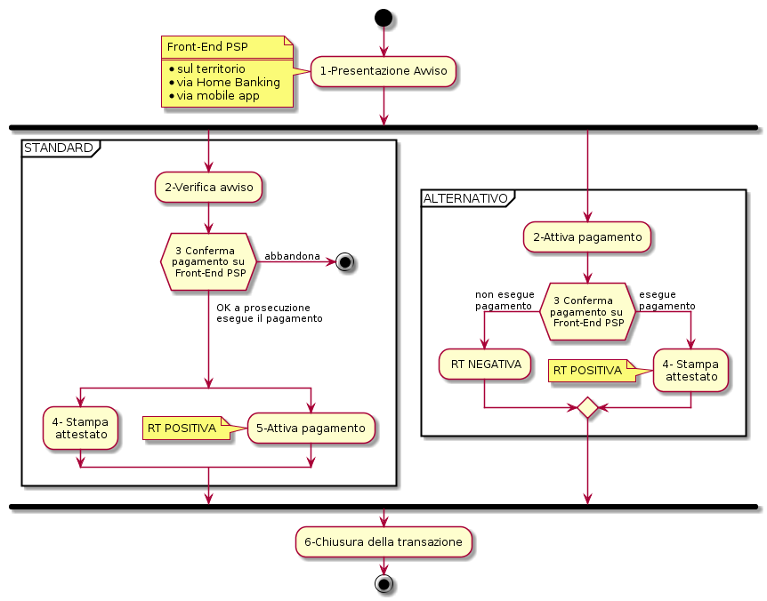
.. |image3| image:: ./myMediaFolder/media/image3.png
   :width: 5.90551in
   :height: 3.75838in
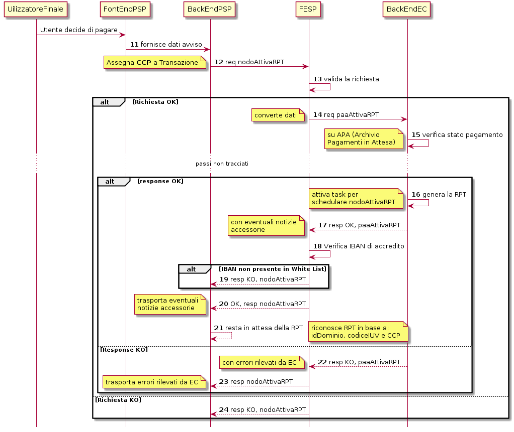
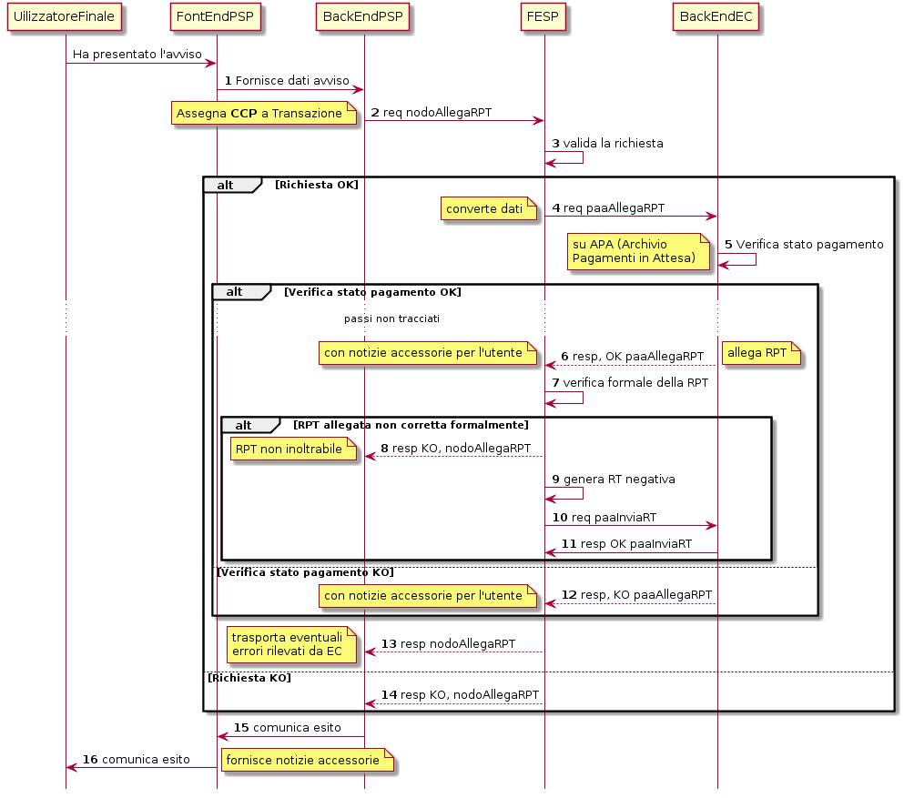
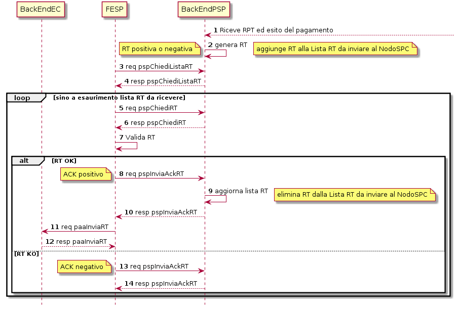
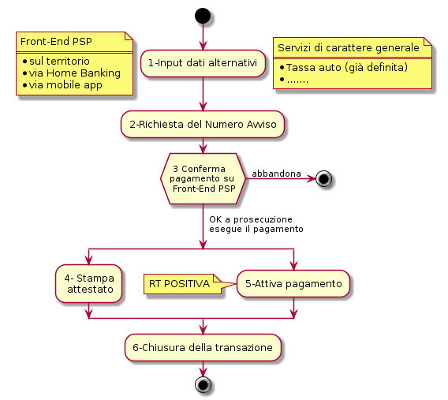
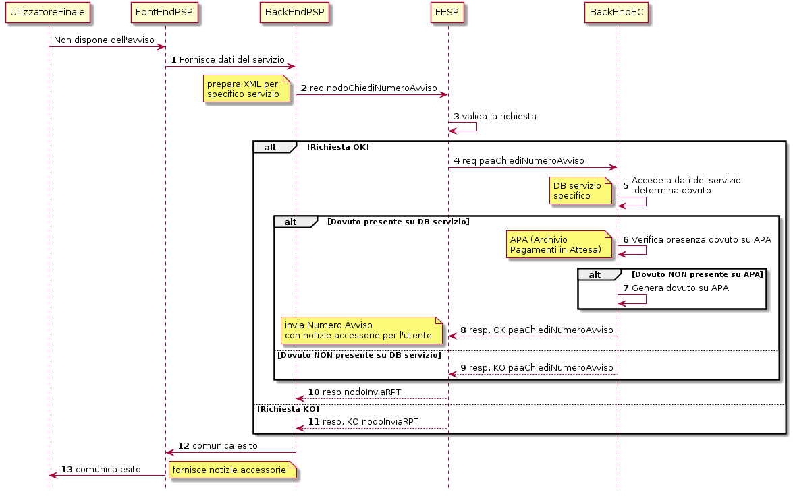
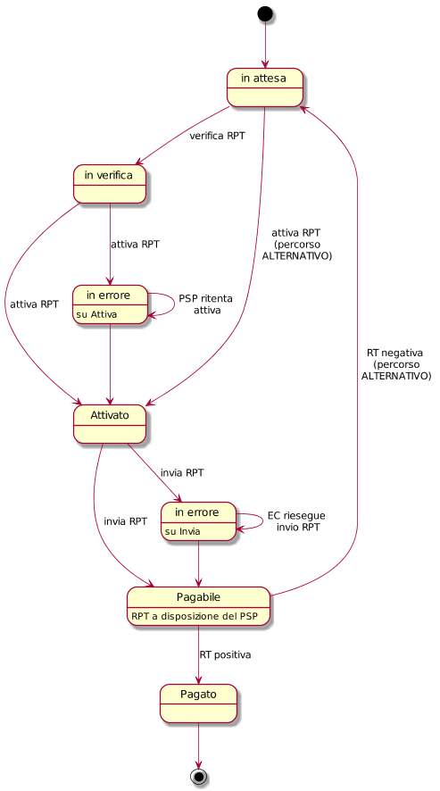
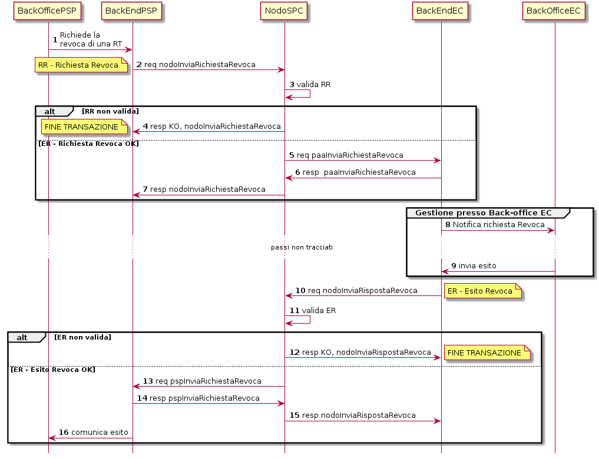
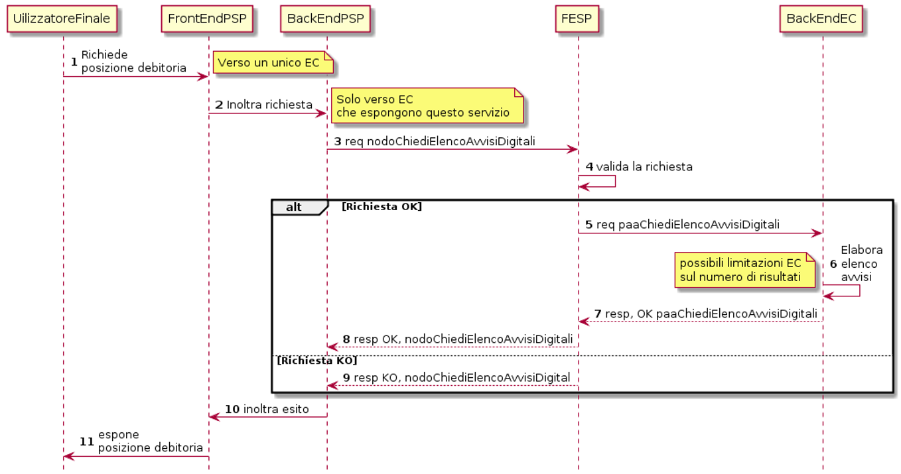
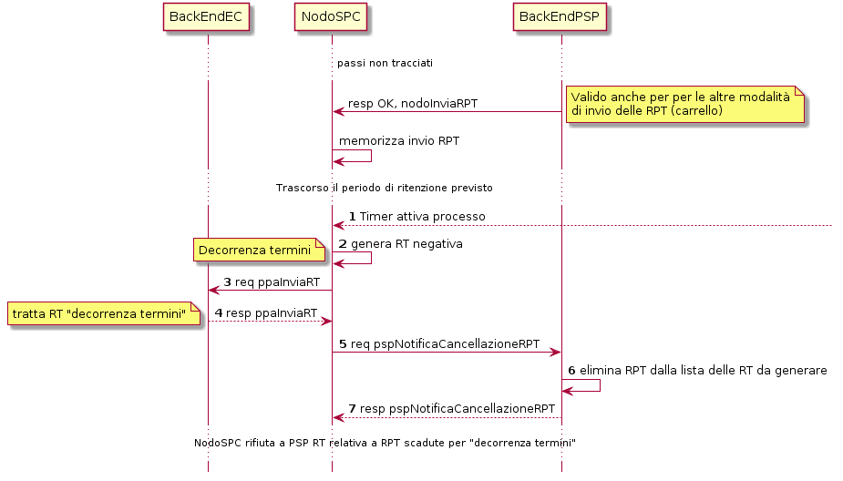
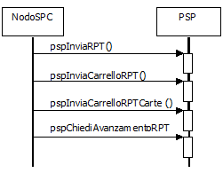
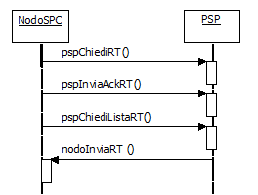
.. |image15| image:: ./myMediaFolder/media/image15.png
   :width: 5.90551in
   :height: 3.37003in
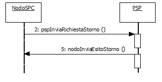
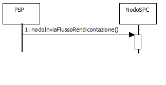
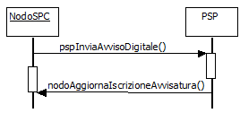
.. |image19| image:: ./myMediaFolder/media/image19.png
   :width: 5.90551in
   :height: 3.37003in
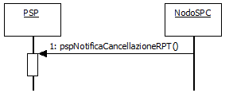
.. |image21| image:: ./myMediaFolder/media/image21.png
   :width: 5.90551in
   :height: 3.37003in
.. |image22| image:: ./myMediaFolder/media/image22.png
   :width: 5.90551in
   :height: 3.37003in
