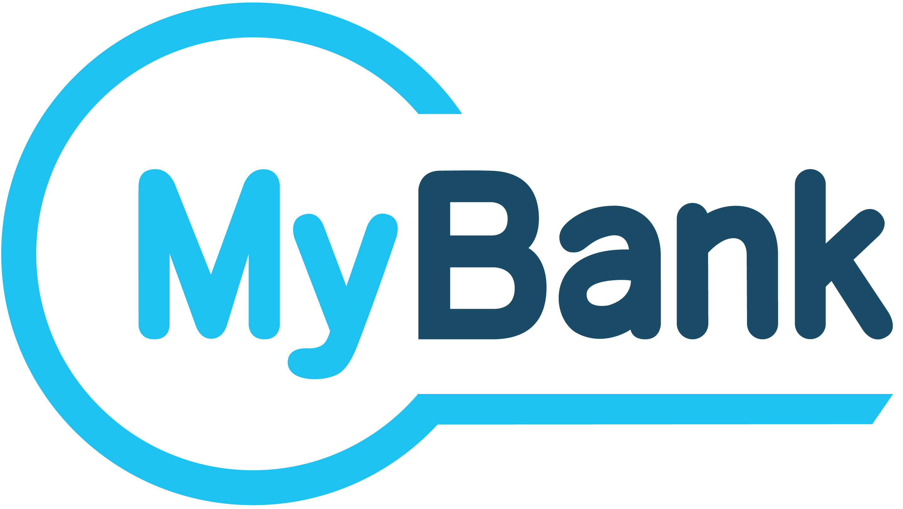

+-----------------------------------------------------------------------+
| |AGID_logo_carta_intestata-02.png|                                    |
+-----------------------------------------------------------------------+

+------------------------------------------------------------------+
| **Capitolo 16. IL MODELLO DI FUNZIONAMENTO DEL SERVIZIO MYBANK** |
+------------------------------------------------------------------+

Il modello di funzionamento del servizio MyBank
===============================================

Il modello di funzionamento del servizio MyBank si identifica con il
“processo di pagamento con esecuzione immediata” attivato presso il
portale della pubblica amministrazione (`vedi § 2.1.1 <../07-Capitolo_2/Capitolo2.rst#processo-di-pagamento-con-re-indirizzamento-on-line>`_).

|image1|

**Figura** **66 – Modello di funzionamento della soluzione MyBank**

Nel grafico di Figura 66 sono rappresentati, nel lessico del servizio
MyBank, i vari attori che interagiscono nel processo per consentire
all’utilizzatore finale di effettuare il pagamento:

a) *Buyer Bank*: è il PSP dell’utilizzatore finale, deve risultare aderente al NodoSPC;

b) *Seller Bank*: è il PSP dell’Ente Creditore, deve risultare aderente al NodoSPC;

c) *Collective Seller*: è l’AgID che mette a disposizione dei PSP che propongono il servizio MyBank le funzionalità del Nodo dei
   Pagamenti-SPC;

d) *Sub-Seller*: è l’Ente Creditore che, attraverso il Nodo dei Pagamenti-SPC, consente ai propri utenti di utilizzare il servizio
   MyBank proposto dal PSP dell’utente stesso.

Relazioni tra i soggetti
------------------------
.. _Relazioni tra i soggetti:

Al fine di attivare il servizio di pagamento MyBank attraverso il Nodo
dei Pagamenti-SPC è necessario che:

1. il PSP dell’utilizzatore finale (*Buyer Bank*) sia aderente al Nodo
   dei Pagamenti-SPC ed esponga, tra i servizi di pagamento che
   mette a disposizione dell’utilizzatore finale, anche il servizio
   MyBank. Tale adesione impegna il PSP a rispettare le Linee guida
   AgID, compreso l’obbligo di esporre le commissioni applicate
   all’utilizzatore finale per il servizio MyBank;

2. il PSP dell’Ente Creditore (*Seller Bank*) sia aderente al Nodo dei
   Pagamenti-SPC ed abbia sottoscritto con AgID un apposito
   «addendum» all’accordo di servizio.
   Tale «addendum» impegna il PSP a svolgere a titolo gratuito il ruolo
   di Seller Bank per le operazioni di pagamento eseguite attraverso il
   Nodo dei pagamenti-SPC, al fine di consentire agli Enti Creditori di
   ricevere gli accrediti relativi alle operazioni di pagamento che
   l’utilizzatore finale ha scelto di eseguire con l’uso del servizio
   MyBank.

   Le **Seller Bank** sono tenute ad utilizzare le specifiche di
   interfacciamento della componente “Wrapper MyBank” indicate al `§ 9.4 della Sezione III <../16-Capitolo_9/Capitolo9.rst#interfacce-per-la-componente-wrapper-mybank>`_.

3. AgID assuma il ruolo di “*Collective Seller*” per consentire un
   più facile e regolare funzionamento del servizio. In tale veste
   AgID si occupa dell’integrazione del circuito di pagamento MyBank
   con il sistema dei pagamenti elettronici attraverso il Nodo dei
   Pagamenti-SPC;

4. l’Ente Creditore individui, tra i PSP con i quali intrattiene
   rapporti di conto corrente, quello da accreditare e dunque per
   effetto individui la “Seller Bank” che potrà ricevere gli
   accrediti relativi alle operazioni di pagamento che
   l’utilizzatore finale ha scelto di eseguire con l’uso del
   servizio MyBank;

5. l’Ente Creditore assumendo il ruolo di “*Sub Seller*”, si impegna
   in sede di adesione al Nodo dei Pagamenti-SPC a rispettare
   integralmente le Linee guida, ivi inclusi i *Mandatory requirements*
   tipici del servizio MyBank, come meglio elencati e descritti al
   `paragrafo 16.2 <../26-Capitolo_16/Capitolo16.rst#mandatory-requirements-tipici-del-servizio-mybank>`_ che segue.

L’Agenzia pubblicherà sul proprio sito l’elenco dei PSP aderenti che
abbiano sottoscritto con AgID l’apposito «addendum» all’accordo di
servizio per lo svolgimento a titolo gratuito del ruolo di *Seller Bank*
per gli Enti Creditori, ossia per le PA e/o i gestori di pubblici
servizi che siano aderenti al Nodo dei Pagamenti-SPC.

*Mandatory requirements* tipici del servizio MyBank
---------------------------------------------------
.. _Mandatory requirements:

Ai fini dell’esecuzione dell’operazione di pagamento, di norma, il
servizio MyBank prevede l’interazione di quattro soggetti, e
precisamente: del pagatore (*buyer*), del PSP del pagatore (*BuyerBank*),
del PSP del venditore (*Seller Bank*) e del venditore
(*Seller*). I quattro soggetti appena citati, nessuno escluso, sono
chiamati a rispettare specifiche disposizioni che rappresentano le
regole e gli impegni propri del servizio MyBank che integrano il quadro
normativo generale sui servizi di pagamento.

L’inserimento del servizio MyBank tra i servizi di pagamento
utilizzabili attraverso il Nodo dei Pagamenti-SPC non cambia né le
modalità di interazione dei quattro soggetti già citati né l’obbligo per
ciascuno di rispettare le specifiche disposizioni proprie del servizio
MyBank. In altri termini, all’interno del servizio MyBank, AgID mantiene
un ruolo meramente tecnologico che non altera le responsabilità dei
quattro soggetti già citati, ferma restando la funzione accentratrice e
semplificatrice di AgID nel suo ruolo di *Collective Seller*, ai fini
dell’utilizzo del servizio MyBank da parte degli Enti Creditori per il
tramite della sola adesione al Nodo dei Pagamenti-SPC.

La *Seller Bank*, in caso di mancato rispetto da parte di un Ente
Creditore di uno o più *Mandatory requirements*, ha il diritto di
revocare immediatamente l’uso del servizio MyBank e la sub-licenza del
Logotipo MyBank concessa all’Ente Creditore inadempiente. La società
Preta S.A.S. - che gestisce il circuito di commercio elettronico MyBank
- non sarà responsabile o potrà essere ritenuta tale per ogni ed
eventuale perdita e/o danno derivanti e comunque connessi all'esercizio
di tale diritto di revoca da parte della *Seller Bank*.

Precisato quanto appena esposto, appare opportuno indicare i *Mandatory
requirements* del servizio MyBank con specifico riferimento all’uso del
servizio stesso da parte degli Enti Creditori per ricevere gli accrediti
delle relative operazioni. La versione integrale dei *Mandatory
requirements* è pubblicata sul sito dell’Agenzia. In particolare, ogni
Ente Creditore si impegna a:

1. rispettare e conformarsi a quanto indicato e previsto nel documento
   “MyBank Style Guide for Businesses”, pubblicato sul sito
   dell’Agenzia, ai fini della più ampia tutela dell'uso del Logo
   MyBank e dei relativi diritti di proprietà intellettuale in capo
   a Preta S.A.S;

2. non alterare o modificare il Logo MyBank, ad eccezione di quanto
   previsto e autorizzato nell'allegato documento “MyBank Style Guide
   for Businesses”;

3. non porre in essere alcuna attività, azione od omissione, atto o
   fatto diretto a contestare, ostacolare, invalidare, alterare i
   diritti di proprietà intellettuale in capo a Preta S.A.S. aventi
   ad oggetto il Logo MyBank;

4. rispettare la normativa in materia di protezione dei dati personali;

5. offrire agli utilizzatori finali i livelli di servizio minimi
   definiti da Preta S.A.S.;

6. adeguarsi a eventuali modifiche al servizio MyBank entro le scadenze
   specificate, se del caso, da AgID, previo accordo con Preta
   S.A.S.;

7. rispettare, in quanto applicabile all’uso del servizio MyBank da
   parte degli Enti Creditori, ogni altra previsione stabilita nel
   documento *Mandatory requirements* del servizio MyBank.

Logotipo del servizio MyBank
----------------------------
.. _Logotipo del servizio MyBank:

Secondo quanto indicato al paragrafo precedente, l’utilizzo del servizio
MyBank da parte degli Enti Creditori deve rispondere a determinati
requisiti ed essere coerente con le linee guida previste dai documenti
ufficiali MyBank (*Mandatory requirements*), ciò al fine di garantire
un'esperienza uniforme per l’utilizzatore finale.

Il logotipo MyBank esposto dall’Ente Creditore deve essere quello
indicato nel documento “MyBank Style Guide for Businesses”. In
particolare, il logotipo comprende gli elementi di stile di seguito
riportati.

+-----------------------------------+-----------------------------------+
| Il logotipo è composto da due     | |logo_MyBank_positive.png|        |
| elementi grafici: la parola       |                                   |
| 'MyBank' ed il profilo che la     |                                   |
| contorna. Questi elementi devono  |                                   |
| sempre essere usati insieme e NON |                                   |
| possono essere separati tra loro. |                                   |
|                                   |                                   |
| Gli elementi tipografici sono     |                                   |
| basati sul font Arial Rounded.    |                                   |
|                                   |                                   |
| Il logotipo utilizza una          |                                   |
| colorazione bi-cromatica. Tali    |                                   |
| colori **NON possono** essere     |                                   |
| alterati o sostituiti.            |                                   |
+-----------------------------------+-----------------------------------+

Quando il "Logo" MyBank è usato sul web, nel caso particolare sul
portale degli Enti Creditori, le dimensioni minime **devono** essere le
seguenti: 40 pixel in altezza, 80 pixel in larghezza. Il rapporto tra le
due dimensioni deve rimanere sempre costante in ragione di 1:2.

Per tutte le informazioni sul logotipo e sulla composizione della
tavolozza dei colori di MyBank si rimanda alla documentazione ufficiale
di cui sopra, in particolare al documento “MyBank Style Guide for
Businesses”.

Esposizione del logotipo MyBank sul portale degli Enti Creditori
~~~~~~~~~~~~~~~~~~~~~~~~~~~~~~~~~~~~~~~~~~~~~~~~~~~~~~~~~~~~~~~~
.. _Esposizione del logotipo MyBank sul portale degli Enti Creditori:

Il servizio MyBank offerto dai PSP aderenti al Nodo dei Pagamenti-SPC
deve essere proposto all’utilizzatore finale assicurando a tutti i PSP
aderenti le stesse opportunità di concorrenza, parità di trattamento e
non discriminazione. In tale contesto, il logotipo del servizio MyBank
deve essere riportato, unitamente al logotipo del PSP che lo espone, a
fianco del testo che individua il servizio stesso.

Tale modalità è realizzata attraverso il servizio WISP (`vedi §§ 2.1.3 <../07-Capitolo_2/Capitolo2.rst#scelta-del-servizio-di-pagamento-da-parte-dellutilizzatore-finale>`_ e
`4.4.9 <../09-Capitolo_4/Capitolo4.rst#accentramento-della-scelta-del-psp>`_) che consente l'accentramento della scelta del PSP sul Nodo dei Pagamenti-SPC, rispettando quindi i *mandatory requirements* previsti da
MyBank (`vedi § 16.2 <../26-Capitolo_16/Capitolo16.rst#mandatory-requirements-tipici-del-servizio-mybank>`_).

Causale del pagamento
---------------------
.. _Causale del pagamento:

Al fine di consentire una riconciliazione automatica presso l'Ente
Creditore, la *Buyer Bank* **deve** compilare l'attributo AT-05
*Unstructured Remittance Information* del SEPA Credit Transfer [1]_
senza aggiungere o modificare nulla nel dato APP-SCT01-02-D13 del
messaggio di *E-Authorisation Request* (pain.013) ricevuto attraverso il
*Validation Service* MyBank.

Vincoli nell’utilizzo del servizio MyBank
-----------------------------------------
.. _Vincoli nell’utilizzo del servizio MyBank:

La soluzione MyBank è utilizzabile all’interno del processo di pagamento
immediato e consente di gestire un solo pagamento all’interno della
singola transazione attivata dall’utente finale, pertanto le RPT
generate dagli Enti Creditori potranno contenere una sola occorrenza
della struttura *datiSingoloVersamento* (`vedi § 5.3.1 <../11-Capitolo_5/Capitolo5.rst#richiesta-pagamento-telematico-rpt>`_).

Per lo stesso motivo (unico pagamento all’interno della singola
transazione), gli Enti Creditori non potranno utilizzare le funzioni di
Nodo previste per il pagamento multi beneficiario, ovvero il cosiddetto
“carrello di RPT” (`vedi § 4.4.2 <../09-Capitolo_4/Capitolo4.rst#pagamenti-multi-beneficiario-o-multi-pagatore>`_) con PSP che offrono il servizio MyBank.

Controlli effettuati dal Nodo dei Pagamenti-SPC
-----------------------------------------------
.. _Controlli effettuati dal Nodo dei Pagamenti-SPC:

Il servizio MyBank è individuato dal valore **OBEP**
(*On-line banking e-payment*) relativo al dato tipoVersamento presente nella RPT
(`vedi § 5.3.1 <../11-Capitolo_5/Capitolo5.rst#richiesta-pagamento-telematico-rpt>`_).

Oltre ai controlli effettuati per verificare il rispetto dei vincoli di
cui al `paragrafo 16.5 <../26-Capitolo_16/Capitolo16.rst#vincoli-nellutilizzo-del-servizio-mybank>`_, il Nodo dei Pagamenti-SPC controllerà, per ogni
RPT il cui dato tipoVersamento contenga il valore **OBEP**, la
congruenza della “*Seller Bank*” indicata dall’Ente Creditore (cfr.
punto 4 del `§ 16.1 <../26-Capitolo_16/Capitolo16.rst#relazioni-tra-i-soggetti>`_) con il dato ibanAccredito presente nella struttura
datiSingoloVersamento (`vedi § 5.3.1 <../11-Capitolo_5/Capitolo5.rst#richiesta-pagamento-telematico-rpt>`_).

Le Richieste di Pagamento Telematiche non conformi saranno rifiutate
all’Ente Creditore.

`Torna all'indice <../../index.rst>`__

.. [1]
   vedi capitolo 4 delle Allegato A alle Linee guida.

.. |AGID_logo_carta_intestata-02.png| image:: ../media/header.png
   :width: 5.90551in
   :height: 1.30277in
.. |image1| image:: ./myMediaFolder/media/image2.png
   :width: 6.69306in
   :height: 3.78146in

