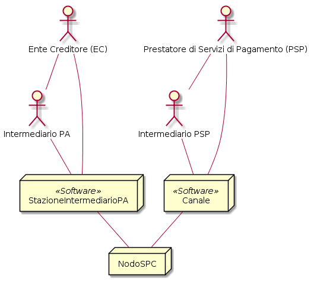
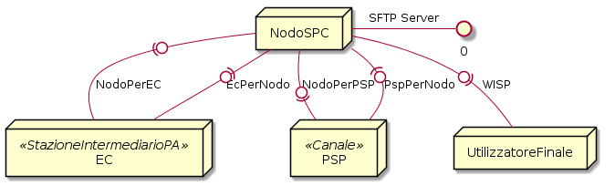
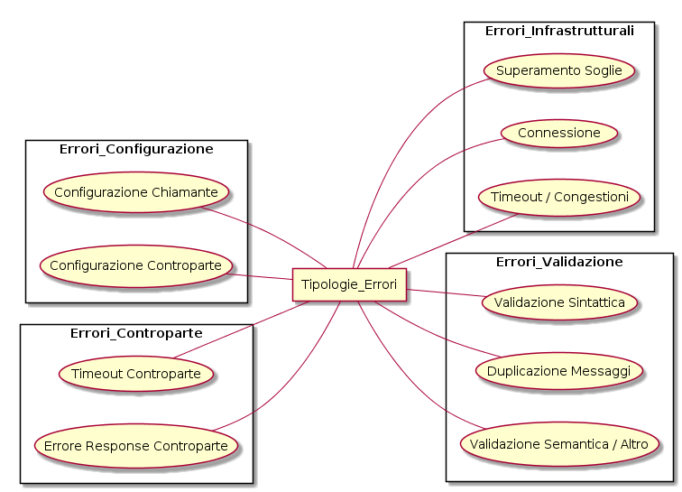
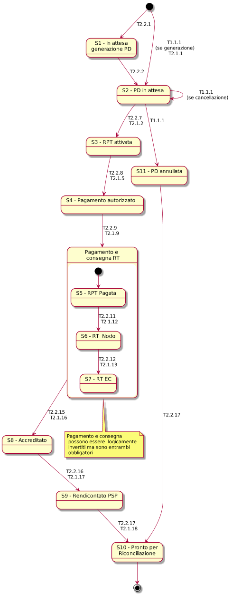

**SEZIONE III – SPECIFICHE TECNICHE**

Introduzione 
=============

La presente sezione descrive le interfacce di cooperazione applicativa del software che implementa i servizi del NodoSPC.

Il NodoSPC definisce le regole di cooperazione tra i due attori (EC e PSP) del processo di pagamento, i quali sono connessi al NodoSPC per mezzo di
piattaforme software così denominate:

-  **stazioneIntermediarioPA**: rappresenta la piattaforma software utilizzata da un Ente Creditore per scambiare i messaggi all’interno del sistema
   pagoPA relativamente ai processi di pagamento di uno o più servizi.

-  **Canale**: rappresenta la piattaforma software messa a disposizione da un PSP (e connessa al NodoSPC) che realizza un servizio di pagamento messo
   a disposizione dell’utilizzatore finale al fine di completare un pagamento verso un Ente Creditore.

Entrambi gli attori possono utilizzare una molteplicità di piattaforme software per colloquiare con il NodoSPC, in funzione delle proprie esigenze.

Per la piena comprensione dell’interscambio dei messaggi all’interno del sistema, si deve tenere presente la possibilità che tra l’attore principale
ed il NodoSPC si interponga un intermediario (intermediarioPA, intermediarioPSP) a cui l’attore principale ha demandato il compito di gestire la
propria piattaforma software di interconnessione e rendere disponibili le interfacce verso il NodoSPC. Nella figura seguente sono rappresentate le
varie casistiche possibili.

|image0|

**Figura** **1: Diagramma delle connessioni logiche al NodoSPC**

Si definisce quindi:

-  **IntermediarioPA**: il soggetto che opera come intermediario per un Ente Creditore. Qualora l’Ente Creditore non si avvalga di un intermediario,
   rappresenta l’Ente Creditore stesso;

-  **IntermediarioPSP**: il soggetto che opera come intermediario per un PSP. Qualora il PSP non si avvalga di un intermediario, rappresenta il PSP
   stesso;

-  **StazioneIntermediarioPA**: il sistema software gestito da un IntermediarioPA, che si interfaccia direttamente col NodoSPC;

-  **Canale**: il sistema software gestito da un IntermediarioPSP, che si interfaccia direttamente al NodoSPC con le modalità previste.

Allo stesso soggetto è consentito di connettersi al NodoSPC in maniera diversa (diretta o intermediata) in funzione dei servizi offerti.

Nelle descrizioni seguenti si ometterà di fare riferimento a detti intermediari, in quanto essi non svolgono un ruolo logicamente distinguibile dai
soggetti intermediati.

Interfacce/Protocolli
---------------------

Il NodoSPC espone diverse interfacce per realizzare le funzioni di cooperazione:

-  **Web-services**, realizzati con protocollo SOAP;

-  **SFTP**, per il trasferimento sicuro di file che non necessitano di essere elaborati contestualmente;

-  **WISP**, *web app* (protocollo HTTPS) che realizza un *wizard* interattivo per la scelta del PSP con cui effettuare il pagamento da parte
   dell’Utilizzatore finale.

|image1|

**Figura** **2: Diagramma delle interfacce di comunicazione**

Le interfacce *web services* e SFTP rappresentate nella figura precedente sono ricapitolate in tabella:

+---------------+---------+------------+-------------------------------------------------------------------------------------+
| Denominazione | Formato | Protocollo | Descrizione                                                                         |
+===============+=========+============+=====================================================================================+
| NodoPerEc     | WSDL    | SOAP       | Raccolta di metodi e parametri di interfaccia esposti dal NodoSPC fruibili dagli EC |
+---------------+---------+------------+-------------------------------------------------------------------------------------+
| EcPerNodo     | WSDL    | SOAP       | Raccolta di metodi e parametri di interfaccia esposti dagli EC fruibili dal NodoSPC |
+---------------+---------+------------+-------------------------------------------------------------------------------------+
| NodoPerPSP    | WSDL    | SOAP       | Raccolta di metodi e parametri di interfaccia esposti dal NodoSPC fruibili dai PSP  |
+---------------+---------+------------+-------------------------------------------------------------------------------------+
| PspPerNodo    | WSDL    | SOAP       | Raccolta di metodi e parametri di interfaccia esposti dai PSP fruibili dal NodoSPC  |
+---------------+---------+------------+-------------------------------------------------------------------------------------+
|               |         |            |                                                                                     |
+---------------+---------+------------+-------------------------------------------------------------------------------------+
| SFTP          | Testo   | SFTP       | Raccolta di regole per la ricezione di file massivi e/o elementi dal NodoSPC.       |
+---------------+---------+------------+-------------------------------------------------------------------------------------+

**Tabella** **1: Interfacce di comunicazione**

Le caratteristiche tecniche dei servizi utilizzati all’interno dei casi d’uso sono disponibili all’interno del progetto gitHub in formato WSDL (per le
chiamate SOAP). I dati per la configurazione dei servizi SFTP sono messi a disposizione ai soggetti aderenti, in forma testuale, mediante canali
riservati.

Per l’interfaccia WISP nei confronti dell’Utilizzatore finale sono resi disponibili per gli EC degli SDK per lo sviluppo di applicazioni *mobile*.

Architettura Funzionale
-----------------------

Per descrivere l’interazione tra EC, NodoSPC e PSP questa sezione è stata articolata nei seguenti capitoli:

-  **Modello dei Dati**: documenta le strutture dei dati scambiati all’interno dei servizi tra i diversi attori ed il NodoSPC.

-  **Pagamento Attivato presso EC**: documenta i metodi messi a disposizione dei soggetti aderenti per realizzare il modello di pagamento attivato
   presso l’EC.

-  **Pagamento Attivato presso PSP**: documenta i metodi messi a disposizione dei soggetti aderenti per realizzare un pagamento di una posizione
   debitoria presso un PSP.

-  **Avvisatura Digitale**: documenta i metodi messi a disposizione dei soggetti aderenti per realizzare la generazione e la distribuzione di un
   avviso di pagamento digitale.

-  **Back-Office**: documenta le funzioni accessorie che possono essere invocate per gestire scenari secondari del ciclo di vita del pagamento (es.
   storno, revoca).

-  **Ausiliarie**: documenta le funzioni di controllo che contribuiscono a monitorare lo stato di esecuzione di un pagamento (es. richiesta stato RPT,
   richiesta stato RT), al fine di attuare eventuali azioni di recupero.

Le funzioni del sistema sono descritte attraverso i casi d’uso secondo lo standard UML (Use Cases, da ora in avanti UC). In particolare per ogni
funzione, verrà fornita:

-  la descrizione degli attori coinvolti ed i loro obiettivi;

-  la descrizione del caso d’uso nominale, cioè il *workflow* che termina in assenza di errori

Nel dettaglio, ogni UC verrà descritto attraverso:

-  una condizione iniziale dello stato del pagamento che definisce il pre-requisito per l’attuazione del caso d’uso;

-  un trigger, cioè l’evento che scatena il caso d’uso;

-  una descrizione testuale del *workflow*;

-  una condizione finale che identifica lo stato del pagamento a conclusione dello UC;

-  uno (o più) *sequence diagram* che descrivono le interazioni nel tempo tra i diversi attori e le interfacce utilizzate.

Ogni messaggio contenuto all’interno dei *sequence diagram* sarà:

-  numerato in base all’ordine temporale di invio/ricezione del messaggio;

-  caratterizzato dalla notazione riportata in tabella;

-  corredato da una descrizione; nel caso di messaggio di risposta (*response*), indicherà l’esito della richiesta (*request*) effettuata.

La tabella seguente illustra le notazioni grafiche utilizzate nei *sequence diagrams*.

+-------------------------------------------------+-------------------------------------------------+-------------------------------------------------+
|    Elemento                                     | Simbolo                                         | Vincoli / Note                                  |
+=================================================+=================================================+=================================================+
| Attore                                          | |image3|                                        | Rappresenta uno degli attori del Sistema pagoPA |
+-------------------------------------------------+-------------------------------------------------+-------------------------------------------------+
| Richiesta SOAP                                  |                                                 | Freccia rossa linea continua, che rappresenta   |
|                                                 |                                                 | la richiesta entrante nell’interfaccia          |
|                                                 |                                                 | dell’attore che espone i servizi                |
+-------------------------------------------------+-------------------------------------------------+-------------------------------------------------+
| Risposta SOAP                                   |                                                 | Freccia blu linea tratteggiata, che rappresenta |
|                                                 |                                                 | la risposta uscente dall’interfaccia            |
|                                                 |                                                 | dell’attore che espone i servizi; appare sempre |
|                                                 |                                                 | in corrispondenza di una richiesta SOAP         |
+-------------------------------------------------+-------------------------------------------------+-------------------------------------------------+
| GET HTTP                                        |                                                 | Freccia verde linea continua, che rappresenta   |
|                                                 |                                                 | le chiamate effettuate dall’utilizzatore finale |
|                                                 |                                                 | per la fruizione delle applicazioni WEB fornite |
|                                                 |                                                 | dagli attori del processo                       |
+-------------------------------------------------+-------------------------------------------------+-------------------------------------------------+
| Azione SFTP                                     |                                                 | Freccia viola linea continua, che rappresenta   |
|                                                 |                                                 | un’azione mediata dal protocollo SFPT           |
+-------------------------------------------------+-------------------------------------------------+-------------------------------------------------+
| SFTP *response*                                 |                                                 | Freccia viola linea tratteggiata, che           |
|                                                 |                                                 | rappresenta la risposta ad un comando SFTP      |
+-------------------------------------------------+-------------------------------------------------+-------------------------------------------------+
| Stato Pagamento                                 |                                                 | Losanga fondo giallo bordo rosso, che           |
|                                                 |                                                 | rappresenta lo stato del pagamento sul NodoSPC  |
+-------------------------------------------------+-------------------------------------------------+-------------------------------------------------+

**Tabella** **2: Notazioni grafiche utilizzate nei sequence diagram**

Con l’obiettivo di favorire l’attuazione di strategie di ripristino, automatiche o manuali, da mettere in atto direttamente da parte degli attori
connessi al sistema (EC, PSP) i possibili errori saranno classificati in base alle categorie riportate nella figura sottostante.

|image4|

**Figura** **3: Raggruppamento delle possibili tipologie di errori**

Le tipologie di errori con relativa descrizione e macro-categoria di appartenenza sono descritte nella tabella sottostante.

+-------------------------------------------------+-------------------------------------------------+-------------------------------------------------+
| Categoria                                       | Tipologia                                       | Descrizione                                     |
+=================================================+=================================================+=================================================+
| Errori Infrastrutturali                         | Superamento Soglie                              | Il soggetto fruitore ha superato i limiti di    |
|                                                 |                                                 | interazione applicativa (frequenza di richieste |
|                                                 |                                                 | troppo elevata) con il soggetto erogatore di    |
|                                                 |                                                 | cui al documento “Indicatori di qualità per i   |
|                                                 |                                                 | soggetti aderenti”                              |
+-------------------------------------------------+-------------------------------------------------+-------------------------------------------------+
|                                                 | Connessione                                     | Impossibilità di interagire con la Controparte  |
|                                                 |                                                 | applicativa raggiunta mediante il NodoSPC       |
+-------------------------------------------------+-------------------------------------------------+-------------------------------------------------+
|                                                 | *Timeout*/Congestioni                           | Superamento delle soglie temporali previste per |
|                                                 |                                                 | la risposta del soggetto erogatore di cui al    |
|                                                 |                                                 | documento “Indicatori di qualità per i soggetti |
|                                                 |                                                 | aderenti”                                       |
+-------------------------------------------------+-------------------------------------------------+-------------------------------------------------+
| Errori Configurazione                           | Configurazione Chiamante                        | Errore nei dati di configurazione da parte del  |
|                                                 |                                                 | soggetto fruitore del servizio applicativo      |
|                                                 |                                                 | invocato                                        |
+-------------------------------------------------+-------------------------------------------------+-------------------------------------------------+
|                                                 | Configurazione Controparte                      | Errore nei dati di configurazione della         |
|                                                 |                                                 | controparte applicativa raggiunta mediante il   |
|                                                 |                                                 | NodoSPC                                         |
+-------------------------------------------------+-------------------------------------------------+-------------------------------------------------+
| Errori Controparte                              | *Timeout* Controparte                           | Superamento delle soglie temporali previste per |
|                                                 |                                                 | la risposta della controparte applicativa di    |
|                                                 |                                                 | cui al documento “Indicatori di qualità per i   |
|                                                 |                                                 | soggetti aderenti”                              |
+-------------------------------------------------+-------------------------------------------------+-------------------------------------------------+
|                                                 | Errore *response* Controparte                   | Errore nella risposta da parte della            |
|                                                 |                                                 | controparte applicativa                         |
+-------------------------------------------------+-------------------------------------------------+-------------------------------------------------+
| Errori Validazione                              | Validazione Sintattica                          | Errore nella sintassi dei messaggi scambiati    |
+-------------------------------------------------+-------------------------------------------------+-------------------------------------------------+
|                                                 | Duplicazione Messaggi                           | Duplicazione dei messaggi scambiati tra         |
|                                                 |                                                 | soggetto erogatore e fruitore                   |
+-------------------------------------------------+-------------------------------------------------+-------------------------------------------------+
|                                                 | Validazione Semantica                           | Errore di validazione semantica nell’esercizio  |
|                                                 |                                                 | del processi del sistema                        |
+-------------------------------------------------+-------------------------------------------------+-------------------------------------------------+

**Tabella** **3: Descrizione delle categorie di errore**

Per gli errori che causano l’emanazione di un *faultBean* da parte del NodoSPC, in riferimento a ogni caso d’uso, saranno trattate le possibili
strategie di risoluzione ed evidenziati i percorsi critici per cui è necessario l’instaurazione del Tavolo Operativo di cui alla sezione IV.

Stato del Pagamento
-------------------

Nei processi di *business* descritti nella sezione II, il processo di pagamento può essere definito da un insieme discreto di transazioni fra stati
stabili del sistema, caratterizzati da un set di informazioni/condizioni di entrata e un set di informazioni/condizioni di uscita.

Gli stati tracciati nei *sequence diagram* dei casi d’uso e riportati nel presente documento, sono unicamente quelli in cui il *workflow* attraversa
l’interfaccia applicativa del NodoSPC. Quando un soggetto non può essere autonomo nella diagnosi di una anomalia, verranno fornite indicazioni per
l’attivazione del Tavolo Operativo con il NodoSPC e/o con la controparte interessata.

Il seguente diagramma evidenzia la successione temporale degli stati del processo di pagamento, la cui descrizione è riportata nella tabella
successiva.

|image5|

**Figura** **4: Stati del pagamento
**

+-------------------------------------------------+-------------------------------------------------+-------------------------------------------------+
| Stato                                           | Descrizione                                     | Tracciato su pagoPA                             |
+=================================================+=================================================+=================================================+
| S1 - “In attesa generazione PD”                 | Stato iniziale in cui permane il sistema se     | Si                                              |
|                                                 | fallisce l’avvio di un processo di pagamento    |                                                 |
+-------------------------------------------------+-------------------------------------------------+-------------------------------------------------+
| S2 – “PD in attesa”                             | L’EC ha generato una Posizione Debitoria, di    | Si                                              |
|                                                 | propria iniziativa o in conseguenza di          |                                                 |
|                                                 | un’azione spontanea dell’Utilizzatore Finale.   |                                                 |
|                                                 |                                                 |                                                 |
|                                                 | *Sono in questo stato tutti i pagamenti per cui |                                                 |
|                                                 | esiste un IUV, un numero Avviso di Pagamento,   |                                                 |
|                                                 | ma ancora nessuna RPT associata è stata         |                                                 |
|                                                 | generata.*                                      |                                                 |
+-------------------------------------------------+-------------------------------------------------+-------------------------------------------------+
| S3 – “RPT Attivata”                             | Nel dominio dell’EC è stata generata una RPT a  | Si                                              |
|                                                 | causa della scelta da parte dell’Utilizzatore   |                                                 |
|                                                 | Finale del PSP che gestirà il pagamento.        |                                                 |
|                                                 |                                                 |                                                 |
|                                                 | *Sono in questo stato tutti i pagamenti per cui |                                                 |
|                                                 | è stata generata una RPT. È stato generato un   |                                                 |
|                                                 | CCP che distingue il tentativo di pagamento. La |                                                 |
|                                                 | RPT risulta validata e presa in carico dal      |                                                 |
|                                                 | NodoSPC.*                                       |                                                 |
+-------------------------------------------------+-------------------------------------------------+-------------------------------------------------+
| S4 – “Pagamento autorizzato”                    | Il pagamento risulta autorizzato                | Si (solo per i pagamenti autorizzati su WISP)   |
|                                                 | dall’Utilizzatore Finale attraverso i           |                                                 |
|                                                 | meccanismi previsti dal sistema pagoPA          |                                                 |
|                                                 |                                                 |                                                 |
|                                                 | *Sono in questo stato tutti i pagamenti per cui |                                                 |
|                                                 | la RPT risulta presa in carico da un PSP. Il    |                                                 |
|                                                 | PSP non ha ancora generato la RT                |                                                 |
|                                                 | corrispondente.*                                |                                                 |
+-------------------------------------------------+-------------------------------------------------+-------------------------------------------------+
| S5 – “RPT Pagata”                               | Il pagamento risulta andato a buon fine ed il   | Si                                              |
|                                                 | PSP scelto dall’Utilizzatore Finale incassa la  |                                                 |
|                                                 | somma e genera la RT.                           |                                                 |
|                                                 |                                                 |                                                 |
|                                                 | *Sono in questo stato tutti i pagamenti andati  |                                                 |
|                                                 | a buon fine, per cui il PSP ha generato la RT.* |                                                 |
+-------------------------------------------------+-------------------------------------------------+-------------------------------------------------+
| S6 – “RT Nodo”                                  | La RT generata dal PSP scelto dall’Utilizzatore | Si                                              |
|                                                 | Finale è consegnata al NodoSPC                  |                                                 |
|                                                 |                                                 |                                                 |
|                                                 | *Sono in questo stato tutti i pagamenti andati  |                                                 |
|                                                 | a buon fine, per cui il NodoSPC ha preso in     |                                                 |
|                                                 | carico la RT.*                                  |                                                 |
+-------------------------------------------------+-------------------------------------------------+-------------------------------------------------+
| S7 – “RT EC”                                    | La RT è consegnata all’Ente Creditore dal       | Si                                              |
|                                                 | NodoSPC                                         |                                                 |
|                                                 |                                                 |                                                 |
|                                                 | *Sono in questo stato tutti i pagamenti andati  |                                                 |
|                                                 | a buon fine, per cui l’EC ha preso in carico la |                                                 |
|                                                 | RT.*                                            |                                                 |
+-------------------------------------------------+-------------------------------------------------+-------------------------------------------------+
| S8 – “RT Accreditata”                           | Il PSP scelto dall’Utilizzatore Finale ha       | No                                              |
|                                                 | accreditato il pagamento sul conto indicato     |                                                 |
|                                                 | nella RPT dall’Ente Creditore.                  |                                                 |
|                                                 |                                                 |                                                 |
|                                                 | *Sono in questo stato tutti i pagamenti la cui  |                                                 |
|                                                 | RT può essere messa in relazione a SCT disposto |                                                 |
|                                                 | dal PSP.*                                       |                                                 |
+-------------------------------------------------+-------------------------------------------------+-------------------------------------------------+
| S9 – “RT Rendicontata PSP”                      | Il PSP genera e mette a disposizione il flusso  | Si                                              |
|                                                 | di rendicontazione per l’EC sul Nodo SPC.       |                                                 |
|                                                 |                                                 |                                                 |
|                                                 | *Sono in questo stato tutti i pagamenti per il  |                                                 |
|                                                 | quali il PSP ha disposto un PSP cumulativo e    |                                                 |
|                                                 | possono essere messi in relazione a un flusso   |                                                 |
|                                                 | di rendicontazione.*                            |                                                 |
+-------------------------------------------------+-------------------------------------------------+-------------------------------------------------+
| S10 – “Pronto per riconciliazione”              | Il pagamento è pronto per essere riconciliato   | Si                                              |
|                                                 | sui sistemi di *back-office* dell’EC            |                                                 |
|                                                 |                                                 |                                                 |
|                                                 | *Sono in questo stato tutti i pagamenti i cui   |                                                 |
|                                                 | flussi di rendicontazione, acquisiti dall’EC,   |                                                 |
|                                                 | quadrano con i corrispondenti SPC*              |                                                 |
+-------------------------------------------------+-------------------------------------------------+-------------------------------------------------+
| S11 – “PD annullata”                            | L’EC ha annullato una Posizione Debitoria,      | No                                              |
|                                                 | precedentemente generata.                       |                                                 |
|                                                 |                                                 |                                                 |
|                                                 | *Sono in questo stato tutti i pagamenti         |                                                 |
|                                                 | disposti al di fuori del sistema pagoPA*        |                                                 |
+-------------------------------------------------+-------------------------------------------------+-------------------------------------------------+

**Tabella** **4:** **Descrizione degli stati del pagamento**

La seguente tabella ha lo scopo di associare a ciascuno dei *task* dei modelli di business di cui alla sezione II le primitive SOAP coinvolte,
evidenziando le transizioni di stato causate dall’esecuzione degli stessi *task*.

+--------------------+--------------------+--------------------+--------------------+--------------------+--------------------+--------------------+
| Task               | Primitiva          | Stato di Ingresso  | Stato di Uscita    | Pre-condizioni     | Post-condizioni    | Note               |
+====================+====================+====================+====================+====================+====================+====================+
| T2.2.1             | -                  | n.a.               | S1 - “In attesa    | n.a.               | L’EC ha ricevuto   | Lo stato S1 è il   |
|                    |                    |                    | generazione PD”    |                    | la richiesta di    | primo stato        |
|                    |                    |                    |                    |                    | generazione della  | presente a sistema |
|                    |                    |                    |                    |                    | Posizione          | in caso di         |
|                    |                    |                    |                    |                    | Debitoria da parte | pagamento          |
|                    |                    |                    |                    |                    | del PSP            | spontaneo          |
+--------------------+--------------------+--------------------+--------------------+--------------------+--------------------+--------------------+
| T1.1.1             | *nodoInviaAvvisoDi | n.a.               | S2 – “PD in        | n.a.               | L’EC ha effettuato | Lo stato S2 è il   |
|                    | gitale*            |                    | attesa”            |                    | la generazione     | primo stato        |
|                    |                    |                    |                    |                    | della Posizione    | presente a sistema |
|                    |                    |                    |                    |                    | Debitoria, che è   | in caso di         |
|                    |                    |                    |                    |                    | pronta per essere  | pagamento con      |
|                    |                    |                    |                    |                    | lavorata           | avviso             |
+--------------------+--------------------+--------------------+--------------------+--------------------+--------------------+--------------------+
| T2.1.1             | -                  | n.a                | S2 – “PD in        | n.a.               | L’EC ha effettuato |                    |
|                    |                    |                    | attesa”            |                    | la generazione     |                    |
|                    |                    |                    |                    |                    | della Posizione    |                    |
|                    |                    |                    |                    |                    | Debitoria, che è   |                    |
|                    |                    |                    |                    |                    | pronta per essere  |                    |
|                    |                    |                    |                    |                    | lavorata           |                    |
+--------------------+--------------------+--------------------+--------------------+--------------------+--------------------+--------------------+
| T2.2.2             | -                  | S1 - “In attesa    | S2 – “PD in        | L’EC ha ricevuto   | L’EC ha effettuato |                    |
|                    |                    | generazione PD”    | attesa”            | la richiesta di    | la generazione     |                    |
|                    |                    |                    |                    | generazione della  | della Posizione    |                    |
|                    |                    |                    |                    | posizione          | Debitoria, che è   |                    |
|                    |                    |                    |                    | debitoria da parte | pronta per essere  |                    |
|                    |                    |                    |                    | del PSP            | lavorata           |                    |
+--------------------+--------------------+--------------------+--------------------+--------------------+--------------------+--------------------+
| T1.1.1             | -                  | S2 – “PD in        | S11 – “PD          | L’EC riceve il     | La Posizione       |                    |
|                    |                    | attesa”            | Annullata”         | pagamento al di    | Debitoria non è    |                    |
|                    |                    |                    |                    | fuori del circuito | più lavorabile     |                    |
|                    |                    |                    |                    | pagoPA oppure      |                    |                    |
|                    |                    |                    |                    | vuole annullare la |                    |                    |
|                    |                    |                    |                    | posizione          |                    |                    |
|                    |                    |                    |                    | debitoria perché   |                    |                    |
|                    |                    |                    |                    | errata             |                    |                    |
+--------------------+--------------------+--------------------+--------------------+--------------------+--------------------+--------------------+
| T2.1.2             | *nodoInviaRPT*     | S2 – “PD in        | S3 – “RPT          | E’ stata generata  | L’EC ha            |                    |
|                    |                    | attesa”            | Attivata”          | una Posizione      | indirizzato su     |                    |
|                    |                    |                    |                    | Debitoria.         | WISP e pagoPA ha   |                    |
|                    |                    |                    |                    |                    | preso in carico il |                    |
|                    |                    |                    |                    | L’Utilizzatore     | carrello di RPT    |                    |
|                    |                    |                    |                    | finale genera un   |                    |                    |
|                    |                    |                    |                    | carrello di RPT e  |                    |                    |
|                    |                    |                    |                    | avvia la procedura |                    |                    |
|                    |                    |                    |                    | di pagamento       |                    |                    |
+--------------------+--------------------+--------------------+--------------------+--------------------+--------------------+--------------------+
| T2.2.7             | *nodoInviaRPT*     | S2 – “PD in        | S3 – “RPT          | È stata generata   | L’EC ha attivato   |                    |
|                    |                    | attesa”            | Attivata”          | una Posizione      | l’RPT e l’ha       |                    |
|                    |                    |                    |                    | Debitoria.         | inoltrata al PSP   |                    |
|                    |                    |                    |                    |                    |                    |                    |
|                    |                    |                    |                    | L’EC riceve una    |                    |                    |
|                    |                    |                    |                    | richiesta di       |                    |                    |
|                    |                    |                    |                    | attivazione RPT da |                    |                    |
|                    |                    |                    |                    | parte del PSP      |                    |                    |
|                    |                    |                    |                    | oppure             |                    |                    |
|                    |                    |                    |                    | l’Utilizzatore     |                    |                    |
|                    |                    |                    |                    | finale accede      |                    |                    |
|                    |                    |                    |                    | direttamente ai    |                    |                    |
|                    |                    |                    |                    | canali messi a     |                    |                    |
|                    |                    |                    |                    | disposizione       |                    |                    |
|                    |                    |                    |                    | dall’EC ed ha      |                    |                    |
|                    |                    |                    |                    | scelto la          |                    |                    |
|                    |                    |                    |                    | Posizione          |                    |                    |
|                    |                    |                    |                    | Debitoria da       |                    |                    |
|                    |                    |                    |                    | pagare             |                    |                    |
+--------------------+--------------------+--------------------+--------------------+--------------------+--------------------+--------------------+
| T2.1.5             | -                  | S3 – “RPT          | S4 – “Pagamento    | La RPT è stata     | L’Utilizzatore     |                    |
|                    |                    | Attivata”          | autorizzato”       | attivata           | finale ha          |                    |
|                    |                    |                    |                    |                    | approvato il       |                    |
|                    |                    |                    |                    |                    | pagamento          |                    |
+--------------------+--------------------+--------------------+--------------------+--------------------+--------------------+--------------------+
| T2.2.8             | -                  | S3 – “RPT          | S4 – “Pagamento    | La RPT è stata     | L’Utilizzatore     |                    |
|                    |                    | Attivata”          | autorizzato”       | attivata           | finale ha          |                    |
|                    |                    |                    |                    |                    | approvato il       |                    |
|                    |                    |                    |                    |                    | pagamento          |                    |
+--------------------+--------------------+--------------------+--------------------+--------------------+--------------------+--------------------+
| T2.1.9             | *pspInviaRPT*      | S4 – “Pagamento    | S5 – “RPT Pagata”  | L’Utilizzatore     | Il PSP ha          |                    |
|                    |                    | autorizzato”       |                    | finale ha          | incassato il       |                    |
|                    |                    |                    |                    | approvato il       | pagamento          |                    |
|                    |                    |                    |                    | pagamento          |                    |                    |
+--------------------+--------------------+--------------------+--------------------+--------------------+--------------------+--------------------+
| T2.2.9             | -                  | S4 – “Pagamento    | S5 – “RPT Pagata”  | L’Utilizzatore     | Il PSP ha          | In caso di         |
|                    |                    | autorizzato”       |                    | finale ha          | incassato il       | pagamento          |
|                    |                    |                    |                    | approvato il       | pagamento          | attraverso PSP è   |
|                    |                    |                    |                    | pagamento          |                    | possibile che il   |
|                    |                    |                    |                    |                    |                    | pagamento da parte |
|                    |                    |                    |                    |                    |                    | dell’Utente finale |
|                    |                    |                    |                    |                    |                    | avvenga prima del  |
|                    |                    |                    |                    |                    |                    | ricevimento        |
|                    |                    |                    |                    |                    |                    | dell’RPT da parte  |
|                    |                    |                    |                    |                    |                    | dello stesso PSP,  |
|                    |                    |                    |                    |                    |                    | per questo si      |
|                    |                    |                    |                    |                    |                    | raccomanda di      |
|                    |                    |                    |                    |                    |                    | effettuare sempre  |
|                    |                    |                    |                    |                    |                    | la verifica        |
|                    |                    |                    |                    |                    |                    | dell’RPT           |
|                    |                    |                    |                    |                    |                    | (*Gateway* G2.5)   |
+--------------------+--------------------+--------------------+--------------------+--------------------+--------------------+--------------------+
| T2.1.12            | *nodoInviaRT*      | S5 – “RPT Pagata”  | S6 – “RT Nodo”     | Il PSP ha ricevuto | La RT è stata      |                    |
|                    |                    |                    |                    | la RPT ed ha       | ricevuta da pagoPA |                    |
|                    |                    |                    |                    | incassato il       |                    |                    |
|                    |                    |                    |                    | pagamento          |                    |                    |
+--------------------+--------------------+--------------------+--------------------+--------------------+--------------------+--------------------+
| T2.2.11            | *nodoInviaRT*      | S5 – “RPT Pagata”  | S6 – “RT Nodo”     | Il PSP ha ricevuto | La RT è stata      |                    |
|                    |                    |                    |                    | la RPT ed ha       | ricevuta da pagoPA |                    |
|                    |                    |                    |                    | incassato il       |                    |                    |
|                    |                    |                    |                    | pagamento          |                    |                    |
+--------------------+--------------------+--------------------+--------------------+--------------------+--------------------+--------------------+
| T2.1.13            | *paaInviaRT*       | S6 – “RT Nodo”     | S7 – “RT EC”       | La RT è stata      | L’EC ha ricevuto   |                    |
|                    |                    |                    |                    | ricevuta da pagoPA | l’RT               |                    |
+--------------------+--------------------+--------------------+--------------------+--------------------+--------------------+--------------------+
| T2.2.12            | *paaInviaRT*       | S6 – “RT Nodo”     | S7 – “RT EC”       | La RT è stata      | L’EC ha ricevuto   |                    |
|                    |                    |                    |                    | ricevuta da pagoPA | l’RT               |                    |
+--------------------+--------------------+--------------------+--------------------+--------------------+--------------------+--------------------+
| T2.1.16            | -                  | S7 – “RT EC”       | S8 – “Accreditata” | Il PSP ha          | Il PSP ha          |                    |
|                    |                    |                    |                    | incassato il       | accreditato il     |                    |
|                    |                    |                    |                    | pagamento          | pagamento sul      |                    |
|                    |                    |                    |                    |                    | conto dell’EC      |                    |
+--------------------+--------------------+--------------------+--------------------+--------------------+--------------------+--------------------+
| T2.2.15            | -                  | S7 – “RT EC”       | S8 – “Accreditata” | Il PSP ha          | Il PSP ha          |                    |
|                    |                    |                    |                    | incassato il       | accreditato il     |                    |
|                    |                    |                    |                    | pagamento          | pagamento sul      |                    |
|                    |                    |                    |                    |                    | conto dell’EC      |                    |
+--------------------+--------------------+--------------------+--------------------+--------------------+--------------------+--------------------+
| T2.1.17            | *nodoInviaFlussi*  | S8 – “Accreditata” | S9 – “RT           | Il PSP ha          | Il PSP ha inviato  |                    |
|                    |                    |                    | Rendicontata PSP”  | accreditato il     | il rendiconto      |                    |
|                    |                    |                    |                    | pagamento sul      | degli accrediti    |                    |
|                    |                    |                    |                    | conto dell’EC      | effettuati a       |                    |
|                    |                    |                    |                    |                    | pagoPA             |                    |
+--------------------+--------------------+--------------------+--------------------+--------------------+--------------------+--------------------+
| T2.2.16            | *nodoInviaFlussi*  | S8 – “Accreditata” | S9 – “RT           | Il PSP ha          | Il PSP ha inviato  | In caso di         |
|                    |                    |                    | Rendicontata PSP”  | accreditato il     | il rendiconto      | pagamento di       |
|                    |                    |                    |                    | pagamento sul      | degli accrediti    | singola RT, il PSP |
|                    |                    |                    |                    | conto dell’EC      | effettuati a       | potrebbe non       |
|                    |                    |                    |                    |                    | pagoPA             | inviare il         |
|                    |                    |                    |                    |                    |                    | rendiconto         |
+--------------------+--------------------+--------------------+--------------------+--------------------+--------------------+--------------------+
| T2.1.18            | *nodoChiediFlussoR | S9 – “RT           | S10 – “Pronto per  | Il PSP ha inviato  | pagoPA ha fornito  |                    |
|                    | endicontazione*    | Rendicontata PSP”  | riconciliazione”   | il rendiconto      | i rendiconti       |                    |
|                    |                    |                    |                    | degli accrediti    | ricevuti all’EC    |                    |
|                    |                    |                    |                    | effettuati a       |                    |                    |
|                    |                    |                    |                    | pagoPA             |                    |                    |
+--------------------+--------------------+--------------------+--------------------+--------------------+--------------------+--------------------+
| T2.2.17            | *nodoChiediFlussoR | S9 – “RT           | S10 – “Pronto per  | Il PSP ha inviato  | pagoPA ha fornito  |                    |
|                    | endicontazione*    | Rendicontata PSP”  | riconciliazione”   | il rendiconto      | i rendiconti       |                    |
|                    |                    |                    |                    | degli accrediti    | ricevuti all’EC    |                    |
|                    |                    |                    |                    | effettuati a       |                    |                    |
|                    |                    |                    |                    | pagoPA             |                    |                    |
+--------------------+--------------------+--------------------+--------------------+--------------------+--------------------+--------------------+

**Tabella** **5: Quadro sinottico delle transazioni di stato**

