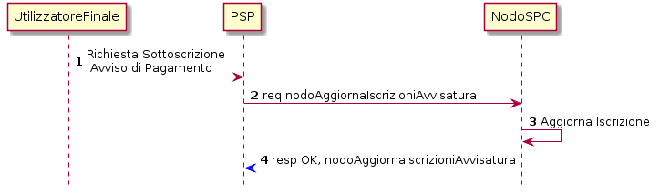
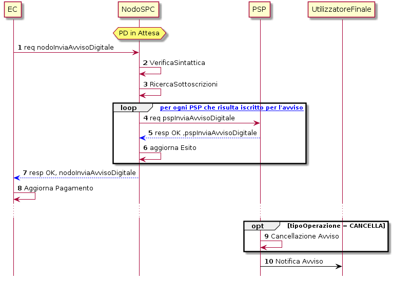
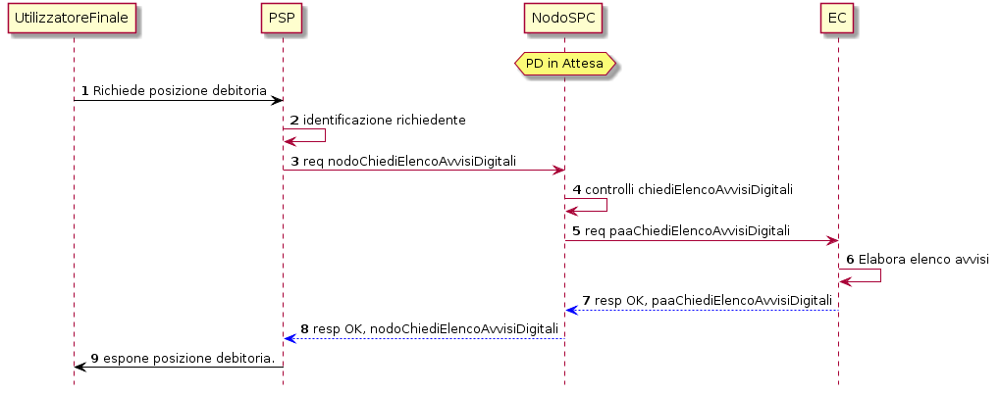
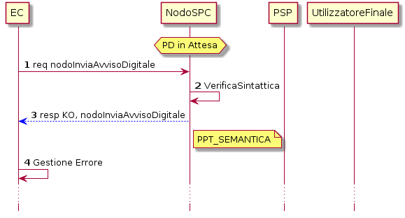
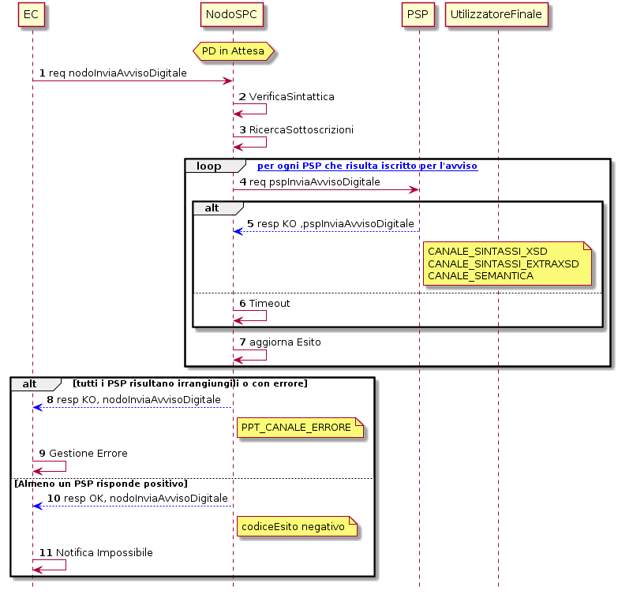
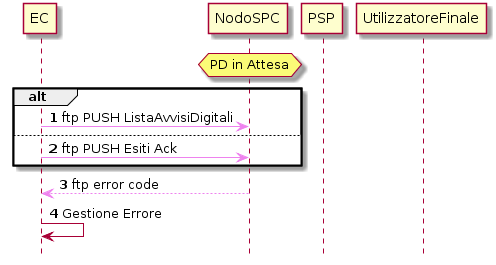
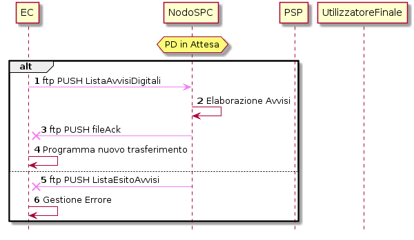
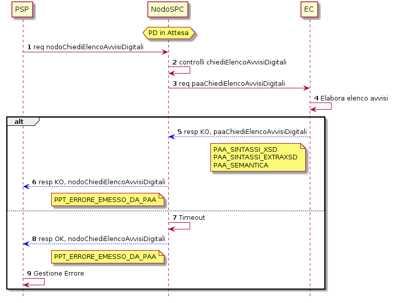

Avvisatura
==========

+----------+-----------------------------------------------+
| |image0| | **Paragrafo soggetto a proposta di modifica** |
+----------+-----------------------------------------------+

Scenari e casi d’uso
--------------------

La funzionalità di Avvisatura Digitale consente ad un EC la trasmissione in formato elettronico di avvisi di pagamenti bonari agli Utilizzatori finali
che si sono iscritti al servizio mediante uno o più strumenti messi a disposizione dai PSP. In tal modo sarà possibile procedere in maniera
semplificata (ovvero senza la necessità di un avviso di pagamento cartaceo) al pagamento presso il PSP.

La trasmissione dell’avviso è unidirezionale. L’EC emette un avviso digitale ogni volta che apre, aggiorna o chiude una posizione debitoria sul
proprio sistema informativo. Questa informazione è trasmessa al PSP che quindi è messo nelle condizioni di gestire di conseguenza il pagamento.

Gli attori coinvolti sono:

-  EC (Ente Creditore): rappresenta una pubblica amministrazione aderente al NodoSPC la quale necessita di notificare agli Utilizzatori finali gli
   avvisi di pagamento per mezzo di uno o più canali messi a disposizione dai PSP.

-  Utilizzatore Finale /PSP, rappresenta l’utilizzatore finale all’interno del canale messo a disponibile da un PSP. Questo attore può essere sia un
   attore primario (in caso di iscrizione al servizio), sia un attore secondario (nel caso di creazione/aggiornamento) dell’avviso.

I casi d’uso sono:

-  Iscrizione Servizio Avvisatura: l’obiettivo dell’Utilizzatore finale in questo caso d’uso è istruire il sistema al fine di ricevere (attraverso il
   canale prescelto) gli avvisi digitali di uno specifico Ente Creditore.

-  Invio Sincrono di un Avviso Digitale: l’obiettivo dell’Ente Creditore in questo caso d’uso è trasmettere l’avviso digitale al soggetto pagatore
   qualora esso sia iscritto mediante un qualsiasi canale.

-  Invio Massivo Avvisi Digitali: l’obiettivo dell’Ente Creditore è inviare molteplici avvisi digitali sino ad un massimo di 100.000 avvisi in una
   giornata.

-  Avvisatura pull: l’obiettivo dell’Utilizzatore finale in questo caso d’uso è interrogare l’EC al fine di reperire tutti gli avvisi di pagamento a
   lui intestati.

Iscrizione avvisatura
---------------------

+--------------------------------------------------------------------------+--------------------------------------------------------------------------+
| Pre-condizioni                                                           | N/A                                                                      |
+==========================================================================+==========================================================================+
| Trigger                                                                  | L’Utilizzatore finale richiede di ricevere (o non ricevere più) gli      |
|                                                                          | avvisi di pagamento tramite uno dei canali messi a disposizione dal PSP  |
+--------------------------------------------------------------------------+--------------------------------------------------------------------------+
| Descrizione                                                              | -  Il PSP aggiorna l’iscrizione alla ricezione degli avvisi digitali     |
|                                                                          |                                                                          |
|                                                                          | -  Il NodoSPC riceve la richiesta ed aggiorna la lista delle iscrizioni. |
+--------------------------------------------------------------------------+--------------------------------------------------------------------------+
| Post-Condizione                                                          | Iscrizione Avvisatura aggiornata                                         |
+--------------------------------------------------------------------------+--------------------------------------------------------------------------+

|image1|

**Figura** **1: Avvisatura**

1. l’Utilizzatore finale richiede al PSP di riceve gli Avvisi di Pagamento da parte di uno o più EC aderenti al sistema;

2. il PSP aggiorna le iscrizioni del servizio avvisatura al NodoSPC valorizzando la struttura *identificativoUnivocoSoggetto* con i dati
   dell’Utilizzatore finale ed impostando il parametro *azioneDiAggiornamento* al valore ‘A’ ( Aggiornamento) o ‘C’ (Cancellazione) nel caso in cui si
   stia richiedendo la rimozione della sottoscrizione;

3. il NodoSPC aggiunge il PSP all’elenco dei destinatari a cui inviare gli avvisi digitali che contengono il campo *codiceIdentificativoUnivoco*
   (attributo della struttura *identificativoUnivocoPagatore* che identifica un *soggettoPagatore*) pari al *codiceIdentificativoUnivoco* della
   richiesta;

4. il NodoSPC notifica l’avvenuta iscrizione del PSP.

Invio sincrono avviso digitale
------------------------------

+-----------------+--------------------------------------------------------------------------------------------------------------------------------+
| Pre-condizioni  | Esiste una posizione debitoria all’interno dell’Archivio Pagamenti in Attesa riferita al soggetto pagatore.                    |
+=================+================================================================================================================================+
| Trigger         | L’EC invia un avviso di pagamento in formato elettronico                                                                       |
+-----------------+--------------------------------------------------------------------------------------------------------------------------------+
| Descrizione     | -  L’EC prepara un avviso di pagamento digitale e lo invia al NodoSPC                                                          |
|                 |                                                                                                                                |
|                 | -  Il NodoSPC distribuisce l’avviso di pagamento digitale ai PSP secondo i criteri di registrazione al servizio di avvisatura  |
|                 |                                                                                                                                |
|                 | -  Il PSP riceve l’avviso digitale e lo notifica all’Utilizzatore finale attraverso uno dei suoi canali                        |
+-----------------+--------------------------------------------------------------------------------------------------------------------------------+
| Post-Condizione | Al termine del caso d’uso il pagamento risulta in stato PD IN ATTESA e l’Utilizzatore finale riceve la notifica del pagamento. |
+-----------------+--------------------------------------------------------------------------------------------------------------------------------+

|image2|

**Figura** **2: Invio sincrono avviso digitale**

1.  l’EC, tramite la primitiva *nodoInviaAvvisoDigitale,* richiede al NodoSPC di inoltrare l’avviso al soggetto pagatore. L’avviso digitale contiene
    al suo interno il tipo di operazione richiesta (CREAZIONE, AGGIORNAMENTO, CANCELLAZIONE);

2.  il NodoSPC verifica la struttura sintattica dell’avviso digitale ricevuto;

3.  il NodoSPC ricerca all’interno dell’archivio sottoscrizioni Avvisatura la lista dei PSP abilitati dal *soggettoPagatore* contenuto all’interno
    dell’Avviso Digitale.

4.  per ogni PSP collegato al *soggettoPagatore*, il NodoSPC inoltra l’avviso digitale con la primitiva *pspInviaAvvisoDigitale;*

5.  il PSP notifica l’avvenuta presa in carico dell’avviso tramite la *response* alla primitiva *pspInviaAvvisoDigitale;*

6.  il NodoSPC aggiorna l’esito delle richieste per il soggetto pagatore;

7.  il NodoSPC notifica l’avvenuta presa in carico di almeno un PSP collegato al servizio di avvisatura digitale per il *soggettoPagatore* dell’avviso
    inoltrato per mezzo della primitiva *nodoInviaAvvisoDigitale*.

8.  l’EC aggiorna l’Archivio dei Pagamenti in Attesa in base all’esito ottenuto dal NodoSPC.

9.  nel caso in cui il *tipoOperazione* specificato all’interno dell’avviso richieda una cancellazione di tale avviso, il PSP procede a cancellare
    l’avviso digitale all’interno dei suoi sistemi.

10. in conformità al canale sottoscritto per mezzo del PSP, il soggetto pagatore riceverà notifica dell’avviso.

Invio massivo avvisi digitali
-----------------------------

+--------------------------------------------------------------------------+--------------------------------------------------------------------------+
| Pre-condizioni                                                           | Esistono molteplici posizione debitorie all’interno dell’Archivio        |
|                                                                          | Pagamenti in Attesa.                                                     |
+==========================================================================+==========================================================================+
| Trigger                                                                  | L’EC invia al NodoSPC tramite SFTP gli avvisi di pagamento.              |
+--------------------------------------------------------------------------+--------------------------------------------------------------------------+
| Descrizione                                                              | -  L’EC prepara gli avvisi digitale e li invia al NodoSPC con protocollo |
|                                                                          |    SFTP                                                                  |
|                                                                          |                                                                          |
|                                                                          | -  Il NodoSPC analizza gli avvisi arrivati (eventualmente segnalando     |
|                                                                          |    eventuali anomalie) e li distribuisce ai PSP secondo i criteri di     |
|                                                                          |    registrazione al servizio di avvisatura                               |
|                                                                          |                                                                          |
|                                                                          | -  Il PSP riceve l’avviso digitale e lo notifica all’Utilizzatore finale |
|                                                                          |    attraverso uno dei suoi canali                                        |
+--------------------------------------------------------------------------+--------------------------------------------------------------------------+
| Post-Condizione                                                          | Al termine del caso d’uso il pagamento risulta in stato PD IN ATTESA e   |
|                                                                          | l’utilizzatore finale riceve la notifica del pagamento.                  |
+--------------------------------------------------------------------------+--------------------------------------------------------------------------+

|image3|

**Figura** **3: Invio massivo avvisi digitali**

1. l’EC, a partire dall’Archivio dei Pagamenti in Attesa, genera il file contenente l’elenco degli Avvisi Digitali;

2. l’EC comprime il file con algoritmo gzip. nominandolo secondo la seguente nomenclatura:

..

   **<idIntermediario>_<idDominio>_<idSessioneTrasmissione>_<progressivoFile>_AV**

nel quale le varie componenti assumono il seguente significato:

a. *idIntermediario:* è il codice fiscale del soggetto intermediario mittente, può coincidere con il dato <idDominio>;

b. *idDominio:* è il codice fiscale del soggetto mittente del flusso; deve coincidere con il dato identificativoDominio presente nel flusso;

c. *idSessioneTrasmissione*: è la data di invio del flusso, nel formato YYYYMMDD;

d. *progressivoFile*: è un numero di due cifre rappresentativo del file inviato nell’ambito della stessa sessione:‘00’ per il primo, ‘01’ per il
   secondo, ecc. [1]_;

..

   Esempio: 12345678901_10987654321_20181201_00_AV.zip

3. l’EC invia il file compresso al NodoSPC utilizzando il protocollo di trasferimento dati SFTP;

4. il NodoSPC, in maniera asincrona rispetto ai dati ricevuti, estrae ed analizza il file ricevuto, e notifica la ricezione dei file creando un
   archivio in formato gzip secondo la seguente nomenclatura:

**<idIntermediario>_<idDominio>_<idSessioneTrasmissione>_<progressivoFile>_AV_ACK**

5.  il NodoSPC invia il file compresso all’EC utilizzando il protocollo di trasferimenti dati SFTP;

6.  l’EC estrae il file inviato dal NodoSPC e lo analizza verificando che tutti gli avvisi precedentemente inviati siano stati ricevuti dal NodoSPC;

7.  il NodoSPC elabora gli avvisi digitali ed individua la lista dei PSP iscritti per il soggetto pagatore;

8.  il PSP notifica la presa in carico dell’Avviso Digitale;

9.  il NodoSPC, in base alle risposte ottenute compila l’esito per la lista degli avvisi digitali.

10. il NodoSPC crea un archivio informato gzip secondo la seguente nomenclatura:

..

   **<idIntermediario>_<idDominio>_<idSessioneTrasmissione>_<progressivoFile>_ESITO**

11. il NodoSPC invia il file compresso all’EC utilizzando il protocollo di trasferimenti dati SFTP;

12. l’EC elabora il file, verificando che ogni avviso sia stato elaborato e, al fine di notificare l’avvenuta ricezione, crea un archivio in formato
    gzip secondo la seguente nomenclatura:

**<idIntermediario>_<idDominio>_<idSessioneTrasmissione>_<progressivoFile>_ESITO_ACK**

13. l’EC invia il file compresso al NodoSPC utilizzando il protocollo di trasferimenti dati SFTP;

14. il PSP , qualora il *tipoOperazione* descritto all’interno dell’avviso digitale si riferisca alla cancellazione, elimina l’avviso di pagamento dai
    canali messi a disposizione del soggetto pagatore.

Avvisatura pull
---------------

+--------------------------------------------------------------------------+--------------------------------------------------------------------------+
| Pre-condizioni                                                           | N/A.                                                                     |
+==========================================================================+==========================================================================+
| Trigger                                                                  | L’Utilizzatore finale richiede, tramite uno dei canali messi a           |
|                                                                          | disposizione del PSP, l’elenco degli avvisi digitali a lui intestati per |
|                                                                          | uno o più Enti Creditori.                                                |
+--------------------------------------------------------------------------+--------------------------------------------------------------------------+
| Descrizione                                                              | -  L’Utilizzatore finale richiede al PSP di visualizzare tutte posizione |
|                                                                          |    debitorie a lui intestate presso un Ente , oppure presso tutti gli    |
|                                                                          |    Enti Creditori aderenti                                               |
|                                                                          |                                                                          |
|                                                                          | -  Il PSP richiede l’elenco degli avvisi digitali al NodoSPC             |
|                                                                          |    specificando o meno l’EC                                              |
|                                                                          |                                                                          |
|                                                                          | -  Il NodoSPC contatta l’EC recuperando tutti gli avvisi digitali        |
|                                                                          |    esistenti per l’Utilizzatore finale                                   |
|                                                                          |                                                                          |
|                                                                          | -  Il NodoSPC re-inoltra l’elenco di tali avvisi ricevuti verso il PSP   |
|                                                                          |    che a sua volta li mostra all’Utilizzatore finale.                    |
+--------------------------------------------------------------------------+--------------------------------------------------------------------------+
| Post-Condizione                                                          | Al termine del caso d’uso il pagamento risulta in stato PD IN ATTESA e   |
|                                                                          | l’Utilizzatore finale riceve la notifica del pagamento.                  |
+--------------------------------------------------------------------------+--------------------------------------------------------------------------+

|image4|

**Figura** **4: Avvisatura pull**

1. l’Utilizzatore finale richiede, tramite il canale del PSP, di ricevere le posizioni debitorie a lui intestate presso uno o tutti gli EC all’interno
   di un arco temporale. E’ possibile specificare un particolare servizio;

2. il PSP identifica e verifica l’Utilizzatore finale in modo tale che esso possa ricercare esclusivamente posizione debitorie per codici fiscali che
   è lecito siano di sua conoscenza;

3. il PSP contatta l’EC indicato dall’Utilizzatore finale, per mezzo del NodoSPC, utilizzando la primitiva *nodoChiediAvvisiDigitali* ed impostando i
   parametri:

   a. *codiceFiscaleUtente*: pari al codice fiscale dell’Utilizzatore finale;

   b. *codiceFiscalePA*: pari al codice fiscale dell’EC indicato (se non presente la richiesta viene inoltrata a tutti gli EC);

   c. *periodoRiferimento*: l’arco temporale richiesto da parte dell’Utilizzatore finale;

4. il NodoSPC effettua i controlli semantici e sintattici per la richiesta pervenuta;

5. il NodoSPC inoltra la richiesta all’EC, utilizzando la primitiva *paaChiediElencoAvvisiDigitali;*

6. l’EC, ricevuta la richiesta, ricerca all’interno del proprio Archivio Pagamenti in Attesa tutte le posizioni debitorie /avvisi digitali intestati
   al codice fiscale contenuto nella richiesta;

7. l’EC fornisce l’elenco di tali avvisi digitali rispondendo alla primitiva *paaChiediElencoAvvisiDigitali;*

8. il NodoSPC inoltra gli avvisi ricevuti presso il PSP;

9. il PSP espone gli avvisi all’Utilizzatore finale.

Gestione degli errori
---------------------

Il paragrafo descrive la gestione degli errori nel processo di Avvisatura Digitale.

**Errore nella composizione sintattica**

+--------------------------------------------------------------------------+--------------------------------------------------------------------------+
| Pre-condizioni                                                           | N/A                                                                      |
+==========================================================================+==========================================================================+
| Descrizione                                                              | -  L’EC invia l’avviso di pagamento attraverso la primitiva              |
|                                                                          |    *nodoInviaAvvisoDigitale*                                             |
|                                                                          |                                                                          |
|                                                                          | -  Il NodoSPC evidenzia un errore semantico all’interno dell’avviso      |
|                                                                          |    ricevuto e lo notifica all’EC                                         |
+--------------------------------------------------------------------------+--------------------------------------------------------------------------+
| Post-Condizione                                                          | Al termine del caso d’uso l’EC ha evidenziato un anomalia che se non è   |
|                                                                          | in grado di risolvere necessiterà l’attivazione del tavolo operativo.    |
+--------------------------------------------------------------------------+--------------------------------------------------------------------------+

..

   |image5|

**Figura** **5: Errore nella composizione sintattica**

   L’evoluzione temporale è la seguente:

1. L’EC invia un avviso digitale tramite la primitiva *nodoInviaAvvisoDigitale*;

2. Il NodoSPC analizza l’avviso digitale ed evidenzia un errore semantico;

3. Il NodoSPC notifica tramite la *response* della primitiva l’errore riscontrato;

4. L’EC analizza l’errore ricevuto, modifica l’avviso digitale e proverà successivamente ad inviarlo nuovamente. In caso non sia in grado di risolvere
   l’anomalia, attiverà il TAVOLO OPERATIVO.

+------------------------------+----------------------+-----------------------------------------------------------------------------------+
| **Strategia di risoluzione** | **Tipologia Errore** | **Azione di Controllo Suggerita**                                                 |
+==============================+======================+===================================================================================+
|                              | PPT_SEMANTICA        | Verificare l’avviso digitale inviato, eventualmente attivare il TAVOLO OPERATIVO. |
+------------------------------+----------------------+-----------------------------------------------------------------------------------+

**Tabella** **1: Verifica avviso**

**Mancata Consegna al PSP**

+-----------------+--------------------------------------------------------------------------------------------------------------------------+
| Pre-condizioni  | N/A                                                                                                                      |
+=================+==========================================================================================================================+
| Descrizione     | -  L’EC invia l’avviso di pagamento tramite la primitiva *nodoInviaAvvisoDigitale*                                       |
|                 |                                                                                                                          |
|                 | -  Il NodoSPC ricerca i PSP per i quali il SoggettoPagatore contenuto all’interno dell’avviso ha effettuato l’iscrizione |
|                 |                                                                                                                          |
|                 | -  Il NodoSPC invia l’avviso verso i PSP trovati                                                                         |
|                 |                                                                                                                          |
|                 | -  Tutti i PSP contattati risultano irraggiungibili o rifiutano l’avviso                                                 |
|                 |                                                                                                                          |
|                 | -  Il NodoSPC notifica l’assenza dei PSP all’EC                                                                          |
|                 |                                                                                                                          |
|                 | -                                                                                                                        |
+-----------------+--------------------------------------------------------------------------------------------------------------------------+
| Post-Condizione |    Il NodoSPC apre il Tavolo Operativo al fine di risolvere l’anomalia con i PSP                                         |
+-----------------+--------------------------------------------------------------------------------------------------------------------------+

|image6|

**Figura** **6: Mancata Consegna al PSP**

   L’evoluzione temporale è la seguente:

1. L’EC invia un avviso digitale tramite la primitiva *nodoInviaAvvisoDigitale*

2. Il NodoSPC effettua controlli sintattici e semantici dell’avviso ricevuto;

3. Il NodoSPC ricerca le sottoscrizioni per il *SoggettoPagatore;*

4. Per ogni PSP iscritto inoltra l’avviso digitale.

..

   Possono verificarsi i seguenti scenari alternativi:

5. Nel caso in cui l’avviso non venga accettato dal PSP, il PSP invierà uno dei seguenti *fault code*: CANALE_SINTASSI_XSD, CANALE_SINTASSI_EXTRASD,
   CANALE_SEMANTICA

6. Il PSP non invia alcuna risposta al NodoSPC nei tempi attesi;

7. In entrambi in casi, il NodoSPC elabora l’esito dell’avviso digitale tenendo conto delle risposte (e di eventuali errori /timeout);

..

   A seconda dell’esito elaborato, possono verificarsi i seguenti scenari alternativi:

8.  Nel caso in cui tutti i PSP iscritti per il SoggettoPagatore risultino non raggiungibili (timeout) oppure non accettino l’avviso digitale, l’esito
    della richiesta da parte dell’EC sarà negativa con *fault_code* PPT_CANALE_ERRORE;

9.  L’EC deve aggiornare il proprio archivio dei pagamenti in attesa segnalando l’impossibilità di notifica digitale dell’avviso.

10. Nel caso in cui almeno uno dei PSP accetti l’avviso di pagamento inviato (codiceEsito = 1), l’esito della richiesta da parte dell’EC sarà
    positiva;

11. In caso in cui tutti i *codiceEsito* siano negativi (ma senza codici di errori) risulta impossibile notificare l’utente tramite il sistema
    (l’utente non è sottoscritto presso alcun PSP), e quindi sarà necessario notificare il *SoggettoPagatore* con altri mezzi;

+------------------------------+----------------------+---------------------------------------------------------+
| **Strategia di risoluzione** | **Tipologia Errore** | **Azione di Controllo Suggerita**                       |
+==============================+======================+=========================================================+
|                              | PPT_CANALE_ERRORE    | Tale condizione, potrebbe attivare il Tavolo Operativo. |
+------------------------------+----------------------+---------------------------------------------------------+

**Errore di trasferimento**

+-----------------+----------------------------------------------------------------------------------------------------------------------------+
| Pre-condizioni  |                                                                                                                            |
+=================+============================================================================================================================+
| Descrizione     | Questo caso d’uso descrive i possibili errori che possono verificarsi durante un trasferimento di dati su protocollo SFTP. |
|                 |                                                                                                                            |
|                 | Tale casistica può verificarsi sia durante l’invio di una lista di avvisi digitali che degli esiti di *ack*.               |
|                 |                                                                                                                            |
|                 | -  L’EC invia un avviso di pagamento o *ack* tramite SFTP,                                                                 |
|                 |                                                                                                                            |
|                 | -  L’EC riceve un *error code* definito dal protocollo SFTP                                                                |
|                 |                                                                                                                            |
|                 | -                                                                                                                          |
+-----------------+----------------------------------------------------------------------------------------------------------------------------+
| Post-Condizione |    L’EC attiva il TAVOLO OPERATIVO                                                                                         |
+-----------------+----------------------------------------------------------------------------------------------------------------------------+

|image7|

**Figura** **7: Errore di trasferimento**

L’evoluzione temporale può essere originata da una delle seguenti alternative:

1. L’EC invia una lista di avvisi digitali al NodoSPC tramite protocollo SFTP

2. L’EC invia una lista di esiti Ack al NodoSPC tramite protocollo SFTP

3. In entrambi i casi, il NodoSPC notifica un errore dalla lista degli *error code* del protocollo SFTP

4. L’EC analizza l’errore ricevuto, se è in grado di risolvere l’anomalia procederà a inviare nuovamente il file al NodoSPC, altrimenti dovrà attivare
   il TAVOLO OPERATIVO

**Mancata Ricezione Dati Attesi**

+-----------------+--------------------------------------------------------------------------------------------------+
| Pre-condizioni  |                                                                                                  |
+=================+==================================================================================================+
| Trigger         | Mancata ricezione dei file attesi                                                                |
+-----------------+--------------------------------------------------------------------------------------------------+
| Descrizione     | A seguito di un trasferimento eseguito con successo, non vengono ricevuti uno dei seguenti file: |
|                 |                                                                                                  |
|                 | -  file di ACK degli avvisi inviati                                                              |
|                 |                                                                                                  |
|                 | -  lista esito degli avvisi                                                                      |
+-----------------+--------------------------------------------------------------------------------------------------+
| Post-Condizione | L’EC attiva il TAVOLO OPERATIVO                                                                  |
+-----------------+--------------------------------------------------------------------------------------------------+

|image8|

**Figura** **8: Mancata Ricezione Dati Attesi**

L’evoluzione temporale può essere originata da una delle seguenti alternative:

1. L’EC invia la lista degli avvisi digitali

2. Il NodoSPC elabora gli avvisi

3. Il NodoSPC non riesce a trasferire i file di *Ack*;

4. l’EC programmerà un nuovo trasferimento dei file. Qualora persista l’errore, l’EC attiverà il TAVOLO OPERATIVO.

5. Il NodoSPC non trasferisce i file degli esiti.

6. Se non vengono ricevuti i file degli esiti nei tempi prestabiliti, al fine di risolvere l’anomalia l’EC attiverà il TAVOLO OPERATIVO.

**Errore nel recupero degli avvisi digitali**

+-----------------+--------------------------------------------------------------------------------------------------------------+
| Pre-condizioni  | L’Utilizzatore finale richiede l’elenco delle proprie posizioni debitorie                                    |
+=================+==============================================================================================================+
| Trigger         | Mancata ricezione dei file attesi                                                                            |
+-----------------+--------------------------------------------------------------------------------------------------------------+
| Descrizione     |    Nel tentativo di recuperare gli avvisi digitali di un EC si evidenziano errori di semantica o connessione |
+-----------------+--------------------------------------------------------------------------------------------------------------+
| Post-Condizione | Necessario un nuovo trasferimento, oppure un tavolo operativo.                                               |
+-----------------+--------------------------------------------------------------------------------------------------------------+

|image9|

**Figura** **9: Errore nel recupero degli avvisi digitali**

L’evoluzione temporale è la seguente:

1. L’Utilizzatore finale tramite i canali messi a disposizione dal PSP richiede al NodoSPC l’elenco degli avvisi digitali emessi da un EC tramite la
   primitiva *nodoChiediElencoAvvisiDigitali*

2. Il NodoSPC effettua controlli sintattici e semantici

3. il NodoSPC inoltra la richiesta all’EC al fine di recuperare gli avvisi digitali

..

   Possono verificarsi i seguenti scenari alternativi:

4.  L’EC evidenzia uno o più problemi di natura semantica notificandoli al NodoSPC

5.  Il NodoSPC ritrasmette l’errore al PSP utilizzando il *fault_bean* PPT_ERRORE_EMESSO_DA_PAA

6.  Il PSP analizza l’errore ricevuto e non avendo avuto alcuna notifica di natura semantica da parte del NodoSPC, attiva il Tavolo Operativo al fine
    di risolvere l’anomalia.

7.  Il NodoSPC evidenzia una mancata risposta da parte dell’EC entro i tempi previsti.

8.  IL NodoSPC evidenzia un errore al PSP di mancato contatto con l’EC

9.  Il PSP non può procedere oltre e attiva il Tavolo Operativo al fine di risolvere l’anomalia.

10. Il NodoSPC evidenzia degli errori di natura semantica o di sintassi nella chiamata ricevuta

11. Il PSP analizza autonomamente l’errore ed interroga nuovamente il NodoSPC.

12. Il NodoSPC non riesce a contattare nella risposta il PSP

13. Il PSP non avendo ricevuto alcuna risposta da parte del NodoSPC non può procedere oltre. Piò tentare nuovamente una richiesta ed eventualmente
    attivare il Tavolo Operativo.

+------------------------------+--------------------------------+----------------------------------------------------------------------------------------------+
| **Strategia di risoluzione** | **Tipologia Errore**           | **Azione di Controllo Suggerita**                                                            |
+==============================+================================+==============================================================================================+
|                              | PPT_ERRORE_EMESSO_DA_PAA       | Il PSP attiva il Tavolo Operativo.                                                           |
+------------------------------+--------------------------------+----------------------------------------------------------------------------------------------+
|                              | *Timeout* da parte del NodoSPC | Il PSP può tentare di contattare nuovamente il NodoSPC , oppure attivare il Tavolo Operativo |
+------------------------------+--------------------------------+----------------------------------------------------------------------------------------------+
|                              | *Timeout* da parte dell’EC     | Il PSP deve attivare il Tavolo Operativo                                                     |
+------------------------------+--------------------------------+----------------------------------------------------------------------------------------------+

.. [1]
   In modo da gestire i casi in cui l’invio giornaliero superi la massima numerosità consentita, al momento prevista in 100 mila avvisi digitali.

.. |image3| image:: media_Avvisatura/media/image4.png
   :width: 6.69306in
   :height: 6.58542in

