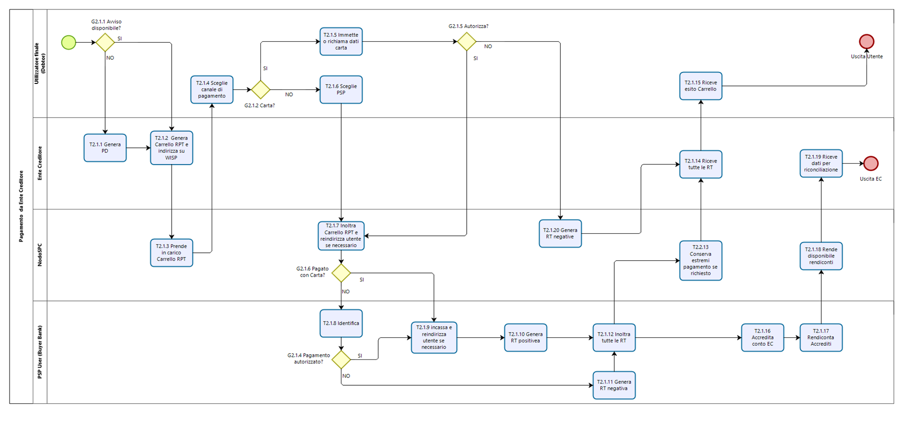

Il Processo di pagamento attivato presso l’Ente Creditore
=========================================================

Rientrano in questa categoria di pagamenti quelli richiesti
dall’Utilizzatore finale attraverso i siti web o *mobile app* o altri
strumenti tecnologici messi a disposizione dagli Enti Creditori per i
pagamenti elettronici. Il processo di pagamento attivato presso l’Ente
Creditore risulta particolarmente congeniale al caso di pagamenti
spontanei (con generazione della posizione debitoria), ma deve gestire
anche il caso in cui l’utilizzatore finale abbia ricevuto un avviso di
pagamento.

Le attività a carico degli Enti Creditori per gestire il processo sono
rappresentate dalla realizzazione delle procedure di pagamento (sia in
termini organizzativi, che informatici); le procedure di pagamento
potranno essere più o meno strettamente integrate con i servizi cui
fanno riferimento.

Il diagramma di **Figura 1** descrive il processo di pagamento
attraverso l’Ente Creditore. Al fine di rendere tale diagramma
immediatamente leggibile la descrizione del *workflow* è stata aggregata
in sotto-paragrafi secondo lo schema logico che segue.

.. figure:: ../images/business_ec.png
   :alt: image0
   :width: 6.37446in
   :height: 0.87811in

   image0

**Figura** **1** **Schema logico del processo di business del pagamento
presso l’Ente Creditore**

Nel processo schematizzato in **Figura 2** sono coinvolti quattro
soggetti:

-  Utilizzatore finale
-  Ente Creditore
-  NodoSPC
-  Prestatore Servizi di Pagamento dell’utilizzatore finale

   image1

**Figura** **2 Il processo del pagamento da Ente Creditore**

Avvio del pagamento
-------------------

Come descritto nei paragrafi precedenti, l’utilizzatore finale può
eseguire un pagamento per ragioni diverse che generano due diramazioni
distinte (gateway G2.1.1) nel caso abbia disponibile o meno un avviso di
pagamento (digitale e analogico).

In entrambi i casi l’Ente Creditore rende disponibile all’Utilizzatore
finale un’interfaccia utente al fine di reperire i dati necessari a
comporre una o più RPT e innescare il pagamento.

Generazione posizione debitoria
-------------------------------

La generazione di una posizione debitoria è l’evento propedeutico al
pagamento sul Sistema pagoPA.

In determinate circostanze, previste nello specifico dalla vigente
normativa, un soggetto matura un debito in favore di una Pubblica
Amministrazione (centrale o locale). In questo caso lo stesso Ente
Creditore assume l’iniziativa di generare una posizione debitoria e
provvede, se del caso, a notificare l’avviso di pagamento al soggetto
pagatore. Questa casistica prende il nome di pagamento dovuto. Nel caso
che l’EC sia tenuto ad accompagnare la notifica con un avviso di
pagamento analogico, provvede anche a inviare al NodoSPC un avviso
digitale.

Nel caso non sussistano le circostanze sopra indicate, l’Utilizzatore
finale può comunque assumere l’iniziativa di avviare il pagamento (si
parla in questo caso di pagamento spontaneo) accedendo al portale messo
a disposizione dall’Ente Creditore; in tal caso l’Ente Creditore genera
la relativa posizione debitoria (*Task* T2.1.1). È facoltà dell’EC
esporre delle funzioni che producano, per lo stesso pagamento, un avviso
(analogico o digitale), da utilizzare in seguito per disporre il
pagamento presso un Prestatore di Servizi di Pagamento.

Scelta canale di pagamento
--------------------------

L’utilizzatore finale accede ai sistemi dell’EC per pagare uno o più
avvisi che gli sono stati recapitati e/o uno o più pagamenti spontanei e
l’Ente Creditore genera il carrello di richieste di pagamento telematico
reindirizzando l’utilizzatore finale sul portale WISP (*Task* T2.1.2).

Il NodoSPC prende in carico il carrello delle richieste di pagamento
telematico (*Task* T2.1.3) mentre l’Utilizzatore finale sceglie il
Prestatore di Servizi di Pagamento e il canale di pagamento.

Per gli utilizzatori finali che scelgono di registrarsi al Sistema
pagoPA sono a disposizione funzioni di supporto che consentono di
memorizzare le scelte di pagamento effettuate per poterle richiamare e
riutilizzare nelle successive occasioni. In questo caso è possibile
eleggere una delle scelte come predefinita così da avere un’esperienza
quanto più possibile simile alla modalità *one-click* tipica dei siti di
*e-commerce*.

I dati personali raccolti saranno trattati, nel rispetto della normativa
vigente, solo per consentire l’erogazione dei servizi richiesti.

Pertanto, detti dati saranno trattati esclusivamente per consentire agli
utenti delle pubbliche amministrazioni e degli altri soggetti aderenti
al Sistema pagoPA di richiedere e ottenere i servizi di pagamento
erogati dai Prestatori di Servizi di Pagamento abilitati sul Sistema
pagoPA, nonché per richiedere e ottenere parimenti i servizi di
identificazione e memorizzazione erogati da AgID sul Sistema pagoPA.

Il conferimento dei dati ed il trattamento degli stessi da parte di AgID
per tali finalità è dunque obbligatorio e non richiede un esplicito
consenso, pena l’impossibilità per l’AgID di erogare i servizi sopra
citati.

Autorizzazione del pagamento
----------------------------

Il processo di pagamento segue percorsi differenti a seconda del
servizio del PSP scelto dall’Utilizzatore finale:

-  In caso di pagamento con carta (di credito o di debito) (*Gateway*
   G2.1.2), l’Utilizzatore finale immette (o recupera nel caso li abbia
   precedentemente memorizzati) i dati della carta (*Task* T2.1.4) e
   quindi decide se autorizzare il pagamento (*Gateway* G2.1.5).

   -  Il pagamento con carta è gestito da un POS virtuale del NodoSPC
      con due differenti esperienze utente. Nel caso di pagamento *on
      us* il NodoSPC riconosce dai dati della carta immessi che il PSP
      emittente (*issuer*) è aderente al sistema pagoPA e quindi lo
      propone come gestore del pagamento (*acquirer*) di default.
      Altrimenti, casistica *not on us,* tale scelta è compiuta
      esplicitamente dall’Utilizzatore finale a cui viene proposta una
      lista di PSP.
   -  I Prestatori di Servizi di Pagamento che offrono il servizio di
      gestione del pagamento con carta devono preventivamente
      configurarsi come tali. I dettagli delle procedure da seguire sono
      riportati nella sezione IV.

-  Per tutte le altre tipologie di pagamento, dopo che l’Utilizzatore
   finale ha selezionato un PSP sul *front-end* del sistema, il NodoSPC
   inoltra in *back-end* il carrello allo stesso Prestatore di Servizi
   di Pagamento responsabile dell’esecuzione (*Task* T2.1.5).

   -  L’esperienza utente del processo di pagamento può proseguire in un
      *front-end* gestito dal Prestatore di Servizi di Pagamento (quindi
      esterno al sistema pagoPA), che prevede l’identificazione del
      soggetto versante (*Task* T2.1.8) e la successiva autorizzazione
      (*Gateway* G2.1.4).
   -  In caso contrario, l’Utilizzatore finale viene reindirizzato al
      *front-end* dell’Ente Creditore da cui era stato avviato il
      pagamento (*Task* T2.1.7). In questo caso l’autorizzazione del
      pagamento da parte dell’Utilizzatore finale avviene mediante
      l’interazione con strumenti messi a disposizione dal Prestatore di
      Servizi di Pagamento. L’esecuzione del pagamento ed il rilascio
      della relativa attestazione (RT) avvengono in funzione delle
      modalità di autorizzazione del pagamento adottate dal Prestatore
      di Servizi di Pagamento. Si distingue quindi l’autorizzazione:

      -  contestuale alla richiesta effettuata, in funzione dei livelli
         di servizio pattuiti con il Prestatore di Servizi di Pagamento,
         se l’utilizzatore finale ha pre-autorizzato il pagamento (ad
         esempio: lettera di manleva o altro strumento contrattuale);
      -  non contestuale, se l’autorizzazione viene rilasciata
         successivamente alla ricezione della richiesta di pagamento
         telematico da parte del Prestatore di Servizi di Pagamento,
         attraverso canali da questo messi a disposizione (ad esempio:
         home banking, notifica su app per smartphone o tablet, ecc.).
         Assimilabile a tale tipologia è il caso di una transazione
         Mybank: il carrello si ferma a una componente del Nodo, il
         Wrapper, che quindi ingaggia la componente *Initiating Party*
         della *Seller Bank*, per la gestione delle fasi successive.
      -  Tutte i percorsi precedenti, incluso il ramo derivante
         dall’autorizzazione al pagamento con carta, confluiscono nel
         punto in cui risulta noto l’esito del pagamento disposto
         dall’Utilizzatore finale e quindi il PSP possa inoltrare le RT
         da esso prodotte (*Task* T2.1.12).

L’Ente Creditore riceve tutte le RT, comprese quelle negative generate
dal NodoSPC (*Task* T2.1.14). Il Prestatore di Servizi di Pagamento deve
restituire la ricevuta telematica nei tempi stabiliti dal documento
“*Indicatori di qualità per i soggetti aderenti*” pubblicato sul sito
istituzionale dell’AgID, in modo da consentire all’Utilizzatore finale
di usufruire dei servizi per cui ha pagato.

L’Ente Creditore può mettere a disposizione dell’Utilizzatore finale una
ricevuta (Task T2.1.15) e terminare il processo. Sul portale dell’Ente
Creditore devono essere messe a disposizione le funzioni che permettono
all’Utilizzatore finale di interrogare lo stato della sua richiesta di
pagamento, scaricare una copia di ricevuta o quietanza di pagamento,
scaricare copia analogica e/o duplicato del documento informatico
Ricevuta Telematica.

Accredito e rendiconto
----------------------

Nella giornata successiva all’incasso, il Prestatore di Servizi di
Pagamento accredita le somme sul conto dell’Ente Creditore (*Task*
T2.1.16).

Nella giornata successiva all’accredito, il Prestatore di Servizi di
Pagamento invia al NodoSPC i dati relativi alla rendicontazione (*Task*
T2.1.17).

Il NodoSPC mantiene disponibili per l’Ente Creditore i dati di
rendicontazione nei dieci giorni successivi (*Task* T2.1.18).

L’Ente Creditore recupera i dati di rendicontazione (*Task* T2.1.19) e
può quindi avviare il processo di riconciliazione.
