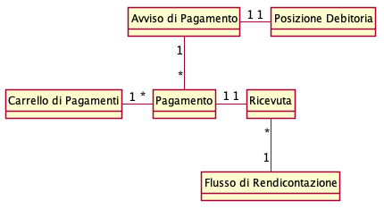

Specifiche Tecniche Generali
============================

Stazioni e Canali
-----------------

I soggetti aderenti EC e PSP, si connettono alla piattaforma per mezzo
rispettivamente di *stazioni* e *canali* che rappresentano le
piattaforma tecnologiche di partner ed intermediari connessi tramite
public-internet o connessioni VPN dedicate.

Modello dei dati
----------------

Durante la descrizione delle interfacce si farà riferimento ad alcune
informazioni le cui relazioni vengono mostrate dal seguente diagramma

   modello dei dati

Posizione Debitoria : rappresenta l’entità ( il servizio ) per la quale
l’EC vuole ricevere pagamenti tramite la piattaforma. E’ identificato in
maniera univoca dalla coppia codice-fiscale / numero avviso.

Avviso di Pagamento : rappresenta la notifica (cartacea o digitale )
della posizione debitoria verso il cittadino.

Pagamento ( o Richiesta di Pagamento ) : descrive nel dettaglio
l’operazione di pagamento correlata ad un avviso e contiene informazioni
di incasso e di accredito.

Ricevuta : descrive l’esito di un pagamento, contiene i dettagli
dell’incasso e la previsione dell’accredito. Contiene al suo interno
anche il riferimento all’avviso di pagamento.

Flusso di Rendicotnazione : dettaglia il riversamento effettuato verso i
conti correnti di un EC da parte di un PSP. Contiene l’elenco di tutti i
pagamenti ( o quota parte ).

Carrello di pagamento : un insieme di pagamenti.

Autenticazione
--------------

Ogni connessione verso la piattaforma avviene tramite canale HTTPS con
mutua autenticazione. Per dettagli di come instaurare la connessione con
la piattaforma vedi ( *link* )

Autenticazione EC
~~~~~~~~~~~~~~~~~

Ogni chiamata verso la piattaforma pagoPA è autenticata per mezzo di due
parametri contenuti all’interno del body del messaggio SOAP:

-  *identificativoStazioneIntermediarioPA* : identificativo della
   stazione configurata all’interno del PDA, che rappresenta il client
   dell’EC.
-  *password* : password associata alla stazione

Qualsiasi messaggio viene autorizzato verificando che la stazione
riportata sia stata configurata all’interno della piattaforma e la
password sia valida.

Autenticazione PSP
~~~~~~~~~~~~~~~~~~

Ogni chiamata verso la piattaforma pagoPA è autenticata per mezzo di tre
parametri contenuti all’interno del body del messaggio SOAP:

-*idPSP* : identificativo del PSP per conto del quale si sta effettuando
la chiamata -*intermeidBrokerPSPdiarioPSP* : identificativo
dell’intermediario che sta effettuando la chiamata -*idChannel* :
identificativo del canale utilizzato per effettuare la chiamata
-*password* : password del canale

Qualsiasi messaggio viene autorizzato verificando che il canale
dell’intermediario sia associato al PSP indicato all’interno della
configurazione della piattaforma e la password sia valida.
