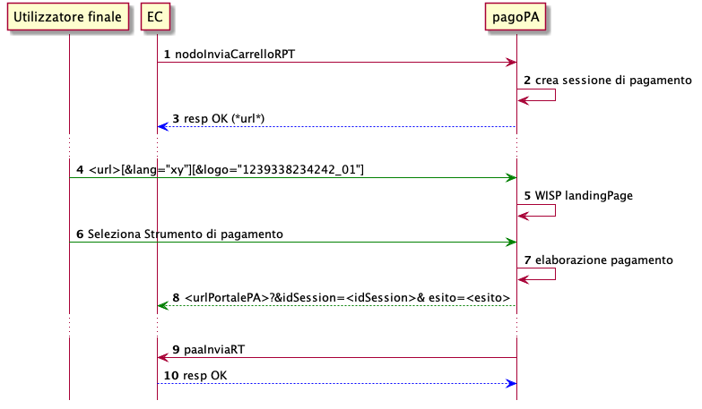

Pagamento On-Line
=================

Tramite la Piattaforma pagoPA, un EC può innescare un pagamento on-line
di una o più posizioni debitorie (carrelli).

   pagamento on line

1.  l’EC compone il carrello di richieste di pagamento delle posizioni
    debitorie tramite la primitiva ``nodoInviaCarrelloRPT``. Ogni RPT
    contenuta all’interno del messaggio descrive il pagamento di una
    posizione debitoria.
2.  la piattaforma crea una sessione di pagamento
3.  la piattaforma restituisce la *checkout url* a cui reindirizzare il
    browser dell’utente per eseguire il pagamento.
4.  il browser dell’utente viene reindirizzato verso la url ottenuta,
    eventualmente corredandola dei *query parameter* di lingua e logo.
5.  viene mostrata la *landingPage* del WISP
6.  l’utente naviga la webapp denominata WISP per l’autenticazione e la
    selezione dello strumento di pagamento. E’ possibile eseguire
    operazioni di pagamento sia in modalità anonima (inserendo
    esclusivamente una mail su cui ricevere messaggio di ricevuta,
    oppure in modalità registrata utilizzando credenziali SPID. In tal
    caso il messaggio di ricevuta sarà spedito alla mail SPID , oppure
    alla mail di notifica impostata tramite l’appIO.
7.  viene eseguito il pagamento utilizzando lo strumento selezionato
    dall’utente.
8.  al termine delle operazioni on-line, l’utente viene reindirizzato
    sulla pagina dell’EC impostata nella configurazione della stazione
    corredata dall’esito dell’operazione. Per maggiori informazioni
    sulla configurazione della stazione, consultare la Sez-IV.
9.  l’EC riceve inoltre una ricevuta telematica che descrive l’intera
    operazione di pagamento

    -  nel caso di pagamenti relativi a posizioni debitorie
       multibeneficiario con intermediari differenti per mezzo della
       primitiva ``paaInviaRT`` se Ente Primario o tramite la
       ``paSendRT`` se Ente Secondario
    -  per le altre tipologia di posizione debitoria sempre per mezzo
       della primitiva ``paaInviaRT``

10. l’EC comunica la ricezione della ricevuta.
