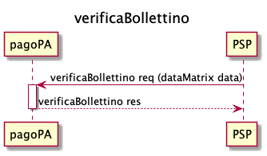

Verifica di una posizione debitoria
===================================

Un EC connesso alla Piattaforma pagoPA deve offrire il servizio di
interrogazione delle proprie posizioni debitorie con la primitiva
*paVerifyPaymentNotice*.

Ogni posizione debitoria ottenuta deve contenere un’unica opzione di
pagamento, che definisce: un importo, una data di scadenza ed una
descrizione. L’opzione di pagamento è composta da più versamenti, ad
ognuno dei quali possono essere associati sia conti correnti bancari che
postali.

Se l’opzione di pagamento è interamente associabile a conti correnti
postali (cioè tutti i transfer possono fare riferimento ad IBAN
postali), l’EC indicherà ``allCCP = true`` sull’opzione. La piattaforma
pagoPA restituirà questa informazione nella response della
``verificaBollettino()``:

   sd_psp_verificaBollettino

Alternativamente, se l’opzione di pagamento non è interamente
associabile a tutti conti correnti postali, l’EC indicherà
``allCCP = false``.

L’interfaccia *paaVerificaRPT* - già contenuta nelle precedenti versioni
- continuerà ad essere utilizzata e supportata sino al 31/12/2021.
