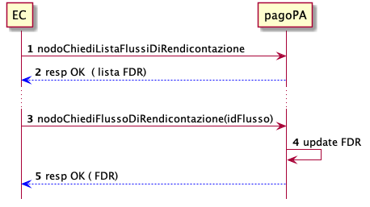

Rendicontazione ed Accredito
============================

Ogni PSP aderente alla piattaforma, a D+2 rendiconta il dettaglio dei
riversamenti effettuati verso i conti di accredito dei pagamenti
avvenuti nella giornata operativa S.

l’EC può recuperare i flussi di rendicontazione prodotti seguendo il
seguente scehma

   sd_ec_richiesta_flussi

1. l’EC richiede l’elenco dei flussi di rendicontazione disponibili
2. la piattaforma restituisce l’elenco dei flussi di rendicontazione
3. l’EC richiede puntualmente ogni flusso di rendicontazione presente
   all’interno della lista
4. la piattaforma restituisce il flusso di rendicontazione ed elimina il
   flusso dall’elenco dei flussi disponibili.

Il Flusso di rendicontazione ottenuto descrive l’elenco dei pagamenti
(*datiSingoloPagamento*) riversati, ognuno dei quali è associabile ad
una ricevuta di pagamento.

ricevuta tramite paaInviaRT (deprecata)
---------------------------------------

E’ possibile rintracciare la ricevuta di un versamento contenuto
all’interno del flusso d rendicontazione tramite i parametri :

-  *identificativoUnivocoVersamento*
-  *identificativoUnivocoRiscossione*

La ricevuta potrebbe contenere diversi versamenti, per identificare il
versamento corrispondente è possibile utilizzare il campo
*indiceDatiSingoloPagamento*.

ricevuta paSendRT
-----------------

E’ possibile rintracciare la ricevuta di un cersamento contenuto
all’interno del flusso di rendicontazione tramite il parametro
*identificativoUnivocoRiscossione* che conterrà il valore del campo
request-id della ricevuta.

La ricevuta potrebbe contenere diversi versamenti, per identificare il
versamento corrispondente è possibile utilizzare il campo
*indiceDatiSingoloPagamento* che conterrà il valore del *trasfer-id*
all’interno della ricevuta.
