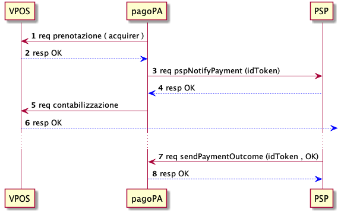

PSP che fungono anche da Acquirer su touch point di PagoPA S.p.A.
-----------------------------------------------------------------

In questo paragrafo viene descritto come un PSP possa offrire
all’interno della piattaforma pagoPA il pagamento tramite strumenti di
pagamento digitali (carta di credito o debito, conto corrente, digital
wallet) attraverso i touch point gestiti direttamente dalla piattaforma.
Il pagamento tramite strumenti di pagamento digitali sui touch point
gestiti da PagoPA S.p.A. viene “centralizzato” all’interno della
piattaforma, ovvero i dati dello strumento sono gestiti direttamente
dalla piattaforma tramite la sua componente PCI DSS (Payment Manager).

Un PSP che volesse esser anche Acquirer può integrarsi con la
Piattaforma pagoPA in due diverse modalità:

1. configurandosi come merchant sulle piattaforme di virtual POS:

   -  Xpay offerto da Nexi S.p.A.
   -  VPOS offerto da SIA S.p.A.

2. integrando un proprio *payment gateway* direttamente con la
   componente Payment Manager di PagoPA S.p.A.

Per entrambe le opzioni la user experience del pagatore si divide fra:

1. utente guest: il pagatore inserisce *ex novo* i dati del proprio
   strumento di pagamento digitale e procede con il pagamento
2. utente registrato: utilizzando SPID o CIE accede ai touch point e
   memorizza il proprio strumento (se le peculiarità lo permettono) per
   poi esser utilizzato nei successivi pagamenti minimizzando le
   interazioni, riducendo l’inserimento dati del pagatore e gestendo la
   transazione nel modo più *frictionless* possibile.

In entrambi gli scenari, il processo di pagamento è descritto
sinteticamente in questi punti:

1. L’utente sceglie o inserisce *ex novo* i dati dello strumento di
   pagamento utilizzando le interfacce dei touch point PagoPA
2. la piattaforma seleziona il servizio di acquiring secondo il seguente
   principio:

   1. Viene selezionato il servizio di pagamento del PSP Issuer della
      carta emessa.
   2. Viene selezionato il servizio di pagamento del PSP (che gestisce
      il circuito di appartenenza della carta) che rappresenta il costo
      di commissione più basso per l’operazione in corso

3. L’utente ha SEMPRE la possibilità di modificare la selezione proposta
   dalla piattaforma.
4. Viene mostrata una pagina di riepilogo del pagamento
5. Alla conferma dell’operazione viene effettuato il pagamento nelle
   modalità di integrazione del canale selezionato.

Integrazione e workflow per PSP/Acquirer integrato con Virtual POS
~~~~~~~~~~~~~~~~~~~~~~~~~~~~~~~~~~~~~~~~~~~~~~~~~~~~~~~~~~~~~~~~~~

E’ necessario configurare 2 negozi (3DS 2.0):

-  canale utilizzato per on-boarding della carta.
-  canale per pagamenti di utenti registrati.

Come da direttiva PSD2, durante ogni pagamento sarà responsabilità
dell’Issuer richiedere il codice di autorizzazione (SCA) per procedere
con le operazioni (memorizzazione dello strumento o pagamento).

L’operazione di pagamento avviene in due fasi:

-  autorizzazione
-  contabilizzazione

   sd_acquirer.puml

-  Avvenuta la selezione dell’acquirer, il pagatore innesca l’azione del
   client
-  La piattaforma verifica la disponibilità dell’importo verso
   l’acquirer tramite una chiamata al payment Gateway / Virtual POS.
-  Il Virtual POS restituisce l’esito dell’autorizzazione.
-  Il Payment Manager allinea la componente Nodo
-  Nel caso di risposta positiva, la piattaforma notifica al PSP
   associato all’acquirer selezionato che l’autorizzazione è avvenuta
   con successo, utilizzando la primitiva ``pspNotifyPayment``

   -  All’interno del campo ``creditCardPayment`` sono racchiusi i
      codici identificativi e la risposta ottenuta dal Virtual POS in
      modo tale che il PSP possa verificare l’operazione di pagamento.

-  In caso di esito positivo, la piattaforma esegue l’operazione di
   contabilizzazione delle somme.
-  Successivamente, entro 2sec , il PSP notifica la conclusione del
   pagamento impegnandosi ad effettuare l’accredito sui conti correnti
   ricevuti sopra, utilizzando la chiamata ``sendPaymentOutcome``.
-  La piattaforma registra la chiusura del pagamento, ed invierà
   ricevuta dell’operazione agli Enti Beneficiari.

Nel caso in cui il PSP non risponda con esito positivo alla chiamata
``pspNotifyPayment``, la piattaforma esegue la cancellazione
dell’operazione e le somme impegnate ritorneranno in possesso
dell’utente.

Payment Gateway
~~~~~~~~~~~~~~~

In questo scenario PagoPA S.p.A. si rende disponibile ad un’integrazione
specifica con il PSP secondo modi e tempi da concordare, che rifletta in
ogni caso i flussi descritti nel precedente paragrafo per garantire una
user experience uniforme.
