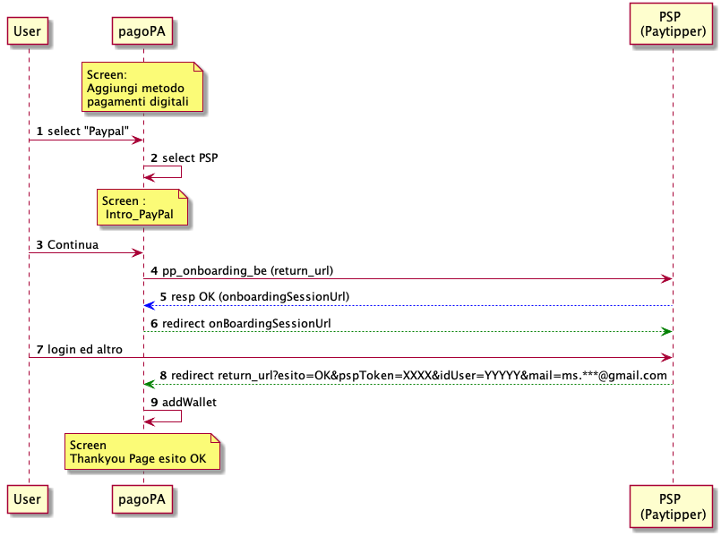
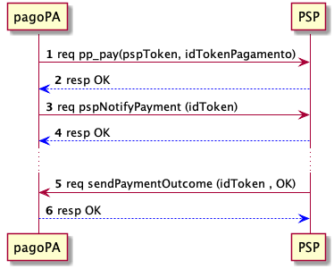

Paypal
------

.. figure:: ../images/wip.png
   :alt: work in progress

   work in progress

PayPal è una società statunitense che offre servizi di pagamento
digitale; fondata nel 1999 oramai è sinonimo di pagamento facile e
sicuro. Un qualsiasi utente medio che effettua pagamenti on-line conosce
e/o possiede un account PayPal.

PayPal è, di fatto, un wallet dell’utente al cui interno può inserire
diversi metodi di pagamento, tra cui carta di credito e bonifico
bancario

Non essendo un PSP aderente alla piattaforma pagoPA, il servizio di
pagamento utilizzando il wallet PayPal è offerto come soluzione da uno (
o più ) PSP aderenti. Ciò significa che il durante l’operazione di
pagamento sarà il PSP a ricevere le somme , ed unico responsabile del
trasferimento sui conti correnti della Pubblica Amministrazione.

Grazie all’integrazione del prodotto di PayPal, un Cittadino potrà
salvare all’interno del suo wallet il suo account PayPal ed utilizzarlo
durante un pagamento.

Durante l’operazione di aggiunta dello strumento ( onBoarding), sarà
utilizzato un PSP di default tra quelli offrono lo strumento secondo un
criterio di maggior risparmio per il cittadino ( costo della transazione
inferiore ). Al termine di tale processo, il PSP acquisirà
l’autorizzazione per effettuare pagamenti pagoPA con l’account paypal
dell’utente.

   sd_paypal.puml

1. l’uente seleziona l’aggiunta dello strumento paypal all’interno del
   suo wallet
2. la piattaforma seleziona il PSP di default da associare a paypal in
   base al costo commissioni applicato.
3. viene visualizzata una schermata riepilogativa , in cui l’utente
   dichiara di voler procedere con l’inserimento dello strumento.
4. la piattaforma richiede l’onboarding dell’utente attraverso la
   primitiva ``pp_onboarding_be``, specificando la url di ritorno da
   utilizzare al termine dell’operazione di onboarding.
5. il PSP effettua operazioni di verifica su paypal restituendo una url
   temporanea da autilizzare per registrare il PSP autorizzato ad
   operare sul conto paypal.
6. la piattaforma re-indirizza l’utente verso la url restituita al punto
   precedente, indicando una ``onBoardingSessionUrl``
7. l’utente inserisce il proprio account paypal, e termina le operazioni
   di autorizzazioni necessarie.
8. al termine delle operazioni, l’utente viene re-indirizzato alla
   ``return_url`` ritornando le seguenti informazioni :

   -  pspToken, identificativo autorizzativo dello strumento di
      pagamento presso il PSP
   -  idUser, identificativo dell’account paypal
   -  mail, e-mail dell’account paypal ( mascherato )

9. la piattaforma restiuisce esito all’utente ed all’interno del wallet
   viene salvato l’account paypal associato al PSP

Durante le operazioni di pagamento , potrà sempre cambiare la scelta del
PSP visionando esplicitamente il costo delle commissioni applicate sulla
transazione in essere. Il flusso di pagamento può essere riassunto come
segue

   sd_pagamento_paypal.puml

1. la piattaforma richiede un pagamento sull’account dell’utente con il
   codice autorizzzativo (pspToken) ricevuto in fase di onBoarding.
2. il PSP esegue il pagamento, e restituisce l’esito.
3. la piattaforma notifica i dati dell’accredito attraverso la primitiva
   ``pspNotifyPayment(idTokenPagamento)``
4. il PSP prende in carico il riversamento riconoscendo, attraverso le
   informazioni presentu nella sezione ``paypal``, il pagamento
   eseguito. 5 Successivamente , entro 2sec, il PSP invia conclusione
   del pagamento con la prmitiva ``sendPaymentOutcome``
5. la piattaforma notifica l’avvenuta ricezione e si impegna a
   consegnare ricevuta agli Enti beneficiari.

Oltre ai flussi descritti il PSP deve mettere a disposizione : -
``pp_delete_account`` : cancellazione dell’autorizzazione -
``pp_delete_payment`` : storno del pagamento, necessario per gestire
casi di errore.

La fase di on-boarding sarà completata all’interno del servizio PayPal,
dove l’utente accederà con il proprio account e autorizzerà il PSP ( qui
invece il riferimento del PSP sarà esplicito ) ad effettuare pagamenti
sulla piattaforma pagoPA utilizzando l’account dell’utente. Il PSP
utilizzato in fase di onboarding sarà la scelta predefinita durante le
operazioni di pagamento.
