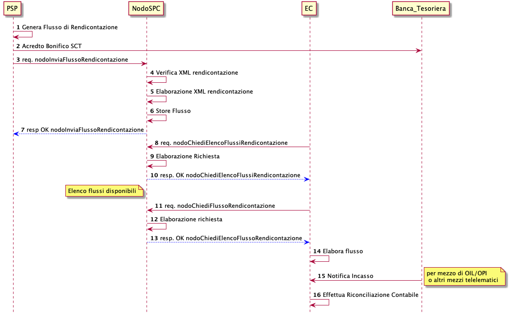

Back-office
===========

Revoca e storno
---------------

Il NodoSPC mette a disposizione servizi di interscambio che i soggetti
aderenti possono utilizzare per realizzare indifferentemente processi di
storno e/o revoca di pagamento, purché siano intesi come funzionalità di
supporto del sistema pagoPA a cui ricorrere unicamente per sanare
situazioni di eccezione. Ogni soggetto aderente rileva la disponibilità
della controparte ad avviare tali processi mediante dati di
configurazione.

Come specificato nella figura successiva, tali funzionalità sono
istanziate per scopi di business ben definiti; ad esempio per il rientro
da situazioni anomale o di incoerenza nei documenti prodotti durante il
ciclo di vita del pagamento, rispetto allo stato di fatto del pagamento
stesso. Al variare del soggetto istanziante e delle motivazioni che
innescano l’esecuzione del processo, possono verificarsi le situazioni
mostrate nella figura seguente.

|image0|

**Figura** **1: Attori coinvolti nell’innesco dei processi di revoca e
storno di una RT**

============ ===============
**Processo** **Innesco**
============ ===============
RevocaRT     Avviato dal PSP
Storno       Avviato dall’EC
============ ===============

**Tabella** **1: Soggetti che istanziano i processi di Revoca e Storno
di un pagamento**

Il processo di revoca può essere a sua volta diversificato sulla base
delle motivazioni che ne determinano l’innesco, come da tabella
successiva:

+-----+--------+-------------------------------------------------------+
| *   | *      | **Descrizione**                                       |
| *Pr | *Tipol |                                                       |
| o   | ogia** |                                                       |
| ces |        |                                                       |
| s   |        |                                                       |
| o** |        |                                                       |
+=====+========+=======================================================+
| R   | A      | Innescato dal PSP quando, in casi assolutamente       |
| evo | nnullo | eccezionali, lo stato effettivo del pagamento non è   |
| c   | T      | coerente con i documenti in possesso                  |
| aRT | ecnico | dell’Utilizzatore finale:                             |
|     |        |                                                       |
|     |        | -  il PSP ha emesso una RT negativa e l’importo       |
|     |        |    dovuto risulta addebitato al soggetto versante il  |
|     |        |    quale è in possesso di una attestazione di         |
|     |        |    pagamento                                          |
|     |        | -  Il PSP ha emesso una RT positiva ma il soggetto    |
|     |        |    versante non è stato addebitato della somma dovuta |
|     |        |    né è in possesso di una attestazione di pagamento  |
|     |        |                                                       |
|     |        | Si fa presente che è fatto obbligo per il PSP di      |
|     |        | implementare le funzionalità di annullo tecnico e per |
|     |        | EC di predisporre le opportune soluzioni tecniche per |
|     |        | la gestione di tali richieste.                        |
+-----+--------+-------------------------------------------------------+
|     | *      | Innescato dal PSP nel caso in cui l’Utilizzatore      |
|     | charge | finale chieda il riaccredito delle somme versate per  |
|     | -back* | un pagamento conclusosi con esito positivo            |
|     | Utente |                                                       |
+-----+--------+-------------------------------------------------------+
| S   | Storno | L’Utilizzatore finale richiede all’EC lo storno delle |
| tor |        | somme precedentemente pagate al PSP.                  |
| no  |        |                                                       |
|     |        | Si fa presente che non è fatto obbligo al PSP         |
|     |        | implementare tale funzionalità                        |
+-----+--------+-------------------------------------------------------+

**Tabella** **2: Descrizione sintetica delle motivazioni per l’innesco
dei processi di revoca e storno**

Processo di Revoca per Annullo Tecnico
~~~~~~~~~~~~~~~~~~~~~~~~~~~~~~~~~~~~~~

Il processo di revoca di una ricevuta telematica per Annullo Tecnico
consente il rientro da situazioni anomale o di incoerenza nello stato di
fatto del pagamento rispetto a quanto rappresentato dalla RT generata
dal PSP attestante il pagamento. Il caso d’uso nominale è rappresentato
nella tabella successiva.

+--------+-------------------------------------------------------------+
| P      | -  è stata recapitata all’EC una RT positiva, ma            |
| re-Con |    l’Utilizzatore finale non è stato addebitato             |
| d      | -  è stata recapitata all’EC una RT negativa, ma            |
| izione |    l’Utilizzatore finale è stato addebitato                 |
|        | -  la richiesta di Annullo Tecnico è avanzata entro le ore  |
|        |    01:00 del giorno solare successivo a quello di creazione |
|        |    della RT (*dataOraMessaggioRicevuta*)                    |
+--------+-------------------------------------------------------------+
| T      | Il PSP ha evidenza di una squadratura puntuale fra incasso  |
| rigger | e relativa RT .                                             |
+--------+-------------------------------------------------------------+
| D      | -  il PSP sottomette al NodoSPC la richiesta di revoca di   |
| escriz |    una RT;                                                  |
| ione   | -  il NodoSPC valida la richiesta e la accetta;             |
|        | -  l’EC riceve mediante il NodoSPC la richiesta di revoca;  |
|        | -  l’EC valida la richiesta di revoca producendo il         |
|        |    relativo esito;                                          |
|        | -  l’EC invia al PSP, mediante il NodoSPC, l’esito della    |
|        |    richiesta di revoca                                      |
|        | -  Il PSP produce e invia la RT che sovrascrive quella      |
|        |    revocata                                                 |
+--------+-------------------------------------------------------------+
| P      | -  Il pagamento transisce allo stato *Pagamento_revocato*   |
| ost-Co |                                                             |
| n      |                                                             |
| dizion |                                                             |
| e      |                                                             |
+--------+-------------------------------------------------------------+

**Tabella** **3: Caso d’uso del processo di revoca per annullo tecnico**

L’evoluzione temporale del processo di revoca è il seguente:

|image1|

**Figura** **2: Diagramma di sequenza del processo di revoca di una RT
per Annullo Tecnico**

1.  il PSP compone il documento XML per la richiesta di revoca e lo
    sottomette all’EC attraverso il NodoSPC mediante la primitiva
    *nodoInviaRichiestaRevoca*;

    a. In questo caso il valore del campo *tipoRevoca* all’interno della
       struttura *datiRevoca* sarà pari ad 1;

2.  il NodoSPC valida la richiesta inviata dal PSP;
3.  il NodoSPC inoltra la richiesta di revoca all’EC mediante la
    primitiva *paaInviaRichiestaRevoca*;
4.  l’EC replica al PSP fornendo esito positivo mediante *response* alla
    primitiva precedente;
5.  il NodoSPC inoltra la replica dell’EC al PSP fornendo *response*
    positiva alla primitiva di cui al punto 1.
6.  l’EC esegue il *rollback* del sistema relativamente alla posizione
    debitoria interessata e predispone il documento informativo XML ER
    attestante l’esito della revoca;
7.  l’EC invia il documento ER al PSP mediante il Nodo attraverso la
    primitiva *nodoInviaRispostaRevoca*;
8.  il NodoSPC valida il documento ER ricevuto;
9.  il NodoSPC inoltra il documento ER al PSP mediante la primitiva
    *pspInviaRispostaRevoca*;
10. il PSP conferma la ricezione del messaggio di esito della revoca
    fornendo *response* OK alla primitiva precedente;
11. il NodoSPC conferma all’EC la ricezione dell’esito della revoca da
    parte del PSP fornendo *response* OK alla primitiva di cui al punto

    7. 

Il *workflow* si conclude con l’invio da parte del PSP della RT che
andrà a sovrascrivere quella revocata. In questo caso il parametro
*Forzacontrollosegno* nella SOAP *request* *nodoInviaRT* deve essere
impostato a 1.

Processo di Revoca di una Ricevuta Telematica per charge-back
~~~~~~~~~~~~~~~~~~~~~~~~~~~~~~~~~~~~~~~~~~~~~~~~~~~~~~~~~~~~~

Il processo di revoca per *charge-back* di una RT è innescato dal PSP
solo verso l’EC che aderisce al servizio e sarà realizzabile solo per i
pagamenti effettivamente revocabili (sono esclusi tutti i pagamenti a
fronte di servizi già erogati al momento della richiesta di
*charge-back*) purché la posizione debitoria dell’utilizzatore finale
risulti pagata. Il caso d’uso nominale è così descritto:

+-----------+----------------------------------------------------------+
| P         | -  Pagamento effettuato con esito positivo – Stato       |
| re-Condiz |    Pagamento: *RT_EC*                                    |
| ione      | -  Adesione dell’EC al servizio di revoca per            |
|           |    *charge-back*                                         |
|           | -  Il pagamento è rimborsabile dall’EC                   |
+-----------+----------------------------------------------------------+
| Trigger   | L’Utilizzatore finale avanza la richiesta di revoca al   |
|           | PSP con cui ha effettuato il pagamento                   |
+-----------+----------------------------------------------------------+
| D         | -  Il PSP sottomette al NodoSPC la richiesta di revoca   |
| escrizion |    della RT                                              |
| e         | -  Il NodoSPC valida la richiesta e la accetta           |
|           | -  L’EC riceve mediante il NodoSPC la richiesta di       |
|           |    revoca                                                |
|           | -  L’EC valida la richiesta di revoca, esegue il         |
|           |    *rollback* del sistema e produce il relativo esito    |
|           | -  L’EC invia al PSP mediante il NodoSPC l’esito della   |
|           |    richiesta di revoca                                   |
|           | -  Il *workflow* si conclude senza l’invio di una nuova  |
|           |    RT                                                    |
+-----------+----------------------------------------------------------+
| P         | -  Il pagamento transisce allo stato *Pagamento          |
| ost-Condi |    Revocato*                                             |
| zione     |                                                          |
+-----------+----------------------------------------------------------+

**Tabella** **4: Scenario d’uso del processo di revoca di una RT per
charge-back**

Al pari dei casi d’uso riportati nei capitoli precedenti, l’evoluzione
temporale e le primitive coinvolte nel processo di revoca sono riportate
nella figura successiva, avendo cura di notare che il caso d’uso
rappresenta lo scenario in cui le cui invocazioni SOAP si concludono con
esito positivo (esito: OK come parametro di *output*).

|image2|

**Figura** **3: Diagramma di sequenza del processo di revoca per
charge-back**

1.  l’Utilizzatore finale richiede al PSP attestante il pagamento la
    revoca della RT per *charge-back*;
2.  il PSP compone il documento informativo XML Richiesta di Revoca (RR)
    e la invia al NodoSPC mediante la primitiva SOAP
    *nodoInviaRichiestaRevoca;*
3.  il NodoSPC valida la richiesta di revoca;
4.  il NodoSPC invia la richiesta di revoca all’EC mediante la primitiva
    *paaInviaRichiestaRevoca;*
5.  l’Ente Creditore, accettata la RR, replica al PSP attraverso il
    NodoSPC fornendo *response* OK;
6.  il NodoSPC inoltra al PSP la replica positiva dell’EC fornendo
    *response* OK alla primitiva di cui al punto 2.
7.  l’EC, dopo aver verificato positivamente la possibilità di revoca
    della RT, riporta la Posizione Debitoria allo stato precedente al
    pagamento e procede alla generazione del documento informativo XML
    Esito Revoca (ER);
8.  l’EC invia il documento ER al PSP mediante il Nodo attraverso la
    primitiva *nodoInviaRispostaRevoca;*
9.  il NodoSPC valida il documento ER ricevuto;
10. il NodoSPC inoltra il documento ER al PSP mediante la primitiva
    *pspInviaRispostaRevoca;*
11. il PSP conferma la ricezione del messaggio di esito della revoca
    fornendo *response* OK alla primitiva precedente;
12. il NodoSPC conferma all’EC la ricezione dell’esito della revoca da
    parte del PSP fornendo *response* OK alla primitiva di cui al punto
    8;
13. il PSP notifica l’Utilizzatore finale circa l’esito positivo della
    procedura di revoca della ricevuta telematica.

Processo di Storno di un pagamento
~~~~~~~~~~~~~~~~~~~~~~~~~~~~~~~~~~

Il processo di storno di un pagamento, attivato dall’EC, è innescato
quando l’Utilizzatore finale richieda a vario titolo la cancellazione di
un pagamento precedentemente avvenuto. Il caso d’uso nominale e
l’evoluzione temporale sono mostrate nella figura successiva.

+----------+-----------------------------------------------------------+
| P        | -  Il PSP utilizzato per il pagamento supporti le         |
| re-Condi |    funzionalità di storno                                 |
| zione    | -  Il pagamento si trova nello stato RT EC                |
+----------+-----------------------------------------------------------+
| Trigger  | L’utilizzatore richiede lo storno di un pagamento         |
|          | precedentemente avvenuto                                  |
+----------+-----------------------------------------------------------+
| D        | -  L’Ente Creditore sottomette al PSP mediante il nodo    |
| escrizio |    una richiesta di storno generando il documento         |
| ne       |    RR-Richiesta Revoca                                    |
|          | -  Il PSP replica positivamente e genera il documento ER  |
|          |    inviato all’Ente Creditore mediante il NodoSPC.        |
+----------+-----------------------------------------------------------+
| P        | -  Il pagamento si trova nello stato RT Stornata          |
| ost-Cond |                                                           |
| izione   |                                                           |
+----------+-----------------------------------------------------------+

**Tabella** **5: Caso d’uso del processo di storno di un pagamento**

|image3|

**Figura** **4: Evoluzione temporale del processo di storno di un
pagamento**

1.  l’Utilizzatore finale richiede lo storno di un pagamento effettuato
    all’EC;
2.  l’EC genera il documento XML RR;
3.  mediante la primitiva *nodoInviaRichiestaStorno* l’EC invia al
    NodoSPC il documento RR;
4.  il NodoSPC valida il documento RR ricevuto;
5.  il NodoSPC inoltra al PSP la RR generata dall’EC mediante la
    primitiva *pspInviaRichiestaStorno;*
6.  il PSP replica positivamente alla primitiva precedente fornendo
    *Esito* OK\ *;*
7.  il NodoSPC inoltra la replica precedente all’EC fornendo *response*
    OK alla primitiva di cui al punto 3;
8.  il PSP predispone il documento Esito Revoca – RR;
9.  il PSP inoltra all’EC mediante il NodoSPC l’esito della revoca
    attraverso la primitiva *nodoInviaEsitoStorno;*
10. il NodoSPC valida il documento ER;
11. il NodoSPC inoltra all’Ente Creditore il documento ER mediante la
    primitiva *paaInviaEsitoStorno;*
12. l’EC replica positivamente al PSP mediante il NodoSPC fornendo
    *response* OK alla primitiva di cui al punto 11;
13. il NodoSPC inoltra la replica precedente al PSP fornendo *response*
    OK mediante la primitiva *nodoInviaEsitoStorno;*
14. l’EC informa l’Utilizzatore finale in merito all’esito delle
    operazioni di storno.

Riconciliazione
---------------

All’interno di questo paragrafo vengono descritti i casi d’uso che
descrivono il processo contabile operato dall’Ente Creditore al fine di
riconciliare i pagamenti effettuati dall’Utilizzatore finale.

Attori del processo di Riconciliazione Contabile e casi d’uso
~~~~~~~~~~~~~~~~~~~~~~~~~~~~~~~~~~~~~~~~~~~~~~~~~~~~~~~~~~~~~

Gli attori coinvolti nel processo di riconciliazione sono i seguenti:

-  **Ente Creditore:** rappresenta una Pubblica Amministrazione che ha
   ricevuto i pagamenti effettuati dall’Utilizzatore finale e necessita
   di riconciliare i pagamenti a suo favore
-  **PSP:** rappresenta un Prestatore di Servizi di Pagamento che ha
   accreditato il conto di un EC con le somme incassate nella giornata
   operativa
-  **Banca Tesoriera/ Cassiera:** rappresenta il Prestatore di Servizi
   di Pagamento che gestisce il conto di incasso di un EC. E’ il
   destinatario del flusso di riversamento SCT e notifica all’EC
   l’avvenuto incasso su sistemi esterni a pagoPA.

Worflow di Riconciliazione
~~~~~~~~~~~~~~~~~~~~~~~~~~

Il processo di riconciliazione comporta il seguente *workflow* dove
saranno utilizzati i seguenti termini:

-  Giorno D: giorno lavorativo in cui è stato eseguito il pagamento
-  Giorno D+1: giorno lavorativo successivo al giorno D
-  Giorno D+2: giorno lavorativo successivo al giorno D+1
-  *Cut-off*: orario di termine della giornata operativa. (NB la
   giornata operativa pagoPA termina alle ore 13)

+------+---------------------------------------------------------------+
| P    | -  L’EC ha ricevuto dei pagamenti su un conto destinato       |
| re-C |    all’incasso tramite pagoPA                                 |
| o    | -  Entro D+1 il PSP accredita (con uno o più SCT) il conto    |
| ndiz |    dell’EC per l’importo delle somme relative a RPT con       |
| ione |    valore del *tag* *dataOraMessaggioRichiesta* antecedente   |
|      |    al *cut-off* della giornata operativa pagoPA del giorno D. |
|      | -  Per ogni SCT cumulativo di più pagamenti, il PSP genera un |
|      |    flusso di rendicontazione, contenente la distinta dei      |
|      |    pagamenti cumulati.                                        |
|      | -  Entro D+2 il PSP sottomette al NodoSPC il flusso di        |
|      |    rendicontazione di cui al punto precedente.                |
|      | -  Il Nodo valida la richiesta e archivia il flusso           |
|      |    rendendolo disponibile per l’EC.                           |
+------+---------------------------------------------------------------+
| T    | L’EC riconcilia gli accrediti SCT ricevuti sul conto indicato |
| rigg | nelle RPT                                                     |
| er   |                                                               |
+------+---------------------------------------------------------------+
| D    | -  L’EC richiede la lista dei flussi disponibili sul Nodo     |
| escr |    relativa ai pagamenti da riconciliare.                     |
| i    | -  L’EC richiede il flusso di interesse, lo riceve e procede  |
| zion |    alla riconciliazione dei pagamenti.                        |
| e    |                                                               |
+------+---------------------------------------------------------------+
| P    | Il pagamento transisce allo stato *Pagamento Rendicontato*    |
| ost- |                                                               |
| C    |                                                               |
| ondi |                                                               |
| z    |                                                               |
| ione |                                                               |
+------+---------------------------------------------------------------+

**Tabella** **7: Worflow di Riconciliazione**

L’evoluzione temporale è la seguente:

|image4|

**Figura** **5: Diagramma di sequenza del processo di riconciliazione
contabile**

1. il PSP genera il flusso di rendicontazione componendo il file XML di
   rendicontazione codificato in *base64*;
2. il PSP accredita con SCT il conto di un EC. L’importo dello SCT può
   essere pari all’importo di un singolo pagamento ovvero pari
   all’importo cumulativo di più pagamenti, purché tali pagamenti siano
   stati incassati a favore del medesimo EC nella medesima giornata
   operativa pagoPA.

Nel caso di riversamento cumulativo, l’SCT dovrà riportare all’interno
dell’attributo AT-05 *(Unstructured Remittance Information*) il valore:

/PUR/LGPE-RIVERSAMENTO/URI/<identificativoFlusso>,

dove *identificativoFlusso* specifica il dato relativo all’informazione
di rendicontazione inviata al NodoSPC.

Nel caso di riversamento singolo, l’SCT dovrà riportare all’interno
dell’attributo AT-05 *(Unstructured Remittance Information*) il valore
della causale di versamento indicato nella RPT.

3.  il PSP, mediante la primitiva *nodoInviaFlussoRendicontazione*,
    invia al NodoSPC il flusso di rendicontazione generato, valorizzando
    i parametri di input *identificativoFlusso* con l’identificativo del
    flusso di rendicontazione da trasmettere e il parametro
    *xmlRendicontazione* con il file XML di rendicontazione codificato
    in base64.

4.  il NodoSPC verifica il file XML di rendicontazione;

5.  il NodoSPC elabora il file XML di rendicontazione\ *;*

6.  il NodoSPC esegue l’archiviazione del flusso di rendicontazione
    sulle proprie basi di dati;

7.  il NodoSPC replica fornendo esito OK alla primitiva
    *nodoInviaFlussoRendicontazione;*

8.  l’EC, mediante la primitiva *nodoChiediElencoFlussiRendicontazione,*
    richiede al NodoSPC la lista dei flussi di rendicontazione
    disponibili;

9.  il NodoSPC elabora la richiesta;

10. il NodoSPC, a seguito della validazione della richiesta, replica con
    *response* OK fornendo in output la lista completa di tutti i flussi
    disponibili per l’EC;

11. l’EC richiede al NodoSPC uno specifico flusso di rendicontazione
    presente nella lista, mediante la primitiva
    *nodoChiediFlussoRendicontazione* valorizzando nella *request* il
    parametro di input *identificativoFlusso* con l’identificativo del
    flusso di rendicontazione richiesto\ *;*

12. il NodoSPC elabora la richiesta.

13. il Nodo invia all’Ente Creditore il flusso richiesto mediante
    *response* positiva alla primitiva di cui al punto 11.

14. l’EC elabora il flusso di rendicontazione veicolandolo verso i
    propri sistemi di riconciliazione;

15. l’EC riceve dalla propria Banca di Tesoreria in modalità digitale un
    flusso contenente i movimenti registrati sul proprio conto; in caso
    di utilizzo da parte dell’EC di SIOPE+, tale flusso è rappresentato
    dal Giornale di Cassa nel formato OPI;

16. L’EC, sulla base dell’identificativo flusso ricevuto nel file XML di
    rendicontazione e delle RT archiviate, effettua la riconciliazione
    contabile.

Motore di Riconciliazione
~~~~~~~~~~~~~~~~~~~~~~~~~

L’obiettivo del presente paragrafo è quello di tratteggiare in termini
essenziali il modello concettuale di un algoritmo (il Motore di
riconciliazione) che consenta al singolo EC di riconciliare i flussi
informativi degli incassi messi a disposizioni da pagoPA con quelli
finanziari. Nel flusso sono altresì riportate, sempre in ottica del
singolo EC, le attività che ci si attende siano compiute dalla singola
controparte PSP.

Nell’ipotesi semplificativa in cui la data richiesta per il pagamento
coincida con la data di invio della richiesta di pagamento, il processo
di riconciliazione opera riproducendo ricorsivamente un ciclo di quattro
passi da compiersi nella successione riportata di seguito per ogni PSP
aderente al NodoSPC:

+-----------------+-----------------+-----------------+-----------------+
| **Passo**       | **Descrizione** | **Attività EC** | **Attività      |
|                 |                 |                 | PSP**           |
+=================+=================+=================+=================+
| 1.              | Quadratura      | A chiusura del  | A chiusura      |
|                 | degli incassi   | giorno          | della giornata  |
|                 |                 | lavorativo (D), | operativa il    |
|                 |                 | il motore       | PSP, controlla  |
|                 |                 | individua le    | la quadratura   |
|                 |                 | RPT inviate     | degli incassi   |
|                 |                 | prima del       | eseguiti per    |
|                 |                 | cut-off. Per    | l’EC            |
|                 |                 | ognuna di tali  | determinando:   |
|                 |                 | RPT il motore   |                 |
|                 |                 | seleziona le    | -  Gli IUV per  |
|                 |                 | corrispondenti  |    cui ha       |
|                 |                 | RT, ne          |    emesso RT+   |
|                 |                 | controlla la    | -  Gli IUV da   |
|                 |                 | quadratura e    |    rendicontare |
|                 |                 | distingue,      |    con codice 9 |
|                 |                 | accantonandole, |                 |
|                 |                 | quelle relative | Determina       |
|                 |                 | a un incasso    | inoltre gli     |
|                 |                 | (RT+). Ai fini  | importi dello   |
|                 |                 | dei successivi  | SCT Cumulativo  |
|                 |                 | passi del       | e degli SCT     |
|                 |                 | processo di     | singoli da      |
|                 |                 | rendicontazione | eseguire.       |
|                 |                 | sarà altresì    |                 |
|                 |                 | necessario      |                 |
|                 |                 | individuare gli |                 |
|                 |                 | IUV per i       |                 |
|                 |                 | quali, a causa  |                 |
|                 |                 | di una          |                 |
|                 |                 | eccezione,      |                 |
|                 |                 | l’incasso,      |                 |
|                 |                 | benché sia      |                 |
|                 |                 | stato           |                 |
|                 |                 | effettuato non  |                 |
|                 |                 | corrisponde a   |                 |
|                 |                 | una RT. Tali    |                 |
|                 |                 | incassi saranno |                 |
|                 |                 | rendicontati    |                 |
|                 |                 | mediante        |                 |
|                 |                 | *co             |                 |
|                 |                 | diceEsitoSingol |                 |
|                 |                 | oPagamento* 9   |                 |
|                 |                 | nel caso di     |                 |
|                 |                 | riversamento    |                 |
|                 |                 | cumulativo.     |                 |
+-----------------+-----------------+-----------------+-----------------+
| 2.              | Ricezione SCT   | nel giorno D+1, | Esegue SCT di   |
|                 |                 | la Banca        | cui al punto 1  |
|                 |                 | Cas             |                 |
|                 |                 | siera/Tesoriera |                 |
|                 |                 | dell’EC riceve  |                 |
|                 |                 | dal PSP,        |                 |
|                 |                 | tramite SCT, i  |                 |
|                 |                 | flussi          |                 |
|                 |                 | finanziari      |                 |
|                 |                 | relativi agli   |                 |
|                 |                 | incassi del     |                 |
|                 |                 | giorno D. In    |                 |
|                 |                 | generale, per   |                 |
|                 |                 | ogni PSP, l’EC  |                 |
|                 |                 | può ricevere un |                 |
|                 |                 | SCT cumulativo  |                 |
|                 |                 | e un numero     |                 |
|                 |                 | indeterminato   |                 |
|                 |                 | di SCT singoli  |                 |
|                 |                 | relativi a una  |                 |
|                 |                 | sola RT+        |                 |
+-----------------+-----------------+-----------------+-----------------+
| 3.              | Quadratura FDR  | nel giorno D+2  | Il PSP genera   |
|                 |                 | il motore,      | il FDR,         |
|                 |                 | interrogando il | associandolo    |
|                 |                 | NodoSPC, può    | allo SCT di cui |
|                 |                 | effettuare il   | al punto 2 con  |
|                 |                 | downloading del | il dato         |
|                 |                 | Flusso di       | ide             |
|                 |                 | Rendicontazione | ntificativoFlus |
|                 |                 | (FDR) relativo  | so, indicando:  |
|                 |                 | al giorno D. Il |                 |
|                 |                 | motore può      | -  Gli IUV per  |
|                 |                 | quindi          |    i quali ha   |
|                 |                 | controllare la  |    emesso RT+   |
|                 |                 | quadratura      |                 |
|                 |                 | dello FDR,      |  codiceEsitoSin |
|                 |                 | abbinando ad    |                 |
|                 |                 | esso, in base   |   goloPagamento |
|                 |                 | allo IUV, le    |    pari a 0     |
|                 |                 | RT+ relative al | -  Gli IUV      |
|                 |                 | giorno D, gli   |    rendicontati |
|                 |                 | ulteriori       |    con          |
|                 |                 | incassi non     |                 |
|                 |                 | corrispondenti  |  codiceEsitoSin |
|                 |                 | a una RT e gli  |                 |
|                 |                 | ER (Esito       |   goloPagamento |
|                 |                 | Revoca)         |    pari a 9     |
|                 |                 | eventualmente   | -  IUV          |
|                 |                 | contenuti nel   |    associati a  |
|                 |                 | FDR. In questo  |    un Estio     |
|                 |                 | ultimo caso il  |    Revoca       |
|                 |                 | motore esclude  |    accettato    |
|                 |                 | gli ER          |    dall’EC      |
|                 |                 | rendicontati    |    (ER+)        |
|                 |                 | dal novero      |                 |
|                 |                 | degli ER da     | Infine mette a  |
|                 |                 | controllare.    | disposizione    |
|                 |                 | Inoltre il      | dell’EC il FDR  |
|                 |                 | motore, nel     | relativo al     |
|                 |                 | processo di     | giorno D        |
|                 |                 | quadratura,     |                 |
|                 |                 | distingue gli   |                 |
|                 |                 | importi a       |                 |
|                 |                 | compensazione   |                 |
|                 |                 | (in eccesso o   |                 |
|                 |                 | difetto)        |                 |
|                 |                 | eventualmente   |                 |
|                 |                 | contenuti nel   |                 |
|                 |                 | FDR. Per ogni   |                 |
|                 |                 | PSP, il motore  |                 |
|                 |                 | distingue e     |                 |
|                 |                 | accantona le    |                 |
|                 |                 | RT+ non         |                 |
|                 |                 | abbinate a un   |                 |
|                 |                 | FDR (RTS)       |                 |
+-----------------+-----------------+-----------------+-----------------+
| 4.              | Quadratura      | A chiusura del  |                 |
|                 | riversamenti    | giorno          |                 |
|                 | SCT             | lavorativo D+2  |                 |
|                 |                 | il motore       |                 |
|                 |                 | elabora tutte   |                 |
|                 |                 | le notifiche di |                 |
|                 |                 | incasso         |                 |
|                 |                 | relative al     |                 |
|                 |                 | giorno D+1      |                 |
|                 |                 | ricevute dalla  |                 |
|                 |                 | Banca           |                 |
|                 |                 | Cas             |                 |
|                 |                 | siera/Tesoriera |                 |
|                 |                 | (nel caso       |                 |
|                 |                 | SIOPE+ la       |                 |
|                 |                 | notifica è      |                 |
|                 |                 | rappresentata   |                 |
|                 |                 | dal “Giornale   |                 |
|                 |                 | di Cassa” OPI). |                 |
|                 |                 | Per ogni PSP il |                 |
|                 |                 | motore conclude |                 |
|                 |                 | il processo di  |                 |
|                 |                 | riconciliazione |                 |
|                 |                 | eseguendo le    |                 |
|                 |                 | seguenti        |                 |
|                 |                 | elaborazioni:   |                 |
|                 |                 |                 |                 |
|                 |                 | 1. Esegue la    |                 |
|                 |                 |    quadratura   |                 |
|                 |                 |    di ogni      |                 |
|                 |                 |    riversamento |                 |
|                 |                 |    singolo in   |                 |
|                 |                 |    abbinamento  |                 |
|                 |                 |    con la       |                 |
|                 |                 |                 |                 |
|                 |                 |  corrispondente |                 |
|                 |                 |    RTS          |                 |
|                 |                 |    controllando |                 |
|                 |                 |    che:         |                 |
|                 |                 | 2.              |                 |
|                 |                 |  L’Identificati |                 |
|                 |                 |    vo univoco   |                 |
|                 |                 |    versamento   |                 |
|                 |                 |    (IUV) che    |                 |
|                 |                 |    identifica   |                 |
|                 |                 |    la singola   |                 |
|                 |                 |    RTs coincida |                 |
|                 |                 |    con la       |                 |
|                 |                 |    componente   |                 |
|                 |                 |                 |                 |
|                 |                 |  “identificativ |                 |
|                 |                 |    o univoco    |                 |
|                 |                 |    versamento”  |                 |
|                 |                 |    nel dato     |                 |
|                 |                 |                 |                 |
|                 |                 |  “*Unstructured |                 |
|                 |                 |    Remittanced  |                 |
|                 |                 |                 |                 |
|                 |                 |   Information*” |                 |
|                 |                 |    di cui al    |                 |
|                 |                 |    tracciato    |                 |
|                 |                 |    del SEPA     |                 |
|                 |                 |    Credit       |                 |
|                 |                 |    Transfer nel |                 |
|                 |                 |    caso di      |                 |
|                 |                 |    versamento   |                 |
|                 |                 |    effettuato   |                 |
|                 |                 |    tramite SCT  |                 |
|                 |                 |    ovvero nel   |                 |
|                 |                 |    campo        |                 |
|                 |                 |    causale nel  |                 |
|                 |                 |    caso di      |                 |
|                 |                 |    versamento   |                 |
|                 |                 |    effettuato   |                 |
|                 |                 |    tramite      |                 |
|                 |                 |    bollettino   |                 |
|                 |                 |    di conto     |                 |
|                 |                 |    corrente     |                 |
|                 |                 |    postale.     |                 |
|                 |                 | 3. Il valore    |                 |
|                 |                 |    del tag      |                 |
|                 |                 |                 |                 |
|                 |                 |  *importoTotale |                 |
|                 |                 |    Pagato*      |                 |
|                 |                 |    della stessa |                 |
|                 |                 |    RTs          |                 |
|                 |                 |    corrisponda  |                 |
|                 |                 |    con          |                 |
|                 |                 |    l’importo    |                 |
|                 |                 |                 |                 |
|                 |                 |  effettivamente |                 |
|                 |                 |    trasferito.  |                 |
|                 |                 | 4. Esegue la    |                 |
|                 |                 |    quadratura   |                 |
|                 |                 |    di ogni      |                 |
|                 |                 |    riversamento |                 |
|                 |                 |    cumulativo,  |                 |
|                 |                 |    in           |                 |
|                 |                 |    abbinamento  |                 |
|                 |                 |    con il       |                 |
|                 |                 |                 |                 |
|                 |                 |  corrispondente |                 |
|                 |                 |    FDR          |                 |
|                 |                 |    controllando |                 |
|                 |                 |    che:         |                 |
|                 |                 | 5.              |                 |
|                 |                 |  L’Identificati |                 |
|                 |                 |    vo del FDR   |                 |
|                 |                 |    coincida con |                 |
|                 |                 |    la           |                 |
|                 |                 |    componente   |                 |
|                 |                 |                 |                 |
|                 |                 |  “identificativ |                 |
|                 |                 |    o flusso     |                 |
|                 |                 |    versamento”  |                 |
|                 |                 |    nel dato     |                 |
|                 |                 |                 |                 |
|                 |                 |  “*Unstructured |                 |
|                 |                 |    Remittance   |                 |
|                 |                 |                 |                 |
|                 |                 |   Information*” |                 |
|                 |                 |    di cui al    |                 |
|                 |                 |    tracciato    |                 |
|                 |                 |    del SEPA     |                 |
|                 |                 |    Credit       |                 |
|                 |                 |    Transfer nel |                 |
|                 |                 |    caso di      |                 |
|                 |                 |    versamento   |                 |
|                 |                 |    effettuato   |                 |
|                 |                 |    tramite SCT  |                 |
|                 |                 | 6. Il valore    |                 |
|                 |                 |    del tag      |                 |
|                 |                 |                 |                 |
|                 |                 |  *importoTotale |                 |
|                 |                 |    Pagamenti*   |                 |
|                 |                 |    nel FDR      |                 |
|                 |                 |    corrisponda  |                 |
|                 |                 |    con          |                 |
|                 |                 |    l’importo    |                 |
|                 |                 |                 |                 |
|                 |                 |  effettivamente |                 |
|                 |                 |    trasferito.  |                 |
+-----------------+-----------------+-----------------+-----------------+

**Tabella** **8: Motore di Riconciliazione**

Gestione degli errori
~~~~~~~~~~~~~~~~~~~~~

Il paragrafo mostra le strategie di risoluzione per gli errori che
possono verificarsi durante l’esecuzione del processo di quadratura
mediante il motore di riconciliazione, rispetto ai passi presi in esame
nella descrizione dell’MDR stesso.

Passo3: Quadratura FDR
^^^^^^^^^^^^^^^^^^^^^^

-  **FDR non quadra**

Passo4: Quadratura riversamenti SCT
^^^^^^^^^^^^^^^^^^^^^^^^^^^^^^^^^^^

-  **Riversamento in difetto**

-  **SCT ad integrazione di un riversamento Cumulativo in difetto:** la
   Causale del SCT dovrà essere valorizzata come segue:
   **/PUR/LGPE-INTEGRAZIONE/URI/< identificativoFlusso >**
   identificativoFlusso identifica lo FDR per il quale è stato
   effettuato un riversamento in difetto.

-  **SCT ad integrazione di un riversamento Singolo**: la causale del
   SCT dovrà essere valorizzata come segue:

   -  /RFS/<IUV>/<importo>[/TXT/Integrazione]

-  /RFB/<IUV>[/<importo>][/TXT/Integrazione]

-  **Riversamento in eccesso**

Nel presente scenario l’EC riscontra condizioni di squadratura in
eccesso tra gli SCT riversati dai PSP e le somme specificate nella RTs o
dal FDR nel caso di riversamento singolo o cumulativo, rispettivamente.
In tale circostanza la compensazione avviene in modalità manuale da
concordare tra le controparti attraverso il tavolo operativo.

.. _gestione-degli-errori-1:

Gestione degli errori
---------------------

Gestione degli errori di revoca
~~~~~~~~~~~~~~~~~~~~~~~~~~~~~~~

Il paragrafo mostra i casi di errore che si possono verificare durante
il processo di richiesta di revoca di una Ricevuta Telematica, sia nel
caso di revoca per Annullo Tecnico che per Charge-Back. Con assoluta
generalità si documentano nei paragrafi successivi le tipologie di
errori che afferiscono alle categorie “Errori Controparte” ed “Errori
Validazione”; come specificato nel paragrafo Architettura Funzionale.
Nell’analisi degli scenari si assume l’ulteriore semplificazione che
l’interazione applicativa tra il NodoSPC ed i soggetti fruitori dei
servizi esposti dal Nodo stesso non sia soggetta a fenomeni di timeout o
congestione di rete. Si fa presente che nella gestione del ciclo di vita
del pagamento tutti i casi riportati in seguito comportano la mancata
ricezione del documento ER attestante l’esito positivo o meno del
processo di revoca del pagamento.

**RR Rifiutata dal NodoSPC**

+-------+------------------------------------------------------------+
| Pre   | Il PSP sottomette all’EC una Richiesta di Revoca di una RT |
| -cond |                                                            |
| i     |                                                            |
| zione |                                                            |
+-------+------------------------------------------------------------+
| Des   | Il NodoSPC esegue la validazione del documento RR          |
| crizi | replicando esito KO all’invocazione di invio richiesta     |
| one   | revoca da parte del PSP.                                   |
+-------+------------------------------------------------------------+
| Pos   | Lo stato del pagamento è in Revoca Rifiutata               |
| t-con |                                                            |
| di    |                                                            |
| zione |                                                            |
+-------+------------------------------------------------------------+

**Tabella** **9: RR Rifiutata dal NodoSPC**

|image5|

**Figura** **6: Diagramma di sequenza nel caso di RR rifiutata dal
Nodo**

L’evoluzione temporale è la seguente:

1. l’utilizzatore finale richiede la revoca di una RT  [1]_;
2. il PSP sottomette al NodoSPC il documento RR mediante la primitiva
   *nodoInviaRichiestaRevoca;*
3. il NodoSPC valida la richiesta;
4. il NodoSPC emana *response* KO emanando un *faultBean* il cui
   *faultBean.faultCode* è rappresentativo dell’errore riscontrato; in
   particolare:

   -  PPT_SINTASSI EXTRAXSD: in caso di errori nella SOAP *request*
   -  PPT_SINTASSI_XSD: in caso di errori nel documento XML RR
   -  PPT_RR_DUPLICATA: in caso di sottomissione di una richiesta di
      revoca precedentemente sottomessa
   -  PPT_OPER_NON_REVOCABILE: nel caso non sussistano le condizioni per
      poter fruire del servizio di revoca (vedi caso d’uso nominale)
   -  PPT_SEMANTICA: nel caso di errori semantici

5. il PSP comunica all’Utilizzatore Finale l’impossibilità di procedere
   nell’operazione di revoca  [2]_.

Le azioni di controllo suggerite sono riportate nella Tabella successiva

+-------+-------+---------------------------------------------------+
| Str   | Tip   | Azione di Controllo Suggerita                     |
| ategi | ologi |                                                   |
| a di  | a     |                                                   |
| ris   | E     |                                                   |
| oluzi | rrore |                                                   |
| one   |       |                                                   |
+-------+-------+---------------------------------------------------+
|       | PP    | Verificare la revocabilità dell’operazione        |
|       | T_OPE |                                                   |
|       | R_    |                                                   |
|       | NON\_ |                                                   |
|       | REV   |                                                   |
|       | OCABI |                                                   |
|       | LE    |                                                   |
+-------+-------+---------------------------------------------------+
|       | P     | Verificare la composizione del documento XML RR e |
|       | PT_RR | della SOAP *request* (vedi documento “Elenco      |
|       | \_DU  | Controlli Primitive NodoSPC” per la relativa      |
|       | PLICA | primitiva/*FAULT_CODE*)                           |
|       | TA    |                                                   |
+-------+-------+---------------------------------------------------+
|       | PP    |                                                   |
|       | T_SIN |                                                   |
|       | TA    |                                                   |
|       | SSI_E |                                                   |
|       | XT    |                                                   |
|       | RAXSD |                                                   |
+-------+-------+---------------------------------------------------+
|       | PP    |                                                   |
|       | T_SIN |                                                   |
|       | TA    |                                                   |
|       | SSI_X |                                                   |
|       | SD    |                                                   |
+-------+-------+---------------------------------------------------+
|       | PP    | Verificare la composizione del documento XML RR   |
|       | T_SEM | (vedi documento “Elenco Controlli Primitive       |
|       | A     | NodoSPC” per la relativa primitiva/*FAULT_CODE*)  |
|       | NTICA |                                                   |
+-------+-------+---------------------------------------------------+

**Tabella** **10: Strategie di risoluzione nel caso di RR rifiutata dal
Nodo**

**RR rifiutata dall’EC**

+---------+------------------------------------------------------------+
| P       | Il PSP sottomette all’EC una Richiesta di Revoca di una RT |
| re-cond |                                                            |
| izione  |                                                            |
+---------+------------------------------------------------------------+
| D       | Il NodoSPC valida positivamente il documento informativo   |
| escrizi | RR:                                                        |
| one     |                                                            |
|         | -  l’EC risponde negativamente alla revoca                 |
|         | -  Il NodoSPC propaga al PSP l’errore emesso dall’EC       |
|         |    mediante il *faultBean* il cui *faultBean.faultCode* è  |
|         |    pari a PPT_ERRORE_EMESSO_DA_PAA                         |
+---------+------------------------------------------------------------+
| P       | Lo stato del pagamento è in Revoca Rifiutata               |
| ost-con |                                                            |
| dizione |                                                            |
+---------+------------------------------------------------------------+

|image6|

**Figura** **7: Diagramma di sequenza per il caso di errore di RR
rifiutata dall’EC**

L’evoluzione temporale del caso d’uso è la seguente (dal punto 4):

1. il Nodo invia all’EC la Richiesta di Revoca mediante la primitiva
   *paaInviaRichiestaRevoca;*
2. l’EC fornisce esito KO nella *response* emanando un *faultBean* il
   cui *faultBean.faultCode* è rappresentativo dell’errore riscontrato;
   in particolare:

   -  PAA_RR_DUPLICATA nel caso il PSP sottomette una richiesta di
      revoca precedentemente gestita
   -  PAA_OPER_NON_REVOCABILE

3. il NodoSPC inoltra l’errore emesso dall’EC fornendo *response* KO
   alla primitiva di cui al punto 1 dello scenario precedente.

La Tabella successiva mostra le azioni di controllo suggerite per la
risoluzione dell’anomalia.

+--------------------+--------------------+--------------------------+
| Strategia di       | Tipologia Errore   | Azione di Controllo      |
| risoluzione        |                    | Suggerita                |
+--------------------+--------------------+--------------------------+
|                    | P                  | Attivazione del Tavolo   |
|                    | PT_ERRORE_EMESSO\_ | Operativo                |
|                    | DA_PAA             |                          |
+--------------------+--------------------+--------------------------+

**Tabella** **11: Strategia di risoluzione dello scenario RR rifiutata
dall’EC**

**ER Rifiutata dal NodoSPC**

+-------------+--------------------------------------------------------+
| P           | L’EC ha verificato la revocabilità di una RT a seguito |
| re-condizio | di una richiesta di revoca                             |
| ne          |                                                        |
+-------------+--------------------------------------------------------+
| Descrizione | -  L’EC compone il documento informativo di esito      |
|             |    revoca ER e lo invia al NodoSPC                     |
|             | -  Il NodoSPC esegue la validazione replicando con     |
|             |    esito negativo                                      |
+-------------+--------------------------------------------------------+
| P           | Lo stato del pagamento è in Esito Revoca Rifiutata     |
| ost-condizi |                                                        |
| one         |                                                        |
+-------------+--------------------------------------------------------+

|image7|

**Figura** **8: Diagramma di sequenza per lo scenario di ER rifiutata
dal Nodo**

L’evoluzione temporale dello scenario è il seguente­:

1. l’EC predispone il documento ER;
2. l’EC invia al NodoSPC il documento ER mediante la primitiva
   *nodoInviaRispostaRevoca;*
3. il NodoSPC valida negativamente il documento ER;
4. Il Nodo fornisce esito KO nella *response* della primitiva di cui al
   punto 2 dove il valore del parametro *faultBean.faultCode* è
   rappresentativo dell’errore riscontrato; in particolare:

   -  PPT_ER_DUPLICATA nel caso di sottomissione di una ER già inoltrata
   -  PPT_RR_SCONOSCIUTA nel caso in cui rispetto all’ER inviato non
      risultasse alcuna RR precedentemente gestita

La Tabella successiva mostra le azioni di controllo suggerite per la
risoluzione delle anomalie

+-------+-------+---------------------------------------------------+
| Str   | Tip   | Azione di Controllo Suggerita                     |
| ategi | ologi |                                                   |
| a di  | a di  |                                                   |
| ris   | E     |                                                   |
| oluzi | rrore |                                                   |
| one   |       |                                                   |
+-------+-------+---------------------------------------------------+
|       | PP    | Verificare la revocabilità dell’operazione        |
|       | T_OPE |                                                   |
|       | R_    |                                                   |
|       | NON\_ |                                                   |
|       | REV   |                                                   |
|       | OCABI |                                                   |
|       | LE    |                                                   |
+-------+-------+---------------------------------------------------+
|       | P     | Verificare la composizione del documento XML RR   |
|       | PT_RR | (vedi documento “Elenco Controlli Primitive       |
|       | \_DU  | NodoSPC” per la relativa primitiva/*FAULT_CODE*)  |
|       | PLICA | e della SOAP *request*                            |
|       | TA    |                                                   |
+-------+-------+---------------------------------------------------+
|       | PP    |                                                   |
|       | T_SIN |                                                   |
|       | TA    |                                                   |
|       | SSI_E |                                                   |
|       | XT    |                                                   |
|       | RAXSD |                                                   |
+-------+-------+---------------------------------------------------+
|       | PP    |                                                   |
|       | T_SIN |                                                   |
|       | TA    |                                                   |
|       | SSI_X |                                                   |
|       | SD    |                                                   |
+-------+-------+---------------------------------------------------+
|       | PP    | Verificare la composizione del documento XML RR   |
|       | T_SEM |                                                   |
|       | A     |                                                   |
|       | NTICA |                                                   |
+-------+-------+---------------------------------------------------+

**Tabella** **12: Azioni di controllo per la risoluzione dello scenario
di ER rifiutata dal Nodo**

**ER Rifiutata dal PSP**

+-----------+--------------------------------------------------------+
| Pre       | Il NodoSPC ha validato il documento ER                 |
| -condizio |                                                        |
| ne        |                                                        |
+-----------+--------------------------------------------------------+
| De        | Il PSP replica con esito KO alla invio della Esito     |
| scrizione | della Revoca da parte dell’EC                          |
+-----------+--------------------------------------------------------+
| Pos       | Lo stato del pagamento è in Esito Revoca Rifiutata     |
| t-condizi |                                                        |
| one       |                                                        |
+-----------+--------------------------------------------------------+

|image8|

**Figura** **9: Diagramma di sequenza per il caso ER rifiutata dal PSP**

L’evoluzione dello scenario in esame è il seguente (si assume
validazione positiva da parte del NodoSPC, punto 3)

1. il Nodo sottomette l’ER al PSP mediante la primitiva
   *pspInviaRispostaRevoca;*
2. il PSP replica negativamente alla primitiva precedente fornendo
   *response* KO dove il valore del parametro *faultBean.faultCode* è
   rappresentativo dell’errore riscontrato; in particolare:

   -  CANALE_ER_DUPLICATA nel caso di ricezione di un ER precedentemente
      sottomessa
   -  CANALE_RR_SCONOSCIUTA nel caso l’ER sottomesso dal NodoSPC non
      corrisponda ad una precedente RR.

La Tabella successiva mostra le azioni di controllo suggerite per la
risoluzione dell’anomalia

+----------------------+------------------+-------------------------+
| **Strategia di       | Tipologia Errore | Azione di Controllo     |
| risoluzione**        |                  | Suggerita               |
+======================+==================+=========================+
|                      | P                | Attivazione del Tavolo  |
|                      | PT_ERRORE_EMESSO | Operativo               |
|                      | \_DA_PAA         |                         |
+----------------------+------------------+-------------------------+

**Tabella** **13: Strategia di risoluzione dello scenario RR rifiutata
dall’EC**

Gestione degli errori di storno
~~~~~~~~~~~~~~~~~~~~~~~~~~~~~~~

Il paragrafo mostra i casi di errore che si possono verificare durante
il processo di storno di un pagamento. Con assoluta generalità si
documentano le tipologie di errori riportate nei paragrafi successivi
che afferiscono alle categorie “Errori Controparte” ed “Errori
Validazione”. Nell’analisi degli scenari si assume l’ulteriore
semplificazione che l’interazione applicativa tra il NodoSPC ed i
soggetti fruitori dei servizi esposti dal Nodo stesso non sia soggetta a
fenomeni di timeout o congestione di rete. Si fa presente che nella
gestione del ciclo di vita del pagamento tutti i casi riportati in
seguito comportano la mancata ricezione del documento ER attestante
l’esito positivo o meno del processo di storno del pagamento.

**Richiesta Storno rifiutata dal Nodo**

+-------------+------------------------------------------------------+
| Pre         | L’EC esegue una richiesta di storno                  |
| -condizione |                                                      |
+-------------+------------------------------------------------------+
| Descrizione | Il Nodo a seguito della validazione replica fornendo |
|             | esito negativo                                       |
+-------------+------------------------------------------------------+
| Pos         | Il pagamento si trova in stato Storno Rifiutato      |
| t-condizion |                                                      |
| e           |                                                      |
+-------------+------------------------------------------------------+

|image9|

**Figura** **10: Diagramma di sequenza dello scenario richiesta storno
rifiutata dal Nodo**

L’evoluzione temporale è la seguente:

1. l’Utilizzatore finale richiede all’EC lo storno di un pagamento;
2. l’EC genera il documento xml RR;
3. l’EC sottomette al NodoSPC il documento RR mediante la primitiva
   *nodoInviaRichiestaStorno;*
4. il NodoSPC valida il documento RR;
5. il NodoSPC replica negativamente alla primitiva precedente fornendo
   *response* KO dove il valore del parametro *faultBean.faultCode* è
   rappresentativo dell’errore riscontrato; in particolare:

   -  PPT_OPER_NON_STORNABILE nel caso in cui il PSP con il quale è
      stato effettuato il pagamento non supporta le funzionalità di
      storno
   -  PPT_RT_SCONOSCIUTA nel caso in cui la richiesta di storno non
      risulti associata ad alcuna RT positiva

La tabella successiva mostra le azioni di controllo suggerite per la
risoluzione delle anomalie.

+-------+------+-----------------------------------------------------+
| Str   | Tip  | Azione di Controllo Suggerita                       |
| ategi | olog |                                                     |
| a di  | ia   |                                                     |
| ris   | Er   |                                                     |
| oluzi | rore |                                                     |
| one   |      |                                                     |
+=======+======+=====================================================+
|       | PP   | Verificare la composizione del documento XML RR     |
|       | T_SI | (vedi documento “Elenco Controlli Primitive         |
|       | NT   | NodoSPC” per la relativa primitiva/*FAULT_CODE*) e  |
|       | ASSI | della SOAP *request*                                |
|       | \_EX |                                                     |
|       | TRAX |                                                     |
|       | SD   |                                                     |
+-------+------+-----------------------------------------------------+
|       | PP   |                                                     |
|       | T_SI |                                                     |
|       | NT   |                                                     |
|       | ASSI |                                                     |
|       | \    |                                                     |
|       | _XSD |                                                     |
+-------+------+-----------------------------------------------------+
|       | PP   | Verificare la composizione del documento XML RR e   |
|       | T_RT | della SOAP *request* con particolare riferimento    |
|       | \_S  | alla congruenza tra dati RR e dati presenti nella   |
|       | CONO | RT attestante il pagamento da stornare              |
|       | SC   |                                                     |
|       | IUTA |                                                     |
+-------+------+-----------------------------------------------------+
|       | PP   | Verificare la composizione del documento XML RR e   |
|       | T_OP | della SOAP *request*; verificare l’adesione del PSP |
|       | ER   | alle funzionalità di storno.                        |
|       | _NON |                                                     |
|       | \_S  |                                                     |
|       | TORN |                                                     |
|       | A    |                                                     |
|       | BILE |                                                     |
+-------+------+-----------------------------------------------------+
|       | PP   | Verificare la composizione del documento XML RR     |
|       | T_SE | (vedi documento “Elenco Controlli Primitive         |
|       | MAN  | NodoSPC” per la relativa primitiva/*FAULT_CODE*)    |
|       | TICA |                                                     |
+-------+------+-----------------------------------------------------+

**Tabella** **14: Azioni di controllo suggerite per lo scenario
Richiesta Storno rifiutata dal Nodo**

**Richiesta Storno Rifiutata dal PSP**

+--------------+-----------------------------------------------------+
| Pr           | Il NodoSPC ha validato la richiesta di storno       |
| e-condizione | sottomessa dall’EC                                  |
+==============+=====================================================+
| Descrizione  | Il PSP valida la richiesta di storno e fornisce     |
|              | esito KO                                            |
+--------------+-----------------------------------------------------+
| Pos          | Il pagamento si trova in stato Storno Rifiutato     |
| t-condizione |                                                     |
+--------------+-----------------------------------------------------+

|image10|

**Figura** **11: Evoluzione temporale dello scenario richiesta storno
rifiutata dal PSP**

L’evoluzione temporale è la seguente (dal punto 4):

1. il NodoSPC valida positivamente la richiesta di storno;
2. il NodoSPC sottomette la richiesta di storno mediante la primitiva
   *pspInviaRichiestaStorno;*
3. il PSP replica con esito KO indicando un fault.bean il cui fault.code
   specifica l’errore riscontrato; in particolare:

   -  CANALE_SEMANTICA nel caso di errori nel tracciato XML RR
   -  CANALE_OPER_NON_STORNABILE nel caso di operazione non stornabile
      dal PSP
   -  CANALE_RR_DUPLICATA nel caso in cui l’EC sottomette una richiesta
      di storno precedentemente inviata
   -  CANALE_RT_SCONOSCIUTA nel caso in cui non sussista corrispondenza
      tra la richiesta di storno e la RT attestante il pagamento da
      stornare

4. il NodoSPC emette esito KO alla primitiva *nodoInviaRichiestaStorno*
   inoltrando l’errore riscontrato dal PSP emanando un *faultBean* il
   cui *faultBean.faultCode* è rappresentativo dell’errore riscontrato.
5. l’EC notifica l’utilizzatore finale dell’esito KO dell’operazione.

La tabella successiva mostra le azioni di controllo suggerite per la
risoluzione dell’anomalia.

+-----------------------+-----------------+--------------------------+
| **Strategia di        | **Tipologia     | **Azione di Controllo    |
| risoluzione**         | Errore**        | Suggerita**              |
+=======================+=================+==========================+
|                       | P               | Attivazione del Tavolo   |
|                       | PT_CANALE_ERROR | Operativo                |
|                       | E               |                          |
+-----------------------+-----------------+--------------------------+

**Tabella** **15: Azioni di controllo suggerite per lo scenario
Richiesta Storno rifiutata dal PSP**

**Esito Storno Rifiutato dal Nodo**

+--------+-----------------------------------------------------------+
| Pre    | Il PSP ha validato una richiesta di storno                |
| -condi | precedentemente sottomessa dal NodoSPC e procede ad       |
| zione  | inviare l’esito storno                                    |
+--------+-----------------------------------------------------------+
| Des    | Il NodoSPC valida negativamente l’Esito storno            |
| crizio |                                                           |
| ne     |                                                           |
+--------+-----------------------------------------------------------+
| Pos    | Il pagamento si trova in stato Storno Rifiutato           |
| t-cond |                                                           |
| izione |                                                           |
+--------+-----------------------------------------------------------+

|image11|

**Figura** **12: Scenario Esito Storno rifiutato dal Nodo**

L’evoluzione temporale è la seguente:

1. il PSP predispone il documento XML ER attestante l’esito delle
   operazioni di storno;
2. il PSP invia al NodoSPC il documento ER mediante la primitiva
   *nodoInviaEsitoStorno;*
3. il NodoSPC valida negativamente la richiesta precedente;
4. il NodoSPC fornisce *response* negativa mediante esito KO emanando un
   *faultBean* il cui *faultBean.FaultCode* è rappresentativo
   dell’errore riscontrato; in particolare:

   -  PPT_ER_DUPLICATA nel caso il PSP sottomette al NodoSPC un esito
      storno precedentemente inviato
   -  PPT_RR_SCONOSCIUTA nel caso il PSP sottomette al NodoSPC un
      documento ER non coerente con la precedente richiesta di storno
   -  PPT_SEMANTICA nel caso il NodoSPC riscontrasse errori nel
      tracciato XML ER.

La tabella successiva mostra le azioni di controllo suggerite per la
risoluzione delle anomalie.

+------+------+-----------------------------------------------------+
| Str  | Tip  | Azione di Controllo Suggerita                       |
| ateg | olog |                                                     |
| ia   | ia   |                                                     |
| di   | Er   |                                                     |
| ris  | rore |                                                     |
| oluz |      |                                                     |
| ione |      |                                                     |
+======+======+=====================================================+
|      | PP   | Verificare la composizione del documento XML RR     |
|      | T_SI | (vedi documento “Elenco Controlli Primitive         |
|      | NT   | NodoSPC” per la relativa primitiva/*FAULT_CODE*) e  |
|      | ASSI | della SOAP *request*                                |
|      | \_EX |                                                     |
|      | TRAX |                                                     |
|      | SD   |                                                     |
+------+------+-----------------------------------------------------+
|      | PP   |                                                     |
|      | T_SI |                                                     |
|      | NT   |                                                     |
|      | ASSI |                                                     |
|      | \    |                                                     |
|      | _XSD |                                                     |
+------+------+-----------------------------------------------------+
|      | PP   | Verificare la composizione del documento XML RR e   |
|      | T_ER | della SOAP *request* con particolare riferimento    |
|      | \_D  | alla congruenza tra dati RR e dati presenti nella   |
|      | UPLI | RT attestante il pagamento da stornare              |
|      | CATA |                                                     |
+------+------+-----------------------------------------------------+
|      | PP   |                                                     |
|      | T_RR |                                                     |
|      | \_S  |                                                     |
|      | CONO |                                                     |
|      | SC   |                                                     |
|      | IUTA |                                                     |
+------+------+-----------------------------------------------------+
|      | PP   | Verificare la composizione del documento XML ER     |
|      | T_SE | Verificare la composizione del documento XML RR     |
|      | MAN  | (vedi documento “Elenco Controlli Primitive         |
|      | TICA | NodoSPC” per la relativa primitiva/*FAULT_CODE*)    |
+------+------+-----------------------------------------------------+

**Tabella** **16: Strategie di risoluzione per il caso ER rifiutata dal
Nodo**

**Esito Storno rifiutato dall’EC**

+--------+-----------------------------------------------------------+
| Pre    | Il PSP ha validato una richiesta di storno                |
| -condi | precedentemente sottomessa dal NodoSPC e procede ad       |
| zione  | inviare l’esito storno                                    |
+--------+-----------------------------------------------------------+
| Des    | L’EC valida negativamente l’Esito storno                  |
| crizio |                                                           |
| ne     |                                                           |
+--------+-----------------------------------------------------------+
| Pos    | Il pagamento si trova in stato Storno Rifiutato           |
| t-cond |                                                           |
| izione |                                                           |
+--------+-----------------------------------------------------------+

|image12|

**Figura** **13: Scenario Esito Storno rifiutato da EC**

L’evoluzione temporale dello scenario è il seguente (dal punto 4):

1. il NodoSPC invia il documento ER all’EC mediante la primitiva
   *paaInviaEsitoStorno;*
2. l’EC risponde negativamente all’invocazione precedente mediante esito
   KO emanando un *faultBean* il cui *faultBean.faultCode* è
   rappresentativo dell’errore riscontrato; in particolare:

   a. PAA_ER_DUPLICATA nel caso l’esito storno risultasse
      precedentemente inviato
   b. PAA_RR_SCONOSCIUTA nel caso in cui all’ER sottomessa non
      corrisponda alcuna RR precedentemente generata
   c. PAA_SEMANTICA nel caso in cui si riscontrino errori nel tracciato
      ER

3. il NodoSPC propaga l’errore riscontato dall’EC mediante faultBean il
   cui faultBean.faultCode è pari a PPT_ERRORE_EMESSO_DA_PAA.

La tabella successiva mostra le azioni di controllo suggerite per la
risoluzione delle anomalie

+----------------------+-------------------+-------------------------+
| **Strategia di       | **Tipologia       | **Azione di Controllo   |
| risoluzione**        | Errore**          | Suggerita**             |
+----------------------+-------------------+-------------------------+
|                      | PPT_ERRORE_EMESSO | Attivazione del Tavolo  |
|                      | \_DA_PAA          | Operativo               |
+----------------------+-------------------+-------------------------+

**Tabella** **17: Strategie di risoluzione per il caso ER rifiutata
dall’EC**

**ER Mancante per timeout delle controparti**

Gli scenari di errore proposti nei paragrafi precedenti mostrano i
possibili casi di ER mancante a causa di errori applicativi
rappresentati dall’emanazione da parte degli attori coinvolti di un
faultBean contenente un’eccezione applicativa appartenente ad una
determinata famiglia di errori. Un ulteriore caso da prendere in esame è
rappresentato dall’impossibilità di chiusura del processo di storno nel
caso in cui le parti riscontrassero fenomeni di timeout.

+-----+--------------------------------------------------------------+
| Pre | La posizione debitoria è nello stato Richiesta Storno        |
| -co | Inviata                                                      |
| ndi |                                                              |
| zio |                                                              |
| ne  |                                                              |
+-----+--------------------------------------------------------------+
| Des | Il PSP e l’EC riscontrano fenomeni                           |
| cri | applicativo/infrastrutturali per i quali si manifestano      |
| zi  | condizioni di *timeout* nell’invocazione delle primitive e/o |
| one | nella ricezione delle relative *response*.                   |
+-----+--------------------------------------------------------------+
| Pos | Il pagamento permane in stato Richiesta Storno Inviata       |
| t-c |                                                              |
| ond |                                                              |
| izi |                                                              |
| one |                                                              |
+-----+--------------------------------------------------------------+

|image13|

**Figura** **14: Evoluzione temporale dello scenario Esito Storno
mancate per timeout**

L’evoluzione temporale è la seguente:

1. il PSP predispone il documento XML ER;

A questo punto sono possibili i seguenti scenari:

*Timeout* PSP in fase di invocazione

2. La primitiva *nodoInviaEsitoStorno* non va a buon fine a causa di
   fenomeni di congestione imputabili al NodoSPC.

*Timeout* EC

3. il PSP invia il documento ER mediante la primitiva
   *nodoInviaEsitoStorno*;
4. Il NodoSPC valida positivamente la richiesta.

Alternativamente

5. l’EC riscontra condizioni di *timeout* per le quali fallisce
   l’invocazione della primitiva *paaInviaEsitoStorno;*

oppure

6. l’EC riscontra condizioni di *timeout* imputabili al NodoSPC per le
   quali la *response* alla primitiva *paaInviaEsitoStorno* non giunge
   al PSP.

In ogni caso

7. il NodoSPC invia *response* KO alla primitiva *nodoInviaEsitoStorno*
   emanando un *faultBean* il cui *faultCode* è pari a
   PPT_STAZIONE_INT_PA_TIMEOUT.

*Timeout* PSP in ricezione *response*

8.  il PSP invia il documento ER mediante la primitiva
    *nodoInviaEsitoStorno*;
9.  Il NodoSPC valida positivamente la richiesta;
10. l’EC riceve l’esito storno mediante la primitiva
    *paaInviaEsitoStorno*;
11. l’EC emana *response* (di qualsiasi esito) alla primitiva
    precedente;
12. Il NodoSPC inoltra la *response* al PSP che fallisce per condizioni
    di *timeout*.

+------------------+----------------------+-------------------------+
| Strategia di     | Tipologia Errore     | Azione di Controllo     |
| risoluzione      |                      | Suggerita               |
+------------------+----------------------+-------------------------+
|                  | P                    | Attivazione del Tavolo  |
|                  | PT_STAZIONE_INT_PA\_ | Operativo               |
|                  | TIMEOUT              |                         |
+------------------+----------------------+-------------------------+
|                  | Nessuna ricezione    |                         |
|                  | *response*           |                         |
+------------------+----------------------+-------------------------+

**Tabella** **18: strategia di risoluzione**

Gestione degli errori di riconciliazione
~~~~~~~~~~~~~~~~~~~~~~~~~~~~~~~~~~~~~~~~

Il paragrafo descrive la gestione degli errori che possono verificarsi
durante l’esercizio del processo di riconciliazione contabile. In
particolare sono prese in esame le eccezioni per le quali si riscontra
il fallimento delle primitive in gioco oppure l’esito negativo del
*workflow* di riconciliazione; tutte le eccezioni riportate non
permettono al pagamento di transire allo stato “Pagamento riconciliato”.
I casi di errore descritti prevedono l’attivazione del Tavolo Operativo
 [3]_ nel caso in cui i soggetti erogatori e fruitori dei servizi
applicativi risultassero impossibilitati a procedere in autonomia nella
risoluzione delle anomalie oppure l’azione di controllo suggerita non
risultasse risolutiva.

**SCT singolo in assenza di RPT**

+----+---------------------------------------------------------------+
| P  | Il PSP ha incassato diversi servizi                           |
| re |                                                               |
| -c |                                                               |
| o  |                                                               |
| nd |                                                               |
| iz |                                                               |
| io |                                                               |
| ne |                                                               |
+----+---------------------------------------------------------------+
| D  | Nell’elaborare un SCT singolo di riversamento relativamente   |
| es | ad un flusso di rendicontazione in assenza di RPT ( codice 9  |
| cr | ), il PSP evidenzia la mancanza di il PSP non evidenzia la    |
| i  | mancanza della RPT.                                           |
| zi |                                                               |
| on |                                                               |
| e  |                                                               |
+----+---------------------------------------------------------------+
| P  | N/A                                                           |
| os |                                                               |
| t- |                                                               |
| c  |                                                               |
| on |                                                               |
| di |                                                               |
| z  |                                                               |
| io |                                                               |
| ne |                                                               |
+----+---------------------------------------------------------------+

In caso di mancanza di RPT, il PSP non è in grado di valorizzare
l’attributo AT-05 con la causale di versamento in quanto tale
informazione sarebbe dovuta essere reperibile all’interno della RPT non
ricevuta.

Le possibili azioni di controllo sono riportate nella tabella
successiva:

+-------------------+--------------+---------------------------------+
| Strategia di      | Tipologia    | Azione di Controllo Suggerita   |
| risoluzione       | Errore       |                                 |
+-------------------+--------------+---------------------------------+
|                   | Flusso       | E’ necessario attivare un       |
|                   | codice 9     | TAVOLO OPERATIVO                |
+-------------------+--------------+---------------------------------+

**Invio flusso rifiutato dal NodoSPC**

+------------+-------------------------------------------------------+
| Pre        | Il PSP invia al NodoSPC un flusso di rendicontazione  |
| -condizion |                                                       |
| e          |                                                       |
+------------+-------------------------------------------------------+
| D          | Il NodoSPC esegue la validazione del flusso fornendo  |
| escrizione | *response* negativa                                   |
+------------+-------------------------------------------------------+
| Pos        | Lo stato del pagamento permane in *RT_PAGATA*         |
| t-condizio |                                                       |
| ne         |                                                       |
+------------+-------------------------------------------------------+

.. figure:: ../diagrams/sdd_err_flusso_rendicontazione.png
   :alt: errore flusso rendicontazione

   errore flusso rendicontazione

**Figura** **15: Evoluzione temporale dello scenario flusso rifiutato
dal Nodo**

L’evoluzione temporale dello scenario è la seguente:

1. il PSP genera il flusso di rendicontazione componendo il file XML di
   rendicontazione codificato in *base64*;
2. il PSP, mediante la primitiva *nodoInviaFlussoRendicontazione*, invia
   al NodoSPC il flusso di rendicontazione generato, valorizzando i
   parametri di input *identificativoFlusso* con l’identificativo del
   flusso di rendicontazione da trasmettere e il parametro
   *xmlRendicontazione* con il file XML di rendicontazione codificato in
   base64.
3. il NodoSPC verifica il file XML di rendicontazione;

Eseguito uno degli scenari alternativi, il flusso procede come segue:

4. il Nodo replica negativamente alla primitiva precedente fornendo
   *response* con esito KO emanando un *faultBean* il cui
   *faultBean.faultCode* rappresenta l’errore riscontrato; in
   particolare:

   -  PPT_FLUSSO_SCONOSCIUTO: il NodoSPC non riscontra alcuna congruenza
      tra il valore del parametro di input *identificativoFlusso* della
      primitiva di richiesta ed il valore del parametro
      *identificativoFlusso* nel file XML di rendicontazione;
   -  PPT_SEMANTICA nel caso di riscontro di errori nel tracciato *xml*
      del file XML di rendicontazione.

Le possibili azioni di controllo sono riportate nella tabella
successiva:

+--------+-------+---------------------------------------------------+
| Str    | Tip   | Azione di Controllo Suggerita                     |
| ategia | ologi |                                                   |
| di     | a     |                                                   |
| ris    | E     |                                                   |
| oluzio | rrore |                                                   |
| ne     |       |                                                   |
+--------+-------+---------------------------------------------------+
|        | PP    | Verificare la composizione della SOAP *request*   |
|        | T_FLU | *nodoInviaFlussoRendicontazione* ed il contenuto  |
|        | SS    | del file XML di rendicontazione                   |
|        | O_SCO |                                                   |
|        | NOS   |                                                   |
|        | CIUTO |                                                   |
+--------+-------+---------------------------------------------------+
|        | PP    | Verificare la composizione del file XML di        |
|        | T_SEM | rendicontazione (vedi documento “Elenco Controlli |
|        | A     | Primitive NodoSPC” per la relativa                |
|        | NTICA | primitiva/*FAULT_CODE*)                           |
+--------+-------+---------------------------------------------------+

**Tabella** **19: Strategia di risoluzione dello scenario Flusso
rifiutato dal Nodo**

**Timeout invio flusso di rendicontazione**

Il seguente scenario, nel trattare in generale il caso di timeout
successivo all’invio del flusso di rendicontazione, si sofferma sulla
gestione dei messaggi di errore maggiormente rappresentativi.

+---------+----------------------------------------------------------+
| Pre     | Il tempo di attesa della *response* del NodoSPC supera   |
| -condiz | il *timeout* di cui al documento Livelli di Servizio     |
| ione    |                                                          |
+=========+==========================================================+
| Des     | Il NodoSPC manifesta condizioni di *timeout* ed il PSP   |
| crizion | esegue il relativo processo di gestione                  |
| e       |                                                          |
+---------+----------------------------------------------------------+
| Pos     | Lo stato del pagamento permane in RT_EC                  |
| t-condi |                                                          |
| zione   |                                                          |
+---------+----------------------------------------------------------+

L’evoluzione temporale è la seguente:

.. figure:: ../diagrams/sd_err_flusso_timeout.png
   :alt: Timeout FLusso

   Timeout FLusso

**Figura** **16: Timeout invio flusso di rendicontazione**

1. il PSP genera il flusso di rendicontazione componendo il file XML di
   rendicontazione codificato in *base64*.
2. il PSP accredita con SCT il conto dell’EC per l’importo delle somme
   incassate (l’SCT contiene l’indicazione del flusso di
   rendicontazione)
3. il PSP invia al NodoSPC il file XML di rendicontazione da elaborare
   mediante la primitiva *nodoInviaFlussoRendicontazione;*

il NodoSPC non risponde manifestando una condizione di *timeout*;

4. il PSP richiede lo stato di elaborazione del flusso di
   rendicontazione inviato mediante la primitiva
   *nodoChiediStatoElaborazioneFlussoRendicontazione* valorizzando il
   parametro di input *identificativoFlusso* con il valore
   dell’identificativo flusso di cui richiedere lo stato;
5. Il NodoSPC effettua il controllo sullo stato di elaborazione del
   flusso inviato;
6. Il NodoSPC replica mediante *response* OK alla primitiva di cui al
   punto 8 fornendo lo stato di elaborazione del flusso di
   rendicontazione; in particolare:

   -  FLUSSO_IN_ELABORAZIONE: il NodoSPC deve terminare le operazioni di
      archiviazione dei flussi sulle proprie basi di dati;
   -  FLUSSO_ELABORATO: il NodoSPC ha elaborato il flusso di
      rendicontazione inviato dal PSP;

7. il PSP gestisce lo stato riscontrato dal NodoSPC eliminando il file
   XML di rendicontazione nel caso di FLUSSO_ELABORATO oppure attendendo
   oltre nel caso di FLUSSO_IN_ELABORAZIONE.

**Richiesta lista flussi di rendicontazione rifiutata dal NodoSPC**

+-------+------------------------------------------------------------+
| Pre   | La posizione debitoria si trova nello stato *PAGATA* e lo  |
| -cond | stato del pagamento è in *RT_EC.* L’EC richiede la lista   |
| i     | dei flussi di rendicontazione                              |
| zioni |                                                            |
+=======+============================================================+
| Des   | L’EC non riceve la lista dei flussi di rendicontazione     |
| crizi | richiesta ed è impossibilitato a procedere alla            |
| one   | riconciliazione dei pagamenti                              |
+-------+------------------------------------------------------------+
| Pos   | Lo stato del pagamento è in *RT_EC*                        |
| t-con |                                                            |
| di    |                                                            |
| zione |                                                            |
+-------+------------------------------------------------------------+

|image14|

**Figura** **17: Richiesta lista flussi di rendicontazione rifiutata dal
NodoSPC**

L’evoluzione temporale dello scenario è la seguente:

1. l’EC richiede, mediante la primitiva
   *nodoChiediElencoFlussiRendicontazione,* la lista dei flussi di
   rendicontazione archiviata sul NodoSPC\ *;*
2. Il NodoSPC valida negativamente la richiesta ed emana *response*
   negativa con esito KO e *faultBean.FaultCode* rappresentativo
   dell’errore riscontrato.

+--------+-------+--------------------------------------------------+
| Str    | Tip   | Azione di Controllo Suggerita                    |
| ategia | ologi |                                                  |
| di     | a     |                                                  |
| ris    | E     |                                                  |
| oluzio | rrore |                                                  |
| ne     |       |                                                  |
+========+=======+==================================================+
|        | PP    | Verificare la composizione della SOAP *request*  |
|        | T_SIN | (vedi documento “Elenco Controlli Primitive      |
|        | TA    | NodoSPC” per la relativa primitiva/*FAULT_CODE*) |
|        | SSI_E |                                                  |
|        | XT    |                                                  |
|        | RAXSD |                                                  |
+--------+-------+--------------------------------------------------+
|        | PP    | Verificare il parametro *identificativoPSP*      |
|        | T_PSP | nella SOAP *request*                             |
|        | \_S   |                                                  |
|        | CONOS |                                                  |
|        | CIUTO |                                                  |
+--------+-------+--------------------------------------------------+

**Tabella** **20: Strategia di risoluzione dello scenario richiesta
lista flussi rifiutata dal Nodo**

**Richiesta Flusso Rifiutata dal Nodo / Nessun flusso presente**

+------+-------------------------------------------------------------+
| Pre  | La posizione debitoria si trova nello stato *PAGATA* e lo   |
| -con | stato del pagamento è in *RT_EC e* L’EC richiede uno        |
| diz  | specifico flusso di rendicontazione                         |
| ione |                                                             |
+======+=============================================================+
| Des  | L’Ente Creditore non riceve lo specifico flusso richiesto   |
| criz |                                                             |
| ione |                                                             |
+------+-------------------------------------------------------------+
| Pos  | Lo stato del pagamento è in RT_EC                           |
| t-co |                                                             |
| ndi  |                                                             |
| zion |                                                             |
| e    |                                                             |
+------+-------------------------------------------------------------+

|image15|

**Figura** **18: Evoluzione temporale dello scenario richiesta Flusso
rifiutata dal Nodo / Flusso mancate**

L’evoluzione temporale dello scenario è la seguente:

1. l’EC richiede al NodoSPC uno specifico flusso di rendicontazione
   mediante la primitiva *nodoChiediFlussoRendicontazione;*
2. il Nodo replica negativamente alla richiesta fornendo *response* con
   esito KO emanando un *faultBean* il cui *faultBean.faultCode*
   rappresenta l’errore riscontrato; in particolare:

   -  PPT_SINTASSI_EXTRAXSD: nel caso di errori di invocazione della
      SOAP *request;*
   -  PPT_ID_FLUSSO_SCONOSCIUTO: nel caso l’EC richieda un flusso il cui
      *identificativoFlusso* risulti non registrato nelle basi di dati
      del NodoSPC;
   -  PPT_SYSTEM_ERROR: nel caso in cui il NodoSPC riscontri errori di
      sistema nell’elaborazione della richiesta;

+--------+---------+-------------------------------------------------+
| Str    | Ti      | Azione di Controllo Suggerita                   |
| ategia | pologia |                                                 |
| di     | Errore  |                                                 |
| ris    |         |                                                 |
| oluzio |         |                                                 |
| ne     |         |                                                 |
+========+=========+=================================================+
|        | PP      | Verificare la composizione della richiesta SOAP |
|        | T_SINTA | (vedi documento “Elenco Controlli Primitive     |
|        | SS      | NodoSPC” per la relativa                        |
|        | I_EXTRA | primitiva/*FAULT_CODE*)                         |
|        | XSD     |                                                 |
+--------+---------+-------------------------------------------------+
|        | PP      |                                                 |
|        | T_SEMAN |                                                 |
|        | TICA    |                                                 |
+--------+---------+-------------------------------------------------+
|        | P       | Verificare il valore del parametro di input     |
|        | PT_ID_F | IDFLUSSO nella richiesta SOAP                   |
|        | LU      |                                                 |
|        | SSO_SCO |                                                 |
|        | N       |                                                 |
|        | OSCIUTO |                                                 |
+--------+---------+-------------------------------------------------+
|        | PP      | Ritentare nuovamente la richiesta del flusso di |
|        | T_SYSTE | rendicontazione, altrimenti innescare il Tavolo |
|        | M_ERROR | Operativo                                       |
+--------+---------+-------------------------------------------------+

**Tabella** **21: Richiesta Flusso Rifiutata dal Nodo / Nessun flusso
presente**

.. [1]
   Attività da considerarsi solo nel caso di Revoca per Charge-Back

.. [2]
   Attività da considerarsi solo nel caso di Revoca per Charge-Back

.. [3]
   Per i dettagli del Tavolo Operativo si rimanda alla sezione IV.

.. |image0| image:: ../diagrams/bdd_backoffice.png

.. |image5| image:: ../diagrams/sdd_err_revoca.png
.. |image6| image:: ../diagrams/sdd_err_revoca_ec.png
.. |image7| image:: ../diagrams/sdd_err_revoca_rifiutoER.png
.. |image8| image:: ../diagrams/sdd_err_revoca_psp.png
.. |image9| image:: ../diagrams/sdd_err_storno.png
.. |image10| image:: ../diagrams/sdd_err_storno_psp.png
.. |image11| image:: ../diagrams/sdd_err_storno_nodo.png
.. |image12| image:: ../diagrams/sdd_err_storno_paa.png
.. |image13| image:: ../diagrams/sdd_err_storno_timeout.png
.. |image14| image:: ../diagrams/sdd_err_chiedi_flusso_nodo.png
.. |image15| image:: ../diagrams/sdd_err_flusso_nodo.png
