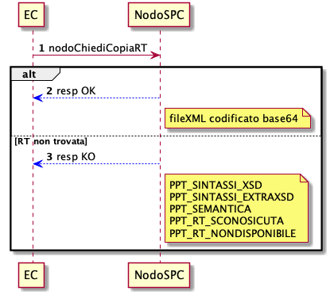
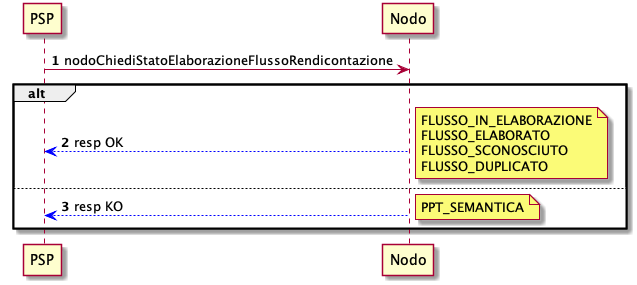
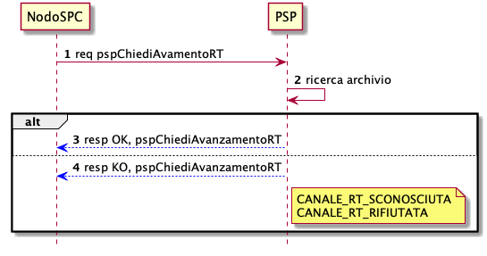

Funzioni e strategie di recupero
================================

Scenari, casi d’uso e attori
----------------------------

Le funzionalità ausiliarie disponibili all’interno del Sistema pagoPA
rappresentano funzionalità accessorie per la gestione dei processi
correlati alle operazioni di pagamento e possono essere utilizzate dagli
EC per il rientro da situazioni anomale o per le quali si renda
necessario il ripristino di situazioni precedenti.

Tali funzioni sono utilizzate anche dai PSP al fine di interrogare le
basi di dati messe a disposizione dal NodoSPC per l’esercizio del ciclo
di vita del pagamento. Si fa presente che le funzionalità ausiliarie
sono offerte dal NodoSPC attraverso interfacce SOAP consumabili dagli
attori coinvolti. A sua volta, anche il NodoSPC, in qualità di fruitore,
utilizza le funzionalità ausiliarie messe a disposizione dai PSP per la
verifica e gestione degli errori nei processi di pagamento.

|image0|

**Figura** **1: Rappresentazione degli erogatori e fruitori delle
funzionalità di supporto**

Funzioni Ausiliarie per L’Ente Creditore
----------------------------------------

Il paragrafo si focalizza sulle funzioni ausiliarie del NodoSPC, ovvero
quelle funzioni, dedicate all’EC, che permettono l’espletamento dei
processi correlati alle operazioni di pagamento e/o consentono la
risoluzione di eventuali situazioni anomale o il rientro a stati
preesistenti.

Richiesta della copia di una RT
~~~~~~~~~~~~~~~~~~~~~~~~~~~~~~~

L’EC ha facoltà di richiedere una copia della RT precedentemente
recapitata.

+-------+------------------------------------------------------------+
| Pre   | L’EC riscontra delle condizioni anomale sui pagamenti      |
| -Cond | effettuati dagli utilizzatori finali o riscontra la        |
| i     | perdita di una o più RT                                    |
| zione |                                                            |
+-------+------------------------------------------------------------+
| Tr    | Necessità di ripristino di una RT                          |
| igger |                                                            |
+-------+------------------------------------------------------------+
| Des   | L’EC sottomette la richiesta di ricevere una specifica RT  |
| crizi | precedentemente ricevuta                                   |
| one   |                                                            |
+-------+------------------------------------------------------------+
| Pos   | L’EC riceve la RT                                          |
| t-Con |                                                            |
| di    |                                                            |
| zione |                                                            |
+-------+------------------------------------------------------------+

**Tabella** **1: Richiesta della copia di una RT**

   |image1|

**Figura** **2: Richiesta della copia di una RT**

1. L’EC sottomette al NodoSPC la richiesta di ricevere una copia della
   RT mediante la primitiva *nodoChiediCopiaRT*;

2. La RT è correttamente trovata dal NodoSPC e restituita all’EC in
   allegato alla *response* positiva alla primitiva di cui al punto 1;

3. Il NodoSPC replica negativamente alla richiesta precedente fornendo
   response KO alla primitiva di cui al punto 1 emanando un *faultBean*
   il cui *faultBean.faultCode* è rappresentativo dell’errore
   riscontrato; in particolare:

   -  PPT_SINTASSI_XSD: nel caso di errore di validazione della
      richiesta
   -  PPT_SINTASSI_EXTRAXSD: nel caso di errore di validazione della
      SOAP request
   -  PPT_SEMANTICA: nel caso di errori semantici
   -  PPT_RT_SCONOSCIUTA: i parametri di input specificati nella
      richiesta non consentono di trovare alcuna RT
   -  PPT_RT_NONDOSPONIBILE: la RT richiesta non è disponibile.

Richiesta della Lista delle RPT Pendenti
~~~~~~~~~~~~~~~~~~~~~~~~~~~~~~~~~~~~~~~~

L’EC ha facoltà di domandare la lista delle RPT correttamente inviate al
PSP tramite il NodoSPC per le quali ancora non sono state ricevute le
RT.

+------------+-------------------------------------------------------+
| Pre        | L’EC ha sottomesso al NodoSPC un certo numero di RPT  |
| -Condizion | e non ha ricevuto le RT                               |
| e          |                                                       |
+------------+-------------------------------------------------------+
| Trigger    | Necessità di riconciliazione o chiusura delle         |
|            | posizioni pendenti                                    |
+------------+-------------------------------------------------------+
| D          | L’EC sottomette la richiesta di ricevere la lista     |
| escrizione | delle RPT pendenti                                    |
+------------+-------------------------------------------------------+
| Pos        | L’EC riceve la lista delle RPT                        |
| t-Condizio |                                                       |
| ne         |                                                       |
+------------+-------------------------------------------------------+

**Tabella** **2: Richiesta della Lista delle RPT Pendenti**

|image2|

**Figura** **3: Richiesta della Lista delle RPT Pendenti**

1. l’EC, mediante la primitiva *nodoChiediListaPendentiRPT* richiede al
   NodoSPC il numero e le RPT correttamente sottomesse ai PSP per le
   quali ancora non è stata ricevuta alcuna RT;

2. il NodoSPC replica con esito OK indicando il numero totale e le RPT
   pendenti consegnate al PSP scelto dall’Utilizzatore finale per le
   quali ancora non è stata consegnata al NodoSPC alcuna RT;

3. il NodoSPC replica con esito KO alla primitiva di cui al punto 1
   emanando un *faultBean* il cui *faultBean.faultCode* è
   rappresentativo dell’errore riscontrato; in particolare:

   -  PPT_SINTASSI_EXTRAXSD: nel caso di errori nella SOAP *request*
   -  PPT_SEMANTICA: nel caso di errori semantici.

Verifica dello stato di una RPT
~~~~~~~~~~~~~~~~~~~~~~~~~~~~~~~

+-------------+------------------------------------------------------+
| Pre         | L’EC ha sottomesso al NodoSPC una RPT                |
| -Condizione |                                                      |
+-------------+------------------------------------------------------+
| Trigger     | L’EC necessita di conoscere l’evoluzione temporale   |
|             | di una specifica RPT                                 |
+-------------+------------------------------------------------------+
| Descrizione | L’EC sottomette la richiesta di conoscere lo stato   |
|             | di una specifica RPT                                 |
+-------------+------------------------------------------------------+
| Pos         | L’EC riceve le informazioni inerenti lo stato della  |
| t-Condizion | RPT                                                  |
| e           |                                                      |
+-------------+------------------------------------------------------+

**Tabella** **3: Verifica dello stato di una RPT**

|image3|

**Figura** **4: Verifica dello stato di una RPT**

L’evoluzione temporale è la seguente:

1. l’EC richiede di conoscere lo stato di una RPT mediante la primitiva
   *nodoChiediStatoRPT.*

**Caso OK**

2. il NodoSPC replica positivamente alla primitiva di cui al punto 1
   fornendo nella *response* le informazioni peculiari per il
   tracciamento della RPT stessa; in particolare:

   -  *Redirect*: specifica se il pagamento prevede o meno una
      *redirect*
   -  *URL*: eventuale URL di *redirezione*
   -  *STATO*: stato della RPT
   -  *Descrizione*: descrizione dello stato della RPT
   -  *versamentiLista*: struttura contenente una lista di elementi che
      identificano gli stati assunti da ogni singolo versamento presente
      nella RPT da quando la RPT è stata ricevuta dal PSP. Ogni elemento
      della lista è costituito da:

      -  *progressivo*: numero del versamento nella RPT
      -  *data*: data relativa allo stato del versamento
      -  *stato*: stato della RPT alla data indicata
      -  *descrizione*: descrizione dello stato alla data

**Caso KO**

3. il NodoSPC fornisce esito KO alla primitiva di cui al punto 1
   emanando un *fault.Bean* il cui *faultBean.faultCode* è
   rappresentativo dell’errore riscontrato; in particolare:

   -  PPT_RPT_SCONOSCIUTA: la RPT di cui si chiede lo stato non è stata
      trovata
   -  PPT_SEMANTICA: nel caso di errori semantici
   -  PPT_SINTASSI_EXTRAXSD: Errore nella composizione della SOAP
      *request*

Richiesta Catalogo Dati Informativi
~~~~~~~~~~~~~~~~~~~~~~~~~~~~~~~~~~~

+--------+-----------------------------------------------------------+
| Pre    | n.a.                                                      |
| -Condi |                                                           |
| zione  |                                                           |
+--------+-----------------------------------------------------------+
| T      | L’EC necessita di conoscere il Catalogo Dati Informativi  |
| rigger | elaborato dal NodoSPC per verificare i servizi erogati    |
|        | dai PSP                                                   |
+--------+-----------------------------------------------------------+
| Des    | L’EC sottomette la richiesta di scaricare il Catalogo     |
| crizio | Dati Informativi messo a disposizione dal NodoSPC         |
| ne     |                                                           |
+--------+-----------------------------------------------------------+
| Pos    | L’EC riceve il Catalogo Dati Informativi                  |
| t-Cond |                                                           |
| izione |                                                           |
+--------+-----------------------------------------------------------+

**Tabella** **4: Richiesta Catalogo Dati Informativi**

|image4|

**Figura** **5: Richiesta Catalogo Dati Informativi**

L’evoluzione temporale è la seguente:

1. l’EC richiede al NodoSPC il Catalogo Dati Informativi mediante la
   primitiva *nodoChiediInformativaPSP;*

2. il NodoSPC replica all’invocazione precedente fornendo *response* OK
   ed il file XML relativo al Catalogo Dati Informativi dei PSP
   codificato in Base64;

3. il NodoSPC replica negativamente alla richiesta di cui al punto 1
   emanando un *faultBean* il cui *faultBean*.\ *faultCode* è
   rappresentativo dell’errore riscontrato; in particolare:

   -  PPT_SINTASSI_EXTRAXSD: Errore nella SOAP *request*
   -  PPT_SEMANTICA: Errore semantico
   -  PPT_INFORMATIVAPSP_PRESENTE: il NodoSPC ha già depositato il file
      XML richiesto nella directory assegnata all’EC sulla componente
      SFTP_NodSPC
   -  PPT_SYSTEM_ERROR: errore nella generazione del file XML richiesto.

Funzioni ausiliarie per il PSP
------------------------------

Richiesta del Catalogo dei Servizi
~~~~~~~~~~~~~~~~~~~~~~~~~~~~~~~~~~

Il PSP interroga la base di dati del NodoSPC al fine di scaricare
l’ultima versione del Catalogo dei Servizi offerti dagli EC, da
utilizzare nell’ambito del Pagamento Spontaneo presso i PSP.

+----------------------------------+----------------------------------+
| Pre-Condizione                   | Il PSP decide di supportare i    |
|                                  | pagamenti spontanei pressi i     |
|                                  | propri sportelli                 |
+----------------------------------+----------------------------------+
| Trigger                          | Necessità di conoscere i servizi |
|                                  | offerti dalle PA                 |
+----------------------------------+----------------------------------+
| Descrizione                      | Il PSP sottomette la richiesta   |
|                                  | di ricevere il file XML Catalogo |
|                                  | dei Servizi attestante i servizi |
|                                  | offerti dagli EC o da uno        |
|                                  | specifico Ente                   |
+----------------------------------+----------------------------------+
| Post-Condizione                  | Il PSP riceve il Catalogo dei    |
|                                  | Servizi degli EC                 |
+----------------------------------+----------------------------------+

**Tabella** **5: Richiesta del Catalogo dei Servizi**

|image5|

**Figura** **6: Richiesta del Catalogo dei Servizi**

1. il PSP richiede al NodoSPC di ricevere il Catalogo dei Servizi
   offerto dagli EC mediante la primitiva *nodoChiediCatalogoServizi;*

2. il NodoSPC replica con *response* OK fornendo il tracciato XML del
   Catalogo dei Servizi codificato in Base64;

3. Il NodoSPC replica con *response* KO emanando un *faultBean* il cui
   *faultBean*.\ *faultCode* è PPT_SINTASSI_EXTRAXSD.

Richiesta template del Catalogo Dati Informativi
~~~~~~~~~~~~~~~~~~~~~~~~~~~~~~~~~~~~~~~~~~~~~~~~

Il PSP ha facoltà di richiedere al NodoSPC l’ultima versione del
Catalogo Dati Informativi comunicato per motivazioni di verifica o
aggiornamenti

+----------+---------------------------------------------------------+
| Pre      | Il PSP ha (o meno) precedentemente comunicato al Nodo   |
| -Condizi | il Catalogo Dati Informativi                            |
| one      |                                                         |
+----------+---------------------------------------------------------+
| Trigger  | Necessità del PSP di aggiornare il proprio Catalogo     |
+----------+---------------------------------------------------------+
| Des      | Il PSP sottomette la richiesta di ricevere il file XML  |
| crizione | attestante l’ultimo Catalogo Dati inviato               |
+----------+---------------------------------------------------------+
| Pos      | Il PSP riceve il Catalogo Dati Informativi di propria   |
| t-Condiz | competenza (o il *template*)                            |
| ione     |                                                         |
+----------+---------------------------------------------------------+

**Tabella** **6: Richiesta template del Catalogo Dati Informativi**

|image6|

**Figura** **7: Richiesta template del Catalogo Dati Informativi**

1. il PSP richiede al NodoSPC, attraverso la primitiva
   *nodoChiediTemplateInformativaPSP,* l’ultima versione del Catalogo
   Dati Informativi precedentemente inviato;

2. il PSP riceve *response* OK ed il file XML del Catalogo Dati
   Informativi in formato Base64 precedentemente inviato;

3. il PSP riceve *response* OK e solo il *template* del Catalogo Dati
   Informativi;

4. il PSP riceve *response KO* emanando un *faultBean* il cui
   *faultBean*.\ *faultCode* è PPT_SINTASSI_EXTRAXSD.

Richiesta informativa PA
~~~~~~~~~~~~~~~~~~~~~~~~

+---------+----------------------------------------------------------+
| Pre     | L’EC ha sottomesso al Nodo la Tabella delle Controparti  |
| -Condiz |                                                          |
| ione    |                                                          |
+---------+----------------------------------------------------------+
| Trigger | Il PSP necessita di conoscere la disponibilità dei       |
|         | servizi offerti dagli EC e i dati ad essi correlati      |
+---------+----------------------------------------------------------+
| Des     | Il PSP sottomette al NodoSPC la richiesta della Tabella  |
| crizion | delle Controparti                                        |
| e       |                                                          |
+---------+----------------------------------------------------------+
| Pos     | Il PSP riceve dal Nodo la Tabella delle Controparti      |
| t-Condi |                                                          |
| zione   |                                                          |
+---------+----------------------------------------------------------+

**Tabella** **7: Richiesta informativa PA**

|image7|

**Figura** **8: Richiesta informativa PA**

1. il PSP, mediante la primitiva *nodoChiediInformativaPA,* richiede al
   NodoSPC la Tabella delle Controparti degli EC.

2. il NodoSPC replica con esito OK fornendo in output il documento XML
   codificato in Base64 rappresentante la Tabella delle Controparti
   degli EC;

3. il NodoSPC replica con esito KO emanando un *faultBean* il cui
   *faultBean*.\ *faultCode* è PPT_SINTASSI_EXTRAXSD.

Richiesta Stato Elaborazione Flusso di Rendicontazione
~~~~~~~~~~~~~~~~~~~~~~~~~~~~~~~~~~~~~~~~~~~~~~~~~~~~~~

+-------+------------------------------------------------------------+
| Pre   | Il PSP ha sottomesso un file XML di rendicontazione al     |
| -Cond | NodoSPC (mediante SOAP *request* o componente              |
| i     | SFTP_NodoSPC)                                              |
| zione |                                                            |
+-------+------------------------------------------------------------+
| Tr    | Il PSP necessita di conoscere lo stato di elaborazione del |
| igger | file XML di rendicontazione                                |
+-------+------------------------------------------------------------+
| Des   | Il PSP sottomette la richiesta passando come parametro di  |
| crizi | input *l’identificativoFlusso* del flusso di               |
| one   | rendicontazione inviato                                    |
+-------+------------------------------------------------------------+
| Pos   | Il NodoSPC replica fornendo lo stato di elaborazione del   |
| t-Con | flusso di rendicontazione                                  |
| di    |                                                            |
| zione |                                                            |
+-------+------------------------------------------------------------+

**Tabella** **8: Richiesta Stato Elaborazione Flusso di
Rendicontazione**

|image8|

**Figura** **9: Richiesta Stato Elaborazione Flusso di Rendicontazione**

1. il PSP, attraverso la primitiva
   *nodoChiediStatoFlussoRendicontazione*, sottomette al NodoSPC la
   richiesta di conoscere lo stato di elaborazione di un flusso XML di
   rendicontazione precedentemente inviato valorizzando il parametro di
   input *identificaficativoFlusso*

**Caso OK**

2. il NodoSPC replica positivamente alla primitiva precedente fornendo
   lo stato di elaborazione del flusso XML; in particolare:

   a. FLUSSO_IN_ELABORAZIONE: il flusso XML è in fase di
      elaborazione/storicizzazione sulle basi di dati del NodoSPC
   b. FLUSSO_ELABORATO: Il flusso è stato correttamente elaborato e
      storicizzato dal NodoSPC
   c. FLUSSO_SCONOSCIUTO: il Nodo non conosce il flusso richiesto
   d. FLUSSO_DUPLICATO: il Nodo rileva che il flusso inviato è già stato
      sottomesso.

**Caso KO**

3. Il NodoSPC il NodoSPC replica con esito KO emanando un *faultBean* il
   cui *faultBean*.\ *faultCode* è PPT_SEMANTICA.

Strategie di *retry* per il recapito della RT
~~~~~~~~~~~~~~~~~~~~~~~~~~~~~~~~~~~~~~~~~~~~~

+-----------------------------------+-----------------------------------+
| Pre-Condizione                    | Il pagamento è nello stato RT-PSP |
+-----------------------------------+-----------------------------------+
| Trigger                           | Il PSP ha tentato l’invio di una  |
|                                   | RT e                              |
|                                   |                                   |
|                                   | -  il NodoSPC ha replicato        |
|                                   |    mediante *response* KO         |
|                                   |    emanando un *faultBean* il cui |
|                                   |    *faultBean.faultCode* è pari a |
|                                   |    PPT_STAZIONE_INT_PA_TIMEOUT    |
|                                   |    oppure                         |
|                                   |    PPT_STAZIONE_INT_PA_IRRAGGIU   |
|                                   |    NGIBILE                        |
|                                   |                                   |
|                                   | oppure                            |
|                                   |                                   |
|                                   | -  non ha ricevuto risposta entro |
|                                   |    i termini previsti             |
+-----------------------------------+-----------------------------------+
| Descrizione                       | Il PSP esegue fino a cinque       |
|                                   | tentativi di invio della RT in    |
|                                   | modalità PUSH attendendo          |
|                                   | intervalli di tempo crescenti.    |
|                                   |                                   |
|                                   | Se l’esecuzione di tutti i        |
|                                   | tentativi di invio non ha esito   |
|                                   | positivo, pone la RT nella coda   |
|                                   | PULL                              |
+-----------------------------------+-----------------------------------+
| Post-Condizione                   | Al termine della procedura il     |
|                                   | pagamento transisce nello stato   |
|                                   | RT_EC                             |
+-----------------------------------+-----------------------------------+

**Tabella** **9: Strategie di retry per il recapito della RT**

|image9|

**Figura** **10: meccanismi di recovery per RT PUSH**

1. Il PSP sottomette al NodoSPC la RT attraverso la primitiva
   *nodoInviaRT*:

Si possono presentare i seguenti due scenari alternativi:

**EC indisponibile**

2. Il NodoSPC replica emanando un *faultBean* il cui
   *faultBean.faultCode* è pari a: PPT_STAZIONE_INT_PA_TIMEOUT
   (indisponibilità funzionale della controparte) oppure
   PPT_STAZIONE_INT_PA_IRRAGGIUNGIBILE (mancata raggiungibilità della
   controparte); il PSP pone la RT nella coda PULL.

*NB: nel caso di indisponibilità funzionale della controparte, per
gestire l’eventualità di interruzione del servizio di breve durata, il
PSP ha facoltà di reiterare l’invio della RT in modalità PUSH.*

**Nodo non disponibile**

3. Il PSP non riceve alcuna risposta alla primitiva di cui al punto 1
4. Il PSP ritenta nuovamente l’invio della RT in modalità PUSH per un
   massimo di ulteriori cinque tentativi di recupero, attenendosi alla
   seguente schedulazione:

=========================== ====================
**# Tentativo di recupero** **Attesa (secondi)**
=========================== ====================
1                           5
2                           10
3                           20
4                           40
5                           80
=========================== ====================

Si possono presentare i seguenti due scenari alternativi:

**Response ad uno dei tentativi di recupero**

5. Il PSP riceve la *response*, termina qualsiasi attività di recupero
   della RT

**Esaurimento dei tentativi di recupero**

6. Il PSP non riceve alcuna *response* nei tempi previsti
   all’invocazione di cui al punto 4
7. Il PSP colloca la RT nella coda PULL terminando le azioni di recupero

**Processo di recupero RT in modalità PULL**

8.  Il NodoSPC, mediante la SOAP *request* *pspChiediListaRT* chiede al
    PSP la lista delle RT da recuperare
9.  Il PSP replica alla primitiva di cui al punto precedente fornendo
    *response* OK e la lista delle RT da prelevare
10. Il NodoSPC preleva la RT mediante la primitiva *pspChiediRT*
11. Il PSP replica con *response* OK fornendo al RT richiesta
12. Il NodoSPC valida la RT prelevata precedentemente

Si possono presentare i seguenti due scenari alternativi:

**In caso di RT corretta**

13. Il NodoSPC invia conferma al PSP dell’avvenuta ricezione della RT
    mediante la primitiva *pspInviaAckRT*. Il messaggio di ackRT
    riporterà nel dato *statoMessaggioReferenziato* il valore ACTC.
14. Il PSP elimina la RT dalla coda PULL
15. Il PSP replica fornendo esito OK alla primitiva di cui al punto 14.

**In caso di RT non corretta**

16. Il NodoSPC notifica al PSP il rifiuto della RT mediante la primitiva
    *pspInviaAckRT*. Il messaggio di *ackRT* riporterà nel dato
    *statoMessaggioReferenziato* il valore RJCT.
17. Il PSP replica fornendo esito OK alla primitiva di cui al punto
    precedente

Funzioni Ausiliarie per il NodoSPC
----------------------------------

Richiesta avanzamento RPT
~~~~~~~~~~~~~~~~~~~~~~~~~

+----------+---------------------------------------------------------+
| Pre      | Il NodoSPC ha sottomesso una RPT o un carrello di RPT   |
| -Condizi | al PSP                                                  |
| one      |                                                         |
+----------+---------------------------------------------------------+
| Trigger  | Il NodoSPC necessita di verificare lo stato di          |
|          | avanzamento di una RTP o di un                          |
+----------+---------------------------------------------------------+
| Des      | Il NodoSPC sottomette la richiesta di ricevere lo stato |
| crizione | di una RPT o di un carrello di RPT                      |
+----------+---------------------------------------------------------+
| Pos      | Il NodoSPC riceve lo stato della RPT o del carrello di  |
| t-Condiz | RPT                                                     |
| ione     |                                                         |
+----------+---------------------------------------------------------+

**Tabella** **10: Richiesta avanzamento RPT**

|image10|

**Figura** **11: Richiesta avanzamento RPT**

1. il NodoSPC, mediante la primitiva *pspChiediAvanzamentoRPT,* richiede
   al PSP informazioni in merito allo stato di avanzamento di una RPT o
   di un carrello di RPT.

**Caso OK**

2. il PSP replica con esito OK fornendo lo stato della RPT o del
   carrello di RPT;

**Caso KO**

3. il PSP replica con esito KO emanando un *faultBean* il cui
   *faultBean*.\ *faultCode* è rappresentativo dell’errore riscontrato;
   in particolare:

   -  CANALE_RPT_SCONOSCIUTA: non è possibile trovare la RPT o il
      carrello di RPT per cui si richiede lo stato di elaborazione
   -  CANALE \_RPT_RIFIUTATA: la RPT o il carrello di RPT sottomessi dal
      NodoSPC sono stati rifiutati dal PSP.

Richiesta di avanzamento RT
~~~~~~~~~~~~~~~~~~~~~~~~~~~

+-------+------------------------------------------------------------+
| Pre   | Il NodoSPC verifica lo stato avanzamento di una RT         |
| -Cond |                                                            |
| i     |                                                            |
| zione |                                                            |
+-------+------------------------------------------------------------+
| Tr    | Il NodoSPC necessita di verificare lo stato di avanzamento |
| igger | della produzione della RT associata ad una RPT o a un      |
|       | carrello di RPT                                            |
+-------+------------------------------------------------------------+
| Des   | Il NodoSPC sottomette la richiesta di ricevere lo stato di |
| crizi | una RT                                                     |
| one   |                                                            |
+-------+------------------------------------------------------------+
| Pos   | Il NodoSPC riceve lo stato della RT                        |
| t-Con |                                                            |
| di    |                                                            |
| zione |                                                            |
+-------+------------------------------------------------------------+

**Tabella** **11: Richiesta di avanzamento RT**

|image11|

**Figura** **12: Richiesta di avanzamento RT**

1. il NodoSPC, mediante la primitiva *pspChiediAvanzamentoRT,* richiede
   al PSP informazioni in merito allo stato di avanzamento della RT;

2. Il PSP ricerca la RT nel proprio archivio;

3. il PSP replica con esito OK fornendo lo stato della RT, specificando
   eventualmente il tempo richiesto per la sua generazione ed invio;

4. il PSP replica con esito KO emanando un *faultBean* il cui
   *faultBean.faultCode* è rappresentativo dell’errore riscontrato; in
   particolare:

   -  CANALE_RT_SCONOSCIUTA: non è stata trovata la RT per la quale si
      richiede di conoscere lo stato di avanzamento
   -  CANALE_RT_RIFIUTATA_EC: la RT è stata rifiutata dall’EC.

.. |image0| image:: ../diagrams/uc_funzioni_recupero.png

.. |image6| image:: ../diagrams/sdd_nodoChiediTemplateInformativaPSP.png
.. |image7| image:: ../diagrams/sdd_nodoChiediInformativaPA.png

