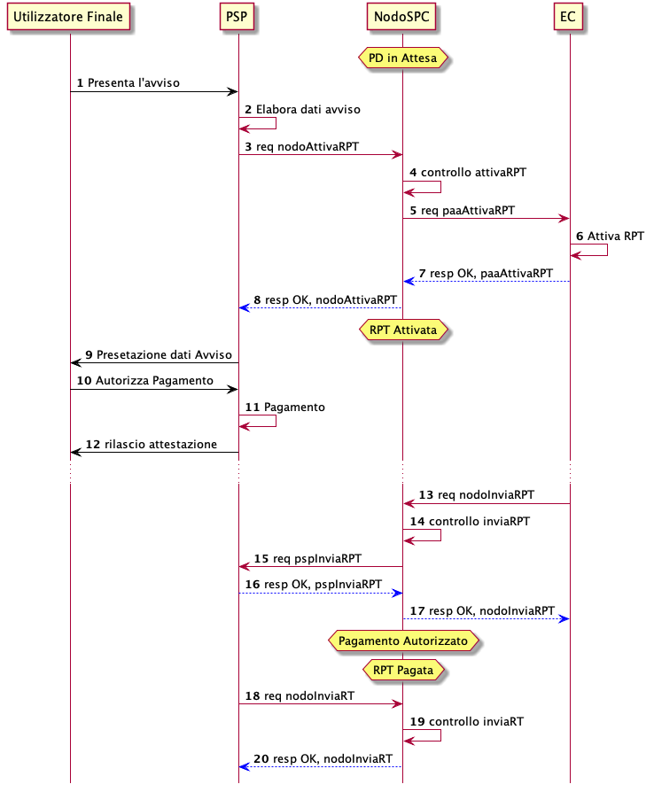

Pagamento presso il PSP
=======================

Attori e casi d’uso
-------------------

All’interno di questo capitolo vengono descritti i casi d’uso relativi
ai possibili processi di pagamento da parte di un Utilizzatore finale,
attraverso uno dei canali messi a disposizione da un PSP, mediante la
presentazione di un Avviso di Pagamento notificatogli da un EC. L’Avviso
di pagamento predisposto dall’EC dove essere conforme a quanto previsto
nel documento “Il nuovo avviso di pagamento analogico nel sistema pagoPA
Versione 2.2.1 - Dicembre 2018”.

Gli attori coinvolti sono i seguenti:

-  **PSP**: rappresenta un canale (fisico o digitale) che offre un
   servizio di pagamento all’Utilizzatore finale.
-  **Ente Erogatore**: soggetto che si incarica di abilitare all’interno
   del sistema pagoPA uno o più servizi di pagamento spontaneo.
-  **Ente Creditore**: rappresenta un soggetto aderente a pagoPA in
   grado di gestire i pagamenti attivati presso i PSP predisponendo e
   notificando (per mezzo cartaceo o digitale) agli utilizzatori finali
   un avviso di pagamento. Interagisce inoltre con l’Ente Erogatore per
   la gestione del caso di pagamento spontaneo
-  **Utilizzatore Finale**, rappresenta una persona fisica e/o giuridica
   che interagisce con uno dei canali messi a disposizione dal PSP al
   fine di pagare un servizio anche senza disporre di un avviso di
   pagamento.

Gli scenari di utilizzo sono descritti dai seguenti casi d’uso nominali:

-  **Pagamento mediante Avviso (scenario principale)**: l’Utilizzatore
   finale utilizza un canale (fisico o digitale) messo a disposizione da
   un PSP presentando un Avviso di Pagamento. Il pagamento viene
   perfezionato a valle della ricezione della RPT da parte del PSP.
-  **Pagamento mediante Avviso (scenario alternativo)**: l’Utilizzatore
   finale utilizza un canale (fisico o digitale) messo a disposizione da
   un PSP presentando un Avviso di Pagamento. Il pagamento viene
   effettuato a valle della verifica della correttezza dell’avviso ma
   prima della richiesta di attivazione della RPT da parte del PSP.
-  **Pagamento spontaneo presso il PSP:** l’Utilizzatore finale utilizza
   un canale (fisico o digitale) predisposto dal PSP per innescare il
   pagamento spontaneo di un servizio messo a disposizione da un Ente
   Erogatore. In tale scenario potrebbe non esistere alcuna posizione
   debitoria pre-esistente all’interno degli archivi di pagamento in
   attesa dell’EC.

Pagamento mediante Avviso (scenario principale)
-----------------------------------------------

+-----------------------------------+-----------------------------------+
| Pre-condizioni                    | L’Utilizzatore finale è in        |
|                                   | possesso di un Avviso di          |
|                                   | Pagamento notificato dall’EC.     |
+-----------------------------------+-----------------------------------+
| Trigger                           | L’Utilizzatore finale si presenta |
|                                   | presso uno dei canali messi a     |
|                                   | disposizione dal PSP (ad esempio  |
|                                   | sportello fisico, ATM, Home       |
|                                   | Banking, *mobile app*, etc.) con  |
|                                   | l’Avviso di Pagamento.            |
+-----------------------------------+-----------------------------------+
| Descrizione                       | -  Il PSP acquisisce le           |
|                                   |    informazioni contenute         |
|                                   |    nell’avviso tramite la lettura |
|                                   |    di uno degli elementi grafici  |
|                                   |    presenti (QR-Code / Data       |
|                                   |    matrix). Deve comunque essere  |
|                                   |    reso possibile l’inserimento   |
|                                   |    manuale degli stessi dati.     |
|                                   | -  Il PSP, tramite il NodoSPC,    |
|                                   |    richiede l’attivazione del     |
|                                   |    pagamento descritto            |
|                                   |    all’interno dell’avviso di     |
|                                   |    pagamento. Tale operazione     |
|                                   |    verifica la sussistenza della  |
|                                   |    posizione debitoria collegata  |
|                                   |    all’avviso di pagamento e      |
|                                   |    determina l’importo del        |
|                                   |    versamento richiesto dall’EC.  |
|                                   |    Nel caso in cui l’importo      |
|                                   |    recuperato con tale operazione |
|                                   |    prevale sul dato presente      |
|                                   |    nell’Avviso di Pagamento.      |
|                                   | -  Il PSP riceve, tramite il      |
|                                   |    NodoSPC, la relativa richiesta |
|                                   |    di pagamento telematico (RPT). |
|                                   | -  l’Utilizzatore finale,         |
|                                   |    consapevole degli eventuali    |
|                                   |    differenze rispetto ai dati    |
|                                   |    riportati sull’avviso,         |
|                                   |    autorizza il pagamento con le  |
|                                   |    modalità previste dal canale   |
|                                   |    PSP.                           |
|                                   | -  Il PSP rilascia l’attestazione |
|                                   |    di pagamento all’Utilizzatore  |
|                                   |    finale.                        |
|                                   | -  Il PSP, tramite il NodoSPC,    |
|                                   |    invia la ricevuta telematica   |
|                                   |    con esito positivo             |
+-----------------------------------+-----------------------------------+
| Post-Condizione                   | Al termine del caso d’uso il      |
|                                   | pagamento risulta completato con  |
|                                   | lo stato *RT EC*.                 |
+-----------------------------------+-----------------------------------+

|image0|

**Figura** **1: Pagamento mediante Avviso**

1. l’Utilizzatore finale presenta un avviso di pagamento presso uno dei
   canali messi a disposizione dal PSP;
2. il PSP acquisisce le informazioni contenute dall’avviso di pagamento
   tramite lettura del codice QR-Code (ISO 18004). La lettura del
   QR-Code riporta una stringa composta dalla concatenazione dei
   seguenti campi.

+-------------+------------------------------------------------------+
| Dato        | Contenuto                                            |
+-------------+------------------------------------------------------+
| **Numero    | Contiene il Numero Avviso la cui formattazione è     |
| Avviso**    | descritta nell’Allegato A alle Linee Guida           |
+-------------+------------------------------------------------------+
| **I         | Contiene l’\ *idDominio* dell’Ente Creditore che     |
| dentificati | corrisponde al Codice fiscale dell’Ente Creditore    |
| vo Ente**   |                                                      |
+-------------+------------------------------------------------------+
| **Importo** | Importo del pagamento espresso in centesimi di euro  |
+-------------+------------------------------------------------------+

Nel caso che la lettura ottica dei codici non sia prevista, o possibile,
le stesse informazioni sono imputate in maniera manuale o dall’operatore
PSP allo sportello o dall’Utilizzatore finale attraverso *user
interface* messe a disposizione dal PSP.

3. il PSP richiede, attraverso la primitiva *nodoAttivaRPT,*
   l’attivazione del pagamento per la posizione debitoria collegata
   all’avviso di pagamento. Al fine di completare la richiesta, il campo
   *codificaInfrastruttura* e la struttura *codIdRPT* dovranno essere
   così valorizzati:

+-------------+--------------------------------------------------------+
| co          | Assume il valore fisso: “QR-CODE”                      |
| dificaInfra |                                                        |
| s           |                                                        |
| trutturaPSP |                                                        |
+-------------+--------------------------------------------------------+
| codIdRPT    | Struttura dati composta da:                            |
+-------------+--------------------------------------------------------+
| CF          |    Codice Fiscale dell’Ente Creditore, valore del      |
|             |    campo Identificativo Ente, letto tramite QR-Code.   |
+-------------+--------------------------------------------------------+
| CodStazPA   |    Contiene il valore dell’\ *application code* o      |
|             |    *codice segregazione* estratto dal numero di avviso |
|             |    (se presente)                                       |
+-------------+--------------------------------------------------------+
| AuxDigit    |    Contiene il codice aux-digit estratto dal numero    |
|             |    avviso                                              |
+-------------+--------------------------------------------------------+
| CodIUV      |    Identificativo Univoco Versamento estratto dal      |
|             |    Numero di Avviso                                    |
+-------------+--------------------------------------------------------+

4. il Nodo effettua i controlli semantici e sintattici;
5. il NodoSPC provvede ad instradare la richiesta di attivazione all’EC
   che ha emesso l’avviso, tramite la chiamata *paaAttivaRPT*.
6. l’EC verifica le informazioni relative all’avviso e lo stato del
   pagamento. In caso di esito positivo, l’EC imposta lo stato del
   pagamento in IN_PAGAMENTO e genera una RPT che verrà successivamente
   inviata al NodoSPC tramite la primitiva *nodoInviaRPT*.
7. l’EC fornisce al NodoSPC l’esito dell’attivazione del pagamento
   restituendo le seguenti informazioni:

-  Importo del versamento (*ImportoSingoloVersamento*)
-  IBAN del conto corrente da accreditare (*IBANAccredito*)
-  Ente Creditore (*enteBeneficiario*)
-  Descrizione del Versamento (*causaleVersamento*)

8.  il NodoSPC inoltra le informazioni in risposta al PSP che ha
    effettuato la richiesta.
9.  il PSP riporta il risultato dell’operazione di attivazione
    all’Utilizzatore finale evidenziando il dettaglio dell’importo da
    pagare e la descrizione del versamento;
10. l’Utilizzatore finale autorizza il pagamento con le modalità proprie
    del canale utilizzato;
11. il PSP, a seguito dell’autorizzazione da parte dell’Utilizzatore
    finale, effettua il pagamento.
12. Il PSP, a seguito dell’avvenuto pagamento, rilascia all’Utilizzatore
    finale un attestato di pagamento
13. l’EC genera, a fronte della precedente richiesta di attivazione, una
    RPT valorizzata specificando il PSP indicato nella chiamata
    *nodoAttivaRPT*, in particolare:

    -  il parametro *IdentificativoPSP* deve essere valorizzato al pari
       del medesimo campo ricevuto dal messaggio *paaAttivaRPT;*
    -  il parametro *codiceContestoPagamento* deve essere valorizzato al
       pari del medesimo campo ricevuto dal messaggio *paaAttivaRPT*;
    -  la RPT deve contenere il campo *TipoVersamento* pari al valore
       “PO” che indica un pagamento iniziato presso il PSP;

14. il NodoSPC effettua controlli semantici e sintattici della richiesta
    pervenuta.
15. il NodoSPC risponde alla RPT generata;
16. il Nodo instrada la richiesta di pagamento ricevuta verso il PSP
    indicato all’interno della RPT
17. alla ricezione della *pspInviaRPT*, il PSP verifica l’univocità e la
    correttezza formale della RPT comunicando, tramite la *response*
    positiva, la presa in carico della richiesta di pagamento.
18. in merito all’operazione di pagamento, il PSP compone la RT e la
    invia al NodoSPC;
19. il NodoSPC effettua controlli semantici e sintattici della richiesta
    pervenuta;
20. il NodoSPC instrada la RT all’EC;
21. l’EC, ricevuta la RT, procede ad aggiornare l’Archivio dei Pagamenti
    in Attesa, lo stato del pagamento viene modificato in PAGATO;
22. l’EC notifica l’avvenuta ricezione della RT al NodoSPC;
23. il NodoSPC notifica al PSP la ricezione dell’RT da parte dell’EC.

Pagamento mediante Avviso (scenario alternativo) DEPRECATO
----------------------------------------------------------

+-----------------------------------+-----------------------------------+
| Pre-condizioni                    | L’Utilizzatore finale è in        |
|                                   | possesso di un Avviso di          |
|                                   | Pagamento.                        |
+-----------------------------------+-----------------------------------+
| Trigger                           | L’Utilizzatore finale si presenta |
|                                   | presso uno dei canali messi a     |
|                                   | disposizione del PSP (ad esempio  |
|                                   | sportello fisico, punti di        |
|                                   | presenza, ATM, Home Banking,      |
|                                   | *mobile app*, etc.) con l’Avviso  |
|                                   | di Pagamento.                     |
+-----------------------------------+-----------------------------------+
| Descrizione                       | In questo scenario il PSP decide  |
|                                   | di effettuare il pagamento dopo   |
|                                   | aver verificato l’Avviso di       |
|                                   | Pagamento, ma senza aver mai      |
|                                   | ricevuto alcuna RPT da parte      |
|                                   | dell’EC.                          |
|                                   |                                   |
|                                   | -  Il PSP acquisisce le           |
|                                   |    informazioni contenute         |
|                                   |    nell’avviso tramite la lettura |
|                                   |    di uno degli elementi grafici  |
|                                   |    presenti (QR-Code / Data       |
|                                   |    matrix). Deve comunque essere  |
|                                   |    reso possibile l’inserimento   |
|                                   |    manuale degli stessi dati.     |
|                                   | -  Il PSP, tramite il NodoSPC,    |
|                                   |    verifica la sussistenza della  |
|                                   |    posizione debitoria collegata  |
|                                   |    all’avviso di pagamento e      |
|                                   |    determina l’importo del        |
|                                   |    versamento richiesto dall’EC.  |
|                                   | -  L’Utilizzatore finale,         |
|                                   |    consapevole degli eventuali    |
|                                   |    differenze rispetto ai dati    |
|                                   |    riportati sull’avviso,         |
|                                   |    autorizza il pagamento con le  |
|                                   |    modalità previste dal canale   |
|                                   |    PSP.                           |
|                                   | -  Il PSP rilascia l’attestazione |
|                                   |    di pagamento all’Utilizzatore  |
|                                   |    finale.                        |
|                                   | -  Il PSP, tramite il NodoSPC,    |
|                                   |    richiede l’attivazione della   |
|                                   |    RPT relativa all’avviso di     |
|                                   |    pagamento.                     |
|                                   | -  Il PSP riceve, tramite il      |
|                                   |    NodoSPC, la relativa richiesta |
|                                   |    di pagamento telematico (RPT). |
|                                   |                                   |
|                                   | Il PSP, tramite il NodoSPC, invia |
|                                   | all’EC la relativa ricevuta       |
|                                   | telematica con esito positivo.    |
+-----------------------------------+-----------------------------------+
| Post-Condizione                   | Al termine del caso d’uso il      |
|                                   | pagamento risulta completato con  |
|                                   | lo stato RT EC.                   |
+-----------------------------------+-----------------------------------+

|image1|

**Figura** **2: Diagramma di sequenza del pagamento con avviso di
pagamento ( scenario alternativo)**

1. l’Utilizzatore finale presenta un avviso di pagamento (di cui al
   documento “L’avviso di Pagamento Analogico nel Sistema pagoPA”,
   pubblicato sul sito istituzionale dell’Agenzia) presso uno dei canali
   messi a disposizione dal PSP;
2. il PSP acquisisce le informazioni contenute dall’avviso di pagamento
   tramite lettura del codice QR-Code (ISO 18004). La lettura del
   QR-Code riporta una stringa composta dalla concatenazione dei
   seguenti campi.

+-----------+--------------------------------------------------------+
| **Dato**  | **Contenuto**                                          |
+===========+========================================================+
| Numero    | Contiene il Numero Avviso la cui formattazione è       |
| Avviso    | descritta nell’Allegato A alle Linee Guida             |
+-----------+--------------------------------------------------------+
| Ide       | Contiene l’\ *idDominio* dell’Ente Creditore che       |
| ntificati | corrisponde al Codice fiscale dell’Ente Creditore      |
| vo Ente   |                                                        |
+-----------+--------------------------------------------------------+
| Importo   | Importo del pagamento espresso in centesimi di euro    |
+-----------+--------------------------------------------------------+

Nel caso che la lettura ottica dei codici non sia prevista o possibile
le stesse informazioni sono imputate in maniera manuale o dall’operatore
PSP allo sportello o dall’utilizzatore finale attraverso *user
interface* messe a disposizione dal PSP.

3. una volta acquisite le informazioni necessarie, il PSP richiede
   attraverso la primitiva *nodoVerificaRPT* i dettagli del pagamento
   per la posizione debitoria collegata all’avviso di pagamento. Al fine
   di completare la richiesta, il campo *codificaInfrastruttura* e la
   struttura *codIdRPT* dovranno essere così valorizzati:

+---------------+------------------------------------------------------+
|               | Assume il valore fisso: “QR-CODE”.                   |
| codificaInfra |                                                      |
|               |                                                      |
|  strutturaPSP |                                                      |
+---------------+------------------------------------------------------+
|    codIdRPT   | Struttura dati composta da                           |
+---------------+------------------------------------------------------+
|    CF         | Codice Fiscale dell’Ente Creditore, valore del campo |
|               |                                                      |
|               | Identificativo Ente, letto tramite QR-Code.          |
+---------------+------------------------------------------------------+
|    CodStazPA  | Contiene il valore dell’\ *aplication code* o        |
|               | *codice segregazione* estratto dal numero di avviso  |
|               | ( se presenti)                                       |
+---------------+------------------------------------------------------+
|    AuxDigit   | Contiene il codice aux-digit estratto dal numero     |
|               | avviso                                               |
+---------------+------------------------------------------------------+
|    CodIUV     | Identificativo Univoco Versamento estratto dal       |
|               | Numero di Avviso                                     |
+---------------+------------------------------------------------------+

4.  il Nodo effettua i controlli semantici e sintattici;
5.  superati i controlli, il NodoSPC provvede ad instradare la richiesta
    all’EC che ha emesso l’avviso tramite la chiamata *paaVerificaRPT*
    riempita con le informazioni contenute nella *nodoVerificaRPT*.
6.  alla ricezione della chiamata *paaVerificaRPT*, l’EC ricerca
    all’interno del proprio Archivio dei Pagamenti in Attesa (APA) la
    posizione debitoria utilizzando come chiave di ricerca lo IUV ed il
    CCP contenuto all’interno dei parametri della primitiva e
    verificandone le informazioni e lo stato del pagamento.
7.  l’EC fornisce al NodoSPC l’esito della ricerca aggiornando le
    informazioni relative all’avviso di pagamento, specificando:

    -  Importo del versamento (*ImportoSingoloVersamento*)
    -  IBAN del conto corrente (*IBANAccredito*)
    -  identificativo della banca (opzionale, *bicAccredito*)
    -  Ente Creditore (*enteBeneficiario*)
    -  Dettagli del soggetto pagatore (*credenzialiPagatore*)
    -  Descrizione del versamento (*causaleVersamento*)

8.  il NodoSPC inoltra la risposta al PSP che ha effettuato la
    richiesta.
9.  il PSP riporta il risultato dell’operazione all’Utilizzatore finale;
10. l’Utilizzatore finale autorizza il pagamento;
11. il PSP, procede al pagamento del servizio identificato dall’Avviso
    di Pagamento.
12. Il PSP rilascia l’attestazione del pagamento all’Utilizzatore
    finale.
13. il PSP richiede al NodoSPC l’inoltro all’Ente Creditore della RPT.
    La primitiva *nodoAttivaRPT* sarà composta utilizzando i valori
    *codificaInfrastrutturaPSP*, *codiceIdRPT* e *datiPagamentoPSP*
    acquisiti nella fase precedente;
14. il NodoSPC effettua controlli semantici e sintattici della
    richiesta;
15. il NodoSPC inoltra la richiesta di attivazione del pagamento
    attraverso la primitiva *paaNodoAttivaRPT*, con le informazioni
    ricevute da parte del PSP.
16. alla ricezione della primitiva *paaAttivaRPT*, l’EC verifica le
    informazioni relative all’avviso e lo stato del pagamento. In caso
    di esito positivo, l’EC imposta lo stato del pagamento in
    IN_PAGAMENTO e genera una RPT che verrà successivamente inviata al
    NodoSPC tramite la primitiva *nodoInviaRPT*.
17. l’ente Creditore risponde alla richiesta di attivazione;
18. il NodoSPC inoltra l’esito della risposta al PSP;
19. l’EC genera, a fronte della precedente richiesta, una RPT
    valorizzata specificando il PSP indicato nella chiamata
    *nodoAttivaRPT*, in particolare:

    -  il parametro *IdentificativoPSP* deve essere valorizzato al pari
       del medesimo campo ricevuto dal messaggio *paaAttivaRPT;*
    -  il parametro *codiceContestoPagamento* deve essere valorizzato al
       pari del medesimo campo ricevuto dal messaggio *paaAttivaRPT*;
    -  la RPT deve contenere il campo *TipoVersamento* pari al valore
       “PO” che indica un pagamento iniziato presso il PSP;

20. il NodoSPC effettua controlli semantici e sintattici della richiesta
    pervenuta.
21. il NodoSPC risponde alla RPT generata;
22. il Nodo instrada la richiesta di pagamento ricevuta verso il PSP
    indicato all’interno della RPT;
23. alla ricezione della *pspInviaRPT*, il PSP notifica l’univocità e la
    correttezza formale della RPT; In tale scenario, avendo il PSP già
    incassato, non è consensito rifiutare la ricezione della RPT
    consegnata dal nodo.
24. a fronte del pagamento avvenuto precedentemente, il PSP compone la
    RT.
25. il PSP invia la RT al NodoSPC;
26. il NodoSPC effettua controlli semantici e sintattici della richiesta
    pervenuta;
27. il NodoSPC instrada la RT all’Ente Creditore;
28. l’EC, ricevuta la RT, procede ad aggiornare l’Archivio dei Pagamenti
    in Attesa, lo stato del pagamento viene modificato in PAGATO;
29. l’EC notifica l’avvenuta ricezione della RT al NodoSPC;
30. il NodoSPC notifica al PSP la ricezione dell’RT da parte dell’EC;
31. il PSP può concludere il pagamento.

Pagamento spontaneo
-------------------

|image2|

+-----------------------------------+-----------------------------------+
| Pre-condizioni                    | Un Ente Erogatore ha messo a      |
|                                   | disposizione del NodoSPC un       |
|                                   | servizio per il quale non è       |
|                                   | necessario inviare un Avviso di   |
|                                   | Pagamento poiché l’Utilizzatore   |
|                                   | finale è già in possesso di tutti |
|                                   | i dati necessari per avviare il   |
|                                   | pagamento.                        |
+-----------------------------------+-----------------------------------+
| Trigger                           | L’Utilizzatore finale si presenta |
|                                   | presso uno dei canali messi a     |
|                                   | disposizione dal PSP in possesso  |
|                                   | di tutte le informazioni          |
|                                   | necessarie per avviare il         |
|                                   | pagamento.                        |
+-----------------------------------+-----------------------------------+
| Descrizione                       | -  Attraverso il canale messo a   |
|                                   |    disposizione dal PSP,          |
|                                   |    l’Utilizzatore finale (o       |
|                                   |    l’operatore del PSP) ricerca e |
|                                   |    seleziona il servizio messo a  |
|                                   |    disposizione da un Ente        |
|                                   |    Erogatore.                     |
|                                   | -  Il PSP acquisisce (mediante    |
|                                   |    una propria soluzione          |
|                                   |    specifica) da parte            |
|                                   |    dell’Utilizzatore finale i     |
|                                   |    dati necessari alla richiesta  |
|                                   |    di attivazione del pagamento   |
|                                   |    spontaneo.                     |
|                                   | -  Il PSP invia, per mezzo del    |
|                                   |    NodoSPC, la richiesta di       |
|                                   |    pagamento spontaneo all’Ente   |
|                                   |    Erogatore del servizio.        |
|                                   | -  L’Ente Erogatore, in base ai   |
|                                   |    dati ricevuti, identifica      |
|                                   |    l’Ente Creditore del pagamento |
|                                   |    al quale invia, tramite        |
|                                   |    NodoSPC, la richiesta di       |
|                                   |    pagamento spontaneo.           |
|                                   | -  L’Ente Creditore, in base alla |
|                                   |    richiesta ricevuta, crea (o    |
|                                   |    ricerca) la relativa posizione |
|                                   |    debitoria all’interno          |
|                                   |    dell’Archivio dei Pagamenti in |
|                                   |    Attesa.                        |
|                                   | -  L’Ente crea un avviso digitale |
|                                   |    relativo alla posizione        |
|                                   |    debitoria e lo invia al        |
|                                   |    NodoSPC.                       |
|                                   | -  L’Ente Creditore risponde alla |
|                                   |    richiesta dell’Ente Erogatore  |
|                                   |    restituendo, tramite NodoSPC,  |
|                                   |    l’avviso digitale relativo     |
|                                   |    alla posizione debitoria.      |
|                                   | -  L’Ente Erogatore, tramite      |
|                                   |    NodoSPC, invia al PSP l’avviso |
|                                   |    digitale relativo alla         |
|                                   |    posizione debitoria creata.    |
|                                   | -  Il PSP propone                 |
|                                   |    all’Utilizzatore finale, il    |
|                                   |    pagamento dell’avviso          |
|                                   |    digitale.                      |
|                                   | -  l’Utilizzatore finale          |
|                                   |    autorizza il pagamento che     |
|                                   |    prosegue come un pagamento     |
|                                   |    presso il PSP.                 |
+-----------------------------------+-----------------------------------+
| Post-Condizione                   | Al termine di tale caso d’uso lo  |
|                                   | stato del pagamento è *RT_EC*.    |
|                                   |                                   |
|                                   | L’Utilizzatore finale possiede    |
|                                   | uno scontrino che attesta il      |
|                                   | pagamento del servizio e l’Ente   |
|                                   | Beneficiario ha ricevuto la RT.   |
+-----------------------------------+-----------------------------------+

Il sequence di tale processo è ancora in fase di definizione.

Gestione degli errori
---------------------

Il paragrafo descrive la gestione degli errori nel processo di Pagamento
attivato presso il PSP secondo le possibili eccezioni riportate nel
Paragrafo precedente.

**Errore di Attivazione/Verifica**

+-----------------------------------+-----------------------------------+
| Pre-condizioni                    | Il PSP compone e sottomette una   |
|                                   | richiesta di attivazione o        |
|                                   | verifica di una RPT.              |
+-----------------------------------+-----------------------------------+
| Descrizione                       | Il NodoSPC rifiuta l’attivazione  |
|                                   | o la verifica della RPT.          |
|                                   |                                   |
|                                   | Per semplicità il *sequence*      |
|                                   | riporta esclusivamente il caso    |
|                                   | della chiamata *nodoAttivaRPT*,   |
|                                   | ma il comportamento sarà il       |
|                                   | medesimo nel caso                 |
|                                   | dell’invocazione della primitiva  |
|                                   | *nodoVerificaRPT*                 |
+-----------------------------------+-----------------------------------+
| Post-condizione                   | Lo stato del pagamento non viene  |
|                                   | modificato                        |
+-----------------------------------+-----------------------------------+

|image3|

**Figura** **3: Errore di Attivazione/Verifica**

1. il PSP richiede l’attivazione di un pagamento mediante la primitiva
   *nodoAttivaRPT*;

2. il NodoSPC valida la richiesta;

3. il NodoSPC replica fornendo *response* con esito KO indicando un
   *faultBean* il cui *faultBean.faultCode* è rappresentativo
   dell’errore riscontrato.

4. il PSP notifica all’Utilizzatore finale l’errore tecnico con un
   messaggio di errore esplicativo invitando eventualmente a contattare
   il servizio clienti.

Le possibili azioni di controllo sono riportate nella Tabella seguente:

+-----------------------+-----------------------+-----------------------+
| **Strategia di        | **Tipologia Errore**  | **Azione di Controllo |
| risoluzione**         |                       | Suggerita**           |
+=======================+=======================+=======================+
|                       | PPT_SINTASSI_XSD      | Verificare la         |
|                       |                       | composizione della    |
|                       | PPT_SINTASSI_EXTRAXSD | richiesta ed i        |
|                       |                       | parametri di          |
|                       |                       | invocazione della     |
|                       |                       | primitiva SOAP.       |
+-----------------------+-----------------------+-----------------------+
|                       | PPT_SEMANTICA         | Verificare la         |
|                       |                       | composizione del      |
|                       |                       | documento XML RPT     |
|                       |                       | controllando la       |
|                       |                       | correttezza di        |
|                       |                       | valorizzazione dei    |
|                       |                       | campi                 |
+-----------------------+-----------------------+-----------------------+
|                       | PPT_IBAN_NON_CENSITO  | Verificare il valore  |
|                       |                       | dei parametri         |
|                       |                       | *ibanAccredito* ed    |
|                       |                       | *ibanAppoggio*        |
|                       |                       | presenti nelle RPT    |
+-----------------------+-----------------------+-----------------------+

**Tabella** **1: Possibili azioni di controllo**

**Pagamento non eseguibile**

+-----------------------------------+-----------------------------------+
| Pre-condizioni                    | Il PSP è in possesso dei dati di  |
|                                   | pagamento ottenuti mediante       |
|                                   | lettura dell’avviso di pagamento. |
+-----------------------------------+-----------------------------------+
| Descrizione                       | L’EC, a seguito della ricezione   |
|                                   | di una primitiva *paaAttivaRPT* o |
|                                   | *paaVerificaRPT*, verifica lo     |
|                                   | stato del pagamento all’interno   |
|                                   | del proprio Archivio Pagamenti in |
|                                   | Attesa e riscontra uno stato del  |
|                                   | pagamento non conforme con la     |
|                                   | richiesta pervenuta. Possono      |
|                                   | essere segnalati i seguenti       |
|                                   | codici di errore:                 |
|                                   |                                   |
|                                   | -  PAA_PAGAMENTO_SCONOSCIUTO nel  |
|                                   |    caso in cui la ricerca         |
|                                   |    all’interno dell’Archivio      |
|                                   |    Pagamenti in Attesa non abbia  |
|                                   |    dato alcun risultato.          |
|                                   | -  PAA_PAGAMENTO_DUPLICATO nel    |
|                                   |    caso che lo stato della        |
|                                   |    posizione debitoria risulti    |
|                                   |    essere PAGATO.                 |
|                                   | -  PAA_PAGAMENTO_IN_CORSO nel     |
|                                   |    caso che lo stato della        |
|                                   |    posizione debitoria sia        |
|                                   |    PAGAMENTO_IN_CORSO.            |
|                                   | -  PAA_PAGAMENTO_ANNULLATO nel    |
|                                   |    caso che lo stato della        |
|                                   |    posizione debitoria sia ….     |
|                                   | -  PAA_PAGAMENTO_SCADUTO nel caso |
|                                   |    che la posizione debitoria non |
|                                   |    sia più solvibile. stato della |
|                                   |    posizione debitoria sia ….     |
|                                   | -  PAA_ATTIVA_RPT_IMPORTO_NON\_   |
|                                   |    VALIDO, nel caso in cui        |
|                                   |    l’importo contenuto            |
|                                   |    all’interno dell’Archivio dei  |
|                                   |    Pagamenti in Attesa sia        |
|                                   |    diverso da quanto ricevuto.    |
|                                   |                                   |
|                                   | Per semplicità il *sequence*      |
|                                   | riporta esclusivamente il caso    |
|                                   | della chiamata *paaAttivaRPT*, ma |
|                                   | il medesimo comportamento viene   |
|                                   | replicato nel caso della          |
|                                   | primitiva *paaVerificaRPT* .      |
+-----------------------------------+-----------------------------------+
| Post-Condizione                   | Lo stato del pagamento non viene  |
|                                   | modificato                        |
+-----------------------------------+-----------------------------------+

|image4|

**Figura** **4: Pagamento non eseguibile**

1. il PSP richiede l’attivazione di un pagamento mediante la primitiva
   *nodoAttivaRPT*;
2. il NodoSPC inoltra la richiesta di attivazione all’EC tramite la
   primitiva *paaAttivaRPT;*
3. l’EC valida la richiesta, verificando lo stato e l’importo (solo nel
   caso di attivazione) del pagamento all’interno del proprio Archivio
   dei Pagamenti in Attesa.
4. L’EC notifica uno dei possibili *fault_code:*

   -  PAA_PAGAMENTO_DUPLICATO
   -  PAA_PAGAMENTO_IN_CORSO
   -  PAA_PAGAMENTO_ANNULLATO
   -  PAA_PAGAMENTO_SCADUTO
   -  PAA_PAGAMENTO_SCONOSCIUTO
   -  PAA_ATTIVA_RPT_IMPORTO_NON_VALIDO (solo in caso di attivazione)

5. Il NodoSPC inoltra l’errore al PSP tramite la *response* alla
   primitiva *nodoAttivaRPT* con *fault_code* PPT_ERRORE_EMESSO_DA_PAA.

Le possibili azioni di controllo sono riportate nella Tabella seguente.

+-----------------------+-----------------------+-----------------------+
| **Strategia di        | **Tipologia Errore**  | **Azione di Controllo |
| risoluzione**         |                       | Suggerita**           |
+=======================+=======================+=======================+
|                       | P                     | Il pagamento deve     |
|                       | AA_PAGAMENTO_DUPLICAT | essere interrotto in  |
|                       | O                     | modo da evitare       |
|                       |                       | possibili pagamenti   |
|                       | PAA_PAGAMENTO_IN_CORS | duplicati.            |
|                       | O                     |                       |
+-----------------------+-----------------------+-----------------------+
|                       | PAA_PAGAMENTO_SCADUTO | Il pagamento deve     |
|                       |                       | essere interrotto in  |
|                       | P                     | quanto l’EC non       |
|                       | AA_PAGAMENTO_ANNULLAT | accetta più il        |
|                       | O                     | pagamento. È          |
|                       |                       | necessario che        |
|                       |                       | l’utente contatti il  |
|                       |                       | supporto messo a      |
|                       |                       | disposizione dall’EC  |
|                       |                       | al fine di poter      |
|                       |                       | proseguire con il     |
|                       |                       | pagamento.            |
+-----------------------+-----------------------+-----------------------+
|                       | P                     | Il pagamento deve     |
|                       | AA_PAGAMENTO_SCONOSCI | essere interrotto. E’ |
|                       | UTO                   | necessario attivare   |
|                       |                       | un TAVOLO OPERATIVO   |
|                       |                       | al fine di risolvere  |
|                       |                       | l’anomalia.           |
+-----------------------+-----------------------+-----------------------+
|                       | PAA_ATTIVA_RPT_IMPORT | Il pagamento deve     |
|                       | O_NON_VALIDO          | essere nuovamente     |
|                       |                       | attivato con          |
|                       |                       | l’importo corretto    |
|                       |                       | riportato all’interno |
|                       |                       | della risposta.       |
+-----------------------+-----------------------+-----------------------+

**Tabella** **2: possibili azioni di controllo**

**Pagamento eseguito in assenza di RPT**

+-----------------------------------+-----------------------------------+
| Pre-condizioni                    | Il PSP ha richiesto, con esito    |
|                                   | positivo, l’attivazione di un     |
|                                   | pagamento tramite la primitiva    |
|                                   | *nodoAttivaRPT*.                  |
|                                   |                                   |
|                                   | .                                 |
+-----------------------------------+-----------------------------------+
| Descrizione                       | Sono possibili due scenari:       |
|                                   |                                   |
|                                   | 1. Il PSP non riceve in tempi     |
|                                   |    utili la RPT attesa:           |
|                                   |                                   |
|                                   |    a. Qualora non abbia già       |
|                                   |       proceduto all’incasso nella |
|                                   |       fase di verifica, sulla     |
|                                   |       base delle informazioni     |
|                                   |       ottenute tramite la         |
|                                   |       primitiva *nodoAttivaRPT* , |
|                                   |       il PSP procede al pagamento |
|                                   |       nonostante l’assenza        |
|                                   |       dell’RPT.                   |
|                                   |    b. Non avendo i dati della     |
|                                   |       RPT, il PSP non può         |
|                                   |       procedere con la            |
|                                   |       generazione della RT e      |
|                                   |       dovrà rendicontare          |
|                                   |       l’avvenuto pagamento        |
|                                   |       attraverso la               |
|                                   |       predisposizione di un       |
|                                   |       flusso di rendicontazione   |
|                                   |       con *codiceEsitoPagamento*  |
|                                   |       con valore 9.               |
|                                   |    c. Al fine di notificare l’EC  |
|                                   |       e risolvere eventuali       |
|                                   |       segnalazioni, il PSP attiva |
|                                   |       un TAVOLO OPERATIVO         |
|                                   |       indicando i pagamenti       |
|                                   |       incassati per i quali non è |
|                                   |       stata disponibile alcuna    |
|                                   |       RPT. Per ogni IUV, sarà     |
|                                   |       necessario specificare      |
|                                   |       l’esito delle chiamate      |
|                                   |       *nodoVerificaRPT* (OK, NOT  |
|                                   |       OK,TimeOut) e               |
|                                   |       *nodoAttivaRPT* (OK,NOT OK, |
|                                   |       TimeOut).                   |
|                                   |                                   |
|                                   | 2. Il PSP riceve la RPT, ma a     |
|                                   |    valle di controlli di validità |
|                                   |    notifica al nodo               |
|                                   |    l’impossibilità di             |
|                                   |    accettazione della richiesta   |
|                                   |    di pagamento (tale scenario    |
|                                   |    non è consentito nel caso di   |
|                                   |    scenario Alternativo,dove il   |
|                                   |    PSP ha già effettuato          |
|                                   |    l’incasso):                    |
|                                   |                                   |
|                                   |    d. Il PSP invia una *response* |
|                                   |       negativa al nodo alla       |
|                                   |       primitiva pspInviaRPT       |
|                                   |    e. Estrapolando i codici       |
|                                   |       identificativi della RPT,   |
|                                   |       il PSP genera una RT        |
|                                   |       negativa                    |
|                                   |    f. Il PSP invia la RT- al      |
|                                   |       NodoSPC                     |
+-----------------------------------+-----------------------------------+
| Post-Condizione                   | N/A                               |
+-----------------------------------+-----------------------------------+

|image5|

**Figura** **5: Pagamento eseguito in assenza di RPT**

   L’evoluzione temporale è la seguente:

1.  Il PSP richiede l’attivazione del pagamento tramite la primitiva
    *nodoAttivaRPT*

2.  Il NodoSPC, dove aver contattato l’EC, risponde positivamente alla
    primitiva *nodoAttivaRPT*

3.  Il PSP non riceve in tempi utili alcuna RPT relativa al pagamento
    attivato precedentemente

4.  Qualora non abbia già proceduto all’incasso nella fase di verifica,
    sulla base delle informazioni ottenute tramite la primitiva
    *nodoAttivaRPT* , il PSP procede al pagamento nonostante l’assenza
    dell’RPT.

5.  Il PSP predispone, per il pagamento in oggetto, un flusso di
    rendicontazione 9. Contestualmente notifica al tavolo operativo
    l’avvenuto incasso dello IUV in oggetto.

6.  Il PSP riceve da parte del nodo la RPT richiesta, tramite la
    primitiva *pspInviaRPT*

7.  Il PSP valida la RPT ricevuta rilevando delle anomalie

8.  Nel caso l’anomalia riscontrata sia riconducibile ad una
    duplicazione di RPT, il PSP notifica la *response* negativa con
    fault bean CANALE_RPT:DUPLICATA e nessuna altra azione è necessaria.

9.  Nel caso di errore semantico, il PSP notifica una *response*
    negativa al NodoSPC con un codice faultBean descrittivo dell’errore
    rilevato.

10. A seguito del rifiuto dell’RPT in arrivo, il PSP genera una RT
    negativa

11. Il PSP invia la RT generata al punto precedente tramite la primitiva
    *nodoInviaRT*

Nota Bene: Il secondo scenario (punti dal 6 al 10 ) non può avvenire se
il PSP ha già incassato a seguito della fase di verifica ( pagamento
presso PSP , scenario alternativo)

Le possibili azioni di controllo sono riportate nella Tabella seguente.

+-----------------------+-----------------------+-----------------------+
| **Strategia di        | **Tipologia Errore**  | **Azione di Controllo |
| risoluzione**         |                       | Suggerita**           |
+=======================+=======================+=======================+
|                       | CANALE_RPT_DUPLICATA  | Il pagamento è stato  |
|                       |                       | già processo, non     |
|                       |                       | sono necessarie       |
|                       |                       | ulteriori azioni.     |
+-----------------------+-----------------------+-----------------------+
|                       | CANALE_SEMANTICA      | Il pagamento deve     |
|                       |                       | essere interrotto in  |
|                       | CANALE_SINTASSI_XSD   | quanto il PSP non     |
|                       |                       | ritiene valida la RPT |
|                       | C                     | consegnata. E’        |
|                       | ANALE_SINTASSI_EXTRAX | necessario generare   |
|                       | SD                    | una RT negativa.      |
+-----------------------+-----------------------+-----------------------+

**RT respinta dal NodoSPC**

+----------+-----------------------------------------------------------+
| P        | Il PSP ha effettuato il pagamento ed ha generato la RT da |
| re-condi | inviare all’EC. Lo stato del pagamento risulta RT presso  |
| zioni    | PSP.                                                      |
+----------+-----------------------------------------------------------+
| D        | Il NodoSPC non prende in carico la RT inviata dal PSP in  |
| escrizio | seguito al verificarsi di uno dei seguenti scenari        |
| ne       | alternativi:                                              |
|          |                                                           |
|          | -  Il NodoSPC evidenzia un’incoerenza nello stato del     |
|          |    pagamento, l’RT inviata risulta sia già stata          |
|          |    consegnata all’EC                                      |
|          | -  Il NodoSPC evidenzia un’incoerenza tra l’esito della   |
|          |    RT e quello restituito durante l’operazioni di         |
|          |    re-direct on-line.                                     |
|          | -  Il NodoSPC è indisponibile.                            |
+----------+-----------------------------------------------------------+
| P        | Al termine di tale scenario, lo stato del pagamento non   |
| ost-Cond | viene variato.                                            |
| izione   |                                                           |
+----------+-----------------------------------------------------------+

|image6|

**Figura** **6: RT respinta dal NodoSPC**

   L’evoluzione temporale è la seguente:

1. Il PSP invia la RT al NodoSPC affinché possa essere recapitato all’EC
   descritto nella RT.

2. Il NodoSPC effettua i controlli semantici sulla richiesta.

3. I controlli eseguiti dal NodoSPC evidenziano che una RT
   caratterizzata dagli stessi parametri chiave è già stata recapitata
   all’EC.

4. Il PSP deve essere in grado di gestire la segnalazione di RT
   duplicata evitando che la richiesta sia reiterata automaticamente e,
   eventualmente, ingaggiando il tavolo operativo per ogni altra
   casistica.

5. Il NodoSPC non fornisce una risposta entro i termini previsti.

6. A seguito di una mancata risposta nei tempi previsti dai livelli di
   servizio da parte del NodoSPC, il PSP archivia la RT al fine che
   possa essere recuperata attraverso la modalità PULL.

Le possibili azioni di controllo sono riportate nella Tabella seguente.

+----------------------+----------------------+----------------------+
| **Strategia di       | **Tipologia Errore** | **Azione di          |
| risoluzione**        |                      | Controllo            |
|                      |                      | Suggerita**          |
+======================+======================+======================+
|                      | PPT_RT_DUPLICATA     | L’errore riscontrato |
|                      |                      | non comporta alcuna  |
|                      |                      | ripercussione in     |
|                      |                      | merito al pagamento  |
|                      |                      | in corso.            |
+----------------------+----------------------+----------------------+
|                      | *Timeout*            | In caso di mancata   |
|                      |                      | risposta da parte    |
|                      |                      | del NodoSPC , la RT  |
|                      |                      | generata deve essere |
|                      |                      | archiviata al fine   |
|                      |                      | di essere reperita   |
|                      |                      | successivamente dal  |
|                      |                      | NodoSPC.             |
+----------------------+----------------------+----------------------+

**RT non consegnata all’EC**

+-----------------------------------+-----------------------------------+
| Pre-condizioni                    | Il PSP ha effettuato il pagamento |
|                                   | ed ha generato la RT, accettata   |
|                                   | dal NodoSPC e da inviare all’EC   |
+-----------------------------------+-----------------------------------+
| Descrizione                       | L’EC non riceve la RT, a causa    |
|                                   | dell’impossibilità da parte del   |
|                                   | NodoSPC a recapitare la RT        |
|                                   | consegnata dal PSP.               |
|                                   |                                   |
|                                   | Gli scenari che possono portare a |
|                                   | tale casistica sono tre:          |
|                                   |                                   |
|                                   | -  L’EC evidenzia una incoerenza  |
|                                   |    nello stato del pagamento, la  |
|                                   |    RT ricevuta risulta già        |
|                                   |    pervenuta ed elaborata.        |
|                                   | -  L’EC non può accettare la RT   |
|                                   |    consegnata in quanto evidenzia |
|                                   |    un errore oppure non riconosce |
|                                   |    la posizione debitoria         |
|                                   |    associata.                     |
|                                   | -  L’EC non è raggiungibile.      |
+-----------------------------------+-----------------------------------+
| Post-Condizione                   | Al termine di tale scenario, il   |
|                                   | PSP deve archiviare la RT         |
|                                   | all’interno del proprio archivio  |
|                                   | al fine di poter essere           |
|                                   | recuperata dal NodoSPC attraverso |
|                                   | la modalità PULL                  |
+-----------------------------------+-----------------------------------+

|image7|

**Figura** **7: RT non consegnata all’EC**

   L’evoluzione temporale è la seguente:

1.  Il NodoSPC invia la RT all’EC tramite la chiamata *paaInviaRT*

2.  L’EC evidenzia all’interno dei propri sistemi la presenza della
    medesima RT in arrivo, e risponde utilizzando il *fault code*
    PAA_RT_DUPLICATA

3.  Il Nodo inoltra l’errore al PSP incapsulandolo all’interno del
    *fault code* PPT_ERRORE_EMESSO_DA_PAA

4.  Il PSP a seguito dell’inoltro dell’errore verifica lo stato del
    pagamento all’interno dei propri sistemi.

5.  L’EC evidenzia un errore all’interno della RT ricevuta, in
    particolare verifica la conformità della RT e l’associazione della
    stessa con un pagamento presente all’interno del proprio archivio
    pagamenti in attesa nello stato IN_PAGAMENTO.

6.  Il NodoSPC inoltra l’esito ricevuto dall’Ente, incapsulandolo
    all’interno del *fault code* PPT_ERRORE_EMESSO_DA_PAA

7.  Il PSP, presa nota dell’impossibilità da parte dell’EC di accettare
    la RT emessa, attiva il TAVOLO OPERATIVO al fine di risolvere
    l’anomalia.

8.  Il NodoSPC rileva che non è stato possibile contattare l’EC nei
    tempi previsti.

9.  Il NodoSPC notifica l’impossibilità di consegnare la RT all’EC
    tramite il *fault code* PPT_STAZIONE_INT_PA_IRRAGGIUNGIBILE

10. Il PSP archivia la RT al fine che possa essere recuperata attraverso
    la modalità PULL.

Le possibili azioni di controllo sono riportate nella Tabella seguente.

+-----------------------+-----------------------+-----------------------+
| **Strategia di        | **Tipologia Errore**  | **Azione di Controllo |
| risoluzione**         |                       | Suggerita**           |
+=======================+=======================+=======================+
|                       | PAA_RT_DUPLICATA      | Nessuna azione,       |
|                       |                       | l’errore riscontrato  |
|                       |                       | non comporta alcuna   |
|                       |                       | anomalia di           |
|                       |                       | pagamento.            |
+-----------------------+-----------------------+-----------------------+
|                       | PAA_SEMANTICA         | A seguito di tale     |
|                       |                       | errore è necessario   |
|                       | PAA_RPT_SCONOSCIUTA   | attivare il TAVOLO    |
|                       |                       | OPERATIVO per         |
|                       |                       | risolvere l’anomalia  |
+-----------------------+-----------------------+-----------------------+
|                       | PPT_STAZIONE_INT_PA\_ | In caso di mancata    |
|                       | IRRANGIUNGIBILE       | risposta da parte del |
|                       |                       | NodoSPC , la RT       |
|                       |                       | generata deve essere  |
|                       |                       | archiviata al fine di |
|                       |                       | essere reperita dal   |
|                       |                       | NodoSPC               |
|                       |                       | successivamente       |
+-----------------------+-----------------------+-----------------------+

**Tabella** **3: possibili azioni di controllo**

**RT non generata**

+-----------------------------------+-----------------------------------+
| Pre-condizioni                    | L’EC (nel giorno D) ha prodotto   |
|                                   | ed inviato senza alcun errore una |
|                                   | RPT. Alla scadenza della data     |
|                                   | indicata all’interno del campo    |
|                                   | *dataEsecuzionePagamento*         |
|                                   | contenuto nell’RPT inviata (D+1), |
|                                   | l’EC non riceve alcuna RT         |
|                                   | associata al pagamento richiesto. |
|                                   |                                   |
|                                   | Lo stato della posizione          |
|                                   | debitoria associata alla RPT è    |
|                                   | nello stato IN PAGAMENTO.         |
+-----------------------------------+-----------------------------------+
| Descrizione                       | l’EC identifica lo IUV associato  |
|                                   | alla RPT alfine di ricercarlo     |
|                                   | attraverso il motore di           |
|                                   | riconciliazione all’interno dei   |
|                                   | flussi di rendicontazione del     |
|                                   | giorno D.                         |
|                                   |                                   |
|                                   | Sono possibili due scenari        |
|                                   | alternativi:                      |
|                                   |                                   |
|                                   | -  Qualora sia stato              |
|                                   |    effettivamente eseguito il     |
|                                   |    pagamento il flusso di         |
|                                   |    rendicontazione conterrà lo    |
|                                   |    IUV indicato all’interno della |
|                                   |    RPT con un                     |
|                                   |    *codiceEsitoPagamento* pari a  |
|                                   |    9 e L’EC provvederà a          |
|                                   |    modificare lo stato del        |
|                                   |    pagamento in PAGATO e          |
|                                   |    procedere con le operazioni di |
|                                   |    riconciliazione.               |
|                                   | -  Qualora all’interno del flusso |
|                                   |    di rendicontazione non venga   |
|                                   |    ritrovato lo IUV atteso, l’EC  |
|                                   |    attiva un TAVOLO OPERATIVO     |
|                                   |    coinvolgendo il PSP indicato   |
|                                   |    all’interno della RPT          |
+-----------------------------------+-----------------------------------+
| Post-Condizione                   | Al termine di tale scenario, lo   |
|                                   | stato del pagamento è PAGATO      |
+-----------------------------------+-----------------------------------+

.. |image2| image:: ../images/wip.png
.. |image3| image:: ../diagrams/sdd_err_attivaRPT.png
.. |image4| image:: ../diagrams/sdd_err_attivaRPT_EC.png
.. |image5| image:: ../diagrams/sdd_err_attivaRPT_consegnaRPT.png
.. |image6| image:: ../diagrams/sdd_err_inviaRT.png
.. |image7| image:: ../diagrams/sdd_err_rt_non_consegnata.png
