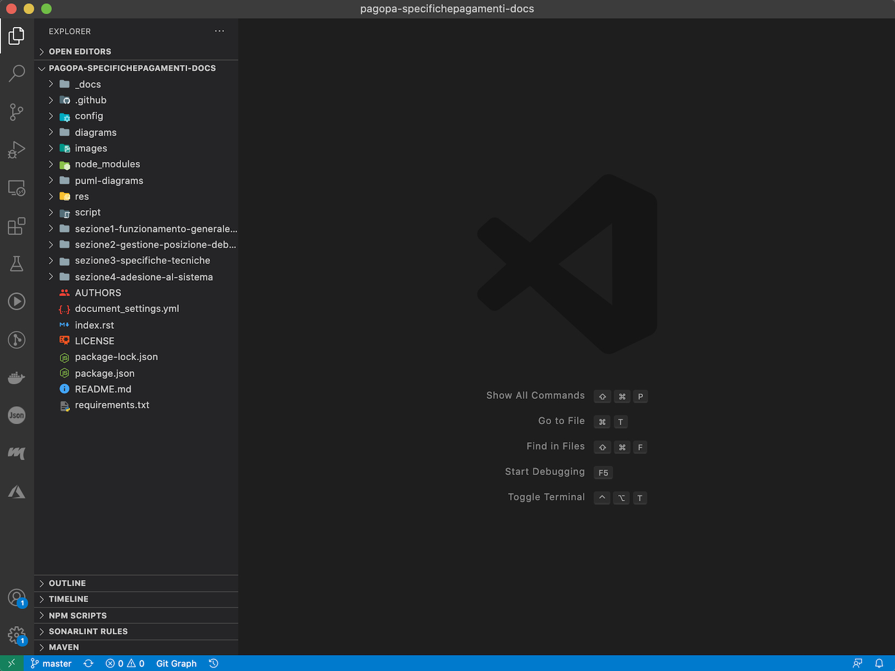
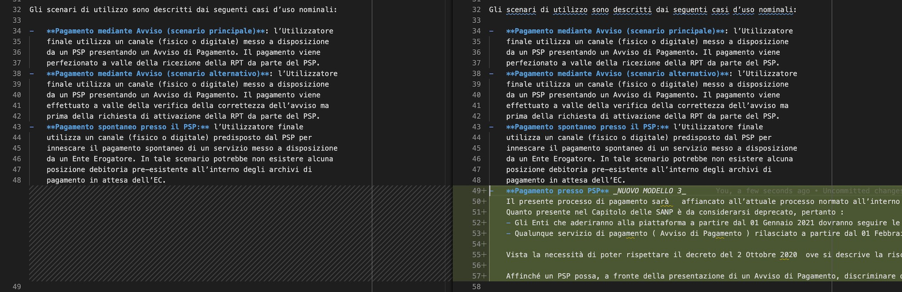
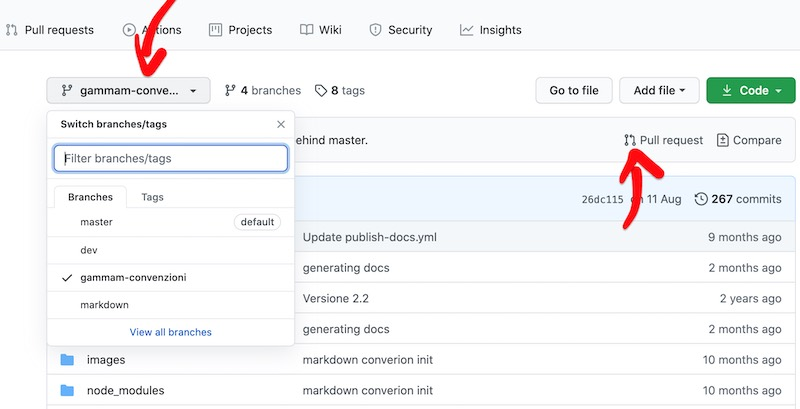
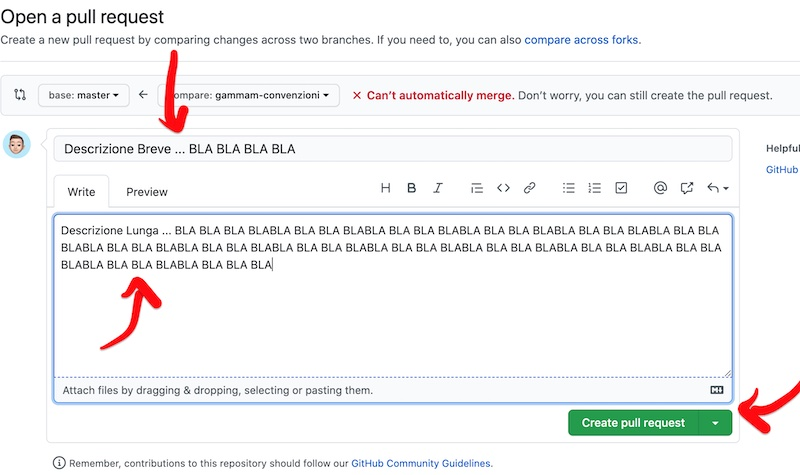

# Procedure emissione nuove `SANP`

<p align="center">  </p>

- [Procedure emissione nuove `SANP`](#procedure-emissioni-nuove-sanp)
  - [Introduzione](#introduzione)
  - [Requisiti](#requisiti)
  - [Uso](#uso)
  - [Link utili](#link-utili)

## Introduzione

Lo scopo del seguente documento è definire una procedura per l'emissione di una nuove versione (o proposte evolutive/correttive) delle `SANP`, _Specifiche Attuative del Nodo dei Pagamenti_, a partire dal repository [ufficiale](https://github.com/pagopa/pagopa-specifichepagamenti-docs) di PagoPA.

## Requisiti

Prerequisito è aver installato il tool [git](https://git-scm.com/downloads) necessario per operare sui repository dell'organizzazione PagoPA.

Prima di procedere all'installazione, verificare la presenza di `git` digitando il seguente comando da  terminale: `git --version`

Se già presente, verrà mostrata la versione installata nel sistema (es: `git version 2.25.0`)

E' ovviamente possibile utilizzare il comando git integrato nel proprio _IDE_ di preferenza. A titolo di esempio si riportano le [Development Guidelines](https://github.com/pagopa/io-handbook/blob/master/development-guidelines.md#editors-code-formatting-linting) di [IO](https://io.italia.it/).

## Uso

Per poter modificare il repository [ufficiale delle `SANP`](https://github.com/pagopa/pagopa-specifichepagamenti-docs) occorre eseguire i seguenti passi:

Anzitutto occorre avere una copia locale del repository:

```
$ git clone https://github.com/pagopa/pagopa-specifichepagamenti-docs pagopa-specifichepagamenti-docs && cd $_
```

Successivamente occorre aggiornare la copia locale con il contenuto remoto:

```
$ git checkout master && git pull
```

A questo punto è possibile apportare una modifica:

```
code .
```

dovrebbe apparire una finestra simile (dipendente dal proprio _IDE_):



Aprire il file che si vuole modificare tramite il `Project explorer` a destra ed apportare le modifiche desiderate



Eseguite le modifiche salvare il file e ritornare nel terminale, dove lanciando il comando `git status` avremo un output simile:

```
$ git status
On branch master
Your branch is up to date with 'origin/master'.
Changes not staged for commit:
  (use "git add <file>..." to update what will be committed)
  (use "git restore <file>..." to discard changes in working directory)
	modified:   sezione3-specifiche-tecniche/PagamentoPressoPSP.md

no changes added to commit (use "git add" and/or "git commit -a")
```

che indica che ci troviamo sul ramo `master` e che è stato modificato il file `PagamentoPressoPSP.md`

Per poter riversare le nostre modifiche sul repo Github di `PagoPA` occorre anzitutto creare un `branch` con le nostre modifiche:

```
$ git stash && git stash branch <branch-name>
```

Ad esempio:

```
$ git stash && git stash branch aggiunto-mod3
Saved working directory and index state WIP on master: 00d68d9 publish documentation
Switched to a new branch 'aggiunto-mod3'
On branch aggiunto-mod3
Changes not staged for commit:
(use "git add <file>..." to update what will be committed)
(use "git restore <file>..." to discard changes in working directory)
modified: sezione3-specifiche-tecniche/PagamentoPressoPSP.md
no changes added to commit (use "git add" and/or "git commit -a")
Dropped refs/stash@{0} (b253cacc7f8675b8acafc9c75f312430f35b1862)
```

Successivamente inseriremo un breve commento descrittivo delle modifiche apportate:

```
$ git commit -a -m "<reason>"
```

Ad esempio:

```
$ git commit -a -m "aggiunta descrizione nuovo modello 3"
```

Saremo il comando con `push` per riversare tutte le modifiche:

```
$ git push --set-upstream origin <branch-name>
```

Ad esempio:

```
$ git push --set-upstream origin aggiunto-mod3
```

Ora accedendo tramite il browser al repo delle [SANP](https://github.com/pagopa/pagopa-specifichepagamenti-docs) otterremo:



Selezionando il nostri `branch` tra quelli disponibili e clicchiamo sul pulsante `Pull request` (maggiori [info qui](https://docs.github.com/en/free-pro-team@latest/github/getting-started-with-github/github-glossary#pull-reques)) per richiedere che le nostre modifiche vengano accettate:



dove inserire una descrizione breve e chiara, unitamente ad una più estesa che spieghi in dettaglio ciò che è stato fatto. Quindi clicchiamo su `Create Pull Request`.

A questo punto verrà inviata una richiesta automatico di `review` a `PagoPA` incaricata di controllare le modifiche ed eventualmente accettarle ed incorporarle (_merge_) nel ramo `master`.

In seguito verrà creato un nuovo tag per la versione "release candidate", secondo una policy di "semantic versioning" come esplicitato all'interno delle SANP stesse.

## Link utili

- [Markdown Cheatsheet](https://github.com/adam-p/markdown-here/wiki/Markdown-Cheatsheet)
- [git-cheatsheet](https://www.atlassian.com/git/tutorials/atlassian-git-cheatsheet)
- [Semantic Versioning](https://semver.org/)