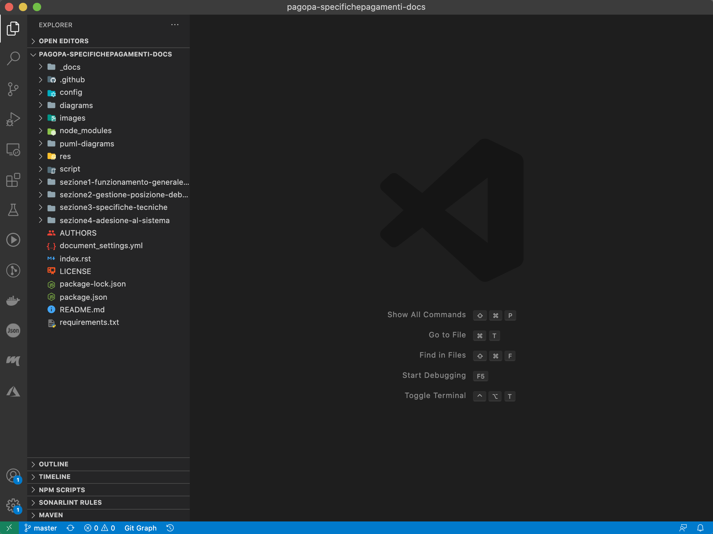
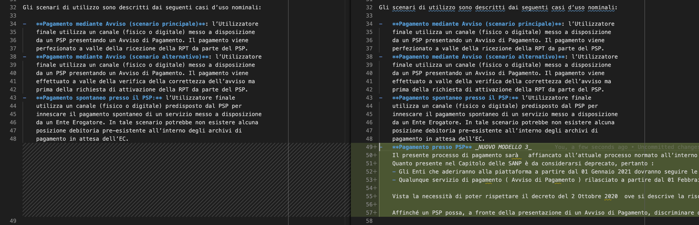
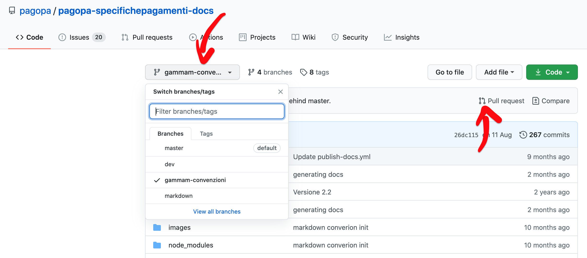
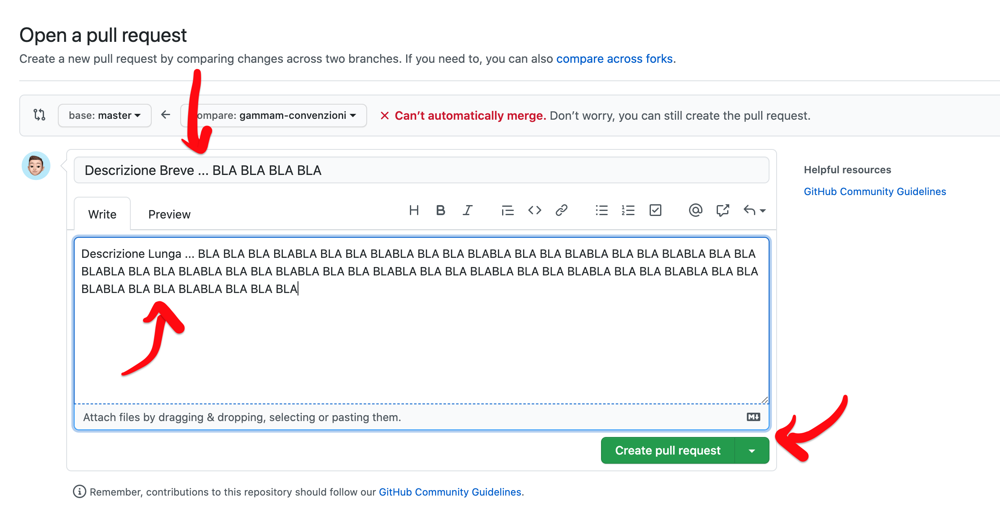

# Procedure emissioni nuove `SANP`

<p align="center">
  
</p>

- [Procedure emissioni nuove `SANP`](#procedure-emissioni-nuove-sanp)
  - [Executive Summary](#executive-summary)
  - [Requirements](#requirements)
  - [Usage](#usage)
  - [Guidelines](#guidelines)
  - [Useful links](#useful-links)

## Executive Summary

Lo scopo del seguente documento è quello di definire una procedura di come si emettono nuove versioni (proposte evolutive/correttive), relative alle `SANP` _Specifiche Attuative del Nodo dei Pagamenti_, a partire dal repo [ufficiale](https://github.com/pagopa/pagopa-specifichepagamenti-docs) GitHub di `PagoPA`.

## Requirements

Per poter collaborare e apportare modifiche al repo della documentazione occorre per prima cosa aver installato sulla propria macchina [git](https://git-scm.com/downloads), ovvero l'interfaccia a riga di comando del controllo di versione distribuito, che verrà utilizzato per poter interagire con i repos GitHub dell'organizzaione `PagoPA`.

Prima di procedere all'installazione, verifare la presenza di `git` sulla propria macchina digitando il seguente comando da un terminale qualsiasi:

```
git --version
```

se già presente, verrà mostrata la versione installata nel sistema, ad esempio:

```
git version 2.24.3 (Apple Git-128)
```

> **NOTA** : (_OPTIONAL_) Installazione di un _IDE_ per la modifica del contenuto dei repo(s).

Per poter modificare il contenuto del documentazione non è necessario un tool specifico, in quanto può essere fatto tramite un qualsiasi editor di testo, di seguito viene indicato quello consigliato nelle linee guida di [IO](https://io.italia.it/) nelle sue [development-guidelines](https://github.com/pagopa/io-handbook/blob/master/development-guidelines.md#editors-code-formatting-linting)

- download & install [Visual Studio Code](https://code.visualstudio.com/)

Nel prossimo paragrafo verrà mostrato anche un suo utilizzo per la modifica dei contenuti.

## Usage

Per poter collaborare e modificare il repo [ufficiale](https://github.com/pagopa/pagopa-specifichepagamenti-docs) delle `SANP` eseguire i seguenti passi :

1. _PRIMA VOLTA_

crearsi una copia locale del repo sulla propria macchina digitando su un terminale il seguente comando, in una cartella a propria scelta :

```
git clone https://github.com/pagopa/pagopa-specifichepagamenti-docs pagopa-specifichepagamenti-docs && cd $_
```

2. _VOLTE SUCCESSIVE : già si ha in locale un copia del repo delle `SANP`_

aprire un terminale e digitare il seguente comando :

```
cd <PATH-DOVE-SI-TROVA-IL-REPO-SANP>
```

da qui digitare poi :

```
git checkout master && git pull
```

Adesso che abbiamo eseguito il passo 1) o il passo 2) proviamo a fare una modifica alla documentazione per farne una nuova versione.

3. digitare da terminale, dalla cartella del repo precedente clonato e aggiornato al `master` il comando :

```
code .
```

se tutto va bene dovrebbe apparire qualcosa di simile :



4. aprire il file che si vuole modificare tramite il `Project explorer` mostrato a destra e apportare le modifiche desiderate come in qualunque editor di testo.

> **NOTA** : nell'esempio è stata modificata la parte della `sezione3-specifiche-tecniche` nello specifico aggiungendo una breve descrizione del _Nuovo Modello 3_ nella sezione `PagamentoPressoPSP.md`



5. Fatta la modifica (o le modifiche) salvare il file e ritornare nel terminale dove si era dato il comando `code`

6. da qui lanciando il comando `git status` dovremmo vedere una cosa del genere il

```
git status
On branch master
Your branch is up to date with 'origin/master'.

Changes not staged for commit:
  (use "git add <file>..." to update what will be committed)
  (use "git restore <file>..." to discard changes in working directory)
	modified:   sezione3-specifiche-tecniche/PagamentoPressoPSP.md

no changes added to commit (use "git add" and/or "git commit -a")
```

che ci indica che stiamo sul ramo `master` e che è stato modificato il file `PagamentoPressoPSP.md`

7. Ora per poter riversare le nostre modifiche sul repo GitHub di `PagoPA` faremo cosi, prima creiamo una `branch` con le nostre modifiche digitando :

```
git stash && git stash branch <NOME_BRACH_MODIFICHE>
```

ad esempio per le modifche fatte nell'esmepio potremmo digitare

```
git stash && git stash branch pspica-aggiunto-mod3

Saved working directory and index state WIP on master: 00d68d9 publish documentation
Switched to a new branch 'pspica-aggiunto-mod3'
On branch pspica-aggiunto-mod3
Changes not staged for commit:
(use "git add <file>..." to update what will be committed)
(use "git restore <file>..." to discard changes in working directory)
modified: sezione3-specifiche-tecniche/PagamentoPressoPSP.md

no changes added to commit (use "git add" and/or "git commit -a")
Dropped refs/stash@{0} (b253cacc7f8675b8acafc9c75f312430f35b1862)
```

8. Poi daremo un breve commento descrittivo alle modifiche apportate sul repo _PagoPA_ digitando :

```
git commit -a -m “<REASON>”
```

ad esempio

```
git commit -a -m “aggiunta descrizione nuovo modello 3 per TARI e TEFA”
```

9. e poi il comando con `push` riversare tutte le modifche sul repo pubblico delle **SANP**

```
git push --set-upstream origin <NOME_BRACH_MODIFICHE>
```

che nel nostro esempio sarebbe

```
git push --set-upstream origin pspica-aggiunto-mod3
```

10. ora tramite il browser accedimo al repo delle [SANP](https://github.com/pagopa/pagopa-specifichepagamenti-docs)



e selezioniamo la nostra `branch` tra quelle disponibili e clicchiamo sul bottone `Pull request` per richidere che le nostre modifiche vengano accettate.

11. Se tutto va bene dovrebbe apparire qualcosa di simile
    

dove inseire una descrione breve (che subito consenta di capire il tipo di modifica fatta) e una più estesa che spiega in dettaglio ciò che è stato fatto, e alla fine cliccare su `Create Pull Request`

12. Da qui partirà in automatico una richiesta di `review` ai reviewer di `PagoPA` (_ToDeDefine : WHO ?_) incaricati di controllare le modifiche e solo a valle del loro check la nostra branch sarà _mergiata_ nel `master`.

13. Quando una nuova branch è versata nel `master` a quest'ultimo viene associato un nuovo `tag` secondo le linee guida [MAJOR.MINOR.PATCH](https://semver.org/), con l'aggiunta del suffisso `-RC.x`, ossia `release candidate` numero `x`. Tale suffisso indica che la presente versione potrebbe essere o in **SIT** o in **UAT**.

> **NOTA** : l'associazione del nuovo `tag` sarà cura del _ToDeDefine ... reviewer ?? owner della PR_

1.  La rimozione del `-RC.x` avverrà in modo manuale, quando ci sarà una nuova versione in **PROD** corrispondente con quella etichattata, si cancellerà il vecchio `tag` associandone uno nuovo. 
    > _In attessa dell'automatismo sarà fatto manualmente._ _WIP : ToDeDefine : HowTo_

> _Esempio :_ Se attualmente in **PROD** c'è la versione `2.2.6` ed è stata creata una nuova release `2.2.7.RC.1`, appena ci si accorgerà che tale versione è passata dall'ambiente **UAT** a quello di **PROD** si rimuoverà il tag `2.2.7.RC.1` e se ne crearà uno nuovo `2.2.7`

## Guidelines

In generela quindi la procedura da seguire per emettere nuove versioni delle **SANP** è :

1. fare il `clone` del repo [ufficiale](https://github.com/pagopa/pagopa-specifichepagamenti-docs)
2. creare, a partire da li, una nuova `branch` con le proprie proposte di modifiche
3. riversrare tutto su **GitHub** tramite `push`
4. Creare la [PR](https://docs.github.com/en/free-pro-team@latest/github/getting-started-with-github/github-glossary#pull-request)
5. Attendere il `merge` della nuova `branch` sul `master` a valle del check dei reviewer
6. Creazione nuovo `tag` per la nuova `release candidate`
7. Verifica che la nuova release sia passata da **SIT**/**UAT** a **PROD** e rimozione suffisso `-RC.x`

## Useful links

- [Markdown Cheatsheet](https://github.com/adam-p/markdown-here/wiki/Markdown-Cheatsheet)
- [git-cheatsheet](https://www.atlassian.com/git/tutorials/atlassian-git-cheatsheet)
- [Semantic Versioning](https://semver.org/)
