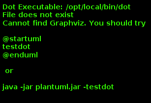

**SEZIONE III -- SPECIFICHE TECNICHE GENERALI**

Specifiche Tecniche Generali
============================

Questa sezione è rivolta agli sviluppatori e descrive in maniera generale tutti i flussi informativi necessari per l'integrazione con la piattaforma. 
Maggior dettagli sono disponibili all'interno del [portale degli sviluppatori](https://pagopa.github.io/pagopa-api/)

## Stazioni e Canali

I soggetti aderenti Enti Creditori (EC) e Prestatori di Servizi di Pagamento (PSP), si connettono alla piattaforma rispettivamente per mezzo di *stazioni* e *canali* che rappresentano le piattaforme tecnologiche di partner ed intermediari connessi tramite public-internet o connessioni VPN dedicate.

## Modello dei dati 

Durante la descrizione delle interfacce si farà riferimento ad alcune informazioni le cui relazioni vengono mostrate dal seguente diagramma:

Posizione Debitoria: rappresenta l'entità (il servizio) per la quale l'EC vuole ricevere pagamenti tramite la piattaforma. E' identificato in maniera univoca dalla coppia codice-fiscale / numero avviso.

Avviso di Pagamento: rappresenta la notifica (cartacea o digitale) della posizione debitoria verso il cittadino.

Pagamento (o Richiesta di Pagamento): descrive nel dettaglio l'operazione di pagamento correlata ad un avviso e contiene informazioni di incasso e di accredito.

Ricevuta: descrive l'esito di un pagamento, contiene i dettagli dell'incasso e la previsione dell'accredito. Contiene al suo interno anche il riferimento all'avviso di pagamento.

Flusso di Rendicontazione: dettaglia il riversamento effettuato verso i conti correnti di un EC da parte di un PSP. Contiene l'elenco di tutti i pagamenti (o quota parte).

Carrello di pagamento: un insieme di pagamenti.

## Autenticazione 

Ogni connessione verso la piattaforma avviene tramite canale HTTPS con mutua autenticazione. Per dettagli su come instaurare la connessione con la piattaforma fare riferimento alla Sez-IV.

### Autenticazione EC 

Ogni chiamata verso la piattaforma pagoPA è autenticata per mezzo di due parametri contenuti all'interno del body del messaggio SOAP:

* *identificativoStazioneIntermediarioPA*: identificativo della stazione configurata all'interno del PDA, che rappresenta il client dell'EC.
* *password*: password associata alla stazione

Ogni chiamata viene autorizzata verificando che la stazione riportata sia stata configurata all'interno della piattaforma e che la password sia valida.

### Autenticazione PSP

Ogni chiamata verso la piattaforma pagoPA è autenticata per mezzo di tre parametri contenuti all'interno del body del messaggio SOAP:

* *idPSP*: identificativo del PSP per conto del quale si sta effettuando la chiamata
* *idBrokerPSP*: identificativo dell'intermediario che sta effettuando la chiamata
* *idChannel*: identificativo del canale utilizzato per effettuare la chiamata
* *password*: password del canale

Qualsiasi messaggio viene autorizzato verificando che il canale dell'intermediario sia associato al PSP indicato all'interno della configurazione della piattaforma e che la password sia valida.
