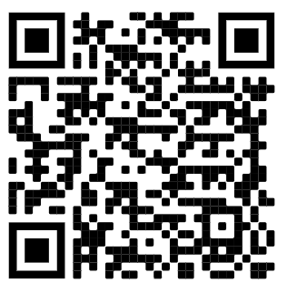

Avviso di Pagamento
===================

Tramite la Piattaforma pagoPA, un EC può innescare un pagamento presso un qualsiasi canale dei PSP aderenti tramite un codice *numero avviso* abbinato al codice fiscale dell'EC.

Il numero avviso è composto da 18 caratteri e deve identificare in maniera univoca la Posizione Debitoria all'interno degli archivi dell'EC. Tenuto conto che ogni EC può connettersi alla Piattaforma pagoPA tramite uno o più stazioni e che ogni stazione potrebbe gestire un insieme (disgiunto) di posizioni debitorie, il numero avviso dovrà essere composto seguendo il seguente *pattern*:

```javascript
<aux-digit>(1n)<position-global-id>(17)
```

L'*aux-digit* (che può assumere i valori 0,1,3) codifica il tipo di configurazione dell'EC alla Piattaforma pagoPA; a seconda del suo valore il campo *position-global-id* può assumere codifiche differenti.


**Nota**: Il numero avviso è descritto all'interno delle [SACI](https://docs.italia.it/italia/pagopa/pagopa-codici-docs/it/stabile/_docs/Capitolo2.html#numero-avviso-e-codice-iuv-nel-caso-di-pagamenti-attivati-presso-i-psp), il contenuto di questo paragrafo rifrasa quanto già riportato senza alternarne il contenuto.

**aux-digit=1**

L'EC dispone di un'unica stazione, pertanto il *position-global-id* identifica in maniera univoca la Posizione Debitoria all'interno dell'EC.

**aux-digit 3**

L'EC dispone di diverse stazioni, l'identificazione della posizione debitoria è composta da:

```javascript
<cod-segregazione>(2n)<position-local-id>(13n)<check-digit>(2n)
```

* *cod-segregazione*: valore numerico che rappresenta il Codice di Segregazione, ovvero la stazione all'interno della quale risiede la posizione debitoria.
* *position-local-id*: identificativo univoco della posizione debitoria all'interno della stazione (iuv base).
* *check-digit*: codice di controllo del numero avviso.

**check-digit**

Il check-digit viene calcolato come resto della divisione per 93 del numero ottenuto concatenando tutti i caratteri precedenti.

## Utilizzo del QR code sull'avviso di pagamento

Il Codice QR (in inglese _QR Code_) è un codice a barre bidimensionale adottato da ISO (_ISO/IEC 18004:2015 Information technology - Automatic identification and data capture techniques - QR Code bar code symbology specification_) ed impiega to per memorizzare informazioni generalmente destinate ad essere lette tramite diversi dispositivi, tra cui anche smartphone, tablet, ATM, ecc.

La stringa dati codificata all'interno del QR code è riportata nella tabella:

+-------------------------+---------+------------+---------+---------+--------------------------------------------+
| **Dato**                | **Liv** | **Genere** | **Occ** | **Len** | **Contenuto**                              | 
+-------------------------+---------+------------+---------+---------+--------------------------------------------+
| Codice identificativo.  | 1       | an         | 1..1    | 6       | Assume il valore fisso: PAGOPA             |
+-------------------------+---------+------------+---------+---------+--------------------------------------------+
| Separatore              | 1       | an         | 1..1    | 1       | Separatore di dati                         |
+-------------------------+---------+------------+---------+---------+--------------------------------------------+
| Versione.               | 1       | an         | 1..1    | 3       | Assume il valore fisso: 002                |
+-------------------------+---------+------------+---------+---------+--------------------------------------------+
| Separatore              | 1       | an         | 1..1    | 1       | Separatore di dati                         |
+-------------------------+---------+------------+---------+---------+--------------------------------------------+
| Numero Avviso           | 1       | an         | 1..1    | 18      | Contiene il Numero Avviso composto dalla   |
|                         |         |            |         |         | concatenazione dei dati: `aux digit`,      |
|                         |         |            |         |         | `application code`, `codice IUV`.          |
+-------------------------+---------+------------+---------+---------+--------------------------------------------+
| Separatore              | 1       | an         | 1..1    | 1       | Separatore di dati                         |
+-------------------------+---------+------------+---------+---------+--------------------------------------------+
| IdentificativoEnte      | 1       | an         | 1..1    | 11      | Codice fiscale dell’Ente Creditore         |
+-------------------------+---------+------------+---------+---------+--------------------------------------------+
| Separatore              | 1       | an         | 1..1    | 1       | Separatore di dati                         |
+-------------------------+---------+------------+---------+---------+--------------------------------------------+
| Importo                 | 1       | an         | 1..1    | 2..10   | Importo del pagamento in centesimi di euro |
+-------------------------+---------+------------+---------+---------+--------------------------------------------+

Stante quanto indicato nella tabella sopra riportata, la stringa di dati da codificare all'interno del QR Code potrebbe assumere la configurazione seguente:

`PAGOPA|002|123456789012345678|12345678901|1234567801`

(si tenga presente che la stringa sopra riportata presuppone l’inserimento dei dati previsti nella loro massima estensione)



Nella tabella sottostante sono riportate le caratteristiche tecniche che devono essere applicate nella generazione del QR Code:

+------------------------+-------------------------------+
| **Caratteristica**     |  **Valore da utilizzare**     | 
+------------------------+-------------------------------+
| Symbol Version         | 4                             |
+------------------------+-------------------------------+
| Modules                | 33x33                         |
+------------------------+-------------------------------+
| Modules width.         | 3 pixels                      |
+------------------------+-------------------------------+
| ECC level              | M (correzione errore max 15%) |
+------------------------+-------------------------------+
| Character set.         | UTF-8                         |
+------------------------+-------------------------------+
