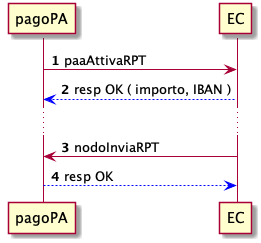

Richiesta di un pagamento 
============================

Un EC connesso alla piattaforma pagoPA deve offrire un servizio che restituisce un pagamento legato ad una posizione debitoria attraverso la primitiva *getPayment*.

Ogni richiesta viene specificata attraverso i parametri `amount` e `due_date`, che sono restituiti dalla *paaVerifyPayment*, ed il parametro `transferType` che definisce il tipo di accredito che il PSP vorrebbe disporre (attualmente l'unica opzione è relativa alla necessità di un conto corrente postale).

Nel caso questi parametri non siano presenti, sarà l'EC ad impostare l'importo attualizzato.

In risposta, l'EC restituisce tutti i dati necessari per il pagamento ed autorizza la piattaforma a proseguire con l'eventuale incasso ed accreditamento delle somme.

In aggiunta, l'EC può definire una data di validità delle informazioni inviate. Se presente, la piattaforma sarà autorizzata a gestire autonomamente richieste similari _senza necessariamente_ contattare l'EC.

## paaAttivaRPT

La primitiva *paaAttivaRPT* già contenuta nelle precedenti versioni, continuerà ad essere utilizzata e supportata sino al 31/12/2021.

 

1. la piattaforma richiede un'occorrenza di pagamento (distinta attraverso un codice di contesto pagamento) all'EC tramite la primitiva *paaAttivaRPT* specificando l'avviso di pagamento (identificato da IUV e CF).
2. l'EC verifica lo stato della posizione debitoria correlata e restituisce i dati necessari per il pagamento (importo ed iban di accreditamento)
3. successivamente l'EC invia una richiesta di pagamento (RPT) contenente tutti i dettagli del pagamento.
