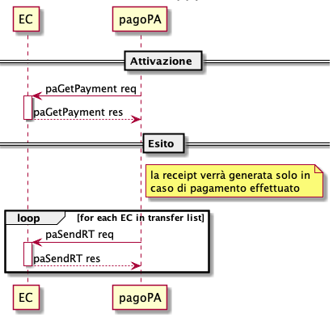
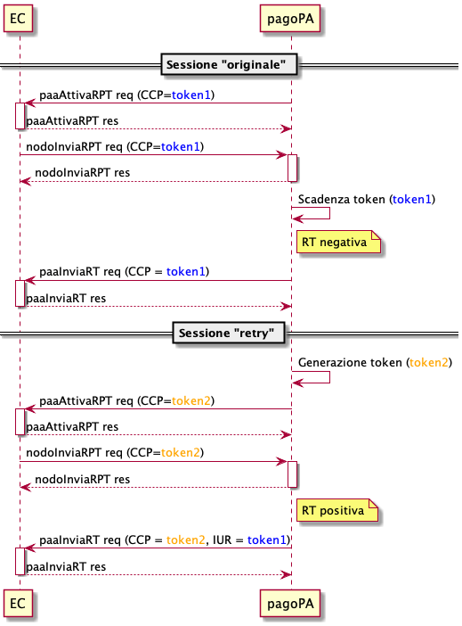

Ricevute di pagamento
=====================

A fronte di qualsiasi pagamento avvenuto sulla Piattaforma pagoPA viene generata, e notificata tempestivamente, una ricevuta che attesta il pagamento avvenuto con i riferimenti alla posizione debitoria e relativi dettagli.

Le ricevute vengono inviate:

* nel caso di pagamento online alla stazione richiedente il pagamento
* nel caso di pagamento tramite avviso di pagamento alla stazione indicata all'interno dell'avviso
* a tutte le stazioni identificate come "broadcast" qualora l'Ente beneficiario, contenuto all'interno del pagamento, non sia associato alle stazioni descritte precedentemente.

Per poter ricevere tali ricevute, l'EC deve disporre dell'operazione `sendRT` e `paaInviaRT` (già contenuta nelle precedenti versioni: continuerà ad essere utilizzata e supportata sino al 31/12/2021).

In particolare la piattaforma pagoPA fornirà all'EC l’esito del pagamento in modalità congruente alla configurazione dell'EC stesso:

* (a) se configurato con il precedente modello per mezzo della primitiva `paaInviaRT`, sia in caso di esito positivo che in caso di esito negativo;
* (b) se configurato con il nuovo modello per mezzo della primitiva `paSendRT`, esclusivamente in caso di esito positivo, oltre a tutti gli Enti beneficiari coinvolti nel pagamento.

Nel precedente caso (a) è possibile che il PSP notifichi alla piattaforma un pagamento a token scaduto: in tal caso la piattaforma stessa avvierà un processo di retry verso l'EC (caso 2). Il motivo del processo di retry deriva dal fatto che è stata consegnata una "RT negativa" all'EC.

La Piattaforma pagoPA effettuerà un massimo di 5 tentativi di invio della ricevuta all'EC. In caso di mancata notifica della ricevuta verrà attivato il tavolo operativo ed eventualmente ripristinata l'operazione di invio.

Nota: le ricevute non possono essere rifiutate, l'esistenza della ricevuta stessa attesta l'avvenuto pagamento secondo i processi descritti e notifica future operazioni di accreditamento. Eventuali storni/annulli dovranno essere gestiti direttamente dall'EC.