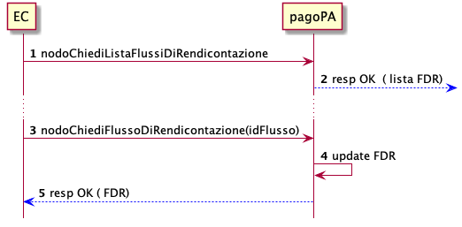

Rendicontazione ed Accredito
================================

Ogni PSP aderente alla piattaforma, in data D+2 rendiconta il dettaglio dei riversamenti effettuati verso i conti di accredito dei pagamenti avvenuti nella giornata operativa D.

L'EC può recuperare i flussi di rendicontazione prodotti seguendo il seguente schema:

`[TBD check sequence diagram-- updated]`

1. l'EC richiede l'elenco dei flussi di rendicontazione disponibili
2. la piattaforma restituisce l'elenco dei flussi di rendicontazione
3. l'EC richiede puntualmente ogni flusso di rendicontazione presente all'interno della lista
4. la piattaforma restituisce il flusso di rendicontazione ed elimina il flusso dall'elenco dei flussi disponibili.

Il Flusso di rendicontazione ottenuto descrive l'elenco dei pagamenti (*datiSingoloPagamento*) riversati, ognuno dei quali è associabile ad una ricevuta di pagamento.

## ricevuta tramite paaInviaRT

La primitiva *paaInviaRT* già contenuta nelle precedenti versioni, continuerà ad essere utilizzata e supportata sino al 31/12/2021. In tali casi è possibile rintracciare la ricevuta di un versamento contenuto all'interno del flusso di rendicontazione tramite i parametri:

* *identificativoUnivocoVersamento*
* *identificativoUnivocoRiscossione*

La ricevuta potrebbe contenere diversi versamenti, per identificare il versamento corrispondente è possibile utilizzare il campo *indiceDatiSingoloPagamento*.

## ricevuta paSendRT

E' possibile rintracciare la ricevuta di un versamento contenuto all'interno del flusso di rendicontazione tramite il parametro *identificativoUnivocoRiscossione* che conterrà il valore del campo _request-id_ della ricevuta.

La ricevuta potrebbe contenere diversi versamenti, per identificare il versamento corrispondente è possibile utilizzare il campo *indiceDatiSingoloPagamento* che conterrà il valore del *idTransfer* all'interno della ricevuta.
