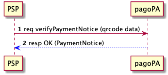
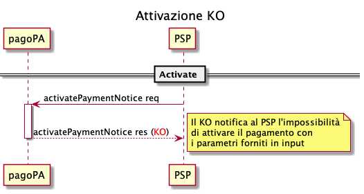
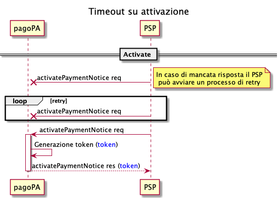
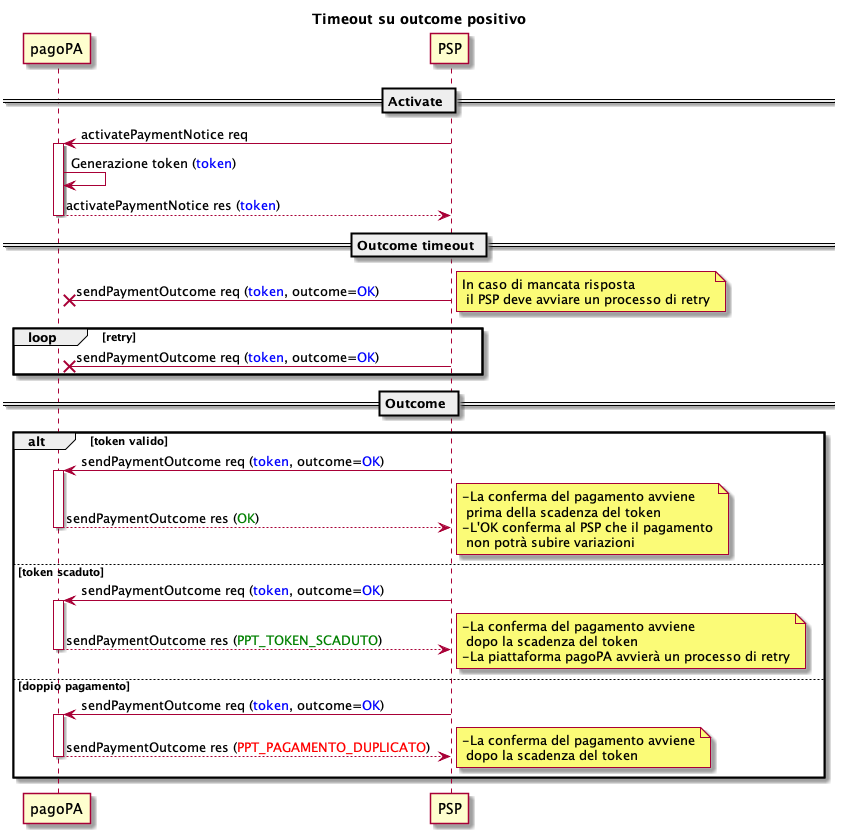
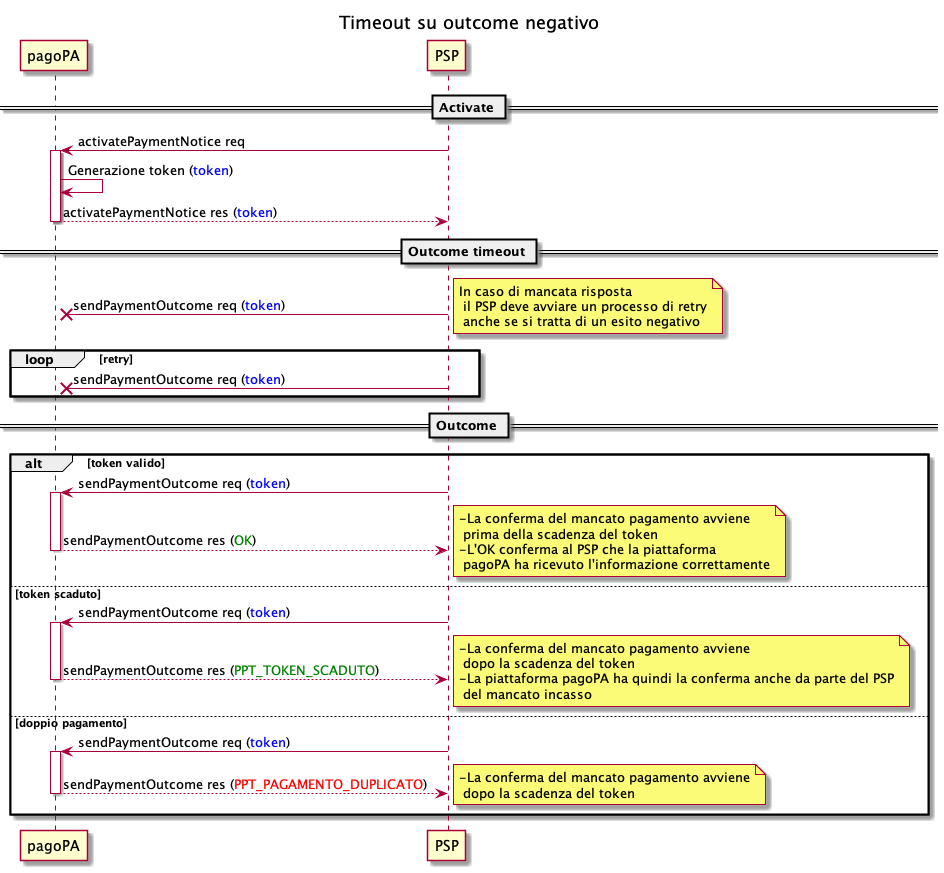

Pagamento di un Avviso
======================

Il processo di pagamento di un Avviso può essere visto come composto da due fasi distinte:

* la _verifica_ di un Avviso, che permette di capire se l'Avviso stesso sia ancora valido, o di attualizzare gli importi dovuti
* l'_attuazione del pagamento_ vero e proprio

Entrambe vengono descritte nei capitoli seguenti.

## Verifica dell'Avviso

Il Prestatore di Servizi di Pagamento (PSP) è in possesso di un Avviso di Pagamento di un utente, obiettivo del PSP è verificare che le informazioni contenute nell’Avviso siano ancora attuali (es: l’importo viene attualizzato a quanto effettivamente dovuto al momento della verifica).

Attraverso la lettura del _QR Code_, o attraverso l'inserimento manuale dei dati (`codice fiscale`, `importo`, `numeroAvviso`), si richiedono alla Piattaforma pagoPA, mediante la primitiva `verifyPaymentNotice`​, i dati aggiornati del​l’Avviso di Pagamento.

 

In risposta alla richiesta la piattaforma restituisce le informazioni aggiornate dell’Avviso di Pagamento, in particolare:

* importo aggiornato
* informazioni accessorie (es: attributo che identifica l’Avviso come un piano di pagamento rateale, oppure che permette la modifica dell’importo da parte dell’utente, etc).

La precedente chiamata non ha effetti sullo stato del Pagamento, che pertanto resta invariato. Quindi in caso di timeout, errore di connessione, etc la chiamata può essere nuovamente invocata senza _side effects_.

## Pagamento dell'Avviso

Una volta verificato l'Avviso di Pagamento è facoltà dell'utente autorizzarne il pagamento. Ciò avviene anzitutto attivando una sessione di pagamento (che evita pagamenti concorrenti dello stesso Avviso) e poi effettuando il pagamento vero e proprio (che chiude la sessione).

### Attivazione della sessione di pagamento

Il Prestatore di Servizi di Pagamento (PSP) apre una sessione di pagamento di un Avviso tramite la primitiva ​`activatePaymentNotice​()`. 

In risposta la Piattaforma pagoPA genera il token necessario per eseguire il pagamento e successivamente comunicare l’esito alla piattaforma stessa. La generazione del token ha l'effetto di bloccare la posizione debitoria sulla piattaforma per il tempo indicato nel campo `expiringTime` o, se non specificato, per la sua durata di default: con questa soluzione si impediscono i pagamenti doppi per la durata del token. Inoltre vengono restituiti tutti dati della richiesta di pagamento, in particolare quelli necessari per le operazioni di addebito ed accredito (es: importo totale con lista dei conti di accredito e quota parte dell’importo).

I possibili casi in cui non si ottiene una risposta positiva sono nel seguito descritti:

* Se i dati forniti dal PSP non sono corretti la Piattaforma risponde con un `KO`: il PSP non potrà quindi avviare il pagamento (**caso 2**)
* Se risulta aperta una precedente sessione di pagamento la Piattaforma risponde con un `KO`: ciò inibisce ad altri PSP l'apertura di sessioni di pagamento concorrenti per lo stesso Avviso (**caso 2**)
* Se il PSP non ottiene risposta dalla Piattaforma alla richiesta di attivazione della sessione, può avviare un processo di retry (**caso 3**). La chiamata `activatePaymentNotice​()` è idempotente (prevede il parametro opzionale `idempotencyKey`): ovvero a fronte di un'invocazione con la stessa chiave la Piattaforma risponderà con il medesimo output.

### Pagamento

Il Prestatore di Servizi di Pagamento (PSP) effettua l’addebito dell’importo e notifica l’operazione alla Piattaforma tramite la primitiva `sendPaymentOutcome()`​, specificando in particolare:

* token della sessione di pagamento
* importo totale incassato e importo dell’Avviso
* commissioni applicate
* strumento di pagamento utilizzato
* (opzionale) identificativo dell’utente che ha effettuato l’operazione
* data applicativa
* data di accredito
* dettagli degli IBAN di accredito e relativi importi.

Il PSP ha l'obbligo di notificare alla Piattaforma l'esito sia in caso di pagamento avvenuto con successo (esito positivo) che in caso di pagamento non avvenuto (esito negativo). E' inoltre necessario assicurarsi che la Piattaforma abbia ricevuto l'esito del pagamento attraverso il corretto ottenimento della response della primitiva sopra citata.

Il PSP ha quindi l’obbligo, in caso di mancato recapito dell'esito, di avviare un processo di _retry_.

Se il retry avviene _entro la scadenza_ del token della sessione di pagamento non si identificano potenziali problemi. Qualora invece il processo di retry si completa oltre la scadenza del token il PSP otterrà in risposta che il token è scaduto.

Si identificano i seguenti casi:

* incasso effettuato e timeout sull'invio dell'esito (**caso 4**)
* incasso non effettuato e timeout sull'invio dell'esito (**caso 5**)

In caso di incasso effettuato e timeout sull'invio dell’esito (caso 4), la Piattaforma pagoPA avvierà un processo di retry del pagamento verso l'Ente Creditore che può portare a due esiti:

* esito positivo: l'avviso risulta ancora pagabile e la Piattaforma riesce a comunicare l'avvenuto pagamento all'EC, che quindi riceve una `RT+`
* esito negativo: l'EC non riceve una `RT+`

### Eccezioni

Nel seguito vengono illustrate le eccezioni specificate in precedenza (casi 2, 3, 4 e 5).

**Caso 2 - attivazione non possibile**

La Piattaforma notifica al PSP, attraverso il `KO`, l'impossibilità di attivare il pagamento con i parametri ricevuti. Il PSP deve notificare all'utente di non poter procedere al pagamento, con opportuna motivazione secondo il messaggio di errore ottenuto dal sistema. Es:

* Pagamento in Corso
* Importo Errato
* Avviso di Pagamento Pagato
* Avviso Non valido
* Avviso Non Trovato

**Caso 3 - timeout sull'attivazione**

Il PSP può avviare un processo di retry in caso di mancata risposta da parte della Piattaforma.

**Caso 4 - incasso effettuato e timeout su invio dell'esito**

**Caso 5 - incasso non effettuato e timeout su invio dell'esito**

