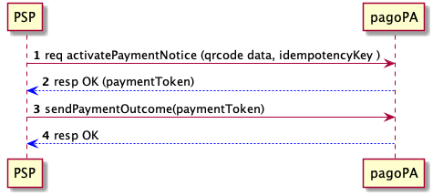

Pagamento di un Avviso
======================

Il processo di pagamento di un Avviso può essere visto come composto da due fasi distinte:

* la verifica di un Avviso, che permette di capire se l'Avviso stesso sia ancora valido, o di attualizzare gli importi dovuti
* l'attuazione del pagamento vero e proprio

Entrambe vengono descritte nei capitoli seguenti.

## Verifica dell'Avviso

Il Prestatore di Servizi di Pagamento (PSP) è in possesso di un Avviso di Pagamento di un utente, obiettivo del PSP è verificare che le informazioni contenute nell’Avviso siano ancora attuali (es: l’importo viene attualizzato a quanto effettivamente dovuto al momento della verifica).

Attraverso la lettura del _QR Code_, o attraverso l'inserimento manuale dei dati (`codice fiscale`, `importo`, `numeroAvviso`), si richiedono alla piattaforma pagoPA, mediante la primitiva `verifyPaymentNotice`​, i dati aggiornati del​l’Avviso di Pagamento.

 

In risposta alla richiesta la piattaforma restituisce le informazioni aggiornate dell’Avviso di Pagamento, in particolare:

* importo aggiornato
* informazioni accessorie (es: attributo che identifica l’Avviso come un piano di pagamento rateale, oppure che permette la modifica dell’importo da parte dell’utente, etc).

La precedente chiamata non ha effetti sullo stato del Pagamento, che pertanto resta invariato. Quindi in caso di timeout, errore di connessione, etc la chiamata può essere nuovamente invocata senza _side effects_.

## Pagamento dell'Avviso

Una volta verificato l'Avviso di Pagamento è facoltà dell'utente autorizzarne il pagamento. Ciò avviene anzitutto attivando una sessione di pagamento (che evita pagamenti concorrenti dello stesso Avviso) e poi effettuando il pagamento vero e proprio (che chiude la sessione).

### Attivazione della sessione di pagamento

Il Prestatore di Servizi di Pagamento (PSP) apre una sessione di pagamento di un Avviso tramite la primitiva ​`activatePaymentNotice​()`, specificando in particolare:

* l’importo (opzionale): in caso di omissione dell’importo nella richiesta allora l’importo ottenuto in risposta è attualizzato dall’EC, altrimenti è il valore inserito durante la richiesta stessa.
* durata della sessione di pagamento (opzionale): scaduto tale timeout l'Avviso sarà nuovamente pagabile.

Se risulta aperta una precedente sessione di pagamento la piattaforma risponde con un `KO`: ciò inibisce ad altri PSP l’apertura di sessioni di pagamento concorrenti per lo stesso Avviso.

In risposta la piattaforma pagoPA genera il token necessario per eseguire il pagamento e successivamente comunicare l’esito alla piattaforma stessa. Inoltre vengono restituiti tutti dati della richiesta di pagamento, in particolare quelli necessari per le operazioni di addebito ed accredito (es: importo totale con lista dei conti di accredito e quota parte dell’importo). Lo stato della Richiesta di Pagamento è posto in ​*paying*.

### Pagamento

Il Prestatore di Servizi di Pagamento (PSP) effettua l’addebito dell’importo e notifica l’operazione alla piattaforma tramite la primitiva `sendPaymentOutcome()`​, specificando in particolare:

* token della sessione di pagamento
* importo totale incassato e importo dell’Avviso
* commissioni applicate
* strumento di pagamento utilizzato
* (opzionale) identificativo dell’utente che ha effettuato l’operazione
* data applicativa
* data di accredito
* dettagli degli IBAN di accredito e relativi importi.

La Richiesta di Pagamento è posto in stato ​`paid` e la sessione di pagamento viene chiusa. L'avviso di pagamento rimarrà bloccato sino a quanto la ricevuta di pagamento non sarà consegnata all'EC:

 

## Eccezioni

Nel seguito vengono descritte alcune eccezioni e come esse vengono gestite dalla piattaforma pagoPA.

**Eccezione - apertura della sessione di pagamento**

La chiamata alla primitiva ​`activatePaymentNotice​()` prevede un parametro (opzionale) - `idempotencyKey` - il cui contenuto è a discrezione del chiamante, che rende la chiamata idempotente rispetto al medesimo valore di `idempotencyKey`, ovvero a fronte di un'invocazione con la stessa chiave la piattaforma risponderà con il medesimo output.

Quindi, in caso di mancata risposta, è sufficiente effettuare una nuova invocazione utilizzando la medesima chiave per `idempotencyKey`.

**Eccezione - chiusura della sessione di pagamento**

Se il PSP non riceve risposta all'invocazione delle primita `sendPaymentOutcome()` non può finalizzare il pagamento e quindi procedere all’emissione della ricevuta verso l’utente.

La chiamata alla primitiva ​`sendPaymentOutcome​()` prevede il parametro `paymentToken` che rende la chiamata idempotente, ovvero a fronte di un'invocazione con la stessa chiave la piattaforma risponderà con il medesimo output. Pertanto è sufficiente eseguire una nuova invocazione per ottenere i dati richiesti.

**Eccezione - rifiuto della sessione di pagamento**

Se il PSP riceve una risposta negativa all'invocazione della primitiva `activatePaymentNotice()` deve notificare all’utente l’impossibilità di procedere al pagamento, con opportuna motivazione secondo il messaggio di errore ottenuto dal sistema. Es:

* Pagamento in Corso
* Importo Errato
* Avviso di Pagamento Pagato
* Avviso Non valido
* Avviso Non Trovato

**Eccezione - incasso negato**

Se il PSP riceve una risposta negativa all'invocazione della primitiva `sendPaymentOutcome()` deve notificare all’utente l’impossibilità di concludere il pagamento, con opportuna motivazione secondo il messaggio di errore ottenuto dalla piattaforma.

Le negazione all’operazione di incasso può avvenire esclusivamente per le seguenti ragioni:

* errato token di pagamento
* errati dati di incasso: i dati di incasso non corrispondono ai dati della sessione di pagamento
* errato esito: sono stati notificati diversi incassi (con valori differenti) rispetto al medesimo token di pagamento
* token scaduto: il token di pagamento utilizzato risulta essere scaduto, ma la posizione debitoria è ancora valida. In questo caso il PSP può sottomettere nuovamente una richiesta di attivazione per ottenere un token valido e completare la procedura di pagamento.
* doppio incasso: il token di pagamento indicato è scaduto e la posizione debitoria risulta già pagata.
