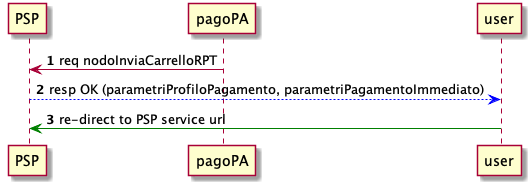
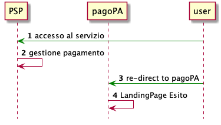

# Canale di pagamento on-line (WFESP)

Nel presente paragrafo viene dettagliato il processo di pagamento utilizzando un canale di pagamento on-line.
Possiamo scomporre il processo in due macro-fasi :

1. Selezione e Pagamento
2. Gestione dell'esito

## Selezione e Pagamento

In questa fase l'utente individua il servizio di pagamento offerto tra quelli offerti dalla piattaforma.

 

1. Alla selezione del servizio di pagamento del PSP, la piattaforma pagoPA invia i dettagli del pagamento attraverso la primita _nodoInviaCarrelloRPT_
2. il PSP acquisisce i dettagli del pagamento, crea una sessione di pagamento , e restituisce i parametri da utilizzare per identificare la sessione di pagamento appena creata.
3. In caso di risposta _OK_ da parte del PSP, la piattaforma re-indirizzerà il browser dell'utente verso il portale del PSP con una URL composta nel modo sotto indicato

```javascript
<urlPortalePSP>?
<parametriProfiloPagamento>&
<parametriPagamentoImmediato>
[&idCarrello=<identificativoCarrello>]
[&<parametriWisp>]
[&lang=xyz]
```

dove:

* `<urlPortalePSP>`: url del servizio del PSP come descritto all'interno della configurazione del canale del PSP.
* `<parametriProfiloPagamento>` e `<parametriPagamentoImmediato>`: query string fornite al PSP dal Nodo dei Pagamenti-SPC mediante la Request della primitiva pspInviaCarrelloRPT i cui valori sono specifici per ogni integrazione del PSP (si veda il capitolo successivo).
	
Di default:

* `<idCarrello>`: parametro opzionale, presente nel caso sia restituito dal PSP nella Response della primitiva  pspInviaCarrelloRPT invocata in precedenza.
* `<parametriWISP>`: parametri opzionali 
* `<lang>`: è la specifica del linguaggio scelto dall'utilizzatore finale, qualora fornita dal Portale dell'Ente Creditore nella re-direzione verso il Web-FESP. Il codice abbreviato identifica il linguaggio secondo lo standard ISO 693-3.

## Gestione dell'esito

In questa fase, l'utente utilizza il portale messo a disposizione dal PSP per procedere con l'operazione di pagamento.

 

1. L'utente esegue tutte le operazione proprie del servizio offerto dal PSP concludendo l'operazione di pagamento.
2. il PSP gestisce l'operazione di pagamento.
3. Al termine del pagamento, il PSP re-indirizza l'utente alla piattaforma pagoPA utilizzando una URl composta nel seguete modo:

```javascript
<urlWeb-FESP>?
<parametriPagamentoImmediato>
 [&idCarrello=<identificativoCarrello>]
&<codiceRitornoPSP>
```

dove:

* `<urlWeb-FESP>`: è lo URL della componente Web-FESP del NodoSPC.
* `<parametriPagamentoImmediato>`: query string fornita dal PSP mediante la Response della primitiva pspInviaCarrelloRPT invocata in precedenza.
* `<idCarrello>`: parametro opzionale, presente nel caso sia restituito dal PSP nella Response della primitiva _pspInviaCarrelloRPT_ invocata in precedenza
* `<codiceRitornoPSP>`: stringa contenente un parametro fornito dal PSP, il cui formato è lista di valori possibili sono concordati a priori dallo specifico PSP con il NodoSPC. Il significato del parametro è l’esito della transazione on-line dell’utilizzatore finale sul Portale del PSP. Tale esito viene mappato dal Web-FESP nell’URL di re-direzione verso il Portale dell'Ente Creditore in uno dei tre possibili esiti previsti:
	* OK: il pagamento presso il Portale PSP è stato eseguito con successo; quest’ultimo fornirà a breve una RT positiva
	* ERROR: il pagamento presso il Portale PSP non è stato eseguito con successo; quest’ultimo ha segnalato al Web-FESP l’esito negativo
	* DIFFERITO: l’esito del pagamento eseguito dall’utilizzatore finale presso il Portale PSP sarà noto solo al ricevimento della RT.

## parametriProfiloPagamento e parametriPagamentoImmediato

Le queryString associate ai parametri *parametriProfiloPagamento* e *parametriPagamentoImmediato* dipendono dall'integrazione verso il PSP.
Di default vengono utilizzati i seguenti valori (codice `_wpl02_`):

* Forma del parametriProfiloPagamento: non valorizzato
* Forma del parametriPagamentoImmediato: `idBruciatura=<valore>`

Esempio di URL di redirezione WFESP->PSP:
`<urlPortalePSP>?[idDominio=<valore>]&idBruciatura=<valore>[&idCarrello=<valore>][&lang="it-IT"]`

Esempio di URL di redirezione PSP->WFESP:
`<urlWeb-FESP>?[idDominio=<valore>]&idBruciatura=<valore>&codiceRitorno=<valoreCodiceRitorno>`

con codiceRitorno che può assumere i seguenti valori (traduzione WFESP per PA):

- OK:           Processo concluso con esito positivo (OK)
- ERROR:        Processo concluso con esito negativo (ERROR)
- ABORT:        Transazione annullata dall’utente giunto sulla pagina di pagamento (ERROR)
- DIFFERITO:    Processo concluso con esito dubbio- PAGO IN CONTO (DIFFERITO)