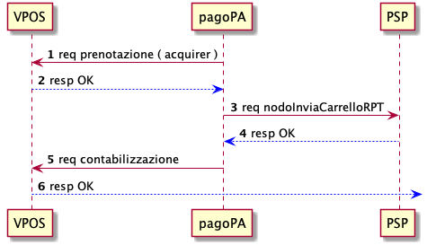

## Acquirer

Tramite la Piattaforma pagoPA è possibile offrire il pagamento tramite carta di credito/debito in due diverse modalità :

1. configurandosi come acquirer all'interno del servizio VPOS offerto da SIA S.p.A.
2. integrando un proprio _payment gateway_ con la Piattaforma pagoPA

In entrambi gli scenari , il processo di pagamento è descritto dal diagramma seguente

1. L'utente inserisce i dati carta all'interno della Piattaforma pagoPA
2. la piattaforma seleziona il servizio di acquiring secondo il seguente principio :
   1. Viene selezionato il servizio di pagamento del PSP Issuer della carta emessa. 
   2. Viene selezionato il servizio di pagamento del PSP (che gestisce il circuito di appartenenza della carta) che rappresenta il costo di commissione più basso per l'operazione in corso
3. L'utente ha SEMPRE la possibilità di modificare la selezione proposta dalla piattaforma.
4. Viene mostrata una pagina di riepilogo del pagamento
5. Alla conferma dell'operazione viene effettuato il pagamento nelle modalità di integrazione del canale selezionato.

## Acquirer su VPOS

In questo scenario, il pagamento avviene attraverso il servizio VPOS. 
E' necessario configurare 2 negozi (3DS 2.0):

- canale con obbligatorietà del codice di controllo della carta (CVC), utilizzato per on-boarding della carta.
- canale senza obbligatorietà del codice di controllo della carta (CVC), per pagamenti di utenti registrati.

Come da direttiva PSD2, durante ogni pagamento sarà responsabilità dell'Issuer richiedere (o meno) il codice di autorizzazione per procedere con il pagamento.
L'operazione di pagamento avviene in due fasi :

- prenotazione del credito
- contabilizzazione

 

1. Avvenuta la selezione dell'acquirer, la piattaforma richiedere verifica la disponibilità dell'import verso l'acquirer tramite il VPOS.
2. Il VPOS restituisce l'esito dell'operazione.
3. Nel caso di risposta positiva, la piattaforma notifica al PSP associato all'acquirer selezionato l'operazione avvenuta presso l'acquirer.
4. In caso di esito positivo, la piattaforma esegue l'operazione di contabilizzazione delle somme.

Nel caso in cui il PSP rifiuti l'operazione avvenuta, la piattaforma esegue la cancellazione dell'operazione e le somme impegnate ritorneranno in possesso dell'utente.

## Payment Gateway

In questo scenario PagoPA S.p.A. si rende disponibile ad un'integrazione specifica con il PSP secondo modi e tempi da concordare.
