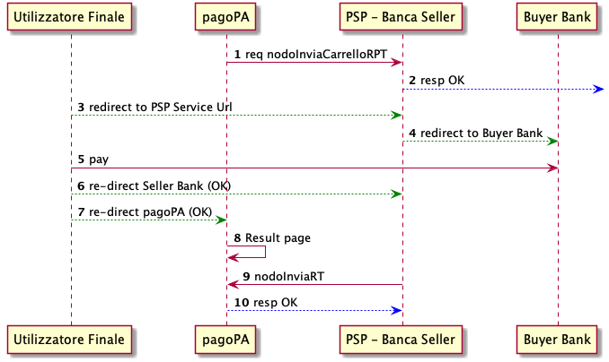

## Banca Seller
`[TBD da ricontrollare --> updated]`
MyBank compare come un unico strumento di pagamento all’interno della componente WISP del sistema pagoPA.
Secondo il paradigma di pagamento proprio di MyBank, un PSP aderente a pagoPA può offire il servizio di pagamento con MyBank operando come Banca Seller. 

All'interno del WISP, l'utente trova esposto il servizio MyBank con il relativo logo; Selezionando il servizio viene presentata una pagina di selezione dove l'utente può ricercare e selezionare la propria banca ( *Banca Buyer* ).
Una volta selezionata la banca, la piattaforma individuerà una PSP aderente come *Banca Seller* della transazione.

La Banca Seller proposta in maniera automatica (ON_US) applicherà nell’ordine i seguenti criteri:

* La stessa Banca Buyer nel caso sia essa eroghi il servizio di Banca Seller.
* La Banca Seller di preferenza indicata dalla Banca Buyer. La Banca Buyer può esprimere tale preferenza purché essa stessa sia aderente a pagoPA.
* La Banca Seller presso la quale l’Ente Creditore detenga il conto descritto nel tag Ibanaccredito nella prima RPT del carrello.

Nel caso in cui nessuno dei criteri precedenti non sia applicabile, la Banca Seller sarà selezionata (NOT_ON_US) con algoritmo round-robin tra quelle aderenti a pagoPA.
*Nota: i costi di commissione esposti all'utente sul WISP sono i costi di commissioni applicati dalla Banca Seller , ai quali si aggiungono eventuali costi aggiuntivi propri della Banca Buyer e che dipendono dal rapporto tra l'utente e la propria banca.

UNa volta selezionata la Banca Seller, il processo di pagamento continue secondo il seguente diagramma


1. la piattaforma invia i dettagli del pagamento alla Banca Seller , tramite la `pspInviaCarrelloRPT` con specificato all’interno del parametro `parametriProfiloPagamento` il campo `ValidationServiceID` con il valore associato alla selezione della Banca Buyer da parte dell’utente.
2. il PSP valida le informazioni ricevute e notifica la presa in carico del pagamento.
3. l'utente viene re-indirizzato verso il servizio web esposto dal servizio MyBank della banca Seller selezionata specificando all’interno dei parametri del canale. Durante la redirect viene utilizzato il medesimo `parametriProfiloPagamento` inviato nella primitiva `pspInviaCarrelloRPT`.
4. Il servizio web esposto dalla Banca Seller deve elaborare i dati ricevuti ed inoltrare automaticamente il Browser dell’utente verso la Banca Buyer istruendo il pagamento MyBank, dove l’utente segue tutti i passi necessari per poter autorizzare il pagamento.
5. L'utente conclude l'operazione di pagamento all'interno del portale della Banca Buyer 
6. Concluso il pagamento, la Banca Buyer effettua un redirect sul portale della Banca Seller.
7.  Preso nota dell’esito della transazione , la Banca Seller effettua redirect verso il WISP comunicando l’esito della transazione (OK o KO).
8. Il WISP mostra una pagina di riepilogo del pagamento avvenuto evidenziandone l’esito.
9. La Banca Seller provvede, in base all’esito ricevuto, ad emettere una RT.

La Banca Seller provvederà, in base all’esito ricevuto, ad emettere il flusso di rendicontazione entro D+2.


### Workflow di riconciliazione

Il servizio di pagamento MyBank, non influisce sul ciclo di riconciliazione del pagamento specificato nelle linee guida pagoPA `[TBD SANP ?]`.

L’introduzione del servizio di pagamento MyBank introduce all’interno del flusso di pagamento un ulteriore soggetto (Banca Buyer) che genera un SCT verso la Banca Seller. I tempi di istruzione e riversamento di tale SCT non devono compromettere la tempistica del normale workflow di riconciliazione di pagoPA. Definito con:

* `P`: il pagamento dovuto verso l’EC da parte dell’utente
* `X`: la commissione pubblicata su pagoPA del servizio di Banca Seller
* `Y`: la commissione applicata dalla Banca Buyer per l’esecuzione del bonifico (definita negli accordi tra l’utente e la propria banca)

Allora: 

* La Banca Seller istruirà un pagamento tramite MyBank alla Banca Buyer pari a `P+X`
* La Banca Buyer mostrerà all’utente il _costo totale dell’operazione_, pari a` P+X+Y`
* La Banca Buyer eseguirà un bonifico pari a `P+X` verso un conto tecnico della Banca Seller
* La Banca Seller eseguirà un bonifico pari a `P` verso l’EC (eventualmente cumulativo)

### Redirect HTTP dal WISP al servizio Banca Seller 

Il Servizio offerto dalla Banca Seller viene richiamato con un URL composto nel seguente modo:

`<urlPortalePSP>?[idDominio=<identificativoDominio>]&cfEnteCreditore=<identificativoDominio>IDVS=<ValidationServiceID>&<parametriPagamentoImmediato>&[idCarrello=<identificativoCarrello>][&lang=it]`
	
Dove:

* `urlPortalePSP` - è lo URL del Portale del Prestatore del Servizio Banca Seller. Viene indicato all’interno della configurazione del servizio (Catalogo Dati Informativi / urlPaymentService)
* `idDominio` - identificativo dell’EC che ha inviato la nodoInviaRPT. E' opzionale per motivi di retrocompatibilità, definito dalla presenza o meno di nodoInviaRPT.  
* `cfEnteCreditore` - identificativo dell’EC che ha eseguito la richiesta di pagamento. Dovrebbe coincidere con almeno un EC all’interno del carrello RPT. `[TBD "Dovrebbe" o "Deve" ?]`
* `IDVS` - (identificativo validation service) corrisponde al codice MyBank "Participant ID"
* `parametriPagamentoImmediato` - query string contenente parametri specifici del PSP nel formato `idBruciatura=<valore>`. Viene restituita dal PSP all’interno della response alla primitiva pspInviaCarrelloRPT
* `idCarrello` - identificativo del carrello inviato tramite la primitiva pspInviaCarrelloRPT, è 
opzionale per motivi di retrocompatibilità
* `lang` - specifica la lingua scelta dall'utilizzatore finale, secondo il formato RFC 5646 (default lingua italia)

### Response alla pspInviaCarrelloRPT / pspInviaRPT

La response alla primitiva` pspInviaCarrelloRPT`, o `pspInviaRPT`, deve contenere il parametro `parametriPagamentoImmediato` nel formato `idBruciatura=<valore>`. Tale valore deve essere utilizzato al PSP affinché possa correlare la richiesta effettuata dal back-end con la relativa redirect al servizio.

```
<esitoComplessivoOperazione>OK</esitoComplessivoOperazione>
<identificativoCarrello>cart15978256934316186</identificativoCarrello>  // è inteso obbligatorio per questo modello ma opzionale nell'interfaccia per retrocompatibilità.
<parametriPagamentoImmediato>idBruciatura=15978256934316186</parametriPagamentoImmediato>            
...
```

### HTTP redirect di ritorno dal PSP verso il WISP

A conclusione delle operazioni di pagamento, il PSP deve chiamare la pagina del WISP tramite un URL composto nel seguente modo::

`<urlWeb-FESP>?[idDominio=<identificativoDominio>&]<parametriPagamentoImmediato> [&idCarrello=<identificativoCarrello>]&<codiceRitornoPSP>`

Dove

* `urlWeb-FESP` - è lo URL della componente Web pagoPA
* `parametriPagamentoImmediato` - query string contenente parametri specifici del PSP, deve contenere il medesimo valore della redirect verso il servizio del PSP
* `idCarrello` - identificativo del carrello di cui si indica l’esito, deve contenere il medesimo valore della redirect verso il servizio del PSP
* `codiceRitornoPSP` - definisce l’esito dell’operazione, può assumere i valori: OK | KO | DIFFERITO


