Back-office
===========

Revoca e storno
---------------

Il NodoSPC mette a disposizione servizi di interscambio che i soggetti
aderenti possono utilizzare per realizzare indifferentemente processi di
storno e/o revoca di pagamento, purché siano intesi come funzionalità di
supporto del sistema pagoPA a cui ricorrere unicamente per sanare
situazioni di eccezione. Ogni soggetto aderente rileva la disponibilità
della controparte ad avviare tali processi mediante dati di
configurazione.

Come specificato nella figura successiva, tali funzionalità sono
istanziate per scopi di business ben definiti; ad esempio per il rientro
da situazioni anomale o di incoerenza nei documenti prodotti durante il
ciclo di vita del pagamento, rispetto allo stato di fatto del pagamento
stesso. Al variare del soggetto istanziante e delle motivazioni che
innescano l’esecuzione del processo, possono verificarsi le situazioni
mostrate nella figura seguente.

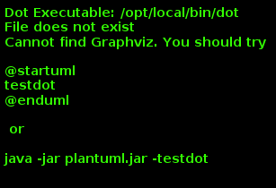

**Figura** **1: Attori coinvolti nell'innesco dei processi di revoca e
storno di una RT**

  **Processo**    **Innesco**
  --------------- ------------------
  RevocaRT        Avviato dal PSP
  Storno          Avviato dall’EC

**Tabella** **1: Soggetti che istanziano i processi di Revoca e Storno
di un pagamento**

Il processo di revoca può essere a sua volta diversificato sulla base
delle motivazioni che ne determinano l’innesco, come da tabella
successiva:

+------+---------+--------------------------------------------------------------+
| **Pr | **Tipol | **Descrizione**                                              |
| oces | ogia**  |                                                              |
| so** |         |                                                              |
+======+=========+==============================================================+
| Revo | Annullo | Innescato dal PSP quando, in casi assolutamente eccezionali, |
| caRT | Tecnico | lo stato effettivo del pagamento non è coerente con i        |
|      |         | documenti in possesso dell’Utilizzatore finale:              |
|      |         |                                                              |
|      |         | -   il PSP ha emesso una RT negativa e l’importo dovuto      |
|      |         |     risulta addebitato al soggetto versante il quale è in    |
|      |         |     possesso di una attestazione di pagamento                |
|      |         | -   Il PSP ha emesso una RT positiva ma il soggetto versante |
|      |         |     non è stato addebitato della somma dovuta né è in        |
|      |         |     possesso di una attestazione di pagamento                |
|      |         |                                                              |
|      |         | Si fa presente che è fatto obbligo per il PSP di             |
|      |         | implementare le funzionalità di annullo tecnico e per EC di  |
|      |         | predisporre le opportune soluzioni tecniche per la gestione  |
|      |         | di tali richieste.                                           |
+------+---------+--------------------------------------------------------------+
|      | *charge | Innescato dal PSP nel caso in cui l’Utilizzatore finale      |
|      | -back*  | chieda il riaccredito delle somme versate per un pagamento   |
|      | Utente  | conclusosi con esito positivo                                |
+------+---------+--------------------------------------------------------------+
| Stor | Storno  | L’Utilizzatore finale richiede all’EC lo storno delle somme  |
| no   |         | precedentemente pagate al PSP.                               |
|      |         |                                                              |
|      |         | Si fa presente che non è fatto obbligo al PSP implementare   |
|      |         | tale funzionalità                                            |
+------+---------+--------------------------------------------------------------+

**Tabella** **2: Descrizione sintetica delle motivazioni per l'innesco
dei processi di revoca e storno**

### Processo di Revoca per Annullo Tecnico

Il processo di revoca di una ricevuta telematica per Annullo Tecnico
consente il rientro da situazioni anomale o di incoerenza nello stato di
fatto del pagamento rispetto a quanto rappresentato dalla RT generata
dal PSP attestante il pagamento. Il caso d’uso nominale è rappresentato
nella tabella successiva.

+---------+------------------------------------------------------------------+
| Pre-Con | -   è stata recapitata all’EC una RT positiva, ma l’Utilizzatore |
| dizione |     finale non è stato addebitato                                |
|         | -   è stata recapitata all’EC una RT negativa, ma l’Utilizzatore |
|         |     finale è stato addebitato                                    |
|         | -   la richiesta di Annullo Tecnico è avanzata entro le ore      |
|         |     01:00 del giorno solare successivo a quello di creazione     |
|         |     della RT (*dataOraMessaggioRicevuta*)                        |
+---------+------------------------------------------------------------------+
| Trigger | Il PSP ha evidenza di una squadratura puntuale fra incasso e     |
|         | relativa RT .                                                    |
+---------+------------------------------------------------------------------+
| Descriz | -   il PSP sottomette al NodoSPC la richiesta di revoca di una   |
| ione    |     RT;                                                          |
|         | -   il NodoSPC valida la richiesta e la accetta;                 |
|         | -   l’EC riceve mediante il NodoSPC la richiesta di revoca;      |
|         | -   l’EC valida la richiesta di revoca producendo il relativo    |
|         |     esito;                                                       |
|         | -   l’EC invia al PSP, mediante il NodoSPC, l’esito della        |
|         |     richiesta di revoca                                          |
|         | -   Il PSP produce e invia la RT che sovrascrive quella revocata |
+---------+------------------------------------------------------------------+
| Post-Co | -   Il pagamento transisce allo stato *Pagamento\_revocato*      |
| ndizion |                                                                  |
| e       |                                                                  |
+---------+------------------------------------------------------------------+

**Tabella** **3: Caso d'uso del processo di revoca per annullo tecnico**

L’evoluzione temporale del processo di revoca è il seguente:

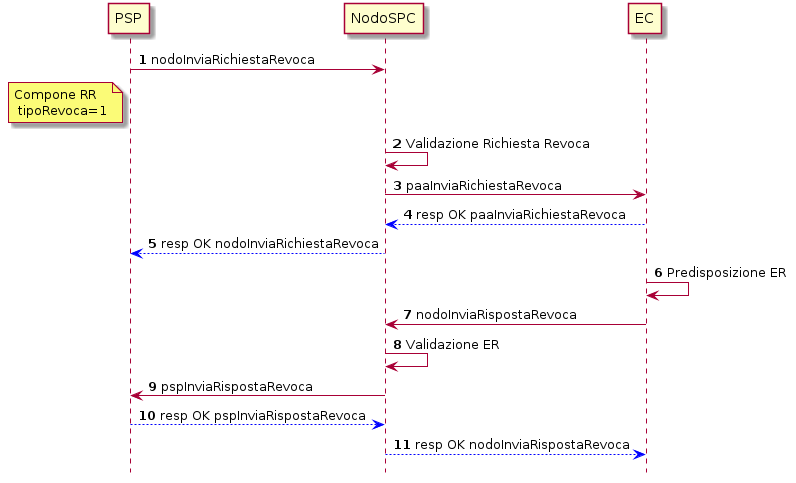

**Figura** **2: Diagramma di sequenza del processo di revoca di una RT
per Annullo Tecnico**

1.  il PSP compone il documento XML per la richiesta di revoca e lo
    sottomette all’EC attraverso il NodoSPC mediante la primitiva
    *nodoInviaRichiestaRevoca*;
    a.  In questo caso il valore del campo *tipoRevoca* all’interno
        della struttura *datiRevoca* sarà pari ad 1;

2.  il NodoSPC valida la richiesta inviata dal PSP;
3.  il NodoSPC inoltra la richiesta di revoca all’EC mediante la
    primitiva *paaInviaRichiestaRevoca*;
4.  l’EC replica al PSP fornendo esito positivo mediante *response* alla
    primitiva precedente;
5.  il NodoSPC inoltra la replica dell’EC al PSP fornendo *response*
    positiva alla primitiva di cui al punto 1.
6.  l’EC esegue il *rollback* del sistema relativamente alla posizione
    debitoria interessata e predispone il documento informativo XML ER
    attestante l’esito della revoca;
7.  l’EC invia il documento ER al PSP mediante il Nodo attraverso la
    primitiva *nodoInviaRispostaRevoca*;
8.  il NodoSPC valida il documento ER ricevuto;
9.  il NodoSPC inoltra il documento ER al PSP mediante la primitiva
    *pspInviaRispostaRevoca*;
10. il PSP conferma la ricezione del messaggio di esito della revoca
    fornendo *response* OK alla primitiva precedente;
11. il NodoSPC conferma all’EC la ricezione dell’esito della revoca da
    parte del PSP fornendo *response* OK alla primitiva di cui al punto
    7.

Il *workflow* si conclude con l’invio da parte del PSP della RT che
andrà a sovrascrivere quella revocata. In questo caso il parametro
*Forzacontrollosegno* nella SOAP *request* *nodoInviaRT* deve essere
impostato a 1.

### Processo di Revoca di una Ricevuta Telematica per charge-back

Il processo di revoca per *charge-back* di una RT è innescato dal PSP
solo verso l’EC che aderisce al servizio e sarà realizzabile solo per i
pagamenti effettivamente revocabili (sono esclusi tutti i pagamenti a
fronte di servizi già erogati al momento della richiesta di
*charge-back*) purché la posizione debitoria dell’utilizzatore finale
risulti pagata. Il caso d’uso nominale è così descritto:

+------------+---------------------------------------------------------------+
| Pre-Condiz | -   Pagamento effettuato con esito positivo – Stato           |
| ione       |     Pagamento: *RT\_EC*                                       |
|            | -   Adesione dell’EC al servizio di revoca per *charge-back*  |
|            | -   Il pagamento è rimborsabile dall’EC                       |
+------------+---------------------------------------------------------------+
| Trigger    | L’Utilizzatore finale avanza la richiesta di revoca al PSP    |
|            | con cui ha effettuato il pagamento                            |
+------------+---------------------------------------------------------------+
| Descrizion | -   Il PSP sottomette al NodoSPC la richiesta di revoca della |
| e          |     RT                                                        |
|            | -   Il NodoSPC valida la richiesta e la accetta               |
|            | -   L’EC riceve mediante il NodoSPC la richiesta di revoca    |
|            | -   L’EC valida la richiesta di revoca, esegue il *rollback*  |
|            |     del sistema e produce il relativo esito                   |
|            | -   L’EC invia al PSP mediante il NodoSPC l’esito della       |
|            |     richiesta di revoca                                       |
|            | -   Il *workflow* si conclude senza l’invio di una nuova RT   |
+------------+---------------------------------------------------------------+
| Post-Condi | -   Il pagamento transisce allo stato *Pagamento Revocato*    |
| zione      |                                                               |
+------------+---------------------------------------------------------------+

**Tabella** **4: Scenario d'uso del processo di revoca di una RT per
charge-back**

Al pari dei casi d’uso riportati nei capitoli precedenti, l’evoluzione
temporale e le primitive coinvolte nel processo di revoca sono riportate
nella figura successiva, avendo cura di notare che il caso d’uso
rappresenta lo scenario in cui le cui invocazioni SOAP si concludono con
esito positivo (esito: OK come parametro di *output*).

**Figura** **3: Diagramma di sequenza del processo di revoca per
charge-back**

1.  l’Utilizzatore finale richiede al PSP attestante il pagamento la
    revoca della RT per *charge-back*;
2.  il PSP compone il documento informativo XML Richiesta di Revoca (RR)
    e la invia al NodoSPC mediante la primitiva SOAP
    *nodoInviaRichiestaRevoca;*
3.  il NodoSPC valida la richiesta di revoca;
4.  il NodoSPC invia la richiesta di revoca all’EC mediante la primitiva
    *paaInviaRichiestaRevoca;*
5.  l’Ente Creditore, accettata la RR, replica al PSP attraverso il
    NodoSPC fornendo *response* OK;
6.  il NodoSPC inoltra al PSP la replica positiva dell’EC fornendo
    *response* OK alla primitiva di cui al punto 2.
7.  l’EC, dopo aver verificato positivamente la possibilità di revoca
    della RT, riporta la Posizione Debitoria allo stato precedente al
    pagamento e procede alla generazione del documento informativo XML
    Esito Revoca (ER);
8.  l’EC invia il documento ER al PSP mediante il Nodo attraverso la
    primitiva *nodoInviaRispostaRevoca;*
9.  il NodoSPC valida il documento ER ricevuto;
10. il NodoSPC inoltra il documento ER al PSP mediante la primitiva
    *pspInviaRispostaRevoca;*
11. il PSP conferma la ricezione del messaggio di esito della revoca
    fornendo *response* OK alla primitiva precedente;
12. il NodoSPC conferma all’EC la ricezione dell’esito della revoca da
    parte del PSP fornendo *response* OK alla primitiva di cui al punto
    8;
13. il PSP notifica l’Utilizzatore finale circa l’esito positivo della
    procedura di revoca della ricevuta telematica.

### Processo di Storno di un pagamento

Il processo di storno di un pagamento, attivato dall’EC, è innescato
quando l’Utilizzatore finale richieda a vario titolo la cancellazione di
un pagamento precedentemente avvenuto. Il caso d’uso nominale e
l’evoluzione temporale sono mostrate nella figura successiva.

+-----------+----------------------------------------------------------------+
| Pre-Condi | -   Il PSP utilizzato per il pagamento supporti le             |
| zione     |     funzionalità di storno                                     |
|           | -   Il pagamento si trova nello stato RT EC                    |
+-----------+----------------------------------------------------------------+
| Trigger   | L’utilizzatore richiede lo storno di un pagamento              |
|           | precedentemente avvenuto                                       |
+-----------+----------------------------------------------------------------+
| Descrizio | -   L’Ente Creditore sottomette al PSP mediante il nodo una    |
| ne        |     richiesta di storno generando il documento RR-Richiesta    |
|           |     Revoca                                                     |
|           | -   Il PSP replica positivamente e genera il documento ER      |
|           |     inviato all’Ente Creditore mediante il NodoSPC.            |
+-----------+----------------------------------------------------------------+
| Post-Cond | -   Il pagamento si trova nello stato RT Stornata              |
| izione    |                                                                |
+-----------+----------------------------------------------------------------+

**Tabella** **5: Caso d'uso del processo di storno di un pagamento**

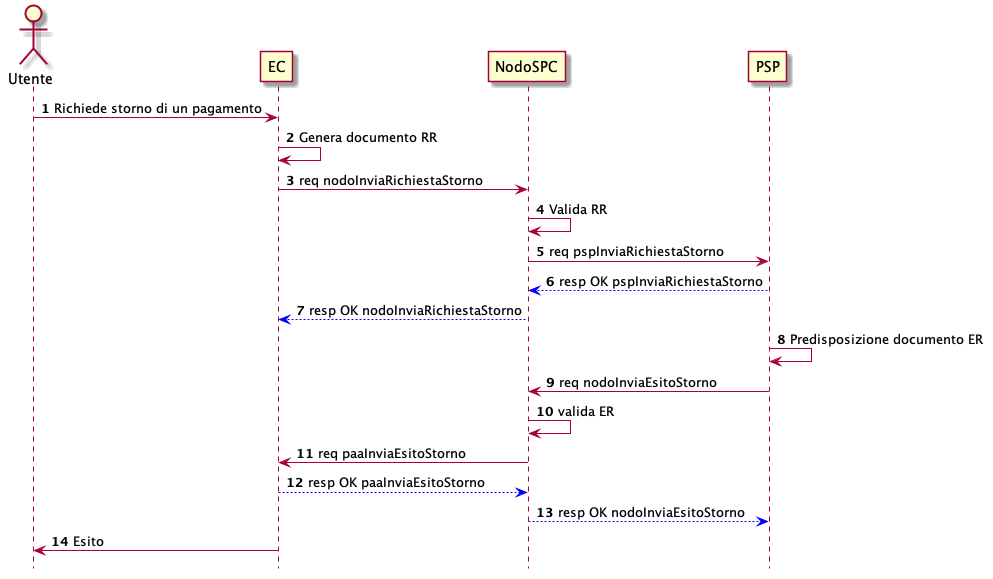

**Figura** **4: Evoluzione temporale del processo di storno di un
pagamento**

1.  l’Utilizzatore finale richiede lo storno di un pagamento effettuato
    all’EC;
2.  l’EC genera il documento XML RR;
3.  mediante la primitiva *nodoInviaRichiestaStorno* l’EC invia al
    NodoSPC il documento RR;
4.  il NodoSPC valida il documento RR ricevuto;
5.  il NodoSPC inoltra al PSP la RR generata dall’EC mediante la
    primitiva *pspInviaRichiestaStorno;*
6.  il PSP replica positivamente alla primitiva precedente fornendo
    *Esito* OK*;*
7.  il NodoSPC inoltra la replica precedente all’EC fornendo *response*
    OK alla primitiva di cui al punto 3;
8.  il PSP predispone il documento Esito Revoca – RR;
9.  il PSP inoltra all’EC mediante il NodoSPC l’esito della revoca
    attraverso la primitiva *nodoInviaEsitoStorno;*
10. il NodoSPC valida il documento ER;
11. il NodoSPC inoltra all’Ente Creditore il documento ER mediante la
    primitiva *paaInviaEsitoStorno;*
12. l’EC replica positivamente al PSP mediante il NodoSPC fornendo
    *response* OK alla primitiva di cui al punto 11;
13. il NodoSPC inoltra la replica precedente al PSP fornendo *response*
    OK mediante la primitiva *nodoInviaEsitoStorno;*
14. l’EC informa l’Utilizzatore finale in merito all’esito delle
    operazioni di storno.

Riconciliazione
---------------

All’interno di questo paragrafo vengono descritti i casi d’uso che
descrivono il processo contabile operato dall’Ente Creditore al fine di
riconciliare i pagamenti effettuati dall’Utilizzatore finale.

### Attori del processo di Riconciliazione Contabile e casi d’uso

Gli attori coinvolti nel processo di riconciliazione sono i seguenti:

-   **Ente Creditore:** rappresenta una Pubblica Amministrazione che ha
    ricevuto i pagamenti effettuati dall’Utilizzatore finale e necessita
    di riconciliare i pagamenti a suo favore
-   **PSP:** rappresenta un Prestatore di Servizi di Pagamento che ha
    accreditato il conto di un EC con le somme incassate nella giornata
    operativa
-   **Banca Tesoriera/ Cassiera:** rappresenta il Prestatore di Servizi
    di Pagamento che gestisce il conto di incasso di un EC. E’ il
    destinatario del flusso di riversamento SCT e notifica all’EC
    l’avvenuto incasso su sistemi esterni a pagoPA.

### Worflow di Riconciliazione

Il processo di riconciliazione comporta il seguente *workflow* dove
saranno utilizzati i seguenti termini:

-   Giorno D: giorno lavorativo in cui è stato eseguito il pagamento
-   Giorno D+1: giorno lavorativo successivo al giorno D
-   Giorno D+2: giorno lavorativo successivo al giorno D+1
-   *Cut-off*: orario di termine della giornata operativa. (NB la
    giornata operativa pagoPA termina alle ore 13)

+-------+--------------------------------------------------------------------+
| Pre-C | -   L’EC ha ricevuto dei pagamenti su un conto destinato           |
| ondiz |     all’incasso tramite pagoPA                                     |
| ione  | -   Entro D+1 il PSP accredita (con uno o più SCT) il conto        |
|       |     dell’EC per l’importo delle somme relative a RPT con valore    |
|       |     del *tag* *dataOraMessaggioRichiesta* antecedente al *cut-off* |
|       |     della giornata operativa pagoPA del giorno D.                  |
|       | -   Per ogni SCT cumulativo di più pagamenti, il PSP genera un     |
|       |     flusso di rendicontazione, contenente la distinta dei          |
|       |     pagamenti cumulati.                                            |
|       | -   Entro D+2 il PSP sottomette al NodoSPC il flusso di            |
|       |     rendicontazione di cui al punto precedente.                    |
|       | -   Il Nodo valida la richiesta e archivia il flusso rendendolo    |
|       |     disponibile per l’EC.                                          |
+-------+--------------------------------------------------------------------+
| Trigg | L’EC riconcilia gli accrediti SCT ricevuti sul conto indicato      |
| er    | nelle RPT                                                          |
+-------+--------------------------------------------------------------------+
| Descr | -   L’EC richiede la lista dei flussi disponibili sul Nodo         |
| izion |     relativa ai pagamenti da riconciliare.                         |
| e     | -   L’EC richiede il flusso di interesse, lo riceve e procede alla |
|       |     riconciliazione dei pagamenti.                                 |
+-------+--------------------------------------------------------------------+
| Post- | Il pagamento transisce allo stato *Pagamento Rendicontato*         |
| Condi |                                                                    |
| zione |                                                                    |
+-------+--------------------------------------------------------------------+

**Tabella** **7: Worflow di Riconciliazione**

L’evoluzione temporale è la seguente:

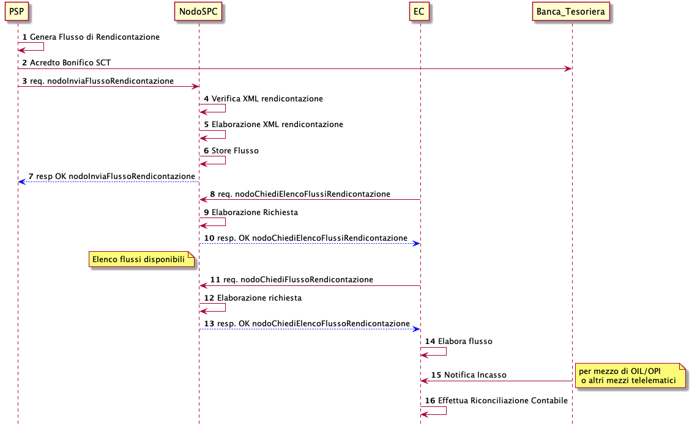

**Figura** **5: Diagramma di sequenza del processo di riconciliazione
contabile**

1.  il PSP genera il flusso di rendicontazione componendo il file XML di
    rendicontazione codificato in *base64*;
2.  il PSP accredita con SCT il conto di un EC. L’importo dello SCT può
    essere pari all’importo di un singolo pagamento ovvero pari
    all’importo cumulativo di più pagamenti, purché tali pagamenti siano
    stati incassati a favore del medesimo EC nella medesima giornata
    operativa pagoPA.

Nel caso di riversamento cumulativo, l’SCT dovrà riportare all’interno
dell’attributo AT-05 *(Unstructured Remittance Information*) il valore:

/PUR/LGPE-RIVERSAMENTO/URI/\<identificativoFlusso\>,

dove *identificativoFlusso* specifica il dato relativo all’informazione
di rendicontazione inviata al NodoSPC.

Nel caso di riversamento singolo, l’SCT dovrà riportare all’interno
dell’attributo AT-05 *(Unstructured Remittance Information*) il valore
della causale di versamento indicato nella RPT.

3.  il PSP, mediante la primitiva *nodoInviaFlussoRendicontazione*,
    invia al NodoSPC il flusso di rendicontazione generato, valorizzando
    i parametri di input *identificativoFlusso* con l’identificativo del
    flusso di rendicontazione da trasmettere e il parametro
    *xmlRendicontazione* con il file XML di rendicontazione codificato
    in base64.

4.  il NodoSPC verifica il file XML di rendicontazione;
5.  il NodoSPC elabora il file XML di rendicontazione*;*
6.  il NodoSPC esegue l’archiviazione del flusso di rendicontazione
    sulle proprie basi di dati;
7.  il NodoSPC replica fornendo esito OK alla primitiva
    *nodoInviaFlussoRendicontazione;*

8.  l’EC, mediante la primitiva *nodoChiediElencoFlussiRendicontazione,*
    richiede al NodoSPC la lista dei flussi di rendicontazione
    disponibili;
9.  il NodoSPC elabora la richiesta;
10. il NodoSPC, a seguito della validazione della richiesta, replica con
    *response* OK fornendo in output la lista completa di tutti i flussi
    disponibili per l’EC;
11. l’EC richiede al NodoSPC uno specifico flusso di rendicontazione
    presente nella lista, mediante la primitiva
    *nodoChiediFlussoRendicontazione* valorizzando nella *request* il
    parametro di input *identificativoFlusso* con l’identificativo del
    flusso di rendicontazione richiesto*;*
12. il NodoSPC elabora la richiesta.

13. il Nodo invia all’Ente Creditore il flusso richiesto mediante
    *response* positiva alla primitiva di cui al punto 11.
14. l’EC elabora il flusso di rendicontazione veicolandolo verso i
    propri sistemi di riconciliazione;
15. l’EC riceve dalla propria Banca di Tesoreria in modalità digitale un
    flusso contenente i movimenti registrati sul proprio conto; in caso
    di utilizzo da parte dell’EC di SIOPE+, tale flusso è rappresentato
    dal Giornale di Cassa nel formato OPI;
16. L’EC, sulla base dell’identificativo flusso ricevuto nel file XML di
    rendicontazione e delle RT archiviate, effettua la riconciliazione
    contabile.

### Motore di Riconciliazione

L’obiettivo del presente paragrafo è quello di tratteggiare in termini
essenziali il modello concettuale di un algoritmo (il Motore di
riconciliazione) che consenta al singolo EC di riconciliare i flussi
informativi degli incassi messi a disposizioni da pagoPA con quelli
finanziari. Nel flusso sono altresì riportate, sempre in ottica del
singolo EC, le attività che ci si attende siano compiute dalla singola
controparte PSP.

Nell’ipotesi semplificativa in cui la data richiesta per il pagamento
coincida con la data di invio della richiesta di pagamento, il processo
di riconciliazione opera riproducendo ricorsivamente un ciclo di quattro
passi da compiersi nella successione riportata di seguito per ogni PSP
aderente al NodoSPC:

+--------------------+--------------------+--------------------+--------------------+
| **Passo**          | **Descrizione**    | **Attività EC**    | **Attività PSP**   |
+====================+====================+====================+====================+
| 1.                 | Quadratura degli   | A chiusura del     | A chiusura della   |
|                    | incassi            | giorno lavorativo  | giornata operativa |
|                    |                    | (D), il motore     | il PSP, controlla  |
|                    |                    | individua le RPT   | la quadratura      |
|                    |                    | inviate prima del  | degli incassi      |
|                    |                    | cut-off. Per       | eseguiti per l’EC  |
|                    |                    | ognuna di tali RPT | determinando:      |
|                    |                    | il motore          |                    |
|                    |                    | seleziona le       | -   Gli IUV per    |
|                    |                    | corrispondenti RT, |     cui ha emesso  |
|                    |                    | ne controlla la    |     RT+            |
|                    |                    | quadratura e       | -   Gli IUV da     |
|                    |                    | distingue,         |     rendicontare   |
|                    |                    | accantonandole,    |     con codice 9   |
|                    |                    | quelle relative a  |                    |
|                    |                    | un incasso (RT+).  | Determina inoltre  |
|                    |                    | Ai fini dei        | gli importi dello  |
|                    |                    | successivi passi   | SCT Cumulativo e   |
|                    |                    | del processo di    | degli SCT singoli  |
|                    |                    | rendicontazione    | da eseguire.       |
|                    |                    | sarà altresì       |                    |
|                    |                    | necessario         |                    |
|                    |                    | individuare gli    |                    |
|                    |                    | IUV per i quali, a |                    |
|                    |                    | causa di una       |                    |
|                    |                    | eccezione,         |                    |
|                    |                    | l’incasso, benché  |                    |
|                    |                    | sia stato          |                    |
|                    |                    | effettuato non     |                    |
|                    |                    | corrisponde a una  |                    |
|                    |                    | RT. Tali incassi   |                    |
|                    |                    | saranno            |                    |
|                    |                    | rendicontati       |                    |
|                    |                    | mediante           |                    |
|                    |                    | *codiceEsitoSingol |                    |
|                    |                    | oPagamento*        |                    |
|                    |                    | 9 nel caso di      |                    |
|                    |                    | riversamento       |                    |
|                    |                    | cumulativo.        |                    |
+--------------------+--------------------+--------------------+--------------------+
| 2.                 | Ricezione SCT      | nel giorno D+1, la | Esegue SCT di cui  |
|                    |                    | Banca              | al punto 1         |
|                    |                    | Cassiera/Tesoriera |                    |
|                    |                    | dell’EC riceve dal |                    |
|                    |                    | PSP, tramite SCT,  |                    |
|                    |                    | i flussi           |                    |
|                    |                    | finanziari         |                    |
|                    |                    | relativi agli      |                    |
|                    |                    | incassi del giorno |                    |
|                    |                    | D. In generale,    |                    |
|                    |                    | per ogni PSP, l’EC |                    |
|                    |                    | può ricevere un    |                    |
|                    |                    | SCT cumulativo e   |                    |
|                    |                    | un numero          |                    |
|                    |                    | indeterminato di   |                    |
|                    |                    | SCT singoli        |                    |
|                    |                    | relativi a una     |                    |
|                    |                    | sola RT+           |                    |
+--------------------+--------------------+--------------------+--------------------+
| 3.                 | Quadratura FDR     | nel giorno D+2 il  | Il PSP genera il   |
|                    |                    | motore,            | FDR, associandolo  |
|                    |                    | interrogando il    | allo SCT di cui al |
|                    |                    | NodoSPC, può       | punto 2 con il     |
|                    |                    | effettuare il      | dato               |
|                    |                    | downloading del    | identificativoFlus |
|                    |                    | Flusso di          | so,                |
|                    |                    | Rendicontazione    | indicando:         |
|                    |                    | (FDR) relativo al  |                    |
|                    |                    | giorno D. Il       | -   Gli IUV per i  |
|                    |                    | motore può quindi  |     quali ha       |
|                    |                    | controllare la     |     emesso RT+     |
|                    |                    | quadratura dello   |     codiceEsitoSin |
|                    |                    | FDR, abbinando ad  | goloPagamento      |
|                    |                    | esso, in base allo |     pari a 0       |
|                    |                    | IUV, le RT+        | -   Gli IUV        |
|                    |                    | relative al giorno |     rendicontati   |
|                    |                    | D, gli ulteriori   |     con            |
|                    |                    | incassi non        |     codiceEsitoSin |
|                    |                    | corrispondenti a   | goloPagamento      |
|                    |                    | una RT e gli ER    |     pari a 9       |
|                    |                    | (Esito Revoca)     | -   IUV associati  |
|                    |                    | eventualmente      |     a un Estio     |
|                    |                    | contenuti nel FDR. |     Revoca         |
|                    |                    | In questo ultimo   |     accettato      |
|                    |                    | caso il motore     |     dall’EC (ER+)  |
|                    |                    | esclude gli ER     |                    |
|                    |                    | rendicontati dal   | Infine mette a     |
|                    |                    | novero degli ER da | disposizione       |
|                    |                    | controllare.       | dell’EC il FDR     |
|                    |                    | Inoltre il motore, | relativo al giorno |
|                    |                    | nel processo di    | D                  |
|                    |                    | quadratura,        |                    |
|                    |                    | distingue gli      |                    |
|                    |                    | importi a          |                    |
|                    |                    | compensazione (in  |                    |
|                    |                    | eccesso o difetto) |                    |
|                    |                    | eventualmente      |                    |
|                    |                    | contenuti nel FDR. |                    |
|                    |                    | Per ogni PSP, il   |                    |
|                    |                    | motore distingue e |                    |
|                    |                    | accantona le RT+   |                    |
|                    |                    | non abbinate a un  |                    |
|                    |                    | FDR (RTS)          |                    |
+--------------------+--------------------+--------------------+--------------------+
| 4.                 | Quadratura         | A chiusura del     |                    |
|                    | riversamenti SCT   | giorno lavorativo  |                    |
|                    |                    | D+2 il motore      |                    |
|                    |                    | elabora tutte le   |                    |
|                    |                    | notifiche di       |                    |
|                    |                    | incasso relative   |                    |
|                    |                    | al giorno D+1      |                    |
|                    |                    | ricevute dalla     |                    |
|                    |                    | Banca              |                    |
|                    |                    | Cassiera/Tesoriera |                    |
|                    |                    | (nel caso SIOPE+   |                    |
|                    |                    | la notifica è      |                    |
|                    |                    | rappresentata dal  |                    |
|                    |                    | "Giornale di       |                    |
|                    |                    | Cassa" OPI). Per   |                    |
|                    |                    | ogni PSP il motore |                    |
|                    |                    | conclude il        |                    |
|                    |                    | processo di        |                    |
|                    |                    | riconciliazione    |                    |
|                    |                    | eseguendo le       |                    |
|                    |                    | seguenti           |                    |
|                    |                    | elaborazioni:      |                    |
|                    |                    |                    |                    |
|                    |                    | 1.  Esegue la      |                    |
|                    |                    |     quadratura di  |                    |
|                    |                    |     ogni           |                    |
|                    |                    |     riversamento   |                    |
|                    |                    |     singolo in     |                    |
|                    |                    |     abbinamento    |                    |
|                    |                    |     con la         |                    |
|                    |                    |     corrispondente |                    |
|                    |                    |     RTS            |                    |
|                    |                    |     controllando   |                    |
|                    |                    |     che:           |                    |
|                    |                    | 2.  L’Identificati |                    |
|                    |                    | vo                 |                    |
|                    |                    |     univoco        |                    |
|                    |                    |     versamento     |                    |
|                    |                    |     (IUV) che      |                    |
|                    |                    |     identifica la  |                    |
|                    |                    |     singola RTs    |                    |
|                    |                    |     coincida con   |                    |
|                    |                    |     la componente  |                    |
|                    |                    |     “identificativ |                    |
|                    |                    | o                  |                    |
|                    |                    |     univoco        |                    |
|                    |                    |     versamento”    |                    |
|                    |                    |     nel dato       |                    |
|                    |                    |     “*Unstructured |                    |
|                    |                    |     Remittanced    |                    |
|                    |                    |     Information*”  |                    |
|                    |                    |     di cui al      |                    |
|                    |                    |     tracciato del  |                    |
|                    |                    |     SEPA Credit    |                    |
|                    |                    |     Transfer nel   |                    |
|                    |                    |     caso di        |                    |
|                    |                    |     versamento     |                    |
|                    |                    |     effettuato     |                    |
|                    |                    |     tramite SCT    |                    |
|                    |                    |     ovvero nel     |                    |
|                    |                    |     campo causale  |                    |
|                    |                    |     nel caso di    |                    |
|                    |                    |     versamento     |                    |
|                    |                    |     effettuato     |                    |
|                    |                    |     tramite        |                    |
|                    |                    |     bollettino di  |                    |
|                    |                    |     conto corrente |                    |
|                    |                    |     postale.       |                    |
|                    |                    | 3.  Il valore del  |                    |
|                    |                    |     tag            |                    |
|                    |                    |     *importoTotale |                    |
|                    |                    | Pagato*            |                    |
|                    |                    |     della stessa   |                    |
|                    |                    |     RTs            |                    |
|                    |                    |     corrisponda    |                    |
|                    |                    |     con l’importo  |                    |
|                    |                    |     effettivamente |                    |
|                    |                    |     trasferito.    |                    |
|                    |                    | 4.  Esegue la      |                    |
|                    |                    |     quadratura di  |                    |
|                    |                    |     ogni           |                    |
|                    |                    |     riversamento   |                    |
|                    |                    |     cumulativo, in |                    |
|                    |                    |     abbinamento    |                    |
|                    |                    |     con il         |                    |
|                    |                    |     corrispondente |                    |
|                    |                    |     FDR            |                    |
|                    |                    |     controllando   |                    |
|                    |                    |     che:           |                    |
|                    |                    | 5.  L’Identificati |                    |
|                    |                    | vo                 |                    |
|                    |                    |     del FDR        |                    |
|                    |                    |     coincida con   |                    |
|                    |                    |     la componente  |                    |
|                    |                    |     “identificativ |                    |
|                    |                    | o                  |                    |
|                    |                    |     flusso         |                    |
|                    |                    |     versamento”    |                    |
|                    |                    |     nel dato       |                    |
|                    |                    |     “*Unstructured |                    |
|                    |                    |     Remittance     |                    |
|                    |                    |     Information*”  |                    |
|                    |                    |     di cui al      |                    |
|                    |                    |     tracciato del  |                    |
|                    |                    |     SEPA Credit    |                    |
|                    |                    |     Transfer nel   |                    |
|                    |                    |     caso di        |                    |
|                    |                    |     versamento     |                    |
|                    |                    |     effettuato     |                    |
|                    |                    |     tramite SCT    |                    |
|                    |                    | 6.  Il valore del  |                    |
|                    |                    |     tag            |                    |
|                    |                    |     *importoTotale |                    |
|                    |                    | Pagamenti*         |                    |
|                    |                    |     nel FDR        |                    |
|                    |                    |     corrisponda    |                    |
|                    |                    |     con l’importo  |                    |
|                    |                    |     effettivamente |                    |
|                    |                    |     trasferito.    |                    |
+--------------------+--------------------+--------------------+--------------------+

**Tabella** **8: Motore di Riconciliazione**

### Gestione degli errori

Il paragrafo mostra le strategie di risoluzione per gli errori che
possono verificarsi durante l’esecuzione del processo di quadratura
mediante il motore di riconciliazione, rispetto ai passi presi in esame
nella descrizione dell’MDR stesso.

#### Passo3: Quadratura FDR

-   **FDR non quadra**

#### Passo4: Quadratura riversamenti SCT

-   **Riversamento in difetto**

-   **SCT ad integrazione di un riversamento Cumulativo in difetto:** la
    Causale del SCT dovrà essere valorizzata come segue:
    **/PUR/LGPE-INTEGRAZIONE/URI/\< identificativoFlusso \>**
    identificativoFlusso identifica lo FDR per il quale è stato
    effettuato un riversamento in difetto.
-   **SCT ad integrazione di un riversamento Singolo**: la causale del
    SCT dovrà essere valorizzata come segue:
    -   /RFS/\<IUV\>/\<importo\>[/TXT/Integrazione]

-   /RFB/\<IUV\>[/\<importo\>][/TXT/Integrazione]

-   **Riversamento in eccesso**

Nel presente scenario l’EC riscontra condizioni di squadratura in
eccesso tra gli SCT riversati dai PSP e le somme specificate nella RTs o
dal FDR nel caso di riversamento singolo o cumulativo, rispettivamente.
In tale circostanza la compensazione avviene in modalità manuale da
concordare tra le controparti attraverso il tavolo operativo.

Gestione degli errori
---------------------

### Gestione degli errori di revoca

Il paragrafo mostra i casi di errore che si possono verificare durante
il processo di richiesta di revoca di una Ricevuta Telematica, sia nel
caso di revoca per Annullo Tecnico che per Charge-Back. Con assoluta
generalità si documentano nei paragrafi successivi le tipologie di
errori che afferiscono alle categorie “Errori Controparte” ed “Errori
Validazione”; come specificato nel paragrafo Architettura Funzionale.
Nell’analisi degli scenari si assume l’ulteriore semplificazione che
l’interazione applicativa tra il NodoSPC ed i soggetti fruitori dei
servizi esposti dal Nodo stesso non sia soggetta a fenomeni di timeout o
congestione di rete. Si fa presente che nella gestione del ciclo di vita
del pagamento tutti i casi riportati in seguito comportano la mancata
ricezione del documento ER attestante l’esito positivo o meno del
processo di revoca del pagamento.

**RR Rifiutata dal NodoSPC**

  -------- ---------------------------------------------------------------
  Pre-cond Il PSP sottomette all’EC una Richiesta di Revoca di una RT
  izione   

  Descrizi Il NodoSPC esegue la validazione del documento RR replicando
  one      esito KO all’invocazione di invio richiesta revoca da parte del
           PSP.

  Post-con Lo stato del pagamento è in Revoca Rifiutata
  dizione  
  -------- ---------------------------------------------------------------

**Tabella** **9: RR Rifiutata dal NodoSPC**

**Figura** **6: Diagramma di sequenza nel caso di RR rifiutata dal
Nodo**

L’evoluzione temporale è la seguente:

1.  l’utilizzatore finale richiede la revoca di una RT [^1];
2.  il PSP sottomette al NodoSPC il documento RR mediante la primitiva
    *nodoInviaRichiestaRevoca;*
3.  il NodoSPC valida la richiesta;
4.  il NodoSPC emana *response* KO emanando un *faultBean* il cui
    *faultBean.faultCode* è rappresentativo dell’errore riscontrato; in
    particolare:
    -   PPT\_SINTASSI EXTRAXSD: in caso di errori nella SOAP *request*
    -   PPT\_SINTASSI\_XSD: in caso di errori nel documento XML RR
    -   PPT\_RR\_DUPLICATA: in caso di sottomissione di una richiesta di
        revoca precedentemente sottomessa
    -   PPT\_OPER\_NON\_REVOCABILE: nel caso non sussistano le
        condizioni per poter fruire del servizio di revoca (vedi caso
        d’uso nominale)
    -   PPT\_SEMANTICA: nel caso di errori semantici

5.  il PSP comunica all’Utilizzatore Finale l’impossibilità di procedere
    nell’operazione di revoca [^2].

Le azioni di controllo suggerite sono riportate nella Tabella successiva

  -------- -------- ------------------------------------------------------
  Strategi Tipologi Azione di Controllo Suggerita
  a        a        
  di       Errore   
  risoluzi          
  one               

           PPT\_OPE Verificare la revocabilità dell’operazione
           R\_NON\_ 
           REVOCABI 
           LE       

           PPT\_RR\ Verificare la composizione del documento XML RR e
           _DUPLICA della SOAP *request* (vedi documento “Elenco Controlli
           TA       Primitive NodoSPC” per la relativa
                    primitiva/*FAULT\_CODE*)

           PPT\_SIN 
           TASSI\_E 
           XTRAXSD  

           PPT\_SIN 
           TASSI\_X 
           SD       

           PPT\_SEM Verificare la composizione del documento XML RR (vedi
           ANTICA   documento “Elenco Controlli Primitive NodoSPC” per la
                    relativa primitiva/*FAULT\_CODE*)
  -------- -------- ------------------------------------------------------

**Tabella** **10: Strategie di risoluzione nel caso di RR rifiutata dal
Nodo**

**RR rifiutata dall’EC**

+----------+-----------------------------------------------------------------+
| Pre-cond | Il PSP sottomette all’EC una Richiesta di Revoca di una RT      |
| izione   |                                                                 |
+----------+-----------------------------------------------------------------+
| Descrizi | Il NodoSPC valida positivamente il documento informativo RR:    |
| one      |                                                                 |
|          | -   l’EC risponde negativamente alla revoca                     |
|          | -   Il NodoSPC propaga al PSP l’errore emesso dall’EC mediante  |
|          |     il *faultBean* il cui *faultBean.faultCode* è pari a        |
|          |     PPT\_ERRORE\_EMESSO\_DA\_PAA                                |
+----------+-----------------------------------------------------------------+
| Post-con | Lo stato del pagamento è in Revoca Rifiutata                    |
| dizione  |                                                                 |
+----------+-----------------------------------------------------------------+

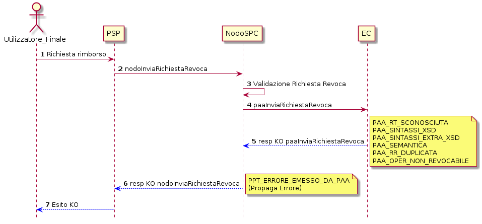

**Figura** **7: Diagramma di sequenza per il caso di errore di RR
rifiutata dall'EC**

L’evoluzione temporale del caso d’uso è la seguente (dal punto 4):

1.  il Nodo invia all’EC la Richiesta di Revoca mediante la primitiva
    *paaInviaRichiestaRevoca;*
2.  l’EC fornisce esito KO nella *response* emanando un *faultBean* il
    cui *faultBean.faultCode* è rappresentativo dell’errore riscontrato;
    in particolare:
    -   PAA\_RR\_DUPLICATA nel caso il PSP sottomette una richiesta di
        revoca precedentemente gestita
    -   PAA\_OPER\_NON\_REVOCABILE

3.  il NodoSPC inoltra l’errore emesso dall’EC fornendo *response* KO
    alla primitiva di cui al punto 1 dello scenario precedente.

La Tabella successiva mostra le azioni di controllo suggerite per la
risoluzione dell’anomalia.

  --------------------- --------------------- ----------------------------
  Strategia di          Tipologia Errore      Azione di Controllo
  risoluzione                                 Suggerita

                        PPT\_ERRORE\_EMESSO\_ Attivazione del Tavolo
                        DA\_PAA               Operativo
  --------------------- --------------------- ----------------------------

**Tabella** **11: Strategia di risoluzione dello scenario RR rifiutata
dall'EC**

**ER Rifiutata dal NodoSPC**

+--------------+-------------------------------------------------------------+
| Pre-condizio | L’EC ha verificato la revocabilità di una RT a seguito di   |
| ne           | una richiesta di revoca                                     |
+--------------+-------------------------------------------------------------+
| Descrizione  | -   L’EC compone il documento informativo di esito revoca   |
|              |     ER e lo invia al NodoSPC                                |
|              | -   Il NodoSPC esegue la validazione replicando con esito   |
|              |     negativo                                                |
+--------------+-------------------------------------------------------------+
| Post-condizi | Lo stato del pagamento è in Esito Revoca Rifiutata          |
| one          |                                                             |
+--------------+-------------------------------------------------------------+

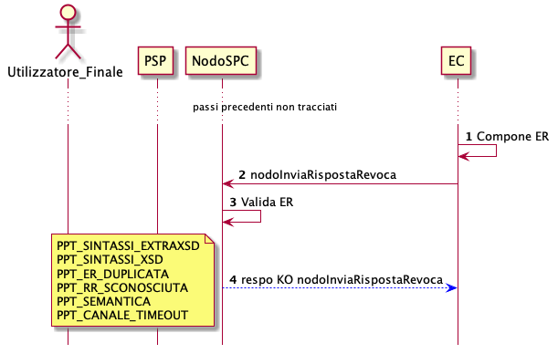

**Figura** **8: Diagramma di sequenza per lo scenario di ER rifiutata
dal Nodo**

L’evoluzione temporale dello scenario è il seguente­:

1.  l’EC predispone il documento ER;
2.  l’EC invia al NodoSPC il documento ER mediante la primitiva
    *nodoInviaRispostaRevoca;*
3.  il NodoSPC valida negativamente il documento ER;
4.  Il Nodo fornisce esito KO nella *response* della primitiva di cui al
    punto 2 dove il valore del parametro *faultBean.faultCode* è
    rappresentativo dell’errore riscontrato; in particolare:
    -   PPT\_ER\_DUPLICATA nel caso di sottomissione di una ER già
        inoltrata
    -   PPT\_RR\_SCONOSCIUTA nel caso in cui rispetto all’ER inviato non
        risultasse alcuna RR precedentemente gestita

La Tabella successiva mostra le azioni di controllo suggerite per la
risoluzione delle anomalie

  -------- -------- ------------------------------------------------------
  Strategi Tipologi Azione di Controllo Suggerita
  a        a        
  di       di       
  risoluzi Errore   
  one               

           PPT\_OPE Verificare la revocabilità dell’operazione
           R\_NON\_ 
           REVOCABI 
           LE       

           PPT\_RR\ Verificare la composizione del documento XML RR (vedi
           _DUPLICA documento “Elenco Controlli Primitive NodoSPC” per la
           TA       relativa primitiva/*FAULT\_CODE*) e della SOAP
                    *request*

           PPT\_SIN 
           TASSI\_E 
           XTRAXSD  

           PPT\_SIN 
           TASSI\_X 
           SD       

           PPT\_SEM Verificare la composizione del documento XML RR
           ANTICA   
  -------- -------- ------------------------------------------------------

**Tabella** **12: Azioni di controllo per la risoluzione dello scenario
di ER rifiutata dal Nodo**

**ER Rifiutata dal PSP**

  ------------ -----------------------------------------------------------
  Pre-condizio Il NodoSPC ha validato il documento ER
  ne           

  Descrizione  Il PSP replica con esito KO alla invio della Esito della
               Revoca da parte dell’EC

  Post-condizi Lo stato del pagamento è in Esito Revoca Rifiutata
  one          
  ------------ -----------------------------------------------------------

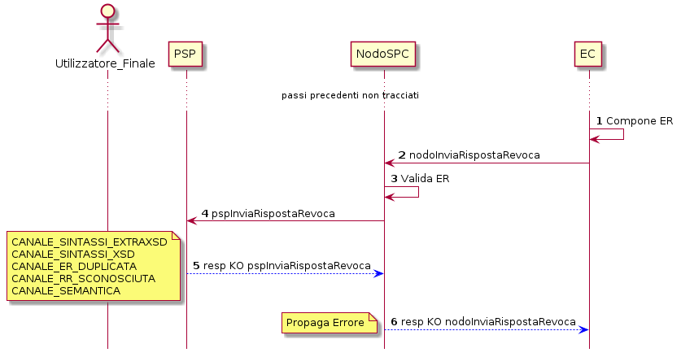

**Figura** **9: Diagramma di sequenza per il caso ER rifiutata dal PSP**

L’evoluzione dello scenario in esame è il seguente (si assume
validazione positiva da parte del NodoSPC, punto 3)

1.  il Nodo sottomette l’ER al PSP mediante la primitiva
    *pspInviaRispostaRevoca;*
2.  il PSP replica negativamente alla primitiva precedente fornendo
    *response* KO dove il valore del parametro *faultBean.faultCode* è
    rappresentativo dell’errore riscontrato; in particolare:
    -   CANALE\_ER\_DUPLICATA nel caso di ricezione di un ER
        precedentemente sottomessa
    -   CANALE\_RR\_SCONOSCIUTA nel caso l’ER sottomesso dal NodoSPC non
        corrisponda ad una precedente RR.

La Tabella successiva mostra le azioni di controllo suggerite per la
risoluzione dell’anomalia

  -------------------------------------------------------------------------
  **Strategia di           Tipologia Errore     Azione di Controllo
  risoluzione**                                 Suggerita
  ------------------------ -------------------- ---------------------------
                           PPT\_ERRORE\_EMESSO\ Attivazione del Tavolo
                           _DA\_PAA             Operativo
  -------------------------------------------------------------------------

**Tabella** **13: Strategia di risoluzione dello scenario RR rifiutata
dall'EC**

### Gestione degli errori di storno

Il paragrafo mostra i casi di errore che si possono verificare durante
il processo di storno di un pagamento. Con assoluta generalità si
documentano le tipologie di errori riportate nei paragrafi successivi
che afferiscono alle categorie “Errori Controparte” ed “Errori
Validazione”. Nell’analisi degli scenari si assume l’ulteriore
semplificazione che l’interazione applicativa tra il NodoSPC ed i
soggetti fruitori dei servizi esposti dal Nodo stesso non sia soggetta a
fenomeni di timeout o congestione di rete. Si fa presente che nella
gestione del ciclo di vita del pagamento tutti i casi riportati in
seguito comportano la mancata ricezione del documento ER attestante
l’esito positivo o meno del processo di storno del pagamento.

**Richiesta Storno rifiutata dal Nodo**

  -------------- ---------------------------------------------------------
  Pre-condizione L’EC esegue una richiesta di storno

  Descrizione    Il Nodo a seguito della validazione replica fornendo
                 esito negativo

  Post-condizion Il pagamento si trova in stato Storno Rifiutato
  e              
  -------------- ---------------------------------------------------------

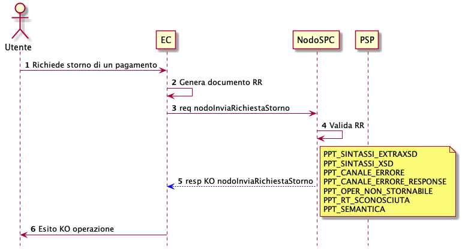

**Figura** **10: Diagramma di sequenza dello scenario richiesta storno
rifiutata dal Nodo**

L’evoluzione temporale è la seguente:

1.  l’Utilizzatore finale richiede all’EC lo storno di un pagamento;
2.  l’EC genera il documento xml RR;
3.  l’EC sottomette al NodoSPC il documento RR mediante la primitiva
    *nodoInviaRichiestaStorno;*
4.  il NodoSPC valida il documento RR;
5.  il NodoSPC replica negativamente alla primitiva precedente fornendo
    *response* KO dove il valore del parametro *faultBean.faultCode* è
    rappresentativo dell’errore riscontrato; in particolare:
    -   PPT\_OPER\_NON\_STORNABILE nel caso in cui il PSP con il quale è
        stato effettuato il pagamento non supporta le funzionalità di
        storno
    -   PPT\_RT\_SCONOSCIUTA nel caso in cui la richiesta di storno non
        risulti associata ad alcuna RT positiva

La tabella successiva mostra le azioni di controllo suggerite per la
risoluzione delle anomalie.

  -------------------------------------------------------------------------
  Strategi Tipolog Azione di Controllo Suggerita
  a        ia      
  di       Errore  
  risoluzi         
  one              
  -------- ------- --------------------------------------------------------
           PPT\_SI Verificare la composizione del documento XML RR (vedi
           NTASSI\ documento “Elenco Controlli Primitive NodoSPC” per la
           _EXTRAX relativa primitiva/*FAULT\_CODE*) e della SOAP *request*
           SD      

           PPT\_SI 
           NTASSI\ 
           _XSD    

           PPT\_RT Verificare la composizione del documento XML RR e della
           \_SCONO SOAP *request* con particolare riferimento alla
           SCIUTA  congruenza tra dati RR e dati presenti nella RT
                   attestante il pagamento da stornare

           PPT\_OP Verificare la composizione del documento XML RR e della
           ER\_NON SOAP *request*; verificare l’adesione del PSP alle
           \_STORN funzionalità di storno.
           ABILE   

           PPT\_SE Verificare la composizione del documento XML RR (vedi
           MANTICA documento “Elenco Controlli Primitive NodoSPC” per la
                   relativa primitiva/*FAULT\_CODE*)
  -------------------------------------------------------------------------

**Tabella** **14: Azioni di controllo suggerite per lo scenario
Richiesta Storno rifiutata dal Nodo**

**Richiesta Storno Rifiutata dal PSP**

  ------------------------------------------------------------------------
  Pre-condizione  Il NodoSPC ha validato la richiesta di storno sottomessa
                  dall’EC
  --------------- --------------------------------------------------------
  Descrizione     Il PSP valida la richiesta di storno e fornisce esito KO

  Post-condizione Il pagamento si trova in stato Storno Rifiutato
  ------------------------------------------------------------------------

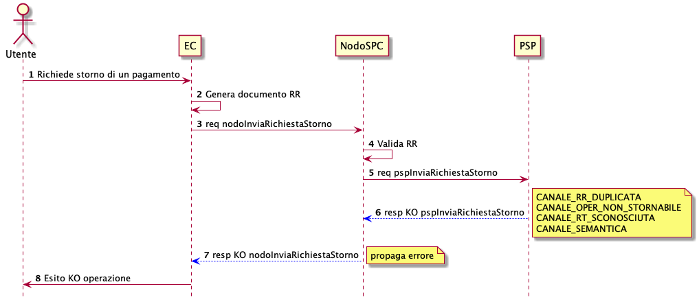

**Figura** **11: Evoluzione temporale dello scenario richiesta storno
rifiutata dal PSP**

L’evoluzione temporale è la seguente (dal punto 4):

1.  il NodoSPC valida positivamente la richiesta di storno;
2.  il NodoSPC sottomette la richiesta di storno mediante la primitiva
    *pspInviaRichiestaStorno;*
3.  il PSP replica con esito KO indicando un fault.bean il cui
    fault.code specifica l’errore riscontrato; in particolare:
    -   CANALE\_SEMANTICA nel caso di errori nel tracciato XML RR
    -   CANALE\_OPER\_NON\_STORNABILE nel caso di operazione non
        stornabile dal PSP
    -   CANALE\_RR\_DUPLICATA nel caso in cui l’EC sottomette una
        richiesta di storno precedentemente inviata
    -   CANALE\_RT\_SCONOSCIUTA nel caso in cui non sussista
        corrispondenza tra la richiesta di storno e la RT attestante il
        pagamento da stornare

4.  il NodoSPC emette esito KO alla primitiva *nodoInviaRichiestaStorno*
    inoltrando l’errore riscontrato dal PSP emanando un *faultBean* il
    cui *faultBean.faultCode* è rappresentativo dell’errore riscontrato.
5.  l’EC notifica l’utilizzatore finale dell’esito KO dell’operazione.

La tabella successiva mostra le azioni di controllo suggerite per la
risoluzione dell’anomalia.

  ------------------------------------------------------------------------
  **Strategia di           **Tipologia        **Azione di Controllo
  risoluzione**            Errore**           Suggerita**
  ------------------------ ------------------ ----------------------------
                           PPT\_CANALE\_ERROR Attivazione del Tavolo
                           E                  Operativo
  ------------------------------------------------------------------------

**Tabella** **15: Azioni di controllo suggerite per lo scenario
Richiesta Storno rifiutata dal PSP**

**Esito Storno Rifiutato dal Nodo**

  --------- --------------------------------------------------------------
  Pre-condi Il PSP ha validato una richiesta di storno precedentemente
  zione     sottomessa dal NodoSPC e procede ad inviare l’esito storno

  Descrizio Il NodoSPC valida negativamente l’Esito storno
  ne        

  Post-cond Il pagamento si trova in stato Storno Rifiutato
  izione    
  --------- --------------------------------------------------------------

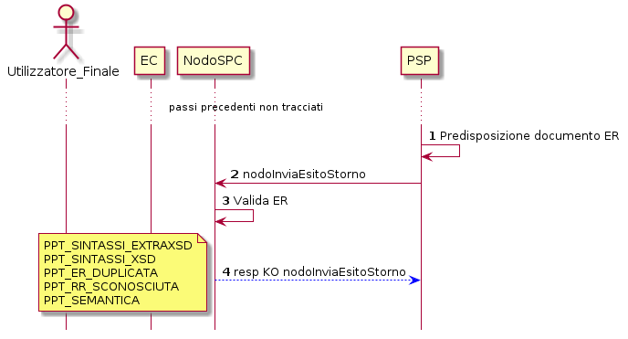

**Figura** **12: Scenario Esito Storno rifiutato dal Nodo**

L’evoluzione temporale è la seguente:

1.  il PSP predispone il documento XML ER attestante l’esito delle
    operazioni di storno;
2.  il PSP invia al NodoSPC il documento ER mediante la primitiva
    *nodoInviaEsitoStorno;*
3.  il NodoSPC valida negativamente la richiesta precedente;
4.  il NodoSPC fornisce *response* negativa mediante esito KO emanando
    un *faultBean* il cui *faultBean.FaultCode* è rappresentativo
    dell’errore riscontrato; in particolare:
    -   PPT\_ER\_DUPLICATA nel caso il PSP sottomette al NodoSPC un
        esito storno precedentemente inviato
    -   PPT\_RR\_SCONOSCIUTA nel caso il PSP sottomette al NodoSPC un
        documento ER non coerente con la precedente richiesta di storno
    -   PPT\_SEMANTICA nel caso il NodoSPC riscontrasse errori nel
        tracciato XML ER.

La tabella successiva mostra le azioni di controllo suggerite per la
risoluzione delle anomalie.

  ------------------------------------------------------------------------
  Strateg Tipolog Azione di Controllo Suggerita
  ia      ia      
  di      Errore  
  risoluz         
  ione            
  ------- ------- --------------------------------------------------------
          PPT\_SI Verificare la composizione del documento XML RR (vedi
          NTASSI\ documento “Elenco Controlli Primitive NodoSPC” per la
          _EXTRAX relativa primitiva/*FAULT\_CODE*) e della SOAP *request*
          SD      

          PPT\_SI 
          NTASSI\ 
          _XSD    

          PPT\_ER Verificare la composizione del documento XML RR e della
          \_DUPLI SOAP *request* con particolare riferimento alla
          CATA    congruenza tra dati RR e dati presenti nella RT
                  attestante il pagamento da stornare

          PPT\_RR 
          \_SCONO 
          SCIUTA  

          PPT\_SE Verificare la composizione del documento XML ER
          MANTICA Verificare la composizione del documento XML RR (vedi
                  documento “Elenco Controlli Primitive NodoSPC” per la
                  relativa primitiva/*FAULT\_CODE*)
  ------------------------------------------------------------------------

**Tabella** **16: Strategie di risoluzione per il caso ER rifiutata dal
Nodo**

**Esito Storno rifiutato dall’EC**

  --------- --------------------------------------------------------------
  Pre-condi Il PSP ha validato una richiesta di storno precedentemente
  zione     sottomessa dal NodoSPC e procede ad inviare l’esito storno

  Descrizio L’EC valida negativamente l’Esito storno
  ne        

  Post-cond Il pagamento si trova in stato Storno Rifiutato
  izione    
  --------- --------------------------------------------------------------

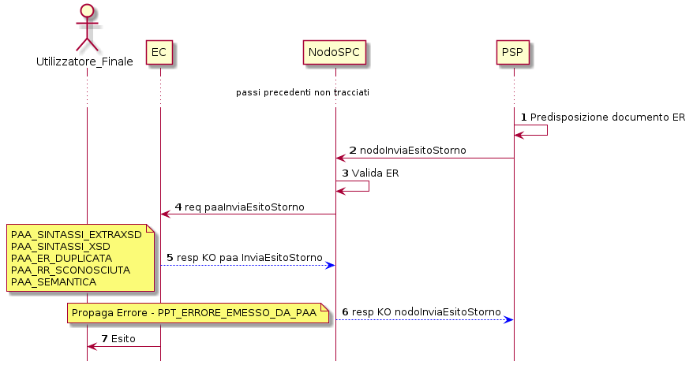

**Figura** **13: Scenario Esito Storno rifiutato da EC**

L’evoluzione temporale dello scenario è il seguente (dal punto 4):

1.  il NodoSPC invia il documento ER all’EC mediante la primitiva
    *paaInviaEsitoStorno;*
2.  l’EC risponde negativamente all’invocazione precedente mediante
    esito KO emanando un *faultBean* il cui *faultBean.faultCode* è
    rappresentativo dell’errore riscontrato; in particolare:
    a.  PAA\_ER\_DUPLICATA nel caso l’esito storno risultasse
        precedentemente inviato
    b.  PAA\_RR\_SCONOSCIUTA nel caso in cui all’ER sottomessa non
        corrisponda alcuna RR precedentemente generata
    c.  PAA\_SEMANTICA nel caso in cui si riscontrino errori nel
        tracciato ER

3.  il NodoSPC propaga l’errore riscontato dall’EC mediante faultBean il
    cui faultBean.faultCode è pari a PPT\_ERRORE\_EMESSO\_DA\_PAA.

La tabella successiva mostra le azioni di controllo suggerite per la
risoluzione delle anomalie

  ----------------------- -------------------- ---------------------------
  **Strategia di          **Tipologia Errore** **Azione di Controllo
  risoluzione**                                Suggerita**

                          PPT\_ERRORE\_EMESSO\ Attivazione del Tavolo
                          _DA\_PAA             Operativo
  ----------------------- -------------------- ---------------------------

**Tabella** **17: Strategie di risoluzione per il caso ER rifiutata
dall'EC**

**ER Mancante per timeout delle controparti**

Gli scenari di errore proposti nei paragrafi precedenti mostrano i
possibili casi di ER mancante a causa di errori applicativi
rappresentati dall’emanazione da parte degli attori coinvolti di un
faultBean contenente un’eccezione applicativa appartenente ad una
determinata famiglia di errori. Un ulteriore caso da prendere in esame è
rappresentato dall’impossibilità di chiusura del processo di storno nel
caso in cui le parti riscontrassero fenomeni di timeout.

  ------ -----------------------------------------------------------------
  Pre-co La posizione debitoria è nello stato Richiesta Storno Inviata
  ndizio 
  ne     

  Descri Il PSP e l’EC riscontrano fenomeni applicativo/infrastrutturali
  zione  per i quali si manifestano condizioni di *timeout*
         nell’invocazione delle primitive e/o nella ricezione delle
         relative *response*.

  Post-c Il pagamento permane in stato Richiesta Storno Inviata
  ondizi 
  one    
  ------ -----------------------------------------------------------------

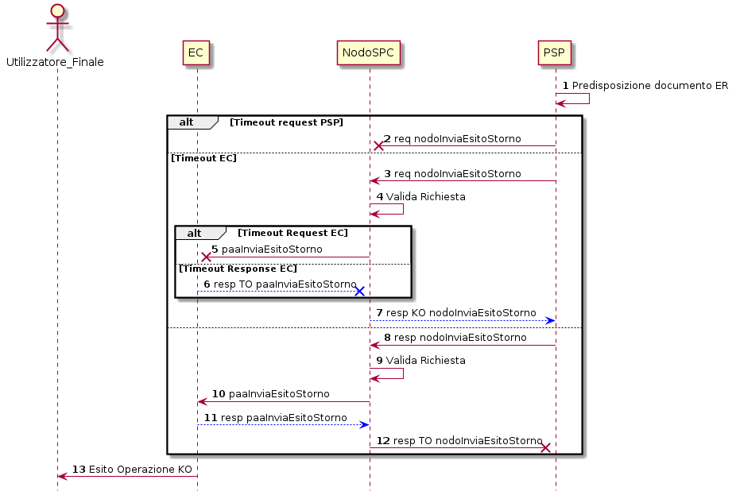

**Figura** **14: Evoluzione temporale dello scenario Esito Storno
mancate per timeout**

L’evoluzione temporale è la seguente:

1.  il PSP predispone il documento XML ER;

A questo punto sono possibili i seguenti scenari:

*Timeout* PSP in fase di invocazione

2.  La primitiva *nodoInviaEsitoStorno* non va a buon fine a causa di
    fenomeni di congestione imputabili al NodoSPC.

*Timeout* EC

3.  il PSP invia il documento ER mediante la primitiva
    *nodoInviaEsitoStorno*;
4.  Il NodoSPC valida positivamente la richiesta.

Alternativamente

5.  l’EC riscontra condizioni di *timeout* per le quali fallisce
    l’invocazione della primitiva *paaInviaEsitoStorno;*

oppure

6.  l’EC riscontra condizioni di *timeout* imputabili al NodoSPC per le
    quali la *response* alla primitiva *paaInviaEsitoStorno* non giunge
    al PSP.

In ogni caso

7.  il NodoSPC invia *response* KO alla primitiva *nodoInviaEsitoStorno*
    emanando un *faultBean* il cui *faultCode* è pari a
    PPT\_STAZIONE\_INT\_PA\_TIMEOUT.

*Timeout* PSP in ricezione *response*

8.  il PSP invia il documento ER mediante la primitiva
    *nodoInviaEsitoStorno*;
9.  Il NodoSPC valida positivamente la richiesta;
10. l’EC riceve l’esito storno mediante la primitiva
    *paaInviaEsitoStorno*;
11. l’EC emana *response* (di qualsiasi esito) alla primitiva
    precedente;
12. Il NodoSPC inoltra la *response* al PSP che fallisce per condizioni
    di *timeout*.

  -------------------- ------------------------ ---------------------------
  Strategia di         Tipologia Errore         Azione di Controllo
  risoluzione                                   Suggerita

                       PPT\_STAZIONE\_INT\_PA\_ Attivazione del Tavolo
                       TIMEOUT                  Operativo

                       Nessuna ricezione        
                       *response*               
  -------------------- ------------------------ ---------------------------

**Tabella** **18: strategia di risoluzione**

### Gestione degli errori di riconciliazione

Il paragrafo descrive la gestione degli errori che possono verificarsi
durante l’esercizio del processo di riconciliazione contabile. In
particolare sono prese in esame le eccezioni per le quali si riscontra
il fallimento delle primitive in gioco oppure l’esito negativo del
*workflow* di riconciliazione; tutte le eccezioni riportate non
permettono al pagamento di transire allo stato “Pagamento riconciliato”.
I casi di errore descritti prevedono l’attivazione del Tavolo Operativo
[^3] nel caso in cui i soggetti erogatori e fruitori dei servizi
applicativi risultassero impossibilitati a procedere in autonomia nella
risoluzione delle anomalie oppure l’azione di controllo suggerita non
risultasse risolutiva.

**SCT singolo in assenza di RPT**

  ----- ------------------------------------------------------------------
  Pre-c Il PSP ha incassato diversi servizi
  ondiz 
  ione  

  Descr Nell’elaborare un SCT singolo di riversamento relativamente ad un
  izion flusso di rendicontazione in assenza di RPT ( codice 9 ), il PSP
  e     evidenzia la mancanza di il PSP non evidenzia la mancanza della
        RPT.

  Post- N/A
  condi 
  zione 
  ----- ------------------------------------------------------------------

In caso di mancanza di RPT, il PSP non è in grado di valorizzare
l’attributo AT-05 con la causale di versamento in quanto tale
informazione sarebbe dovuta essere reperibile all’interno della RPT non
ricevuta.

Le possibili azioni di controllo sono riportate nella tabella
successiva:

  --------------------- --------------- -----------------------------------
  Strategia di          Tipologia       Azione di Controllo Suggerita
  risoluzione           Errore          

                        Flusso codice 9 E’ necessario attivare un TAVOLO
                                        OPERATIVO

                                        
  --------------------- --------------- -----------------------------------

**Invio flusso rifiutato dal NodoSPC**

  ------------- ----------------------------------------------------------
  Pre-condizion Il PSP invia al NodoSPC un flusso di rendicontazione
  e             

  Descrizione   Il NodoSPC esegue la validazione del flusso fornendo
                *response* negativa

  Post-condizio Lo stato del pagamento permane in *RT\_PAGATA*
  ne            
  ------------- ----------------------------------------------------------

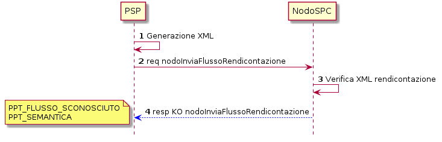

**Figura** **15: Evoluzione temporale dello scenario flusso rifiutato
dal Nodo**

L’evoluzione temporale dello scenario è la seguente:

1.  il PSP genera il flusso di rendicontazione componendo il file XML di
    rendicontazione codificato in *base64*;
2.  il PSP, mediante la primitiva *nodoInviaFlussoRendicontazione*,
    invia al NodoSPC il flusso di rendicontazione generato, valorizzando
    i parametri di input *identificativoFlusso* con l’identificativo del
    flusso di rendicontazione da trasmettere e il parametro
    *xmlRendicontazione* con il file XML di rendicontazione codificato
    in base64.
3.  il NodoSPC verifica il file XML di rendicontazione;

Eseguito uno degli scenari alternativi, il flusso procede come segue:

4.  il Nodo replica negativamente alla primitiva precedente fornendo
    *response* con esito KO emanando un *faultBean* il cui
    *faultBean.faultCode* rappresenta l’errore riscontrato; in
    particolare:
    -   PPT\_FLUSSO\_SCONOSCIUTO: il NodoSPC non riscontra alcuna
        congruenza tra il valore del parametro di input
        *identificativoFlusso* della primitiva di richiesta ed il valore
        del parametro *identificativoFlusso* nel file XML di
        rendicontazione;
    -   PPT\_SEMANTICA nel caso di riscontro di errori nel tracciato
        *xml* del file XML di rendicontazione.

Le possibili azioni di controllo sono riportate nella tabella
successiva:

  --------- -------- ------------------------------------------------------
  Strategia Tipologi Azione di Controllo Suggerita
  di        a        
  risoluzio Errore   
  ne                 

            PPT\_FLU Verificare la composizione della SOAP *request*
            SSO\_SCO *nodoInviaFlussoRendicontazione* ed il contenuto del
            NOSCIUTO file XML di rendicontazione

            PPT\_SEM Verificare la composizione del file XML di
            ANTICA   rendicontazione (vedi documento “Elenco Controlli
                     Primitive NodoSPC” per la relativa
                     primitiva/*FAULT\_CODE*)
  --------- -------- ------------------------------------------------------

**Tabella** **19: Strategia di risoluzione dello scenario Flusso
rifiutato dal Nodo**

**Timeout invio flusso di rendicontazione**

Il seguente scenario, nel trattare in generale il caso di timeout
successivo all’invio del flusso di rendicontazione, si sofferma sulla
gestione dei messaggi di errore maggiormente rappresentativi.

  ------------------------------------------------------------------------
  Pre-condiz Il tempo di attesa della *response* del NodoSPC supera il
  ione       *timeout* di cui al documento Livelli di Servizio
  ---------- -------------------------------------------------------------
  Descrizion Il NodoSPC manifesta condizioni di *timeout* ed il PSP esegue
  e          il relativo processo di gestione

  Post-condi Lo stato del pagamento permane in RT\_EC
  zione      
  ------------------------------------------------------------------------

L’evoluzione temporale è la seguente:

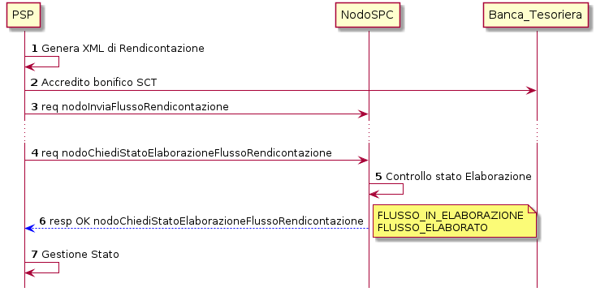

**Figura** **16: Timeout invio flusso di rendicontazione**

1.  il PSP genera il flusso di rendicontazione componendo il file XML di
    rendicontazione codificato in *base64*.
2.  il PSP accredita con SCT il conto dell’EC per l’importo delle somme
    incassate (l’SCT contiene l’indicazione del flusso di
    rendicontazione)
3.  il PSP invia al NodoSPC il file XML di rendicontazione da elaborare
    mediante la primitiva *nodoInviaFlussoRendicontazione;*

il NodoSPC non risponde manifestando una condizione di *timeout*;

4.  il PSP richiede lo stato di elaborazione del flusso di
    rendicontazione inviato mediante la primitiva
    *nodoChiediStatoElaborazioneFlussoRendicontazione* valorizzando il
    parametro di input *identificativoFlusso* con il valore
    dell’identificativo flusso di cui richiedere lo stato;
5.  Il NodoSPC effettua il controllo sullo stato di elaborazione del
    flusso inviato;
6.  Il NodoSPC replica mediante *response* OK alla primitiva di cui al
    punto 8 fornendo lo stato di elaborazione del flusso di
    rendicontazione; in particolare:
    -   FLUSSO\_IN\_ELABORAZIONE: il NodoSPC deve terminare le
        operazioni di archiviazione dei flussi sulle proprie basi di
        dati;
    -   FLUSSO\_ELABORATO: il NodoSPC ha elaborato il flusso di
        rendicontazione inviato dal PSP;

7.  il PSP gestisce lo stato riscontrato dal NodoSPC eliminando il file
    XML di rendicontazione nel caso di FLUSSO\_ELABORATO oppure
    attendendo oltre nel caso di FLUSSO\_IN\_ELABORAZIONE.

**Richiesta lista flussi di rendicontazione rifiutata dal NodoSPC**

  ------------------------------------------------------------------------
  Pre-cond La posizione debitoria si trova nello stato *PAGATA* e lo stato
  izioni   del pagamento è in *RT\_EC.* L’EC richiede la lista dei flussi
           di rendicontazione
  -------- ---------------------------------------------------------------
  Descrizi L’EC non riceve la lista dei flussi di rendicontazione
  one      richiesta ed è impossibilitato a procedere alla riconciliazione
           dei pagamenti

  Post-con Lo stato del pagamento è in *RT\_EC*
  dizione  
  ------------------------------------------------------------------------

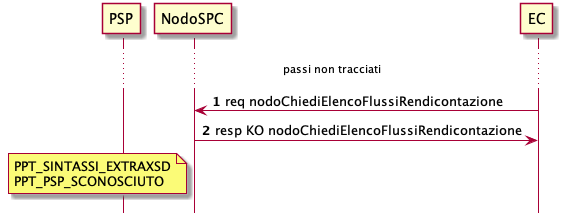

**Figura** **17: Richiesta lista flussi di rendicontazione rifiutata dal
NodoSPC**

L’evoluzione temporale dello scenario è la seguente:

1.  l’EC richiede, mediante la primitiva
    *nodoChiediElencoFlussiRendicontazione,* la lista dei flussi di
    rendicontazione archiviata sul NodoSPC*;*
2.  Il NodoSPC valida negativamente la richiesta ed emana *response*
    negativa con esito KO e *faultBean.FaultCode* rappresentativo
    dell’errore riscontrato.

  ------------------------------------------------------------------------
  Strategia Tipologi Azione di Controllo Suggerita
  di        a        
  risoluzio Errore   
  ne                 
  --------- -------- -----------------------------------------------------
            PPT\_SIN Verificare la composizione della SOAP *request* (vedi
            TASSI\_E documento “Elenco Controlli Primitive NodoSPC” per la
            XTRAXSD  relativa primitiva/*FAULT\_CODE*)

            PPT\_PSP Verificare il parametro *identificativoPSP* nella
            \_SCONOS SOAP *request*
            CIUTO    
  ------------------------------------------------------------------------

**Tabella** **20: Strategia di risoluzione dello scenario richiesta
lista flussi rifiutata dal Nodo**

**Richiesta Flusso Rifiutata dal Nodo / Nessun flusso presente**

  ------------------------------------------------------------------------
  Pre-con La posizione debitoria si trova nello stato *PAGATA* e lo stato
  dizione del pagamento è in *RT\_EC e* L’EC richiede uno specifico flusso
          di rendicontazione
  ------- ----------------------------------------------------------------
  Descriz L’Ente Creditore non riceve lo specifico flusso richiesto
  ione    

  Post-co Lo stato del pagamento è in RT\_EC
  ndizion 
  e       
  ------------------------------------------------------------------------

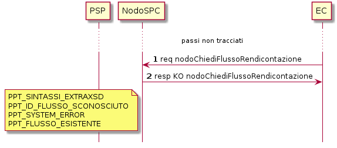

**Figura** **18: Evoluzione temporale dello scenario richiesta Flusso
rifiutata dal Nodo / Flusso mancate**

L’evoluzione temporale dello scenario è la seguente:

1.  l’EC richiede al NodoSPC uno specifico flusso di rendicontazione
    mediante la primitiva *nodoChiediFlussoRendicontazione;*
2.  il Nodo replica negativamente alla richiesta fornendo *response* con
    esito KO emanando un *faultBean* il cui *faultBean.faultCode*
    rappresenta l’errore riscontrato; in particolare:
    -   PPT\_SINTASSI\_EXTRAXSD: nel caso di errori di invocazione della
        SOAP *request;*
    -   PPT\_ID\_FLUSSO\_SCONOSCIUTO: nel caso l’EC richieda un flusso
        il cui *identificativoFlusso* risulti non registrato nelle basi
        di dati del NodoSPC;
    -   PPT\_SYSTEM\_ERROR: nel caso in cui il NodoSPC riscontri errori
        di sistema nell’elaborazione della richiesta;

  -------------------------------------------------------------------------
  Strategia Tipologia  Azione di Controllo Suggerita
  di        Errore     
  risoluzio            
  ne                   
  --------- ---------- ----------------------------------------------------
            PPT\_SINTA Verificare la composizione della richiesta SOAP
            SSI\_EXTRA (vedi documento “Elenco Controlli Primitive NodoSPC”
            XSD        per la relativa primitiva/*FAULT\_CODE*)

            PPT\_SEMAN 
            TICA       

            PPT\_ID\_F Verificare il valore del parametro di input IDFLUSSO
            LUSSO\_SCO nella richiesta SOAP
            NOSCIUTO   

            PPT\_SYSTE Ritentare nuovamente la richiesta del flusso di
            M\_ERROR   rendicontazione, altrimenti innescare il Tavolo
                       Operativo
  -------------------------------------------------------------------------

**Tabella** **21: Richiesta Flusso Rifiutata dal Nodo / Nessun flusso
presente**

[^1]: Attività da considerarsi solo nel caso di Revoca per Charge-Back

[^2]: Attività da considerarsi solo nel caso di Revoca per Charge-Back

[^3]: Per i dettagli del Tavolo Operativo si rimanda alla sezione IV.
