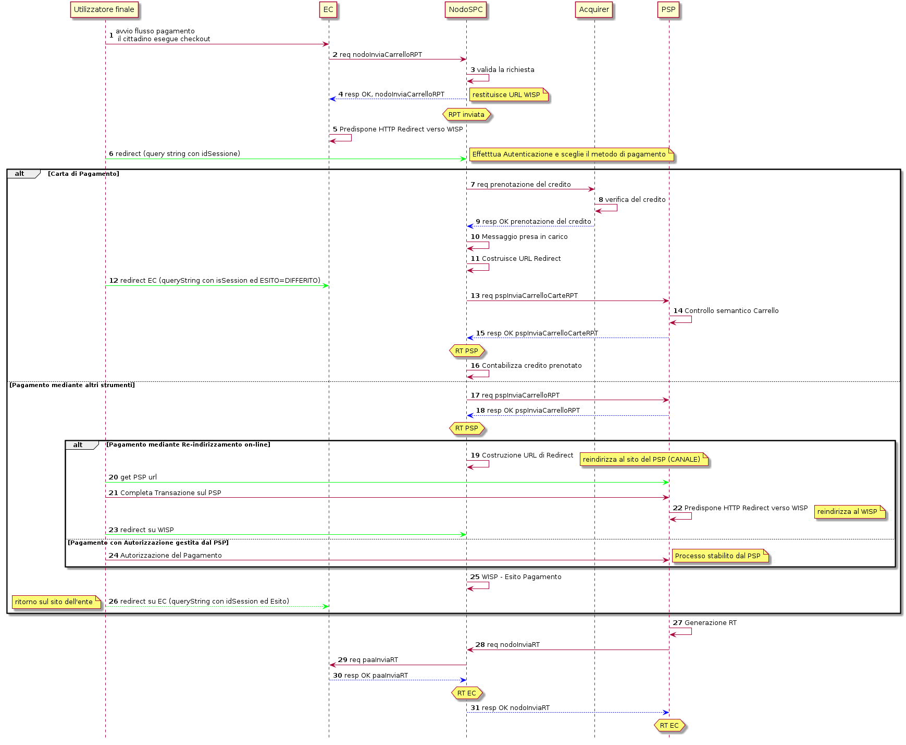
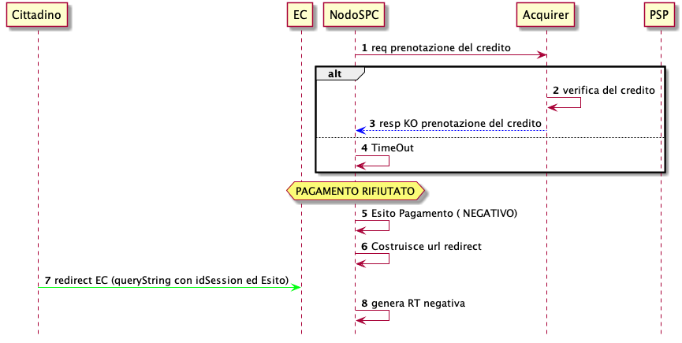
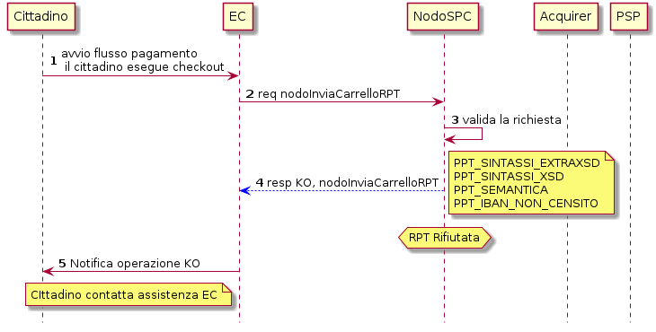
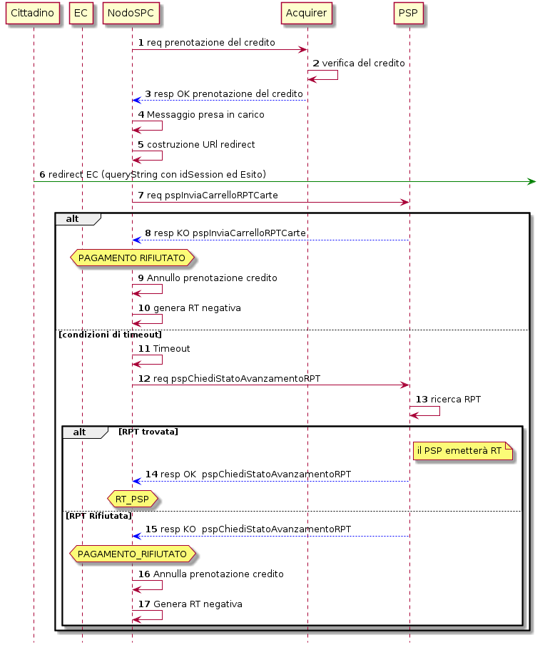
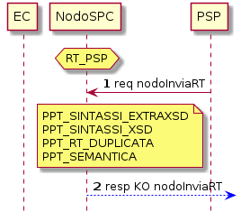
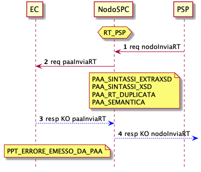

Pagamento presso l'ente creditore
=================================

Attori e casi d'uso
-------------------

All'interno di questo capitolo vengono descritti i casi d'uso per il
pagamento innescato dall'Utilizzatore Finale attraverso l'interazione
con i sistemi degli Enti Creditori aderenti al Sistema pagoPA.

Gli attori coinvolti nel processo di pagamento sono i seguenti:

-   **Ente Creditore**: rappresenta un soggetto aderente a pagoPA che
    rende disponibile all'Utilizzatore finale la possibilità di comporre
    un carrello pagabile *online* tramite un Portale *web* o una *mobile
    app*;
-   **PSP**: rappresenta un Prestatore di Servizi di Pagamento aderente
    a pagoPA che rende disponibile almeno un canale di pagamento
    accessibile tramite la componente WISP del NodoSPC;
-   **Utilizzatore finale**, rappresenta una persona fisica e/o
    giuridica che si interfaccia con le risorse *web* o *mobile* dell'EC
    al fine di ottenere un servizio.
-   **Acquirer:** è il soggetto attraverso il quale un PSP gestisce le
    transazioni con le carte di pagamento.

Lo scenario di utilizzo è descritto dal seguente caso d'uso nominale:

-   **Pagamento online con guida interattiva di selezione del PSP
    (WISP):** un Utilizzatore finale effettua il pagamento tramite il
    Portale *web* dell'EC. La scelta dello strumento di pagamento è
    guidata tramite apposita interfaccia *web* resa disponibile dal
    NodoSPC.

Pagamento online con guida interattiva di selezione del PSP (WISP)
------------------------------------------------------------------

+-----------------------------------+-----------------------------------+
| Pre-Condizione                    | L'Utilizzatore finale innesca il  |
|                                   | processo di pagamento riferito a  |
|                                   | una Posizione Debitoria aperta.   |
+-----------------------------------+-----------------------------------+
| Trigger                           | L'Utilizzatore finale esce dalla  |
|                                   | pagina di *check-out* sul Portale |
|                                   | dell'EC innescando il processo di |
|                                   | pagamento di un carrello di RPT   |
+-----------------------------------+-----------------------------------+
| Descrizione                       | -   L'EC compone il carrello di   |
|                                   |     RPT e lo invia al NodoSPC     |
|                                   | -   Il NodoSPC valida il carrello |
|                                   |     e replica all'EC fornendo la  |
|                                   |     URL di *redirect* per         |
|                                   |     re-direzionare il browser     |
|                                   |     dell'Utilizzatore finale      |
|                                   |     sulla pagina WISP per la      |
|                                   |     scelta interattiva del PSP    |
|                                   | -   L'Utilizzatore finale accede  |
|                                   |     al WISP e procede alla        |
|                                   |     selezione del servizio di     |
|                                   |     pagamento reso disponibile da |
|                                   |     un PSP.                       |
|                                   | -   Il NodoSPC invia al canale    |
|                                   |     del PSP scelto                |
|                                   |     dall'Utilizzatore finale il   |
|                                   |     carrello di RPT;              |
|                                   | -   Il PSP genera le RT           |
|                                   |     attestanti l'esito del        |
|                                   |     pagamento e la restituisce al |
|                                   |     NodoSPC                       |
|                                   | -   L'EC riceve le RT completando |
|                                   |     la transazione, potendo così  |
|                                   |     erogare il servizio           |
|                                   |     all'Utilizzatore finale       |
+-----------------------------------+-----------------------------------+
| Post-Condizione                   | Al termine delle operazioni il    |
|                                   | pagamento transisce allo stato    |
|                                   | RT-EC                             |
+-----------------------------------+-----------------------------------+

**Tabella** **1: Caso d\'uso del processo di pagamento online con guida
interattiva di selezione del PSP**

L'evoluzione nel tempo del processo di pagamento è la seguente:



**Figura** **1: Diagramma di sequenza del processo di pagamento iniziato
presso l\'EC**

1.  L'Utilizzatore finale, dopo aver eseguito le operazioni di
    composizione del carrello, esegue il *check-out* sul Portale
    dell'EC.
2.  Il Portale dell'EC compone il carrello di RPT e lo invia al NodoSPC
    mediante la primitiva *nodoInviaCarrelloRPT*.
3.  Il NodoSPC valida formalmente sintassi e semantica dell'invocazione.
    Tra i parametri sottoposti a controllo si menzionano:
    a.  *identificativoCarrello*: deve risultare univoco all'interno del
        Sistema pagoPA; il codice deve essere composto secondo il
        seguente formato:

```{=html}
<!-- -->
```
b.  *ibanAccredito*: deve risultare inserito nella lista dei conti
    correnti dell'EC configurati sul NodoSPC;
c.  *ibanAppoggio*: deve risultare inserito nella lista dei conti
    correnti dell'EC configurati sul NodoSPC;

```{=html}
<!-- -->
```
4.  Il NodoSPC fornisce la risposta all'invocazione precedente,
    modificando lo stato del pagamento in RPT Inviata e restituendo come
    parametri di output:
    a.  *URL di re-direzione:* risorsa a cui re-indirizzare il browser
        dell'Utilizzatore finale, contenente anche una query string
        "idSession=\<idSession\>" che identifica univocamente la
        sessione*;*
    b.  *esitoComplessivoOperazione*: rappresenta l'esito complessivo
        dell'operazione di invocazione che può assumere i valori OK e
        KO.
5.  l'EC predispone l'*http REDIRECT* verso la URL fornita nella
    *response* alla primitiva di cui al precedente punto 2.
6.  Il browser dell'Utilizzatore finale è re-direzionato verso il
    NodoSPC e l'Utilizzatore finale viene guidato nella selezione del
    servizio di pagamento.

A seconda delle scelte operate dall'Utilizzatore finale, sono possibili
due differenti scenari alternativi:

-   Pagamento con carta;
-   Pagamento con altri strumenti.

**Pagamento con carta**

7.  Dopo che l'Utilizzatore finale ha inserito i dati della Carta di
    Pagamento, selezionato l'*Acquirer* da utilizzare per la transazione
    (eventualmente proposto dal NodoSPC), visualizzato l'importo totale
    del pagamento e autorizzato lo stesso, il NodoSPC esegue verso
    l'*Acquirer* una richiesta di prenotazione del credito sulla carta
    di pagamento inserita.
8.  L'*Acquirer*, a valle delle proprie verifiche, decide se autorizzare
    la prenotazione del credito.
9.  A conclusione del passo precedente, l'*Acquirer* restituisce al
    NodoSPC l'esito dell'operazione.
10. In caso di esito positivo, il NodoSPC informa l'Utilizzatore finale,
    tramite apposito messaggio, di aver preso in carico la transazione.
11. Il NodoSPC costruisce la URL di *redirect* per re-direzionare
    l'Utilizzatore finale sul Portale dell'EC.
12. Il browser dell'Utilizzatore finale è indirizzato sul Portale
    dell'EC specificando i seguenti parametri:
    d.  *idDominio*: identificativo dell'EC che ha eseguito la richiesta
        di pagamento
    e.  *idSession*: identificativo della sessione precedentemente
        creata
    f.  *esito*: descrive l'esito dell'operazione, contiene sempre il
        valore DIFFERITO
13. A seguito dell'esito positivo della richiesta di prenotazione del
    credito, il PSP, collegato all'*Acquirer* selezionato, riceve dal
    NodoSPC il carrello di RPT, attraverso la primitiva
    *pspInviaCarrelloRPTCarte*.
14. A seguito della ricezione del carrello, il PSP esegue il controllo
    semantico del carrello.
15. Il PSP replica al NodoSPC mediante *response* positiva valorizzando
    il parametro di output *esitoComplessivoOperazione* con il valore
    OK.
16. Il NodoSPC esegue verso l'*Acquirer* una richiesta di
    contabilizzazione del credito prenotato sulla carta di pagamento
    inserita, modifica lo stato del pagamento in RT PSP e invia una mail
    all'Utilizzatore finale fornendo l'esito positivo dell'operazione.

**Pagamento mediante altri strumenti**

17. Se l'Utilizzatore finale ha selezionato un servizio di pagamento
    diverso dalla carta, il NodoSPC invia il carrello di RPT al PSP a
    cui afferisce il servizio di pagamento selezionato mediante la
    primitiva *pspInviaCarrelloRPT*.
18. Il PSP replica all'invocazione precedente fornendo eventualmente una
    URL di re-direct. Lo stato del pagamento transisce a RT PSP.

-   Pagamento mediante re-indirizzamento *on-line*
-   Pagamento mediante autorizzazione gestita dal PSP

**Pagamento mediante re-indirizzamento on-line**

19. Il NodoSPC utilizza la URL ricevuta per re-direzionare il browser
    dell'Utilizzatore finale.
20. L'Utilizzatore finale raggiunge le pagine messe a disposizione dal
    PSP per finalizzare il processo di pagamento.
21. L'Utilizzatore finale completa la transazione sulle pagine messe a
    disposizione dal PSP.
22. Il PSP predispone la http REDIRECT verso la URL del NodoSPC.
23. Il browser dell'Utilizzatore finale raggiunge il NodoSPC.

**Pagamento mediante autorizzazione gestita dal PSP**

24. Nel caso in cui il PSP replichi alla primitiva *pspInviaCarrelloRPT*
    fornendo la URL di *re-direct* con valore *null*, l'Utilizzatore
    finale autorizza il pagamento interagendo direttamente con il PSP.
    Tale casistica verrà approfondita al § 9.1.2.2.

Indipendentemente dal servizio di pagamento selezionato, l'Utilizzatore
finale visualizza l'esito del pagamento.

25. Il NodoSPC mostra la pagina di riepilogo ("thank you page")
    indicando che il pagamento è stato preso in carico.
26. Il NodoSPC re-indirizza verso l'EC accodando alla URL il parametro
    esito opportunamente valorizzato (OK, ERROR, DIFFERITO).
27. Il PSP genera la RT.
28. Il PSP invia la RT all'EC attraverso il NodoSPC mediante la
    primitiva *nodoInviaRT*.
29. Il NodoSPC inoltra la RT all'EC attraverso la primitiva
    *paaInviaRT*.
30. L'EC replica all'invocazione precedente e lo stato del pagamento
    transisce a RT EC ad indicare che la ricevuta telematica è stata
    consegnata all'Ente Creditore.
31. Il NodoSPC inoltra la *response* fornita dall'EC al PSP.

### Caso acquisto Marca da bollo digitale

Il pagamento di una Marca da Bollo Digitale avviene attraverso il
medesimo *workflow* applicativo decritto nel paragrafo precedente. Si fa
presente che sarà necessario valorizzare nella RPT la struttura dati
descritta al §8.2.2.

In particolare, l'EC nella predisposizione della RPT deve specificare,
oltre all'importo richiesto per la Marca da Bollo Digitale, i seguenti
dati:

-   il tipo di bollo da erogare (parametro *tipoBollo*);
-   l'impronta del documento da bollare (parametro *hashDocumento*);
-   la provincia di residenza del soggetto pagatore *(*parametro
    *provinciaResidenza).*

Inoltre la RPT non deve contenere, nella struttura
*datiSingoloVersamento* relativa alla Marca da Bollo Digitale, la
valorizzazione del parametro *ibanAccredito*.

### Caso autorizzazione gestita dal PSP

Nel caso in cui il metodo di pagamento scelto dall'Utilizzatore finale
preveda un processo autorizzativo gestito dal PSP, i meccanismi di
autorizzazione avvengono al di fuori del sistema pagoPA, tramite accordi
specifici tra il PSP e l'Utilizzatore finale (soggetto versante). I
sistemi informatici del PSP acquisiscono tramite la RPT i dati del
soggetto versante e procedono all'autenticazione dell'identità
dichiarata autorizzando, se del caso, l'accesso ai sistemi di pagamento.

Un esempio di tale casistica è rappresentato dalla sottoscrizione da
parte dell'Utilizzatore finale di una manleva nei confronti del PSP,
riguardante la possibilità di addebito del proprio conto corrente per le
richieste di pagamento provenienti da uno specifico EC. In questo
specifico caso l'acquisizione dei dati del soggetto versante è
effettuata tramite il parametro *ibanAddebito* valorizzato dall'EC,
all'interno della RPT, con il codice IBAN del conto corrente del
soggetto versante.

Prenotazione Rifiutata
----------------------

Si descrive nel seguito lo scenario secondario che si verifica quando
l'*Acquirer* non autorizza il pagamento con carta.

-------------------------------------------------------------------------------
  Pre-condizione    L'Utilizzatore finale effettua pagamento tramite carta
----------------- -------------------------------------------------------------
  Descrizione       Alla richiesta di prenotazione del credito effettuata dal
                    NodoSPC all'*Acquirer*, questi risponde con esito negativo

  Post-condizione   Lo stato del pagamento transisce a *Pagamento rifiutato*
  -------------------------------------------------------------------------------



**Figura** **2: Diagramma di sequenza della prenotazione rifiutata**

L'evoluzione temporale è la seguente:

1.  dopo che l'Utilizzatore finale ha confermato la volontà di pagare
    mediante Carta di Pagamento, il NodoSPC esegue verso l'*Acquirer*
    una richiesta di prenotazione del credito sulla carta di pagamento
    inserita.
2.  l'*Acquirer* esegue le verifiche del caso.

A questo punto sono possibili le due seguenti alternative:

3.  l'*Acquirer* comunica l'esito negativo della prenotazione del
    credito;

```{=html}
<!-- -->
```
4.  il NodoSPC riscontra condizioni di *timeout.*

Il pagamento transisce a *PAGAMENTO\_RIFIUTATO.*

5.  la componente WISP del NodoSPC mostra all'Utilizzatore finale
    l'esito negativo delle operazioni;
6.  il NodoSPC costruisce la URL di *redirect* verso il Portale dell'EC;
7.  l'Utilizzatore finale è re-diretto verso il Portale dell'EC;
8.  Il NodoSPC genera RT negativa.

Il *workflow* si conclude riprendendo dal punto 28 dello scenario
nominale.

Gestione degli errori
---------------------

Il paragrafo descrive la gestione degli errori nel processo di Pagamento
attivato presso l'Ente Creditore secondo le possibili eccezioni
riportate nel Paragrafo precedente.

**Carrello di RPT rifiutato dal Nodo**

------------------------------------------------------------------------
  Pre-condizione    L'EC compone e sottomette al NodoSPC un carrello di
                    RPT
----------------- ------------------------------------------------------
  Descrizione       Il NodoSPC rifiuta il carrello di RPT

  Post-condizione   Lo stato del pagamento transisce a *RPT Rifiutata*
  ------------------------------------------------------------------------



**Figura** **3: Scenario RPT rifiutata dal Nodo**

1.  l'Utilizzatore finale esegue il *check-out* sul portale dell'EC.
2.  l'EC sottomette al NodoSPC il carrello di RPT mediante la primitiva
    *nodoInviaCarrelloRPT.*
3.  il NodoSPC valida la richiesta.
4.  il NodoSPC replica fornendo *response* con esito KO indicando un
    *faultBean* il cui *faultBean.faultCode* è rappresentativo
    dell'errore riscontrato.

```{=html}
<!-- -->
```
5.  L'EC notifica all'Utilizzatore finale l'errore tecnico invitandolo a
    contattare il supporto messo a disposizione dall'EC stesso.

Le possibili azioni di controllo sono riportate nella tabella seguente.

---------------------------------------------------------------------------------
  Strategia di            Tipologia Errore               Azione preventiva
  risoluzione                                            Suggerita
----------------------- ------------------------------ --------------------------
                          PPT\_SINTASSI\_EXTRAXSD        Verificare la composizione
                                                         del carrello RPT (vedi
                                                         documento "Elenco
                                                         Controlli Primitive
                                                         NodoSPC" per la relativa
                                                         primitiva/*FAULT\_CODE*) e
                                                         i parametri di invocazione
                                                         della primitiva SOAP
    
                          PPT\_SINTASSI\_XSD             
    
                          PPT\_ID\_CARRELLO\_DUPLICATO   Utilizzare l'algoritmo
                                                         specificato per creare un
                                                         *identificativoCarrello*
                                                         univoco nel sistema pagoPA
    
                          PPT\_SEMANTICA                 Verificare la composizione
                                                         del documento XML RPT
                                                         controllando la
                                                         correttezza di
                                                         valorizzazione dei campi
                                                         (vedi documento "Elenco
                                                         Controlli Primitive
                                                         NodoSPC" per la relativa
                                                         primitiva/*FAULT\_CODE*)
    
                          PPT\_IBAN\_NON\_CENSITO        Verificare preventivamente
                                                         che il valore dei
                                                         parametri *ibanAccredito*
                                                         ed *ibanAppoggio* presenti
                                                         nelle RPT siano presenti
                                                         fra quelli forniti in fase
                                                         di configurazione e
                                                         attivati al momento
                                                         dell'utilizzo
---------------------------------------------------------------------------------

**Tabella** **2: Strategie di risoluzione per lo scenario carrello RPT
rifiutato dal Nodo**

**Pagamento non Contabilizzato**

------------------------------------------------------------------------
  Pre-condizione    L'Utilizzatore finale paga con carta
----------------- ------------------------------------------------------
  Descrizione       Il PSP rifiuta il carrello di RPT inviato dal NodoSPC

  Post-condizione   Lo stato del pagamento transisce a *Pagamento
                    rifiutato*
  ------------------------------------------------------------------------



**Figura** **4: Diagramma di sequenza del pagamento non contabilizzato**

L'evoluzione temporale è la seguente:

1.  il NodoSPC esegue la richiesta di prenotazione del credito;
2.  l'*Acquirer* esegue la verifica della richiesta;
3.  l'*Acquirer* autorizza la richiesta di prenotazione del credito;
4.  il NodoSPC mediante la componente WISP mostra all'Utilizzatore
    finale la "*thank you page*" con il messaggio di presa in carico
    della richiesta;
5.  il NodoSPC costruisce la URL di *redirect* verso il Portale dell'EC;
6.  il browser dell'Utilizzatore finale è re-direzionato sul portale
    dell'EC. Il parametro esito sarà impostato al valore DIFFERITO.
7.  il Nodo invia il carrello di RPT al PSP.

```{=html}
<!-- -->
```
8.  il PSP replica negativamente alla richiesta precedente fornendo
    esito KO alla primitiva di cui al punto 7;

```{=html}
<!-- -->
```
9.  il NodoSPC annulla la prenotazione del credito precedentemente
    effettuata
10. il NodoSPC genera RT negativa ed il processo riprende dal punto 28
    dello scenario di pagamento nominale.

```{=html}
<!-- -->
```
11. il NodoSPC riscontra condizioni di *timeout* della controparte;
12. il NodoSPC attiva i meccanismi di rientro procedendo ad interrogare
    la controparte sull'esito positivo o meno dell'inoltro della RPT di
    cui al punto 7 mediante la primitiva *pspChiediStatoRPT* fornendo in
    ingresso la chiave di pagamento.
13. il PSP ricerca nei propri archivi la RPT richiesta dal NodoSPC.

A questo punto possono verificarsi i seguenti scenari:

14. il PSP replica fornendo esito OK alla primitiva di cui al punto 12.
    Essendo la RPT giunta al PSP il NodoSPC non compie alcuna azione ed
    attende la generazione della RT da parte del PSP.

Lo stato del pagamento transisce a *RT PSP.*

15. il PSP replica fornendo esito KO alla primitiva di cui al punto 12
    emettendo un *faultBean* il cui *faultBean.faultCode* è
    rappresentativo dell'errore riscontrato:
    -   CANALE\_RPT\_SCONOSCIUTA: il PSP non ha ricevuto alcun carrello
        di RPT da parte del NodoSPC o l'ha ricevuto parziale;
    -   CANALE\_RPT\_RIFIUTATA: il PSP ha ricevuto la RPT da parte del
        NodoSPC scartandola a seguito di errori di validazione;
16. il Nodo annulla la prenotazione del credito precedentemente
    effettuata;
17. il Nodo genera RT negativa.

**RT rifiutata dal NodoSPC**

+----------------+-----------------------------------------------------+
| Pre-condizione | Il pagamento si trova nello stato *RT PSP*          |
+================+=====================================================+
| Descrizione    | Il PSP invia la RT al NodoSPC                       |
|                |                                                     |
|                | Il NodoSPC rifiuta la RT fornendo *response*        |
|                | negativa                                            |
+----------------+-----------------------------------------------------+
| P              | Lo stato del pagamento permane in *RT PSP*          |
| ost-condizione |                                                     |
+----------------+-----------------------------------------------------+



**Figura** **5: Scenario RT rifiutata Nodo**

L'evoluzione temporale è la seguente:

1.  il PSP invia la RT attestante l'esito del pagamento mediante la
    primitiva *nodoInviaRPT;*
2.  il NodoSPC replica negativamente fornendo *response* con esito KO
    emanando un *faultBean* il cui *faultBean.faultCode* è valorizzato
    al variare dell'errore riscontrato; in particolare:
    -   PPT\_RT\_DUPLICATA nel caso in cui il PSP sottometta nuovamente
        una RT già invita in precedenza;
    -   PPT\_SEMANTICA nel caso in cui il NodoSPC riscontri errori di
        significato nei dati contenuti nella RT.

----------------------------------------------------------------------------
  Strategia di            Tipologia Errore          Azione di Controllo
  risoluzione                                       Suggerita
----------------------- ------------------------- --------------------------
                          PPT\_SINTASSI\_EXTRAXSD   Verificare l'invocazione
                                                    della primitiva (vedi
                                                    documento "Elenco
                                                    Controlli Primitive
                                                    NodoSPC" per la relativa
                                                    primitiva/*FAULT\_CODE*)
    
                          PPT\_SINTASSI\_XSD        
    
                          PPT\_RT\_DUPLICATA        Gestire il caso di RT
                                                    duplicata il NodoSPC ha
                                                    già ricevuto la RT
                                                    verificando i propri
                                                    sistemi
    
                          PPT\_SEMANTICA            Verificare il controllo
                                                    fallito effettuato dal
                                                    NodoSPC (vedi documento
                                                    "Elenco Controlli
                                                    Primitive NodoSPC" per la
                                                    relativa
                                                    primitiva/*FAULT\_CODE*)
----------------------------------------------------------------------------

**Tabella** **3: Strategia di risoluzione del caso RT rifiutata dal
Nodo**

**RT rifiutata dall'EC**

-------------------------------------------------------------------------------
  Pre-condizione    Il pagamento si trova nello stato RT\_PSP
----------------- -------------------------------------------------------------
  Descrizione       L'EC rifiuta la RT inviata dal NodoSPC producendo uno
                    specifico codice di errore; il NodoSPC propaga l'errore al
                    PSP

  Post-condizione   Lo stato del pagamento permane in RT\_PSP
  -------------------------------------------------------------------------------



**Figura** **6: Scenario RT rifiutata dall\'EC**

L'evoluzione temporale è la seguente:

1.  il PSP sottomette al NodoSPC una RT mediante la primitiva
    *nodoInviaRT;*
2.  il Nodo sottomette all'EC la RT ricevuta mediante la primitiva
    *paaInviaRT;*
3.  l'EC replica negativamente fornendo *response* con esito KO
    emettendo un *faultBean* dove il valore del campo
    *faultBean.faultCode* è rappresentativo dell'errore riscontrato; in
    particolare:
    -   PAA\_RT\_DUPLICATA nel caso in cui il NodoSPC abbia sottomesso
        una RT precedentemente inviata;
    -   PAA\_RPT\_SCONOSCIUTA nel caso in cui alla RT consegnata non
        risulti associata alcuna RPT;
    -   PAA\_SEMANTICA nel caso in cui si riscontrano errori nel
        tracciato XML della RT;
4.  il NodoSPC propaga l'errore riscontrato dall'EC emanando un
    *faultBean* il cui *faultBean.faultCode* è pari a
    PPT\_ERRORE\_EMESSO\_DA\_PAA.

--------------------------------------------------------------------------------
  Strategia di           Tipologia Errore               Azione di Controllo
  risoluzione                                           Suggerita
---------------------- ------------------------------ --------------------------
                         PPT\_ERRORE\_EMESSO\_DA\_PAA   Attivazione TAVOLO
                                                        OPERATIVO

--------------------------------------------------------------------------------
