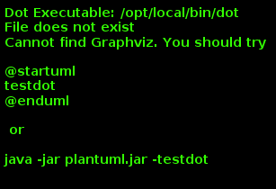
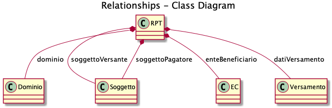
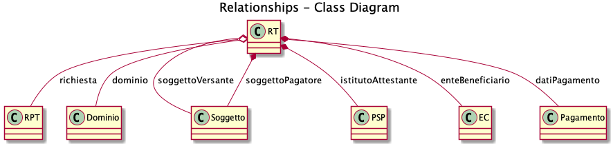
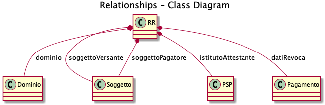
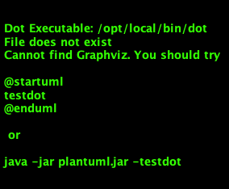
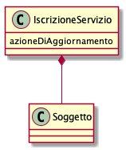

Modello dei dati
================

Pagamenti
---------

In questo paragrafo sono descritti i seguenti documenti XML scambiati
tra gli attori del sistema nell'ambito dei processi di pagamento:

-   Richiesta di Pagamento Telematico (RPT);
-   Ricevuta Telematica (RT);
-   Flusso di rendicontazione (FR);
-   Richiesta di Revoca (RR);
-   Esito Revoca (ER).

Ogni elemento è caratterizzato da un campo *versioneOggetto* che ne
indica la versione di riferimento, ogni versione è composta dalla
tripletta numerica *Major.Minor.Patch*, che viene incrementata a seguito
dei seguenti eventi:

-   un avanzamento di *Major revision* è causato da modifiche alla
    struttura dell'oggetto tali che impediscono la retro-compatibilità
    con le versioni precedenti dello stesso oggetto;
-   un avanzamento di *Minor revision* è ancora causato da modifiche
    all'oggetto ma tali che comunque garantiscono la retro-compatibilità
    con le versioni precedenti;
-   un avanzamento di *Patch revision* è invece causato dalla necessità
    di apportare correzioni o precisazioni di scarso impatto.

Il seguente *class diagram* mostra le relazioni che si instaurano tra
gli elementi durante un tentativo di pagamento andato a buon fine.



**Figura** **1: Diagramma delle classi del pagamento**

In particolare:

-   come specificato all'interno dell'Allegato A delle linee guida, ogni
    Posizione Debitoria di un EC è identificata all'interno di pagoPA da
    un codice identificativo denominato
    *identificativoUnivocoVersamento* (IUV). Tale codice è univocamente
    generato da un EC;
-   per chiudere una Posizione Debitoria, l'Utilizzatore finale esegue
    una operazione di pagamento attraverso pagoPA con un PSP da lui
    stesso determinato. Ogni operazione (o tentativo) di pagamento,
    quindi, presuppone necessariamente l'esistenza di una Posizione
    Debitoria;
-   l'operazione di pagamento è univocamente identificata da un codice
    denominato *codiceContestoPagamento* (CCP) generato dal soggetto che
    innesca il pagamento;
-   IUV e CCP congiuntamente consentono di associare ogni RPT alla
    corrispondente RT.
-   ad ogni operazione di pagamento, corrisponde uno solo degli oggetti
    RPT, RT e Flusso di Rendicontazione. Nella eventualità che sia
    richiesta la revoca di un'operazione già conclusa si genera
    un\'unica coppia di oggetti RR/ER;
-   ad un Flusso di Rendicontazione di uno specifico conto di accredito
    di un determinato EC corrispondono tutte le operazioni di pagamento
    andate a buon fine disposte nella singola giornata operativa;
-   ad ogni RPT corrisponde una ed una sola RT;
-   ad una RR corrisponde una ed una sola RT;
-   ad un ER corrisponde una ed una sola RR.

### Richiesta di Pagamento Telematica (RPT)

La RPT descrive una richiesta di pagamento di una Posizione Debitoria.

{width="6.69306in"
height="2.12986in"}

**Figura** **2: Diagramma delle classi della RPT**

In particolare, una RPT è composta dai seguenti elementi:

-   **dominio**: identifica il mittente della richiesta tramite i dati
    di configurazione;
-   **soggettoVersante**: identifica la persona, fisica o giuridica, che
    effettua il pagamento;
-   **soggettoPagatore**: identifica la persona fisica o giuridica
    associato alla Posizione Debitoria;
-   **enteBeneficiario**: identifica l'EC beneficiario del pagamento;
-   **datiVersamento**: descrive i dettagli necessari del (dei)
    versamento (i) utili al PSP per completare l'operazione di pagamento
    verso l'EC.

La trasmissione della RPT è infine identificata dai seguenti parametri
generati dall'EC:

-   data di generazione della RPT (*dataOraMessaggioRichiesta*).
-   codice *IdentificativoMessaggioRichiesta*, univoco nell'ambito della
    stessa data di generazione della RPT.

Nel seguito si descrivono nel dettaglio gli elementi della RPT
all'interno dello schema XSD a meno che non siano palesemente
auto-esplicativi; inoltre sono specificati i parametri associati agli
attributi che vengono utilizzati per filtrare i PSP in grado di erogare
il servizio di pagamento richiesto durante il processo di selezione
degli stessi da parte dell'Utilizzatore finale.


**Figura** **3: Diagramma delle classi del versamento**

Un versamento è caratterizzato dai seguenti attributi principali:

-   *dataEsecuzionePagamento*: indica la data in cui l'EC richiede che
    venga effettuato il versamento;
-   *ImportoTotaleDaVersare*: specifica l'importo totale del versamento,
    anche nel caso che includa l'acquisto di eventuali marche da bollo;
    la valorizzazione di tale parametro istruisce il NodoSPC a filtrare
    i servizi di pagamento dei PSP sulla base del massimo importo
    pagabile contenuto nel Catalogo Dati Informativi;
-   *Tipo Versamento*: descrive il tipo di versamento. I possibili
    valori ammessi sono:
    -   BBT, Bonifico Bancario di Tesoreria; pagamento con bonifico
        anche utilizzato per indicare l'innesco di un pagamento online
        presso l'EC
    -   BP, Bonifico Postale.
    -   AD, Addebito Diretto.
    -   CP, Carta di Pagamento.
    -   PO, pagamento presso PSP. utilizzato per innescare un pagamento
        presso uno dei canali del PSP.
    -   OBEP, Online Banking E-Payment; utilizzato per descrivere un
        pagamento tramite canale MyBank.
    -   OTH, Others; Altre forme di versamento.
-   *identificativoUnivocoVersamento:* riferimento univoco assegnato al
    versamento da parte dell'EC (vedi allegato A alle Linee guida);
    identifica la Posizione Debitoria;
-   *CodiceContestoPagamento*: codice univoco necessario a definire il
    contesto nel quale viene effettuato il versamento; identifica il
    tentativo di pagamento;
-   *ibanAddebito e bicAddebito*: parametri opzionali che definiscono
    rispettivamente l'International Bank Account Number (ISO 13616) e il
    Bank Identifier Code (ISO 9362) del conto da addebitare;
-   *firma ricevuta*: campo mantenuto per retro-compatibilità, sempre
    valorizzato a 0.

Un unico pagamento disposto dall'Utilizzatore finale può comportare per
il PSP, per richiesta dell'EC, la necessità di operare molteplici
accrediti (massimo cinque) su diversi conti dell'EC come specificato
nella struttura *datiSingoloVersamento* che contiene i dati di dettaglio
necessari per tali operazioni:

-   *importoSingoloVersamento*: importo del singolo accredito (NB la
    somma dei singoli importi deve corrispondere al dato
    *ImportoTotaleDaVersare)*;
-   *ibanAccredito* e *bicAccredito*: entrambi i campi identificano
    univocamente il conto corrente specificato dall'EC da accreditare
    dell'importo del singolo versamento, che deve essere configurato sul
    NodoSPC;
-   *ibanAppoggio* e *bicAppoggio*: entrambi i campi identificano
    univocamente il conto corrente alternativo al conto di accredito che
    il PSP può utilizzare per gestire l'operazione di pagamento. La
    scelta di utilizzare il conto alternativo a quello di accredito è
    demandata al PSP in base alle proprie necessità operative, purché
    preventivamente dichiarate nella propria configurazione e purché la
    scelta rimanga coerente per tutti i singoli versamenti. In un caso
    d'uso notevole nella prassi tali campi sono valorizzati con il conto
    corrente postale, in alternativa a un conto bancario specificato
    come conto di accredito. Nello XSD il dato è facoltativo per gestire
    il caso in cui l'EC effettivamente non disponga di un conto corrente
    alternativo; viceversa, se presente, il conto corrente deve essere
    configurato sul NodoSPC;
-   *causaleVersamento*: rappresenta la descrizione estesa della causale
    del versamento che deve essere conforme a quanto indicato nella
    Sezione I dell'Allegato A alle Linee guida;
-   *datiSpecificiRiscossione*: rappresenta l'indicazione
    dell'imputazione della specifica entrata per esporre la natura
    contabile del pagamento, specificando il tipo e codice contabilità.

### Richiesta di acquisto Marca da Bollo Digitale

L'EC può consentire all'Utilizzatore finale, con un unico versamento, il
contestuale acquisto di uno o più Marche da bollo digitali, con le
modalità previste dall'Agenzia per le Entrate. A tal fine è necessario
che almeno un singolo versamento contenga i seguenti campi:

-   *tipoBollo*: contiene uno dei tipi di Marca da Bollo Digitale per i
    quali l'Agenzia per le Entrate consente l'acquisto tramite pagoPA. A
    ogni tipo di bollo è associato un costo che deve essere coerente con
    il valore del campo *importoSingoloVersamento*;
-   *hashDocumento*: contiene l'impronta informatica (*digest*) del
    documento digitale a cui è associata la Marca da Bollo Digitale.
    L'algoritmo di *hash* da utilizzare per produrre l'impronta è lo
    SHA-256. La stringa di 256 bit (32 ottetti) risultato di tale
    algoritmo deve essere convertita in base64;
-   *provinciaResidenza*: sigla automobilistica della provincia di
    residenza del soggetto pagatore. Nel caso di soggetto residente
    all'estero indicare la provincia della sede legale dell'Ente
    Creditore

La valorizzazione della presente struttura dati istruisce il NodoSPC a
rendere disponibili all'Utilizzatore finale, durante il processo di
selezione dei PSP, quelli convenzionati con l'Agenzia delle Entrate per
l'acquisto della Marca da Bollo Digitale (sistema \@e.bollo).

### Ricevuta Telematica (RT)

La RT restituisce all'EC il documento che conclude il flusso innescato
da una richiesta di pagamento (RPT) ed attesta, qualora l'esito sia
positivo, l'esecuzione del versamento e la chiusura della Posizione
Debitoria.



**Figura** **4: Diagramma delle classi della RT**

Questi sono i principali elementi:

-   **dominio**: identifica il mittente della richiesta tramite i dati
    di configurazione;
-   **soggettoVersante**: identifica la persona fisica o giuridica che
    effettua le operazioni di versamento;
-   **soggettoPagatore**: identifica la persona fisica o giuridica a cui
    è intestata la posizione debitoria;
-   **istitutoAttestante**: descrive il Prestatore di Servizi di
    Pagamento utilizzato per le operazioni
-   **enteBeneficiario**: identifica l'EC destinatario del pagamento
    l'EC che richiesto l'acquisto della Marca da Bollo Digitale;
-   **datiPagamento**: descrive il dettaglio del pagamento effettuato
    (con esito).

La trasmissione della RT è infine identificata dai seguenti parametri
generati dal PSP:

-   *dataOraMessaggioRicevuta*: indica la data e l'ora del pagamento,
    liberatoria per l'Utilizzatore finale. Corrisponde con la data e ora
    del pagamento indicata dal PSP nell'attestazione.
-   *riferimentoMessaggioRichiesta*: nella generazione di una RT il PSP
    deve settare tale campo in modo che sia identico al campo
    *identificativoMessaggioRichiest*a della univoca RPT di riferimento.

### Richiesta di revoca (RR)

La RR contiene tutte le informazioni necessarie per gestire sia la
revoca che lo storno di un pagamento, definiti in sezione II.



**Figura** **5: Diagramma delle classi della Richiesta di Revoca**

In particolare, la RR è composta dai seguenti elementi:

-   **dominio**: identifica il mittente della richiesta tramite i dati
    di configurazione;
-   **soggettoVersante**: identifica la persona fisica o giuridica che
    ha effettuato le operazioni di versamento;
-   **soggettoPagatore**: identifica la persona fisica o giuridica a cui
    è riferita la Posizione Debitoria di cui è richiesto il *rollback*;
-   **istitutoAttestante**: descrive il Prestatore di Servizi di
    Pagamento che ha emesso a RT e che ne richiede la revoca;
-   **datiRevoca**: descrive il dettaglio dell'operazione di revoca.

### Esito Della Revoca (ER)

La ER descrive l'esito di una RR di un pagamento effettuato.

{width="6.69306in"
height="1.69514in"}

**Figura** **6: Diagramma delle classi dell'Esito della Revoca**

In particolare la ER è composta dai seguenti elementi:

-   **dominio**: identifica il mittente della richiesta tramite i dati
    di configurazione;
-   **soggettoVersante**: identifica la persona fisica o giuridica che
    ha effettuato le operazioni di versamento;
-   **soggettoPagatore**: identifica la persona fisica o giuridica a cui
    è riferita la Posizione Debitoria di cui è richiesto il *rollback*;
-   **istitutoAttestante**: descrive il Prestatore di Servizi di
    Pagamento che ha emesso a RT e che ne richiede la revoca;
-   **datiRevoca**: descrive il dettaglio dell'operazione di revoca.
-   **riferimento**: insieme dei campi che identificano la RR
    effettuata.

### Flusso di rendicontazione (FR)

Il FR referenzia i singoli pagamenti accreditati tramite bonifico
cumulativo di un conto corrente dell'EC, conformemente a quanto
stabilito nell'Allegato A delle Linee Guida.

Le informazioni che devono essere messe a disposizione dell\'EC sono
organizzate in flussi omogenei di dati e devono essere rese disponibili
ai soggetti interessati a cura del PSP che ha effettuato l'operazione di
accredito. Il FR deve essere reso disponibile all'EC nella giornata
successiva a quella durante la quale è stato disposto il bonifico (D+2).


**Figura** **7: Diagramma delle classi del Flusso di Rendicontazione**

In particolare, il FR è identificato dai seguenti parametri:

-   *identificativoFlusso*: riferimento al componente \<idFlusso\> della
    causale del SEPA Credit Transfer di Riversamento (dato "Unstructured
    Remittance Information" -- attributo AT-05)
-   *identificativoUnivocoRegolamento*: identificativo assegnato dal PSP
    all'operazione di trasferimento fondi, che può alternativamente
    essere così valorizzato:
    -   Transaction Reference Number (TRN, attributo AT-43 Originator
        Bank's Reference), qualora il PSP, al momento della generazione
        del flusso di riversamento, disponga di tale dato;
    -   EndToEndId (attributo AT-41 Originator's Reference):
        identificativo univoco assegnato dal PSP, nel caso in cui al
        momento della generazione del flusso di riversamento non sia
        disponibile il TRN;
-   *istitutoMittente*: struttura che identifica il PSP mittente che
    genera il FR;
-   *istitutoRicevente*: identifica l'EC destinatario del flusso;
-   *datiSingoloPagamento*: struttura che riporta la distinta dei
    versamenti cumulati all'interno del flusso SCT; ciascun versamento
    viene messo in relazione con i seguenti elementi:
    -   la Posizione Debitoria, attraverso
        l'*identificativoUnivocoVersamento* (IUV);
    -   le RT prodotte dal PSP, attraverso
        l'*identificativoUnivocoRiscossione* (IUR) ed eventualmente
        l'*indiceDatiSingoloPagamento* che specifica l'indice (numero
        d'ordine) nella lista di versamenti all'interno della RT.

Messaggi di errore
------------------

In caso di errori verificatisi nel colloquio tra i vari soggetti
aderenti (EC e PSP) ed il NodoSPC, i relativi messaggi di errore vengono
descritti utilizzando la struttura **faultBean** mostrata nel seguente
diagramma.


**Figura** **8: Oggetto faultBean**

La struttura contiene i seguenti parametri:

-   *id*: identificativo del soggetto che emette l'errore, valorizzato
    con idDominio (nel caso di EC), identificativoPSP (nel caso di PSP)
    e da una costante "NodoDeiPagamentiSPC" nel caso di errore
    identificato da parte del NodoSPC;
-   *faultCode:* codice dell'errore, composto secondo il seguente
    formato:

```{=html}
<!-- -->
```
-   *faultString*: specifica del codice dell'errore. Ogni soggetto
    emittente valorizza tale parametro sulla base delle indicazioni
    fornite nella tabella dei Codici di errore di seguito riportata.
-   *description:* descrizione aggiuntiva dell'errore impostata dal
    soggetto che emette l'errore. Nella emissione di un **faultCode**
    *PAA\_SEMANTICA* (EC) o *CANALE\_SEMANTICA* (PSP), i soggetti
    erogatori (EC o PSP) dovranno indicare nel presente dato lo
    specifico errore legato all'elaborazione dell'oggetto ricevuto. Nel
    caso in cui il NodoSPC trasmetta verso un soggetto un errore di
    Controparte con **faultCode** valorizzato, a seconda del caso, a
    *PPT\_ERRORE\_EMESSO\_DA\_PAA* o *PPT\_CANALE\_ERRORE,* il campo è
    valorizzato con l'errore emesso dalla Controparte.
-   *serial*: posizione dell'elemento nella lista a cui fa riferimento.
    Utile quando si fornisce un parametro in forma di vettore (ad
    esempio, nella primitiva **nodoInviaCarrelloRPT**). Nel caso in cui
    l\'errore sia generato dall\'EC o dal PSP, il dato riporta il valore
    del dato *faultBean.serial* impostato dall\'EC o dal PSP;
-   *originalFaultCode:* codice dell'errore generato dalla Controparte.
    Non è presente se il soggetto che emette l'errore è il NodoSPC;
-   *originalFaultString:* specifica dell'errore generato dalla
    Controparte. Non è presente se il soggetto che emette l'errore è il
    NodoSPC;
-   *originalDescription*: descrizione aggiuntiva dell'errore generato
    dalla Controparte. Non è presente se il soggetto che emette l'errore
    è il NodoSPC.

La tabella sottostante riporta l'elenco dei codici di errore
(*faultCode*) che i soggetti dovranno utilizzare al verificarsi delle
condizioni di errore (*faultString*).

-------------------------------------------------------------------------------------
  faultCode                                       faultString
----------------------------------------------- -------------------------------------
  *CANALE\_AVVISO\_DUPLICATO*                     Messaggio di *warning* per Avviso
                                                  duplicato

  *CANALE\_BUSTA\_ERRATA*                         Messaggio dismesso

  *CANALE\_ER\_DUPLICATA*                         ER duplicata

  *CANALE\_FIRMA\_SCONOSCIUTA*                    Messaggio dismesso

  *CANALE\_INDISPONIBILE*                         Servizio non disponibile

  *CANALE\_RICHIEDENTE\_ERRATO*                   Identificativo richiedente non valido

  *CANALE\_RPT\_DUPLICATA*                        RPT duplicata.

  *CANALE\_RPT\_RIFIUTATA*                        RPT rifiutata

  *CANALE\_RPT\_SCONOSCIUTA*                      RPT sconosciuta

  *CANALE\_RT\_NON\_DISPONIBILE*                  RT non disponibile

  *CANALE\_RT\_SCONOSCIUTA*                       RT sconosciuta

  *CANALE\_SEMANTICA*                             Errore semantico

  *CANALE\_SINTASSI\_EXTRAXSD*                    Errore di sintassi extra XSD

  *CANALE\_SINTASSI\_XSD*                         Errore di sintassi XSD

  *CANALE\_SYSTEM\_ERROR*                         Errore generico

  *PAA\_ATTIVA\_RPT\_IMPORTO\_NON\_VALIDO*        L'importo del pagamento in attesa non
                                                  è congruente con il dato indicato dal
                                                  PSP

  *PAA\_ER\_DUPLICATA*                            Esito Revoca duplicato

  *PAA\_ERRORE\_FORMATO\_BUSTA\_FIRMATA*          Formato busta di firma errato o non
                                                  corrispondente al *tipoFirma*

  *PAA\_FIRMA\_ERRATA*                            Errore di firma

  *PAA\_FIRMA\_INDISPONIBILE*                     Impossibile firmare

  *PAA\_ID\_DOMINIO\_ERRATO*                      La PAA non corrisponde al Dominio
                                                  indicato

  *PAA\_ID\_INTERMEDIARIO\_ERRATO*                Identificativo intermediario non
                                                  corrispondente

  *PAA\_PAGAMENTO\_ANNULLATO*                     Pagamento in attesa risulta annullato
                                                  all'Ente Creditore

  *PAA\_PAGAMENTO\_DUPLICATO*                     Pagamento in attesa risulta concluso
                                                  all'Ente Creditore

  *PAA\_PAGAMENTO\_IN\_CORSO*                     Pagamento in attesa risulta in corso
                                                  all'Ente Creditore

  *PAA\_PAGAMENTO\_SCADUTO*                       Pagamento in attesa risulta scaduto
                                                  all'Ente Creditore

  *PAA\_PAGAMENTO\_SCONOSCIUTO*                   Pagamento in attesa risulta
                                                  sconosciuto all'Ente Creditore

  *PAA\_RPT\_SCONOSCIUTA*                         La RPT risulta sconosciuta

  *PAA\_RT\_DUPLICATA*                            La RT è già stata accettata

  *PAA\_RT\_SCONOSCIUTA*                          RT sconosciuta

  *PAA\_SEMANTICA*                                Errore semantico

  *PAA\_SINTASSI\_EXTRAXSD*                       Errore di sintassi extra XSD

  *PAA\_SINTASSI\_XSD*                            Errore di sintassi XSD

  *PAA\_STAZIONE\_INT\_ERRATA*                    Stazione intermediario non
                                                  corrispondente

  *PAA\_SYSTEM\_ERROR*                            Errore generico

  *PAA\_TIPOFIRMA\_SCONOSCIUTO*                   Il campo *tipoFirma* non corrisponde
                                                  ad alcun valore previsto

  *PPT\_AUTENTICAZIONE*                           Errore di autenticazione

  *PPT\_AUTORIZZAZIONE*                           Il richiedente non ha i diritti per
                                                  l'operazione

  *PPT\_CANALE\_DISABILITATO*                     Canale conosciuto ma disabilitato da
                                                  configurazione

  *PPT\_CANALE\_ERR\_PARAM\_PAG\_IMM*             Parametri restituiti dal Canale per
                                                  identificare il pagamento non
                                                  corretti

  *PPT\_CANALE\_ERRORE*                           Errore restituito dal Canale

  *PPT\_CANALE\_ERRORE\_RESPONSE*                 La *response* ricevuta dal Canale è
                                                  vuota o non corretta sintatticamente
                                                  o semanticamente

  *PPT\_CANALE\_INDISPONIBILE*                    Nessun Canale utilizzabile e
                                                  abilitato

  *PPT\_CANALE\_IRRAGGIUNGIBILE*                  Errore di connessione verso il Canale

  *PPT\_CANALE\_NONRISOLVIBILE*                   Il Canale non è specificato, e nessun
                                                  Canale risulta utilizzabile secondo
                                                  configurazione

  *PPT\_CANALE\_SCONOSCIUTO*                      Canale sconosciuto

  *PPT\_CANALE\_SERVIZIO\_NONATTIVO*              Il servizio applicativo del Canale
                                                  non è attivo

  *PPT\_CANALE\_TIMEOUT*                          *Timeout* risposta dal Canale

  *PPT\_CODIFICA\_PSP\_SCONOSCIUTA*               Valore di codificaInfrastruttura PSP
                                                  non censito

  *PPT\_DOMINIO\_DISABILITATO*                    Dominio disabilitato

  *PPT\_DOMINIO\_SCONOSCIUTO*                     *IdentificativoDominio* sconosciuto

  *PPT\_ERRORE\_EMESSO\_DA\_PAA*                  Errore restituito dall'Ente Creditore

  *PPT\_ERRORE\_FORMATO\_BUSTA\_FIRMATA*          Formato busta di firma errato o non
                                                  corrispondente al *tipoFirma*

  *PPT\_FIRMA\_INDISPONIBILE*                     Impossibile firmare

  *PPT\_IBAN\_NON\_CENSITO*                       Il codice IBAN indicato dall'Ente
                                                  Creditore non è presente nella lista
                                                  degli IBAN comunicati al sistema
                                                  pagoPA

  *PPT\_ID\_CARRELLO\_DUPLICATO*                  Identificativo Carrello RPT duplicato

  *PPT\_ID\_FLUSSO\_SCONOSCIUTO*                  Identificativo flusso sconosciuto

  *PPT\_ISCRIZIONE\_NON\_PRESENTE*                Iscrizione non presente in archivio

  *PPT\_OPER\_NON\_REVOCABILE*                    Operazione non revocabile

  *PPT\_OPER\_NON\_STORNABILE*                    Operazione non stornabile

  *PPT\_PSP\_DISABILITATO*                        PSP conosciuto ma disabilitato da
                                                  configurazione

  *PPT\_PSP\_SCONOSCIUTO*                         PSP sconosciuto

  *PPT\_RPT\_DUPLICATA*                           RPT duplicata

  *PPT\_RPT\_NON\_INOLTRABILE*                    La RPT richiesta e fornita dalla PA
                                                  non può essere inoltrata in quanto
                                                  non corretta formalmente

  *PPT\_RPT\_SCONOSCIUTA*                         RPT sconosciuta

  *PPT\_RT\_DUPLICATA*                            La RT inviata dal PSP è già stata
                                                  inviata (RT *push*)

  *PPT\_RT\_NONDISPONIBILE*                       RT non ancora pronta

  *PPT\_RT\_SCONOSCIUTA*                          RT sconosciuta

  *PPT\_SEMANTICA*                                Errore semantico

  *PPT\_SINTASSI\_EXTRAXSD*                       Errore di sintassi extra XSD

  *PPT\_SINTASSI\_XSD*                            Errore di sintassi XSD

  *PPT\_STAZIONE\_INT\_PA\_DISABILITATA*          Stazione disabilitata

  *PPT\_STAZIONE\_INT\_PA\_IRRAGGIUNGIBILE*       Errore di connessione verso la
                                                  Stazione

  *PPT\_STAZIONE\_INT\_PA\_SCONOSCIUTA*           *IdentificativoStazioneRichiedente*
                                                  sconosciuto

  *PPT\_STAZIONE\_INT\_PA\_SERVIZIO\_NONATTIVO*   Il Servizio Applicativo della
                                                  Stazione non è attivo

  *PPT\_SUPERAMENTOSOGLIA*                        Una qualche soglia fissata per PPT è
                                                  temporaneamente superata e la
                                                  richiesta è quindi rifiutata

  *PPT\_SYSTEM\_ERROR*                            Errore generico

  *PPT\_TIPOFIRMA\_SCONOSCIUTO*                   Il campo *tipoFirma* non corrisponde
                                                  ad alcun valore previsto

  *PPT\_ULTERIORE\_ISCRIZIONE*                    Ulteriore iscrizione precedentemente
                                                  censita

  *PPT\_WISP\_SESSIONE\_SCONOSCIUTA*              La tripletta
                                                  *idDominio*+*keyPA*+*keyWISP* non
                                                  corrisponde ad alcuna sessione
                                                  memorizzata nella componente WISP

  *PPT\_WISP\_TIMEOUT\_RECUPERO\_SCELTA*          La tripletta
                                                  *idDominio*+*keyPA*+*keyWISP* è
                                                  relativa ad una scelta effettuata
                                                  scaduta

  *PPT\_STAZIONE\_INT\_PA\_TIMEOUT*               Il messaggio non riesce ad essere
                                                  inoltrato nei tempi attesi alla
                                                  controparte EC
  -------------------------------------------------------------------------------------

**Tabella** **1: Codici di errore**

Avvisatura digitale
-------------------

----------------------------------------------------------------- -----------------------------------------------
   
  **Paragrafo soggetto a proposta di modifica**
                                                

----------------------------------------------------------------- -----------------------------------------------

Questo paragrafo descrive gli elementi scambiati tra il NodoSPC e gli
attori coinvolti per realizzare la funzione di Avvisatura Digitale.

In particolare, gli elementi principali che vengono scambiati sono:

-   **Avvisatura**, rappresenta il dato attraverso il quale un EC
    notifica ad un Soggetto Pagatore un avviso di pagamento digitale.
    Può essere scambiato singolarmente o attraverso una lista.
-   **Esito Inoltro Avvisatura**, rappresenta la notifica dell'avvenuta
    consegna dell'avviso precedentemente inviato.
-   **Iscrizione Servizio**, rappresenta la richiesta di un utente
    finale di ricezione degli avvisi di pagamento tramite uno dei canali
    messi a disposizione dai PSP.

Il seguente Diagramma delle classi rappresenta la relazione tra i
diversi oggetti scambiati ed altri oggetti già descritti nei paragrafi
precedenti.

{width="5.75in"
height="3.125in"}

**Figura** **9: Diagramma delle classi dell'avvisatura**

### Avviso digitale

L'Avvisatura rappresenta il documento telematico con il quale un EC
notifica ad un Soggetto Pagatore un Avviso di Pagamento.

{width="6.69306in"
height="3.02986in"}

**Figura** **10: Diagramma delle relazioni degli attributi
dell'Avvisatura**

Una Avvisatura è descritta dai seguenti parametri:

-   *codiceAvviso*: è il numero dell'avviso di pagamento, composto come
    descritto nell'allegato A delle Linee Guida;
-   *tassonomiaAvviso*: classificazione dell'avviso;
-   *dataScadenzaPagamento*: rappresenta la data ultima entro la quale
    si richiede che venga pagato l'avviso di pagamento;
-   *dataScadenzaAvviso*: Indica la data, successiva alla data di
    scadenza del pagamento, sino alla quale si ritiene valido l\'avviso;
-   *importoAvviso*: rappresenta l'importo da pagare, potrebbe subire
    delle variazioni;
-   *descrizionePagamento*: testo libero che descrive la natura
    dell'avviso;
-   *urlAvviso*: URL di una pagina web messa a disposizione dall\'EC
    dove l\'Utilizzatore finale può consultare l\'avviso di pagamento;
-   *tipoPagamento* : indica la natura del pagamento;
-   *tipoOperazione*: indica il tipo di operazione connessa con
    l'avviso. Può assumere i seguenti valori:

Inoltre contiene informazioni in merito a:

-   **anagrafica beneficiario**: descrive l'EC che ha emesso l'avviso di
    pagamento;
-   **identificativo dominio**: contiene il codice fiscale del soggetto
    direttamente connesso che invia l\'avviso Digitale;
-   **soggetto pagatore**: identifica il soggetto destinatario
    dell'avviso;
-   **dati Singolo Pagamento**: descrive i dettagli del pagamento da
    effettuare.

Il tipo *ListaAvvisiDigitali* è la struttura composta dall'insieme di
più avvisi, purché di numero inferiore a 100.000 elementi.

### Esito Inoltro Avvisatura

È un oggetto informatico, predisposto dal Nodo-SPC, che permette all'EC
di conoscere l'esito del relativo inoltro massivo di Avvisi digitali.

{width="5.125in"
height="2.65625in"}

**Figura** **11: Diagramma delle classi dell'esito inoltro avvisatura**

Contiene al suo interno informazioni riguardo a:

-   **identificativoMessaggioRichiesta**: riferimento all'avviso inviato
-   **identificativoDominio**: il codice fiscale del soggetto
    direttamente connesso che ha inviato l\'avviso Digitale di cui il
    NodoSPC sta fornendo l'Esito.
-   **EsitoAvvisatura**: struttura che descrive l'esito dell'inoltro
    dell'avvisatura.

L'esito di un avvisatura è descritto dai seguenti parametri:

-   *tipoCanaleEsito*: tipologia di canale usato per inviare l'avviso
    all\'utente;
-   *IdentificativoCanale*: identificativo del canale "mobile" a cui si
    riferisce l'esito dell'avvisatura;
-   *codiceEsito*: esito dell\'invio riferito al singolo canale;
-   *descrizioneEsito*: testo libero che, in caso di esito negativo
    (codiceEsito\<\>0), descrive l'evento stesso.

### Iscrizione al servizio

Definisce lo schema secondo il quale un PSP richiede al NodoSPC di
ricevere le avvisature destinate ad un Soggetto Pagatore.

{width="2.98958in"
height="2.125in"}

**Figura** **12: Diagramma delle classi dell'iscrizione al servizio**

Contiene al suo interno informazioni riguardo a:

-   **IdentificativoUnivocoSoggetto**: descrizione del Soggetto Pagatore
    del quale si vuole ricevere le avvisature.

È descritto dai seguenti parametri:

-   *azioneDiAggiornamento*: Indica il tipo di aggiornamento richiesto,
    può assumere i seguenti valori:
    -   'A'= Attivazione
    -   'D'= disattivazione

Configurazione
--------------

In questo paragrafo vengono descritte tutte le informazioni necessarie
al NodoSPC per configurare opportunamente gli attori ad esso connessi,
ovvero EC e PSP.

Per la comunicazione di tali informazioni il NodoSPC mette a
disposizione l'applicazione *web* Portale delle Adesioni. Per ulteriori
dettagli consultare la Sezione IV.

### Ente Creditore

L'oggetto Ente Creditore viene identificato nel sistema attraverso il
proprio codice fiscale (campo *idDominio*) e caratterizzato dai seguenti
attributi:

-   Descrizione dell'erogazione dei servizi;
-   Dettaglio di eventuali servizi disponibili per pagamento spontaneo
    disposto presso il PSP;
-   Dettaglio dei conti correnti di accredito e di appoggio incasso
    utilizzati.

Il documento che raccoglie la porzione pubblica di tali informazioni che
deve essere resa disponibile alle controparti è raccolta nel documento
Tabella delle Controparti che il NodoSPC rende disponibile tramite
primitive SOAP descritte fra le funzioni ausiliarie.


**Figura** **13: Diagramma delle classi per la configurazione di un EC**

### PSP

L'oggetto PSP viene identificato nel sistema (campo *identificativoPSP*)
attraverso il codice BIC oppure da un codice formato dalla
concatenazione della stringa "ABI" con il valore del codice ABI del PSP.
(La scelta fra i due identificativi deve essere compiuta dal PSP al
momento della prima configurazione ed è irreversibile). Ogni PSP è
caratterizzato dalle seguenti proprietà:

-   specifica sulla pubblicazione delle informazioni;
-   dettaglio dei servizi di pagamento attivati (canali).


**Figura** **14: Diagramma delle classi per la configurazione di un
PSP**

Il documento che raccoglie la porzione pubblica di tali informazioni che
deve essere resa disponibile alle controparti EC è raccolta nel
documento InformativaPSP che il NodoSPC rende disponibile tramite
primitive SOAP descritte fra le funzioni ausiliarie.

Inoltre, per la configurazione delle modalità di pagamento nel sistema
pagoPA, il PSP produce il documento Catalogo Dati Informativi, come
riportato nella sezione IV.

#### Pubblicazione

All'interno di questa struttura, il PSP specifica gli attributi comuni a
tutti i servizi di pagamento che rende disponibili sul sistema:

-   *dataPubblicazione*: data e ora relativa all'invio dell'ultimo
    aggiornamento delle informazioni;
-   *release*:
-   *dataInizioValidita*: data e ora di inizio validità delle
    informazioni;
-   *urlInformazioniPSP*: indirizzo di una pagina web gestita dal PSP
    rivolta all'Utilizzatore finale per la divulgazione di informazioni
    specifiche relative ai servizi di pagamento resi disponibili;
-   *LogoPSP*: logotipo del PSP;
-   *stornoPagamento*: *flag* che indica la capacità tecnica di gestire
    il processo di storno di un pagamento.
-   *marcaBolloDigitale*: *flag* che individua un PSP convenzionato con
    l'Agenzia delle Entrate come rivenditore della Marca da bollo
    digitale attraverso il sistema *\@e.bollo*.

#### Canale

La struttura raccoglie tutte le informazioni relative a un servizio di
pagamento messo a disposizione dal PSP sul sistema pagoPA:

-   *identificativoIntermediario*: identificativo dell'Intermediario del
    PSP che fornisce lo specifico accesso (Canale) al PSP per
    l\'erogazione del servizio. L\'intermediario può coincidere con il
    PSP stesso;
-   *identificativoCanale*: identificativo del canale attraverso il
    quale viene effettuata la transazione;
- *TipoVersamento*: codice che identifica il tipo di versamento
  utilizzato dal canale;

  ---------------------------------------------------------------------------
  Tipo Versamento      Codice   Descrizione
  -------------------- -------- ---------------------------------------------
  Pagamento con Carta  CP       Il PSP è abilitato a gestire pagamenti con
                                carta di credito o debito

  Pagamento mediante   OBEP     Il PSP è abilitato a gestire pagamenti MyBank
  MyBank                        on line

  Pagamento attivato   PO       Il PSP è abilitato a gestire pagamenti
  presso il PSP                 interfacciando l'Utilizzatore finale.

  Pagamento mediate    BP       Canale che identifica un canale on line

  Poste Italiane                gestito da Poste Italiane
  ---------------------------------------------------------------------------

**Tabella** **2: Tipi di versamento**

- *modelloPagamento*: codice che identifica il modello di pagamento
  gestito dal canale; i calori utilizzabili sono elencati nella
  seguente tabella**.**

  ------------------------------------------------------------------------
  Modello di pagamento    Codice                  Descrizione
  ----------------------- ----------------------- ------------------------
  Processo di pagamento   0                       Il PSP è abilitato a
  con re indirizzamento                           gestire pagamenti
  on-line                                         inizializzati dalla
                                                  primitiva *nodoInviaRPT*

  Processo di pagamento   1                       Il PSP è abilitato a
  con re indirizzamento                           gestire pagamenti
  on-line tramite                                 inizializzati dalla
  carrello                                        primitiva
                                                  *nodoInviaCarrelloRPT*

  Processo di pagamento   2                       Il PSP è abilitato a
  con autorizzazione                              gestire pagamenti con
  gestita dal PSP                                 autorizzazione differita

  Processo di pagamento   4                       Il PSP è abilitato ad
  attivato presso il PSP                          inizializzare un

                                                  processo di pagamento

  ------------------------------------------------------------------------

**Tabella** **3: Modelli di pagamento**

-   *priorità*: campo *boolean* mantenuto per retro-compatibilità da
    valorizzare a 'false';
-   *canaleApp*: indica se il canale in questione può essere inserito
    all'interno della categoria "Altri Metodi di Pagamento";
-   *servizioAlleImprese*: campo *boolean* che indica se il servizio
    erogato dal PSP è destinato ad un utilizzo solo da parte delle
    imprese.

Inoltre, un canale è definito dagli attributi di seguito descritti in
paragrafi dedicati:

##### Servizio

La struttura descrive come verrà visualizzato all'Utilizzatore finale
per selezionare il PSP sul sistema WISP:

-   *nomeServizio*: nome commerciale del servizio / app
-   *logoServizio*: logotipo del servizio / app. Con risoluzione
    400x128px.

##### Informazioni dettaglio Servizio

-   *codiceLingua*: identifica la lingua utilizzata per le informazioni
    di dettaglio della presente struttura. Le lingue supportate dal
    sistema pagoPA sono l'italiano e l'inglese oltre a quelle delle
    minoranze linguistiche tutelate (tedesco, francese e sloveno);
-   *descrizioneServizio*: testo libero a disposizione del PSP per
    specificare il servizio;
-   *disponibilitàServizio*: testo libero utilizzato dal PSP per
    specificare gli orari di erogazione tecnica del servizio;
-   *limitazioniServizio*: informazioni in formato testo che riportano
    eventuali limitazioni poste dal PSP nell\'erogazione del servizio,
    (esempio: Servizio dedicato ad una particolare categoria di
    professionisti o imprese);
-   *urlInformazioniCanale*: URL di una pagina *web* contenente
    informazioni relative allo specifico servizio*;*
-   *tavoloOperativo*: indica i riferimenti del presidio tecnico
    predisposto per cooperare con il Tavolo Operativo del NodoSPC.

##### Plugin

La struttura permette al PSP di definire un set di parametri
personalizzato da utilizzare per interpretare i parametri della
*redirect* di risposta alla pagina di erogazione del servizio WISP.

##### Costi

La struttura definisce la *policy* del calcolo delle commissioni che il
sistema pagoPA deve applicare.

È possibile gestire le seguenti *policy* per il calcolo della
commissione:

-   Numero dei versamenti (*tipoCostoTransazione* = 0): tale *policy*
    calcola il costo della commissione in base al numero di versamenti
    da effettuare. In questo caso:
    -   il numero delle occorrenze della struttura *fasceCostoServizio*
        dovrà essere pari a 1;
    -   l\'elemento *tipoCommissione* dovrà essere 0 (in valore
        assoluto);
    -   l\'elemento *costoFisso* dovrà essere 0.
-   Totale versamento (*tipoCostoTransazione* = 1): tale *policy*
    calcola il costo della commissione in base al totale della
    transazione da effettuare. In questo caso è possibile specificare il
    costo della commissione in base alla fascia di prezzo.

##### Acquirer

L'*Acquirer* è un soggetto che ha instaurato un rapporto con un PSP
aderente a pagoPA al fine di gestire le transazioni con le carte di
pagamento, interagendo con il VPOS-AgID.

L'*Acquirer* viene configurato attraverso i seguenti parametri:

-   *TerminalID*: Terminal Identification Number (TID);
-   *MerchantID*: Merchant Identification Number (MID) che identifica il
    PSP relazionato con l'*Aquirer*;
-   *Bin*: lista di Issuer Identification Number (IIN) che identifica le
    carte emesse dal PSP relazionato con l'*Aquirer*. Il pagamento con
    una carta il cui BIN è incluso in tale lista è autorizzato
    dall'*Aquirer* senza la necessità di accedere ai circuiti
    internazionali. Il NodoSPC gestirà questa tipologia di pagamenti
    inoltrando le relative RPT verso il canale ONUS del PSP. Il canale
    NOT\_ON\_US è utilizzato dal PSP per gestire i pagamenti con carte
    emesse da altri soggetti.

Giornale degli eventi
---------------------

Il Giornale degli Eventi (GDE) ha l'obiettivo di consentire la
tracciabilità di ogni operazione di pagamento (andata a buon fine o
abortita) per il tramite del NodoSPC.

L\'operazione di pagamento si sviluppa mediante la cooperazione
applicativa tra sistemi diversi degli EC, del NodoSPC e dei PSP. È
quindi necessario, per ricostruire il processo complessivo, che ognuno
dei sistemi interessati dal pagamento telematico si doti di funzioni
specifiche per registrare in modo standardizzato i passaggi principali
del trattamento dell\'operazione di pagamento. Gli eventi di ingresso e
di uscita dal sistema, ovvero le attività che comportano
l'attraversamento di una interfaccia, sono punti cardine da tracciare
obbligatoriamente. Sul Giornale degli Eventi si devono altresì annotare
i cambi di stato intermedi significativi per il sistema pagoPA.

Le tracce registrate dai singoli sistemi, in caso di richiesta di
verifica, devono poter essere tempestivamente estratte, inviate al
Tavolo Operativo presidiato dal NodoSPC in modo da essere confrontate
con le analoghe informazioni prodotte da tutti i sistemi di
collaborazione coinvolti nell'operazione in esame.

Ai fini del confronto sono state individuate tre aree di interesse da
monitorare per poter tracciare un pagamento e risolvere eventuali
anomalie:

-   i messaggi scambiati tramite le interfacce esterne (SOAP/http/SFTP);
-   gli oggetti scambiati durante un pagamento (RPT, RT, ecc.);
-   le operazioni interne più significative (rappresentate nei capitoli
    successivi all'interno della presente sezione dalle operazioni
    associate e descritte per i diversi attori).

Nella tabella **Tabella** sottostante sono indicate le informazioni e le
specifiche di rappresentazione dei dati che i soggetti appartenenti al
Dominio sono tenuti a fornire per le verifiche di cui sopra. Questi dati
sono altresì le informazioni \"minime\" da archiviare nel Giornale degli
Eventi. Tali informazioni devono essere memorizzate presso le strutture
che scambiano le informazioni (EC, PSP, Intermediari tecnologici,
NodoSPC) e devono essere accessibili a richiesta, nei formati che
saranno concordati.

+-----------+-----------+-----------+-----------+-----------+-----------+
| Dato      | Liv       | Genere    | Occ       | Len       | Contenuto |
+===========+===========+===========+===========+===========+===========+
| > data    | 1         | an        | 1..1      | 19        | Indica la |
| OraEvento |           |           |           |           | data e    |
|           |           |           |           |           | l'ora     |
|           |           |           |           |           | de        |
|           |           |           |           |           | ll'evento |
|           |           |           |           |           | secondo   |
|           |           |           |           |           | il        |
|           |           |           |           |           | formato   |
|           |           |           |           |           | ISO 8601, |
|           |           |           |           |           | alla      |
|           |           |           |           |           | ri        |
|           |           |           |           |           | soluzione |
|           |           |           |           |           | del       |
|           |           |           |           |           | mil       |
|           |           |           |           |           | lisecondo |
|           |           |           |           |           | e sempre  |
|           |           |           |           |           | riferito  |
|           |           |           |           |           | al GMT.   |
|           |           |           |           |           | Formato   |
|           |           |           |           |           |           |
|           |           |           |           |           | **        |
|           |           |           |           |           | \[YYYY\]- |
|           |           |           |           |           | \[MM\]-\[ |
|           |           |           |           |           | DD\]T\[hh |
|           |           |           |           |           | \]:\      |
|           |           |           |           |           | [mm\]:\[s |
|           |           |           |           |           | s.sss\]** |
+-----------+-----------+-----------+-----------+-----------+-----------+
| > i       | 1         | an        | 1..1      | 1..35     | Campo     |
| dentifica |           |           |           |           | alf       |
| tivoDomin |           |           |           |           | anumerico |
|           |           |           |           |           | c         |
| io        |           |           |           |           | ontenente |
|           |           |           |           |           | il codice |
|           |           |           |           |           | fiscale   |
|           |           |           |           |           | dell'EC   |
|           |           |           |           |           | che invia |
|           |           |           |           |           | la        |
|           |           |           |           |           | richiesta |
|           |           |           |           |           | di        |
|           |           |           |           |           | p         |
|           |           |           |           |           | agamento. |
+-----------+-----------+-----------+-----------+-----------+-----------+
| > i       | 1         | an        | 1..1      | 1..35     | Ri        |
| dentifica |           |           |           |           | ferimento |
| tivoUnivo |           |           |           |           | univoco   |
|           |           |           |           |           | assegnato |
| coV       |           |           |           |           | al        |
| ersamento |           |           |           |           | pagamento |
|           |           |           |           |           | dall'ente |
|           |           |           |           |           | ben       |
|           |           |           |           |           | eficiario |
|           |           |           |           |           | e         |
|           |           |           |           |           | presente  |
|           |           |           |           |           | nel       |
|           |           |           |           |           | messaggio |
|           |           |           |           |           | che ha    |
|           |           |           |           |           | originato |
|           |           |           |           |           | l'evento. |
+-----------+-----------+-----------+-----------+-----------+-----------+
| > c       | 1         | an        | 1..1      | 1..35     | Codice    |
| odiceCont |           |           |           |           | univoco   |
| estoPagam |           |           |           |           | n         |
|           |           |           |           |           | ecessario |
| ento      |           |           |           |           | a         |
|           |           |           |           |           | definire  |
|           |           |           |           |           | il        |
|           |           |           |           |           | contesto  |
|           |           |           |           |           | nel quale |
|           |           |           |           |           | viene     |
|           |           |           |           |           | e         |
|           |           |           |           |           | ffettuato |
|           |           |           |           |           | il        |
|           |           |           |           |           | v         |
|           |           |           |           |           | ersamento |
|           |           |           |           |           | presente  |
|           |           |           |           |           | nel       |
|           |           |           |           |           | messaggio |
|           |           |           |           |           | che ha    |
|           |           |           |           |           | originato |
|           |           |           |           |           | l'evento. |
+-----------+-----------+-----------+-----------+-----------+-----------+
| > i       | 1         | an        | 1..1      | 1..35     | ident     |
| dentifica |           |           |           |           | ificativo |
| tivoPrest |           |           |           |           | del PSP   |
|           |           |           |           |           | univoco   |
| ato       |           |           |           |           | nel       |
| reServizi |           |           |           |           | Dominio   |
| Pagamento |           |           |           |           | scelto    |
|           |           |           |           |           | dall'uti  |
|           |           |           |           |           | lizzatore |
|           |           |           |           |           | finale    |
|           |           |           |           |           | e/o       |
|           |           |           |           |           | dall'EC   |
+-----------+-----------+-----------+-----------+-----------+-----------+
| > tipoV   | 1         | an        | 0..1      | 1..35     | Forma     |
| ersamento |           |           |           |           | tecnica   |
|           |           |           |           |           | di        |
|           |           |           |           |           | pagamento |
|           |           |           |           |           | presente  |
|           |           |           |           |           | nel       |
|           |           |           |           |           | messaggio |
|           |           |           |           |           | che ha    |
|           |           |           |           |           | originato |
|           |           |           |           |           | l'evento. |
+-----------+-----------+-----------+-----------+-----------+-----------+
| > c       | 1         | an        | 1..1      | 1..35     | Sistema o |
| omponente |           |           |           |           | sot       |
|           |           |           |           |           | tosistema |
|           |           |           |           |           | che ha    |
|           |           |           |           |           | generato  |
|           |           |           |           |           | l'evento  |
|           |           |           |           |           | (es.      |
|           |           |           |           |           | FESP,     |
|           |           |           |           |           | WFESP)    |
+-----------+-----------+-----------+-----------+-----------+-----------+
| > catego  | 1         | an        | 1..1      | 1..35     | IN        |
| riaEvento |           |           |           |           | TERNO/INT |
|           |           |           |           |           | ERFACCIA, |
|           |           |           |           |           | indica se |
|           |           |           |           |           | l\'evento |
|           |           |           |           |           | tracciato |
|           |           |           |           |           | è         |
|           |           |           |           |           | relativo  |
|           |           |           |           |           | un\'o     |
|           |           |           |           |           | perazione |
|           |           |           |           |           | di        |
|           |           |           |           |           | in        |
|           |           |           |           |           | terfaccia |
|           |           |           |           |           | con altri |
|           |           |           |           |           | sistemi   |
|           |           |           |           |           | oppure se |
|           |           |           |           |           | ra        |
|           |           |           |           |           | ppresenta |
|           |           |           |           |           | un\'o     |
|           |           |           |           |           | perazione |
|           |           |           |           |           | interna   |
|           |           |           |           |           | (es.      |
|           |           |           |           |           | cambio di |
|           |           |           |           |           | stato) al |
|           |           |           |           |           | proprio   |
|           |           |           |           |           | sistema   |
+-----------+-----------+-----------+-----------+-----------+-----------+
| > t       | 1         | an        | 1..1      | 1..35     | Ident     |
| ipoEvento |           |           |           |           | ificativo |
|           |           |           |           |           | del tipo  |
|           |           |           |           |           | di        |
|           |           |           |           |           | evento.   |
|           |           |           |           |           | Nel caso  |
|           |           |           |           |           | di        |
|           |           |           |           |           | in        |
|           |           |           |           |           | terazioni |
|           |           |           |           |           | SOAP è il |
|           |           |           |           |           | nome del  |
|           |           |           |           |           | metodo    |
|           |           |           |           |           | SOAP.     |
+-----------+-----------+-----------+-----------+-----------+-----------+
| > sottoT  | 1         | an        | 1..1      | 1..35     | Nel caso  |
| ipoEvento |           |           |           |           | di        |
|           |           |           |           |           | in        |
|           |           |           |           |           | terazioni |
|           |           |           |           |           | SOAP      |
|           |           |           |           |           | sincrone  |
|           |           |           |           |           | assume i  |
|           |           |           |           |           | valori    |
|           |           |           |           |           | req/rsp   |
|           |           |           |           |           | per       |
|           |           |           |           |           | indicare  |
|           |           |           |           |           | rispet    |
|           |           |           |           |           | tivamente |
|           |           |           |           |           | SOAP      |
|           |           |           |           |           | *Request* |
|           |           |           |           |           | e SOAP    |
|           |           |           |           |           | *R        |
|           |           |           |           |           | esponse*. |
+-----------+-----------+-----------+-----------+-----------+-----------+
| > i       | 1         | an        | 1..1      | 1..35     | Nel caso  |
| dentifica |           |           |           |           | di eventi |
| tivoFruit |           |           |           |           | di tipo   |
|           |           |           |           |           | IN        |
| ore       |           |           |           |           | TERFACCIA |
|           |           |           |           |           | si deve   |
|           |           |           |           |           | u         |
|           |           |           |           |           | tilizzare |
|           |           |           |           |           | l'Ident   |
|           |           |           |           |           | ificativo |
|           |           |           |           |           | del       |
|           |           |           |           |           | sistema   |
|           |           |           |           |           | del       |
|           |           |           |           |           | Soggetto  |
|           |           |           |           |           | ri        |
|           |           |           |           |           | chiedente |
|           |           |           |           |           | ne        |
|           |           |           |           |           | ll'ambito |
|           |           |           |           |           | del       |
|           |           |           |           |           | Dominio.  |
|           |           |           |           |           |           |
|           |           |           |           |           | (Es.      |
|           |           |           |           |           | *ide      |
|           |           |           |           |           | ntificati |
|           |           |           |           |           | voStazion |
|           |           |           |           |           | eInterme  |
|           |           |           |           |           | diarioPA* |
|           |           |           |           |           | nel caso  |
|           |           |           |           |           | della     |
|           |           |           |           |           | *nodoI    |
|           |           |           |           |           | nviaRPT*) |
|           |           |           |           |           |           |
|           |           |           |           |           | Nel caso  |
|           |           |           |           |           | di eventi |
|           |           |           |           |           | di tipo   |
|           |           |           |           |           | INTERNO,  |
|           |           |           |           |           | si può    |
|           |           |           |           |           | u         |
|           |           |           |           |           | tilizzare |
|           |           |           |           |           | un nome   |
|           |           |           |           |           | di        |
|           |           |           |           |           | c         |
|           |           |           |           |           | omponente |
|           |           |           |           |           | o sotto   |
|           |           |           |           |           | c         |
|           |           |           |           |           | omponente |
|           |           |           |           |           | che       |
|           |           |           |           |           | genera    |
|           |           |           |           |           | l'evento. |
+-----------+-----------+-----------+-----------+-----------+-----------+
| > i       | 1         | an        | 1..1      | 1..35     | Nel caso  |
| dentifica |           |           |           |           | di eventi |
| tivoEroga |           |           |           |           | di tipo   |
|           |           |           |           |           | IN        |
| tore      |           |           |           |           | TERFACCIA |
|           |           |           |           |           | si deve   |
|           |           |           |           |           | u         |
|           |           |           |           |           | tilizzare |
|           |           |           |           |           | l'Ident   |
|           |           |           |           |           | ificativo |
|           |           |           |           |           | del       |
|           |           |           |           |           | sistema   |
|           |           |           |           |           | del       |
|           |           |           |           |           | Soggetto  |
|           |           |           |           |           | ri        |
|           |           |           |           |           | spondente |
|           |           |           |           |           | ne        |
|           |           |           |           |           | ll'ambito |
|           |           |           |           |           | del       |
|           |           |           |           |           | Dominio.  |
|           |           |           |           |           |           |
|           |           |           |           |           | (Es.      |
|           |           |           |           |           | "No       |
|           |           |           |           |           | doDeiPaga |
|           |           |           |           |           | mentiSPC" |
|           |           |           |           |           | nel caso  |
|           |           |           |           |           | della     |
|           |           |           |           |           | *nodoI    |
|           |           |           |           |           | nviaRPT*) |
|           |           |           |           |           |           |
|           |           |           |           |           | Nel caso  |
|           |           |           |           |           | di eventi |
|           |           |           |           |           | di tipo   |
|           |           |           |           |           | INTERNO,  |
|           |           |           |           |           | si può    |
|           |           |           |           |           | u         |
|           |           |           |           |           | tilizzare |
|           |           |           |           |           | un nome   |
|           |           |           |           |           | di        |
|           |           |           |           |           | c         |
|           |           |           |           |           | omponente |
|           |           |           |           |           | o sotto   |
|           |           |           |           |           | c         |
|           |           |           |           |           | omponente |
|           |           |           |           |           | che       |
|           |           |           |           |           | processa  |
|           |           |           |           |           | l'evento. |
|           |           |           |           |           | Per       |
|           |           |           |           |           | que       |
|           |           |           |           |           | st'ultima |
|           |           |           |           |           | tipologia |
|           |           |           |           |           | il valore |
|           |           |           |           |           | può       |
|           |           |           |           |           | c         |
|           |           |           |           |           | oincidere |
|           |           |           |           |           | con       |
|           |           |           |           |           | l'        |
|           |           |           |           |           | *identifi |
|           |           |           |           |           | cativoFru |
|           |           |           |           |           | itore*,   |
|           |           |           |           |           | qualora   |
|           |           |           |           |           | non vi    |
|           |           |           |           |           | sia un    |
|           |           |           |           |           | c         |
|           |           |           |           |           | omponente |
|           |           |           |           |           | che       |
|           |           |           |           |           | risponde  |
|           |           |           |           |           | a         |
|           |           |           |           |           | ll'evento |
|           |           |           |           |           | stesso.   |
+-----------+-----------+-----------+-----------+-----------+-----------+
| > i       | 1         | an        | 0..1      | 1..35     | ident     |
| dentifica |           |           |           |           | ificativo |
| tivoStazi |           |           |           |           | della     |
|           |           |           |           |           | Stazione  |
| oneInterm |           |           |           |           | dell'inte |
| ediarioPA |           |           |           |           | rmediario |
|           |           |           |           |           | dell'EC   |
|           |           |           |           |           | nel       |
|           |           |           |           |           | sistema   |
|           |           |           |           |           | del       |
|           |           |           |           |           | NodoSPC,  |
|           |           |           |           |           | da cui è  |
|           |           |           |           |           | t         |
|           |           |           |           |           | ransitata |
|           |           |           |           |           | la        |
|           |           |           |           |           | RPT/RT.   |
+-----------+-----------+-----------+-----------+-----------+-----------+
| > canale  | 1         | an        | 0..1      | 1..35     | ident     |
| Pagamento |           |           |           |           | ificativo |
|           |           |           |           |           | del       |
|           |           |           |           |           | Canale    |
|           |           |           |           |           | del PSP   |
|           |           |           |           |           | nel       |
|           |           |           |           |           | sistema   |
|           |           |           |           |           | del       |
|           |           |           |           |           | NodoSPC   |
|           |           |           |           |           | da cui è  |
|           |           |           |           |           | tran      |
|           |           |           |           |           | sitata/si |
|           |           |           |           |           | vuole far |
|           |           |           |           |           | t         |
|           |           |           |           |           | ransitare |
|           |           |           |           |           | la        |
|           |           |           |           |           | RPT/RT.   |
+-----------+-----------+-----------+-----------+-----------+-----------+
| > p       | 1         | an        | 0..1      | 1..512    | parametri |
| arametriS |           |           |           |           | specifici |
| pecificiI |           |           |           |           | u         |
|           |           |           |           |           | tilizzati |
| n         |           |           |           |           | nell'in   |
| terfaccia |           |           |           |           | terfaccia |
|           |           |           |           |           | dal PSP o |
|           |           |           |           |           | d         |
|           |           |           |           |           | all'ECnel |
|           |           |           |           |           | modello   |
|           |           |           |           |           | di        |
|           |           |           |           |           | pagamento |
|           |           |           |           |           | 1 o 3     |
+-----------+-----------+-----------+-----------+-----------+-----------+
| > Esito   | 1         | an        | 0..1      | 1..35     | Campo     |
|           |           |           |           |           | opzionale |
|           |           |           |           |           | in base   |
|           |           |           |           |           | allo      |
|           |           |           |           |           | stato     |
|           |           |           |           |           | dell'o    |
|           |           |           |           |           | perazione |
|           |           |           |           |           | al        |
|           |           |           |           |           | momento   |
|           |           |           |           |           | della     |
|           |           |           |           |           | regi      |
|           |           |           |           |           | strazione |
|           |           |           |           |           | del       |
|           |           |           |           |           | l'evento. |
|           |           |           |           |           |           |
|           |           |           |           |           | **Obb     |
|           |           |           |           |           | ligatorio |
|           |           |           |           |           | nel caso  |
|           |           |           |           |           | di        |
|           |           |           |           |           | richieste |
|           |           |           |           |           | SOAP.**   |
+-----------+-----------+-----------+-----------+-----------+-----------+

**Tabella** **4: Informazioni \"minime\" da archiviare nel \"Giornale
degli Eventi \"**

Il GDE dovrà contenere sia tutti gli eventi andati a buon fine, sia
quelli abortiti fra cui quelli che hanno dato seguito ad un errore
(evidenziando la categoria dell'errore ricevuto).

Qualora alcune delle informazioni richieste non fossero disponibili per
una data operazione, i corrispondenti campi dovranno essere comunque
valorizzati in uno dei due seguenti modi:

-   N/A: nel caso il valore del campo non sia applicabile al sistema
    pagoPA per l'operazione tracciata (es. *identificativoErogatore* per
    un evento interno);
-   UNKNOW, nel caso il campo sia applicabile, ma non sia stato
    possibile tracciare l'informazione richiesta.

Per quanto riguarda i PSP si precisa che deve essere sempre registrato,
all'interno del Giornale degli Eventi, l'evento relativo alla
generazione della RT (indipendentemente dall'esito del relativo
pagamento) così valorizzando i seguenti campi del giornale:

-   *categoriaEvento* a "INTERNO";
-   *identificativoErogatore* a "GENERAZIONE-RT".
